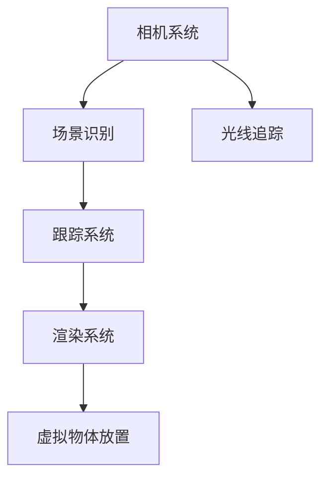

                 

关键词：ARKit，iOS，增强现实，开发指南，技术应用

摘要：本文将深入探讨如何使用 ARKit 在 iOS 设备上创建令人兴奋的增强现实（AR）体验。我们将从背景介绍开始，了解 ARKit 的核心概念和原理，并逐步指导读者通过实际案例和代码示例，掌握 AR 应用开发的技能。

## 1. 背景介绍

随着移动设备的普及和技术的进步，增强现实（AR）已经成为一个热门话题。AR 技术通过将虚拟信息叠加到现实世界中，为用户提供了全新的交互体验。苹果公司通过 ARKit，为开发者提供了一个强大的框架，使其能够在 iOS 设备上轻松地创建 AR 应用。

ARKit 利用了先进的计算机视觉技术和机器学习算法，能够实现实时场景识别、虚拟物体放置、光线追踪等高级功能。这使得开发者能够构建出更加真实、互动的 AR 体验，适用于游戏、教育、医疗等多个领域。

## 2. 核心概念与联系

### 2.1 ARKit 的核心概念

ARKit 的核心概念主要包括：

- **场景识别（Scene Recognition）**：使用深度学习模型对现实场景进行识别和分类。

- **物体识别（Object Recognition）**：识别并跟踪现实世界中的特定物体。

- **虚拟物体放置（Virtual Object Placement）**：将虚拟物体放置在现实世界中，并与现实场景进行交互。

- **光线追踪（Light Tracing）**：模拟光线在真实世界中的传播，为虚拟物体提供更加真实的阴影和光线效果。

### 2.2 ARKit 的架构

ARKit 的架构设计旨在提供高效、低延迟的 AR 体验。其主要组成部分包括：

- **相机系统（Camera System）**：捕获实时视频流，并提供对相机参数的精细控制。

- **场景识别（Scene Recognition）**：利用深度学习模型对场景进行识别和分类。

- **跟踪系统（Tracking System）**：使用机器学习算法实现实时场景和物体跟踪。

- **渲染系统（Rendering System）**：在场景中渲染虚拟物体，并实现与真实世界的交互。

### 2.3 Mermaid 流程图



## 3. 核心算法原理 & 具体操作步骤

### 3.1 算法原理概述

ARKit 的核心算法包括：

- **SLAM（Simultaneous Localization and Mapping）**：同时进行定位和建图。

- **深度学习模型**：用于场景识别和物体识别。

- **光线追踪**：模拟光线在真实世界中的传播。

### 3.2 算法步骤详解

1. **初始化 ARKit 环境**：设置相机参数，并创建 ARSession。

2. **捕获实时视频流**：使用相机系统捕获实时视频流。

3. **场景识别**：使用深度学习模型对场景进行识别和分类。

4. **物体识别**：识别并跟踪现实世界中的特定物体。

5. **虚拟物体放置**：将虚拟物体放置在现实世界中。

6. **光线追踪**：模拟光线在真实世界中的传播，为虚拟物体提供阴影和光线效果。

### 3.3 算法优缺点

- **优点**：高效、低延迟、易用。

- **缺点**：对设备性能有一定要求。

### 3.4 算法应用领域

ARKit 的算法广泛应用于游戏、教育、医疗等领域，如：

- **游戏**：如《Pokémon GO》等 AR 游戏。

- **教育**：通过虚拟物体展示复杂概念，提高学习兴趣。

- **医疗**：进行手术模拟和诊断。

## 4. 数学模型和公式 & 详细讲解 & 举例说明

### 4.1 数学模型构建

ARKit 使用了一系列数学模型来实现其功能，包括：

- **SLAM 模型**：用于同时进行定位和建图。

- **深度学习模型**：用于场景识别和物体识别。

### 4.2 公式推导过程

由于涉及复杂的数学推导，此处将简要介绍关键公式：

- **SLAM 模型**：$$ x_t = f(x_{t-1}, u_t) + w_t $$
  $$ P_t = F(P_{t-1}, u_t) + Q_t $$

- **深度学习模型**：$$ y = \sigma(Wx + b) $$

### 4.3 案例分析与讲解

假设我们要在一个室内场景中放置一个虚拟的茶壶，以下是一个简化的案例：

1. **初始化 ARKit 环境**：设置相机参数，创建 ARSession。

2. **捕获实时视频流**：使用相机系统捕获实时视频流。

3. **场景识别**：使用深度学习模型对场景进行识别，判断当前场景是否为室内。

4. **物体识别**：识别并跟踪室内环境中的平面，如地面。

5. **虚拟物体放置**：将虚拟茶壶放置在识别出的平面上。

6. **光线追踪**：模拟光线在真实世界中的传播，为虚拟茶壶提供阴影和光线效果。

## 5. 项目实践：代码实例和详细解释说明

### 5.1 开发环境搭建

1. **安装 Xcode**：在 macOS 上安装 Xcode，并确保已更新到最新版本。

2. **创建 ARKit 项目**：使用 Xcode 创建一个新的 ARKit 项目。

3. **安装 ARKit SDK**：确保项目中已包含 ARKit SDK。

### 5.2 源代码详细实现

以下是实现一个简单 AR 应用的大致代码结构：

```swift
import UIKit
import ARKit

class ViewController: UIViewController, ARSCNViewDelegate {
    
    // 创建 ARSCNView
    let sceneView = ARSCNView(frame: view.bounds)
    
    override func viewDidLoad() {
        super.viewDidLoad()
        
        // 设置 ARSCNView 的代理
        sceneView.delegate = self
        
        // 设置场景环境
        sceneView.scene = SCNScene()
        
        // 将 ARSCNView 添加到视图中
        view.addSubview(sceneView)
        
        // 启动 ARSession
        let configuration = ARWorldTrackingConfiguration()
        sceneView.session.run(configuration)
    }
    
    // ARSCNViewDelegate 方法
    func renderer(_ renderer: SCNSceneRenderer, nodeFor anchor: ARAnchor) -> SCNNode? {
        // 创建虚拟物体节点
        let node = SCNNode(geometry: SCNBox(width: 0.1, height: 0.1, width: 0.1))
        node.position = anchor.position
        return node
    }
}
```

### 5.3 代码解读与分析

1. **创建 ARSCNView**：使用 ARSCNView 创建一个场景视图，用于渲染 AR 内容。

2. **设置 ARSCNView 的代理**：实现 ARSCNViewDelegate，以便在虚拟物体节点创建时进行响应。

3. **设置场景环境**：创建一个空的 SCNScene 对象，用于容纳 AR 内容。

4. **将 ARSCNView 添加到视图中**：将 ARSCNView 添加到视图层次结构中。

5. **启动 ARSession**：配置 ARWorldTrackingConfiguration，并启动 ARSession。

6. **实现 ARSCNViewDelegate 方法**：在 renderer(_:nodeFor:) 方法中创建虚拟物体节点，并将其位置设置为 ARAnchor 的位置。

### 5.4 运行结果展示

运行应用后，您将看到相机视图，其中虚拟物体节点会根据 ARAnchor 的位置动态更新。

## 6. 实际应用场景

### 6.1 游戏

ARKit 在游戏领域的应用非常广泛，如《Pokémon GO》和《The BitVerse》等。

### 6.2 教育

ARKit 可用于创建互动式的教育应用，帮助学生更好地理解复杂概念。

### 6.3 医疗

ARKit 可用于手术模拟和诊断，提高医疗效率和准确性。

### 6.4 未来应用展望

随着技术的进步，ARKit 在未来有望应用于更多领域，如智能家居、工业设计、建筑模拟等。

## 7. 工具和资源推荐

### 7.1 学习资源推荐

- **官方文档**：ARKit 的官方文档提供了详细的技术指导。

- **ARKit 教程**：在线教程和视频，适合初学者快速上手。

### 7.2 开发工具推荐

- **Xcode**：苹果官方的开发工具，用于创建 ARKit 应用。

- **SwiftUI**：用于构建用户界面的框架，与 ARKit 有很好的集成。

### 7.3 相关论文推荐

- **"ARKit: Building Augmented Reality Apps for iOS"**：一篇介绍 ARKit 的技术细节和最佳实践的论文。

- **"Real-Time Scene Understanding with ARKit"**：一篇关于 ARKit 场景识别的深入研究论文。

## 8. 总结：未来发展趋势与挑战

### 8.1 研究成果总结

ARKit 的问世，为开发者提供了一个强大的 AR 开发框架，推动了 AR 技术在移动设备上的应用。

### 8.2 未来发展趋势

随着硬件性能的提升和算法的优化，ARKit 有望在更广泛的领域得到应用，如虚拟现实、智能眼镜等。

### 8.3 面临的挑战

ARKit 在性能、易用性和兼容性方面仍面临一些挑战，需要持续的技术创新和优化。

### 8.4 研究展望

未来，ARKit 有望与更多技术结合，如人工智能、物联网等，为用户提供更加丰富、真实的 AR 体验。

## 9. 附录：常见问题与解答

### 9.1 ARKit 支持哪些设备？

ARKit 支持 iPhone 6s 及以上设备以及所有 iPad Pro 设备。

### 9.2 如何在 ARKit 中处理不同场景？

ARKit 使用深度学习模型对不同场景进行分类和识别，开发者可以通过配置不同的 ARWorldTrackingConfiguration 来适应不同场景。

---

作者：禅与计算机程序设计艺术 / Zen and the Art of Computer Programming

希望本文能够帮助您更好地理解 ARKit 在 iOS 应用开发中的应用，并激发您在 AR 技术领域的探索与创新。在撰写过程中，如有任何疑问或建议，欢迎随时提出。|

