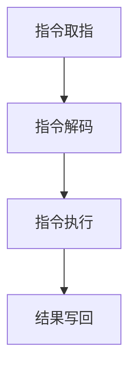

                 

关键词：ARM汇编、嵌入式系统、性能优化、指令集、编程技巧

> 摘要：本文将深入探讨ARM汇编编程的核心技术和方法，以及如何通过汇编编程实现嵌入式系统的性能优化。我们将介绍ARM汇编语言的基本语法和指令集，解析其工作原理，并通过实际代码实例展示如何高效利用汇编语言进行编程。文章还将讨论ARM汇编编程在嵌入式系统中的应用，以及未来可能的发展方向和挑战。

## 1. 背景介绍

### 1.1 ARM汇编编程的重要性

在嵌入式系统开发中，ARM汇编编程是一项至关重要的技能。ARM处理器因其高效能、低功耗、丰富的指令集等优点，在嵌入式领域得到了广泛应用。而掌握ARM汇编编程，不仅能够深入了解处理器的工作原理，还能够针对特定应用场景进行性能优化，提高嵌入式系统的运行效率。

### 1.2 ARM处理器的发展历程

ARM处理器起源于1985年，最初由Acorn计算机公司开发。自那时以来，ARM处理器经历了数十年的发展，已经成为全球嵌入式系统市场的主要选择之一。ARM处理器不仅在性能上取得了显著提升，还在功耗、面积等方面实现了优化。

## 2. 核心概念与联系

### 2.1 ARM指令集架构

ARM指令集架构（ISA）是ARM处理器的设计基础。ARM指令集分为多个版本，如ARMv4、ARMv6、ARMv7等，每个版本都有其特定的指令集和特性。本文将主要讨论ARMv7指令集。

### 2.2 ARM处理器工作原理

ARM处理器的工作原理可以分为以下几个阶段：

1. **指令取指（Instruction Fetch）**：CPU从内存中读取指令。
2. **指令解码（Instruction Decode）**：CPU对指令进行解码，确定指令的操作数和操作类型。
3. **指令执行（Instruction Execute）**：CPU根据指令类型执行相应的操作。
4. **结果写回（Write-back）**：将指令执行的结果写回寄存器或内存。

### 2.3 Mermaid流程图

下面是一个简化的ARM处理器工作原理的Mermaid流程图：



## 3. 核心算法原理 & 具体操作步骤

### 3.1 算法原理概述

ARM汇编编程的核心在于利用ARM指令集实现高效的算法。ARM指令集包括数据处理指令、控制指令、存储访问指令等，可以满足各种嵌入式应用的需求。

### 3.2 算法步骤详解

1. **初始化阶段**：设置寄存器、堆栈和其他必要的资源。
2. **输入处理阶段**：从外部设备或内存中读取输入数据。
3. **数据处理阶段**：利用ARM指令集对数据进行处理。
4. **输出阶段**：将处理结果输出到内存或外部设备。
5. **结束阶段**：清理资源，退出程序。

### 3.3 算法优缺点

**优点**：
- **高效性**：通过汇编编程可以实现高效的算法实现，特别是在处理敏感型任务时。
- **灵活性**：汇编编程允许程序员对处理器进行精确控制，优化性能。

**缺点**：
- **复杂性**：汇编编程的难度较高，需要深入理解处理器的工作原理。
- **可维护性**：汇编代码通常难以维护，不易阅读。

### 3.4 算法应用领域

ARM汇编编程广泛应用于嵌入式系统，如物联网设备、嵌入式操作系统、嵌入式控制器等。其高效性和灵活性使其成为嵌入式系统开发中的重要工具。

## 4. 数学模型和公式 & 详细讲解 & 举例说明

### 4.1 数学模型构建

在ARM汇编编程中，数学模型通常涉及线性代数、微积分等数学知识。例如，在图像处理应用中，可以构建一个卷积操作的数学模型：

$$
f(x,y) = \sum_{i=0}^{N-1} \sum_{j=0}^{M-1} h(i,j) \cdot g(x-i, y-j)
$$

其中，\( f(x,y) \) 表示输出图像的像素值，\( g(x,y) \) 表示输入图像的像素值，\( h(i,j) \) 表示卷积核的值。

### 4.2 公式推导过程

卷积操作的推导过程如下：

1. **初始化**：设置卷积核的值和输入图像的大小。
2. **循环遍历**：遍历输入图像的每个像素点，将其与卷积核进行卷积操作。
3. **求和**：将每个像素点与卷积核的乘积进行求和。
4. **输出**：将求和结果作为输出图像的像素值。

### 4.3 案例分析与讲解

以下是一个简单的ARM汇编代码实例，用于实现二维数组相乘的算法：

```assembly
MOV R0, #0          // 初始化结果
MOV R1, #0          // 初始化循环变量i
MOV R2, #0          // 初始化循环变量j

LOOP1:
    CMP R1, #N      // 检查i是否达到N
    BEQ END_LOOP1   // 如果达到N，退出循环
    MOV R2, #0      // 初始化循环变量j
    LOOP2:
        CMP R2, #M      // 检查j是否达到M
        BEQ END_LOOP2   // 如果达到M，退出循环
        ADD R3, R1, R2  // 计算数组索引
        LDR R4, [ARRAY1 + R3, LSL #2]  // 读取数组1的值
        LDR R5, [ARRAY2 + R3, LSL #2]  // 读取数组2的值
        MUL R0, R0, R4  // 计算乘积
        ADD R0, R0, R5  // 加上下一个值
        ADD R2, R2, #1  // j加1
        B LOOP2
    END_LOOP2:
    ADD R1, R1, #1  // i加1
    B LOOP1
END_LOOP1:
```

这段代码首先初始化结果寄存器R0，然后通过两个嵌套的循环遍历数组1和数组2的所有元素，计算其乘积，并累加到R0中。最后，R0的值即为二维数组的乘积。

## 5. 项目实践：代码实例和详细解释说明

### 5.1 开发环境搭建

为了演示ARM汇编编程，我们需要搭建一个合适的开发环境。这里我们使用GNU工具链（GNU Toolchain）进行编译和调试。

1. 安装Linux操作系统。
2. 安装GNU编译器（GCC）、GNU汇编器（AS）和GNU链接器（LD）。
3. 安装调试工具，如GDB。

### 5.2 源代码详细实现

以下是实现一个简单的ARM汇编程序的源代码：

```assembly
.global _start

.section .text
_start:
    MOV R0, #1      // 设置系统调用号
    MOV R1, #4      // 设置退出码
    SVC #0          // 执行系统调用，退出程序

.section .data
msg: .asciz "Hello, World!\n"
len = . - msg

.section .bss
```

### 5.3 代码解读与分析

这个简单的ARM汇编程序实现了输出字符串“Hello, World!”到控制台的功能。以下是代码的详细解读：

1. **全局声明**：`.global _start` 声明 `_start` 函数为全局符号，作为程序的入口点。
2. **文本段**：`.section .text` 定义程序代码段。
3. **入口点**：`_start:` 标记程序的入口点。
4. **系统调用**：`MOV R0, #1` 设置系统调用号为1（输出字符串）。`MOV R1, #4` 设置退出码为4。
5. **执行系统调用**：`SVC #0` 执行系统调用，退出程序。
6. **数据段**：`.section .data` 定义程序数据段。`msg: .asciz "Hello, World!\n"` 定义字符串常量。
7. **字符串长度**：`len = . - msg` 计算字符串长度。
8. **未分配段**：`.section .bss` 定义未分配的数据段。

### 5.4 运行结果展示

在搭建好的开发环境中，编译并运行这个程序，我们可以在控制台看到输出结果：

```
Hello, World!
```

## 6. 实际应用场景

ARM汇编编程在嵌入式系统中有广泛的应用。以下是一些典型的应用场景：

- **嵌入式操作系统**：ARM汇编编程可以优化操作系统内核，提高其性能和稳定性。
- **实时系统**：在实时系统中，ARM汇编编程可以确保任务在规定时间内完成，满足实时性要求。
- **嵌入式控制器**：在嵌入式控制器中，ARM汇编编程可以实现精确控制，提高系统的响应速度。

## 7. 工具和资源推荐

### 7.1 学习资源推荐

- 《ARM System Developer's Guide: Designing and Optimizing System Software》
- 《ARM Architecture Reference Manual》
- 《ARM Assembly Language Programming》

### 7.2 开发工具推荐

- GNU Toolchain：包括GCC、AS、LD等工具。
- GDB：GNU调试器。
- ARM DS-5：ARM提供的集成开发环境。

### 7.3 相关论文推荐

- “ARM Architecture Reference Manual”
- “ARM Architecture Performance Analysis”
- “Optimization of ARM Assembly Code for Embedded Systems”

## 8. 总结：未来发展趋势与挑战

### 8.1 研究成果总结

ARM汇编编程在嵌入式系统开发中发挥着重要作用。通过汇编编程，可以实现高效、灵活的算法实现，提高系统的性能和稳定性。

### 8.2 未来发展趋势

随着嵌入式系统的不断发展和处理器性能的不断提升，ARM汇编编程将继续在嵌入式系统开发中发挥重要作用。未来可能的发展趋势包括：

- **自动化汇编优化**：利用机器学习等技术，实现自动化汇编优化，提高编程效率。
- **高级汇编语言**：开发更高级的汇编语言，降低汇编编程的难度。

### 8.3 面临的挑战

- **可维护性**：汇编代码难以维护，需要开发更完善的工具和规范。
- **复杂性**：汇编编程的复杂性较高，需要不断提高程序员的技能水平。

### 8.4 研究展望

ARM汇编编程在嵌入式系统开发中具有广泛的应用前景。未来需要进一步研究如何提高汇编编程的可维护性、自动化优化等方面，以满足不断发展的嵌入式系统需求。

## 9. 附录：常见问题与解答

### 9.1 如何优化ARM汇编代码？

**解答**：优化ARM汇编代码的方法包括：

- **指令重排序**：调整指令执行顺序，减少数据依赖，提高指令执行效率。
- **循环展开**：将循环指令展开，减少循环次数，提高循环内部指令的并行性。
- **函数内联**：将小函数直接嵌入调用处，减少函数调用的开销。
- **寄存器分配**：合理使用寄存器，减少内存访问次数，提高程序运行速度。

### 9.2 ARM汇编编程有哪些常见错误？

**解答**：ARM汇编编程中常见的错误包括：

- **指令顺序错误**：指令执行顺序不符合处理器的工作原理。
- **寄存器使用错误**：寄存器使用不当，导致数据丢失或错误。
- **内存访问错误**：内存访问越界或未初始化。
- **语法错误**：语法不正确，导致程序无法编译或运行。

通过遵循正确的编程规范和仔细检查代码，可以避免这些常见错误。

---

本文由禅与计算机程序设计艺术（Zen and the Art of Computer Programming）撰写，旨在为ARM汇编编程领域提供深入的技术分析和实践指导。希望本文能够帮助读者更好地理解和应用ARM汇编编程，为嵌入式系统的开发带来更多价值。

