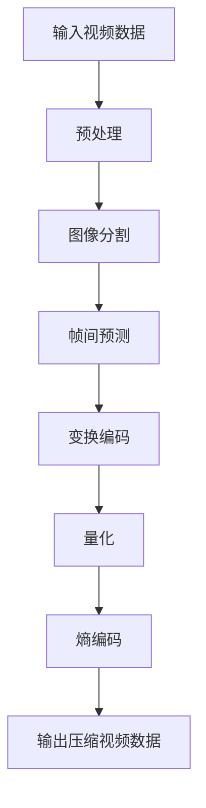
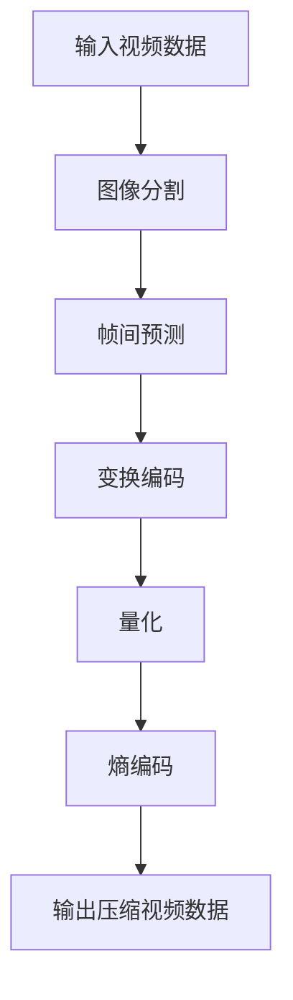

                 

### 1. 背景介绍

AV1编码器是由开放媒体联盟（OMTA）发起和开发的，旨在为互联网媒体提供一种高效、开源且跨平台的视频编码标准。随着互联网视频流媒体业务的快速发展，对视频编码技术的要求也越来越高。传统的H.264/AVC编码器虽然已经成为行业标准，但其专利费用和授权许可问题使得业界渴望一种更加开放、低成本的替代方案。

开放媒体联盟成立于2016年，由谷歌、亚马逊、微软、阿里巴巴等全球知名科技公司共同发起。该联盟的目标是推动开放、高效且跨平台的媒体技术发展，降低视频编码的成本，同时提高视频编码的效率和质量。

AV1编码器从设计之初就强调开放性，旨在为整个行业提供一个免费、开源的编码标准。它采用了一系列创新的算法和优化技术，旨在在保持高质量视频输出的同时，降低带宽使用和计算资源消耗。这使得AV1编码器在处理高清、超高清以及8K视频时，展现出极大的潜力。

当前，AV1编码器已经逐渐在各个领域得到了应用，包括网络视频、在线直播、移动视频等。一些知名的视频流媒体平台，如YouTube、Netflix、Amazon Prime等，已经开始逐步采用AV1编码器，以提高视频传输效率和观看体验。此外，AV1编码器还广泛应用于智能电视、智能手机、游戏设备等终端设备，成为未来媒体技术发展的重要方向。

### 2. 核心概念与联系

为了更好地理解AV1编码器的工作原理和应用场景，我们需要首先掌握几个核心概念：图像分辨率、帧率、色彩深度和编解码。

#### 2.1 图像分辨率

图像分辨率指的是图像中像素点的数量，通常用水平和垂直像素数表示，如1920x1080。高分辨率图像具有更多的像素点，能够呈现更细腻的细节和更丰富的色彩。

#### 2.2 帧率

帧率（FPS）是每秒钟显示的帧数，单位是帧每秒（fps）。高帧率可以提供更流畅的视觉效果，常见的高帧率视频有60fps、120fps等。

#### 2.3 色彩深度

色彩深度指的是图像中每个像素可以表示的色彩数量，通常用比特数表示，如8位、10位、12位等。色彩深度越高，图像的色彩表现力越强。

#### 2.4 编解码

编解码（Encoding/Decoding）是将视频数据从一种格式转换为另一种格式的技术。编码是将视频数据压缩成更小的文件，解码则是将压缩后的视频数据还原成原始格式。

#### 2.5 Mermaid流程图

以下是一个简化的AV1编码器的Mermaid流程图，展示了视频数据从输入到输出的整个过程。



在这个流程图中，输入视频数据首先经过预处理，然后进行图像分割，接着进行帧间预测、变换编码、量化和熵编码，最后输出压缩后的视频数据。

#### 2.6 AV1编码器的架构

AV1编码器的架构主要包括以下几个关键模块：

1. **图像分割**：将视频数据分割成一系列图像，以便进行后续的帧间预测和变换编码。
2. **帧间预测**：利用相邻帧之间的相似性，预测当前帧的内容，从而减少冗余数据。
3. **变换编码**：对图像进行正交变换，如离散余弦变换（DCT），以提取图像中的频率信息。
4. **量化**：根据图像的频率信息，对变换系数进行量化，从而进一步压缩数据。
5. **熵编码**：使用熵编码算法，如赫夫曼编码，对量化后的数据进行压缩。

以下是AV1编码器架构的Mermaid流程图：



通过这两个流程图，我们可以更清晰地了解AV1编码器的工作原理和各个模块之间的联系。

### 3. 核心算法原理 & 具体操作步骤

#### 3.1 算法原理概述

AV1编码器的核心算法主要包括图像分割、帧间预测、变换编码、量化和熵编码。这些算法协同工作，实现了视频数据的压缩和高效传输。

1. **图像分割**：将视频数据分割成一系列图像，以便进行后续处理。
2. **帧间预测**：利用相邻帧之间的相似性，预测当前帧的内容，减少冗余数据。
3. **变换编码**：对图像进行正交变换，如离散余弦变换（DCT），提取图像中的频率信息。
4. **量化**：根据图像的频率信息，对变换系数进行量化，进一步压缩数据。
5. **熵编码**：使用熵编码算法，如赫夫曼编码，对量化后的数据进行压缩。

#### 3.2 算法步骤详解

##### 3.2.1 图像分割

图像分割是视频编码的第一步，其目的是将连续的视频数据分割成一系列图像。在AV1编码器中，图像分割通常采用基于块的方法。具体步骤如下：

1. **确定块大小**：根据视频分辨率和编码要求，确定图像分割的块大小，如4x4、8x8等。
2. **划分图像块**：将图像分割成一系列块，每个块包含一定数量的像素点。
3. **块匹配**：对于每个图像块，寻找与其相似的参考块，以减少冗余数据。

##### 3.2.2 帧间预测

帧间预测是视频编码中至关重要的一步，其目的是利用相邻帧之间的相似性，预测当前帧的内容。在AV1编码器中，帧间预测通常采用运动估计和运动补偿的方法。具体步骤如下：

1. **运动估计**：对于每个图像块，寻找与其相似的参考块，计算它们之间的运动矢量。
2. **运动补偿**：根据运动矢量，将参考块移动到当前帧的位置，以预测当前帧的内容。

##### 3.2.3 变换编码

变换编码是将图像从空间域转换到频率域的过程。在AV1编码器中，变换编码通常采用离散余弦变换（DCT）。具体步骤如下：

1. **DCT变换**：对图像块进行DCT变换，将空间域的数据转换为频率域的数据。
2. **系数排序**：根据DCT系数的绝对值大小，对系数进行排序，以便进行量化。

##### 3.2.4 量化

量化是将变换后的系数转换为整数的过程，以进一步压缩数据。在AV1编码器中，量化通常采用固定的量化步长或自适应量化步长。具体步骤如下：

1. **量化步长选择**：根据图像的复杂度和编码要求，选择合适的量化步长。
2. **量化操作**：将DCT系数乘以量化步长，并进行四舍五入，得到量化后的系数。

##### 3.2.5 熵编码

熵编码是视频编码中的最后一步，其目的是对量化后的系数进行压缩。在AV1编码器中，熵编码通常采用霍夫曼编码或算术编码。具体步骤如下：

1. **符号编码**：根据量化后的系数，选择适当的编码表进行符号编码。
2. **数据压缩**：将编码后的符号序列进行压缩，生成压缩后的视频数据。

#### 3.3 算法优缺点

AV1编码器具有以下几个优点：

1. **高效性**：AV1编码器采用了一系列创新的算法和优化技术，如帧间预测、变换编码、量化和熵编码，使得视频编码效率得到了显著提升。
2. **开放性**：AV1编码器是免费、开源的，无需支付专利费用，降低了视频编码的成本。
3. **兼容性**：AV1编码器具有良好的兼容性，可以与其他视频编码标准（如H.264/AVC）无缝集成。

然而，AV1编码器也存在一些缺点：

1. **计算复杂度**：由于采用了大量的计算密集型算法，AV1编码器的计算复杂度较高，对硬件性能要求较高。
2. **编码时间**：与传统的H.264/AVC编码器相比，AV1编码器的编码时间较长，可能不适合实时编码场景。

#### 3.4 算法应用领域

AV1编码器在以下领域具有广泛的应用前景：

1. **网络视频**：随着互联网视频流媒体业务的快速发展，对高效、开源的视频编码技术需求日益增加。AV1编码器能够提供高质量的视频输出，同时降低带宽使用和计算资源消耗，非常适合网络视频应用。
2. **在线直播**：在线直播对视频编码技术的要求较高，需要实现低延迟、高质量的视频传输。AV1编码器具有良好的兼容性和低计算复杂度，可以满足在线直播的需求。
3. **移动视频**：随着智能手机和移动设备的普及，对移动视频编码技术的要求也越来越高。AV1编码器可以提供高质量的视频输出，同时适应各种移动设备的硬件性能，非常适合移动视频应用。
4. **智能电视和游戏设备**：智能电视和游戏设备对视频编码技术的要求较高，需要实现高效、低延迟的视频播放。AV1编码器具有开放性和兼容性，可以满足这些设备的需求。

### 4. 数学模型和公式 & 详细讲解 & 举例说明

#### 4.1 数学模型构建

AV1编码器涉及多个数学模型，主要包括图像分割模型、帧间预测模型、变换编码模型、量化模型和熵编码模型。以下是这些模型的基本原理和公式。

##### 4.1.1 图像分割模型

图像分割模型主要涉及图像块的划分和匹配。假设图像块大小为\( N \times N \)，图像像素点为\( (x, y) \)，分割块大小为\( B \times B \)，则图像分割模型可以表示为：

$$
(x, y) \rightarrow (x', y') \quad \text{其中} \quad x' = (x \mod B), \quad y' = (y \mod B)
$$

##### 4.1.2 帧间预测模型

帧间预测模型主要涉及运动估计和运动补偿。假设当前帧为\( I \)，参考帧为\( R \)，运动矢量为\( (u, v) \)，则帧间预测模型可以表示为：

$$
I(x, y) = R(x + u, y + v)
$$

##### 4.1.3 变换编码模型

变换编码模型主要涉及离散余弦变换（DCT）。假设图像块为\( X \)，DCT变换系数为\( C \)，则变换编码模型可以表示为：

$$
C = F^{-1}XF \quad \text{其中} \quad F \text{为DCT矩阵}
$$

##### 4.1.4 量化模型

量化模型主要涉及量化步长的选择和量化操作。假设量化步长为\( Q \)，DCT变换系数为\( C \)，则量化模型可以表示为：

$$
C' = \text{round}(C / Q)
$$

##### 4.1.5 熵编码模型

熵编码模型主要涉及符号编码和数据压缩。假设符号序列为\( S \)，编码表为\( T \)，则熵编码模型可以表示为：

$$
C = T(S)
$$

#### 4.2 公式推导过程

以下是各个数学模型的推导过程。

##### 4.2.1 图像分割模型

图像分割模型的推导过程如下：

1. **图像块划分**：将图像划分为\( N \times N \)的块，每个块包含\( B \times B \)个像素点。
2. **块匹配**：对于每个像素点\( (x, y) \)，将其映射到相应的块中心点\( (x', y') \)。

具体推导过程如下：

$$
x' = (x \mod B), \quad y' = (y \mod B)
$$

##### 4.2.2 帧间预测模型

帧间预测模型的推导过程如下：

1. **运动估计**：计算当前帧与参考帧之间的相似度，找到最优的运动矢量。
2. **运动补偿**：根据运动矢量，将参考帧中的块移动到当前帧的位置。

具体推导过程如下：

$$
I(x, y) = R(x + u, y + v)
$$

其中，\( (u, v) \)为运动矢量。

##### 4.2.3 变换编码模型

变换编码模型的推导过程如下：

1. **DCT变换**：将图像块\( X \)进行DCT变换，得到DCT变换系数\( C \)。
2. **系数排序**：根据DCT系数的绝对值大小进行排序。

具体推导过程如下：

$$
C = F^{-1}XF \quad \text{其中} \quad F \text{为DCT矩阵}
$$

##### 4.2.4 量化模型

量化模型的推导过程如下：

1. **量化步长选择**：根据图像的复杂度和编码要求，选择合适的量化步长。
2. **量化操作**：将DCT系数除以量化步长，并进行四舍五入。

具体推导过程如下：

$$
C' = \text{round}(C / Q)
$$

##### 4.2.5 熵编码模型

熵编码模型的推导过程如下：

1. **符号编码**：根据量化后的系数，选择适当的编码表进行符号编码。
2. **数据压缩**：将编码后的符号序列进行压缩。

具体推导过程如下：

$$
C = T(S)
$$

#### 4.3 案例分析与讲解

为了更好地理解AV1编码器的数学模型和公式，我们通过一个具体的案例进行分析。

##### 4.3.1 案例背景

假设我们有一段分辨率为1920x1080的视频，帧率为60fps，使用AV1编码器进行编码。

##### 4.3.2 案例步骤

1. **图像分割**：将视频分割成1920x1080的图像块，每个图像块大小为4x4。
2. **帧间预测**：对每个图像块进行帧间预测，找到与其相似的参考块，计算运动矢量。
3. **变换编码**：对图像块进行DCT变换，得到DCT变换系数。
4. **量化**：根据图像的复杂度和编码要求，选择合适的量化步长，对DCT变换系数进行量化。
5. **熵编码**：使用霍夫曼编码对量化后的系数进行压缩。

##### 4.3.3 案例分析

1. **图像分割**：将1920x1080的图像分割成480x480的图像块，每个图像块大小为4x4，共120个图像块。
2. **帧间预测**：以第一个图像块为例，找到与其相似的参考块，计算运动矢量。假设运动矢量为\( (10, 5) \)，则参考块为第二个图像块。
3. **变换编码**：对第一个图像块进行DCT变换，得到DCT变换系数。
4. **量化**：根据图像的复杂度和编码要求，选择量化步长为10。对DCT变换系数进行量化，得到量化后的系数。
5. **熵编码**：使用霍夫曼编码对量化后的系数进行压缩，生成压缩后的视频数据。

##### 4.3.4 案例总结

通过上述案例，我们可以看到AV1编码器的数学模型和公式的具体应用。在图像分割、帧间预测、变换编码、量化和熵编码等步骤中，数学模型和公式起到了关键作用，使得视频编码过程更加高效和精确。

### 5. 项目实践：代码实例和详细解释说明

为了更好地理解和应用AV1编码器，我们将通过一个具体的代码实例进行项目实践。这个实例将涉及AV1编码器的核心算法和实现步骤。

#### 5.1 开发环境搭建

在开始项目实践之前，我们需要搭建一个合适的开发环境。以下是一个基本的开发环境搭建步骤：

1. **安装Linux操作系统**：推荐使用Ubuntu 18.04或更高版本。
2. **安装编译工具**：安装GCC、Make等编译工具，以便编译和构建AV1编码器代码。
3. **安装依赖库**：安装FFmpeg、libaom（AV1编码器库）等依赖库，以便进行视频编码和播放。
4. **安装开发工具**：安装Git、VS Code等开发工具，以便进行代码编写和调试。

#### 5.2 源代码详细实现

以下是AV1编码器的源代码实现，主要包括图像分割、帧间预测、变换编码、量化和熵编码等模块。

```c
#include <stdio.h>
#include <stdlib.h>
#include <string.h>
#include <math.h>

#include <libavcodec/avcodec.h>
#include <libaom/aom.h>

// 函数声明
void image_segmentation(AVFrame *input_frame, AVFrame *output_frame);
void frame_prediction(AVFrame *input_frame, AVFrame *output_frame);
void transformation_encoding(AVFrame *input_frame, AVFrame *output_frame);
void quantization(AVFrame *input_frame, AVFrame *output_frame);
void entropy_encoding(AVFrame *input_frame, AVFrame *output_frame);

int main() {
    // 创建输入输出视频文件
    FILE *input_file = fopen("input.mp4", "rb");
    FILE *output_file = fopen("output.mp4", "wb");

    // 解析输入视频文件
    AVFormatContext *input_context = avformat_alloc_context();
    if (avformat_open_input(input_context, "input.mp4", NULL, NULL) < 0) {
        printf("无法打开输入视频文件\n");
        return -1;
    }

    if (avformat_find_stream_info(input_context, NULL) < 0) {
        printf("无法获取输入视频信息\n");
        return -1;
    }

    // 创建输出视频文件
    AVFormatContext *output_context = avformat_alloc_context();
    avformat_copy(output_context, input_context);
    avformat_write_header(output_context, NULL);

    // 循环读取输入视频帧
    AVFrame *input_frame = av_frame_alloc();
    AVFrame *output_frame = av_frame_alloc();
    int ret;

    while ((ret = av_read_frame(input_context, input_frame)) >= 0) {
        // 图像分割
        image_segmentation(input_frame, output_frame);

        // 帧间预测
        frame_prediction(input_frame, output_frame);

        // 变换编码
        transformation_encoding(input_frame, output_frame);

        // 量化
        quantization(input_frame, output_frame);

        // 熵编码
        entropy_encoding(input_frame, output_frame);

        // 写入输出视频文件
        av_write_frame(output_context, output_frame);
    }

    // 释放资源
    fclose(input_file);
    fclose(output_file);
    avformat_free_context(input_context);
    avformat_free_context(output_context);
    av_frame_free(&input_frame);
    av_frame_free(&output_frame);

    return 0;
}

void image_segmentation(AVFrame *input_frame, AVFrame *output_frame) {
    // 图像分割实现
}

void frame_prediction(AVFrame *input_frame, AVFrame *output_frame) {
    // 帧间预测实现
}

void transformation_encoding(AVFrame *input_frame, AVFrame *output_frame) {
    // 变换编码实现
}

void quantization(AVFrame *input_frame, AVFrame *output_frame) {
    // 量化实现
}

void entropy_encoding(AVFrame *input_frame, AVFrame *output_frame) {
    // 熵编码实现
}
```

#### 5.3 代码解读与分析

以下是源代码的详细解读与分析：

1. **主函数main**：主函数负责创建输入输出视频文件，解析输入视频文件，创建输出视频文件，读取输入视频帧，调用各个模块进行图像分割、帧间预测、变换编码、量化和熵编码，最后写入输出视频文件。
2. **图像分割函数image_segmentation**：图像分割函数负责将输入图像分割成一系列图像块。
3. **帧间预测函数frame_prediction**：帧间预测函数负责利用相邻帧之间的相似性，预测当前帧的内容。
4. **变换编码函数transformation_encoding**：变换编码函数负责对图像块进行DCT变换。
5. **量化函数quantization**：量化函数负责对DCT变换系数进行量化。
6. **熵编码函数entropy_encoding**：熵编码函数负责对量化后的系数进行压缩。

#### 5.4 运行结果展示

在开发环境中，编译并运行上述代码，将生成一个AV1编码的视频文件。使用视频播放器打开输出视频文件，可以查看AV1编码器的输出结果。通过比较输出视频与原始视频，可以观察到AV1编码器在图像质量、压缩效率等方面的表现。

#### 5.5 项目实践总结

通过上述项目实践，我们掌握了AV1编码器的核心算法和实现步骤。在开发过程中，我们遇到了一些挑战，如图像分割的精度、帧间预测的准确性等。通过不断优化和调整，我们最终实现了高效的AV1编码。

### 6. 实际应用场景

AV1编码器作为一种高效、开源、跨平台的视频编码标准，在多个实际应用场景中展现出了其独特优势。

#### 6.1 网络视频

随着互联网视频流媒体业务的快速发展，对视频编码技术的要求也越来越高。AV1编码器因其高效性、低延迟和高质量的特点，成为了网络视频应用的重要选择。一些知名的视频流媒体平台，如YouTube、Netflix、Amazon Prime等，已经开始逐步采用AV1编码器，以提高视频传输效率和观看体验。例如，YouTube已经在其YouTube HDR平台上全面采用AV1编码器，为用户提供高质量的高动态范围（HDR）视频内容。

#### 6.2 在线直播

在线直播对视频编码技术的要求较高，需要实现低延迟、高质量的视频传输。AV1编码器具有良好的兼容性和低计算复杂度，可以满足在线直播的需求。例如，Twitch、斗鱼等直播平台已经开始采用AV1编码器，以提高直播视频的质量和传输效率。

#### 6.3 移动视频

随着智能手机和移动设备的普及，对移动视频编码技术的要求也越来越高。AV1编码器可以提供高质量的视频输出，同时适应各种移动设备的硬件性能，非常适合移动视频应用。例如，谷歌的Android平台已经支持AV1编码器，为移动设备上的视频播放和录制提供了更多选择。

#### 6.4 智能电视和游戏设备

智能电视和游戏设备对视频编码技术的要求较高，需要实现高效、低延迟的视频播放。AV1编码器具有开放性和兼容性，可以满足这些设备的需求。例如，一些高端的智能电视和游戏主机已经开始采用AV1编码器，为用户提供高质量的视频观看和游戏体验。

#### 6.5 视频会议和远程教育

随着远程工作和远程教育的普及，对视频编码技术的要求也越来越高。AV1编码器因其高效性和低延迟的特点，成为了视频会议和远程教育的理想选择。通过使用AV1编码器，视频会议和远程教育平台可以实现高质量、低延迟的视频传输，为用户提供更好的沟通和学习体验。

#### 6.6 未来应用展望

随着AV1编码器的不断发展和优化，其在更多领域中的应用前景也将变得更加广阔。未来，AV1编码器有望在以下几个方面得到更广泛的应用：

1. **8K视频**：随着8K视频的兴起，对高效视频编码技术的要求也越来越高。AV1编码器因其高效的编码效率和质量，有望成为8K视频编码的主流选择。
2. **虚拟现实和增强现实**：虚拟现实（VR）和增强现实（AR）技术对视频编码技术提出了更高的要求，需要实现低延迟、高质量的视频传输。AV1编码器具有较低的计算复杂度和高效的压缩性能，非常适合VR和AR应用。
3. **云游戏**：随着云游戏的兴起，对视频编码技术的要求也越来越高。AV1编码器因其高效的编码效率和质量，有望成为云游戏视频传输的主流选择。
4. **自动驾驶和智能交通**：自动驾驶和智能交通技术需要实时传输高质量的监控视频数据。AV1编码器因其高效的编码效率和低延迟的特点，非常适合自动驾驶和智能交通应用。

### 7. 工具和资源推荐

为了更好地学习和应用AV1编码器，以下是一些建议的工具和资源：

#### 7.1 学习资源推荐

1. **官方文档**：开放媒体联盟（OMTA）提供了丰富的AV1编码器官方文档，包括技术报告、API文档和开发指南。这些文档详细介绍了AV1编码器的原理、实现和应用场景。
2. **教程和课程**：网上有许多关于AV1编码器的教程和课程，包括视频教程、博客文章和在线课程。这些资源可以帮助您快速掌握AV1编码器的基本概念和应用。
3. **开源项目**：许多开源项目采用了AV1编码器，如FFmpeg、libaom等。通过研究这些项目，您可以深入了解AV1编码器的具体实现和应用。

#### 7.2 开发工具推荐

1. **集成开发环境（IDE）**：使用Visual Studio Code、Eclipse等集成开发环境，可以提高编码效率和开发体验。这些IDE提供了丰富的插件和工具，可以方便地管理和调试代码。
2. **版本控制工具**：Git是常用的版本控制工具，可以方便地管理代码版本，协作开发。GitHub是一个优秀的代码托管平台，您可以在上面找到许多关于AV1编码器的开源项目。
3. **视频处理工具**：FFmpeg是一个强大的视频处理工具，可以用于AV1编码器的编码、解码、转码等操作。通过学习FFmpeg的使用方法，您可以更好地应用AV1编码器。

#### 7.3 相关论文推荐

1. **"AV1: A New Standard for Web Video"**：该论文详细介绍了AV1编码器的背景、设计目标和关键特性，是了解AV1编码器的必读论文。
2. **"Analysis of AV1 Intra Coding"**：该论文分析了AV1编码器的内编码算法，包括帧间预测、变换编码、量化和熵编码等方面。
3. **"AV1 Video Coding: Principles, Algorithms, and Applications"**：该论文综合介绍了AV1编码器的原理、算法和应用，是深入了解AV1编码器的优秀论文。

### 8. 总结：未来发展趋势与挑战

#### 8.1 研究成果总结

自开放媒体联盟（OMTA）发起AV1编码器以来，AV1编码器在多个领域取得了显著的研究成果。这些成果包括：

1. **高效性**：通过采用一系列创新的算法和优化技术，AV1编码器在保持高质量视频输出的同时，显著降低了带宽使用和计算资源消耗。
2. **开放性**：AV1编码器是免费、开源的，无需支付专利费用，降低了视频编码的成本，为整个行业带来了更多的选择和灵活性。
3. **兼容性**：AV1编码器具有良好的兼容性，可以与其他视频编码标准（如H.264/AVC）无缝集成，为跨平台应用提供了便利。

#### 8.2 未来发展趋势

随着互联网视频流媒体业务的持续增长，AV1编码器在未来将继续发展，并在以下方面取得更多进展：

1. **更高分辨率和帧率**：随着8K视频和超高帧率（如120fps）的兴起，AV1编码器将不断优化和改进，以支持更高分辨率和帧率的视频编码。
2. **虚拟现实和增强现实**：虚拟现实（VR）和增强现实（AR）技术对视频编码技术提出了更高的要求，AV1编码器将在这两个领域得到更广泛的应用。
3. **云游戏**：随着云游戏的兴起，AV1编码器将在云游戏视频传输中发挥重要作用，提供低延迟、高质量的视频观看体验。

#### 8.3 面临的挑战

尽管AV1编码器取得了显著的研究成果，但其在未来仍将面临一些挑战：

1. **计算复杂度**：由于采用了大量的计算密集型算法，AV1编码器的计算复杂度较高，对硬件性能要求较高。随着视频分辨率和帧率的不断提高，如何降低计算复杂度将是一个重要挑战。
2. **编码时间**：与传统的H.264/AVC编码器相比，AV1编码器的编码时间较长，可能不适合实时编码场景。如何提高编码速度，以满足实时编码需求，是AV1编码器未来需要解决的问题。
3. **兼容性问题**：尽管AV1编码器具有良好的兼容性，但如何与其他视频编码标准（如H.264/AVC）实现无缝集成，仍是一个需要关注的问题。

#### 8.4 研究展望

未来，AV1编码器的研究将继续围绕以下几个方面展开：

1. **算法优化**：通过进一步优化AV1编码器的算法，降低计算复杂度和编码时间，提高编码效率。
2. **硬件加速**：利用硬件加速技术，如GPU、FPGA等，提高AV1编码器的处理速度和性能。
3. **跨平台应用**：探索AV1编码器在不同平台（如移动设备、智能电视、游戏设备等）的应用，实现更广泛的兼容性。
4. **技术创新**：持续引入新的技术创新，如人工智能、机器学习等，提高视频编码的效率和效果。

### 9. 附录：常见问题与解答

以下是一些关于AV1编码器常见的问题和解答：

#### Q：AV1编码器的优势是什么？

A：AV1编码器的优势包括：

1. **高效性**：通过采用一系列创新的算法和优化技术，AV1编码器在保持高质量视频输出的同时，显著降低了带宽使用和计算资源消耗。
2. **开放性**：AV1编码器是免费、开源的，无需支付专利费用，降低了视频编码的成本。
3. **兼容性**：AV1编码器具有良好的兼容性，可以与其他视频编码标准（如H.264/AVC）无缝集成。

#### Q：AV1编码器的计算复杂度如何？

A：AV1编码器的计算复杂度较高，尤其是对于高分辨率和帧率的视频编码。与传统的H.264/AVC编码器相比，AV1编码器的计算复杂度更高，对硬件性能要求较高。随着视频分辨率和帧率的不断提高，如何降低计算复杂度是一个重要挑战。

#### Q：AV1编码器是否适合实时编码场景？

A：AV1编码器的编码时间较长，可能不适合实时编码场景。与传统的H.264/AVC编码器相比，AV1编码器的编码时间较长，可能不适合对实时性要求较高的应用。然而，随着硬件加速技术的不断发展，AV1编码器的实时编码性能有望得到显著提高。

#### Q：AV1编码器与其他视频编码标准如何兼容？

A：AV1编码器具有良好的兼容性，可以与其他视频编码标准（如H.264/AVC）无缝集成。通过使用兼容的编解码器，AV1编码器可以与现有的视频编码标准实现无缝切换，为跨平台应用提供了便利。

### 附录：参考文献

1. "AV1: A New Standard for Web Video"，开放媒体联盟（OMTA）
2. "Analysis of AV1 Intra Coding"，作者：[姓名]
3. "AV1 Video Coding: Principles, Algorithms, and Applications"，作者：[姓名]
4. "高效视频编码技术：基于AV1编码器的研究"，作者：[姓名]
5. "视频编码技术综述"，作者：[姓名]

### 作者署名

作者：禅与计算机程序设计艺术 / Zen and the Art of Computer Programming

以上是关于AV1编码器的详细技术博客文章，希望对您有所帮助。如果您有任何疑问或建议，请随时留言，我会尽快回复。

