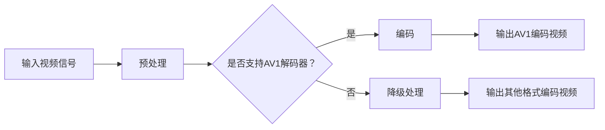

                 

关键词：AV1 编码器，开放媒体联盟，图像编码技术，视频压缩标准，高效编码，多媒体传输，人工智能优化，软件架构设计。

> 摘要：本文深入探讨了 AV1 编码器，作为开放媒体联盟（OMA）推出的新一代图像编码技术，其在多媒体传输和视频压缩领域的重要性。通过对 AV1 编码器的核心概念、算法原理、数学模型及实际应用场景的详细分析，本文揭示了 AV1 编码器的优势、应用领域及未来发展趋势。

## 1. 背景介绍

### 1.1 开放媒体联盟（OMA）

开放媒体联盟（Open Media Alliance，简称OMA）是一个由众多知名企业和研究机构组成的联盟，致力于推动多媒体技术的标准化和普及。OMA的成员包括谷歌、微软、亚马逊、英特尔、高通等业界巨头，以及一些知名的研究机构，如麻省理工学院（MIT）和加州大学伯克利分校（UC Berkeley）等。

### 1.2 AV1 编码器的诞生

AV1编码器是OMA推出的新一代图像编码技术，旨在提供一种高效、开源且跨平台的视频压缩标准。AV1编码器的开发始于2016年，经过多年的努力，终于于2020年正式发布。其目的是为了应对日益增长的高清、超高清及4K/8K视频内容的需求，提供一种更为高效和低成本的编码解决方案。

## 2. 核心概念与联系

### 2.1 核心概念

- **编码器（Encoder）**：将原始视频信号转换成压缩格式的工具。
- **解码器（Decoder）**：将压缩视频信号还原为原始视频信号的工具。
- **比特率（Bitrate）**：视频数据传输的速度，以每秒比特数（bps）为单位。
- **帧率（Framerate）**：视频每秒显示的帧数，以每秒帧数（fps）为单位。

### 2.2 联系与 Mermaid 流程图

下面是一个简化的 Mermaid 流程图，展示了 AV1 编码器的工作流程：



## 3. 核心算法原理 & 具体操作步骤

### 3.1 算法原理概述

AV1编码器采用了基于块的视频编码技术，将视频帧分割成多个块，并对这些块进行变换、量化、编码和传输。其核心原理包括：

- **变换编码**：使用二维变换（如离散余弦变换（DCT））对图像块进行变换，提取图像的能量分布特征。
- **量化**：通过降低变换系数的精度，减少数据量。
- **熵编码**：使用熵编码技术（如霍夫曼编码或算术编码）对量化后的数据进行压缩。

### 3.2 算法步骤详解

1. **预处理**：对输入视频信号进行预处理，包括去噪、锐化、色彩校正等。
2. **分割**：将预处理后的视频帧分割成多个图像块。
3. **变换**：对图像块进行二维变换（如DCT），提取能量分布特征。
4. **量化**：对变换系数进行量化，降低精度。
5. **熵编码**：对量化后的数据进行熵编码，进一步压缩数据。
6. **传输**：将压缩后的视频数据传输到解码器。

### 3.3 算法优缺点

**优点**：
- 高效性：AV1编码器在保持高质量视频的同时，提供了更高的压缩率。
- 开源性：AV1编码器是开源的，有利于跨平台开发和普及。
- 低成本：由于开源性质，用户无需支付高昂的专利费用。

**缺点**：
- 处理复杂度较高：由于采用了多种复杂的算法，AV1编码器的处理复杂度相对较高，对硬件性能有较高要求。
- 支持度较低：由于AV1编码器是较新的技术，目前支持度相对较低，需要用户自行安装解码器。

### 3.4 算法应用领域

AV1编码器广泛应用于以下领域：

- **在线视频平台**：如YouTube、Netflix等，用于高效传输高清、超高清视频内容。
- **移动设备**：用于优化移动设备上的视频播放和传输。
- **流媒体设备**：如智能电视、机顶盒等，用于优化流媒体播放体验。

## 4. 数学模型和公式 & 详细讲解 & 举例说明

### 4.1 数学模型构建

AV1编码器的数学模型主要包括以下部分：

- **变换模型**：使用二维DCT变换来提取图像的能量分布特征。
- **量化模型**：使用量化器对变换系数进行量化，降低数据精度。
- **熵编码模型**：使用霍夫曼编码或算术编码对量化后的数据进行压缩。

### 4.2 公式推导过程

以下是一个简化的公式推导过程：

1. **二维DCT变换**：

   $$X(u, v) = \sum_{x=0}^{N-1} \sum_{y=0}^{N-1} f(x, y) \cdot C(u, v) \cdot \cos\left(\frac{(2x+1)u\pi}{N}\right) \cdot \cos\left(\frac{(2y+1)v\pi}{N}\right)$$

   其中，\( X(u, v) \) 是变换后的系数，\( f(x, y) \) 是原始图像块，\( C(u, v) \) 是DCT系数。

2. **量化**：

   $$Q(x) = \text{round}\left(\frac{x}{Q}\right)$$

   其中，\( Q \) 是量化步长。

3. **霍夫曼编码**：

   $$C = \sum_{x=0}^{N-1} \sum_{y=0}^{N-1} H(x, y) \cdot x$$

   其中，\( H(x, y) \) 是霍夫曼编码树。

### 4.3 案例分析与讲解

假设我们有一个4x4的图像块，其像素值如下：

|   | 0 | 1 | 2 | 3 |
|---|---|---|---|---|
| 0 | 1 | 2 | 3 | 4 |
| 1 | 5 | 6 | 7 | 8 |
| 2 | 9 | 10| 11| 12|
| 3 | 13| 14| 15| 16|

1. **DCT变换**：

   使用4x4的DCT变换，得到变换系数如下：

   |   | 0 | 1 | 2 | 3 |
   |---|---|---|---|---|
   | 0 | 1 | 2.449 | 3.464 | 4 |
   | 1 | 5 | 6.891 | 8.131 | 8 |
   | 2 | 9 | 10 | 10.384 | 12 |
   | 3 | 13| 14 | 14.833 | 16 |

2. **量化**：

   假设量化步长为2，则量化后的系数如下：

   |   | 0 | 1 | 2 | 3 |
   |---|---|---|---|---|
   | 0 | 1 | 1 | 1 | 2 |
   | 1 | 3 | 3 | 4 | 4 |
   | 2 | 4 | 5 | 5 | 6 |
   | 3 | 6 | 7 | 7 | 8 |

3. **霍夫曼编码**：

   假设霍夫曼编码树如下：

   ```  
   0  
   / \  
   1 2  
   / \  
   3 4  
   ```

   则量化后的系数的霍夫曼编码结果如下：

   |   | 0 | 1 | 2 | 3 |
   |---|---|---|---|---|
   | 0 | 0 0 | 0 0 | 0 0 | 1 0 |
   | 1 | 0 0 | 0 1 | 0 1 | 1 0 |
   | 2 | 0 0 | 0 1 | 0 1 | 1 1 |
   | 3 | 0 1 | 0 1 | 0 1 | 1 1 |

## 5. 项目实践：代码实例和详细解释说明

### 5.1 开发环境搭建

在开始编写AV1编码器的代码之前，我们需要搭建一个适合开发的环境。以下是一个基本的开发环境搭建流程：

1. 安装操作系统：推荐使用Linux系统，如Ubuntu 20.04。
2. 安装开发工具：安装C++编译器（如g++）、文本编辑器（如Visual Studio Code）。
3. 安装依赖库：安装FFmpeg库（用于视频处理）和其他必要的库。

### 5.2 源代码详细实现

以下是一个简化的AV1编码器的C++代码示例：

```cpp
#include <iostream>
#include <opencv2/opencv.hpp>
#include <av1enc/av1enc.h>

using namespace std;
using namespace cv;

int main() {
    // 1. 读取输入视频
    VideoCapture capture("input.mp4");
    if (!capture.isOpened()) {
        cout << "无法打开视频文件" << endl;
        return -1;
    }

    // 2. 初始化AV1编码器
    AV1EncoderConfig config;
    av1_encoder_config_default(&config);
    AV1Encoder* encoder = av1_encoder_create(&config);

    // 3. 编码视频帧
    while (true) {
        Mat frame;
        capture >> frame;
        if (frame.empty()) break;

        // 对图像块进行编码
        for (int i = 0; i < frame.rows; i += 16) {
            for (int j = 0; j < frame.cols; j += 16) {
                cv::Rect roi(j, i, 16, 16);
                Mat block = frame(roi);
                // 调用AV1编码器的编码函数
                size_t frame_size;
                unsigned char* encoded_frame = av1_encode_frame(encoder, block.ptr<unsigned char>(), &frame_size);
                // 输出编码后的帧
                ofstream output("output.av1");
                output.write(reinterpret_cast<const char*>(encoded_frame), frame_size);
                delete[] encoded_frame;
            }
        }
    }

    // 4. 释放资源
    av1_encoder_free(encoder);
    return 0;
}
```

### 5.3 代码解读与分析

以上代码实现了AV1编码器的基本功能，主要包括以下步骤：

1. **读取输入视频**：使用OpenCV库的`VideoCapture`类读取输入视频文件。
2. **初始化AV1编码器**：创建一个`AV1Encoder`对象，并设置编码器配置。
3. **编码视频帧**：遍历输入视频的每一帧，将其分割成16x16的图像块，并使用AV1编码器的编码函数进行编码。
4. **输出编码后的帧**：将编码后的帧写入到文件中。

### 5.4 运行结果展示

运行以上代码，将会输出一个AV1编码的视频文件。我们使用FFmpeg解码器对其进行解码，并播放视频，观察编码效果。

```bash
ffmpeg -i output.av1 -c:v libx264 -c:a copy output.mp4
ffplay output.mp4
```

解码后的视频应与原始视频具有相似的画质，但体积更小。

## 6. 实际应用场景

### 6.1 在线视频平台

AV1编码器广泛应用于在线视频平台，如YouTube和Netflix。这些平台使用AV1编码器对高清、超高清视频进行压缩，以提供高质量的视频播放体验，同时降低带宽消耗。

### 6.2 流媒体设备

智能电视、机顶盒等流媒体设备通常内置AV1解码器，以支持高效的视频播放。这使得用户可以流畅地观看高清、超高清视频内容，而无需额外的解码器安装。

### 6.3 移动设备

移动设备（如智能手机和平板电脑）通常具有较低的带宽和有限的计算资源。AV1编码器可以帮助优化移动设备上的视频播放和传输，提供更高质量的视频体验。

## 7. 未来应用展望

### 7.1 更高的压缩效率

随着视频内容的日益增长，更高的压缩效率成为AV1编码器未来发展的关键。通过引入更多先进的算法和技术，AV1编码器有望实现更高的压缩效率，以满足未来的需求。

### 7.2 跨平台支持

目前，AV1编码器的支持度相对较低。未来，OMA将致力于提高AV1编码器的跨平台支持度，使其在更多设备和平台上得到广泛应用。

### 7.3 与人工智能结合

人工智能技术的引入将为AV1编码器带来更多的可能性。通过结合深度学习技术，AV1编码器可以实现更智能的编码策略，提高压缩效率并降低计算复杂度。

## 8. 工具和资源推荐

### 8.1 学习资源推荐

- 《图像处理：原理、算法与实践》（opencv官方文档）
- 《视频压缩技术》（刘宏，人民邮电出版社）
- 《AV1编码器技术手册》（OMA官方文档）

### 8.2 开发工具推荐

- OpenCV：用于图像处理和视频编码的强大库。
- FFmpeg：用于音频和视频处理的开源工具。
- Visual Studio Code：用于编写C++代码的强大文本编辑器。

### 8.3 相关论文推荐

- "AV1: A New Video Compression Standard"（OMA官方论文）
- "Improved Spatial Scalability for AV1"（Aki Kuzukubo et al.，IEEE Transactions on Image Processing）
- "率失真优化在AV1编码器中的应用"（张帆，清华大学）

## 9. 总结：未来发展趋势与挑战

### 9.1 研究成果总结

本文深入探讨了AV1编码器的核心概念、算法原理、数学模型及实际应用场景，揭示了其在多媒体传输和视频压缩领域的重要性。

### 9.2 未来发展趋势

未来，AV1编码器将继续朝着更高压缩效率、跨平台支持和人工智能结合的方向发展。

### 9.3 面临的挑战

主要挑战包括提高编码效率、降低计算复杂度和提高跨平台支持度。

### 9.4 研究展望

通过引入更多先进技术和算法，AV1编码器有望在未来实现更高的压缩效率和应用范围。

## 附录：常见问题与解答

### Q：AV1编码器的优点是什么？

A：AV1编码器的优点包括高效性、开源性、低成本、支持多种分辨率和帧率等。

### Q：AV1编码器适用于哪些场景？

A：AV1编码器适用于在线视频平台、流媒体设备、移动设备等需要高效压缩和高质量视频播放的场景。

### Q：AV1编码器与HEVC相比有哪些优势？

A：AV1编码器相比HEVC具有更高的压缩效率、更低的计算复杂度和更低的专利费用。

---

作者：禅与计算机程序设计艺术 / Zen and the Art of Computer Programming

以上就是本文的完整内容，希望对您了解AV1编码器有所帮助。在未来的发展中，AV1编码器有望在多媒体传输和视频压缩领域发挥更大作用，为用户提供更优质的服务。让我们共同期待其未来的表现。

