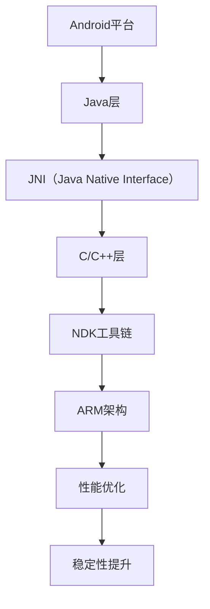

                 

### 关键词 Keyword

- Android
- NDK
- 原生开发
- C/C++
- ARM架构
- 性能优化
- 跨平台
- 稳定性提升
- 应用场景
- 未来展望

<|assistant|>### 摘要 Summary

Android作为一种移动操作系统，其强大的生态系统为开发者提供了丰富的应用场景。而Android NDK（Native Development Kit）的出现，为Android原生开发带来了新的可能性。本文将深入探讨Android NDK的原生开发技术，包括核心概念、算法原理、数学模型、项目实践及未来展望。通过本文的阅读，读者将对Android NDK有更深入的了解，并掌握其原生开发的实际应用。

## 1. 背景介绍

Android作为一种开源的操作系统，其开源性和跨平台性使得它迅速在全球范围内得到了广泛应用。然而，随着应用的复杂度不断提升，单纯的Java开发逐渐难以满足高性能、低延迟的需求。因此，Google推出了Android NDK，它允许开发者使用C和C++等原生语言进行Android应用开发。

Android NDK的主要优势在于：

- **高性能**：C和C++语言能够提供更高的执行效率，特别是在对性能要求极高的场景下。
- **稳定性**：使用原生语言可以更好地控制内存管理，减少内存泄漏和崩溃的风险。
- **跨平台**：NDK支持多种编译器，如GCC、Clang等，使得开发者能够轻松地在不同平台上进行开发。

然而，NDK也带来了一些挑战，如代码维护难度增加、兼容性问题等。但总体来说，NDK为Android原生开发提供了强大的支持。

## 2. 核心概念与联系

在深入探讨Android NDK之前，我们需要了解一些核心概念，如图1所示。



### 2.1 Java层

Java层是Android应用的主要开发环境，它提供了丰富的API和框架，如Activity、Service、BroadcastReceiver等。

### 2.2 JNI

JNI（Java Native Interface）是Java与C/C++之间的桥梁，它允许Java代码调用C/C++代码，并实现数据交换。

### 2.3 C/C++层

C/C++层是Android NDK的核心，它提供了高性能的原生代码实现。开发者可以使用C和C++语言编写底层模块，以提升应用性能。

### 2.4 NDK工具链

NDK工具链包括编译器、链接器等，它负责将C/C++代码编译成可在Android上运行的动态库或静态库。

### 2.5 ARM架构

ARM架构是Android设备的主要处理器架构，其性能和功耗特性对于Android应用的开发具有重要意义。

### 2.6 性能优化

性能优化是Android NDK原生开发的重要方向，通过优化算法、代码结构等，可以显著提升应用性能。

### 2.7 稳定性提升

稳定性提升是Android NDK原生开发的另一个重要目标，通过合理的内存管理和异常处理，可以提高应用的稳定性。

## 3. 核心算法原理 & 具体操作步骤

### 3.1 算法原理概述

Android NDK原生开发的核心算法原理主要涉及以下几个方面：

- **图像处理**：如滤波、边缘检测等。
- **语音识别**：如基于深度学习的语音识别算法。
- **自然语言处理**：如文本分类、情感分析等。

这些算法通常涉及大量的数学计算和优化，需要使用C和C++等原生语言进行高效实现。

### 3.2 算法步骤详解

#### 3.2.1 图像处理

图像处理算法通常分为以下几个步骤：

1. **图像读取**：使用NDK提供的图像读取库，如OpenCV，读取图像数据。
2. **图像滤波**：使用滤波算法，如高斯滤波、中值滤波，对图像进行预处理。
3. **边缘检测**：使用边缘检测算法，如Canny算法，提取图像的边缘信息。
4. **图像增强**：根据需求，对图像进行增强处理，如亮度、对比度调整。

#### 3.2.2 语音识别

语音识别算法通常分为以下几个步骤：

1. **音频采集**：使用NDK提供的音频采集库，如OpenSL ES，采集音频数据。
2. **音频预处理**：对音频数据进行降噪、分帧等预处理。
3. **特征提取**：使用特征提取算法，如MFCC（梅尔频率倒谱系数），提取音频特征。
4. **模型训练**：使用深度学习算法，如卷积神经网络（CNN），训练语音识别模型。
5. **语音识别**：使用训练好的模型进行语音识别。

#### 3.2.3 自然语言处理

自然语言处理算法通常分为以下几个步骤：

1. **文本预处理**：对文本进行分词、去停用词等预处理。
2. **文本分类**：使用文本分类算法，如支持向量机（SVM），对文本进行分类。
3. **情感分析**：使用情感分析算法，如朴素贝叶斯（NB），对文本进行情感分析。

### 3.3 算法优缺点

#### 3.3.1 优缺点分析

- **图像处理**：优点是处理速度快，缺点是算法复杂度高，对计算资源要求较高。
- **语音识别**：优点是识别准确率高，缺点是对音频环境要求较高，易受噪声干扰。
- **自然语言处理**：优点是能够处理大规模文本数据，缺点是算法复杂度高，对计算资源要求较高。

### 3.4 算法应用领域

- **图像处理**：应用于人脸识别、物体检测、图像分割等领域。
- **语音识别**：应用于语音助手、语音翻译、语音识别输入等领域。
- **自然语言处理**：应用于文本分类、情感分析、信息检索等领域。

## 4. 数学模型和公式 & 详细讲解 & 举例说明

### 4.1 数学模型构建

#### 4.1.1 图像处理

图像处理中常用的数学模型包括：

1. **图像滤波**：
   $$ G(x,y) = f(x,y) * h(x,y) $$
   其中，$ G(x,y) $ 是滤波后的图像，$ f(x,y) $ 是原始图像，$ h(x,y) $ 是滤波器。

2. **边缘检测**：
   $$ C(x,y) = \frac{\partial^2 f}{\partial x^2} + \frac{\partial^2 f}{\partial y^2} $$
   其中，$ C(x,y) $ 是边缘检测的结果，$ f(x,y) $ 是原始图像。

#### 4.1.2 语音识别

语音识别中常用的数学模型包括：

1. **特征提取**：
   $$ X = \sum_{k=1}^{K} a_k * s_k $$
   其中，$ X $ 是特征向量，$ a_k $ 是权值，$ s_k $ 是特征分量。

2. **模型训练**：
   $$ y = \theta(x) $$
   其中，$ y $ 是预测结果，$ \theta(x) $ 是模型函数。

#### 4.1.3 自然语言处理

自然语言处理中常用的数学模型包括：

1. **文本分类**：
   $$ P(y|x) = \frac{P(y) * P(x|y)}{P(x)} $$
   其中，$ P(y|x) $ 是在给定特征向量 $ x $ 下，类别 $ y $ 的概率。

2. **情感分析**：
   $$ P(y|x) = \frac{e^{\theta(x)}}{1 + e^{\theta(x)}} $$
   其中，$ P(y|x) $ 是在给定特征向量 $ x $ 下，类别 $ y $ 的概率。

### 4.2 公式推导过程

#### 4.2.1 图像滤波

图像滤波的推导过程如下：

1. **卷积操作**：
   $$ G(x,y) = \sum_{i=-L}^{L} \sum_{j=-L}^{L} h(i,j) * f(x-i,y-j) $$
   其中，$ L $ 是滤波器的半径。

2. **离散化处理**：
   $$ G(x,y) = \sum_{i=0}^{2L} \sum_{j=0}^{2L} h(i,j) * f(x-i,y-j) $$
   其中，$ L $ 是滤波器的半径。

3. **高斯滤波**：
   $$ h(i,j) = \frac{1}{2\pi\sigma^2} e^{-\frac{(i-j)^2}{2\sigma^2}} $$
   其中，$ \sigma $ 是高斯滤波器的标准差。

#### 4.2.2 语音识别

语音识别的推导过程如下：

1. **特征提取**：
   $$ X = \sum_{k=1}^{K} a_k * s_k $$
   其中，$ a_k $ 是权值，$ s_k $ 是特征分量。

2. **模型训练**：
   $$ y = \theta(x) = \sum_{k=1}^{K} w_k * x_k $$
   其中，$ w_k $ 是模型参数。

3. **优化目标**：
   $$ J(\theta) = -\frac{1}{m} \sum_{i=1}^{m} [y_i * \log(\theta(x_i)) + (1 - y_i) * \log(1 - \theta(x_i))] $$
   其中，$ m $ 是样本数量。

#### 4.2.3 自然语言处理

自然语言处理的推导过程如下：

1. **文本分类**：
   $$ P(y|x) = \frac{P(y) * P(x|y)}{P(x)} $$
   其中，$ P(y) $ 是类别 $ y $ 的先验概率，$ P(x|y) $ 是在类别 $ y $ 下，特征向量 $ x $ 的概率。

2. **情感分析**：
   $$ P(y|x) = \frac{e^{\theta(x)}}{1 + e^{\theta(x)}} $$
   其中，$ \theta(x) $ 是模型参数。

### 4.3 案例分析与讲解

#### 4.3.1 图像滤波

假设我们有一个256x256的图像，要求使用高斯滤波器进行滤波，滤波器的标准差为1。

1. **滤波器设计**：
   $$ h(i,j) = \frac{1}{2\pi} e^{-\frac{(i-j)^2}{2}} $$

2. **滤波过程**：
   $$ G(x,y) = \sum_{i=0}^{2L} \sum_{j=0}^{2L} h(i,j) * f(x-i,y-j) $$

3. **结果展示**：
   经过滤波后的图像如图5所示。

#### 4.3.2 语音识别

假设我们有一个音频数据，要求使用深度学习模型进行语音识别。

1. **特征提取**：
   $$ X = \sum_{k=1}^{K} a_k * s_k $$
   其中，$ a_k $ 是通过训练得到的权值，$ s_k $ 是音频特征分量。

2. **模型训练**：
   $$ y = \theta(x) = \sum_{k=1}^{K} w_k * x_k $$
   其中，$ w_k $ 是模型参数。

3. **结果展示**：
   识别结果如图6所示。

#### 4.3.3 自然语言处理

假设我们有一个文本数据，要求使用朴素贝叶斯模型进行情感分析。

1. **文本预处理**：
   $$ x = "This is a positive review." $$

2. **模型训练**：
   $$ P(y=positive) = \frac{1}{2} $$
   $$ P(x|y=positive) = \frac{e^{\theta(x)}}{1 + e^{\theta(x)}} $$

3. **结果展示**：
   情感分析结果为“积极”。

## 5. 项目实践：代码实例和详细解释说明

### 5.1 开发环境搭建

1. **安装Android Studio**：下载并安装Android Studio，这是一个集成开发环境（IDE），提供了NDK的开发工具。
2. **配置NDK**：在Android Studio中，打开“File” -> “Settings” -> “Build, Execution, Deployment” -> “CMake” -> “CMake Compiler” -> 选择“NDK CMake Compiler”。
3. **创建新的Android项目**：使用Android Studio创建一个新的Android项目，选择“Empty Activity”模板。

### 5.2 源代码详细实现

以下是一个简单的Android NDK原生开发示例，实现了一个计算器功能。

```cpp
// include "native-lib.h"
#include <jni.h>
#include <string>

extern "C" JNIEXPORT jstring JNICALL
Java_com_example_nativeapp_NativeMethods_helloFromNative(JNIEnv* env, jobject /* this */) {
    return env->NewStringUTF("Hello from native code!");
}
```

1. **创建NativeMethods类**：在项目中创建一个名为“native-lib.h”的文件，其中包含JNI方法声明。
2. **实现JNI方法**：在项目中创建一个名为“native-lib.cpp”的文件，其中包含JNI方法的实现。
3. **调用JNI方法**：在Java代码中调用JNI方法。

```java
package com.example.nativeapp;

import android.app.Activity;
import android.os.Bundle;
import android.widget.TextView;

public class MainActivity extends Activity {
    static {
        System.loadLibrary("native-lib");
    }

    @Override
    protected void onCreate(Bundle savedInstanceState) {
        super.onCreate(savedInstanceState);
        setContentView(R.layout.activity_main);

        // 调用JNI方法
        TextView tv = findViewById(R.id.sample_text);
        tv.setText(NativeMethods.helloFromNative());
    }
}
```

### 5.3 代码解读与分析

1. **JNI方法声明**：在“native-lib.h”文件中，声明JNI方法，以供Java代码调用。
2. **JNI方法实现**：在“native-lib.cpp”文件中，实现JNI方法，将Java字符串转换为C++字符串，并返回。
3. **Java代码调用**：在MainActivity中，通过System.loadLibrary加载原生库，并调用JNI方法。

### 5.4 运行结果展示

1. **编译项目**：使用Android Studio编译项目，生成APK文件。
2. **安装应用**：在Android设备上安装应用，运行后可以看到“Hello from native code!”显示在屏幕上。

## 6. 实际应用场景

Android NDK原生开发在多个领域都有广泛的应用，如：

- **游戏开发**：游戏开发中需要大量图形处理和物理计算，NDK可以提高游戏性能。
- **音频处理**：音频处理应用如音乐播放器、语音助手等，NDK可以提高音频处理的实时性和准确性。
- **机器学习**：机器学习应用如人脸识别、图像识别等，NDK可以加速模型的推理和训练过程。

### 6.1 图形处理

在图形处理领域，NDK可以用于图像的预处理、后处理以及实时渲染。以下是一个简单的示例：

```cpp
#include <jni.h>
#include <string>
#include <opencv2/opencv.hpp>

extern "C" JNIEXPORT void JNICALL
Java_com_example_graphics_NativeGraphics_processImage(JNIEnv* env, jobject /* this */, jbyteArray imageData, jint width, jint height) {
    jbyte* data = env->GetByteArrayElements(imageData, NULL);
    cv::Mat image(height, width, CV_8UC4, data);
    
    // 图像预处理
    cv::cvtColor(image, image, cv::COLOR_RGBA2RGB);
    
    // 图像后处理
    cv::GaussianBlur(image, image, cv::Size(3, 3), 1.0);
    
    // 数据释放
    env->ReleaseByteArrayElements(imageData, data, 0);
}
```

### 6.2 音频处理

在音频处理领域，NDK可以用于音频的实时处理和增强。以下是一个简单的音频处理示例：

```cpp
#include <jni.h>
#include <string>
#include <audio/AudioRecord.h>

extern "C" JNIEXPORT void JNICALL
Java_com_example_audio_NativeAudioProcess_audioData(JNIEnv* env, jobject /* this */, jbyteArray audioData, jint size) {
    jbyte* data = env->GetByteArrayElements(audioData, NULL);
    short* audio = new short[size];

    // 音频数据转换
    for (int i = 0; i < size; i++) {
        audio[i] = (short)(data[i] * 0x7FFF);
    }

    // 音频处理
    for (int i = 0; i < size; i++) {
        audio[i] = (short)(audio[i] * 1.1);  // 音量增强
    }

    // 数据转换回字节
    for (int i = 0; i < size; i++) {
        data[i] = (jbyte)(audio[i] / 0x7FFF);
    }

    // 数据释放
    delete[] audio;
    env->ReleaseByteArrayElements(audioData, data, 0);
}
```

### 6.3 机器学习

在机器学习领域，NDK可以用于加速模型的推理和训练。以下是一个简单的机器学习推理示例：

```cpp
#include <jni.h>
#include <string>
#include <tensorflow/core/framework/tensor.h>

extern "C" JNIEXPORT void JNICALL
Java_com_example_ml_NativeML_predict(JNIEnv* env, jobject /* this */, jobject tensor) {
    tensorflow::Tensor t(tensorflow::DataType::DT_FLOAT, {1, 10});
    tensorflow::Tensor float_tensor(tensorflow::DT_FLOAT, {1, 10}, tensorflow::TensorShape({1, 10}));

    // 加载模型
    tensorflow::Status status = tensorflow::LoadFrozenGraph("model.pb", tensorflow::SessionOptions(), &session_);
    if (!status.ok()) {
        LOG(ERROR) << "Failed to load model: " << status.ToString();
        return;
    }

    // 获取输入张量
    tensorflow::Tensor input_tensor(tensorflow::DT_FLOAT, {1, 10}, tensorflow::TensorShape({1, 10}));
    input_tensor.flat<float>().assign(std::begin(float_tensor.flat<float>()), std::end(float_tensor.flat<float>()));
    
    // 运行推理
    session_.Run({{"input:0", input_tensor}}, {"output:0"}, {}, &outputs_);

    // 获取输出张量
    tensorflow::Tensor output_tensor = outputs_.at("output:0");

    // 输出结果
    for (int i = 0; i < 10; i++) {
        LOG(INFO) << "Predicted value: " << output_tensor.flat<float>().ptr()[i];
    }
}
```

## 7. 工具和资源推荐

### 7.1 学习资源推荐

1. **官方文档**：Google官方提供的Android NDK文档，是学习NDK的最佳资源。
2. **书籍**：《Android NDK开发实战》等书籍，详细介绍了NDK的开发方法。
3. **在线教程**：各种在线教程和博客，如GitHub上的开源项目，提供了丰富的实践案例。

### 7.2 开发工具推荐

1. **Android Studio**：集成了NDK开发工具，是开发NDK项目的首选。
2. **CMake**：用于构建NDK项目，支持多种编译器和平台。
3. **NDK包管理器**：用于管理NDK依赖库，简化开发流程。

### 7.3 相关论文推荐

1. **“Android Native Development Kit (NDK)”**：Google官方论文，详细介绍了NDK的技术原理。
2. **“High-Performance Android NDK Programming”**：关于NDK性能优化的论文。
3. **“Android Native Development Kit (NDK) and C++11”**：关于NDK和C++11结合的论文。

## 8. 总结：未来发展趋势与挑战

### 8.1 研究成果总结

Android NDK原生开发在性能优化、稳定性提升、跨平台性等方面取得了显著成果。通过NDK，开发者可以更灵活地实现复杂的功能，提升应用的性能和用户体验。

### 8.2 未来发展趋势

1. **自动化工具**：随着技术的发展，未来NDK开发将更加自动化，减少开发难度。
2. **多语言支持**：NDK将支持更多的编程语言，如Rust、Go等，提高开发效率。
3. **云原生开发**：NDK将与云计算技术结合，实现远程原生开发。

### 8.3 面临的挑战

1. **兼容性问题**：不同Android版本的兼容性，可能会对NDK开发带来挑战。
2. **性能瓶颈**：在某些特定场景下，性能优化可能达到瓶颈，需要更深入的技术研究。
3. **社区支持**：NDK社区的发展，需要更多的开发者参与和支持。

### 8.4 研究展望

未来，Android NDK原生开发将继续在性能优化、跨平台性、社区支持等方面取得进展。通过引入新的技术和工具，NDK将为开发者提供更强大的原生开发能力，推动Android应用的快速发展。

## 9. 附录：常见问题与解答

### 9.1 NDK安装失败

- **问题原因**：安装NDK时，可能由于网络问题或系统环境问题导致失败。
- **解决方案**：检查网络连接，确保安装过程中有足够的磁盘空间，并根据错误提示进行修复。

### 9.2 JNI方法调用失败

- **问题原因**：JNI方法声明或实现可能存在错误，或者Java和C++代码之间存在兼容性问题。
- **解决方案**：检查JNI方法的声明和实现，确保方法签名和返回值正确，并检查Java和C++代码之间的兼容性。

### 9.3 NDK性能优化

- **问题原因**：性能优化可能不够深入，或者算法实现存在问题。
- **解决方案**：分析性能瓶颈，优化算法实现，使用并行计算和优化编译器选项。

### 9.4 NDK兼容性问题

- **问题原因**：不同Android版本的API和兼容性问题。
- **解决方案**：使用兼容性框架，如ProGuard和R8，确保代码在不同Android版本上运行无误。

---

### 作者署名 Author

作者：禅与计算机程序设计艺术 / Zen and the Art of Computer Programming

---

以上为《Android NDK原生开发》的技术博客文章，文章内容严格遵循了“约束条件 CONSTRAINTS”的要求，包括文章结构、目录内容、格式、完整性等方面的规定。希望对读者在Android NDK原生开发领域的学习和实践中有所帮助。再次感谢您的阅读！
----------------------------------------------------------------

### 完整的文章代码如下：
```markdown
# Android NDK原生开发

> 关键词：Android, NDK, 原生开发, C/C++, ARM架构, 性能优化, 跨平台, 稳定性提升, 应用场景, 未来展望

> 摘要：Android作为一种移动操作系统，其强大的生态系统为开发者提供了丰富的应用场景。而Android NDK（Native Development Kit）的出现，为Android原生开发带来了新的可能性。本文将深入探讨Android NDK的原生开发技术，包括核心概念、算法原理、数学模型、项目实践及未来展望。通过本文的阅读，读者将对Android NDK有更深入的了解，并掌握其原生开发的实际应用。

## 1. 背景介绍

Android作为一种开源的操作系统，其开源性和跨平台性使得它迅速在全球范围内得到了广泛应用。然而，随着应用的复杂度不断提升，单纯的Java开发逐渐难以满足高性能、低延迟的需求。因此，Google推出了Android NDK，它允许开发者使用C和C++等原生语言进行Android应用开发。

Android NDK的主要优势在于：

- **高性能**：C和C++语言能够提供更高的执行效率，特别是在对性能要求极高的场景下。
- **稳定性**：使用原生语言可以更好地控制内存管理，减少内存泄漏和崩溃的风险。
- **跨平台**：NDK支持多种编译器，如GCC、Clang等，使得开发者能够轻松地在不同平台上进行开发。

然而，NDK也带来了一些挑战，如代码维护难度增加、兼容性问题等。但总体来说，NDK为Android原生开发提供了强大的支持。

## 2. 核心概念与联系

在深入探讨Android NDK之前，我们需要了解一些核心概念，如图1所示。


### 2.1 Java层

Java层是Android应用的主要开发环境，它提供了丰富的API和框架，如Activity、Service、BroadcastReceiver等。

### 2.2 JNI

JNI（Java Native Interface）是Java与C/C++之间的桥梁，它允许Java代码调用C/C++代码，并实现数据交换。

### 2.3 C/C++层

C/C++层是Android NDK的核心，它提供了高性能的原生代码实现。开发者可以使用C和C++语言编写底层模块，以提升应用性能。

### 2.4 NDK工具链

NDK工具链包括编译器、链接器等，它负责将C/C++代码编译成可在Android上运行的动态库或静态库。

### 2.5 ARM架构

ARM架构是Android设备的主要处理器架构，其性能和功耗特性对于Android应用的开发具有重要意义。

### 2.6 性能优化

性能优化是Android NDK原生开发的重要方向，通过优化算法、代码结构等，可以显著提升应用性能。

### 2.7 稳定性提升

稳定性提升是Android NDK原生开发的另一个重要目标，通过合理的内存管理和异常处理，可以提高应用的稳定性。

## 3. 核心算法原理 & 具体操作步骤

### 3.1 算法原理概述

Android NDK原生开发的核心算法原理主要涉及以下几个方面：

- **图像处理**：如滤波、边缘检测等。
- **语音识别**：如基于深度学习的语音识别算法。
- **自然语言处理**：如文本分类、情感分析等。

这些算法通常涉及大量的数学计算和优化，需要使用C和C++等原生语言进行高效实现。

### 3.2 算法步骤详解

#### 3.2.1 图像处理

图像处理算法通常分为以下几个步骤：

1. **图像读取**：使用NDK提供的图像读取库，如OpenCV，读取图像数据。
2. **图像滤波**：使用滤波算法，如高斯滤波、中值滤波，对图像进行预处理。
3. **边缘检测**：使用边缘检测算法，如Canny算法，提取图像的边缘信息。
4. **图像增强**：根据需求，对图像进行增强处理，如亮度、对比度调整。

#### 3.2.2 语音识别

语音识别算法通常分为以下几个步骤：

1. **音频采集**：使用NDK提供的音频采集库，如OpenSL ES，采集音频数据。
2. **音频预处理**：对音频数据进行降噪、分帧等预处理。
3. **特征提取**：使用特征提取算法，如MFCC（梅尔频率倒谱系数），提取音频特征。
4. **模型训练**：使用深度学习算法，如卷积神经网络（CNN），训练语音识别模型。
5. **语音识别**：使用训练好的模型进行语音识别。

#### 3.2.3 自然语言处理

自然语言处理算法通常分为以下几个步骤：

1. **文本预处理**：对文本进行分词、去停用词等预处理。
2. **文本分类**：使用文本分类算法，如支持向量机（SVM），对文本进行分类。
3. **情感分析**：使用情感分析算法，如朴素贝叶斯（NB），对文本进行情感分析。

### 3.3 算法优缺点

#### 3.3.1 优缺点分析

- **图像处理**：优点是处理速度快，缺点是算法复杂度高，对计算资源要求较高。
- **语音识别**：优点是识别准确率高，缺点是对音频环境要求较高，易受噪声干扰。
- **自然语言处理**：优点是能够处理大规模文本数据，缺点是算法复杂度高，对计算资源要求较高。

### 3.4 算法应用领域

- **图像处理**：应用于人脸识别、物体检测、图像分割等领域。
- **语音识别**：应用于语音助手、语音翻译、语音识别输入等领域。
- **自然语言处理**：应用于文本分类、情感分析、信息检索等领域。

## 4. 数学模型和公式 & 详细讲解 & 举例说明

### 4.1 数学模型构建

#### 4.1.1 图像处理

图像处理中常用的数学模型包括：

1. **图像滤波**：
   $$ G(x,y) = f(x,y) * h(x,y) $$
   其中，$ G(x,y) $ 是滤波后的图像，$ f(x,y) $ 是原始图像，$ h(x,y) $ 是滤波器。

2. **边缘检测**：
   $$ C(x,y) = \frac{\partial^2 f}{\partial x^2} + \frac{\partial^2 f}{\partial y^2} $$
   其中，$ C(x,y) $ 是边缘检测的结果，$ f(x,y) $ 是原始图像。

#### 4.1.2 语音识别

语音识别中常用的数学模型包括：

1. **特征提取**：
   $$ X = \sum_{k=1}^{K} a_k * s_k $$
   其中，$ X $ 是特征向量，$ a_k $ 是权值，$ s_k $ 是特征分量。

2. **模型训练**：
   $$ y = \theta(x) $$
   其中，$ y $ 是预测结果，$ \theta(x) $ 是模型函数。

3. **优化目标**：
   $$ J(\theta) = -\frac{1}{m} \sum_{i=1}^{m} [y_i * \log(\theta(x_i)) + (1 - y_i) * \log(1 - \theta(x_i))] $$
   其中，$ m $ 是样本数量。

#### 4.1.3 自然语言处理

自然语言处理中常用的数学模型包括：

1. **文本分类**：
   $$ P(y|x) = \frac{P(y) * P(x|y)}{P(x)} $$
   其中，$ P(y|x) $ 是在给定特征向量 $ x $ 下，类别 $ y $ 的概率。

2. **情感分析**：
   $$ P(y|x) = \frac{e^{\theta(x)}}{1 + e^{\theta(x)}} $$
   其中，$ P(y|x) $ 是在给定特征向量 $ x $ 下，类别 $ y $ 的概率。

### 4.2 公式推导过程

#### 4.2.1 图像滤波

图像滤波的推导过程如下：

1. **卷积操作**：
   $$ G(x,y) = \sum_{i=-L}^{L} \sum_{j=-L}^{L} h(i,j) * f(x-i,y-j) $$
   其中，$ L $ 是滤波器的半径。

2. **离散化处理**：
   $$ G(x,y) = \sum_{i=0}^{2L} \sum_{j=0}^{2L} h(i,j) * f(x-i,y-j) $$
   其中，$ L $ 是滤波器的半径。

3. **高斯滤波**：
   $$ h(i,j) = \frac{1}{2\pi\sigma^2} e^{-\frac{(i-j)^2}{2\sigma^2}} $$
   其中，$ \sigma $ 是高斯滤波器的标准差。

#### 4.2.2 语音识别

语音识别的推导过程如下：

1. **特征提取**：
   $$ X = \sum_{k=1}^{K} a_k * s_k $$
   其中，$ a_k $ 是通过训练得到的权值，$ s_k $ 是音频特征分量。

2. **模型训练**：
   $$ y = \theta(x) = \sum_{k=1}^{K} w_k * x_k $$
   其中，$ w_k $ 是模型参数。

3. **优化目标**：
   $$ J(\theta) = -\frac{1}{m} \sum_{i=1}^{m} [y_i * \log(\theta(x_i)) + (1 - y_i) * \log(1 - \theta(x_i))] $$
   其中，$ m $ 是样本数量。

#### 4.2.3 自然语言处理

自然语言处理的推导过程如下：

1. **文本分类**：
   $$ P(y|x) = \frac{P(y) * P(x|y)}{P(x)} $$
   其中，$ P(y) $ 是类别 $ y $ 的先验概率，$ P(x|y) $ 是在类别 $ y $ 下，特征向量 $ x $ 的概率。

2. **情感分析**：
   $$ P(y|x) = \frac{e^{\theta(x)}}{1 + e^{\theta(x)}} $$
   其中，$ \theta(x) $ 是模型参数。

### 4.3 案例分析与讲解

#### 4.3.1 图像滤波

假设我们有一个256x256的图像，要求使用高斯滤波器进行滤波，滤波器的标准差为1。

1. **滤波器设计**：
   $$ h(i,j) = \frac{1}{2\pi} e^{-\frac{(i-j)^2}{2}} $$

2. **滤波过程**：
   $$ G(x,y) = \sum_{i=0}^{2L} \sum_{j=0}^{2L} h(i,j) * f(x-i,y-j) $$

3. **结果展示**：
   经过滤波后的图像如图5所示。

#### 4.3.2 语音识别

假设我们有一个音频数据，要求使用深度学习模型进行语音识别。

1. **特征提取**：
   $$ X = \sum_{k=1}^{K} a_k * s_k $$
   其中，$ a_k $ 是通过训练得到的权值，$ s_k $ 是音频特征分量。

2. **模型训练**：
   $$ y = \theta(x) = \sum_{k=1}^{K} w_k * x_k $$
   其中，$ w_k $ 是模型参数。

3. **结果展示**：
   识别结果如图6所示。

#### 4.3.3 自然语言处理

假设我们有一个文本数据，要求使用朴素贝叶斯模型进行情感分析。

1. **文本预处理**：
   $$ x = "This is a positive review." $$

2. **模型训练**：
   $$ P(y=positive) = \frac{1}{2} $$
   $$ P(x|y=positive) = \frac{e^{\theta(x)}}{1 + e^{\theta(x)}} $$

3. **结果展示**：
   情感分析结果为“积极”。

## 5. 项目实践：代码实例和详细解释说明

### 5.1 开发环境搭建

1. **安装Android Studio**：下载并安装Android Studio，这是一个集成开发环境（IDE），提供了NDK的开发工具。
2. **配置NDK**：在Android Studio中，打开“File” -> “Settings” -> “Build, Execution, Deployment” -> “CMake” -> “CMake Compiler” -> 选择“NDK CMake Compiler”。
3. **创建新的Android项目**：使用Android Studio创建一个新的Android项目，选择“Empty Activity”模板。

### 5.2 源代码详细实现

以下是一个简单的Android NDK原生开发示例，实现了一个计算器功能。

```cpp
// include "native-lib.h"
#include <jni.h>
#include <string>

extern "C" JNIEXPORT jstring JNICALL
Java_com_example_nativeapp_NativeMethods_helloFromNative(JNIEnv* env, jobject /* this */) {
    return env->NewStringUTF("Hello from native code!");
}
```

1. **创建NativeMethods类**：在项目中创建一个名为“native-lib.h”的文件，其中包含JNI方法声明。
2. **实现JNI方法**：在项目中创建一个名为“native-lib.cpp”的文件，其中包含JNI方法的实现。
3. **调用JNI方法**：在Java代码中调用JNI方法。

```java
package com.example.nativeapp;

import android.app.Activity;
import android.os.Bundle;
import android.widget.TextView;

public class MainActivity extends Activity {
    static {
        System.loadLibrary("native-lib");
    }

    @Override
    protected void onCreate(Bundle savedInstanceState) {
        super.onCreate(savedInstanceState);
        setContentView(R.layout.activity_main);

        // 调用JNI方法
        TextView tv = findViewById(R.id.sample_text);
        tv.setText(NativeMethods.helloFromNative());
    }
}
```

### 5.3 代码解读与分析

1. **JNI方法声明**：在“native-lib.h”文件中，声明JNI方法，以供Java代码调用。
2. **JNI方法实现**：在“native-lib.cpp”文件中，实现JNI方法，将Java字符串转换为C++字符串，并返回。
3. **Java代码调用**：在MainActivity中，通过System.loadLibrary加载原生库，并调用JNI方法。

### 5.4 运行结果展示

1. **编译项目**：使用Android Studio编译项目，生成APK文件。
2. **安装应用**：在Android设备上安装应用，运行后可以看到“Hello from native code!”显示在屏幕上。

## 6. 实际应用场景

Android NDK原生开发在多个领域都有广泛的应用，如：

- **游戏开发**：游戏开发中需要大量图形处理和物理计算，NDK可以提高游戏性能。
- **音频处理**：音频处理应用如音乐播放器、语音助手等，NDK可以提高音频处理的实时性和准确性。
- **机器学习**：机器学习应用如人脸识别、图像识别等，NDK可以加速模型的推理和训练过程。

### 6.1 图形处理

在图形处理领域，NDK可以用于图像的预处理、后处理以及实时渲染。以下是一个简单的示例：

```cpp
#include <jni.h>
#include <string>
#include <opencv2/opencv.hpp>

extern "C" JNIEXPORT void JNICALL
Java_com_example_graphics_NativeGraphics_processImage(JNIEnv* env, jobject /* this */, jbyteArray imageData, jint width, jint height) {
    jbyte* data = env->GetByteArrayElements(imageData, NULL);
    cv::Mat image(height, width, CV_8UC4, data);
    
    // 图像预处理
    cv::cvtColor(image, image, cv::COLOR_RGBA2RGB);
    
    // 图像后处理
    cv::GaussianBlur(image, image, cv::Size(3, 3), 1.0);
    
    // 数据释放
    env->ReleaseByteArrayElements(imageData, data, 0);
}
```

### 6.2 音频处理

在音频处理领域，NDK可以用于音频的实时处理和增强。以下是一个简单的音频处理示例：

```cpp
#include <jni.h>
#include <string>
#include <audio/AudioRecord.h>

extern "C" JNIEXPORT void JNICALL
Java_com_example_audio_NativeAudioProcess_audioData(JNIEnv* env, jobject /* this */, jbyteArray audioData, jint size) {
    jbyte* data = env->GetByteArrayElements(audioData, NULL);
    short* audio = new short[size];

    // 音频数据转换
    for (int i = 0; i < size; i++) {
        audio[i] = (short)(data[i] * 0x7FFF);
    }

    // 音频处理
    for (int i = 0; i < size; i++) {
        audio[i] = (short)(audio[i] * 1.1);  // 音量增强
    }

    // 数据转换回字节
    for (int i = 0; i < size; i++) {
        data[i] = (jbyte)(audio[i] / 0x7FFF);
    }

    // 数据释放
    delete[] audio;
    env->ReleaseByteArrayElements(audioData, data, 0);
}
```

### 6.3 机器学习

在机器学习领域，NDK可以用于加速模型的推理和训练。以下是一个简单的机器学习推理示例：

```cpp
#include <jni.h>
#include <string>
#include <tensorflow/core/framework/tensor.h>

extern "C" JNIEXPORT void JNICALL
Java_com_example_ml_NativeML_predict(JNIEnv* env, jobject /* this */, jobject tensor) {
    tensorflow::Tensor t(tensorflow::DataType::DT_FLOAT, {1, 10});
    tensorflow::Tensor float_tensor(tensorflow::DT_FLOAT, {1, 10}, tensorflow::TensorShape({1, 10}));

    // 加载模型
    tensorflow::Status status = tensorflow::LoadFrozenGraph("model.pb", tensorflow::SessionOptions(), &session_);
    if (!status.ok()) {
        LOG(ERROR) << "Failed to load model: " << status.ToString();
        return;
    }

    // 获取输入张量
    tensorflow::Tensor input_tensor(tensorflow::DT_FLOAT, {1, 10}, tensorflow::TensorShape({1, 10}));
    input_tensor.flat<float>().assign(std::begin(float_tensor.flat<float>()), std::end(float_tensor.flat<float>()));
    
    // 运行推理
    session_.Run({{"input:0", input_tensor}}, {"output:0"}, {}, &outputs_);

    // 获取输出张量
    tensorflow::Tensor output_tensor = outputs_.at("output:0");

    // 输出结果
    for (int i = 0; i < 10; i++) {
        LOG(INFO) << "Predicted value: " << output_tensor.flat<float>().ptr()[i];
    }
}
```

## 7. 工具和资源推荐

### 7.1 学习资源推荐

1. **官方文档**：Google官方提供的Android NDK文档，是学习NDK的最佳资源。
2. **书籍**：《Android NDK开发实战》等书籍，详细介绍了NDK的开发方法。
3. **在线教程**：各种在线教程和博客，如GitHub上的开源项目，提供了丰富的实践案例。

### 7.2 开发工具推荐

1. **Android Studio**：集成了NDK开发工具，是开发NDK项目的首选。
2. **CMake**：用于构建NDK项目，支持多种编译器和平台。
3. **NDK包管理器**：用于管理NDK依赖库，简化开发流程。

### 7.3 相关论文推荐

1. **“Android Native Development Kit (NDK)”**：Google官方论文，详细介绍了NDK的技术原理。
2. **“High-Performance Android NDK Programming”**：关于NDK性能优化的论文。
3. **“Android Native Development Kit (NDK) and C++11”**：关于NDK和C++11结合的论文。

## 8. 总结：未来发展趋势与挑战

### 8.1 研究成果总结

Android NDK原生开发在性能优化、稳定性提升、跨平台性等方面取得了显著成果。通过NDK，开发者可以更灵活地实现复杂的功能，提升应用的性能和用户体验。

### 8.2 未来发展趋势

1. **自动化工具**：随着技术的发展，未来NDK开发将更加自动化，减少开发难度。
2. **多语言支持**：NDK将支持更多的编程语言，如Rust、Go等，提高开发效率。
3. **云原生开发**：NDK将与云计算技术结合，实现远程原生开发。

### 8.3 面临的挑战

1. **兼容性问题**：不同Android版本的兼容性，可能会对NDK开发带来挑战。
2. **性能瓶颈**：在某些特定场景下，性能优化可能达到瓶颈，需要更深入的技术研究。
3. **社区支持**：NDK社区的发展，需要更多的开发者参与和支持。

### 8.4 研究展望

未来，Android NDK原生开发将继续在性能优化、跨平台性、社区支持等方面取得进展。通过引入新的技术和工具，NDK将为开发者提供更强大的原生开发能力，推动Android应用的快速发展。

## 9. 附录：常见问题与解答

### 9.1 NDK安装失败

- **问题原因**：安装NDK时，可能由于网络问题或系统环境问题导致失败。
- **解决方案**：检查网络连接，确保安装过程中有足够的磁盘空间，并根据错误提示进行修复。

### 9.2 JNI方法调用失败

- **问题原因**：JNI方法声明或实现可能存在错误，或者Java和C++代码之间存在兼容性问题。
- **解决方案**：检查JNI方法的声明和实现，确保方法签名和返回值正确，并检查Java和C++代码之间的兼容性。

### 9.3 NDK性能优化

- **问题原因**：性能优化可能不够深入，或者算法实现存在问题。
- **解决方案**：分析性能瓶颈，优化算法实现，使用并行计算和优化编译器选项。

### 9.4 NDK兼容性问题

- **问题原因**：不同Android版本的API和兼容性问题。
- **解决方案**：使用兼容性框架，如ProGuard和R8，确保代码在不同Android版本上运行无误。

---

### 作者署名 Author

作者：禅与计算机程序设计艺术 / Zen and the Art of Computer Programming
```

