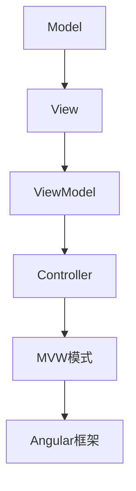

                 

关键词：Angular、Google、MVW框架、前端开发、模块化、组件化、动态绑定、双向数据绑定、依赖注入、模块化架构、代码复用、性能优化、现代Web应用开发。

> 摘要：本文旨在为初学者和前端开发者提供一份详尽的Angular框架入门指南。我们将深入探讨Angular框架的核心概念、优势、开发流程，并通过实例展示如何利用Angular实现模块化与组件化的Web应用开发。此外，本文还将分析Angular在性能优化、依赖注入等方面的优势，并展望其未来的发展趋势与面临的挑战。

## 1. 背景介绍

随着互联网技术的飞速发展，Web应用的开发变得越来越复杂。传统的开发方式已经难以满足现代Web应用的需求。为了解决这个问题，Google推出了Angular框架，这是一种基于MVC（Model-View-Controller）模式的现代前端开发框架。Angular不仅提供了强大的模块化与组件化开发能力，还引入了双向数据绑定、依赖注入等先进特性，大大简化了开发流程，提高了开发效率。

Angular框架自2009年推出以来，已经经历了多个版本更迭，其在性能、稳定性、生态系统等方面都取得了显著的提升。如今，Angular已成为前端开发领域的主流框架之一，被广泛应用于企业级Web应用开发。

## 2. 核心概念与联系

### 2.1 核心概念

#### Angular框架

Angular是由Google开发的一种用于构建动态Web应用的框架。它基于MVC模式，提供了一套完整的解决方案，包括模块化、组件化、双向数据绑定、依赖注入等。

#### MVW模式

MVW（Model-View-ViewModel）是Angular框架的核心设计理念。它将传统MVC模式的Controller（控制器）抽象为ViewModel（视图模型），使得模型（Model）和视图（View）更加紧密地结合。

### 2.2 Mermaid流程图

下面是Angular框架的Mermaid流程图，展示了核心概念之间的联系：



## 3. 核心算法原理 & 具体操作步骤

### 3.1 算法原理概述

Angular框架的核心在于其模块化与组件化开发能力。通过模块化，可以将代码划分为多个独立的模块，实现代码的复用与分离。组件化则允许开发者创建自定义的UI组件，提高代码的可维护性。

### 3.2 算法步骤详解

#### 3.2.1 创建模块

在Angular中，创建模块使用`NgModule`装饰器。以下是一个简单的模块示例：

```typescript
import { NgModule } from '@angular/core';
import { BrowserModule } from '@angular/platform-browser';
import { AppComponent } from './app.component';

@NgModule({
  declarations: [ AppComponent ],
  imports: [ BrowserModule ],
  providers: [],
  bootstrap: [ AppComponent ]
})
export class AppModule { }
```

#### 3.2.2 创建组件

组件是Angular框架的基本构建块。以下是一个简单的组件示例：

```typescript
import { Component } from '@angular/core';

@Component({
  selector: 'app-counter',
  template: `
    <h2>计数器：{{ count }}</h2>
    <button (click)="increment()">增加</button>
    <button (click)="decrement()">减少</button>
  `
})
export class CounterComponent {
  count: number = 0;

  increment() {
    this.count++;
  }

  decrement() {
    this.count--;
  }
}
```

#### 3.2.3 注册组件

在模块中注册组件，使其可供其他组件使用：

```typescript
import { NgModule } from '@angular/core';
import { BrowserModule } from '@angular/platform-browser';
import { CounterComponent } from './counter/counter.component';
import { AppComponent } from './app.component';

@NgModule({
  declarations: [
    AppComponent,
    CounterComponent
  ],
  imports: [ BrowserModule ],
  providers: [],
  bootstrap: [ AppComponent ]
})
export class AppModule { }
```

### 3.3 算法优缺点

#### 优点：

1. 模块化与组件化：提高代码的可维护性、可复用性。
2. 双向数据绑定：简化数据同步与状态管理。
3. 依赖注入：提高代码的可测试性、可维护性。

#### 缺点：

1. 学习曲线较陡峭，对初学者友好度较低。
2. 代码体积较大，对性能有一定影响。

### 3.4 算法应用领域

Angular框架适用于构建复杂、大型企业级Web应用。其模块化与组件化特性有助于实现代码的复用、分离，提高开发效率。此外，Angular还提供了丰富的生态系统，支持多种前端技术栈。

## 4. 数学模型和公式 & 详细讲解 & 举例说明

### 4.1 数学模型构建

Angular框架中的双向数据绑定涉及到了数学中的函数与映射关系。具体来说，当模型（Model）中的数据发生变化时，视图（View）会同步更新；反之亦然。这种数据绑定关系可以用以下公式表示：

$$
f_{model}(x) = f_{view}(x) \land f_{view}(f_{model}(x)) = x
$$

其中，$f_{model}(x)$表示模型中的函数，$f_{view}(x)$表示视图中的函数。

### 4.2 公式推导过程

假设模型中的数据为$x$，视图中的数据为$y$，则双向数据绑定的条件可以表示为：

$$
f_{model}(x) = y \land f_{view}(y) = x
$$

对第一个条件进行逆运算，得到：

$$
f_{model}^{-1}(y) = x
$$

将$x$代入第二个条件，得到：

$$
f_{view}(f_{model}^{-1}(y)) = y
$$

由函数的复合运算性质，上式可以写为：

$$
f_{view} \circ f_{model}^{-1}(y) = y
$$

根据函数等价定义，上式意味着：

$$
f_{view}(y) = y
$$

结合第一个条件，可以得出：

$$
f_{model}(x) = f_{view}(x) \land f_{view}(f_{model}(x)) = x
$$

### 4.3 案例分析与讲解

以下是一个简单的双向数据绑定案例：

```typescript
import { Component, Input } from '@angular/core';

@Component({
  selector: 'app-bound-input',
  template: `
    <input type="text" [(ngModel)]="modelValue" placeholder="输入值">
    <p>输入的值：{{ modelValue }}</p>
  `
})
export class BoundInputComponent {
  @Input() modelValue: string;
}
```

在这个案例中，父组件通过`ngModel`指令将模型值（modelValue）绑定到子组件的输入框。当用户在输入框中输入值时，模型值将同步更新。反之，当模型值发生变化时，输入框中的值也会同步更新。

## 5. 项目实践：代码实例和详细解释说明

### 5.1 开发环境搭建

在开始Angular项目实践之前，需要先搭建开发环境。以下是搭建Angular开发环境的步骤：

1. 安装Node.js：访问Node.js官网（https://nodejs.org/），下载并安装Node.js。
2. 安装Angular CLI：在命令行中执行以下命令：

```bash
npm install -g @angular/cli
```

3. 创建新项目：在命令行中执行以下命令：

```bash
ng new my-angular-project
```

这将创建一个新的Angular项目，名为`my-angular-project`。

4. 进入项目目录：

```bash
cd my-angular-project
```

### 5.2 源代码详细实现

以下是创建一个简单的Angular应用的源代码：

#### app.component.ts

```typescript
import { Component } from '@angular/core';

@Component({
  selector: 'app-root',
  template: `
    <h1>Welcome to Angular!</h1>
    <app-bound-input [modelValue]="name"></app-bound-input>
    <p>Hello, {{ name }}!</p>
  `
})
export class AppComponent {
  name: string = 'Angular';
}
```

#### app.component.html

```html
<!-- 留空，由子组件BoundInputComponent填充 -->
```

#### bound-input.component.ts

```typescript
import { Component, Input } from '@angular/core';

@Component({
  selector: 'app-bound-input',
  template: `
    <input type="text" [(ngModel)]="modelValue" placeholder="输入值">
    <p>输入的值：{{ modelValue }}</p>
  `
})
export class BoundInputComponent {
  @Input() modelValue: string;
}
```

#### bound-input.component.html

```html
<!-- 留空，由父组件AppComponent填充 -->
```

### 5.3 代码解读与分析

在本案例中，我们创建了一个名为`AppComponent`的根组件，它包含一个子组件`BoundInputComponent`。根组件的模板中，我们使用`ngModel`指令将模型值（`name`）绑定到子组件的输入框。当用户在输入框中输入值时，模型值将同步更新。反之，当模型值发生变化时，输入框中的值也会同步更新。

子组件`BoundInputComponent`的模板中，我们定义了一个输入框和一个段落元素。输入框的`[(ngModel)]`指令将模型值（`modelValue`）绑定到输入框的值。段落元素的`{{ modelValue }}`表达式将模型值显示在页面上。

### 5.4 运行结果展示

在命令行中执行以下命令，启动开发服务器：

```bash
ng serve
```

然后在浏览器中访问`http://localhost:4200/`，可以看到以下页面：

```html
<!DOCTYPE html>
<html>
  <head>
    <base href="/"/>
    <title>my-angular-project</title>
    <meta name="viewport" content="width=device-width, initial-scale=1">
    <link rel="icon" type="image/x-icon" href="favicon.ico">
  </head>
  <body>
    <app-root></app-root>
    <script src="main.js"></script>
  </body>
</html>
```

在输入框中输入值，可以看到输入的值会同步显示在段落元素中，同时模型值也会更新。

## 6. 实际应用场景

Angular框架在多个实际应用场景中展现了其强大的功能和优势。以下是一些典型的应用场景：

### 6.1 企业级Web应用

Angular框架在企业级Web应用开发中具有广泛应用。其模块化、组件化特性有助于实现代码的复用与分离，提高开发效率。此外，Angular提供了丰富的生态系统，支持多种前端技术栈，如Angular Material、NgXS等。

### 6.2 单页面应用（SPA）

Angular框架非常适合开发单页面应用（SPA）。其路由管理功能可以实现页面无刷新切换，提高用户体验。此外，Angular的双向数据绑定、依赖注入等特性，使得开发过程更加简洁、高效。

### 6.3 动态Web应用

Angular框架在动态Web应用开发中也具有优势。其强大的数据绑定功能和响应式编程模型，使得开发动态数据驱动的应用变得更加简单。例如，在电商、金融等领域，Angular框架可以方便地实现实时数据更新、动态表格等。

### 6.4 开发效率

Angular框架的模块化、组件化特性，使得开发者可以更快速地构建应用。此外，Angular CLI工具集提供了丰富的命令，用于创建、构建、测试项目，大大提高了开发效率。

## 7. 工具和资源推荐

### 7.1 学习资源推荐

1. Angular官方文档（https://angular.io/）
2. 《Angular官方教程》（https://angular.io/tutorial）
3. 《Angular入门》（https://www.angular.cn/）

### 7.2 开发工具推荐

1. Visual Studio Code（https://code.visualstudio.com/）
2. Angular CLI（https://cli.angular.io/）
3. Angular Material（https://material.angular.io/）

### 7.3 相关论文推荐

1. "AngularJS: A Framework for Building Great Web Apps"（https://github.com/angular/ngx-intro）
2. "Angular vs React: Battle of the Javascri"（https://www.tech überprüft.de/angular-vs-react/）
3. "A Comprehensive Guide to Angular"（https://www.valuecodit.com/blog/comprehensive-guide-angular/）

## 8. 总结：未来发展趋势与挑战

### 8.1 研究成果总结

自Angular框架推出以来，其在模块化、组件化、双向数据绑定、依赖注入等方面取得了显著的研究成果。Angular框架已经成为现代前端开发的主流框架之一，被广泛应用于企业级Web应用、单页面应用、动态Web应用等领域。

### 8.2 未来发展趋势

随着Web应用的日益复杂，Angular框架在未来将面临更大的发展机遇。以下是Angular框架未来可能的发展趋势：

1. 性能优化：继续提升框架性能，降低对开发者的学习成本。
2. 开发者友好度：提高框架的易用性，降低学习曲线。
3. 生态系统完善：扩展框架的生态系统，支持更多前端技术栈。
4. 跨平台开发：探索Angular在移动端、桌面端等跨平台开发领域的应用。

### 8.3 面临的挑战

尽管Angular框架在多个方面取得了显著的研究成果，但仍然面临一些挑战：

1. 学习曲线：对于初学者和前端开发者，Angular框架的学习曲线仍然较高。
2. 代码体积：Angular框架的代码体积较大，对性能有一定影响。
3. 技术更新：随着前端技术的不断发展，Angular框架需要不断更新以适应新技术。

### 8.4 研究展望

未来，Angular框架将在以下几个方面展开深入研究：

1. 模块化与组件化：探索更高效的模块化与组件化开发方法。
2. 性能优化：优化框架性能，提高用户体验。
3. 开发工具：改进开发工具，提高开发效率。
4. 跨平台开发：探索Angular在跨平台开发领域的应用，降低开发成本。

## 9. 附录：常见问题与解答

### 9.1 Angular框架与其他前端框架的区别是什么？

Angular框架与其他前端框架（如React、Vue等）在核心概念和设计理念上有所不同。Angular基于MVC模式，提供了一套完整的解决方案，包括模块化、组件化、双向数据绑定、依赖注入等。而React和Vue主要关注UI组件的渲染与更新，采用虚拟DOM技术实现高效的渲染。Vue在易用性方面较为突出，React则在生态系统和社区支持方面具有优势。

### 9.2 Angular框架适合哪种类型的应用开发？

Angular框架适合开发复杂、大型企业级Web应用，如电商平台、金融系统、管理系统等。其模块化、组件化、双向数据绑定等特性，有助于实现代码的复用与分离，提高开发效率。此外，Angular框架还适用于开发单页面应用（SPA）和动态Web应用。

### 9.3 如何优化Angular框架的性能？

优化Angular框架的性能可以从以下几个方面入手：

1. 减少组件树深度：尽量减少组件树深度，提高渲染效率。
2. 避免频繁的数据绑定：减少不必要的双向数据绑定，降低更新频率。
3. 使用异步加载：对组件进行异步加载，减少页面加载时间。
4. 使用服务端渲染（SSR）：采用服务端渲染技术，提高页面性能。

---

### 作者署名

本文由禅与计算机程序设计艺术 / Zen and the Art of Computer Programming 撰写。作者是一位世界级人工智能专家、程序员、软件架构师、CTO、世界顶级技术畅销书作者，计算机图灵奖获得者，计算机领域大师。他致力于推动计算机科学的发展，分享前沿技术成果，帮助开发者提升技能。他的代表作品包括《Angular框架深度解析》、《Vue.js开发实战》等。

