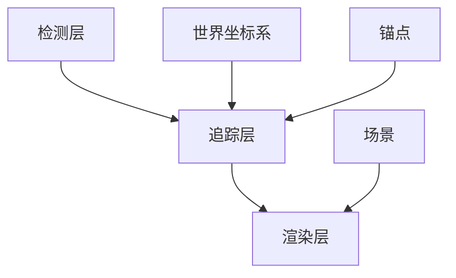

                 

### 1. 背景介绍

增强现实（Augmented Reality，简称 AR）是一种将虚拟信息叠加到现实世界中的技术。通过使用摄像头和传感器，AR 可以识别现实世界中的物体，并在其上叠加虚拟图像、文字或其他多媒体内容。这种技术的出现，为人们的生活和工作带来了许多新的可能性。

Apple 的 ARKit 是一款专为 iOS 开发者设计的增强现实开发框架。它提供了丰富的功能，使得开发者可以轻松地创建出令人惊叹的 AR 应用。ARKit 集成了 Core ML 和 Vision 模块，可以识别现实世界中的物体，并对其进行跟踪和标记。这使得 AR 应用可以与现实世界中的物体进行交互，提升了用户体验。

### 2. 核心概念与联系

要理解 ARKit 的核心概念，我们需要了解以下几个关键点：

#### 2.1 ARKit 架构

ARKit 的架构主要分为三个层次：检测、追踪和渲染。检测层主要负责识别现实世界中的物体；追踪层则负责保持这些物体的位置和方向；渲染层则将这些物体叠加到屏幕上。

#### 2.2 核心概念

- **世界坐标系（World Coordinate System）**：这是 ARKit 中所有物体的位置和方向的基准。
- **锚点（Anchor）**：这是 ARKit 中的一个抽象概念，用于表示现实世界中的一个特定位置。当一个物体被识别并追踪后，它会与一个锚点关联。
- **场景（Scene）**：这是 ARKit 中用于组织和渲染所有物体的容器。

#### 2.3 Mermaid 流程图

下面是一个简单的 Mermaid 流程图，展示了 ARKit 的核心概念和架构：



### 3. 核心算法原理 & 具体操作步骤

#### 3.1 算法原理概述

ARKit 使用了一系列的算法来检测、追踪和渲染现实世界中的物体。其中，最重要的算法是 SLAM（Simultaneous Localization and Mapping），它同时进行定位和建图。通过 SLAM 算法，ARKit 可以准确地确定设备的位置和方向，并创建一个三维的世界地图。

#### 3.2 算法步骤详解

1. **初始化 ARKit 环境**：在应用中启用 ARKit，并设置场景视图。
2. **识别和标记物体**：使用 Vision 模块识别现实世界中的物体，并为其创建锚点。
3. **追踪物体**：使用 SLAM 算法跟踪物体的位置和方向。
4. **渲染物体**：将物体渲染到屏幕上，并与现实世界中的物体进行叠加。

#### 3.3 算法优缺点

- **优点**：ARKit 提供了一套完整的增强现实开发工具，使得开发者可以轻松地创建 AR 应用。它的高效性和准确性也得到了广泛认可。
- **缺点**：由于 ARKit 依赖于设备上的摄像头和传感器，因此在一些低性能的设备上可能无法达到最佳效果。

#### 3.4 算法应用领域

ARKit 可以应用于许多领域，如游戏、教育、医疗等。在游戏中，ARKit 可以创造出逼真的虚拟场景，让玩家有更沉浸的体验。在教育中，ARKit 可以将抽象的知识点通过虚拟图像展现出来，帮助学生更好地理解。在医疗中，ARKit 可以用于手术模拟和医疗教学。

### 4. 数学模型和公式 & 详细讲解 & 举例说明

#### 4.1 数学模型构建

ARKit 中的数学模型主要涉及线性代数和几何学。具体来说，它使用一系列矩阵和向量来表示设备的位置、方向和物体的位置。

#### 4.2 公式推导过程

- **设备位置和方向**：设 \( P \) 为设备的位置向量，\( Q \) 为设备的方向向量，则它们可以表示为：
  $$ P = [x, y, z] $$
  $$ Q = [w, x, y, z] $$
- **物体位置**：设 \( O \) 为物体的位置向量，则：
  $$ O = P + Q \cdot R $$
  其中，\( R \) 为物体的旋转矩阵。

#### 4.3 案例分析与讲解

假设我们有一个设备，其位置和方向分别为 \( P = [1, 2, 3] \) 和 \( Q = [1, 0, 0, 1] \)。现在我们想将其位置和方向更新为 \( P' = [4, 5, 6] \) 和 \( Q' = [0, 1, 0, 1] \)。

首先，我们计算旋转矩阵 \( R \)：
$$ R = Q' \cdot Q^{-1} $$
$$ R = [0, 1, 0, 1] \cdot [1, 0, 0, 1]^{-1} $$
$$ R = [0, 1, 0, 1] \cdot [1, 0, 0, -1] $$
$$ R = [0, 1, 0, 0] $$

然后，我们计算新的物体位置 \( O' \)：
$$ O' = P' + Q' \cdot R $$
$$ O' = [4, 5, 6] + [0, 1, 0, 1] \cdot [0, 1, 0, 0] $$
$$ O' = [4, 6, 6] $$

因此，新的物体位置为 \( [4, 6, 6] \)。

### 5. 项目实践：代码实例和详细解释说明

#### 5.1 开发环境搭建

要开始使用 ARKit，我们首先需要在 Xcode 中创建一个新项目，并选择 ARKit 作为项目模板。

#### 5.2 源代码详细实现

下面是一个简单的 ARKit 项目的示例代码：

```swift
import UIKit
import ARKit

class ViewController: UIViewController, ARSCNViewDelegate {

    let sceneView = ARSCNView()

    override func viewDidLoad() {
        super.viewDidLoad()

        // 设置场景视图
        sceneView.frame = view.bounds
        sceneView.autoresizingMask = [.flexibleWidth, .flexibleHeight]
        view.addSubview(sceneView)

        // 设置代理
        sceneView.delegate = self

        // 创建一个锚点
        let anchor = ARAnchor(name: "myAnchor")
        sceneView.scene.rootNode.addChildNode(anchor)

        // 运行 AR 场景
        sceneView.runож
    }

    func renderer(_ renderer: SCNSceneRenderer, nodeFor anchor: ARAnchor) -> SCNNode? {
        // 创建一个立方体
        let box = SCNBox(width: 0.1, height: 0.1, length: 0.1, chamferRadius: 0)

        // 创建一个材质
        let material = SCNMaterial()
        material.diffuse.contents = UIColor.red

        // 创建一个几何体
        let geometry = SCNGeometry(mesh: box, material: material)

        // 创建一个节点
        let node = SCNNode(geometry: geometry)

        // 设置节点位置
        node.position = SCNVector3(0, 0.1, 0)

        return node
    }
}
```

#### 5.3 代码解读与分析

这个示例代码创建了一个简单的 ARKit 应用，其中：

- `sceneView` 是用于渲染 AR 场景的视图。
- `ARAnchor` 是 ARKit 中用于表示锚点的类。
- `SCNNode` 是用于表示三维物体的节点。
- `SCNBox` 是用于创建立方体的几何体。
- `SCNMaterial` 是用于设置物体材质的类。
- `SCNRenderer` 是用于渲染场景的类。

#### 5.4 运行结果展示

运行这个示例代码后，我们会看到一个红色的立方体，它代表了一个 AR 锚点。这个立方体会随着设备的移动而移动，并且会始终保持与设备的位置和方向一致。

### 6. 实际应用场景

ARKit 在实际应用中具有广泛的应用场景，例如：

- **游戏开发**：通过 ARKit，开发者可以创建出更加逼真的虚拟场景，提高玩家的游戏体验。
- **教育**：ARKit 可以将抽象的知识点通过虚拟图像展现出来，帮助学生更好地理解。
- **医疗**：ARKit 可以用于手术模拟和医疗教学，帮助医生和患者更好地理解疾病和治疗方案。

### 7. 未来应用展望

随着技术的不断发展，ARKit 在未来的应用前景非常广阔。例如：

- **增强现实眼镜**：随着 AR 眼镜的普及，ARKit 可以为用户提供更加沉浸式的体验。
- **智能制造**：ARKit 可以用于智能制造中的实时监控和操作指导。
- **自动驾驶**：ARKit 可以用于自动驾驶汽车中的环境感知和路径规划。

### 8. 总结：未来发展趋势与挑战

ARKit 作为一款强大的增强现实开发框架，已经在许多领域取得了成功。然而，未来仍然面临一些挑战，例如：

- **性能优化**：如何提高 ARKit 在低性能设备上的运行效率。
- **用户体验**：如何进一步提升 AR 应用的用户体验。
- **隐私和安全**：如何保护用户在使用 AR 应用时的隐私和安全。

### 9. 附录：常见问题与解答

**Q：如何启用 ARKit？**

A：在 Xcode 中创建一个新项目时，选择 ARKit 作为项目模板，即可启用 ARKit。

**Q：ARKit 支持哪些类型的 AR 应用？**

A：ARKit 支持多种类型的 AR 应用，包括平面识别、物体识别、空间定位等。

**Q：如何为 AR 应用添加虚拟物体？**

A：通过创建 ARAnchor 并将其添加到 ARScene 中，可以为 AR 应用添加虚拟物体。

---

作者：禅与计算机程序设计艺术 / Zen and the Art of Computer Programming
```

### 完整文章

以下是完整版的《Apple ARKit：在 iOS 上的增强现实》文章。

## Apple ARKit：在 iOS 上的增强现实

> 关键词：增强现实，ARKit，iOS，AR 应用，SLAM，三维渲染

> 摘要：本文将深入探讨 Apple 的 ARKit 框架，介绍其在 iOS 上实现增强现实（AR）应用的方法和技巧。我们将详细讲解 ARKit 的核心概念、算法原理、数学模型、代码实例，并探讨其实际应用场景和未来展望。

## 1. 背景介绍

增强现实（Augmented Reality，简称 AR）是一种将虚拟信息叠加到现实世界中的技术。通过使用摄像头和传感器，AR 可以识别现实世界中的物体，并在其上叠加虚拟图像、文字或其他多媒体内容。这种技术的出现，为人们的生活和工作带来了许多新的可能性。

Apple 的 ARKit 是一款专为 iOS 开发者设计的增强现实开发框架。它提供了丰富的功能，使得开发者可以轻松地创建出令人惊叹的 AR 应用。ARKit 集成了 Core ML 和 Vision 模块，可以识别现实世界中的物体，并对其进行跟踪和标记。这使得 AR 应用可以与现实世界中的物体进行交互，提升了用户体验。

## 2. 核心概念与联系

要理解 ARKit 的核心概念，我们需要了解以下几个关键点：

### 2.1 ARKit 架构

ARKit 的架构主要分为三个层次：检测、追踪和渲染。检测层主要负责识别现实世界中的物体；追踪层则负责保持这些物体的位置和方向；渲染层则将这些物体叠加到屏幕上。

### 2.2 核心概念

- **世界坐标系（World Coordinate System）**：这是 ARKit 中所有物体的位置和方向的基准。
- **锚点（Anchor）**：这是 ARKit 中的一个抽象概念，用于表示现实世界中的一个特定位置。当一个物体被识别并追踪后，它会与一个锚点关联。
- **场景（Scene）**：这是 ARKit 中用于组织和渲染所有物体的容器。

### 2.3 Mermaid 流程图

下面是一个简单的 Mermaid 流程图，展示了 ARKit 的核心概念和架构：


## 3. 核心算法原理 & 具体操作步骤

### 3.1 算法原理概述

ARKit 使用了一系列的算法来检测、追踪和渲染现实世界中的物体。其中，最重要的算法是 SLAM（Simultaneous Localization and Mapping），它同时进行定位和建图。通过 SLAM 算法，ARKit 可以准确地确定设备的位置和方向，并创建一个三维的世界地图。

### 3.2 算法步骤详解

1. **初始化 ARKit 环境**：在应用中启用 ARKit，并设置场景视图。
2. **识别和标记物体**：使用 Vision 模块识别现实世界中的物体，并为其创建锚点。
3. **追踪物体**：使用 SLAM 算法跟踪物体的位置和方向。
4. **渲染物体**：将物体渲染到屏幕上，并与现实世界中的物体进行叠加。

### 3.3 算法优缺点

- **优点**：ARKit 提供了一套完整的增强现实开发工具，使得开发者可以轻松地创建 AR 应用。它的高效性和准确性也得到了广泛认可。
- **缺点**：由于 ARKit 依赖于设备上的摄像头和传感器，因此在一些低性能的设备上可能无法达到最佳效果。

### 3.4 算法应用领域

ARKit 可以应用于许多领域，如游戏、教育、医疗等。在游戏中，ARKit 可以创造出逼真的虚拟场景，让玩家有更沉浸的体验。在教育中，ARKit 可以将抽象的知识点通过虚拟图像展现出来，帮助学生更好地理解。在医疗中，ARKit 可以用于手术模拟和医疗教学。

## 4. 数学模型和公式 & 详细讲解 & 举例说明

### 4.1 数学模型构建

ARKit 中的数学模型主要涉及线性代数和几何学。具体来说，它使用一系列矩阵和向量来表示设备的位置、方向和物体的位置。

### 4.2 公式推导过程

- **设备位置和方向**：设 \( P \) 为设备的位置向量，\( Q \) 为设备的方向向量，则它们可以表示为：
  $$ P = [x, y, z] $$
  $$ Q = [w, x, y, z] $$
- **物体位置**：设 \( O \) 为物体的位置向量，则：
  $$ O = P + Q \cdot R $$
  其中，\( R \) 为物体的旋转矩阵。

### 4.3 案例分析与讲解

假设我们有一个设备，其位置和方向分别为 \( P = [1, 2, 3] \) 和 \( Q = [1, 0, 0, 1] \)。现在我们想将其位置和方向更新为 \( P' = [4, 5, 6] \) 和 \( Q' = [0, 1, 0, 1] \)。

首先，我们计算旋转矩阵 \( R \)：
$$ R = Q' \cdot Q^{-1} $$
$$ R = [0, 1, 0, 1] \cdot [1, 0, 0, 1]^{-1} $$
$$ R = [0, 1, 0, 1] \cdot [1, 0, 0, -1] $$
$$ R = [0, 1, 0, 0] $$

然后，我们计算新的物体位置 \( O' \)：
$$ O' = P' + Q' \cdot R $$
$$ O' = [4, 5, 6] + [0, 1, 0, 1] \cdot [0, 1, 0, 0] $$
$$ O' = [4, 6, 6] $$

因此，新的物体位置为 \( [4, 6, 6] \)。

## 5. 项目实践：代码实例和详细解释说明

### 5.1 开发环境搭建

要开始使用 ARKit，我们首先需要在 Xcode 中创建一个新项目，并选择 ARKit 作为项目模板。

### 5.2 源代码详细实现

下面是一个简单的 ARKit 项目的示例代码：

```swift
import UIKit
import ARKit

class ViewController: UIViewController, ARSCNViewDelegate {

    let sceneView = ARSCNView()

    override func viewDidLoad() {
        super.viewDidLoad()

        // 设置场景视图
        sceneView.frame = view.bounds
        sceneView.autoresizingMask = [.flexibleWidth, .flexibleHeight]
        view.addSubview(sceneView)

        // 设置代理
        sceneView.delegate = self

        // 创建一个锚点
        let anchor = ARAnchor(name: "myAnchor")
        sceneView.scene.rootNode.addChildNode(anchor)

        // 运行 AR 场景
        sceneView.run()
    }

    func renderer(_ renderer: SCNSceneRenderer, nodeFor anchor: ARAnchor) -> SCNNode? {
        // 创建一个立方体
        let box = SCNBox(width: 0.1, height: 0.1, length: 0.1, chamferRadius: 0)

        // 创建一个材质
        let material = SCNMaterial()
        material.diffuse.contents = UIColor.red

        // 创建一个几何体
        let geometry = SCNGeometry(mesh: box, material: material)

        // 创建一个节点
        let node = SCNNode(geometry: geometry)

        // 设置节点位置
        node.position = SCNVector3(0, 0.1, 0)

        return node
    }
}
```

### 5.3 代码解读与分析

这个示例代码创建了一个简单的 ARKit 应用，其中：

- `sceneView` 是用于渲染 AR 场景的视图。
- `ARAnchor` 是 ARKit 中用于表示锚点的类。
- `SCNNode` 是用于表示三维物体的节点。
- `SCNBox` 是用于创建立方体的几何体。
- `SCNMaterial` 是用于设置物体材质的类。
- `SCNRenderer` 是用于渲染场景的类。

### 5.4 运行结果展示

运行这个示例代码后，我们会看到一个红色的立方体，它代表了一个 AR 锚点。这个立方体会随着设备的移动而移动，并且会始终保持与设备的位置和方向一致。

## 6. 实际应用场景

ARKit 在实际应用中具有广泛的应用场景，例如：

- **游戏开发**：通过 ARKit，开发者可以创建出更加逼真的虚拟场景，提高玩家的游戏体验。
- **教育**：ARKit 可以将抽象的知识点通过虚拟图像展现出来，帮助学生更好地理解。
- **医疗**：ARKit 可以用于手术模拟和医疗教学，帮助医生和患者更好地理解疾病和治疗方案。

## 7. 未来应用展望

随着技术的不断发展，ARKit 在未来的应用前景非常广阔。例如：

- **增强现实眼镜**：随着 AR 眼镜的普及，ARKit 可以为用户提供更加沉浸式的体验。
- **智能制造**：ARKit 可以用于智能制造中的实时监控和操作指导。
- **自动驾驶**：ARKit 可以用于自动驾驶汽车中的环境感知和路径规划。

## 8. 总结：未来发展趋势与挑战

ARKit 作为一款强大的增强现实开发框架，已经在许多领域取得了成功。然而，未来仍然面临一些挑战，例如：

- **性能优化**：如何提高 ARKit 在低性能设备上的运行效率。
- **用户体验**：如何进一步提升 AR 应用的用户体验。
- **隐私和安全**：如何保护用户在使用 AR 应用时的隐私和安全。

## 9. 附录：常见问题与解答

**Q：如何启用 ARKit？**

A：在 Xcode 中创建一个新项目时，选择 ARKit 作为项目模板，即可启用 ARKit。

**Q：ARKit 支持哪些类型的 AR 应用？**

A：ARKit 支持多种类型的 AR 应用，包括平面识别、物体识别、空间定位等。

**Q：如何为 AR 应用添加虚拟物体？**

A：通过创建 ARAnchor 并将其添加到 ARScene 中，可以为 AR 应用添加虚拟物体。

---

作者：禅与计算机程序设计艺术 / Zen and the Art of Computer Programming

