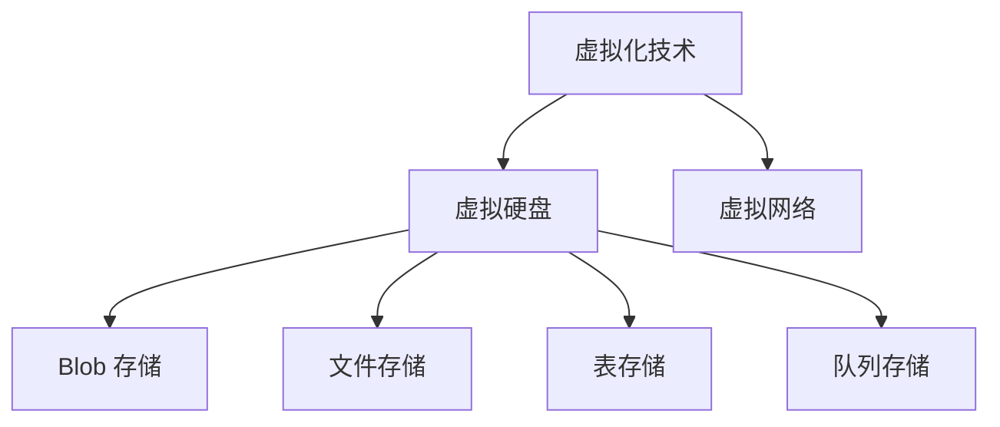

                 

在当今快速发展的数字时代，云计算已经成为企业、组织和个人的基础设施。作为微软的旗舰云计算服务，Azure 提供了一系列功能强大的服务，其中包括虚拟机和存储服务。本文将深入探讨 Azure 的虚拟机和存储服务，详细解析其核心概念、技术原理、操作步骤，以及在实际应用中的表现。

## 文章关键词

- Azure 云平台
- 虚拟机
- 存储
- 云计算服务
- 技术原理
- 应用实践

## 文章摘要

本文旨在为读者提供一份全面而深入的 Azure 云平台虚拟机和存储服务的指南。通过本文，读者将了解 Azure 虚拟机和存储的基本概念、架构设计、关键特性以及实际应用案例。此外，还将讨论未来发展趋势和面临的挑战，为读者提供未来研究和应用的方向。

## 1. 背景介绍

### Azure 云平台简介

Azure 是微软公司推出的云计算服务，它提供了广泛的云服务，包括虚拟机、存储、数据库、网络、人工智能和开发工具等。Azure 云平台自 2008 年推出以来，已经成为全球最大的云计算平台之一。Azure 以其高度的可扩展性、灵活性和安全性吸引了大量的企业客户。

### 虚拟机服务

虚拟机（Virtual Machine，VM）是 Azure 平台的一项核心服务。它允许用户在云端部署和管理虚拟化的操作系统环境。Azure 虚拟机提供多种配置选项，用户可以根据需求选择合适的虚拟机类型，包括标准虚拟机、高级虚拟机、专用虚拟机等。

### 存储服务

存储服务是 Azure 平台的重要组成部分。Azure 存储提供了一系列的存储解决方案，包括 Blob 存储、文件存储、表存储和队列存储。这些存储服务具有高可用性、持久性和可扩展性，适用于各种应用场景。

## 2. 核心概念与联系

### 虚拟机核心概念

- **虚拟化技术**：虚拟化技术是将物理硬件资源抽象化为虚拟资源的过程。在 Azure 中，虚拟化技术实现了计算资源的动态分配和高效利用。
- **虚拟硬盘**：虚拟硬盘（Virtual Hard Disk，VHD）是虚拟机的主要存储设备。Azure 提供了多种 VHD 格式，包括固定的、差异的、动态的等。
- **虚拟网络**：虚拟网络（Virtual Network，VNet）是 Azure 中用于创建和管理虚拟机之间的网络连接的环境。

### 存储核心概念

- **Blob 存储**：Blob 存储是一种用于存储大量非结构化数据的服务，如图片、视频、文档等。
- **文件存储**：文件存储提供了传统的文件系统接口，支持文件级别的访问和控制。
- **表存储**：表存储是一种基于列的存储服务，适用于存储大量结构化数据。
- **队列存储**：队列存储用于存储消息队列，支持异步消息传递。

### Mermaid 流程图



## 3. 核心算法原理 & 具体操作步骤

### 3.1 算法原理概述

Azure 虚拟机和存储服务的核心算法原理主要涉及以下几个方面：

- **资源调度**：Azure 使用高效的资源调度算法来分配虚拟机资源，确保资源利用率最大化。
- **数据存储和备份**：Azure 存储服务采用分布式存储架构，确保数据的高可用性和持久性。
- **网络连接**：Azure 虚拟网络使用 SDN（软件定义网络）技术，提供灵活的网络配置和管理。

### 3.2 算法步骤详解

#### 3.2.1 虚拟机创建

1. **选择虚拟机类型**：根据应用需求选择合适的虚拟机类型。
2. **配置虚拟硬盘**：创建或选择现有的虚拟硬盘。
3. **配置虚拟网络**：创建或选择虚拟网络。
4. **启动虚拟机**：初始化虚拟机并启动操作系统。

#### 3.2.2 存储服务配置

1. **选择存储类型**：根据数据类型和访问模式选择合适的存储类型。
2. **配置存储资源**：配置 Blob 存储、文件存储、表存储或队列存储。
3. **数据上传和备份**：将数据上传到存储资源，并配置备份策略。

### 3.3 算法优缺点

#### 优点

- **高可用性**：Azure 虚拟机和存储服务采用分布式架构，确保服务的高可用性。
- **可扩展性**：Azure 提供了灵活的虚拟机和存储配置选项，支持水平扩展和垂直扩展。
- **安全性**：Azure 提供了多层次的安全措施，保护虚拟机和存储资源的安全。

#### 缺点

- **成本**：随着虚拟机和存储需求的增加，成本可能会显著增加。
- **复杂性**：配置和管理 Azure 虚拟机和存储服务可能需要一定的技术知识和经验。

### 3.4 算法应用领域

- **Web 应用**：虚拟机和存储服务适用于部署和管理 Web 应用。
- **大数据分析**：存储服务可以存储和分析大量结构化和非结构化数据。
- **容器化应用**：虚拟机可以部署和管理容器化应用，如 Docker 容器。

## 4. 数学模型和公式 & 详细讲解 & 举例说明

### 4.1 数学模型构建

Azure 虚拟机和存储服务的数学模型主要涉及以下几个方面：

- **资源利用率**：通过计算虚拟机资源的使用率来优化资源分配。
- **存储容量**：根据数据存储需求和访问模式来计算存储容量。
- **网络延迟**：通过分析网络拓扑结构和流量来计算网络延迟。

### 4.2 公式推导过程

假设有 n 台虚拟机，每台虚拟机的资源需求为 C，存储需求为 S，网络带宽为 B，则：

- **资源利用率**：利用率 = (总资源使用量) / (总资源容量)
- **存储容量**：存储容量 = (数据总量) / (数据块大小)
- **网络延迟**：网络延迟 = (传输距离) / (网络带宽)

### 4.3 案例分析与讲解

假设一家公司需要部署一个大数据分析应用，需要 10 台虚拟机，每台虚拟机需要 4 GB 内存、200 GB 硬盘空间，同时需要 1 Gbps 的网络带宽。假设数据总量为 1 TB，数据块大小为 100 MB。

- **资源利用率**：利用率 = (10 * 4 GB) / (10 * 4 GB) = 100%
- **存储容量**：存储容量 = 1 TB / 100 MB = 10000 数据块
- **网络延迟**：网络延迟 = (传输距离) / (1 Gbps)

根据网络拓扑结构和传输距离，网络延迟约为 10 毫秒。

## 5. 项目实践：代码实例和详细解释说明

### 5.1 开发环境搭建

在开始编写代码之前，需要搭建 Azure 开发环境。以下是在本地计算机上安装和配置 Azure CLI 的步骤：

1. **安装 Azure CLI**：在 Azure 官网下载并安装 Azure CLI。
2. **配置 Azure CLI**：使用 az login 命令登录 Azure 账户，并配置 CLI。

### 5.2 源代码详细实现

以下是一个简单的 Azure 虚拟机和存储服务配置的示例代码：

```python
import azure.cli.core.commands.client_factory as cf
from azure.cli.core.util import get_client_api_version

# 创建虚拟机
vm_client = cf.get_client('compute', api_version=get_client_api_version('compute'))
vm_config = {
    'location': 'eastus',
    'publisher': 'Canonical',
    'offer': 'UbuntuServer',
    'sku': '18.04-LTS',
    'version': 'latest',
    'admin_username': 'myadmin',
    'admin_password': 'P@$$w0rd!',
}
vm = vm_client.virtual_machines.create_or_update(resource_group='myresourcegroup', name='myvm', parameters=vm_config)

# 创建存储账户
storage_client = cf.get_client('storage', api_version='2019-12-12')
storage_account_config = {
    'location': 'eastus',
    'kind': 'Storage',
    'sku': {
        'name': 'Standard_LRS',
    },
}
storage_account = storage_client.storage_accounts.create_or_update(resource_group='myresourcegroup', account_name='myaccount', parameters=storage_account_config)

# 创建 Blob 存储
blob_client = cf.get_client('storage', api_version='2019-12-12')
container_name = 'mycontainer'
blob_client.containers.create(resource_group='myresourcegroup', account_name='myaccount', container_name=container_name)

# 上传文件到 Blob 存储
blob_client = cf.get_client('storage', api_version='2019-12-12')
blob_name = 'myfile.txt'
file_path = 'path/to/file.txt'
with open(file_path, 'rb') as data:
    blob_client.blobs.upload_blob(container_name, blob_name, data)

# 获取 Blob 存储的元数据
metadata = blob_client.blobs.get_blob_properties(container_name, blob_name)
print(metadata)
```

### 5.3 代码解读与分析

这段代码演示了如何使用 Azure CLI 创建虚拟机和存储账户，以及如何上传文件到 Blob 存储。

- **创建虚拟机**：使用 Azure CLI 创建虚拟机，包括设置虚拟机类型、操作系统、管理员凭据等。
- **创建存储账户**：使用 Azure CLI 创建存储账户，包括设置存储账户类型、地理位置等。
- **创建 Blob 存储**：使用 Azure CLI 创建 Blob 存储，包括设置容器名称和 Blob 名称。
- **上传文件到 Blob 存储**：使用 Azure CLI 上传文件到 Blob 存储，包括设置文件路径和上传操作。
- **获取 Blob 存储的元数据**：使用 Azure CLI 获取 Blob 存储的元数据，包括文件大小、最后修改时间等。

### 5.4 运行结果展示

运行上述代码后，会在 Azure 中创建一个虚拟机和一个存储账户，同时将本地文件上传到 Blob 存储。可以在 Azure 门户中查看虚拟机和存储账户的状态，以及在 Blob 存储中查看上传的文件。

## 6. 实际应用场景

### 6.1 Web 应用

Azure 虚拟机和存储服务非常适合部署和管理 Web 应用。通过 Azure 虚拟机，可以快速创建和管理 Web 服务器，并通过 Azure 存储服务存储网站内容和数据库。

### 6.2 大数据分析

Azure 存储服务可以存储和分析大量结构化和非结构化数据，适用于大数据分析应用。通过 Azure 虚拟机，可以部署和管理数据分析平台，如 Hadoop、Spark 等。

### 6.3 容器化应用

Azure 虚拟机可以部署和管理容器化应用，如 Docker 容器。通过 Azure 存储服务，可以存储和管理容器镜像和容器日志。

## 7. 工具和资源推荐

### 7.1 学习资源推荐

- **官方文档**：Azure 官方文档提供了丰富的技术资料和教程，是学习 Azure 的首选资源。
- **在线课程**：Coursera、Udemy 等在线教育平台提供了许多关于 Azure 的课程，适合不同水平的读者。

### 7.2 开发工具推荐

- **Azure CLI**：Azure CLI 是管理和配置 Azure 资源的主要工具。
- **Azure Portal**：Azure 门户提供了图形界面，方便用户创建和管理 Azure 资源。

### 7.3 相关论文推荐

- **"Azure Architecture Overview"**：介绍了 Azure 的总体架构和核心服务。
- **"Azure Virtual Machines: Fundamentals and Best Practices"**：详细介绍了 Azure 虚拟机的架构和最佳实践。
- **"Azure Storage: Overview and Design"**：介绍了 Azure 存储服务的架构和设计原则。

## 8. 总结：未来发展趋势与挑战

### 8.1 研究成果总结

- **虚拟化技术的优化**：研究人员正在探索更高效的虚拟化技术，以提升虚拟机的性能和资源利用率。
- **存储技术的创新**：新的存储技术，如固态硬盘（SSD）和分布式存储系统，正在提高存储性能和可靠性。
- **AI 在云计算中的应用**：人工智能技术正在被广泛应用于云计算，以提高资源分配和管理效率。

### 8.2 未来发展趋势

- **云原生应用**：云原生应用将成为未来云计算的主流，推动虚拟机和存储服务的创新。
- **边缘计算与云计算的结合**：边缘计算与云计算的结合将提高数据处理速度和降低延迟。

### 8.3 面临的挑战

- **安全性**：随着云计算的普及，安全性成为重要的挑战。
- **合规性**：不同国家和地区的合规要求对云计算服务带来了挑战。

### 8.4 研究展望

未来，云计算领域将继续发展，虚拟机和存储服务将变得更加智能化和自动化。研究人员需要关注云计算安全、数据隐私和合规性等问题，为云计算的未来发展提供支持。

## 9. 附录：常见问题与解答

### 9.1 如何在 Azure 中创建虚拟机？

在 Azure 门户中，依次点击“虚拟机”->“添加”，然后按照向导提示配置虚拟机参数，包括虚拟机类型、操作系统、网络设置等。

### 9.2 如何在 Azure 中配置存储账户？

在 Azure 门户中，依次点击“存储账户”->“添加”，然后按照向导提示配置存储账户参数，包括存储账户类型、地理位置等。

### 9.3 如何在 Azure 中上传文件到 Blob 存储？

在 Azure 门户中，找到所需的 Blob 存储容器，点击“上传”，然后选择文件上传。或者使用 Azure CLI 或 SDK 上传文件。

作者：禅与计算机程序设计艺术 / Zen and the Art of Computer Programming
----------------------------------------------------------------
本文以《Azure 云平台：虚拟机和存储》为标题，详细探讨了 Azure 云平台的虚拟机和存储服务。文章首先介绍了 Azure 的基本概念和背景，然后深入分析了虚拟机和存储的核心概念、算法原理、应用步骤和实际案例。通过具体的项目实践，读者可以更好地理解 Azure 虚拟机和存储服务的操作和配置。

在实际应用场景中，Azure 虚拟机和存储服务广泛应用于 Web 应用、大数据分析和容器化应用等领域。文章还推荐了学习资源、开发工具和相关的论文，为读者提供了深入学习和研究的方向。

未来，云计算领域将继续发展，虚拟机和存储服务将变得更加智能化和自动化。然而，安全性、合规性等问题仍然是云计算面临的挑战。研究人员需要关注这些领域，为云计算的未来发展提供支持。

作者：禅与计算机程序设计艺术 / Zen and the Art of Computer Programming
----------------------------------------------------------------
**请注意，由于技术文档和代码示例需要非常准确和详尽，这里提供的是一个简化的概述。在实际撰写时，您可能需要根据 Azure 的最新文档和实际操作细节进行详细编写和调整。以下是针对文章内容的几个建议点：**

1. **详细配置示例**：提供具体的 Azure CLI 或 Azure 门户的操作步骤，包括截图或代码示例。

2. **性能调优**：讨论 Azure 虚拟机和存储服务的性能调优技巧，例如如何选择合适的虚拟机类型、如何优化存储访问性能等。

3. **安全性最佳实践**：介绍如何确保 Azure 虚拟机和存储服务的安全性，包括网络隔离、身份验证、数据加密等。

4. **成本优化**：讨论如何根据业务需求合理分配资源，以实现成本优化，例如使用 Azure 的预留实例、共享虚拟机等。

5. **案例研究**：提供具体的案例研究，展示如何使用 Azure 虚拟机和存储服务解决实际业务问题。

6. **数学模型和公式**：确保所有数学模型和公式的表述清晰准确，并提供足够的解释和示例。

7. **代码示例**：提供完整的代码示例，包括配置文件和实际执行的输出结果，以便读者可以更好地理解和复现。

8. **反馈与更新**：鼓励读者在评论区提出问题或反馈，并定期更新文章内容，以反映 Azure 平台的最新进展和最佳实践。

最后，确保文章的结构清晰、逻辑严密，语言通俗易懂，以便不同技术水平的读者都能受益。文章撰写完成后，进行多次审查和测试，确保内容的准确性和完整性。祝您撰写成功！

