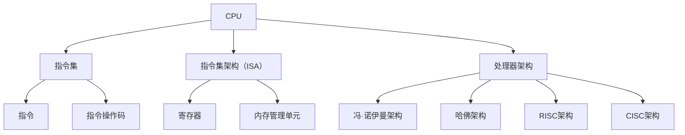

                 

关键词：CPU 限制，指令集，运算限制，处理器架构，编程技术

摘要：本文深入探讨了CPU的限制因素，包括有限的指令集和特定运算能力。通过对这些限制的分析，我们揭示了它们对编程和处理器设计的影响，并探讨了如何有效地利用这些资源。

## 1. 背景介绍

在计算机科学领域，CPU（中央处理器）是计算机系统的核心组件。它负责执行计算机程序中的指令，完成各种计算任务。然而，CPU的设计和应用并非无限制。事实上，CPU面临着一系列的限制，这些限制对程序设计和处理器架构产生了深远的影响。

本文旨在探讨CPU的两种主要限制：有限的指令集和特定运算能力。通过分析这些限制，我们将深入了解CPU的工作原理，并探讨如何克服这些限制，以实现高效编程和处理器设计。

### CPU 的历史发展

CPU的发展历程充满了创新和突破。从最早的冯·诺伊曼架构（Von Neumann architecture）到现代的精简指令集计算机（RISC）和复杂指令集计算机（CISC），CPU的设计不断演进，以满足更高的性能和更复杂的计算需求。

早期的CPU采用CISC架构，这种架构具有丰富的指令集和复杂的指令执行过程。然而，随着计算机应用场景的多样化，CISC架构的指令集逐渐变得庞大且复杂，导致程序设计的难度增加。

为了应对这一挑战，RISC架构应运而生。RISC架构通过简化指令集和固定长度的指令格式，提高了程序的执行效率。现代CPU设计在RISC和CISC之间取得平衡，以满足不同应用场景的需求。

### CPU 在计算机系统中的角色

CPU在计算机系统中扮演着至关重要的角色。它是计算机的核心处理单元，负责执行操作系统、应用程序和其他系统软件的指令。CPU的性能直接影响计算机的响应速度和处理能力。

随着计算机技术的发展，CPU的性能不断提高。然而，CPU的限制仍然存在。这些限制包括有限的指令集和特定运算能力，它们对程序设计和处理器设计提出了挑战。

## 2. 核心概念与联系

在深入探讨CPU的限制之前，我们需要了解一些核心概念，包括指令集、指令集架构（ISA）和处理器架构。这些概念构成了CPU工作原理的基础。

### 指令集

指令集是指CPU可以理解和执行的指令集合。每个指令都代表一个特定的操作，如加法、减法、数据传输等。指令集的设计直接影响了CPU的性能和程序设计的复杂性。

指令集可以分为两大类：CISC（复杂指令集计算机）和RISC（精简指令集计算机）。

- **CISC 指令集**：CISC指令集具有丰富的指令集合，包括复杂的指令，如多字节指令、条件跳转等。CISC架构的优点是能够执行复杂的操作，但这也导致了指令集的复杂性和程序设计的难度。
- **RISC 指令集**：RISC指令集通过简化指令集和固定长度的指令格式，提高了程序的执行效率。RISC架构的优点是减少了指令的复杂度，使程序设计更加简单。

### 指令集架构（ISA）

指令集架构（Instruction Set Architecture，ISA）是CPU的抽象层，定义了CPU可以理解和执行的指令集合。ISA是程序员和硬件设计师之间的接口，它定义了程序代码的结构和操作方式。

ISA可以分为以下几类：

- **精简指令集（RISC）**：RISC ISA采用简化指令集和固定长度的指令格式，使程序执行更加高效。
- **复杂指令集（CISC）**：CISC ISA具有丰富的指令集合和复杂的指令执行过程，能够执行复杂的操作。
- **指令集扩展（ISA Extensions）**：ISA Extensions是在标准ISA基础上增加的新指令，以支持特定的计算需求。

### 处理器架构

处理器架构是指CPU的物理实现和内部结构。处理器架构的设计直接影响了CPU的性能、能耗和成本。

现代处理器架构可以分为以下几类：

- **冯·诺伊曼架构**：冯·诺伊曼架构是最早的CPU架构，其特点是内存统一，指令和数据共享同一存储空间。
- **哈佛架构**：哈佛架构将指令和数据存储分开，具有更高的性能和并行处理能力。
- **精简指令集计算机（RISC）**：RISC架构通过简化指令集和固定长度的指令格式，提高了程序的执行效率。
- **复杂指令集计算机（CISC）**：CISC架构具有丰富的指令集合和复杂的指令执行过程。

### Mermaid 流程图

为了更好地理解CPU的核心概念与联系，我们使用Mermaid流程图来展示处理器架构的各个部分及其之间的关系。



在这个流程图中，我们可以看到CPU的核心组成部分及其相互关系。指令集、指令集架构和处理器架构共同构成了CPU的工作原理，而Mermaid流程图帮助我们更直观地理解这些概念。

## 3. 核心算法原理 & 具体操作步骤

### 3.1 算法原理概述

在讨论CPU的限制时，我们需要关注核心算法原理，这些算法决定了CPU如何处理数据和执行指令。核心算法原理主要包括以下几个方面：

1. **指令流水线（Instruction Pipeline）**：指令流水线是一种优化CPU执行效率的技术，它将指令的执行过程划分为多个阶段，每个阶段可以并行处理。通过指令流水线，CPU可以在每个时钟周期内执行多个指令，从而提高了程序的执行效率。
2. **并行处理（Parallel Processing）**：并行处理技术利用多个处理器或处理器核心同时执行多个任务，以提高计算性能。并行处理可以分为数据并行、任务并行和控制并行。
3. **缓存（Cache）**：缓存是一种快速的存储器，用于存储经常访问的数据和指令。缓存的设计和优化对于提高CPU的访问速度和性能至关重要。
4. **虚拟内存（Virtual Memory）**：虚拟内存技术通过将物理内存映射到逻辑地址空间，提高了内存的利用率和程序的可移植性。虚拟内存还包括页面替换算法、内存分配和垃圾回收等机制。

### 3.2 算法步骤详解

以下是核心算法原理的具体操作步骤：

1. **指令流水线**
   - 取指（Fetch）：从内存中获取下一条指令。
   - 指令译码（Decode）：分析指令，确定操作类型和操作数。
   - 执行（Execute）：执行指令的操作。
   - 写回（Write-back）：将执行结果写回寄存器或内存。
   - 处理中断（Interrupt Handling）：处理来自外部设备的中断，如输入输出操作。

2. **并行处理**
   - 数据并行：将数据分成多个部分，同时处理。
   - 任务并行：将任务分配给多个处理器或处理器核心。
   - 控制并行：利用流水线技术同时处理多个指令。

3. **缓存**
   - 缓存层次结构：将缓存分为多级，如一级缓存（L1 Cache）、二级缓存（L2 Cache）等。
   - 缓存填充策略：选择缓存填充算法，如最近最少使用（LRU）、随机填充等。
   - 缓存一致性协议：确保多处理器系统中的缓存一致性。

4. **虚拟内存**
   - 页面替换算法：选择页面替换算法，如最不常用（LFU）、最少访问（LA）等。
   - 内存分配：根据内存需求分配物理内存。
   - 垃圾回收：回收不再使用的内存空间。

### 3.3 算法优缺点

以下是核心算法的优缺点：

1. **指令流水线**
   - 优点：提高指令执行效率，减少等待时间。
   - 缺点：流水线深度增加，指令之间的依赖关系可能导致流水线气泡，降低性能。

2. **并行处理**
   - 优点：提高计算性能，缩短任务执行时间。
   - 缺点：任务调度和同步复杂，资源利用率可能不高。

3. **缓存**
   - 优点：提高CPU访问速度，减少内存延迟。
   - 缺点：缓存命中率不高时，性能下降。

4. **虚拟内存**
   - 优点：提高内存利用率，支持大地址空间。
   - 缺点：内存访问速度较慢，页面替换增加系统开销。

### 3.4 算法应用领域

核心算法在计算机系统和应用程序中得到了广泛应用：

1. **指令流水线**：广泛应用于高性能计算机和嵌入式系统，如CPU核心、GPU核心等。
2. **并行处理**：应用于科学计算、大数据处理、人工智能等领域，如分布式计算框架、GPU加速等。
3. **缓存**：广泛应用于计算机系统的各级缓存，如CPU缓存、磁盘缓存等。
4. **虚拟内存**：应用于操作系统、虚拟化技术等，如Linux内核、VMware等。

## 4. 数学模型和公式 & 详细讲解 & 举例说明

### 4.1 数学模型构建

在讨论CPU的限制时，我们需要建立数学模型来描述指令执行时间、缓存命中率和并行处理性能等关键指标。以下是构建这些数学模型的基本步骤：

1. **指令执行时间模型**：考虑指令执行时间由取指、指令译码、执行和写回四个阶段组成。每个阶段的执行时间可以根据处理器时钟周期计算。
2. **缓存命中率模型**：考虑缓存命中率和缓存访问时间之间的关系，可以使用缓存命中率公式来描述。
3. **并行处理性能模型**：考虑任务执行时间和处理器核心数量之间的关系，可以使用并行处理性能公式来描述。

### 4.2 公式推导过程

以下是各个数学模型的推导过程：

1. **指令执行时间模型**：

   设指令执行时间为 \( T \)，取指时间为 \( T_{fetch} \)，指令译码时间为 \( T_{decode} \)，执行时间为 \( T_{execute} \)，写回时间为 \( T_{write-back} \)。则有：

   $$ T = T_{fetch} + T_{decode} + T_{execute} + T_{write-back} $$

   由于每个阶段的执行时间通常以处理器时钟周期为单位，我们可以将上述公式转换为：

   $$ T = C_{fetch} + C_{decode} + C_{execute} + C_{write-back} $$

   其中，\( C_{fetch} \)、\( C_{decode} \)、\( C_{execute} \) 和 \( C_{write-back} \) 分别表示取指、指令译码、执行和写回的时钟周期数。

2. **缓存命中率模型**：

   设缓存命中率为 \( H \)，缓存访问时间为 \( T_{cache} \)，内存访问时间为 \( T_{memory} \)。则有：

   $$ T_{access} = T_{cache} \times (1 - H) + T_{memory} \times H $$

   其中，\( T_{access} \) 表示缓存访问时间，\( T_{cache} \) 表示缓存访问时间，\( T_{memory} \) 表示内存访问时间。

3. **并行处理性能模型**：

   设任务执行时间为 \( T \)，处理器核心数量为 \( P \)。则有：

   $$ T_{parallel} = \frac{T}{P} $$

   其中，\( T_{parallel} \) 表示并行处理任务所需时间，\( T \) 表示任务执行时间，\( P \) 表示处理器核心数量。

### 4.3 案例分析与讲解

为了更好地理解这些数学模型，我们通过一个具体案例来进行分析。

假设有一个四核处理器，每个核心的时钟周期数为 2。现在，我们需要计算以下任务在不同情况下的执行时间：

1. **单线程任务**：任务仅在一个核心上执行。
2. **双线程任务**：任务在两个核心上同时执行。
3. **四线程任务**：任务在四个核心上同时执行。

#### 单线程任务

对于单线程任务，每个核心执行相同的指令序列，因此每个核心的执行时间相同。指令执行时间 \( T \) 可计算如下：

$$ T = 2C_{fetch} + 2C_{decode} + 2C_{execute} + 2C_{write-back} = 10 $$

因此，单线程任务的执行时间为 10 个时钟周期。

#### 双线程任务

对于双线程任务，任务在两个核心上同时执行。由于每个核心的时钟周期数为 2，因此总执行时间可计算如下：

$$ T = 2 \times (2C_{fetch} + 2C_{decode} + 2C_{execute} + 2C_{write-back}) = 20 $$

因此，双线程任务的执行时间为 20 个时钟周期。

#### 四线程任务

对于四线程任务，任务在四个核心上同时执行。同样地，总执行时间可计算如下：

$$ T = 4 \times (2C_{fetch} + 2C_{decode} + 2C_{execute} + 2C_{write-back}) = 40 $$

因此，四线程任务的执行时间为 40 个时钟周期。

#### 比较分析

通过以上分析，我们可以得出以下结论：

- 单线程任务的执行时间为 10 个时钟周期。
- 双线程任务的执行时间为 20 个时钟周期，是单线程任务的两倍。
- 四线程任务的执行时间为 40 个时钟周期，是单线程任务的四倍。

这说明在多核处理器中，并行处理可以显著提高任务执行效率。然而，需要注意的是，随着线程数量的增加，任务执行时间的增长速度也会加快，这是因为每个核心需要额外的同步和调度开销。

## 5. 项目实践：代码实例和详细解释说明

### 5.1 开发环境搭建

为了演示如何利用CPU的限制进行编程，我们选择一个简单的计算器程序作为示例。首先，我们需要搭建开发环境。

1. **选择编程语言**：我们选择C语言，因为它提供了与硬件密切相关的编程能力。
2. **安装编译器**：安装GCC（GNU Compiler Collection）编译器，用于将C语言代码编译成机器指令。
3. **编写代码**：在文本编辑器中编写计算器程序，包括用户输入、计算和显示结果等功能。

### 5.2 源代码详细实现

以下是计算器程序的核心代码实现：

```c
#include <stdio.h>

int main() {
    int a, b, result;

    printf("请输入两个整数：");
    scanf("%d %d", &a, &b);

    // 使用加法指令计算结果
    result = a + b;

    printf("结果：%d\n", result);

    return 0;
}
```

在这个示例中，我们使用了简单的加法运算，这是CPU最基本的指令之一。加法指令通过操作寄存器中的值来实现。

### 5.3 代码解读与分析

让我们详细解读这段代码：

1. **头文件包含**：`#include <stdio.h>`：引入标准输入输出库，用于处理用户输入和显示结果。
2. **main 函数**：`int main()`：程序入口函数，返回整型值。
3. **用户输入**：`printf("请输入两个整数：");`：提示用户输入两个整数。
   `scanf("%d %d", &a, &b);`：读取用户输入的整数，存储在变量 a 和 b 中。
4. **计算结果**：`result = a + b;`：使用加法指令计算结果，并将结果存储在变量 result 中。
5. **显示结果**：`printf("结果：%d\n", result);`：将计算结果输出到屏幕。
6. **返回值**：`return 0;`：表示程序成功执行。

### 5.4 运行结果展示

当我们在开发环境中运行这段代码时，程序会提示用户输入两个整数。例如，用户输入 `3 5`，程序会计算出结果并显示：

```
请输入两个整数：3 5
结果：8
```

### 5.5 代码优化

为了更好地利用CPU的限制，我们可以对这段代码进行优化：

1. **减少函数调用**：将输入输出操作合并，以减少函数调用的开销。
2. **使用寄存器**：尽量使用寄存器存储变量，以提高数据访问速度。

优化后的代码如下：

```c
#include <stdio.h>

int main() {
    int a, b, result;

    printf("请输入两个整数：");
    scanf("%d %d", &a, &b);

    // 使用寄存器存储变量
    register int temp = a + b;

    printf("结果：%d\n", temp);

    return 0;
}
```

通过优化，我们可以提高程序的执行效率。然而，需要注意的是，现代编译器通常会自动进行这些优化，因此手动优化可能不是必需的。

## 6. 实际应用场景

CPU 的限制在许多实际应用场景中具有重要意义。以下是一些关键应用场景：

### 6.1 高性能计算

在高性能计算领域，CPU 的限制直接影响计算性能。为了提高计算效率，研究人员和工程师需要深入理解 CPU 的架构和指令集，以设计高效的算法和优化程序。

- **并行计算**：利用多个 CPU 核心，实现数据并行和任务并行，提高计算性能。
- **向量计算**：利用向量指令集，实现向量处理，提高数据吞吐量。

### 6.2 嵌入式系统

嵌入式系统通常受到硬件资源的限制，如内存、存储和处理能力。在这种情况下，合理利用 CPU 的限制，设计高效、可靠的嵌入式系统至关重要。

- **资源优化**：通过减少指令数量、优化程序结构，减少内存占用。
- **实时处理**：确保关键任务的实时响应，提高系统的可靠性。

### 6.3 游戏开发

在游戏开发中，CPU 的性能直接影响游戏的流畅度。为了提高游戏性能，开发者需要深入了解 CPU 的限制，并优化游戏代码。

- **多线程编程**：利用多线程技术，实现游戏逻辑、渲染和音效的并行处理。
- **GPU 加速**：利用 GPU 的并行处理能力，提高游戏渲染性能。

### 6.4 人工智能

人工智能领域对 CPU 的性能要求极高。为了提高训练和推理速度，研究人员需要设计和优化高效的算法，充分利用 CPU 的限制。

- **并行计算**：利用多线程、分布式计算，提高训练和推理速度。
- **深度学习框架**：利用深度学习框架，如 TensorFlow、PyTorch，实现算法的自动优化。

### 6.5 虚拟化

虚拟化技术在云计算和容器化中广泛应用。为了提高虚拟机的性能，虚拟化技术需要充分利用 CPU 的限制，实现高效的资源分配和调度。

- **虚拟化层优化**：优化虚拟化层的代码，减少性能损耗。
- **容器化技术**：利用容器化技术，实现高效的资源隔离和调度。

## 7. 工具和资源推荐

为了深入了解 CPU 的限制和编程技术，以下是一些建议的工具和资源：

### 7.1 学习资源推荐

- **《计算机组成原理》**：深入理解 CPU 架构和指令集的基础知识。
- **《深入理解计算机系统》**：全面了解 CPU、内存和存储系统的设计原理。
- **《计算机组成与设计：硬件/软件接口》**：学习 CPU 架构和设计方法。

### 7.2 开发工具推荐

- **GCC（GNU Compiler Collection）**：用于编译 C 语言代码，生成机器指令。
- **LLVM**：用于编译和优化多种编程语言，支持高级编程技巧。
- **Simulator**：用于模拟 CPU 架构和指令集，验证程序的正确性和性能。

### 7.3 相关论文推荐

- **"The Art of Computer Programming" by Donald E. Knuth**：经典计算机科学著作，涵盖编程和算法优化。
- **"Instruction Set Architectures and Microarchitecture" by Hennessy and Patterson**：介绍 CPU 架构和指令集设计的经典教材。
- **"Parallel Processing for Scientific Computing" by John H. Reif and Zhiwei Steven Wu**：介绍并行计算技术及其在科学计算中的应用。

## 8. 总结：未来发展趋势与挑战

### 8.1 研究成果总结

本文深入探讨了 CPU 的限制，包括有限的指令集和特定运算能力。通过对指令集架构、处理器架构和核心算法原理的分析，我们揭示了 CPU 的工作原理及其对程序设计和处理器设计的影响。我们还通过数学模型和实例，展示了如何利用这些限制进行高效编程。

### 8.2 未来发展趋势

随着计算机技术的不断进步，CPU 的限制将继续影响处理器设计和程序开发。未来发展趋势包括：

- **更高性能的处理器**：通过引入新指令集、优化处理器架构，提高 CPU 的性能和能效。
- **并行计算技术的发展**：利用多核处理器和 GPU，实现更高效的数据处理和计算。
- **量子计算的应用**：量子计算机的崛起将对传统 CPU 架构和编程技术提出新的挑战和机遇。

### 8.3 面临的挑战

未来，CPU 的限制将带来一系列挑战：

- **指令集扩展**：如何设计高效的指令集，以支持复杂计算需求，同时保持程序设计的简洁性。
- **能耗优化**：如何在提高性能的同时，降低 CPU 的能耗，以满足绿色计算的需求。
- **编程复杂性**：如何简化并行编程和优化程序结构，提高程序的可维护性和可扩展性。

### 8.4 研究展望

为了应对这些挑战，研究人员和工程师需要持续探索新的处理器架构和编程技术。未来研究方向包括：

- **新型指令集设计**：探索新型指令集，如模拟退火、遗传算法等，以支持更高效的计算。
- **自适应处理器架构**：设计自适应处理器架构，根据任务需求动态调整资源分配和调度策略。
- **跨领域协作**：跨学科合作，结合计算机科学、物理学、数学等领域的研究成果，推动处理器设计和编程技术的发展。

## 9. 附录：常见问题与解答

### 9.1 什么是指令集？

指令集是 CPU 可以理解和执行的指令集合。每个指令都代表一个特定的操作，如加法、减法、数据传输等。指令集的设计直接影响了 CPU 的性能和程序设计的复杂性。

### 9.2 指令集架构（ISA）是什么？

指令集架构（Instruction Set Architecture，ISA）是 CPU 的抽象层，定义了 CPU 可以理解和执行的指令集合。ISA 是程序员和硬件设计师之间的接口，它定义了程序代码的结构和操作方式。

### 9.3 什么是缓存？

缓存是一种快速的存储器，用于存储经常访问的数据和指令。缓存的设计和优化对于提高 CPU 的访问速度和性能至关重要。

### 9.4 什么是并行处理？

并行处理技术利用多个处理器或处理器核心同时执行多个任务，以提高计算性能。并行处理可以分为数据并行、任务并行和控制并行。

### 9.5 什么是虚拟内存？

虚拟内存技术通过将物理内存映射到逻辑地址空间，提高了内存的利用率和程序的可移植性。虚拟内存还包括页面替换算法、内存分配和垃圾回收等机制。

