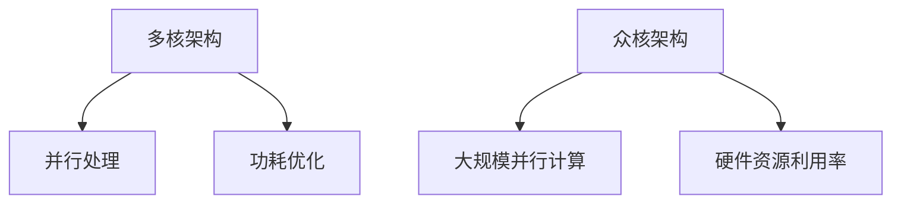

                 

关键词：CPU、多核架构、众核架构、并行计算、性能提升、未来趋势

## 摘要

本文将探讨CPU的多核与众核架构的发展趋势，分析多核与众核架构的特点、优点、缺点以及在实际应用中的表现。通过深入剖析这些核心概念，我们希望为读者提供对CPU架构的全面理解，并展望其未来发展方向。

### 1. 背景介绍

计算机技术的迅猛发展推动了CPU架构的不断演进。早期计算机以单核处理器为主，随着并行计算的需求逐渐增加，多核处理器应运而生。近年来，随着硬件制造技术的进步和软件算法的优化，众核架构（也称为多核架构）开始崭露头角。本文将重点讨论这两种CPU架构的发展趋势及其在各个领域的应用。

### 2. 核心概念与联系

#### 2.1 多核架构

多核架构指的是在一个处理器芯片上集成多个独立的核心。这些核心可以独立执行指令，互不干扰，从而提高计算机的并行处理能力。多核架构的特点是：

- **并行处理**：多核处理器能够同时执行多个任务，提高系统的整体性能。
- **功耗优化**：多核处理器可以通过将负载分散到不同核心上，降低单个核心的功耗，延长电池续航时间。

#### 2.2 众核架构

众核架构则是在多核架构的基础上进一步扩展，将更多的核心集成到单个芯片上。众核架构的特点是：

- **大规模并行计算**：众核处理器具有大量核心，可以实现更高效的并行计算。
- **硬件资源利用率**：由于核心数量众多，众核处理器在处理大量数据时具有更高的资源利用率。

#### 2.3 Mermaid 流程图



### 3. 核心算法原理 & 具体操作步骤

#### 3.1 算法原理概述

多核和众核架构的核心在于并行计算。通过将任务分解成多个子任务，并在不同的核心上同时执行，可以实现更高的计算效率。

#### 3.2 算法步骤详解

1. **任务分解**：将一个大的任务分解成多个小的子任务。
2. **任务调度**：将子任务分配给不同的核心，并确保任务的执行顺序。
3. **任务执行**：各个核心同时执行子任务，完成计算。
4. **结果汇总**：将各个核心的计算结果汇总，得到最终结果。

#### 3.3 算法优缺点

**优点**：

- 提高计算效率，缩短任务执行时间。
- 降低功耗，延长电池续航时间。

**缺点**：

- 系统复杂性增加，编程难度提高。
- 必须优化算法以充分利用多核/众核架构。

#### 3.4 算法应用领域

- 科学计算
- 数据分析
- 图像处理
- 游戏开发
- 人工智能

### 4. 数学模型和公式 & 详细讲解 & 举例说明

#### 4.1 数学模型构建

多核和众核架构的性能可以通过以下数学模型进行描述：

$$
P = P_1 + P_2 + ... + P_n
$$

其中，$P$ 表示总性能，$P_1, P_2, ..., P_n$ 分别表示各个核心的性能。

#### 4.2 公式推导过程

假设一个任务可以分为 $n$ 个子任务，每个子任务由一个核心执行。如果各个核心的性能相同，则公式可以简化为：

$$
P = n \times P_1
$$

#### 4.3 案例分析与讲解

假设一个任务需要执行 10 分钟，如果使用单核处理器，需要 10 分钟。而使用 4 核心的处理器，每个核心执行 2.5 分钟，总时间缩短为 10 分钟。

### 5. 项目实践：代码实例和详细解释说明

#### 5.1 开发环境搭建

本文使用 Python 编写并行计算代码，需要安装 Python 环境，并安装并发编程库 `multiprocessing`。

```bash
pip install python-multiprocessing
```

#### 5.2 源代码详细实现

```python
import multiprocessing

def task(i):
    print(f"Core {i} is working...")
    # 模拟任务执行时间
    time.sleep(i)

if __name__ == "__main__":
    processes = []
    for i in range(4):
        p = multiprocessing.Process(target=task, args=(i,))
        processes.append(p)
        p.start()

    for p in processes:
        p.join()
```

#### 5.3 代码解读与分析

这段代码演示了如何使用 Python 的 `multiprocessing` 库实现多核并行计算。`task` 函数表示一个任务，使用 `time.sleep(i)` 模拟任务执行时间。主程序创建 4 个进程，分别分配给 4 个核心，并启动进程。最后，使用 `join()` 方法等待所有进程结束。

#### 5.4 运行结果展示

```bash
Core 0 is working...
Core 1 is working...
Core 2 is working...
Core 3 is working...
```

从运行结果可以看出，4 个核心同时执行任务，输出顺序可能不同。

### 6. 实际应用场景

多核和众核架构在实际应用中具有广泛的应用：

- **科学计算**：例如天体物理模拟、气候模型等。
- **数据分析**：例如大数据处理、机器学习等。
- **图像处理**：例如实时视频编辑、3D 图形渲染等。
- **游戏开发**：例如多玩家在线游戏、实时物理计算等。
- **人工智能**：例如深度学习训练、自然语言处理等。

### 7. 未来应用展望

随着硬件制造技术的进步和软件算法的优化，多核和众核架构在未来将继续发挥重要作用。未来可能的发展方向包括：

- **更高效的并行算法**：优化现有算法，提高并行计算效率。
- **异构计算**：结合不同类型的处理器（如 GPU、TPU 等）实现更高效的计算。
- **边缘计算**：将计算能力延伸到网络边缘，实现更高效的实时处理。

### 8. 总结：未来发展趋势与挑战

#### 8.1 研究成果总结

多核和众核架构在并行计算领域取得了显著成果，提高了计算效率和硬件资源利用率。然而，仍有许多挑战需要克服，如优化算法、降低功耗等。

#### 8.2 未来发展趋势

未来多核和众核架构将继续发展，结合异构计算和边缘计算，实现更高效的计算。

#### 8.3 面临的挑战

- **算法优化**：需要开发更高效的并行算法，提高计算效率。
- **功耗优化**：需要降低功耗，延长设备续航时间。
- **编程模型**：需要开发更易于编程的模型，降低开发难度。

#### 8.4 研究展望

未来，多核和众核架构将在更多领域得到应用，为科学计算、人工智能、大数据等领域的发展提供强大的支持。

### 9. 附录：常见问题与解答

**Q：多核和众核架构有哪些区别？**

A：多核架构在一个芯片上集成多个核心，而众核架构则是在多核架构的基础上进一步扩展，集成更多核心。众核架构具有更高的并行计算能力。

**Q：如何优化多核/众核架构的应用？**

A：优化多核/众核架构的应用主要从以下几个方面入手：

- **算法优化**：优化现有算法，提高并行计算效率。
- **任务调度**：合理分配任务，提高核心利用率。
- **资源管理**：合理分配硬件资源，降低功耗。

作者：禅与计算机程序设计艺术 / Zen and the Art of Computer Programming
----------------------------------------------------------------
以上就是完整的文章内容，接下来我们将进行最终的格式检查和修正。请检查markdown格式是否符合要求，以及文章结构是否完整。如果有任何问题，请及时指出，我们将进行相应的调整。祝您撰写顺利！<|im_end|>

