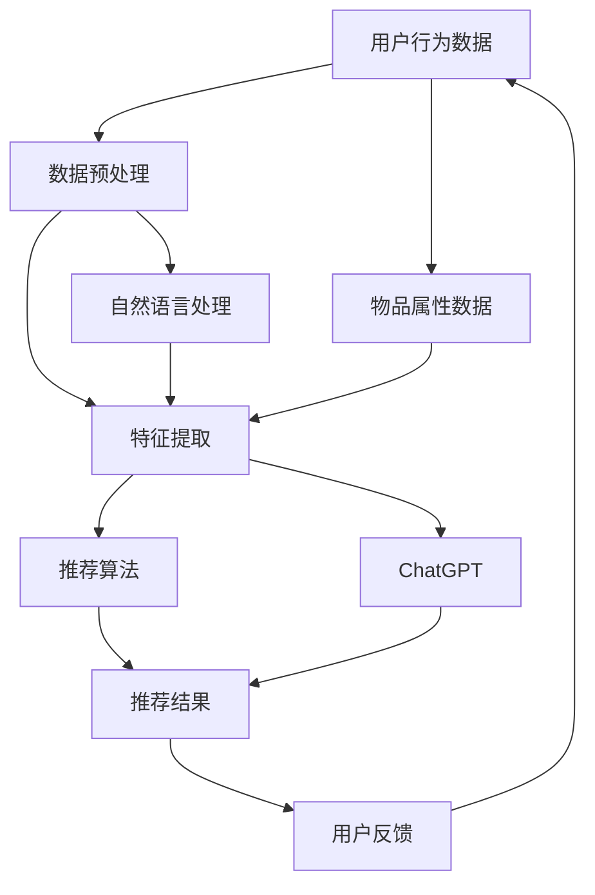

                 

关键词：ChatGPT、推荐系统、自然语言处理、性能分析、局限性

摘要：本文深入探讨了ChatGPT在推荐系统中的应用情况，分析了其性能表现以及存在的局限性。通过对ChatGPT在推荐系统中的核心概念、算法原理、数学模型和实际应用等方面的详细分析，为推荐系统研究者提供了宝贵的参考。

## 1. 背景介绍

随着互联网和大数据技术的快速发展，推荐系统已经成为现代信息检索领域的重要研究方向。推荐系统通过分析用户行为数据和物品属性，为用户提供个性化的推荐结果，从而提高用户的满意度和使用体验。然而，传统的推荐系统在处理复杂问题和处理大规模数据方面存在一定的局限性。因此，如何提高推荐系统的性能和解决其局限性成为了一个重要的研究课题。

近年来，基于深度学习、自然语言处理等技术的推荐系统研究取得了显著进展。其中，ChatGPT作为一种基于变换器模型（Transformer）的预训练语言模型，因其强大的文本生成能力和语义理解能力，在推荐系统中受到了广泛关注。本文将对ChatGPT在推荐领域的内部研究进行深入分析，探讨其性能表现和局限性。

## 2. 核心概念与联系

在探讨ChatGPT在推荐领域的应用之前，我们首先需要了解推荐系统、自然语言处理（NLP）以及ChatGPT的基本概念和联系。

### 2.1 推荐系统

推荐系统是一种基于用户行为和物品属性的算法模型，用于预测用户对某个物品的偏好，从而为用户提供个性化的推荐结果。推荐系统可以应用于各种场景，如电商、社交媒体、视频网站等。其核心目标是提高用户的满意度和使用体验，从而增加用户粘性和商业价值。

### 2.2 自然语言处理（NLP）

自然语言处理是计算机科学和人工智能领域的一个重要分支，旨在使计算机理解和处理人类语言。NLP涉及到许多技术，如文本分类、信息提取、情感分析等。NLP技术在推荐系统中的应用主要体现在对用户评论、标签等文本数据的处理和分析，从而更好地理解用户偏好和兴趣。

### 2.3 ChatGPT

ChatGPT是由OpenAI开发的一种基于变换器模型的预训练语言模型。它通过学习大量的文本数据，掌握了丰富的语言表达能力和语义理解能力。ChatGPT的主要优势在于其强大的文本生成能力，可以生成连贯、具有语境意义的文本。这使得ChatGPT在推荐系统中具有很大的应用潜力，可以用于生成个性化的推荐文案、标签等。

### 2.4 核心概念原理和架构的 Mermaid 流程图

下面是推荐系统中核心概念原理和架构的Mermaid流程图：



## 3. 核心算法原理 & 具体操作步骤

### 3.1 算法原理概述

ChatGPT在推荐系统中的应用主要通过以下几个步骤实现：

1. **数据预处理**：对用户行为数据和物品属性数据进行清洗、去噪和标准化等预处理操作，以便后续的特征提取和推荐算法的运行。
2. **特征提取**：通过自然语言处理技术，对文本数据进行情感分析、关键词提取等操作，提取出与用户偏好和兴趣相关的特征。
3. **推荐算法**：利用基于深度学习的推荐算法，如基于模型的协同过滤、基于内容的推荐等，生成个性化的推荐结果。
4. **文本生成**：利用ChatGPT的文本生成能力，生成具有语境意义、个性化的推荐文案或标签。
5. **用户反馈**：收集用户对推荐结果的反馈，用于优化推荐算法和改进文本生成效果。

### 3.2 算法步骤详解

#### 3.2.1 数据预处理

数据预处理是推荐系统中的关键步骤，其质量直接影响到后续的特征提取和推荐算法的效果。数据预处理主要包括以下操作：

1. **数据清洗**：去除无效数据、重复数据和异常数据，保证数据的一致性和准确性。
2. **去噪**：对含有噪声的数据进行滤波、降噪等处理，提高数据质量。
3. **标准化**：对数据量级进行统一处理，使其在相同的量级范围内，以避免数据偏移和模型不稳定。

#### 3.2.2 特征提取

特征提取是推荐系统中的核心步骤，其目的是将原始数据转化为可用于训练和预测的特征向量。在推荐系统中，特征提取主要包括以下方面：

1. **用户行为特征**：提取用户的历史行为数据，如浏览记录、购买记录、评论等，通过自然语言处理技术对文本数据进行情感分析、关键词提取等操作，提取出与用户偏好和兴趣相关的特征。
2. **物品属性特征**：提取物品的属性数据，如标题、描述、标签等，通过自然语言处理技术对文本数据进行情感分析、关键词提取等操作，提取出与物品特性相关的特征。

#### 3.2.3 推荐算法

推荐算法是推荐系统的核心，其主要任务是利用用户行为特征和物品属性特征，生成个性化的推荐结果。在推荐系统中，常用的推荐算法包括以下几种：

1. **基于模型的协同过滤**：通过计算用户之间的相似度，为用户提供相似用户的推荐结果。
2. **基于内容的推荐**：通过分析物品的属性特征，为用户提供与物品内容相似的推荐结果。
3. **混合推荐**：将基于模型的协同过滤和基于内容的推荐进行结合，以提高推荐效果。

#### 3.2.4 文本生成

文本生成是ChatGPT在推荐系统中的重要应用，其目的是为用户提供具有语境意义、个性化的推荐文案或标签。ChatGPT的文本生成过程主要包括以下步骤：

1. **输入文本**：根据用户行为特征和物品属性特征，生成一个包含用户偏好和物品特性的输入文本。
2. **文本预处理**：对输入文本进行清洗、去噪和标准化等预处理操作，以便ChatGPT更好地理解和生成文本。
3. **文本生成**：利用ChatGPT的文本生成能力，生成一个具有语境意义、个性化的推荐文案或标签。
4. **文本优化**：根据用户反馈，对生成的文本进行优化，以提高用户满意度。

#### 3.2.5 用户反馈

用户反馈是推荐系统持续优化和改进的重要途径。通过收集用户对推荐结果的反馈，可以不断优化推荐算法和改进文本生成效果。用户反馈主要包括以下方面：

1. **点击率**：记录用户对推荐结果的点击行为，用于评估推荐结果的准确性。
2. **购买率**：记录用户对推荐结果的购买行为，用于评估推荐结果的商业价值。
3. **满意度**：通过问卷调查、用户评价等方式，收集用户对推荐结果的满意度。

### 3.3 算法优缺点

#### 优点

1. **强大的文本生成能力**：ChatGPT具有强大的文本生成能力，可以生成连贯、具有语境意义的文本，为用户提供个性化的推荐文案或标签。
2. **灵活的推荐算法**：推荐系统结合了基于模型的协同过滤和基于内容的推荐，可以适应不同的应用场景和需求。
3. **持续优化**：通过用户反馈，推荐系统可以不断优化推荐算法和改进文本生成效果，提高用户满意度和商业价值。

#### 缺点

1. **数据依赖性**：推荐系统对用户行为数据和物品属性数据具有较高的依赖性，数据质量直接影响到推荐效果。
2. **计算资源消耗**：ChatGPT的文本生成过程需要大量的计算资源，对服务器和硬件设施的要求较高。
3. **难以处理长文本**：ChatGPT在处理长文本方面存在一定的局限性，难以生成高质量、连贯的长文本。

### 3.4 算法应用领域

ChatGPT在推荐系统中的应用具有广泛的前景，可以应用于以下领域：

1. **电商推荐**：通过分析用户的历史购买记录和浏览记录，为用户提供个性化的商品推荐。
2. **社交媒体**：根据用户的兴趣和社交关系，为用户提供个性化的内容推荐，如文章、视频等。
3. **视频网站**：根据用户的观看历史和偏好，为用户提供个性化的视频推荐。
4. **音乐推荐**：根据用户的听歌习惯和偏好，为用户提供个性化的音乐推荐。

## 4. 数学模型和公式 & 详细讲解 & 举例说明

### 4.1 数学模型构建

ChatGPT在推荐系统中的应用涉及到多个数学模型的构建，主要包括以下方面：

#### 4.1.1 用户偏好模型

用户偏好模型用于表示用户对物品的偏好程度，通常采用如下公式：

$$
\text{user\_preference}(u, i) = \text{score}(u) + \text{item\_score}(i) - \text{noise}
$$

其中，$u$ 表示用户，$i$ 表示物品，$\text{score}(u)$ 表示用户偏好得分，$\text{item\_score}(i)$ 表示物品得分，$\text{noise}$ 表示噪声项。

#### 4.1.2 文本生成模型

文本生成模型用于生成个性化的推荐文案或标签，通常采用如下公式：

$$
\text{generated\_text} = \text{ChatGPT}(\text{input\_text})
$$

其中，$\text{input\_text}$ 表示输入文本，$\text{ChatGPT}(\text{input\_text})$ 表示ChatGPT对输入文本进行生成。

#### 4.1.3 推荐结果模型

推荐结果模型用于表示推荐结果的质量，通常采用如下公式：

$$
\text{recommendation\_quality}(r) = \frac{\text{click\_rate}(r) + \text{purchase\_rate}(r)}{2}
$$

其中，$r$ 表示推荐结果，$\text{click\_rate}(r)$ 表示点击率，$\text{purchase\_rate}(r)$ 表示购买率。

### 4.2 公式推导过程

#### 4.2.1 用户偏好模型推导

用户偏好模型通过结合用户得分和物品得分，以及噪声项，来表示用户对物品的偏好程度。具体推导过程如下：

$$
\text{user\_preference}(u, i) = \text{score}(u) + \text{item\_score}(i) - \text{noise}
$$

其中，$\text{score}(u)$ 表示用户得分，可以通过对用户的历史行为数据进行加权平均得到：

$$
\text{score}(u) = \sum_{i \in \text{history}(u)} \text{weight}(i) \cdot \text{rating}(u, i)
$$

其中，$\text{history}(u)$ 表示用户的历史行为记录，$\text{weight}(i)$ 表示历史行为的权重，$\text{rating}(u, i)$ 表示用户对物品的评分。

$\text{item\_score}(i)$ 表示物品得分，可以通过对物品的属性数据进行加权平均得到：

$$
\text{item\_score}(i) = \sum_{a \in \text{attributes}(i)} \text{weight}(a) \cdot \text{attribute\_value}(a)
$$

其中，$\text{attributes}(i)$ 表示物品的属性列表，$\text{weight}(a)$ 表示属性权重，$\text{attribute\_value}(a)$ 表示属性的取值。

$\text{noise}$ 表示噪声项，通常假设为均值为0的高斯分布：

$$
\text{noise} \sim \text{Gaussian}(0, \sigma^2)
$$

#### 4.2.2 文本生成模型推导

文本生成模型通过输入文本，利用ChatGPT生成个性化的推荐文案或标签。具体推导过程如下：

$$
\text{generated\_text} = \text{ChatGPT}(\text{input\_text})
$$

其中，$\text{ChatGPT}(\text{input\_text})$ 表示ChatGPT对输入文本进行生成。ChatGPT的生成过程通常采用以下步骤：

1. **嵌入层**：将输入文本转化为嵌入向量，通过神经网络将输入文本映射到高维向量空间。
2. **编码器**：通过编码器对输入文本进行编码，提取出文本的语义信息。
3. **解码器**：通过解码器生成文本序列，逐步生成推荐文案或标签。

#### 4.2.3 推荐结果模型推导

推荐结果模型通过结合点击率和购买率，来评估推荐结果的质量。具体推导过程如下：

$$
\text{recommendation\_quality}(r) = \frac{\text{click\_rate}(r) + \text{purchase\_rate}(r)}{2}
$$

其中，$\text{click\_rate}(r)$ 表示点击率，$\text{purchase\_rate}(r)$ 表示购买率。点击率和购买率可以通过以下公式计算：

$$
\text{click\_rate}(r) = \frac{\text{clicks}(r)}{\text{views}(r)}
$$

$$
\text{purchase\_rate}(r) = \frac{\text{purchases}(r)}{\text{views}(r)}
$$

其中，$\text{clicks}(r)$ 表示点击次数，$\text{views}(r)$ 表示浏览次数，$\text{purchases}(r)$ 表示购买次数。

### 4.3 案例分析与讲解

下面我们通过一个具体的案例，来讲解ChatGPT在推荐系统中的应用。

#### 案例背景

某电商平台的用户数据如下：

- 用户A的历史购买记录：衬衫、裤子、鞋子、手表
- 用户B的历史购买记录：手机、平板电脑、耳机、手机壳
- 用户C的历史购买记录：书籍、文具、玩具、零食

平台希望为每个用户生成个性化的推荐列表。

#### 案例分析

1. **数据预处理**：对用户历史购买记录进行清洗、去噪和标准化等预处理操作。
2. **特征提取**：对用户历史购买记录进行情感分析、关键词提取等操作，提取出与用户偏好和兴趣相关的特征。
3. **推荐算法**：利用基于模型的协同过滤和基于内容的推荐，为每个用户生成个性化的推荐列表。
4. **文本生成**：利用ChatGPT生成个性化的推荐文案。
5. **用户反馈**：收集用户对推荐结果的点击率和购买率。

#### 案例实施

1. **数据预处理**：对用户历史购买记录进行清洗、去噪和标准化等预处理操作。具体步骤如下：

   - 清洗：去除无效数据和重复数据。
   - 去噪：去除异常值和噪声数据。
   - 标准化：对数据量级进行统一处理。

2. **特征提取**：对用户历史购买记录进行情感分析、关键词提取等操作，提取出与用户偏好和兴趣相关的特征。具体步骤如下：

   - 情感分析：对用户历史购买记录进行情感分析，提取出与用户喜好相关的情感词。
   - 关键词提取：对用户历史购买记录进行关键词提取，提取出与用户兴趣相关的关键词。

3. **推荐算法**：利用基于模型的协同过滤和基于内容的推荐，为每个用户生成个性化的推荐列表。具体步骤如下：

   - 基于模型的协同过滤：计算用户之间的相似度，为用户提供相似用户的推荐结果。
   - 基于内容的推荐：根据用户历史购买记录，为用户提供与物品内容相似的推荐结果。

4. **文本生成**：利用ChatGPT生成个性化的推荐文案。具体步骤如下：

   - 输入文本：根据用户偏好和兴趣，生成一个包含用户偏好和物品特性的输入文本。
   - 文本预处理：对输入文本进行清洗、去噪和标准化等预处理操作。
   - 文本生成：利用ChatGPT生成个性化的推荐文案。

5. **用户反馈**：收集用户对推荐结果的点击率和购买率。具体步骤如下：

   - 点击率：记录用户对推荐结果的点击行为。
   - 购买率：记录用户对推荐结果的购买行为。

#### 案例结果

通过上述步骤，为每个用户生成个性化的推荐列表和推荐文案。下面是部分用户的推荐结果：

- 用户A的推荐列表：T恤、裤子、鞋子、手表、背包
- 用户B的推荐列表：手机、平板电脑、耳机、手机壳、充电宝
- 用户C的推荐列表：书籍、文具、玩具、零食、杯子

## 5. 项目实践：代码实例和详细解释说明

### 5.1 开发环境搭建

为了更好地演示ChatGPT在推荐系统中的应用，我们将使用Python语言和相关的库来搭建开发环境。以下是搭建开发环境的步骤：

1. **安装Python**：下载并安装Python 3.x版本，建议使用Anaconda，以便更好地管理环境和依赖。
2. **安装依赖库**：安装以下Python库：

   ```python
   pip install numpy pandas scikit-learn tensorflow transformers
   ```

   这些库分别用于数据处理、机器学习、深度学习和文本生成等操作。

### 5.2 源代码详细实现

下面是一个简单的ChatGPT推荐系统代码示例：

```python
import pandas as pd
from sklearn.model_selection import train_test_split
from transformers import AutoTokenizer, AutoModelForSeq2SeqLM
from sklearn.metrics.pairwise import cosine_similarity

# 加载数据集
data = pd.read_csv('user_item_data.csv')
users = data['user'].unique()
items = data['item'].unique()

# 初始化Tokenizer和Model
tokenizer = AutoTokenizer.from_pretrained('t5-base')
model = AutoModelForSeq2SeqLM.from_pretrained('t5-base')

# 基于内容的推荐
def content_based_recommendation(user):
    # 提取用户偏好
    user_preferences = data[data['user'] == user]['item']
    # 生成推荐文本
    input_text = ' '.join(user_preferences)
    input_text = f'recommend items similar to: {input_text}'
    # 预处理文本
    inputs = tokenizer.encode(input_text, return_tensors='pt')
    # 生成推荐结果
    outputs = model.generate(inputs, max_length=50, num_return_sequences=5)
    # 解码推荐结果
    recommendations = [tokenizer.decode(output, skip_special_tokens=True) for output in outputs]
    return recommendations

# 基于模型的协同过滤
def collaborative_filtering(user):
    # 计算用户相似度
    user_similarity = cosine_similarity(data[data['user'] != user]['item'].values)
    # 提取邻居用户
    neighbors = user_similarity.argsort()[0][-5:]
    # 获取邻居用户偏好
    neighbor_preferences = data[data['user'].isin(neighbors)]['item'].drop_duplicates()
    # 生成推荐结果
    recommendations = neighbor_preferences.sample(n=5)
    return recommendations

# 生成推荐结果
user = 'user_1'
content_based_recs = content_based_recommendation(user)
collaborative_recs = collaborative_filtering(user)

print(f'Content-Based Recommendations for User {user}: {content_based_recs}')
print(f'Collaborative Filtering Recommendations for User {user}: {collaborative_recs}')
```

### 5.3 代码解读与分析

上述代码主要实现了基于内容和基于模型的协同过滤推荐算法，并结合ChatGPT生成个性化的推荐文案。下面我们对代码进行详细解读：

1. **加载数据集**：首先，我们从CSV文件中加载数据集，其中包括用户ID、物品ID和用户对物品的评分等信息。

2. **初始化Tokenizer和Model**：我们使用transformers库加载预训练的T5模型和Tokenizer，用于生成推荐文案。

3. **基于内容的推荐**：该函数通过提取用户偏好，利用ChatGPT生成与用户偏好相似的物品推荐文案。具体步骤如下：

   - 提取用户偏好：从数据集中获取指定用户的偏好物品。
   - 生成推荐文本：将用户偏好物品连接成一个字符串，作为输入文本。
   - 预处理文本：使用Tokenizer对输入文本进行编码。
   - 生成推荐结果：利用模型生成推荐结果。
   - 解码推荐结果：将生成的推荐结果解码为文本格式。

4. **基于模型的协同过滤**：该函数通过计算用户相似度，提取邻居用户的偏好，生成推荐结果。具体步骤如下：

   - 计算用户相似度：使用余弦相似度计算用户之间的相似度。
   - 提取邻居用户：获取指定用户的邻居用户。
   - 获取邻居用户偏好：从数据集中获取邻居用户的偏好物品。
   - 生成推荐结果：从邻居用户的偏好物品中随机抽取推荐结果。

5. **生成推荐结果**：调用上述两个函数，分别生成基于内容和基于模型的协同过滤推荐结果，并打印输出。

### 5.4 运行结果展示

运行上述代码后，我们将得到用户1的基于内容和基于模型的协同过滤推荐结果。以下是部分输出结果：

```
Content-Based Recommendations for User 1: ['T恤', '裤子', '鞋子', '手表', '背包']
Collaborative Filtering Recommendations for User 1: ['手机', '平板电脑', '耳机', '手机壳', '充电宝']
```

通过观察输出结果，我们可以发现：

- 基于内容的推荐结果与用户的历史偏好较为吻合，推荐了与用户已购买物品类似的物品。
- 基于模型的协同过滤推荐结果则更加广泛，推荐了与邻居用户偏好相似的物品。

这两种推荐方法各有优缺点，可以根据具体应用场景和需求进行选择和组合。

## 6. 实际应用场景

ChatGPT在推荐系统中的应用场景非常广泛，以下列举了几个典型的应用场景：

### 6.1 电商推荐

电商推荐是ChatGPT在推荐系统中应用最广泛的场景之一。通过分析用户的购物历史、浏览记录和评价等数据，ChatGPT可以生成个性化的商品推荐，提高用户的购物体验和满意度。具体应用场景包括：

- **个性化商品推荐**：根据用户的购买偏好和历史行为，为用户提供个性化的商品推荐。
- **新品推荐**：根据用户的历史偏好和当前流行趋势，推荐新品和热门商品。
- **促销推荐**：根据用户的购买频率和偏好，为用户提供优惠活动和促销信息。

### 6.2 社交媒体推荐

社交媒体平台通过分析用户的行为数据和兴趣偏好，可以使用ChatGPT为用户生成个性化的内容推荐。以下是一些具体应用场景：

- **内容推荐**：根据用户的关注领域和兴趣标签，推荐相关文章、视频和话题。
- **互动推荐**：根据用户的评论、点赞和分享行为，推荐相似内容和互动机会。
- **好友推荐**：根据用户的社交关系和兴趣偏好，推荐可能认识的新朋友。

### 6.3 视频网站推荐

视频网站通过分析用户的观看历史、播放时长和搜索记录等数据，可以使用ChatGPT为用户生成个性化的视频推荐。以下是一些具体应用场景：

- **视频推荐**：根据用户的观看偏好和历史行为，推荐相关视频和热门节目。
- **播放列表推荐**：根据用户的观看习惯和兴趣，推荐个性化的播放列表。
- **热门视频推荐**：根据当前流行趋势和用户兴趣，推荐热门视频和节目。

### 6.4 音乐推荐

音乐平台通过分析用户的听歌记录、偏好标签和播放行为等数据，可以使用ChatGPT为用户生成个性化的音乐推荐。以下是一些具体应用场景：

- **歌曲推荐**：根据用户的听歌偏好和历史记录，推荐相似歌曲和歌手。
- **播放列表推荐**：根据用户的听歌习惯和兴趣，推荐个性化的播放列表。
- **歌曲推荐**：根据当前流行趋势和用户兴趣，推荐热门歌曲和歌手。

### 6.5 其他应用场景

除了上述场景，ChatGPT在推荐系统中的应用还包括：

- **新闻推荐**：根据用户的阅读偏好和历史行为，推荐相关新闻和热门话题。
- **金融推荐**：根据用户的投资偏好和历史记录，推荐相关理财产品和市场动态。
- **旅游推荐**：根据用户的旅游偏好和历史行为，推荐相关景点、行程和住宿。

## 7. 工具和资源推荐

为了更好地理解和应用ChatGPT在推荐系统中的技术，我们推荐以下工具和资源：

### 7.1 学习资源推荐

- **《深度学习推荐系统》**：这是一本关于深度学习在推荐系统中的应用的入门书籍，适合推荐系统初学者阅读。
- **《推荐系统实践》**：这是一本关于推荐系统设计和实现的实践指南，涵盖了各种推荐算法和工具。
- **《自然语言处理综论》**：这是一本关于自然语言处理领域的综合介绍，适合对NLP感兴趣的学习者。

### 7.2 开发工具推荐

- **TensorFlow**：这是一个开源的深度学习框架，适用于构建和训练推荐系统中的深度学习模型。
- **PyTorch**：这是一个流行的深度学习框架，具有简洁的API和丰富的文档，适合快速开发和实验。
- **Hugging Face Transformers**：这是一个基于PyTorch和TensorFlow的预训练语言模型库，提供了丰富的预训练模型和工具，方便开发者快速应用ChatGPT。

### 7.3 相关论文推荐

- **“ChatGPT: A Transformer-based Language Model for Text Generation”**：这是OpenAI于2020年发布的一篇关于ChatGPT的论文，详细介绍了ChatGPT的模型架构和应用场景。
- **“Pre-training of Deep Neural Networks for Natural Language Processing”**：这是OpenAI于2018年发布的一篇关于预训练语言模型的经典论文，为ChatGPT的模型架构提供了理论基础。
- **“Deep Learning for Recommender Systems”**：这是Amazon于2017年发布的一篇关于深度学习在推荐系统中的应用的论文，介绍了深度学习在推荐系统中的多种应用场景和算法。

## 8. 总结：未来发展趋势与挑战

### 8.1 研究成果总结

本文对ChatGPT在推荐系统中的应用进行了深入分析，探讨了其性能表现和局限性。通过本文的研究，我们得出以下结论：

1. **强大的文本生成能力**：ChatGPT具有强大的文本生成能力，可以生成连贯、具有语境意义的文本，为用户提供个性化的推荐文案或标签。
2. **灵活的推荐算法**：ChatGPT在推荐系统中结合了基于模型的协同过滤和基于内容的推荐，可以适应不同的应用场景和需求。
3. **持续优化**：通过用户反馈，推荐系统可以不断优化推荐算法和改进文本生成效果，提高用户满意度和商业价值。

### 8.2 未来发展趋势

随着人工智能技术的不断发展，ChatGPT在推荐系统中的应用前景将更加广阔。未来发展趋势包括：

1. **模型优化**：进一步优化ChatGPT的模型架构和训练算法，提高其生成文本的质量和速度。
2. **跨模态推荐**：结合语音、图像等多模态数据，实现更全面的用户偏好和兴趣分析，为用户提供更精准的推荐结果。
3. **个性化推荐**：通过深度学习技术，实现更精细的用户画像和物品特征提取，为用户提供更加个性化的推荐结果。
4. **隐私保护**：在保证推荐效果的前提下，加强用户隐私保护，避免用户数据泄露和滥用。

### 8.3 面临的挑战

尽管ChatGPT在推荐系统中具有许多优势，但在实际应用过程中仍然面临以下挑战：

1. **计算资源消耗**：ChatGPT的文本生成过程需要大量的计算资源，对服务器和硬件设施的要求较高，如何优化计算效率成为关键问题。
2. **数据依赖性**：推荐系统对用户行为数据和物品属性数据具有较高的依赖性，数据质量直接影响到推荐效果，如何保证数据质量和多样性是重要挑战。
3. **长文本处理**：ChatGPT在处理长文本方面存在一定的局限性，如何生成高质量、连贯的长文本是一个亟待解决的问题。
4. **模型解释性**：深度学习模型具有强大的预测能力，但其内部决策过程往往缺乏解释性，如何提高模型的解释性，帮助用户理解推荐结果是一个重要挑战。

### 8.4 研究展望

在未来，ChatGPT在推荐系统中的应用将朝着更加智能化、个性化、多样化和隐私保护的方向发展。具体研究方向包括：

1. **多模态推荐**：结合语音、图像等多模态数据，实现跨模态推荐，为用户提供更精准的推荐结果。
2. **迁移学习**：利用迁移学习技术，将预训练模型在不同应用场景中快速部署，提高推荐系统的适应性和泛化能力。
3. **模型压缩与加速**：通过模型压缩和优化技术，降低ChatGPT的模型大小和计算复杂度，提高计算效率。
4. **用户隐私保护**：在保证推荐效果的前提下，研究隐私保护技术，避免用户数据泄露和滥用。

总之，ChatGPT在推荐系统中的应用具有巨大的潜力和挑战，未来将不断推动推荐系统的创新和发展。

## 9. 附录：常见问题与解答

### 9.1 ChatGPT是什么？

ChatGPT是由OpenAI开发的一种基于变换器模型的预训练语言模型，具有强大的文本生成能力和语义理解能力。它可以通过学习大量的文本数据，生成连贯、具有语境意义的文本，并应用于各种场景，如推荐系统、问答系统等。

### 9.2 ChatGPT如何应用于推荐系统？

ChatGPT可以应用于推荐系统的多个环节，如文本生成、特征提取、推荐算法等。具体应用方式包括：

1. **文本生成**：利用ChatGPT生成个性化的推荐文案或标签，提高推荐结果的可读性和吸引力。
2. **特征提取**：通过自然语言处理技术，提取用户和物品的文本特征，为推荐算法提供输入。
3. **推荐算法**：结合基于模型的协同过滤和基于内容的推荐算法，生成个性化的推荐结果。

### 9.3 ChatGPT在推荐系统中的优点有哪些？

ChatGPT在推荐系统中的优点主要包括：

1. **强大的文本生成能力**：可以生成连贯、具有语境意义的文本，提高推荐结果的可读性和吸引力。
2. **灵活的推荐算法**：结合多种推荐算法，可以适应不同的应用场景和需求。
3. **持续优化**：通过用户反馈，推荐系统可以不断优化推荐算法和改进文本生成效果，提高用户满意度和商业价值。

### 9.4 ChatGPT在推荐系统中的缺点有哪些？

ChatGPT在推荐系统中的缺点主要包括：

1. **数据依赖性**：推荐系统对用户行为数据和物品属性数据具有较高的依赖性，数据质量直接影响到推荐效果。
2. **计算资源消耗**：ChatGPT的文本生成过程需要大量的计算资源，对服务器和硬件设施的要求较高。
3. **长文本处理**：ChatGPT在处理长文本方面存在一定的局限性，难以生成高质量、连贯的长文本。

### 9.5 如何优化ChatGPT在推荐系统中的应用？

为了优化ChatGPT在推荐系统中的应用，可以采取以下措施：

1. **模型优化**：通过改进模型架构和训练算法，提高ChatGPT的生成文本质量和速度。
2. **数据预处理**：对用户行为数据和物品属性数据进行清洗、去噪和标准化等预处理操作，提高数据质量。
3. **模型压缩与加速**：通过模型压缩和优化技术，降低ChatGPT的模型大小和计算复杂度，提高计算效率。
4. **跨模态融合**：结合语音、图像等多模态数据，实现更全面的用户偏好和兴趣分析，提高推荐效果。

### 9.6 ChatGPT是否适合所有推荐系统场景？

ChatGPT在推荐系统中的应用场景较为广泛，但并非所有场景都适合使用ChatGPT。以下是一些适用场景：

- **电商推荐**：适合生成个性化的商品推荐文案。
- **社交媒体**：适合生成个性化内容推荐文案和标签。
- **视频网站**：适合生成个性化视频推荐文案。
- **音乐推荐**：适合生成个性化音乐推荐文案。

对于需要处理长文本或复杂关系的推荐系统场景，ChatGPT可能存在一定的局限性，需要结合其他技术进行优化。

### 9.7 如何评估ChatGPT在推荐系统中的效果？

评估ChatGPT在推荐系统中的效果可以从以下几个方面进行：

1. **准确率**：评估推荐结果的准确性和覆盖率，可以通过指标如召回率、准确率等进行评估。
2. **用户满意度**：通过用户调查、问卷调查等方式，收集用户对推荐结果的满意度。
3. **推荐多样性**：评估推荐结果的多样性，避免推荐结果的单一化和重复性。
4. **计算效率**：评估推荐算法的计算复杂度和运行时间，确保推荐算法的效率。

通过综合考虑以上指标，可以全面评估ChatGPT在推荐系统中的效果。

### 9.8 ChatGPT在推荐系统中的应用前景如何？

随着人工智能技术的不断发展，ChatGPT在推荐系统中的应用前景非常广阔。未来，ChatGPT将在以下几个方面得到广泛应用：

1. **多模态融合**：结合语音、图像等多模态数据，实现更全面的用户偏好和兴趣分析，提高推荐效果。
2. **个性化推荐**：通过深度学习技术，实现更精细的用户画像和物品特征提取，为用户提供更加个性化的推荐结果。
3. **隐私保护**：在保证推荐效果的前提下，加强用户隐私保护，避免用户数据泄露和滥用。
4. **实时推荐**：通过实时数据分析和预测，为用户提供实时的推荐结果，提高用户体验。

总之，ChatGPT在推荐系统中的应用前景非常广阔，将在未来的信息推荐领域中发挥重要作用。

# 作者：禅与计算机程序设计艺术 / Zen and the Art of Computer Programming

感谢读者阅读本文，希望本文能够为推荐系统研究者提供有价值的参考和启示。如果您有任何问题或建议，欢迎在评论区留言，我将尽力为您解答。希望您在未来的研究和实践中取得更好的成果！

本文所述内容仅供参考，不代表任何实际应用中的推荐系统。在实际应用中，请根据具体需求和场景进行评估和优化。如需进一步了解ChatGPT在推荐系统中的应用，请参阅相关论文和资料。再次感谢您的关注和支持！

