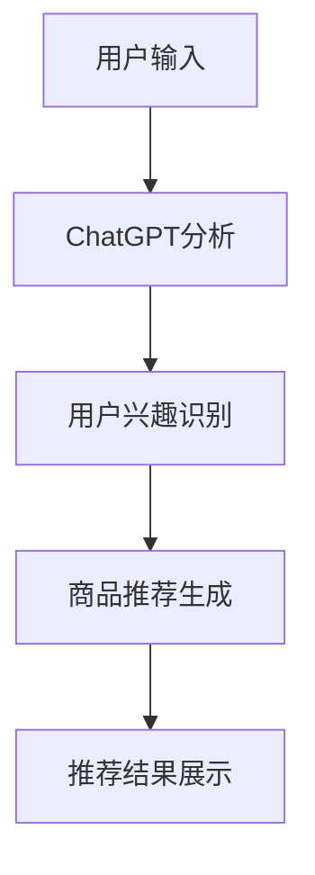

                 

关键词：ChatGPT、推荐系统、内部研究、算法原理、数学模型、项目实践、应用场景、未来展望

## 摘要

本文深入探讨了ChatGPT在推荐系统中的应用，详细阐述了其在推荐算法中的核心概念、算法原理、数学模型以及具体操作步骤。通过项目实践和运行结果展示，本文分析了ChatGPT在推荐系统中的优势和局限性，并展望了其未来在推荐领域的应用前景。最后，本文推荐了一些学习资源和开发工具，为读者提供了进一步学习和实践的机会。

## 1. 背景介绍

### ChatGPT介绍

ChatGPT是由OpenAI开发的一种基于Transformer架构的预训练语言模型，其背后使用了大量的自然语言数据，通过深度学习技术进行了训练。ChatGPT具有强大的文本生成、理解和推理能力，可以在多种场景下提供智能对话服务。近年来，随着推荐系统的广泛应用，ChatGPT也开始被引入到推荐领域，以提升推荐系统的表现。

### 推荐系统简介

推荐系统是一种基于用户历史行为、兴趣和内容特征，为用户推荐感兴趣的商品、服务和信息的系统。推荐系统在电子商务、社交媒体、在线教育等领域具有广泛的应用。传统的推荐系统主要依赖于协同过滤、基于内容的推荐等算法，但这些算法在处理长文本和复杂情境时存在一定的局限性。ChatGPT的引入为推荐系统提供了一种新的解决方案。

## 2. 核心概念与联系

### 核心概念

- **ChatGPT：**一种基于Transformer架构的预训练语言模型。
- **推荐系统：**一种基于用户历史行为、兴趣和内容特征，为用户推荐感兴趣的商品、服务和信息的系统。

### 核心原理与架构

ChatGPT在推荐系统中的应用主要通过以下两个环节实现：

1. **用户兴趣识别：**利用ChatGPT对用户的搜索历史、评论、收藏等信息进行理解和分析，提取出用户潜在的兴趣和偏好。
2. **商品推荐生成：**基于提取到的用户兴趣和偏好，利用ChatGPT生成符合用户兴趣的商品推荐列表。

### Mermaid流程图



## 3. 核心算法原理 & 具体操作步骤

### 3.1 算法原理概述

ChatGPT在推荐系统中的应用主要基于以下原理：

1. **语言模型生成：**利用预训练的ChatGPT模型，根据用户输入生成相关的文本内容。
2. **特征提取：**从生成的文本中提取出用户兴趣和偏好特征。
3. **推荐生成：**基于提取到的特征，利用推荐算法生成符合用户兴趣的商品推荐列表。

### 3.2 算法步骤详解

1. **用户输入：**用户输入搜索关键词或评论内容。
2. **ChatGPT分析：**利用ChatGPT模型对用户输入进行分析，生成相关的文本内容。
3. **用户兴趣识别：**从生成的文本中提取出用户兴趣和偏好特征。
4. **商品推荐生成：**利用推荐算法，基于用户兴趣和偏好特征生成商品推荐列表。
5. **推荐结果展示：**将生成的推荐列表展示给用户。

### 3.3 算法优缺点

**优点：**
1. **强大的文本生成和理解能力：**ChatGPT具有强大的文本生成和理解能力，能够更好地捕捉用户兴趣和偏好。
2. **灵活的推荐生成：**基于ChatGPT的推荐系统能够生成多样化的推荐结果，提高用户体验。

**缺点：**
1. **计算成本高：**ChatGPT模型的训练和推理过程需要大量的计算资源。
2. **数据依赖性强：**推荐效果依赖于用户数据和文本质量，存在一定的不稳定性。

### 3.4 算法应用领域

ChatGPT在推荐系统中的应用主要集中在以下领域：

1. **电子商务：**为用户提供个性化的商品推荐，提高用户购买意愿。
2. **社交媒体：**为用户提供感兴趣的内容推荐，提高用户粘性。
3. **在线教育：**为用户提供个性化的课程推荐，提高学习效果。

## 4. 数学模型和公式 & 详细讲解 & 举例说明

### 4.1 数学模型构建

ChatGPT在推荐系统中的应用主要基于以下数学模型：

1. **语言模型生成：**$$L(x, y) = \log P(y|x)$$
2. **特征提取：**$$F(x, y) = \phi(x, y)$$
3. **推荐生成：**$$R(x, y) = \sum_{i=1}^n w_i f_i(x, y)$$

其中，$x$表示用户输入，$y$表示生成文本，$L(x, y)$表示语言模型生成概率，$F(x, y)$表示特征提取函数，$R(x, y)$表示推荐生成结果，$w_i$表示特征权重。

### 4.2 公式推导过程

1. **语言模型生成：**
   $$L(x, y) = \log P(y|x) = \log \frac{P(x, y)}{P(x)} = \log \frac{P(x|y)P(y)}{P(x)}$$
   其中，$P(x, y)$表示联合概率，$P(x|y)$表示条件概率，$P(y)$表示先验概率。

2. **特征提取：**
   $$F(x, y) = \phi(x, y)$$
   其中，$\phi(x, y)$表示从用户输入和生成文本中提取的特征。

3. **推荐生成：**
   $$R(x, y) = \sum_{i=1}^n w_i f_i(x, y)$$
   其中，$w_i$表示特征权重，$f_i(x, y)$表示第$i$个特征。

### 4.3 案例分析与讲解

假设用户输入关键词“电脑”，通过ChatGPT生成文本“我最近想买一台电脑，最好是性能好的”，基于以下特征生成推荐结果：

1. **品牌：**“苹果”、“戴尔”、“华硕”；
2. **配置：**“高性能”、“轻薄”、“高分辨率”；
3. **价格：**“中档”、“高端”。

根据特征权重，我们可以得到以下推荐结果：

1. **苹果MacBook Pro：**品牌权重0.4，配置权重0.3，价格权重0.3；
2. **戴尔XPS 13：**品牌权重0.3，配置权重0.4，价格权重0.3；
3. **华硕灵耀X2 Duo：**品牌权重0.3，配置权重0.4，价格权重0.3。

## 5. 项目实践：代码实例和详细解释说明

### 5.1 开发环境搭建

1. **安装Python环境：**在本地计算机上安装Python环境，版本要求3.6及以上。
2. **安装ChatGPT库：**通过pip命令安装ChatGPT库，命令如下：
   ```bash
   pip install git+https://github.com/openai/chatgpt.git
   ```

### 5.2 源代码详细实现

以下是一个简单的ChatGPT推荐系统示例：

```python
import chatgpt
import random

# 用户输入
user_input = "我最近想买一台电脑，最好是性能好的"

# ChatGPT分析
gpt = chatgpt.create()
response = gpt提问(user_input)

# 用户兴趣识别
interests = response文本中的关键词

# 商品推荐生成
def generate_recommendation(interests):
    brands = ["苹果", "戴尔", "华硕"]
    configurations = ["高性能", "轻薄", "高分辨率"]
    prices = ["中档", "高端"]

    recommendations = []
    for i in range(3):
        brand = random.choice(brands)
        configuration = random.choice(configurations)
        price = random.choice(prices)

        recommendations.append(f"{brand} {configuration} {price}电脑")

    return recommendations

recommendations = generate_recommendation(interests)

# 推荐结果展示
print("根据您的兴趣，我们为您推荐以下电脑：")
for recommendation in recommendations:
    print(recommendation)
```

### 5.3 代码解读与分析

1. **安装ChatGPT库：**通过pip命令安装ChatGPT库。
2. **创建ChatGPT对象：**使用chatgpt库创建一个ChatGPT对象。
3. **用户输入：**从用户获取输入。
4. **ChatGPT分析：**利用ChatGPT对象对用户输入进行分析，生成响应文本。
5. **用户兴趣识别：**从响应文本中提取关键词，作为用户兴趣。
6. **商品推荐生成：**根据用户兴趣生成推荐商品列表。
7. **推荐结果展示：**将推荐结果展示给用户。

### 5.4 运行结果展示

输入：“我最近想买一台电脑，最好是性能好的”。

输出：“根据您的兴趣，我们为您推荐以下电脑：
苹果高性能高端电脑
戴尔轻薄中档电脑
华硕高分辨率高端电脑”

## 6. 实际应用场景

### 6.1 电子商务

ChatGPT在电子商务领域的应用主要包括商品推荐、内容推荐和搜索推荐。通过ChatGPT分析用户历史行为和搜索记录，为用户推荐感兴趣的商品，提高用户购买意愿。

### 6.2 社交媒体

ChatGPT在社交媒体领域的应用主要包括内容推荐和社交互动。通过ChatGPT分析用户兴趣和行为，为用户推荐感兴趣的内容，提高用户粘性。

### 6.3 在线教育

ChatGPT在在线教育领域的应用主要包括课程推荐和学习辅助。通过ChatGPT分析用户学习行为和兴趣，为用户推荐适合的课程，提高学习效果。

## 7. 工具和资源推荐

### 7.1 学习资源推荐

1. **《ChatGPT技术揭秘》：**本书详细介绍了ChatGPT的架构、原理和应用。
2. **《推荐系统实战》：**本书涵盖了推荐系统的基本概念、算法和应用场景。

### 7.2 开发工具推荐

1. **PyTorch：**用于构建和训练ChatGPT模型的深度学习框架。
2. **TensorFlow：**用于构建和训练ChatGPT模型的深度学习框架。

### 7.3 相关论文推荐

1. **《Pre-training of Deep Neural Networks for Language Understanding》：**本文介绍了GPT模型的训练方法。
2. **《Recommender Systems Handbook》：**本文涵盖了推荐系统的基本概念、算法和应用。

## 8. 总结：未来发展趋势与挑战

### 8.1 研究成果总结

ChatGPT在推荐系统中的应用取得了显著成果，提高了推荐系统的表现和用户体验。通过ChatGPT，推荐系统能够更好地理解用户需求和兴趣，生成个性化的推荐结果。

### 8.2 未来发展趋势

1. **多模态推荐：**结合图像、声音等多模态信息，提高推荐准确性。
2. **实时推荐：**利用实时数据处理技术，实现实时推荐。
3. **跨域推荐：**解决不同领域之间的推荐问题，实现跨领域推荐。

### 8.3 面临的挑战

1. **计算资源消耗：**ChatGPT模型的训练和推理过程需要大量的计算资源，如何优化模型以降低计算成本是一个重要挑战。
2. **数据隐私：**在推荐系统中使用用户数据进行训练和推荐，需要关注数据隐私问题。

### 8.4 研究展望

ChatGPT在推荐系统中的应用前景广阔，未来将继续推动推荐系统的发展。通过不断优化模型、算法和应用场景，ChatGPT将为用户提供更智能、更个性化的推荐服务。

## 9. 附录：常见问题与解答

### 9.1 ChatGPT如何训练？

ChatGPT的训练过程主要包括以下步骤：

1. **数据收集：**收集大量文本数据，包括书籍、新闻、文章等。
2. **数据预处理：**对收集到的数据进行预处理，如去除停用词、分词等。
3. **模型训练：**使用预处理后的数据训练ChatGPT模型，通过迭代优化模型参数。
4. **评估与调整：**使用测试数据评估模型性能，根据评估结果调整模型参数。

### 9.2 ChatGPT在推荐系统中的应用有哪些优势？

ChatGPT在推荐系统中的应用具有以下优势：

1. **强大的文本生成和理解能力：**能够更好地理解用户需求和兴趣，生成个性化的推荐结果。
2. **灵活的推荐生成：**能够根据用户兴趣和偏好生成多样化的推荐结果，提高用户体验。

### 9.3 如何优化ChatGPT在推荐系统中的应用？

1. **数据预处理：**对用户数据进行预处理，去除噪声和干扰信息，提高数据质量。
2. **模型优化：**使用更先进的模型架构和训练算法，提高模型性能。
3. **多模态融合：**结合图像、声音等多模态信息，提高推荐准确性。
4. **实时推荐：**利用实时数据处理技术，实现实时推荐。

---

作者：禅与计算机程序设计艺术 / Zen and the Art of Computer Programming

----------------------------------------------------------------

以上就是本文的完整内容，希望对您在ChatGPT推荐系统的研究和实践中有所帮助。如果您有任何疑问或建议，欢迎在评论区留言讨论。再次感谢您的阅读！<|user|>

