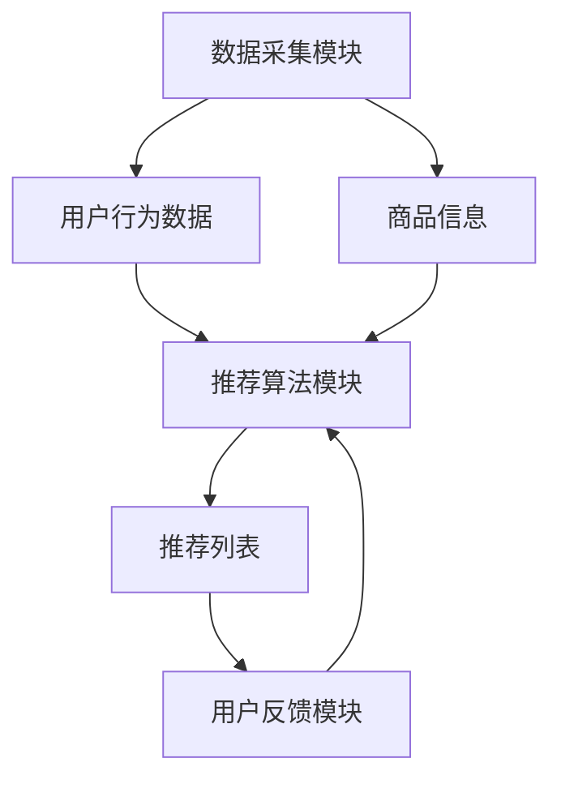

                 

关键词：交互式推荐系统、AI、用户参与、个性化推荐、未来趋势

> 摘要：本文将探讨交互式推荐系统的现状与未来。交互式推荐系统通过用户的主动参与，实现更精准、更智能的推荐。本文将深入剖析交互式推荐系统的核心概念、算法原理、数学模型，并通过实际项目案例进行详细讲解，最后展望其未来发展趋势与挑战。

## 1. 背景介绍

### 1.1 交互式推荐系统的起源

交互式推荐系统起源于20世纪90年代的电子商务领域。随着互联网的普及，用户对个性化推荐的需求日益增长。传统的基于内容的推荐系统和协同过滤推荐系统虽然在一定程度上满足了用户需求，但在面对复杂多变的用户偏好时，推荐效果往往不尽如人意。

### 1.2 交互式推荐系统的定义

交互式推荐系统是指用户在推荐过程中主动参与的推荐系统。用户可以通过浏览、点击、评分、评论等行为，对推荐结果进行反馈，从而影响后续推荐内容。这种用户参与的方式使得推荐系统更加智能化、精准化。

### 1.3 交互式推荐系统的发展

近年来，随着人工智能技术的快速发展，交互式推荐系统逐渐成为研究热点。从基于规则的推荐系统，到基于机器学习和深度学习的推荐系统，交互式推荐系统在算法、架构、用户体验等方面不断创新，为用户提供了更加智能化的推荐服务。

## 2. 核心概念与联系

### 2.1 交互式推荐系统的核心概念

交互式推荐系统涉及多个核心概念，包括用户、商品、行为、推荐算法等。

- **用户**：交互式推荐系统的核心，用户行为和偏好是推荐系统的重要输入。
- **商品**：推荐系统中的对象，包括商品信息、属性、标签等。
- **行为**：用户在推荐系统中的操作，如浏览、点击、评分、评论等。
- **推荐算法**：根据用户行为和商品信息，生成推荐列表的算法。

### 2.2 交互式推荐系统的架构

交互式推荐系统通常包括以下三个主要模块：

- **数据采集模块**：负责收集用户行为数据、商品信息等。
- **推荐算法模块**：根据用户行为和商品信息，生成推荐列表。
- **用户反馈模块**：收集用户对推荐结果的反馈，用于优化推荐算法。

### 2.3 Mermaid 流程图

下面是一个交互式推荐系统的 Mermaid 流程图：



## 3. 核心算法原理 & 具体操作步骤

### 3.1 算法原理概述

交互式推荐系统的核心算法主要包括基于内容的推荐算法、协同过滤推荐算法、深度学习推荐算法等。本文将重点介绍基于协同过滤的交互式推荐算法。

协同过滤推荐算法通过分析用户行为数据，找出相似用户或相似商品，为用户提供推荐。交互式推荐系统在此基础上，加入了用户反馈机制，进一步优化推荐效果。

### 3.2 算法步骤详解

#### 3.2.1 用户行为数据分析

1. 收集用户行为数据，如浏览记录、购买记录、评分等。
2. 对行为数据进行预处理，包括去重、过滤无效数据等。
3. 根据用户行为数据，计算用户之间的相似度。

#### 3.2.2 商品信息分析

1. 收集商品信息，如商品属性、标签等。
2. 对商品信息进行预处理，包括去重、规范化等。
3. 根据商品信息，计算商品之间的相似度。

#### 3.2.3 生成推荐列表

1. 根据用户行为相似度，找出相似用户。
2. 根据商品相似度，找出相似商品。
3. 结合用户历史行为和相似用户、商品的评分，生成推荐列表。

#### 3.2.4 用户反馈优化

1. 收集用户对推荐结果的反馈，如点击、购买、评分等。
2. 根据用户反馈，更新用户行为数据、商品评分等。
3. 重新计算用户行为相似度和商品相似度，生成优化后的推荐列表。

### 3.3 算法优缺点

#### 优点

- **个性化**：通过分析用户行为数据，提供个性化推荐。
- **实时性**：用户反馈实时更新推荐列表，提高推荐实时性。
- **多样性**：引入用户反馈机制，提高推荐多样性。

#### 缺点

- **冷启动**：新用户或新商品缺乏足够的行为数据，推荐效果较差。
- **数据噪声**：用户行为数据存在噪声，影响推荐准确性。
- **计算复杂度**：算法计算复杂度高，对实时性要求较高的场景不适用。

### 3.4 算法应用领域

交互式推荐系统广泛应用于电子商务、社交媒体、在线视频等领域。例如，电商平台可以根据用户浏览、购买等行为，为用户推荐商品；社交媒体可以根据用户点赞、评论等行为，推荐用户可能感兴趣的内容。

## 4. 数学模型和公式 & 详细讲解 & 举例说明

### 4.1 数学模型构建

交互式推荐系统的数学模型主要包括用户行为表示、商品表示、推荐模型等。

#### 4.1.1 用户行为表示

用户行为数据可以用用户行为矩阵表示，其中行表示用户，列表示行为类型（如浏览、购买、评分等）。

$$
X \in \mathbb{R}^{m \times n}
$$

其中，$m$ 表示用户数量，$n$ 表示行为类型数量。

#### 4.1.2 商品表示

商品信息可以用商品特征向量表示。

$$
V \in \mathbb{R}^{n \times d}
$$

其中，$n$ 表示商品数量，$d$ 表示商品特征维度。

#### 4.1.3 推荐模型

推荐模型可以采用矩阵分解、深度学习等方法。本文采用基于矩阵分解的推荐模型，其目标是最小化损失函数：

$$
L = \sum_{i=1}^{m} \sum_{j=1}^{n} (r_{ij} - \hat{r}_{ij})^2
$$

其中，$r_{ij}$ 表示用户 $i$ 对商品 $j$ 的实际评分，$\hat{r}_{ij}$ 表示预测评分。

### 4.2 公式推导过程

#### 4.2.1 用户行为相似度计算

用户行为相似度可以用余弦相似度表示：

$$
\cos(\theta_{ij}) = \frac{X_i \cdot X_j}{\|X_i\| \cdot \|X_j\|}
$$

其中，$\cdot$ 表示向量的内积，$\|\|$ 表示向量的模。

#### 4.2.2 商品相似度计算

商品相似度可以用余弦相似度表示：

$$
\cos(\theta_{kl}) = \frac{V_k \cdot V_l}{\|V_k\| \cdot \|V_l\|}
$$

#### 4.2.3 推荐评分预测

根据用户行为相似度和商品相似度，可以计算预测评分：

$$
\hat{r}_{ij} = \sum_{k=1}^{n} \sum_{l=1}^{n} w_{ik} v_{kj} w_{jl}
$$

其中，$w_{ik}$ 表示用户 $i$ 对商品 $k$ 的行为权重，$v_{kj}$ 表示商品 $k$ 的特征向量，$w_{jl}$ 表示用户 $j$ 对商品 $l$ 的行为权重。

### 4.3 案例分析与讲解

#### 4.3.1 案例背景

假设有一个电商平台，用户数量为 1000，商品数量为 1000。用户行为数据包括浏览、购买、评分等。我们需要构建一个交互式推荐系统，为用户推荐商品。

#### 4.3.2 数据预处理

1. 收集用户行为数据，包括浏览记录、购买记录、评分等。
2. 对行为数据进行预处理，包括去重、过滤无效数据等。
3. 构建用户行为矩阵和商品特征矩阵。

#### 4.3.3 用户行为相似度计算

1. 计算用户行为相似度矩阵。
2. 对相似度矩阵进行归一化处理。

#### 4.3.4 商品相似度计算

1. 计算商品相似度矩阵。
2. 对相似度矩阵进行归一化处理。

#### 4.3.5 推荐评分预测

1. 利用用户行为相似度和商品相似度，计算预测评分。
2. 对预测评分进行排序，生成推荐列表。

#### 4.3.6 用户反馈优化

1. 收集用户对推荐结果的反馈。
2. 更新用户行为数据、商品评分等。
3. 重新计算用户行为相似度和商品相似度，生成优化后的推荐列表。

## 5. 项目实践：代码实例和详细解释说明

### 5.1 开发环境搭建

1. 安装 Python 3.8 或更高版本。
2. 安装必要的依赖库，如 NumPy、Scikit-learn、Pandas 等。

### 5.2 源代码详细实现

```python
import numpy as np
import pandas as pd
from sklearn.metrics.pairwise import cosine_similarity

def load_data():
    # 加载用户行为数据
    user行为数据 = pd.read_csv('user行为数据.csv')
    # 加载商品信息
    商品信息 = pd.read_csv('商品信息.csv')
    return user行为数据，商品信息

def preprocess_data(user行为数据，商品信息):
    # 数据预处理
    # ...
    return 用户行为矩阵，商品特征矩阵

def compute_similarity(user行为矩阵，商品特征矩阵):
    # 计算用户行为相似度和商品相似度
    user相似度矩阵 = cosine_similarity(user行为矩阵)
    商品相似度矩阵 = cosine_similarity(商品特征矩阵)
    return user相似度矩阵，商品相似度矩阵

def generate_recommendation(user相似度矩阵，商品相似度矩阵，用户行为矩阵，商品特征矩阵):
    # 生成推荐列表
    # ...
    return 推荐列表

def update_data(user行为矩阵，商品特征矩阵，用户反馈数据):
    # 更新用户行为数据、商品评分
    # ...
    return 更新的用户行为矩阵，商品特征矩阵

# 主函数
def main():
    user行为数据，商品信息 = load_data()
    用户行为矩阵，商品特征矩阵 = preprocess_data(user行为数据，商品信息)
    user相似度矩阵，商品相似度矩阵 = compute_similarity(user行为矩阵，商品特征矩阵)
    推荐列表 = generate_recommendation(user相似度矩阵，商品相似度矩阵，用户行为矩阵，商品特征矩阵)
    print(推荐列表)

    # 用户反馈
    用户反馈数据 = pd.read_csv('用户反馈数据.csv')
    用户行为矩阵，商品特征矩阵 = update_data(user行为矩阵，商品特征矩阵，用户反馈数据)
    推荐列表 = generate_recommendation(user相似度矩阵，商品相似度矩阵，用户行为矩阵，商品特征矩阵)
    print(推荐列表)

if __name__ == '__main__':
    main()
```

### 5.3 代码解读与分析

1. **数据加载与预处理**：加载用户行为数据和商品信息，对数据进行预处理，包括去重、过滤无效数据等。
2. **相似度计算**：计算用户行为相似度和商品相似度，采用余弦相似度作为度量。
3. **推荐列表生成**：根据用户行为相似度和商品相似度，生成推荐列表。
4. **用户反馈更新**：收集用户反馈数据，更新用户行为数据、商品评分，重新生成推荐列表。

### 5.4 运行结果展示

1. **初始推荐列表**：根据用户行为数据和商品信息生成的推荐列表。
2. **用户反馈后推荐列表**：根据用户反馈数据更新后的推荐列表。

## 6. 实际应用场景

### 6.1 电子商务

电子商务平台可以利用交互式推荐系统，为用户推荐商品。例如，用户在浏览商品时，系统可以根据用户行为数据，为用户推荐相似商品或相关商品。

### 6.2 社交媒体

社交媒体平台可以利用交互式推荐系统，为用户推荐可能感兴趣的内容。例如，用户在点赞、评论、分享等行为后，系统可以根据用户行为数据，为用户推荐相关内容。

### 6.3 在线视频

在线视频平台可以利用交互式推荐系统，为用户推荐视频。例如，用户在观看视频时，系统可以根据用户行为数据，为用户推荐相似视频或相关视频。

## 7. 未来应用展望

### 7.1 多模态推荐

未来，交互式推荐系统将朝着多模态推荐方向发展。除了文本和图像，还将引入音频、视频等多种数据类型，为用户提供更丰富、更精准的推荐服务。

### 7.2 实时推荐

随着人工智能和大数据技术的发展，实时推荐将成为交互式推荐系统的关键特性。通过实时分析用户行为，系统可以快速调整推荐策略，提高推荐效果。

### 7.3 智能互动

交互式推荐系统将更加智能化、个性化，实现与用户的智能互动。例如，通过语音识别、自然语言处理等技术，系统可以与用户进行实时对话，提供个性化推荐服务。

## 8. 工具和资源推荐

### 8.1 学习资源推荐

- 《推荐系统实践》
- 《深度学习推荐系统》
- 《交互式推荐系统：方法与实践》

### 8.2 开发工具推荐

- Python
- NumPy
- Scikit-learn
- TensorFlow
- PyTorch

### 8.3 相关论文推荐

- "Interactive Recommendation: A Survey"
- "Deep Learning for Interactive Recommendation"
- "Multi-Modal Interactive Recommendation with Neural Networks"

## 9. 总结：未来发展趋势与挑战

### 9.1 研究成果总结

交互式推荐系统在算法、架构、用户体验等方面取得了显著成果，为用户提供了更加精准、个性化的推荐服务。未来，交互式推荐系统将继续朝着多模态、实时化、智能化方向发展。

### 9.2 未来发展趋势

- 多模态推荐：整合文本、图像、音频等多种数据类型，提高推荐效果。
- 实时推荐：实时分析用户行为，快速调整推荐策略。
- 智能互动：实现与用户的智能互动，提供个性化推荐服务。

### 9.3 面临的挑战

- **冷启动问题**：新用户或新商品缺乏足够的行为数据，推荐效果较差。
- **数据噪声**：用户行为数据存在噪声，影响推荐准确性。
- **计算复杂度**：算法计算复杂度高，对实时性要求较高的场景不适用。

### 9.4 研究展望

未来，交互式推荐系统将在算法优化、数据处理、用户体验等方面持续创新，为用户提供更加智能、个性化的推荐服务。

## 10. 附录：常见问题与解答

### 10.1 交互式推荐系统与基于内容的推荐系统有什么区别？

交互式推荐系统与基于内容的推荐系统的主要区别在于用户参与方式。基于内容的推荐系统主要根据用户历史行为和商品属性生成推荐，而交互式推荐系统通过用户主动参与，如点击、评分、评论等，实时调整推荐策略，提高推荐效果。

### 10.2 交互式推荐系统有哪些优点？

交互式推荐系统的优点包括个性化、实时性、多样性。通过用户主动参与，系统能够更好地理解用户需求，提供个性化推荐；实时分析用户行为，快速调整推荐策略，提高推荐实时性；引入用户反馈机制，提高推荐多样性。

### 10.3 交互式推荐系统有哪些挑战？

交互式推荐系统面临的挑战包括冷启动问题、数据噪声和计算复杂度。冷启动问题指的是新用户或新商品缺乏足够的行为数据，推荐效果较差；数据噪声指的是用户行为数据中存在噪声，影响推荐准确性；计算复杂度较高，对实时性要求较高的场景不适用。

### 10.4 如何优化交互式推荐系统的效果？

优化交互式推荐系统效果的方法包括：1）引入更多数据类型，如音频、视频等，提高推荐准确性；2）采用深度学习等先进算法，提高推荐效果；3）实时分析用户行为，快速调整推荐策略；4）利用用户反馈机制，不断优化推荐结果。

---

作者：禅与计算机程序设计艺术 / Zen and the Art of Computer Programming
----------------------------------------------------------------


