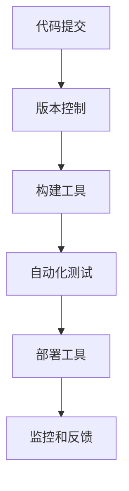

                 

关键词：DevOps、工具链、软件交付、效率、自动化、CI/CD

> 摘要：本文将深入探讨 DevOps 工具链在构建高效软件交付管道中的关键角色。通过分析各种工具的功能、实现原理和最佳实践，我们将为读者提供一个全面的技术指南，以实现软件开发的持续集成和持续部署。

## 1. 背景介绍

在现代软件开发领域，DevOps 已经成为一种不可或缺的实践方法。它强调软件开发（Development）和IT运维（Operations）之间的紧密协作和整合，以实现高效的软件交付流程。DevOps 的核心目标是通过自动化、持续交付和快速响应需求，缩短软件开发周期，提高产品质量，并增加团队协作效率。

### 1.1 DevOps 的起源与发展

DevOps 的概念最早由 Patrick DeBois 在2009年提出。他的初衷是将开发人员（Dev）和运维人员（Ops）的职责和工作流程整合起来，以应对快速变化的市场需求。DevOps 的理念很快得到了业界的广泛认可，并在云计算、容器化和微服务架构等技术的推动下不断演进。

### 1.2 DevOps 的关键原则

DevOps 的核心理念包括以下几个方面：

- **协作**：通过打破开发与运维之间的壁垒，促进团队之间的协作和沟通。
- **自动化**：通过自动化工具和流程，减少人为错误，提高效率。
- **持续交付**：通过持续集成和持续部署，实现软件的快速迭代和交付。
- **监测和反馈**：通过实时监测和反馈机制，确保系统的稳定性和可恢复性。

## 2. 核心概念与联系

### 2.1 DevOps 工具链

DevOps 工具链是一系列工具的集合，用于支持 DevOps 实践中的自动化、持续集成、持续交付和部署。这些工具通常分为以下几类：

- **版本控制**：如 Git
- **构建工具**：如 Maven、Gradle
- **自动化部署工具**：如 Jenkins、GitLab CI/CD
- **容器化技术**：如 Docker、Kubernetes
- **监控和日志管理**：如 Prometheus、ELK Stack
- **配置管理**：如 Ansible、Chef、Puppet

### 2.2 工具之间的联系

这些工具之间通过紧密集成，形成一个完整的 DevOps 工具链。以下是 DevOps 工具链的基本工作流程：

1. **代码提交**：开发人员将代码提交到版本控制系统。
2. **构建**：构建工具将代码构建成可运行的软件包。
3. **测试**：自动化测试工具执行一系列测试，确保软件质量。
4. **部署**：部署工具将软件部署到测试或生产环境。
5. **监控和反馈**：监控工具实时监控系统性能，并在出现问题时触发反馈机制。

### 2.3 Mermaid 流程图

以下是一个简化的 DevOps 工具链的 Mermaid 流程图，展示了各工具之间的交互关系：



## 3. 核心算法原理 & 具体操作步骤

### 3.1 算法原理概述

DevOps 工具链中的核心算法主要包括构建、测试、部署和监控。以下是对这些算法的概述：

- **构建算法**：将源代码转换为可运行的软件包。常见的构建算法包括编译、打包和安装。
- **测试算法**：确保软件质量。测试算法包括单元测试、集成测试、性能测试等。
- **部署算法**：将软件部署到目标环境。部署算法通常涉及配置管理、容器化和自动化部署。
- **监控算法**：实时监控系统性能和稳定性。监控算法包括数据采集、分析和告警。

### 3.2 算法步骤详解

以下是 DevOps 工具链中各算法的具体步骤：

#### 3.2.1 构建算法步骤

1. **获取源代码**：从版本控制系统中获取最新的源代码。
2. **编译**：将源代码编译成目标代码。
3. **打包**：将编译后的目标代码打包成软件包。
4. **安装**：将软件包安装到本地环境或服务器。

#### 3.2.2 测试算法步骤

1. **单元测试**：针对单个模块或函数进行测试。
2. **集成测试**：测试模块之间的交互和集成。
3. **性能测试**：评估软件的性能和响应时间。
4. **回归测试**：确保新的代码改动不会破坏现有的功能。

#### 3.2.3 部署算法步骤

1. **配置管理**：管理软件配置和环境变量。
2. **容器化**：将软件打包成容器镜像。
3. **自动化部署**：通过脚本或工具自动部署软件。
4. **监控**：部署后监控软件性能和稳定性。

#### 3.2.4 监控算法步骤

1. **数据采集**：从系统日志、监控工具和第三方服务中收集数据。
2. **数据分析**：分析收集到的数据，识别潜在问题和趋势。
3. **告警**：在检测到问题时发送告警通知。
4. **故障恢复**：在出现故障时自动执行恢复操作。

### 3.3 算法优缺点

#### 3.3.1 构建算法

- **优点**：提高开发效率，确保软件质量。
- **缺点**：可能增加构建时间和资源消耗。

#### 3.3.2 测试算法

- **优点**：确保软件质量，降低故障风险。
- **缺点**：测试过程可能影响开发进度。

#### 3.3.3 部署算法

- **优点**：提高部署效率，降低人为错误。
- **缺点**：可能需要额外的配置和管理。

#### 3.3.4 监控算法

- **优点**：实时监控系统性能，快速响应故障。
- **缺点**：可能增加系统负载。

### 3.4 算法应用领域

DevOps 工具链广泛应用于各种场景，包括互联网公司、金融行业、医疗领域等。以下是几个典型的应用领域：

- **互联网公司**：通过 DevOps 实践，实现快速迭代和持续交付。
- **金融行业**：确保金融系统的稳定性和安全性。
- **医疗领域**：提高医疗数据的处理效率和准确性。

## 4. 数学模型和公式 & 详细讲解 & 举例说明

### 4.1 数学模型构建

在 DevOps 工具链中，我们可以使用一些数学模型来评估和优化软件交付流程。以下是一个简单的数学模型，用于计算软件交付周期：

$$
T = T_{build} + T_{test} + T_{deploy} + T_{monitor}
$$

其中，$T$ 表示软件交付周期，$T_{build}$、$T_{test}$、$T_{deploy}$ 和 $T_{monitor}$ 分别表示构建、测试、部署和监控的时间。

### 4.2 公式推导过程

这个公式的推导过程如下：

1. **构建时间**：从源代码到可运行的软件包所需的时间。
2. **测试时间**：执行测试用例和评估测试结果所需的时间。
3. **部署时间**：将软件部署到目标环境所需的时间。
4. **监控时间**：监控系统性能和触发告警所需的时间。

### 4.3 案例分析与讲解

假设一个项目的构建时间为 10 分钟，测试时间为 20 分钟，部署时间为 15 分钟，监控时间为 5 分钟。根据上述公式，软件交付周期为：

$$
T = 10 + 20 + 15 + 5 = 50 \text{ 分钟}
$$

通过分析这个案例，我们可以发现：

- **优化方向**：减少测试时间和部署时间。
- **优化方法**：增加测试并行度，使用容器化技术简化部署流程。

## 5. 项目实践：代码实例和详细解释说明

### 5.1 开发环境搭建

在本节中，我们将搭建一个简单的 DevOps 工具链环境，包括 Git、Maven、Jenkins、Docker 和 Kubernetes。

#### 5.1.1 安装 Git

在终端中执行以下命令安装 Git：

```bash
sudo apt-get install git
```

#### 5.1.2 安装 Maven

在终端中执行以下命令安装 Maven：

```bash
sudo apt-get install maven
```

#### 5.1.3 安装 Jenkins

在终端中执行以下命令安装 Jenkins：

```bash
sudo apt-get install jenkins
```

#### 5.1.4 安装 Docker

在终端中执行以下命令安装 Docker：

```bash
sudo apt-get install docker-ce docker-ce-cli containerd.io
```

#### 5.1.5 安装 Kubernetes

在终端中执行以下命令安装 Kubernetes：

```bash
sudo apt-get install kubectl
```

### 5.2 源代码详细实现

在本节中，我们将创建一个简单的 Java Web 应用程序，并使用 Maven 进行构建。以下是一个简单的 `pom.xml` 文件示例：

```xml
<project xmlns="http://maven.apache.org/POM/4.0.0"
    xmlns:xsi="http://www.w3.org/2001/XMLSchema-instance"
    xsi:schemaLocation="http://maven.apache.org/POM/4.0.0 http://maven.apache.org/xsd/maven-4.0.0.xsd">
    <modelVersion>4.0.0</modelVersion>
    <groupId>com.example</groupId>
    <artifactId>myapp</artifactId>
    <version>1.0-SNAPSHOT</version>
    <packaging>war</packaging>
    <dependencies>
        <dependency>
            <groupId>javax.servlet</groupId>
            <artifactId>servlet-api</artifactId>
            <version>2.5</version>
        </dependency>
    </dependencies>
    <build>
        <plugins>
            <plugin>
                <groupId>org.apache.maven.plugins</groupId>
                <artifactId>maven-war-plugin</artifactId>
                <version>2.3</version>
            </plugin>
        </plugins>
    </build>
</project>
```

### 5.3 代码解读与分析

这个 `pom.xml` 文件定义了一个简单的 Java Web 应用程序。以下是关键部分的解读：

- **<groupId>**：项目的组织 ID。
- **<artifactId>**：项目的模块 ID。
- **<version>**：项目的版本号。
- **<packaging>**：项目的打包类型（此处为 WAR 包）。
- **<dependencies>**：项目的依赖项（此处仅包含 Servlet API）。
- **<build>**：项目的构建插件（此处使用 Maven WAR 插件进行 WAR 包构建）。

### 5.4 运行结果展示

在本节中，我们将使用 Jenkins 持续集成和持续部署这个 Java Web 应用程序。

#### 5.4.1 配置 Jenkins Pipeline

在 Jenkins 中创建一个新的 Pipeline 项目，并配置以下内容：

```groovy
pipeline {
    agent any
    stages {
        stage('Build') {
            steps {
                sh 'mvn clean package'
            }
        }
        stage('Test') {
            steps {
                sh 'mvn test'
            }
        }
        stage('Deploy') {
            steps {
                sh 'docker build -t myapp .'
                sh 'docker run -d -p 8080:8080 myapp'
            }
        }
    }
}
```

#### 5.4.2 运行 Jenkins Pipeline

在 Jenkins 中运行这个 Pipeline，我们可以看到构建、测试和部署的过程。

```bash
$ ./path/to/jenkins/bin/jenkins.sh run Pipeline -f pipeline.yml
```

### 5.5 代码解读与分析

这个 Jenkins Pipeline 文件定义了一个包含构建、测试和部署三个阶段的流水线。以下是关键部分的解读：

- **agent any**：指定任意 agent 执行 Pipeline。
- **stages**：定义 Pipeline 的各个阶段。
  - **Build**：构建阶段，执行 Maven 构建命令。
  - **Test**：测试阶段，执行 Maven 测试命令。
  - **Deploy**：部署阶段，构建 Docker 镜像并运行容器。

## 6. 实际应用场景

### 6.1 互联网公司

在互联网公司，DevOps 工具链被广泛应用于快速迭代和持续交付。通过自动化测试、容器化和持续集成，互联网公司能够实现高频次的代码发布，提高产品的竞争力。

### 6.2 金融行业

在金融行业，DevOps 工具链用于确保金融系统的稳定性和安全性。通过自动化部署和实时监控，金融公司能够快速响应市场需求，并减少潜在的风险。

### 6.3 医疗领域

在医疗领域，DevOps 工具链用于提高医疗数据处理效率和准确性。通过自动化测试和持续集成，医疗机构能够更快地部署新的医疗系统，提高医疗服务质量。

## 7. 未来应用展望

### 7.1 人工智能与 DevOps 的融合

随着人工智能技术的不断发展，未来 DevOps 工具链可能会集成更多的 AI 能力，如自动缺陷修复、智能测试和优化部署策略。

### 7.2 新兴技术的推动

容器化、微服务架构和函数计算等新兴技术将继续推动 DevOps 的发展。这些技术将使软件交付更加灵活和高效。

### 7.3 面临的挑战

DevOps 在未来仍将面临一些挑战，如复杂的系统架构、安全性和合规性等。如何应对这些挑战将是 DevOps 发展的重要方向。

## 8. 总结

本文全面探讨了 DevOps 工具链在构建高效软件交付管道中的关键作用。通过分析各种工具的功能和实现原理，我们为读者提供了一个实用的技术指南。随着技术的不断发展，DevOps 将继续在软件行业发挥重要作用。

### 附录：常见问题与解答

**Q：DevOps 和敏捷开发有何区别？**

A：DevOps 强调开发（Dev）和运维（Ops）之间的协作，而敏捷开发则强调快速迭代和客户反馈。DevOps 是一种更广泛的实践方法，它将敏捷开发的理念应用于整个软件交付流程。

**Q：容器化对 DevOps 有何影响？**

A：容器化技术，如 Docker，使 DevOps 实践更加灵活和高效。容器化简化了环境的配置管理，提高了部署速度，并确保了一致的生产和开发环境。

**Q：如何开始使用 DevOps？**

A：开始使用 DevOps 可以从以下几个方面入手：
1. **了解核心原则和工具**：学习 DevOps 的核心原则和常用工具。
2. **评估现有流程**：评估现有的软件开发和运维流程，找出改进点。
3. **逐步引入工具**：逐步引入 DevOps 工具，如 Jenkins、Docker 等。
4. **持续优化**：持续优化流程和工具，以提高效率和可靠性。

### 作者署名

作者：禅与计算机程序设计艺术 / Zen and the Art of Computer Programming

----------------------------------------------------------------

### 后续工作

由于篇幅限制，本文无法完整展示所有内容。以下是后续工作的建议：

1. **深入分析 DevOps 工具链的各个方面**：进一步探讨 Git、Maven、Jenkins、Docker 和 Kubernetes 等工具的具体功能和实现原理。
2. **案例分析**：分享更多实际的 DevOps 项目案例，展示如何在不同行业中应用 DevOps 工具链。
3. **最佳实践分享**：总结 DevOps 实践中的最佳实践，为读者提供实用的建议和指导。
4. **未来趋势**：探讨新兴技术如人工智能、区块链等对 DevOps 的影响，预测未来 DevOps 的发展方向。|

