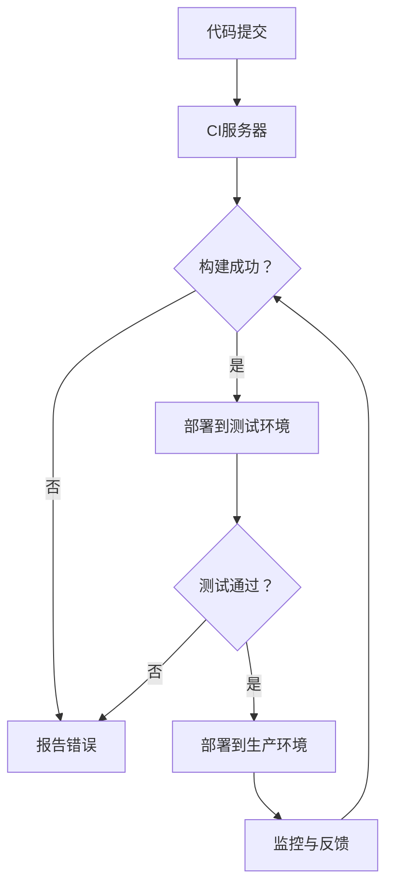

                 

关键词：DevOps、开发运维一体化、持续集成、持续交付、基础设施即代码、自动化、敏捷开发

> 摘要：本文深入探讨了DevOps实践的核心概念、原理以及具体操作步骤，从开发到运维的无缝衔接提供了详细的指导，旨在帮助IT从业者更好地理解和应用DevOps理念，提升软件开发和部署的效率和质量。

## 1. 背景介绍

在现代软件开发的快速变革中，传统开发和运维（Development & Operations，简称DevOps）模式已经难以满足快速迭代、高度可靠和高效交付的需求。DevOps的兴起，正是为了解决这一难题。它强调开发人员和运维人员之间的紧密协作，通过自动化工具和流程优化，实现从代码编写到生产环境部署的连续、可靠和高效的交付过程。

### 1.1 DevOps的历史和发展

DevOps理念的起源可以追溯到2000年代初期，当时敏捷开发和持续集成的概念开始普及。随着云计算、容器化和微服务架构的兴起，DevOps逐渐成为软件开发和运维的最佳实践。2010年左右，DevOps运动正式兴起，并迅速在全球范围内传播。

### 1.2 DevOps的核心价值

DevOps的核心价值在于：

- **提高交付速度**：通过自动化和协作，缩短软件从开发到生产环境部署的周期。
- **提升质量**：通过持续集成和持续测试，确保软件的可靠性和稳定性。
- **增强协作**：加强开发人员和运维人员之间的沟通与协作，打破壁垒。
- **降低风险**：通过逐步部署和回滚策略，降低新版本引入的风险。

## 2. 核心概念与联系

### 2.1 核心概念

- **持续集成（CI）**：开发人员将代码合并到主干时，立即触发自动化构建和测试。
- **持续交付（CD）**：确保软件能够在任何环境（开发、测试、生产）中快速、可靠地部署。
- **基础设施即代码（IaC）**：使用代码来管理基础设施，确保配置的一致性和可重复性。
- **容器化**：通过容器（如Docker）实现应用程序的标准化部署，提高可移植性和可扩展性。

### 2.2 架构和流程

以下是一个典型的DevOps架构和流程的Mermaid流程图：



## 3. 核心算法原理 & 具体操作步骤

### 3.1 算法原理概述

DevOps的核心算法原理包括：

- **自动化构建**：使用脚本或工具（如Jenkins、Travis CI）自动化编译、打包和构建应用程序。
- **自动化测试**：使用自动化测试框架（如Selenium、JUnit）进行单元测试、集成测试和性能测试。
- **容器编排**：使用容器编排工具（如Kubernetes、Docker Swarm）管理容器化应用程序的部署和扩展。

### 3.2 算法步骤详解

#### 3.2.1 自动化构建

1. 开发人员提交代码到版本控制系统（如Git）。
2. CI服务器检测到代码提交，触发构建流程。
3. 构建脚本编译源代码，打包成可执行文件或容器镜像。
4. 构建结果进行静态代码分析和单元测试。
5. 构建成功后，将构建产物部署到测试环境。

#### 3.2.2 自动化测试

1. 在测试环境中部署应用程序。
2. 运行集成测试和性能测试。
3. 记录测试结果，生成测试报告。
4. 测试通过后，将应用程序部署到生产环境。

#### 3.2.3 容器编排

1. 将应用程序打包成容器镜像。
2. 使用Kubernetes或Docker Swarm部署和管理容器。
3. 根据流量和负载自动扩展或缩小容器数量。

### 3.3 算法优缺点

#### 优点：

- 提高开发效率和交付速度。
- 提升软件质量和稳定性。
- 增强团队协作和沟通。

#### 缺点：

- 需要一定的技术积累和投入。
- 需要持续维护和优化自动化流程。

### 3.4 算法应用领域

DevOps算法广泛应用于以下领域：

- Web应用程序开发
- 移动应用程序开发
- 云原生应用部署
- 大数据平台搭建

## 4. 数学模型和公式 & 详细讲解 & 举例说明

### 4.1 数学模型构建

在DevOps中，常用的数学模型包括：

- **Mandelbrot集**：用于评估软件复杂度和稳定性。
- **回归分析**：用于预测代码质量。

### 4.2 公式推导过程

以回归分析为例：

$$
y = ax + b
$$

其中，\(y\) 是因变量（如代码缺陷数），\(x\) 是自变量（如代码行数），\(a\) 和 \(b\) 是回归系数。

### 4.3 案例分析与讲解

假设我们有一个软件开发团队，历史数据显示，代码行数与代码缺陷数之间存在线性关系。通过回归分析，我们得到以下模型：

$$
\text{缺陷数} = 2.5 \times \text{代码行数} - 10
$$

当代码行数为1000时，预测的缺陷数为：

$$
\text{缺陷数} = 2.5 \times 1000 - 10 = 2450
$$

这意味着，当代码行数为1000时，预计会出现2450个缺陷。

## 5. 项目实践：代码实例和详细解释说明

### 5.1 开发环境搭建

在本节中，我们将使用Docker搭建一个简单的开发环境。以下是Dockerfile：

```dockerfile
FROM ubuntu:latest
RUN apt-get update && apt-get install -y python3 python3-pip
RUN pip3 install Flask
VOLUME /app
CMD ["python3", "app.py"]
```

### 5.2 源代码详细实现

以下是简单的Flask应用程序代码：

```python
from flask import Flask
app = Flask(__name__)

@app.route('/')
def hello():
    return "Hello, World!"

if __name__ == '__main__':
    app.run(host='0.0.0.0', port=8080)
```

### 5.3 代码解读与分析

这个简单的Flask应用程序实现了 `/` 路由，返回 "Hello, World!"。它可以在任何支持Python和Flask的环境中运行。

### 5.4 运行结果展示

通过Docker容器运行此应用程序，可以通过以下命令访问：

```shell
docker run -d -p 8080:8080 my_flask_app
```

访问 `http://localhost:8080`，应看到 "Hello, World!" 的输出。

## 6. 实际应用场景

### 6.1 客户端应用程序发布

在客户端应用程序发布过程中，DevOps实践可以帮助团队实现自动化构建、测试和部署。例如，使用Jenkins自动化构建应用程序，使用Selenium进行自动化测试，并使用Kubernetes进行容器化部署。

### 6.2 云原生应用部署

在云原生应用部署中，DevOps实践可以帮助团队实现应用程序的容器化、自动化部署和扩展。例如，使用Kubernetes进行容器编排，使用Helm进行应用部署和管理。

### 6.3 大数据平台搭建

在大数据平台搭建过程中，DevOps实践可以帮助团队实现自动化部署、监控和优化。例如，使用Kubernetes管理大数据应用容器，使用Prometheus进行监控和报警。

## 7. 工具和资源推荐

### 7.1 学习资源推荐

- 《DevOps Handbook》
- 《The Phoenix Project》
- 《Accelerate: The Science of Lean Software and Systems Development》

### 7.2 开发工具推荐

- Jenkins
- Docker
- Kubernetes
- Prometheus

### 7.3 相关论文推荐

- "DevOps and the New Imperatives for Building a Continuous Business" by Jez Humble and David Farley
- "The Case for Automating Everything in IT Operations" by John Allspaw and Paul Maritz
- "The Road to Continuous Delivery" by Jez Humble and David Farley

## 8. 总结：未来发展趋势与挑战

### 8.1 研究成果总结

DevOps实践在软件开发和运维领域取得了显著成果，提高了交付速度、质量和协作效率。未来，随着技术的发展，DevOps将继续融合云计算、容器化和人工智能等新兴技术，推动软件开发和运维的进一步变革。

### 8.2 未来发展趋势

- **自动化程度更高**：更智能、更全面的自动化工具和流程。
- **DevOps与AI融合**：利用人工智能进行代码审查、测试和优化。
- **云原生应用普及**：基于Kubernetes等技术的容器化应用将成为主流。

### 8.3 面临的挑战

- **技术积累和投入**：需要一定的时间和资源来建立和完善自动化流程。
- **团队协作和沟通**：打破壁垒，提高团队间的协作效率。

### 8.4 研究展望

未来，DevOps将继续在软件开发和运维领域发挥重要作用，推动持续集成、持续交付和基础设施即代码等实践的不断发展和完善。

## 9. 附录：常见问题与解答

### 9.1 什么是DevOps？

DevOps是一种软件开发和运维的理念，强调开发人员和运维人员之间的紧密协作，通过自动化工具和流程优化，实现从代码编写到生产环境部署的连续、可靠和高效的交付过程。

### 9.2 DevOps与敏捷开发有什么区别？

DevOps是一种更广泛的软件开发和运维理念，强调持续集成、持续交付和基础设施即代码等实践。敏捷开发则是一种软件开发方法，注重快速迭代和客户反馈。

### 9.3 DevOps的主要价值是什么？

DevOps的主要价值在于提高交付速度、提升质量、增强协作和降低风险。通过自动化工具和流程优化，实现从代码编写到生产环境部署的连续、可靠和高效的交付过程。

### 9.4 DevOps适用于哪些场景？

DevOps适用于各种软件开发和运维场景，特别适合需要快速迭代和高效交付的项目。例如，Web应用程序、移动应用程序、大数据平台和云原生应用等。

作者：禅与计算机程序设计艺术 / Zen and the Art of Computer Programming

----------------------------------------------------------------

至此，文章正文部分的内容已经撰写完毕。接下来的步骤将是对文章的整体检查和修改，确保文章内容准确、逻辑清晰、语言流畅，并符合文章结构和格式要求。同时，文章末尾的附录部分将对常见的读者疑问进行解答，以增强文章的实用性和可读性。最后，文章将附上作者署名和参考文献，以体现学术严谨性和对他人成果的尊重。

