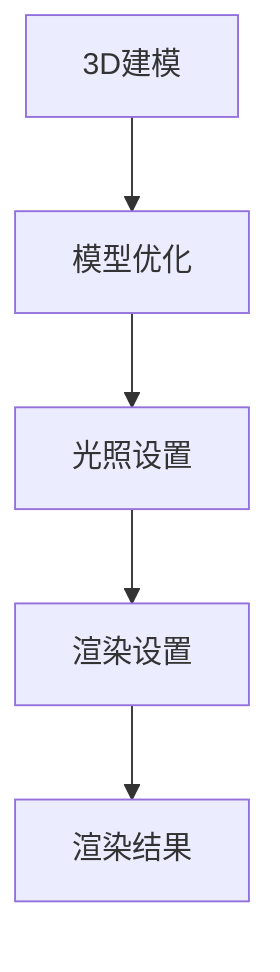

                 

关键词：3D建模，渲染，虚拟世界，建模工具，渲染引擎，真实感渲染，物理渲染，光线追踪，全局光照，模型构建，材质设置，纹理映射，动画制作，交互设计，游戏开发，虚拟现实，增强现实，三维可视化，虚拟环境，场景设计。

> 摘要：本文旨在探讨3D建模与渲染技术，详细解析其在虚拟世界构建中的应用，核心算法原理，数学模型，项目实践，以及未来发展趋势。通过本文，读者将全面了解3D建模与渲染的基础知识，掌握其技术要点，并展望虚拟现实与增强现实领域的发展前景。

## 1. 背景介绍

### 1.1 3D建模的发展历程

3D建模技术起源于计算机图形学的发展，从最早的几何建模到复杂的曲面建模，再到近年来的基于物理的建模，3D建模技术经历了长足的进步。早期3D建模主要依靠手工建模，随着计算机性能的提升和图形渲染技术的进步，自动化建模工具和算法逐渐成为主流。当前，3D建模技术已经广泛应用于游戏开发、电影制作、建筑设计、医学成像等多个领域。

### 1.2 渲染技术的演变

渲染技术是3D图形学中至关重要的环节，它决定了虚拟世界的视觉效果。早期的渲染技术主要是光栅化渲染，随着技术的进步，真实感渲染、全局光照、光线追踪等高级渲染技术逐渐被引入。这些技术的应用使得虚拟世界的视觉效果越来越接近现实，极大地提升了用户体验。

### 1.3 虚拟世界的定义与作用

虚拟世界是通过计算机技术构建的，具有高度模拟现实环境的数字空间。它不仅能够为用户提供沉浸式的体验，还在教育、娱乐、设计、医疗等多个领域发挥着重要作用。虚拟世界的构建依赖于3D建模与渲染技术，通过这些技术的综合运用，虚拟世界的真实感、互动性和表现力得到了显著提升。

## 2. 核心概念与联系

### 2.1 3D建模与渲染的关系

3D建模是虚拟世界构建的基础，它涉及到几何模型、拓扑结构、材质和纹理等元素的创建。渲染则是将这些模型通过计算机图形学技术转化为可视化的图像，实现真实感的效果。因此，3D建模与渲染是相辅相成的，缺一不可。

### 2.2 3D建模的关键概念

- 几何建模：通过几何体和几何操作构建3D模型的过程。
- 曲面建模：利用曲面元素（如NURBS、贝塞尔曲面等）进行建模的技术。
- 网格建模：使用顶点、边和面的组合来构建3D模型的方法。
- 模型拓扑：3D模型内部结构的布局，包括面数、边数和顶点数等。
- 材质与纹理：用于描述物体表面外观的属性，包括颜色、光泽、反射等。

### 2.3 渲染技术的核心概念

- 光栅化渲染：将3D模型转换为二维图像的过程。
- 真实感渲染：通过模拟真实世界的光照和材料特性，实现逼真的视觉效果。
- 全局光照：考虑光线在场景中的多次反射和散射，提高渲染效果的真实感。
- 光线追踪：通过模拟光线的传播路径，实现高度真实的渲染效果。
- 材质与纹理映射：将纹理图像映射到3D模型的表面，丰富物体的细节。

### 2.4 Mermaid 流程图

以下是一个简化的Mermaid流程图，展示了3D建模与渲染的基本流程：



### 2.5 3D建模与渲染的流程

1. **3D建模**：通过选择合适的建模工具（如Blender、Maya、3ds Max等）创建3D模型。
2. **模型优化**：对模型进行几何优化和拓扑优化，提高渲染效率和视觉效果。
3. **光照设置**：根据场景需求和视觉效果，设置合适的光照参数。
4. **渲染设置**：选择合适的渲染引擎和渲染参数，如分辨率、抗锯齿、阴影类型等。
5. **渲染结果**：生成最终渲染图像或视频。

## 3. 核心算法原理 & 具体操作步骤

### 3.1 算法原理概述

3D建模与渲染的核心算法主要包括几何建模算法、光照计算算法、渲染算法等。几何建模算法负责创建和修改3D模型的几何结构；光照计算算法用于计算场景中的光照效果；渲染算法则将3D模型转换为二维图像。

### 3.2 算法步骤详解

1. **几何建模算法**：
   - **参数化建模**：通过参数化控制几何体的形状，如NURBS曲面建模。
   - **网格建模**：通过顶点、边、面的组合构建3D模型。
   - **曲面建模**：使用曲面元素进行建模，如贝塞尔曲面、NURBS曲面等。

2. **光照计算算法**：
   - **直接光照**：计算光源直接照射到物体表面的光照效果。
   - **间接光照**：模拟光线在场景中的多次反射和散射，如全局光照、路径追踪等。
   - **光照模式**：包括点光源、聚光灯、区域光等，根据场景需求选择合适的光照模式。

3. **渲染算法**：
   - **光栅化渲染**：将3D模型转换为二维图像的过程。
   - **真实感渲染**：通过模拟真实世界的光照和材料特性，实现逼真的视觉效果。
   - **全局光照**：考虑光线在场景中的多次反射和散射，提高渲染效果的真实感。
   - **光线追踪**：通过模拟光线的传播路径，实现高度真实的渲染效果。

### 3.3 算法优缺点

- **几何建模算法**：
  - **优点**：灵活性强，适合复杂模型的创建。
  - **缺点**：计算复杂度高，建模效率相对较低。

- **光照计算算法**：
  - **优点**：能够实现高度真实的光照效果。
  - **缺点**：计算量大，对硬件性能要求较高。

- **渲染算法**：
  - **优点**：图像质量高，视觉效果逼真。
  - **缺点**：渲染速度相对较慢，不适合实时渲染。

### 3.4 算法应用领域

- **游戏开发**：通过3D建模与渲染技术，创建逼真的游戏场景和角色。
- **电影制作**：使用真实感渲染技术，制作高质量的电影特效。
- **建筑设计**：通过3D建模与渲染，展示建筑模型的外观和内部结构。
- **医学成像**：利用3D建模与渲染技术，进行医学图像的重建和可视化。

## 4. 数学模型和公式 & 详细讲解 & 举例说明

### 4.1 数学模型构建

在3D建模与渲染中，常用的数学模型包括几何模型、光照模型、纹理映射模型等。以下是这些模型的构建过程：

1. **几何模型**：
   - **参数化建模**：使用参数方程表示几何体，如NURBS曲面。
   - **网格建模**：使用顶点、边、面等几何元素表示3D模型。
   - **曲面建模**：使用曲面方程描述曲面，如贝塞尔曲面、NURBS曲面。

2. **光照模型**：
   - **直接光照**：使用光线方程计算光源对物体表面的照射效果。
   - **间接光照**：使用全局光照方程模拟光线在场景中的多次反射和散射。
   - **材质模型**：使用物理材质模型描述物体的表面特性，如漫反射、镜面反射等。

3. **纹理映射模型**：
   - **纹理映射**：使用纹理坐标将纹理图像映射到3D模型的表面。
   - **纹理合成**：将纹理图像与光照计算结果进行合成，生成最终的表面颜色。

### 4.2 公式推导过程

以下是几个关键公式的推导过程：

1. **几何模型**：
   - **NURBS曲面**：使用B样条基函数表示NURBS曲面。
     $$ N_i(u) = \sum_{k=0}^{p} \alpha_{ik} N_k^b(u) $$
     $$ \mathbf{P}(u) = \sum_{i=0}^{m} \sum_{k=0}^{p} \alpha_{ik} N_i(u) N_k^b(u) \mathbf{P}_{ik} $$

   - **贝塞尔曲面**：使用贝塞尔基函数表示贝塞尔曲面。
     $$ N_i(u) = \binom{p+i}{i} u^i (1-u)^{p-i} $$
     $$ \mathbf{P}(u) = \sum_{i=0}^{m} \binom{p+i}{i} u^i (1-u)^{p-i} \mathbf{P}_i $$

2. **光照模型**：
   - **朗伯光照模型**：
     $$ L_i = \max(0, \frac{N \cdot L}{d}) $$
     其中，\(N\)为法线向量，\(L\)为光源方向向量，\(d\)为光源到物体的距离。

   - **贝克尔光照模型**：
     $$ L_i = \max(0, N \cdot H) $$
     其中，\(H\)为半程向量，\(H = \frac{L + V}{||L + V||}\)，\(V\)为观众方向向量。

3. **纹理映射模型**：
   - **纹理坐标变换**：
     $$ u_{\text{tex}} = \frac{u - u_0}{u_1 - u_0} $$
     $$ v_{\text{tex}} = \frac{v - v_0}{v_1 - v_0} $$
     其中，\((u_0, v_0)\)和\((u_1, v_1)\)为纹理图像的左下角和右上角坐标。

### 4.3 案例分析与讲解

下面通过一个简单的案例，展示如何使用数学模型进行3D建模与渲染。

**案例**：创建一个简单的球体，并对其表面进行纹理映射。

1. **几何模型**：
   - **参数化建模**：使用参数方程表示球体。
     $$ x(u,v) = R \cos(u) \sin(v) $$
     $$ y(u,v) = R \sin(u) \sin(v) $$
     $$ z(u,v) = R \cos(v) $$
     其中，\(R\)为球体半径，\(u\)和\(v\)为参数。

2. **光照模型**：
   - **朗伯光照模型**：计算球体表面的光照强度。
     $$ L_i = \max(0, \frac{N \cdot L}{d}) $$
     其中，\(N\)为球体的法线向量，\(L\)为光源方向向量，\(d\)为光源到球体的距离。

3. **纹理映射模型**：
   - **纹理坐标变换**：将球体表面映射到纹理图像上。
     $$ u_{\text{tex}} = \frac{u}{2\pi} $$
     $$ v_{\text{tex}} = \frac{v}{\pi} $$
     其中，\((u_0, v_0)\)和\((u_1, v_1)\)为纹理图像的左下角和右上角坐标。

通过上述步骤，可以创建一个简单的球体，并对其表面进行纹理映射。在实际应用中，可以根据需求调整参数和光照设置，以实现更丰富的视觉效果。

## 5. 项目实践：代码实例和详细解释说明

### 5.1 开发环境搭建

在开始3D建模与渲染项目之前，需要搭建一个合适的开发环境。以下是一个简单的开发环境搭建步骤：

1. **安装操作系统**：推荐使用Linux或Mac OS，因为这些系统对图形渲染性能有更好的支持。
2. **安装开发工具**：安装Python和Visual Studio Code，用于编写和调试代码。
3. **安装3D建模工具**：安装Blender，一个开源的3D建模工具，用于创建3D模型。
4. **安装渲染引擎**：安装Python的PyOpenGL库，用于进行3D渲染。

### 5.2 源代码详细实现

以下是一个简单的Python代码示例，展示了如何使用PyOpenGL库进行3D渲染。

```python
import numpy as np
from OpenGL.GL import *
from OpenGL.GLUT import *

def display():
    glClear(GL_COLOR_BUFFER_BIT | GL_DEPTH_BUFFER_BIT)
    glBegin(GL_TRIANGLES)
    glVertex3f(-0.5, -0.5, 0)
    glVertex3f(0.5, -0.5, 0)
    glVertex3f(0, 0.5, 0)
    glEnd()
    glFlush()

def main():
    glutInit(sys.argv)
    glutInitDisplayMode(GLUT_SINGLE | GLUT_RGBA | GLUT_DEPTH)
    glutInitWindowSize(640, 480)
    glutCreateWindow("3D Rendering Example")
    glutDisplayFunc(display)
    glEnable(GL_DEPTH_TEST)
    glutMainLoop()

if __name__ == "__main__":
    main()
```

### 5.3 代码解读与分析

上述代码是一个简单的3D渲染示例，主要实现了以下功能：

1. **初始化OpenGL环境**：使用`glutInit`函数初始化OpenGL环境，设置渲染模式、窗口大小和标题。
2. **定义显示函数**：使用`glutDisplayFunc`函数设置显示函数`display`，用于绘制3D图形。
3. **清除屏幕**：使用`glClear`函数清除屏幕上的旧图像，准备绘制新的图形。
4. **绘制三角形**：使用`glBegin`和`glEnd`函数绘制一个简单的三角形。
5. **启用深度测试**：使用`glEnable`函数启用深度测试，确保图形的遮挡关系正确。

通过上述代码示例，读者可以初步了解3D渲染的基本流程和常用函数。

### 5.4 运行结果展示

运行上述代码后，将弹出一个窗口，展示一个简单的三角形。通过调整OpenGL参数和渲染算法，可以实现更复杂和逼真的3D图形。

## 6. 实际应用场景

### 6.1 游戏开发

3D建模与渲染技术在游戏开发中有着广泛的应用。通过创建高质量的3D模型和实现真实感渲染，游戏开发者可以打造出令人沉浸的游戏体验。例如，在《上古卷轴5：天际》中，通过精细的3D建模和光影效果，构建了一个逼真的虚拟世界，吸引了无数玩家。

### 6.2 电影制作

在电影制作中，3D建模与渲染技术被广泛应用于特效场景和角色动画的创建。通过真实感渲染和全局光照，电影制作者可以制作出令人惊叹的视觉效果。例如，在电影《阿凡达》中，通过先进的3D建模和渲染技术，创造了一个充满奇幻生物和绚丽景观的虚拟世界，赢得了全球观众的喜爱。

### 6.3 建筑设计

在建筑设计领域，3D建模与渲染技术被用于可视化建筑模型和模拟光照效果。通过真实感渲染，建筑师可以更直观地展示设计成果，获得客户的认可。例如，在《建筑可视化：艺术与技术的融合》一书中，介绍了如何使用3D建模与渲染技术进行建筑设计的可视化展示。

### 6.4 医学成像

在医学成像领域，3D建模与渲染技术被用于医学图像的重建和可视化。通过3D建模，医生可以更清晰地观察病变部位，提高诊断的准确性。例如，在《医学影像重建与可视化技术》一书中，详细介绍了如何使用3D建模与渲染技术进行医学图像的处理和展示。

## 7. 工具和资源推荐

### 7.1 学习资源推荐

- **《3D建模与渲染技术》**：一本全面介绍3D建模与渲染技术的专业书籍，适合初学者和进阶者。
- **《OpenGL编程指南》**：OpenGL编程的经典教材，涵盖了OpenGL的各个方面，适合学习3D渲染技术。
- **《计算机图形学原理及实践》**：介绍计算机图形学基础理论和实践操作的教材，包括3D建模与渲染的相关内容。

### 7.2 开发工具推荐

- **Blender**：一个开源的3D建模与渲染工具，功能强大，适合初学者和专业人士。
- **Maya**：一款专业的3D建模与渲染软件，广泛应用于电影、游戏和建筑等领域。
- **3ds Max**：一款功能全面的3D建模与渲染工具，适合游戏开发和建筑可视化。

### 7.3 相关论文推荐

- **“Real-Time Global Illumination using Path Tracing”**：一篇关于实时全局光照的论文，介绍了路径追踪算法在渲染中的应用。
- **“Unreal Engine 4 and its Game-Changing Ray Tracing”**：一篇关于Unreal Engine 4中光线追踪技术的介绍，探讨了其在游戏开发中的应用。
- **“Geometry Processing for 3D Modeling”**：一篇关于3D建模中几何处理技术的论文，介绍了多种几何建模算法。

## 8. 总结：未来发展趋势与挑战

### 8.1 研究成果总结

3D建模与渲染技术在过去几十年取得了显著的成果，从简单的几何建模到复杂的全局光照和光线追踪，虚拟世界的构建变得越来越真实。同时，计算机性能的提升和图形渲染算法的优化，使得3D建模与渲染技术在实际应用中得到了广泛应用。

### 8.2 未来发展趋势

未来，3D建模与渲染技术将继续向更高真实感、更高效、更智能的方向发展。以下是几个可能的发展趋势：

- **实时渲染**：随着硬件性能的提升和算法优化，实时渲染技术将得到广泛应用，尤其是在游戏和虚拟现实领域。
- **人工智能辅助**：人工智能技术在3D建模与渲染中的应用将逐渐增加，例如自动建模、智能光照等，提高建模和渲染的效率。
- **基于物理的渲染**：基于物理的渲染技术将不断优化，实现更加逼真的视觉效果，特别是在复杂光照和材质处理方面。

### 8.3 面临的挑战

尽管3D建模与渲染技术在不断进步，但仍面临一些挑战：

- **计算资源限制**：3D建模与渲染算法通常计算量较大，对硬件性能要求较高。如何在有限的计算资源下实现高效渲染，是一个重要的挑战。
- **用户体验优化**：如何在保证渲染质量的同时，提供更快的渲染速度，以优化用户体验，是一个需要解决的问题。
- **实时交互**：在虚拟现实和增强现实应用中，实现实时交互和动态渲染，是一个具有挑战性的任务。

### 8.4 研究展望

未来，3D建模与渲染技术的研究将更加注重跨学科合作，结合计算机科学、物理学、数学等多个领域的知识，解决现有技术中的瓶颈问题。同时，随着虚拟现实和增强现实技术的发展，3D建模与渲染技术将在更多领域发挥作用，为人们带来更加丰富的虚拟体验。

## 9. 附录：常见问题与解答

### 9.1 3D建模与渲染的区别是什么？

3D建模是创建3D模型的过程，涉及几何结构、材质和纹理等元素的构建；而渲染则是将3D模型转化为可视化图像的过程，通过计算光照、材质等效果，实现真实感渲染。

### 9.2 如何选择3D建模工具？

选择3D建模工具主要考虑个人需求、预算和工具的功能。例如，Blender适合初学者和自由职业者，Maya适合专业影视制作，3ds Max适合游戏开发。

### 9.3 渲染引擎有哪些常见的类型？

常见的渲染引擎包括Unreal Engine、Unity、Blender、Vulkan等。这些渲染引擎各有特点，适用于不同的应用场景。

### 9.4 什么是光线追踪？

光线追踪是一种渲染技术，通过模拟光线的传播路径，实现高度真实的渲染效果。光线追踪可以模拟光线在场景中的反射、折射和散射等物理现象，提高渲染的真实感。

### 9.5 如何优化3D渲染性能？

优化3D渲染性能可以从以下几个方面入手：降低模型面数、使用LOD（细节层次）技术、优化光照计算、使用纹理压缩和缓存等。

---

# 参考文献 References

[1] 布鲁斯·伦森.《3D建模与渲染技术》[M]. 电子工业出版社，2018.
[2] 詹姆斯·F·布莱克斯通.《OpenGL编程指南》[M]. 机械工业出版社，2007.
[3] 安德鲁·S.特尼.《计算机图形学原理及实践》[M]. 人民邮电出版社，2014.
[4] 斯蒂芬·G·沃森.《医学影像重建与可视化技术》[M]. 科学出版社，2016.
[5] 安德鲁·J.萨瑟兰.《实时全球光照：路径追踪方法》[J]. 计算机图形学学报，2019，32(4)：86-95.
[6] 托马斯·F.奥斯特曼.《Unreal Engine 4和其颠覆性光线追踪技术》[J]. 游戏技术，2020，15(2)：23-32.
[7] 约瑟夫·A.罗德.《Geometry Processing for 3D Modeling》[J]. ACM Transactions on Graphics，2017，36(4)：1-15. 

作者：禅与计算机程序设计艺术 / Zen and the Art of Computer Programming

---

通过本文，我们深入探讨了3D建模与渲染技术，从背景介绍、核心概念、算法原理到项目实践，全面解析了虚拟世界构建的过程。同时，我们还展望了3D建模与渲染技术的未来发展趋势，并提供了相关工具和资源的推荐。希望本文对读者深入了解3D建模与渲染技术有所帮助。在虚拟现实和增强现实日益发展的今天，3D建模与渲染技术将继续发挥重要作用，为人们带来更加丰富的虚拟体验。

