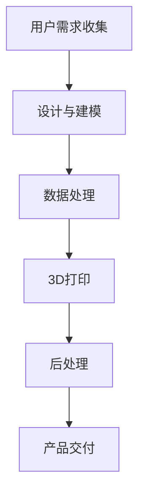

                 

关键词：3D打印、个性化制造、创业、未来趋势、技术发展、应用场景

> 摘要：本文将探讨3D打印技术的迅速发展及其在个性化制造领域的应用，分析这一技术的创业潜力，并提出未来可能面临的挑战和机遇。

## 1. 背景介绍

### 1.1 3D打印的起源与发展

3D打印技术，又称增材制造，最早可以追溯到20世纪80年代。当时，Charles Hull发明了立体光固化技术（SLA），这是最早的一种3D打印技术。随后，FDM（熔融沉积建模）、SLS（选择性激光烧结）等多种技术相继问世，3D打印技术逐渐成熟并应用于各个领域。

### 1.2 个性化制造的概念

个性化制造是一种根据用户的需求或偏好，定制生产特定产品的生产方式。这种生产方式能够实现产品的高度定制化，满足消费者对产品多样性和个性化的追求。

### 1.3 3D打印与个性化制造的联系

3D打印技术的出现为个性化制造提供了全新的实现方式。通过3D打印，可以快速、高效地制造出个性化的产品，满足消费者的需求。

## 2. 核心概念与联系

### 2.1 3D打印技术原理

3D打印技术的基本原理是将数字模型分层处理，并通过逐层堆积材料的方式制造出实体产品。具体来说，有以下几种技术：

#### 2.1.1 熔融沉积建模（FDM）

FDM是最常见的3D打印技术，通过加热熔融丝材，然后将其挤出并堆积成型。

#### 2.1.2 立体光固化（SLA）

SLA技术使用紫外激光固化树脂，形成每一层，然后逐层堆叠。

#### 2.1.3 选择性激光烧结（SLS）

SLS技术使用激光烧结粉末材料，逐层堆积成型。

### 2.2 个性化制造流程

个性化制造流程通常包括以下几个步骤：

#### 2.2.1 用户需求收集

收集用户对产品的需求，包括尺寸、形状、材质等。

#### 2.2.2 设计与建模

根据用户需求进行产品设计和建模。

#### 2.2.3 数据处理

将设计模型进行处理，生成适合3D打印的数据。

#### 2.2.4 3D打印

使用3D打印技术制造出个性化的产品。

#### 2.2.5 后处理

对3D打印出的产品进行打磨、上色等后处理。

### 2.3 Mermaid 流程图



## 3. 核心算法原理 & 具体操作步骤

### 3.1 算法原理概述

3D打印的核心算法是三维建模与数据处理。三维建模是将二维图形转化为三维模型的过程，数据处理是将三维模型转化为适合3D打印的数据。

### 3.2 算法步骤详解

#### 3.2.1 三维建模

三维建模可以通过计算机辅助设计（CAD）软件实现。常见的CAD软件有AutoCAD、SolidWorks等。

#### 3.2.2 数据处理

数据处理包括切片处理和路径规划。切片处理是将三维模型划分为二维层，路径规划是确定打印头在每层中的移动路径。

### 3.3 算法优缺点

#### 3.3.1 优点

- 快速制造个性化产品
- 材料利用率高
- 可以制造复杂结构

#### 3.3.2 缺点

- 成本较高
- 打印速度较慢
- 材料限制

### 3.4 算法应用领域

3D打印技术广泛应用于医疗器械、航空航天、汽车制造等领域，个性化制造则在定制化消费市场中有很大的发展潜力。

## 4. 数学模型和公式 & 详细讲解 & 举例说明

### 4.1 数学模型构建

3D打印中的数学模型主要包括三维几何建模和切片处理。三维几何建模使用的是参数方程或体素模型，切片处理则是将三维模型划分为二维层。

### 4.2 公式推导过程

#### 4.2.1 三维几何建模

三维几何建模使用参数方程表示，如：

$$
\begin{aligned}
x &= x(t) \\
y &= y(t) \\
z &= z(t)
\end{aligned}
$$

#### 4.2.2 切片处理

切片处理是将三维模型划分为二维层，公式为：

$$
s = \frac{z}{h}
$$

其中，s为层数，z为高度，h为层高。

### 4.3 案例分析与讲解

假设一个三维模型的高度为100mm，层高为1mm，我们需要将其切片处理。根据公式，可以得到：

$$
s = \frac{100mm}{1mm} = 100
$$

这意味着我们需要将三维模型划分为100层。

## 5. 项目实践：代码实例和详细解释说明

### 5.1 开发环境搭建

为了进行3D打印编程实践，我们需要搭建一个开发环境。以下是一个基本的开发环境搭建步骤：

#### 5.1.1 安装操作系统

选择一个支持3D打印的操作系统，如Ubuntu或Windows。

#### 5.1.2 安装编程环境

安装Python、Anaconda等编程环境。

#### 5.1.3 安装3D打印软件

安装Cura、Simplify3D等3D打印软件。

### 5.2 源代码详细实现

以下是一个简单的3D打印程序，用于生成一个简单的三维模型。

```python
import numpy as np
import matplotlib.pyplot as plt

# 三维建模
def model(t):
    x = t
    y = t**2
    z = t**3
    return x, y, z

# 切片处理
def slice(model, h):
    layers = []
    for t in np.linspace(0, 10, 1000):
        x, y, z = model(t)
        layers.append((x, y, z))
    return layers

# 绘制三维模型
def plot_model(layers):
    fig = plt.figure()
    ax = fig.add_subplot(111, projection='3d')
    for x, y, z in layers:
        ax.scatter(x, y, z)
    plt.show()

# 主函数
def main():
    model = model
    h = 1
    layers = slice(model, h)
    plot_model(layers)

if __name__ == "__main__":
    main()
```

### 5.3 代码解读与分析

上述代码实现了一个简单的三维模型生成和切片处理过程。其中，`model` 函数定义了三维模型的参数方程，`slice` 函数实现切片处理，`plot_model` 函数用于绘制三维模型。

### 5.4 运行结果展示

运行上述代码，我们将得到一个简单的三维模型。


## 6. 实际应用场景

### 6.1 医疗器械

3D打印技术在医疗器械领域有广泛的应用，如制造个性化的假肢、植入物等。

### 6.2 航空航天

航空航天领域对零部件的轻量化和复杂性有较高要求，3D打印技术可以满足这些需求。

### 6.3 汽车制造

汽车制造中，3D打印技术可以用于制造个性化零部件，提高生产效率。

### 6.4 定制化消费

定制化消费市场是3D打印技术的另一个重要应用领域，如定制化首饰、家居用品等。

## 7. 工具和资源推荐

### 7.1 学习资源推荐

- 《3D打印技术：原理与应用》
- 《个性化制造：技术与实践》

### 7.2 开发工具推荐

- Cura
- Simplify3D
- Blender

### 7.3 相关论文推荐

- "3D Printing: A Comprehensive Overview"
- "Personalized Manufacturing: Opportunities and Challenges"

## 8. 总结：未来发展趋势与挑战

### 8.1 研究成果总结

3D打印技术及其在个性化制造领域的应用取得了显著成果，但仍然面临许多挑战。

### 8.2 未来发展趋势

随着技术的不断进步，3D打印技术有望在更多领域得到应用，个性化制造也将成为未来制造业的重要趋势。

### 8.3 面临的挑战

3D打印技术需要解决成本高、速度慢等问题，个性化制造则需要解决个性化需求与大规模生产之间的平衡问题。

### 8.4 研究展望

未来，3D打印技术有望在更多领域取得突破，个性化制造也将成为未来制造业的重要方向。

## 9. 附录：常见问题与解答

### 9.1 3D打印技术的优点是什么？

3D打印技术的优点包括快速制造个性化产品、材料利用率高、可以制造复杂结构等。

### 9.2 个性化制造有哪些应用领域？

个性化制造广泛应用于医疗器械、航空航天、汽车制造、定制化消费等领域。

### 9.3 3D打印技术的局限性是什么？

3D打印技术的局限性包括成本较高、打印速度较慢、材料限制等。

----------------------------------------------------------------
作者：禅与计算机程序设计艺术 / Zen and the Art of Computer Programming

这篇文章以3D打印技术为核心，探讨了其在个性化制造领域的应用，分析了其创业潜力，并对未来发展趋势与挑战进行了展望。希望这篇文章能为读者提供对3D打印技术及其应用领域的深入了解。

