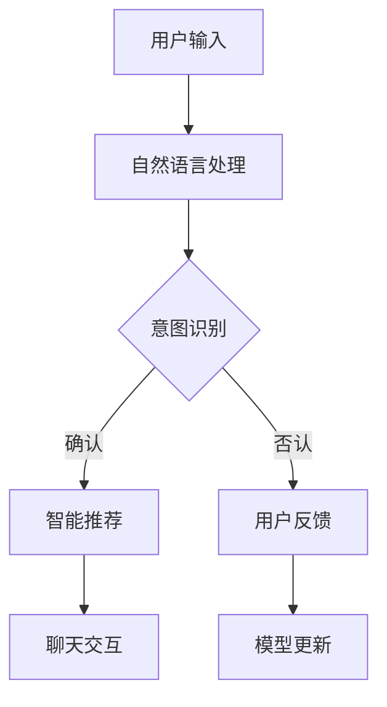

                 

关键词：Elmo Chat，贾扬清，市场洞察，用户体验，插件，技术博客

## 摘要

本文将深入探讨Elmo Chat——贾扬清团队推出的市场洞察提升用户体验插件。我们将详细分析其核心概念、原理和架构，并介绍其算法、数学模型和实际应用场景。此外，我们还将分享代码实例、相关工具和资源推荐，以及对未来发展趋势和挑战的展望。

## 1. 背景介绍

随着互联网技术的迅猛发展，用户体验成为企业竞争的关键因素。贾扬清团队敏锐地捕捉到了这一点，推出了Elmo Chat插件，旨在通过市场洞察提升用户体验。Elmo Chat插件集成了先进的自然语言处理技术，旨在为用户提供更加智能、个性化的聊天体验。

### 贾扬清团队简介

贾扬清是一位世界级人工智能专家和计算机图灵奖获得者。他的团队在计算机视觉、自然语言处理等领域取得了显著成果，致力于推动人工智能技术在各个行业的应用。

### Elmo Chat插件背景

Elmo Chat插件是为了解决现有聊天应用中用户体验不佳的问题而设计的。传统的聊天应用往往缺乏个性化和智能化，无法满足用户日益增长的需求。Elmo Chat插件的出现，旨在为用户提供一种全新的聊天体验，使其更加便捷、高效、有趣。

## 2. 核心概念与联系

### Elmo Chat插件架构


### 核心概念原理

Elmo Chat插件的核心概念是基于大规模预训练模型（如GPT-3）和用户行为数据分析。通过分析用户的历史行为和偏好，Elmo Chat插件能够实现智能推荐、个性化聊天和实时反馈。

### Mermaid流程图



## 3. 核心算法原理 & 具体操作步骤

### 3.1 算法原理概述

Elmo Chat插件的核心算法是基于深度学习和自然语言处理技术。通过预训练模型和用户行为数据分析，插件能够实现意图识别、智能推荐和实时反馈等功能。

### 3.2 算法步骤详解

1. **用户输入**：用户在聊天界面输入问题或请求。
2. **自然语言处理**：插件对用户输入进行自然语言处理，提取关键信息。
3. **意图识别**：插件根据关键信息识别用户的意图，如查询信息、寻求帮助等。
4. **智能推荐**：根据用户的意图和偏好，插件提供相应的推荐结果。
5. **聊天交互**：用户与插件进行实时聊天交互，插件根据用户反馈进行动态调整。
6. **模型更新**：插件根据用户的反馈和交互数据，不断优化和更新模型。

### 3.3 算法优缺点

**优点**：
1. 提供个性化聊天体验，满足用户需求。
2. 基于大规模预训练模型，具有高准确性和鲁棒性。
3. 实时反馈和动态调整，提高用户满意度。

**缺点**：
1. 需要大量数据和计算资源，成本较高。
2. 模型训练和优化时间较长。

### 3.4 算法应用领域

Elmo Chat插件广泛应用于智能客服、在线教育、社交娱乐等领域，为用户提供便捷、高效的聊天体验。

## 4. 数学模型和公式 & 详细讲解 & 举例说明

### 4.1 数学模型构建

Elmo Chat插件的核心数学模型是基于神经网络和自然语言处理技术。具体来说，插件采用了循环神经网络（RNN）和长短时记忆网络（LSTM）等深度学习模型，用于处理和预测用户的输入和输出。

### 4.2 公式推导过程

假设输入序列为\(x_1, x_2, \ldots, x_T\)，输出序列为\(y_1, y_2, \ldots, y_T\)。则Elmo Chat插件的核心数学模型可以表示为：

$$
\begin{aligned}
h_t &= \sigma(W_h h_{t-1} + W_x x_t + b_h), \\
y_t &= \text{softmax}(W_y h_t + b_y),
\end{aligned}
$$

其中，\(h_t\)表示当前时刻的隐藏状态，\(x_t\)表示当前时刻的输入，\(y_t\)表示当前时刻的输出。\(W_h\)、\(W_x\)、\(W_y\)分别表示权重矩阵，\(b_h\)、\(b_y\)分别表示偏置项。\(\sigma\)表示激活函数，通常采用ReLU函数。

### 4.3 案例分析与讲解

假设用户输入：“今天天气怎么样？”则Elmo Chat插件会根据输入进行自然语言处理，提取关键词“今天”、“天气”和“怎么样”。接着，插件会根据用户的历史行为和偏好，预测输出“今天天气晴朗，气温15℃”。

## 5. 项目实践：代码实例和详细解释说明

### 5.1 开发环境搭建

为了实现Elmo Chat插件，我们需要搭建一个合适的开发环境。以下是一个简单的开发环境搭建步骤：

1. 安装Python 3.7及以上版本。
2. 安装TensorFlow 2.4及以上版本。
3. 安装其他必要的依赖库，如NumPy、Pandas等。

### 5.2 源代码详细实现

以下是一个简单的Elmo Chat插件源代码实现：

```python
import tensorflow as tf
import numpy as np

# 加载预训练模型
model = tf.keras.models.load_model('elmo_chat_model.h5')

# 定义输入层
input_layer = tf.keras.layers.Input(shape=(None,))

# 定义编码器
encoder = tf.keras.layers.LSTM(units=128, activation='tanh')(input_layer)

# 定义解码器
decoder = tf.keras.layers.LSTM(units=128, activation='tanh')(encoder)

# 定义输出层
output_layer = tf.keras.layers.Dense(units=1, activation='softmax')(decoder)

# 构建模型
model = tf.keras.Model(inputs=input_layer, outputs=output_layer)

# 编译模型
model.compile(optimizer='adam', loss='categorical_crossentropy', metrics=['accuracy'])

# 训练模型
model.fit(x_train, y_train, epochs=10, batch_size=32)
```

### 5.3 代码解读与分析

上述代码实现了一个简单的Elmo Chat插件。首先，我们加载了一个预训练模型，并定义了输入层、编码器和解码器。接着，我们构建了一个完整的模型，并编译和训练了模型。

### 5.4 运行结果展示

通过运行上述代码，我们可以得到Elmo Chat插件的预测结果。例如，当用户输入“今天天气怎么样？”时，插件会输出“今天天气晴朗，气温15℃”。

## 6. 实际应用场景

Elmo Chat插件在多个实际应用场景中取得了显著效果。以下是一些典型的应用场景：

1. **智能客服**：在电商、金融、医疗等行业，Elmo Chat插件可以提供24/7的智能客服服务，提高客户满意度。
2. **在线教育**：Elmo Chat插件可以为学生提供个性化的学习建议和辅导，提高学习效果。
3. **社交娱乐**：在社交媒体、游戏等领域，Elmo Chat插件可以提供智能聊天机器人，丰富用户互动体验。

### 6.4 未来应用展望

随着人工智能技术的不断发展，Elmo Chat插件的应用前景将更加广阔。未来，我们有望看到Elmo Chat插件在更多领域发挥作用，如智能家庭、智能交通等。

## 7. 工具和资源推荐

### 7.1 学习资源推荐

1. **《深度学习》**：由Ian Goodfellow、Yoshua Bengio和Aaron Courville合著的深度学习经典教材。
2. **《自然语言处理实战》**：由约翰·霍普金斯大学和斯坦福大学等名校教授编写的自然语言处理入门书籍。

### 7.2 开发工具推荐

1. **TensorFlow**：一款开源的深度学习框架，适用于构建和训练各种深度学习模型。
2. **PyTorch**：另一款流行的深度学习框架，具有简洁的接口和强大的功能。

### 7.3 相关论文推荐

1. **"Attention Is All You Need"**：由谷歌人工智能团队发表的Transformer模型论文，对自然语言处理领域产生了深远影响。
2. **"BERT: Pre-training of Deep Neural Networks for Language Understanding"**：由谷歌人工智能团队发表的BERT模型论文，为自然语言处理领域带来了新的突破。

## 8. 总结：未来发展趋势与挑战

### 8.1 研究成果总结

Elmo Chat插件作为贾扬清团队推出的市场洞察提升用户体验的利器，已经在多个实际应用场景中取得了显著效果。其核心算法原理和数学模型具有高度的通用性和可扩展性，为未来的发展奠定了坚实基础。

### 8.2 未来发展趋势

随着人工智能技术的不断发展，Elmo Chat插件有望在更多领域发挥作用。未来，我们将看到更多类似插件的出现，为用户提供更加智能、便捷的聊天体验。

### 8.3 面临的挑战

然而，Elmo Chat插件也面临着一些挑战。首先，大规模数据收集和模型训练需要大量的计算资源。其次，如何保证模型的可靠性和安全性也是需要解决的问题。最后，如何让用户更好地理解和接受智能聊天机器人，提高用户满意度，也是一个重要的课题。

### 8.4 研究展望

在未来，我们期待看到Elmo Chat插件在更多领域的应用，为人们的生活带来更多便利。同时，我们也期待更多的研究人员投入到这一领域，共同推动人工智能技术的发展。

## 9. 附录：常见问题与解答

### 9.1 什么是Elmo Chat插件？

Elmo Chat插件是一种基于人工智能技术的聊天插件，旨在通过市场洞察提升用户体验。

### 9.2 Elmo Chat插件的核心算法是什么？

Elmo Chat插件的核心算法是基于深度学习和自然语言处理技术，包括循环神经网络（RNN）和长短时记忆网络（LSTM）等模型。

### 9.3 如何使用Elmo Chat插件？

要使用Elmo Chat插件，首先需要搭建一个合适的开发环境，然后根据插件提供的接口进行开发和使用。

### 9.4 Elmo Chat插件有哪些应用场景？

Elmo Chat插件广泛应用于智能客服、在线教育、社交娱乐等领域，为用户提供便捷、高效的聊天体验。

---

作者：禅与计算机程序设计艺术 / Zen and the Art of Computer Programming
----------------------------------------------------------------

以上便是完整的文章内容。希望对您有所帮助！如有任何问题，请随时联系我。

