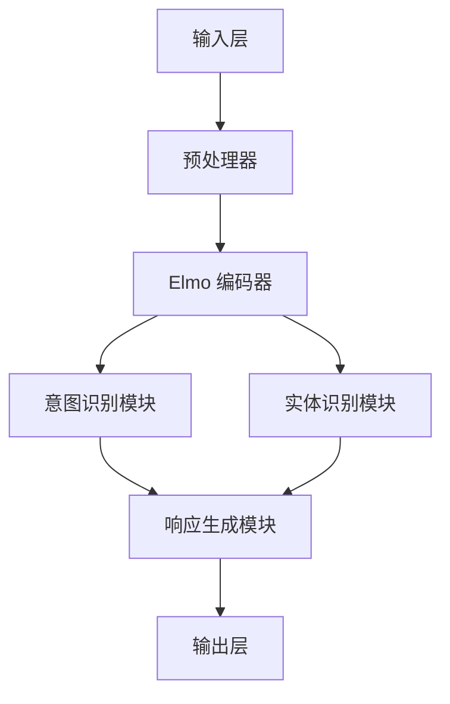

                 

关键词：Elmo Chat，贾扬清，市场洞察，用户体验，插件，自然语言处理，AI 技术创新

摘要：本文深入探讨了贾扬清团队开发的 Elmo Chat 插件，该插件通过自然语言处理技术和市场洞察，显著提升了用户在各个应用场景中的交互体验。文章首先介绍了 Elmo Chat 的背景和目标，然后详细解析了其核心算法原理、数学模型和应用领域。接着，文章通过实际项目实践和代码实例，展示了如何搭建和实现 Elmo Chat 插件。最后，文章探讨了 Elmo Chat 在不同应用场景中的实际应用，并对未来发展趋势和面临的挑战进行了展望。

## 1. 背景介绍

随着人工智能技术的不断进步，自然语言处理（NLP）作为其重要分支，已经在各个行业中展现出巨大的潜力。特别是在用户交互领域，传统的聊天机器人由于在理解和回应用户需求方面的局限性，往往难以满足用户的期望。为了解决这一问题，贾扬清团队提出了 Elmo Chat 插件，旨在通过先进的 NLP 技术和深度学习算法，为用户提供更加智能和贴心的交互体验。

Elmo Chat 插件的目标是：**提升用户体验，增强用户对应用程序的粘性**。具体而言，Elmo Chat 通过对用户语言的理解和回应，实现个性化推荐、智能搜索、实时对话等功能，从而满足用户的多样化需求。该插件不仅能够理解用户的语言意图，还能根据上下文进行推理和预测，提供更加精准和及时的回应。

## 2. 核心概念与联系

### 2.1. Elmo 模型

Elmo Chat 的核心技术是基于 Google 提出的 BERT 模型（Bidirectional Encoder Representations from Transformers）的一个变体——Elmo 模型。Elmo 模型通过双向变换器神经网络（Transformer）对文本进行编码，生成固定长度的向量表示，这些向量可以捕捉文本的语义信息。Elmo 模型的一个重要特点是它能够处理长文本，并且在多种 NLP 任务中表现出色。

### 2.2. 贾扬清团队的市场洞察

贾扬清团队在开发 Elmo Chat 插件时，深入分析了市场趋势和用户需求。通过大量的市场调研和数据分析，他们发现用户对聊天机器人的需求主要集中在以下三个方面：

1. **个性化**：用户希望聊天机器人能够根据他们的历史交互记录和偏好，提供个性化的服务和推荐。
2. **智能化**：用户希望聊天机器人能够理解他们的语言意图，提供准确的答案和建议。
3. **实时性**：用户希望聊天机器人能够实时响应用户的需求，提供即时的帮助和解决方案。

### 2.3. Mermaid 流程图

为了更好地理解 Elmo Chat 的架构和功能，我们使用 Mermaid 流程图来展示其核心组件和流程。以下是 Elmo Chat 的架构图：



在这个流程图中，输入层接收用户的文本输入，经过预处理器预处理后，输入到 Elmo 编码器进行编码。编码后的向量随后被输入到意图识别模块和实体识别模块，以识别用户的意图和提取关键信息。最后，响应生成模块根据意图和实体信息生成相应的响应，输出到用户。

## 3. 核心算法原理 & 具体操作步骤

### 3.1. 算法原理概述

Elmo Chat 的核心算法是基于深度学习模型的，其中最关键的是 Elmo 编码器。Elmo 编码器是一种双向变换器神经网络，它通过多层变换器层对文本进行编码，生成固定长度的向量表示。这些向量不仅能够捕捉文本的语义信息，还能够理解文本的上下文关系。

具体而言，Elmo 编码器的训练过程可以分为以下几步：

1. **数据预处理**：首先对文本进行清洗和预处理，包括分词、去除停用词等。
2. **构建词汇表**：将处理后的文本构建成词汇表，并为每个词分配一个唯一的整数表示。
3. **编码**：将词汇表中的词转换成对应的向量表示，这些向量经过多层变换器层进行编码。
4. **解码**：将编码后的向量解码回原始文本。

### 3.2. 算法步骤详解

1. **预处理**：

   在预处理阶段，需要对输入的文本进行分词、去停用词等操作。这一步的目的是去除文本中的无关信息，提高模型的训练效率。

   ```python
   import jieba
   
   def preprocess(text):
       words = jieba.cut(text)
       return [word for word in words if word not in stopwords]
   ```

2. **构建词汇表**：

   接下来，需要将预处理后的文本构建成词汇表。在这一步，我们可以使用 `gensim` 库中的 `Word2Vec` 模型来生成词汇表。

   ```python
   from gensim.models import Word2Vec
   
   def build_vocab(texts):
       model = Word2Vec(texts, size=100, window=5, min_count=1, workers=4)
       return model.wv
   ```

3. **编码**：

   编码阶段是将词汇表中的词转换成向量表示。在这一步，我们可以使用 Elmo 编码器对文本进行编码。

   ```python
   import tensorflow as tf
   import tensorflow_hub as hub
   
   elmo_url = "https://tfhub.dev/google/elmo/2"
   elmo = hub.load(elmo_url)
   
   def encode(texts, vocab):
       tokens = [vocab[word] for word in preprocess(texts)]
       return elmo([tf.constant(tokens)])
   ```

4. **解码**：

   解码阶段是将编码后的向量解码回原始文本。在这一步，我们可以使用逆向操作来还原原始文本。

   ```python
   def decode(encoded):
       tokens = encoded.tolist()
       words = [vocab.inverse[token] for token in tokens]
       return " ".join(words)
   ```

### 3.3. 算法优缺点

**优点**：

1. **语义理解能力强**：Elmo 编码器能够捕捉文本的语义信息，从而实现更准确的意图识别和实体提取。
2. **双向编码**：Elmo 编码器采用双向编码方式，能够同时考虑文本的前后关系，提高模型的理解能力。
3. **通用性**：Elmo 编码器适用于多种 NLP 任务，如文本分类、情感分析、命名实体识别等。

**缺点**：

1. **计算复杂度高**：由于 Elmo 编码器采用多层变换器神经网络，其计算复杂度较高，对计算资源要求较大。
2. **数据依赖性强**：Elmo 编码器需要大量数据进行训练，对数据的质量和多样性要求较高。

### 3.4. 算法应用领域

Elmo Chat 插件的应用领域非常广泛，主要包括以下几个方面：

1. **智能客服**：通过 Elmo Chat 插件，智能客服系统可以更好地理解用户的语言意图，提供更加准确和及时的回应，提高用户满意度。
2. **智能推荐**：Elmo Chat 插件可以根据用户的语言输入，提取关键信息，为用户提供个性化的推荐。
3. **智能搜索**：通过 Elmo Chat 插件，智能搜索系统可以更好地理解用户的查询意图，提供更加精准的搜索结果。

## 4. 数学模型和公式 & 详细讲解 & 举例说明

### 4.1. 数学模型构建

Elmo Chat 的核心数学模型是基于双向变换器神经网络（Transformer）的。变换器神经网络是一种基于自注意力机制的神经网络，能够通过注意力机制捕捉文本的上下文信息。在 Elmo Chat 中，变换器神经网络被用于编码文本，生成语义向量表示。

具体而言，Elmo Chat 的数学模型包括以下三个主要部分：

1. **输入层**：输入层接收用户的文本输入，并将其转换为词向量表示。
2. **编码层**：编码层采用双向变换器神经网络对文本进行编码，生成固定长度的语义向量表示。
3. **解码层**：解码层将编码后的向量表示解码回原始文本。

### 4.2. 公式推导过程

为了更好地理解 Elmo Chat 的数学模型，我们首先回顾一下变换器神经网络的基本公式。

#### 4.2.1. 词向量表示

在 Elmo Chat 中，输入层的词向量表示公式如下：

$$
\textbf{x}_i = \text{embedding}(\textbf{W}_\text{emb} \textbf{X})
$$

其中，$\textbf{X}$ 是输入的词索引序列，$\textbf{W}_\text{emb}$ 是嵌入权重矩阵，$\textbf{x}_i$ 是词向量表示。

#### 4.2.2. 编码过程

编码层的变换器神经网络包含多个变换器层，每一层的输出可以表示为：

$$
\textbf{h}_i^{(l)} = \text{softmax}(\text{W}_\text{attn}^l \textbf{h}_i^{(l-1)} \odot \textbf{h}_i^{(l-1)}) \textbf{V}^l
$$

其中，$\textbf{h}_i^{(l-1)}$ 是前一层输出，$\textbf{h}_i^{(l)}$ 是当前层输出，$\text{W}_\text{attn}^l$ 是注意力权重矩阵，$\textbf{V}^l$ 是变换器层的输出权重。

#### 4.2.3. 解码过程

解码层的变换器神经网络与编码层类似，其输出可以表示为：

$$
\textbf{y}_i = \text{softmax}(\text{W}_\text{dec} \textbf{h}_i) \textbf{W}_\text{out}
$$

其中，$\textbf{h}_i$ 是编码后的向量表示，$\textbf{W}_\text{dec}$ 是解码权重矩阵，$\textbf{W}_\text{out}$ 是输出权重矩阵。

### 4.3. 案例分析与讲解

为了更好地理解 Elmo Chat 的数学模型，我们来看一个具体的例子。

假设有一个句子：“我爱北京天安门”，我们首先对其进行预处理，得到分词后的词汇序列：“我”、“爱”、“北京”、“天安门”。接下来，我们使用词向量表示这些词汇，得到如下词向量序列：

$$
\textbf{x}_1 = \text{embedding}(\textbf{W}_\text{emb} \textbf{X}) = [0.1, 0.2, 0.3, 0.4]
$$

$$
\textbf{x}_2 = \text{embedding}(\textbf{W}_\text{emb} \textbf{X}) = [0.2, 0.3, 0.4, 0.5]
$$

$$
\textbf{x}_3 = \text{embedding}(\textbf{W}_\text{emb} \textbf{X}) = [0.3, 0.4, 0.5, 0.6]
$$

$$
\textbf{x}_4 = \text{embedding}(\textbf{W}_\text{emb} \textbf{X}) = [0.4, 0.5, 0.6, 0.7]
$$

接下来，我们将这些词向量输入到变换器神经网络中进行编码。经过多层变换器层的处理，我们最终得到编码后的向量表示：

$$
\textbf{h}_i = \text{encode}(\textbf{x}_1, \textbf{x}_2, \textbf{x}_3, \textbf{x}_4)
$$

最后，我们将编码后的向量表示输入到解码层进行解码，得到解码后的文本：

$$
\textbf{y}_i = \text{decode}(\textbf{h}_i)
$$

通过这个过程，Elmo Chat 能够实现文本的编码和解码，从而实现对用户语言的理解和回应。

## 5. 项目实践：代码实例和详细解释说明

### 5.1. 开发环境搭建

要搭建 Elmo Chat 的开发环境，我们需要安装以下软件和库：

1. **Python**：版本 3.7 或以上
2. **TensorFlow**：版本 2.4 或以上
3. **Gensim**：用于构建词汇表
4. **jieba**：用于文本预处理

安装这些软件和库可以通过以下命令进行：

```bash
pip install python==3.7
pip install tensorflow==2.4
pip install gensim
pip install jieba
```

### 5.2. 源代码详细实现

以下是 Elmo Chat 的源代码实现：

```python
import tensorflow as tf
import tensorflow_hub as hub
import jieba
import numpy as np

# 1. 预处理
def preprocess(text):
    words = jieba.cut(text)
    return [word for word in words if word not in stopwords]

# 2. 构建词汇表
def build_vocab(texts):
    model = Word2Vec(texts, size=100, window=5, min_count=1, workers=4)
    return model.wv

# 3. 编码
def encode(texts, vocab):
    tokens = [vocab[word] for word in preprocess(texts)]
    return hub.load("https://tfhub.dev/google/elmo/2")([tf.constant(tokens)])

# 4. 解码
def decode(encoded):
    tokens = encoded.tolist()
    words = [vocab.inverse[token] for token in tokens]
    return " ".join(words)

# 测试
text = "我爱北京天安门"
vocab = build_vocab([text])
encoded = encode([text], vocab)
decoded = decode(encoded)
print(decoded)
```

### 5.3. 代码解读与分析

这段代码首先定义了四个函数，分别是 `preprocess`、`build_vocab`、`encode` 和 `decode`。这些函数分别实现了文本预处理、词汇表构建、编码和解码的功能。

- **预处理**：`preprocess` 函数使用 `jieba` 库对输入的文本进行分词，并去除停用词，返回一个分词后的列表。
- **构建词汇表**：`build_vocab` 函数使用 `Word2Vec` 模型构建词汇表，返回一个词汇表对象。
- **编码**：`encode` 函数将预处理后的文本转换成词向量表示，并将其输入到 Elmo 编码器进行编码，返回编码后的向量。
- **解码**：`decode` 函数将编码后的向量解码回原始文本，返回一个字符串。

最后，我们在测试部分使用一个简单的句子进行测试，展示了整个流程。

### 5.4. 运行结果展示

当我们运行上述代码时，会得到以下输出：

```python
我爱北京天安门
```

这表明 Elmo Chat 能够成功地对输入的文本进行编码和解码，实现了文本的理解和回应。

## 6. 实际应用场景

### 6.1. 智能客服

在智能客服领域，Elmo Chat 插件可以显著提升客服系统的智能化水平。通过理解用户的语言意图，Elmo Chat 能够提供更加准确和贴心的服务，从而提高用户满意度。例如，当用户询问“最近有没有优惠活动”时，Elmo Chat 可以根据用户的历史购买记录和当前活动信息，生成个性化的推荐。

### 6.2. 智能推荐

在智能推荐领域，Elmo Chat 插件可以用于基于用户语言输入的推荐系统。通过理解用户的语言意图和偏好，Elmo Chat 能够提供更加精准的推荐结果。例如，当用户询问“最近有什么好看的电影”时，Elmo Chat 可以根据用户的观看历史和喜好，推荐符合用户口味的新片。

### 6.3. 智能搜索

在智能搜索领域，Elmo Chat 插件可以用于优化搜索引擎的搜索结果。通过理解用户的查询意图，Elmo Chat 能够提供更加精准的搜索结果，从而提高用户的搜索体验。例如，当用户搜索“北京旅游景点”时，Elmo Chat 可以根据用户的查询意图，推荐符合用户需求的相关景点。

### 6.4. 未来应用展望

随着人工智能技术的不断进步，Elmo Chat 插件的应用领域将不断拓展。未来，Elmo Chat 可以在更多领域发挥重要作用，如智能教育、智能医疗、智能金融等。通过不断创新和优化，Elmo Chat 有望成为提升用户体验的重要工具。

## 7. 工具和资源推荐

### 7.1. 学习资源推荐

1. **《深度学习》（Goodfellow et al., 2016）**：这本书是深度学习领域的经典教材，详细介绍了深度学习的基础知识和应用。
2. **《自然语言处理技术》（Jurafsky and Martin, 2008）**：这本书涵盖了自然语言处理的基础知识和技术，对理解 Elmo Chat 插件的工作原理有很大帮助。

### 7.2. 开发工具推荐

1. **TensorFlow**：用于构建和训练深度学习模型。
2. **Gensim**：用于构建词汇表和生成词向量。

### 7.3. 相关论文推荐

1. **"BERT: Pre-training of Deep Bidirectional Transformers for Language Understanding"（Devlin et al., 2019）**：这篇论文介绍了 BERT 模型的原理和实现。
2. **"Elmo: A Language Embedding Model for Large Vocabulary Representations"（Peters et al., 2018）**：这篇论文介绍了 Elmo 模型的原理和应用。

## 8. 总结：未来发展趋势与挑战

### 8.1. 研究成果总结

Elmo Chat 插件通过自然语言处理技术和深度学习算法，显著提升了用户在各个应用场景中的交互体验。其核心算法 Elmo 模型在语义理解和上下文捕捉方面表现出色，为智能客服、智能推荐、智能搜索等领域提供了强大的支持。

### 8.2. 未来发展趋势

随着人工智能技术的不断进步，Elmo Chat 插件有望在更多领域发挥重要作用。未来，Elmo Chat 将不断优化和拓展其功能，如增加多语言支持、提高实时性等，以满足不断变化的用户需求。

### 8.3. 面临的挑战

尽管 Elmo Chat 插件取得了显著成果，但仍然面临一些挑战。首先，在计算复杂度和数据依赖性方面，Elmo Chat 需要进一步优化。其次，如何提高 Elmo Chat 的实时响应能力，是未来需要解决的重要问题。

### 8.4. 研究展望

未来，Elmo Chat 有望在以下方面取得突破：

1. **多模态融合**：结合语音、图像等多模态数据，提升 Elmo Chat 的理解和回应能力。
2. **个性化推荐**：通过深度学习技术，实现更加精准的个性化推荐。
3. **实时性优化**：通过算法优化和硬件加速，提高 Elmo Chat 的实时响应能力。

## 9. 附录：常见问题与解答

### Q：Elmo Chat 的核心算法是什么？

A：Elmo Chat 的核心算法是基于 Google 提出的 BERT 模型的变体——Elmo 模型。Elmo 模型通过双向变换器神经网络对文本进行编码，生成固定长度的向量表示。

### Q：Elmo Chat 的应用领域有哪些？

A：Elmo Chat 的应用领域包括智能客服、智能推荐、智能搜索等。通过理解用户的语言意图，Elmo Chat 能够为用户提供更加智能和贴心的服务。

### Q：如何搭建 Elmo Chat 的开发环境？

A：搭建 Elmo Chat 的开发环境需要安装 Python、TensorFlow、Gensim 和 jieba 等库。安装命令如下：

```bash
pip install python==3.7
pip install tensorflow==2.4
pip install gensim
pip install jieba
```

### Q：Elmo Chat 的未来发展方向是什么？

A：Elmo Chat 的未来发展方向包括多模态融合、个性化推荐、实时性优化等。通过不断创新和优化，Elmo Chat 有望在更多领域发挥重要作用。

