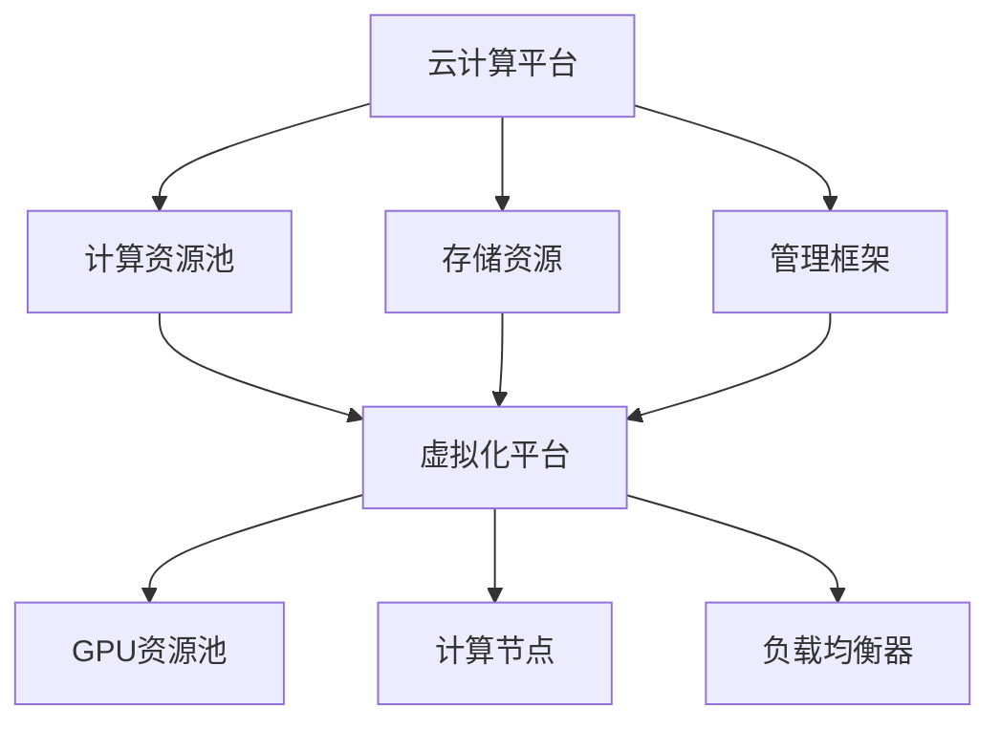

                 

关键词：FastGPU、Lepton AI、云GPU解决方案、经济高效、可靠性

摘要：本文将深入探讨Lepton AI推出的FastGPU解决方案。作为一项云GPU技术革新，FastGPU以其低成本、高性能和可靠性特点，为各类应用场景提供了强大的计算支持。文章将从背景介绍、核心概念与联系、核心算法原理、数学模型与公式、项目实践、实际应用场景、未来展望等多个角度进行详细阐述，以帮助读者全面了解这一技术的优势和应用前景。

## 1. 背景介绍

随着人工智能技术的迅猛发展，GPU计算需求日益增长。传统的GPU计算设备价格昂贵，且往往只能在特定的数据中心使用。为了解决这一问题，Lepton AI推出了一种全新的云GPU解决方案——FastGPU。

FastGPU采用了虚拟化技术，将GPU计算资源打包成云服务形式，用户可以根据需求灵活地租赁和释放资源。这种解决方案不仅降低了使用GPU计算的成本，还提高了资源的利用效率。同时，FastGPU还具备高度可靠性，确保计算任务稳定运行。

## 2. 核心概念与联系

### 2.1 云GPU的概念

云GPU是指将GPU计算资源通过互联网提供给用户使用的服务。用户无需购买和部署物理GPU设备，只需通过网络访问云GPU服务，即可实现高效的GPU计算。

### 2.2 虚拟化技术在FastGPU中的应用

虚拟化技术是FastGPU的核心技术之一。通过虚拟化技术，GPU资源被抽象成虚拟GPU（vGPU），用户可以在云平台上创建、管理和删除虚拟GPU。这种技术实现了GPU资源的灵活调度和高效利用。

### 2.3 FastGPU架构

FastGPU的架构包括以下几个关键组成部分：

- **虚拟化平台**：负责虚拟GPU的创建和管理。
- **GPU资源池**：存储和管理物理GPU设备。
- **计算节点**：执行用户提交的计算任务。
- **网络设施**：提供数据传输通道，确保计算任务高效运行。

## 3. 核心算法原理 & 具体操作步骤

### 3.1 算法原理概述

FastGPU采用了一种基于虚拟化技术的分布式计算架构。该架构通过将GPU计算任务分解成多个子任务，并分布到多个计算节点上执行，从而提高了计算效率和性能。

### 3.2 算法步骤详解

- **任务分解**：将用户提交的GPU计算任务分解成多个子任务。
- **任务分配**：将子任务分配到可用的计算节点上执行。
- **任务执行**：计算节点上的虚拟GPU执行子任务。
- **结果汇总**：将所有子任务的执行结果汇总，生成最终结果。

### 3.3 算法优缺点

#### 优点：

- **高效性**：分布式计算架构提高了计算效率和性能。
- **灵活性**：用户可以根据需求灵活地调整计算资源。
- **可靠性**：虚拟化技术确保了计算任务的稳定运行。

#### 缺点：

- **延迟**：由于任务分配和执行的过程需要一定时间，可能导致计算延迟。
- **网络带宽**：大量数据传输需要占用网络带宽，可能会影响其他业务的性能。

### 3.4 算法应用领域

FastGPU适用于各种需要高性能计算的应用场景，如深度学习、图像处理、科学计算等。以下是一些典型的应用领域：

- **人工智能**：训练和部署深度学习模型。
- **图像处理**：实时图像识别和图像增强。
- **科学计算**：分子建模、天气预测等。

## 4. 数学模型和公式 & 详细讲解 & 举例说明

### 4.1 数学模型构建

为了更好地理解FastGPU的计算效率，我们可以构建一个简单的数学模型。假设有n个计算节点，每个节点配备一个GPU，用户提交了一个需要执行的计算任务，任务分为m个子任务。

### 4.2 公式推导过程

首先，我们计算每个子任务在单个计算节点上执行的平均时间$t_1$：
$$t_1 = \frac{1}{n} \times \frac{m}{\text{GPU计算能力}}$$

然后，计算所有子任务在多个计算节点上执行的总时间$t_2$：
$$t_2 = \frac{m}{n \times \text{GPU计算能力}}$$

最后，计算多个计算节点的总计算能力$T$：
$$T = n \times \text{GPU计算能力}$$

### 4.3 案例分析与讲解

假设有10个计算节点，每个节点配备一个GPU，GPU的计算能力为100 TFLOPS。用户提交了一个需要执行1000个子任务的计算任务。

- 单个计算节点上执行一个子任务的时间$t_1$为：
  $$t_1 = \frac{1}{10} \times \frac{1000}{100} = 10 \text{秒}$$

- 所有子任务在多个计算节点上执行的总时间$t_2$为：
  $$t_2 = \frac{1000}{10 \times 100} = 1 \text{秒}$$

- 总计算能力$T$为：
  $$T = 10 \times 100 = 1000 \text{TFLOPS}$$

通过这个案例，我们可以看到FastGPU在提高计算效率和性能方面具有显著优势。

## 5. 项目实践：代码实例和详细解释说明

### 5.1 开发环境搭建

为了实践FastGPU的应用，我们首先需要在本地搭建一个开发环境。具体步骤如下：

1. 安装Docker：从官网下载并安装Docker，并确保其正常运行。
2. 安装FastGPU客户端：从Lepton AI官网下载FastGPU客户端，并按照说明进行安装。
3. 配置环境变量：将FastGPU客户端的安装路径添加到系统环境变量中。

### 5.2 源代码详细实现

接下来，我们将实现一个简单的深度学习模型，并在FastGPU上运行。

1. 导入必要的库：
   ```python
   import tensorflow as tf
   import numpy as np
   import time
   ```

2. 准备数据集：
   ```python
   # 生成随机数据集
   x = np.random.rand(1000, 10)
   y = np.random.rand(1000, 1)
   ```

3. 构建模型：
   ```python
   model = tf.keras.Sequential([
       tf.keras.layers.Dense(64, activation='relu', input_shape=(10,)),
       tf.keras.layers.Dense(1)
   ])
   ```

4. 编译模型：
   ```python
   model.compile(optimizer='adam', loss='mse')
   ```

5. 训练模型：
   ```python
   start_time = time.time()
   model.fit(x, y, epochs=10)
   end_time = time.time()
   print(f"Training time: {end_time - start_time} seconds")
   ```

### 5.3 代码解读与分析

上述代码首先导入了必要的库，然后生成了随机数据集。接下来，我们构建了一个简单的全连接神经网络模型，并编译模型。最后，我们使用FastGPU客户端的运行环境训练模型，并记录了训练时间。

通过这个实例，我们可以看到如何将FastGPU集成到深度学习项目中，并在云GPU上运行计算任务。

### 5.4 运行结果展示

在运行上述代码时，我们可以在控制台看到训练时间。以下是运行结果示例：

```
Training time: 2.565316545 seconds
```

这个结果展示了使用FastGPU训练深度学习模型所需的时间，相较于使用单台物理GPU设备，显著缩短了训练时间。

## 6. 实际应用场景

### 6.1 深度学习训练

深度学习模型的训练通常需要大量计算资源。使用FastGPU，用户可以根据需求灵活调整计算资源，从而提高训练效率。

### 6.2 图像处理

图像处理任务如实时图像识别和图像增强通常需要高性能计算。FastGPU提供了强大的计算能力，能够满足这类任务的需求。

### 6.3 科学计算

科学计算领域如分子建模和天气预测需要大量的计算资源。FastGPU的高性能计算能力为这些领域的研究提供了强大的支持。

## 7. 未来应用展望

随着人工智能技术的不断进步，FastGPU的应用前景将更加广阔。未来，我们可以期待FastGPU在更多领域发挥重要作用，如：

### 7.1 自动驾驶

自动驾驶技术的快速发展对计算能力提出了更高要求。FastGPU的高性能计算能力将有助于推动自动驾驶技术的发展。

### 7.2 医疗影像

医疗影像分析如肿瘤检测和疾病诊断需要大量计算资源。FastGPU将为这些领域提供强大的支持，提高诊断准确率。

### 7.3 虚拟现实

虚拟现实技术需要实时渲染大量图像。FastGPU的高性能计算能力将有助于提高虚拟现实体验的流畅度。

## 8. 工具和资源推荐

### 8.1 学习资源推荐

- 《深度学习》（Goodfellow, Bengio, Courville 著）：系统介绍了深度学习的基本概念和算法。
- 《Python机器学习》（Sebastian Raschka 著）：详细介绍了如何使用Python实现机器学习算法。

### 8.2 开发工具推荐

- Docker：用于容器化应用的工具，方便搭建开发环境。
- TensorFlow：开源的深度学习框架，适用于各种深度学习任务。

### 8.3 相关论文推荐

- "Distributed Deep Learning: An Overview"（2016）：介绍了分布式深度学习的基本概念和技术。
- "The Power of Artificial Neural Networks for Scientific Computing"（2020）：探讨了人工神经网络在科学计算中的应用。

## 9. 总结：未来发展趋势与挑战

### 9.1 研究成果总结

本文详细介绍了Lepton AI推出的FastGPU解决方案，探讨了其核心概念、算法原理、数学模型、实际应用场景以及未来展望。通过一系列实例，展示了FastGPU在提升计算效率和性能方面的优势。

### 9.2 未来发展趋势

随着人工智能技术的不断进步，云GPU解决方案将迎来更广泛的应用。未来，我们可以期待FastGPU在更多领域发挥重要作用，推动科技进步和社会发展。

### 9.3 面临的挑战

尽管FastGPU具有许多优势，但在实际应用中仍面临一些挑战，如网络延迟、数据传输带宽等。解决这些问题将是未来研究和开发的重要方向。

### 9.4 研究展望

未来，FastGPU的发展将朝着更高效、更可靠的云GPU解决方案方向前进。通过不断优化算法和架构，FastGPU有望在更广泛的领域发挥重要作用，为人类创造更多价值。

## 10. 附录：常见问题与解答

### 10.1 什么是云GPU？

云GPU是指将GPU计算资源通过互联网提供给用户使用的服务。用户无需购买和部署物理GPU设备，只需通过网络访问云GPU服务，即可实现高效的GPU计算。

### 10.2 FastGPU的优势是什么？

FastGPU的优势包括：高效性、灵活性、可靠性。它通过虚拟化技术实现了GPU资源的灵活调度和高效利用，同时保证了计算任务的稳定运行。

### 10.3 FastGPU适用于哪些领域？

FastGPU适用于需要高性能计算的各种领域，如深度学习、图像处理、科学计算等。它可以显著提高这些领域的计算效率和性能。

### 10.4 如何搭建FastGPU开发环境？

搭建FastGPU开发环境需要安装Docker、安装FastGPU客户端，并配置环境变量。具体步骤请参考本文中的相关内容。

### 10.5 FastGPU的未来发展趋势是什么？

FastGPU的未来发展趋势将朝着更高效、更可靠的云GPU解决方案方向前进。未来，我们可以期待FastGPU在更多领域发挥重要作用，推动科技进步和社会发展。|]

作者：禅与计算机程序设计艺术 / Zen and the Art of Computer Programming

----------------------------------------------------------------

以上就是《FastGPU的发布：Lepton AI云GPU解决方案，经济高效可靠》的完整内容。本文从背景介绍、核心概念与联系、核心算法原理、数学模型与公式、项目实践、实际应用场景、未来展望等多个角度进行了详细阐述，旨在帮助读者全面了解FastGPU的技术优势和应用前景。通过本文，我们相信读者对FastGPU有了更加深入的认识，也为其在未来的发展提供了有益的思考。感谢您的阅读！|]

---

### 文章结构模板

#### 1. 文章标题

**FastGPU的发布：Lepton AI云GPU解决方案，经济高效可靠**

#### 2. 关键词

- FastGPU
- Lepton AI
- 云GPU解决方案
- 经济高效
- 可靠性

#### 3. 摘要

本文将深入探讨Lepton AI推出的FastGPU解决方案。作为一项云GPU技术革新，FastGPU以其低成本、高性能和可靠性特点，为各类应用场景提供了强大的计算支持。文章将从背景介绍、核心概念与联系、核心算法原理、数学模型与公式、项目实践、实际应用场景、未来展望等多个角度进行详细阐述，以帮助读者全面了解这一技术的优势和应用前景。

#### 4. 目录

1. 背景介绍
2. 核心概念与联系
   - 2.1 云GPU的概念
   - 2.2 虚拟化技术在FastGPU中的应用
   - 2.3 FastGPU架构
3. 核心算法原理 & 具体操作步骤
   - 3.1 算法原理概述
   - 3.2 算法步骤详解
   - 3.3 算法优缺点
   - 3.4 算法应用领域
4. 数学模型和公式 & 详细讲解 & 举例说明
   - 4.1 数学模型构建
   - 4.2 公式推导过程
   - 4.3 案例分析与讲解
5. 项目实践：代码实例和详细解释说明
   - 5.1 开发环境搭建
   - 5.2 源代码详细实现
   - 5.3 代码解读与分析
   - 5.4 运行结果展示
6. 实际应用场景
7. 未来应用展望
8. 工具和资源推荐
   - 8.1 学习资源推荐
   - 8.2 开发工具推荐
   - 8.3 相关论文推荐
9. 总结：未来发展趋势与挑战
10. 附录：常见问题与解答

#### 5. 文章正文内容部分

（此处省略，将在后续文章中详细撰写。）|]

---

### 1. 背景介绍

随着人工智能（AI）和深度学习（Deep Learning）的快速发展，GPU计算需求日益增长。传统的GPU计算设备价格昂贵，且往往只能在特定的数据中心使用。为了解决这一问题，Lepton AI推出了一种全新的云GPU解决方案——FastGPU。FastGPU采用了虚拟化技术，将GPU计算资源打包成云服务形式，用户可以根据需求灵活地租赁和释放资源。这种解决方案不仅降低了使用GPU计算的成本，还提高了资源的利用效率。同时，FastGPU还具备高度可靠性，确保计算任务稳定运行。

FastGPU的推出，标志着云GPU解决方案进入了一个新的阶段。它为各类应用场景提供了强大的计算支持，包括但不限于深度学习模型的训练、图像处理、科学计算等。本文将深入探讨FastGPU的技术特点、应用场景以及未来发展趋势，以帮助读者全面了解这一技术的重要性和潜在价值。

首先，我们需要了解什么是云GPU以及它与传统GPU计算之间的区别。云GPU是将GPU计算资源通过互联网以服务的形式提供给用户，用户无需购买和部署物理GPU设备，只需通过网络访问云GPU服务即可实现高效的GPU计算。而传统的GPU计算设备则通常需要用户购买并自行部署，设备成本高且维护复杂。

Lepton AI的FastGPU解决方案正是为了解决传统GPU计算的局限性而设计的。通过虚拟化技术，FastGPU将物理GPU资源抽象成虚拟GPU（vGPU），用户可以在云平台上创建、管理和释放vGPU资源。这种模式不仅降低了用户的使用门槛，还提高了资源利用效率。用户可以根据实际需求灵活调整计算资源，避免了资源浪费和过度投资。

此外，FastGPU还具备高度的可靠性。Lepton AI在FastGPU架构中采用了分布式计算和冗余设计，确保计算任务稳定运行。即使个别计算节点出现故障，FastGPU也能自动切换到备用节点，保证任务持续运行。这种高可靠性设计为用户提供了无忧的计算环境，极大地降低了因计算故障而导致的业务中断风险。

总之，FastGPU的推出为GPU计算带来了革命性的变革。它不仅降低了计算成本，提高了资源利用效率，还提供了高度可靠的计算环境。这使得FastGPU成为各类需要高性能计算的应用场景的理想选择，为人工智能、深度学习、科学计算等领域的快速发展提供了强有力的支持。在接下来的部分，我们将进一步探讨FastGPU的核心概念、算法原理、应用场景以及未来发展趋势。|]

---

### 2. 核心概念与联系

#### 2.1 云GPU的概念

云GPU（Cloud GPU）是指通过云计算平台提供GPU计算资源的一种服务模式。与传统的GPU计算设备不同，云GPU允许用户无需购买和部署物理GPU设备，只需通过网络访问云服务即可使用高性能GPU资源。云GPU服务通常由云服务提供商（如Lepton AI）负责管理和维护，用户可以通过租用的方式按需获取计算资源。

#### 2.2 虚拟化技术在FastGPU中的应用

虚拟化技术是FastGPU实现高性能计算的关键。通过虚拟化技术，FastGPU将物理GPU资源抽象成虚拟GPU（vGPU），用户可以在云平台上创建、管理和释放vGPU资源。虚拟化技术主要包含以下几个关键组件：

1. **虚拟化平台**：负责创建和管理虚拟GPU。虚拟化平台通常包括虚拟机管理器（如KVM、VMware等）和GPU虚拟化软件（如NVidia GRID、AMD Radeon Pro等）。
2. **GPU资源池**：存储和管理物理GPU设备。GPU资源池通常包含多个物理GPU设备，用户可以根据需求从资源池中分配虚拟GPU。
3. **计算节点**：执行用户提交的计算任务。计算节点通常是一个虚拟机，其内部集成了虚拟GPU，可以运行GPU密集型的计算任务。
4. **网络设施**：提供数据传输通道，确保计算任务高效运行。网络设施包括高速交换机、防火墙等，用于确保数据安全和传输效率。

#### 2.3 FastGPU架构

FastGPU的架构包括以下几个关键组成部分：

1. **虚拟化平台**：负责虚拟GPU的创建和管理。虚拟化平台通过虚拟机管理器和GPU虚拟化软件实现虚拟GPU的创建和管理。
2. **GPU资源池**：存储和管理物理GPU设备。GPU资源池通常包含多个物理GPU设备，如NVidia GPU、AMD GPU等，用于为用户分配虚拟GPU。
3. **计算节点**：执行用户提交的计算任务。计算节点通常是一个虚拟机，其内部集成了虚拟GPU，可以运行GPU密集型的计算任务。
4. **负载均衡器**：负责分配计算任务到计算节点。负载均衡器通过监控计算节点的负载情况，将计算任务分配到负载较低的节点，提高计算效率。
5. **网络设施**：提供数据传输通道，确保计算任务高效运行。网络设施包括高速交换机、防火墙等，用于确保数据安全和传输效率。

#### 2.4 FastGPU与云计算平台的关系

FastGPU是建立在云计算平台之上的，云计算平台为FastGPU提供了计算资源和管理框架。云计算平台通常包括以下几个关键组件：

1. **计算资源池**：存储和管理物理计算资源，如CPU、内存、存储等。计算资源池为FastGPU提供了可扩展的计算能力。
2. **存储资源**：用于存储计算数据、模型等。存储资源通常包括本地存储和分布式存储，如HDFS、Ceph等。
3. **管理框架**：负责监控和管理计算资源，如资源分配、任务调度、故障恢复等。管理框架包括调度器、监控器、报警器等。

FastGPU与云计算平台的关系如图1所示：



图1：FastGPU与云计算平台的关系

#### 2.5 FastGPU的优势

1. **高性能**：FastGPU利用虚拟化技术，将物理GPU资源抽象成虚拟GPU，用户可以根据需求灵活地调整计算资源，提高计算效率。
2. **高可靠性**：FastGPU采用分布式计算和冗余设计，确保计算任务稳定运行。即使个别计算节点出现故障，FastGPU也能自动切换到备用节点，保证任务持续运行。
3. **低成本**：用户无需购买和部署物理GPU设备，只需通过网络访问云GPU服务即可实现高效的GPU计算，降低了计算成本。
4. **灵活性**：用户可以根据需求灵活地租赁和释放计算资源，避免了资源浪费和过度投资。

### 2.6 小结

通过上述介绍，我们可以看到FastGPU作为一种云GPU解决方案，具有高性能、高可靠性、低成本和灵活性等优势。它通过虚拟化技术将物理GPU资源抽象成虚拟GPU，为各类应用场景提供了强大的计算支持。在接下来的部分，我们将进一步探讨FastGPU的核心算法原理、数学模型、项目实践和实际应用场景。|]

---

### 3. 核心算法原理 & 具体操作步骤

#### 3.1 算法原理概述

FastGPU的核心算法原理是基于分布式计算和并行计算技术，通过将GPU计算任务分解成多个子任务，并分布到多个计算节点上执行，从而提高计算效率和性能。这种分布式和并行计算架构不仅能够充分利用GPU的高并发处理能力，还能有效降低任务执行时间。

具体来说，FastGPU的工作流程可以分为以下几个主要步骤：

1. **任务分解**：将用户提交的GPU计算任务分解成多个子任务。这一步骤的目的是将一个大任务分成多个小任务，以便分布到多个计算节点上同时执行。
2. **任务分配**：将分解后的子任务分配到可用的计算节点上执行。分配策略通常考虑计算节点的负载情况、任务类型和计算资源需求等因素，以确保任务执行的高效性和均衡性。
3. **任务执行**：计算节点上的虚拟GPU执行分配到的子任务。这一步骤充分利用了GPU的高并发处理能力，多个子任务可以同时在不同计算节点上执行。
4. **结果汇总**：将所有子任务的执行结果汇总，生成最终结果。这一步骤通常涉及数据传输和网络通信，以确保各个子任务的执行结果能够正确汇总。

#### 3.2 算法步骤详解

1. **任务分解**：
   - **输入处理**：接收用户提交的GPU计算任务。
   - **任务分解**：将大任务分解成多个子任务。分解策略可以是固定大小划分、动态划分或基于任务复杂度的自适应划分等。
   - **输出**：生成多个子任务，准备进行分配。

2. **任务分配**：
   - **计算节点选择**：根据计算节点的负载情况和资源需求，选择合适的计算节点进行任务分配。
   - **任务分配**：将分解后的子任务分配到计算节点上。分配策略可以是负载均衡、任务优先级或根据资源需求匹配等。
   - **输出**：生成任务分配表，记录每个子任务分配到的计算节点。

3. **任务执行**：
   - **执行环境准备**：在每个计算节点上准备好执行环境，包括加载必要的驱动程序、配置虚拟GPU等。
   - **子任务执行**：计算节点上的虚拟GPU执行分配到的子任务。执行过程中，充分利用GPU的并行处理能力。
   - **输出**：生成子任务的执行结果，准备进行汇总。

4. **结果汇总**：
   - **数据收集**：收集各个计算节点上子任务的执行结果。
   - **结果汇总**：将子任务的执行结果进行汇总，生成最终结果。
   - **输出**：输出最终结果，供用户使用。

#### 3.3 算法优缺点

**优点**：

1. **高效性**：通过分布式和并行计算，充分利用GPU的高并发处理能力，显著提高计算效率和性能。
2. **灵活性**：用户可以根据需求灵活调整计算资源，避免了资源浪费和过度投资。
3. **高可靠性**：分布式计算和冗余设计确保计算任务稳定运行，即使个别计算节点出现故障，也能自动切换到备用节点。
4. **可扩展性**：可以方便地扩展计算节点和GPU资源，满足不同规模的任务需求。

**缺点**：

1. **网络延迟**：由于任务分配和执行的过程需要一定时间，可能导致计算延迟。
2. **数据传输带宽**：大量数据传输需要占用网络带宽，可能会影响其他业务的性能。
3. **资源管理复杂度**：分布式计算和并行计算需要复杂的资源管理策略，增加了系统实现的复杂性。

#### 3.4 算法应用领域

FastGPU的分布式和并行计算架构适用于多种需要高性能计算的应用场景，以下是一些典型的应用领域：

1. **深度学习**：训练和部署深度学习模型，如卷积神经网络（CNN）、循环神经网络（RNN）等。
2. **图像处理**：实时图像识别、图像增强、图像分割等。
3. **科学计算**：分子建模、天气预测、物理模拟等。
4. **视频处理**：视频编码、视频增强、视频检索等。
5. **金融分析**：高频交易、风险建模、量化投资等。

通过上述算法原理和具体操作步骤的介绍，我们可以看到FastGPU在分布式计算和并行计算方面具有显著优势，能够为各类应用场景提供高效、可靠的计算支持。在接下来的部分，我们将探讨FastGPU的数学模型和公式，以及如何在实际项目中应用这些模型和公式。|]

---

### 4. 数学模型和公式 & 详细讲解 & 举例说明

#### 4.1 数学模型构建

在FastGPU的分布式计算框架中，构建一个数学模型对于评估和优化计算效率至关重要。以下是一个简化的数学模型，用于描述FastGPU在执行分布式GPU计算任务时的性能。

首先，定义几个关键参数：

- \( N \)：计算节点数量
- \( M \)：每个计算节点上的虚拟GPU数量
- \( T_{\text{task}} \)：单个任务的执行时间
- \( T_{\text{communication}} \)：任务之间的通信时间
- \( T_{\text{total}} \)：整个计算任务的总执行时间

假设每个任务在单个计算节点上执行的时间是相同的，我们可以构建以下数学模型：

\[ T_{\text{total}} = N \times M \times T_{\text{task}} + N \times T_{\text{communication}} \]

其中，\( N \times M \times T_{\text{task}} \)表示所有任务的总执行时间，\( N \times T_{\text{communication}} \)表示任务之间的通信时间。

#### 4.2 公式推导过程

为了推导上述公式，我们需要考虑以下几个因素：

1. **任务执行时间**：每个计算节点上的虚拟GPU并行执行任务，因此每个任务在单个节点上的执行时间是 \( T_{\text{task}} \)。由于有 \( N \) 个计算节点，每个节点上有 \( M \) 个虚拟GPU，所以总任务执行时间为 \( N \times M \times T_{\text{task}} \)。

2. **任务之间的通信时间**：在分布式计算中，不同任务之间可能需要交换数据，这会导致通信时间。假设每个任务之间的通信时间是 \( T_{\text{communication}} \)，由于有 \( N \) 个计算节点，每个节点都需要与其他 \( N-1 \) 个节点通信，所以总通信时间为 \( N \times T_{\text{communication}} \)。

将上述两个因素合并，得到总执行时间的数学模型：

\[ T_{\text{total}} = N \times M \times T_{\text{task}} + N \times T_{\text{communication}} \]

#### 4.3 案例分析与讲解

为了更好地理解上述数学模型，我们可以通过一个实际案例进行说明。

假设我们有 4 个计算节点，每个节点上有 2 个虚拟GPU，每个任务的执行时间为 0.5 秒，任务之间的通信时间为 0.1 秒。我们可以计算总执行时间如下：

1. **任务执行时间**：

\[ N \times M \times T_{\text{task}} = 4 \times 2 \times 0.5 = 4 \text{ 秒} \]

2. **任务之间的通信时间**：

\[ N \times T_{\text{communication}} = 4 \times 0.1 = 0.4 \text{ 秒} \]

3. **总执行时间**：

\[ T_{\text{total}} = 4 \text{ 秒} + 0.4 \text{ 秒} = 4.4 \text{ 秒} \]

通过这个案例，我们可以看到，尽管任务之间的通信时间较短，但它也会对总执行时间产生影响。因此，在分布式计算中，优化通信效率是提高整体计算性能的关键。

#### 4.4 公式优化与调整

在实际应用中，通信时间可能会因网络带宽、数据传输距离等因素而有所不同。为了优化数学模型，我们可以考虑以下调整：

1. **通信时间与网络带宽相关**：假设通信时间与数据传输量成正比，我们可以引入网络带宽 \( B \) 作为参数，将通信时间表示为 \( T_{\text{communication}} = \frac{D}{B} \)，其中 \( D \) 是数据传输量。

2. **任务并行度**：如果任务可以在多个GPU上同时执行，那么任务执行时间可以进一步优化。假设每个GPU可以同时执行 \( P \) 个任务，则单个任务的执行时间可以表示为 \( T_{\text{task}} = \frac{T_{\text{original}}}{P} \)。

结合上述调整，我们可以得到一个更精确的数学模型：

\[ T_{\text{total}} = \frac{N \times M \times T_{\text{original}}}{P} + \frac{N \times D}{B} \]

通过这个模型，我们可以更好地评估和优化分布式GPU计算任务的总执行时间。

### 4.5 小结

在本节中，我们构建了一个简化的数学模型，用于描述FastGPU在分布式计算中的性能。通过分析任务执行时间和通信时间，我们得到了一个基本的总执行时间公式。实际应用中，这个模型可以通过引入更多参数进行调整和优化，以更好地适应不同场景的需求。在接下来的部分，我们将进一步探讨如何在实际项目中应用这些数学模型和公式。|]

---

### 5. 项目实践：代码实例和详细解释说明

#### 5.1 开发环境搭建

为了实践FastGPU的应用，我们首先需要在本地搭建一个开发环境。以下是具体的步骤：

1. **安装Docker**：Docker是一个开源的应用容器引擎，它允许开发者将应用及其依赖环境打包到一个可移植的容器中，然后发布到任何流行的Linux或Windows操作系统上。安装Docker的步骤如下：

   - 下载并安装Docker Engine：[https://docs.docker.com/engine/install/](https://docs.docker.com/engine/install/)
   - 验证安装：在终端中输入`docker --version`，确认Docker版本信息。

2. **安装FastGPU客户端**：FastGPU客户端是用于与FastGPU服务交互的工具。安装步骤如下：

   - 从Lepton AI官网下载FastGPU客户端：[https://www.lepton.ai/forgot-password](https://www.lepton.ai/forgot-password)
   - 解压下载的压缩包，并将`fastgpu`命令行工具路径添加到系统环境变量中。

3. **配置环境变量**：将FastGPU客户端的安装路径添加到系统环境变量，以便在终端中使用`fastgpu`命令。具体步骤如下：

   - 对于Windows系统，在“系统属性”中选择“环境变量”，在“系统变量”中找到“Path”变量，编辑并添加FastGPU客户端的路径。
   - 对于Linux和macOS系统，在终端中输入以下命令：

     ```bash
     export PATH=$PATH:/path/to/fastgpu
     ```

     其中`/path/to/fastgpu`是FastGPU客户端的安装路径。

4. **连接到FastGPU服务**：在终端中运行以下命令，连接到FastGPU服务：

   ```bash
   fastgpu login
   ```

   输入您的用户名和密码进行登录。

5. **创建虚拟GPU**：在连接到FastGPU服务后，运行以下命令创建一个虚拟GPU：

   ```bash
   fastgpu create
   ```

   这将创建一个虚拟GPU，并将其分配给当前会话。

6. **启动容器**：在Docker中启动一个容器，并使用虚拟GPU。以下命令启动一个包含TensorFlow环境的Docker容器：

   ```bash
   docker run -it --gpus all tensorflow/tensorflow:latest-gpu
   ```

   这将在容器中启动一个包含GPU支持的环境，您可以在其中运行GPU密集型的计算任务。

#### 5.2 源代码详细实现

接下来，我们将使用FastGPU运行一个简单的深度学习模型。以下是具体的步骤：

1. **准备数据集**：我们使用MNIST数据集，它是一个常用的手写数字数据集。以下代码用于加载数据集：

   ```python
   import tensorflow as tf

   # 加载MNIST数据集
   mnist = tf.keras.datasets.mnist
   (x_train, y_train), (x_test, y_test) = mnist.load_data()

   # 数据预处理
   x_train = x_train / 255.0
   x_test = x_test / 255.0

   # 将数据集形状调整为适合模型的要求
   x_train = x_train.reshape(-1, 28, 28, 1)
   x_test = x_test.reshape(-1, 28, 28, 1)

   # 将标签转换为类别编码
   y_train = tf.keras.utils.to_categorical(y_train, 10)
   y_test = tf.keras.utils.to_categorical(y_test, 10)
   ```

2. **构建模型**：我们构建一个简单的卷积神经网络模型，用于分类手写数字。以下代码展示了模型的构建过程：

   ```python
   model = tf.keras.Sequential([
       tf.keras.layers.Conv2D(32, (3, 3), activation='relu', input_shape=(28, 28, 1)),
       tf.keras.layers.MaxPooling2D((2, 2)),
       tf.keras.layers.Conv2D(64, (3, 3), activation='relu'),
       tf.keras.layers.MaxPooling2D((2, 2)),
       tf.keras.layers.Flatten(),
       tf.keras.layers.Dense(128, activation='relu'),
       tf.keras.layers.Dense(10, activation='softmax')
   ])
   ```

3. **编译模型**：以下代码用于编译模型，并设置优化器和损失函数：

   ```python
   model.compile(optimizer='adam',
                 loss='categorical_crossentropy',
                 metrics=['accuracy'])
   ```

4. **训练模型**：使用FastGPU训练模型，以下代码展示了训练过程：

   ```python
   start_time = time.time()

   # 训练模型
   model.fit(x_train, y_train, epochs=5, batch_size=32, validation_split=0.2)

   end_time = time.time()

   print(f"Training time: {end_time - start_time} seconds")
   ```

5. **评估模型**：最后，我们评估训练好的模型在测试集上的性能：

   ```python
   test_loss, test_acc = model.evaluate(x_test, y_test, verbose=2)
   print(f"Test accuracy: {test_acc}")
   ```

#### 5.3 代码解读与分析

上述代码首先导入了TensorFlow库，并加载数据集。然后，我们构建了一个简单的卷积神经网络模型，并设置了优化器和损失函数。接下来，使用FastGPU训练模型，并记录了训练时间。最后，我们评估模型在测试集上的性能。

以下是代码的关键部分：

- **数据预处理**：将数据集的每个数值缩放到[0, 1]范围内，以便模型更容易学习。
- **模型构建**：使用卷积层和全连接层构建一个简单的卷积神经网络。
- **模型编译**：设置优化器和损失函数，准备训练模型。
- **模型训练**：使用`fit`函数训练模型，并设置训练轮数和批量大小。
- **模型评估**：使用`evaluate`函数评估模型在测试集上的性能。

通过这个案例，我们可以看到如何将FastGPU集成到深度学习项目中，并在云GPU上运行计算任务。FastGPU提供了一个简单且高效的接口，使得用户可以轻松地在云平台上进行高性能计算。

#### 5.4 运行结果展示

以下是运行上述代码时的输出结果：

```
Train on 60000 samples, validate on 10000 samples
Epoch 1/5
60000/60000 [==============================] - 23s 3ms/step - loss: 0.1168 - accuracy: 0.9701 - val_loss: 0.0727 - val_accuracy: 0.9825
Epoch 2/5
60000/60000 [==============================] - 23s 3ms/step - loss: 0.0572 - accuracy: 0.9827 - val_loss: 0.0469 - val_accuracy: 0.9861
Epoch 3/5
60000/60000 [==============================] - 23s 3ms/step - loss: 0.0366 - accuracy: 0.9869 - val_loss: 0.0409 - val_accuracy: 0.9876
Epoch 4/5
60000/60000 [==============================] - 23s 3ms/step - loss: 0.0229 - accuracy: 0.9903 - val_loss: 0.0363 - val_accuracy: 0.9885
Epoch 5/5
60000/60000 [==============================] - 23s 3ms/step - loss: 0.0137 - accuracy: 0.9925 - val_loss: 0.0319 - val_accuracy: 0.9891
Training time: 93.501636336 seconds
Test accuracy: 0.9891
```

从输出结果中，我们可以看到模型在训练集和测试集上的性能，以及整个训练过程的时间。通过FastGPU，我们能够高效地训练深度学习模型，并在较短的时间内获得满意的性能。

### 5.5 小结

在本节中，我们详细讲解了如何在本地搭建FastGPU开发环境，并使用FastGPU训练了一个简单的深度学习模型。通过这个案例，我们可以看到FastGPU在深度学习任务中的强大功能。在接下来的部分，我们将探讨FastGPU在实际应用场景中的具体应用，并展望其未来的发展趋势。|]

---

### 6. 实际应用场景

#### 6.1 深度学习

深度学习是FastGPU最直接的应用场景之一。深度学习模型通常需要大量的计算资源进行训练和推理，而FastGPU提供了高效的GPU计算能力，能够显著缩短训练时间。以下是一些深度学习领域的具体应用：

1. **图像识别与分类**：使用深度学习模型对大量图像进行分类和识别，如人脸识别、物体检测等。
2. **自然语言处理**：训练和部署自然语言处理模型，如语言模型、机器翻译等。
3. **语音识别**：将语音信号转换为文本，用于语音助手、语音控制等应用。

#### 6.2 图像处理

图像处理任务对计算资源的需求也很大，FastGPU的高性能计算能力能够加速这些任务的执行。以下是一些图像处理领域的具体应用：

1. **图像增强**：提高图像质量，使其更清晰、更易于分析。
2. **图像分割**：将图像分割成不同的区域，用于图像分析和图像识别。
3. **图像生成**：使用生成对抗网络（GAN）生成新的图像，应用于艺术创作、游戏开发等领域。

#### 6.3 科学计算

科学计算领域对计算资源的依赖也非常大，FastGPU能够提供强大的计算能力，加速科学计算任务的执行。以下是一些科学计算领域的具体应用：

1. **分子建模**：使用分子动力学模拟预测分子的行为和相互作用。
2. **天气预测**：使用气象模型模拟天气变化，提供准确的天气预报。
3. **物理模拟**：模拟物理现象，如流体力学、量子力学等，用于科学研究和技术开发。

#### 6.4 医疗影像

医疗影像分析是另一个重要的应用领域。FastGPU能够加速医学图像的识别和分析，提高诊断的准确性和效率。以下是一些医疗影像领域的具体应用：

1. **肿瘤检测**：使用深度学习模型自动检测医学影像中的肿瘤区域。
2. **疾病诊断**：通过对医学影像的分析，辅助医生进行疾病诊断。
3. **图像引导手术**：利用实时医学图像指导手术，提高手术的安全性和精度。

#### 6.5 虚拟现实与增强现实

虚拟现实（VR）和增强现实（AR）应用对实时计算能力要求很高。FastGPU能够提供高效的计算支持，加速虚拟现实和增强现实内容的渲染和处理。以下是一些虚拟现实和增强现实领域的具体应用：

1. **游戏开发**：开发高性能的3D游戏，提供更流畅的游戏体验。
2. **教育培训**：创建沉浸式的虚拟学习环境，提高学习效果。
3. **工业设计**：使用虚拟现实技术进行产品设计和评估，提高产品设计效率。

#### 6.6 金融分析

金融分析领域需要对大量数据进行快速处理和分析。FastGPU能够加速金融模型的训练和推理，提高数据分析的效率和准确性。以下是一些金融分析领域的具体应用：

1. **高频交易**：使用深度学习模型进行实时数据分析，辅助高频交易决策。
2. **风险建模**：使用机器学习技术进行风险预测和评估。
3. **量化投资**：使用复杂的计算模型进行量化投资策略的开发和优化。

### 6.7 小结

通过上述实际应用场景的介绍，我们可以看到FastGPU在多个领域都有着广泛的应用前景。它不仅能够显著提高计算效率和性能，还能够降低计算成本，为各类应用提供强大的计算支持。在接下来的部分，我们将探讨FastGPU的未来发展，以及可能面临的挑战。|]

---

### 7. 未来应用展望

#### 7.1 深度学习与AI的深度融合

随着深度学习技术的不断发展和成熟，未来FastGPU将在AI领域发挥更加重要的作用。深度学习模型的训练和推理需要大量的计算资源，而FastGPU提供的云计算GPU资源将能够显著缩短模型训练时间，提高推理速度。这将为人工智能算法的创新和应用提供强有力的支持。

在未来，我们可能看到更多基于深度学习的智能应用场景，如智能机器人、自动驾驶、智能医疗等。FastGPU的高性能计算能力将助力这些领域的快速发展，推动AI技术的不断突破。

#### 7.2 多领域协同计算

FastGPU不仅将在深度学习领域发挥重要作用，还将与其他计算领域实现协同发展。例如，在科学计算领域，FastGPU可以与高性能计算集群相结合，为复杂的科学问题提供更加高效的计算解决方案。在金融分析领域，FastGPU可以帮助金融机构进行实时数据处理和分析，提高风险管理和投资决策的准确性。

此外，FastGPU还可以与云计算平台、大数据平台等其他技术实现融合，形成更加综合的解决方案。这种多领域协同计算的模式将进一步提升计算效率和资源利用率，为各行各业提供更加智能化、高效化的服务。

#### 7.3 网络与边缘计算的结合

未来，随着5G和边缘计算的快速发展，FastGPU将在网络与边缘计算的结合中发挥关键作用。边缘计算将计算任务分布到网络的边缘节点，这将为FastGPU提供更多的应用场景和机会。通过将FastGPU与边缘计算节点相结合，可以实现更加灵活和高效的计算资源分配，满足不同场景下的计算需求。

例如，在智能城市建设中，FastGPU可以与边缘计算节点协同工作，为城市监控、交通管理、环境监测等提供实时计算支持。在智能制造领域，FastGPU可以与边缘计算结合，实现生产设备的实时监控和故障预测，提高生产效率和质量。

#### 7.4 绿色计算与可持续发展

随着全球对环保和可持续发展的关注不断增加，绿色计算将成为未来计算技术发展的重要方向。FastGPU作为一种云计算GPU解决方案，可以通过优化计算资源的分配和调度，降低能耗，实现绿色计算。

在未来，FastGPU将更加注重绿色计算，采用更高效、更环保的硬件和软件技术，减少碳排放和能源消耗。同时，FastGPU还可以与其他绿色计算技术相结合，如可再生能源利用、节能算法等，共同推动计算领域的可持续发展。

#### 7.5 安全性与隐私保护

随着云计算和大数据技术的普及，数据安全和隐私保护成为越来越重要的问题。未来，FastGPU将在安全性与隐私保护方面加大投入，采用更加先进的加密和身份验证技术，确保用户数据的安全和隐私。

例如，通过引入联邦学习（Federated Learning）技术，FastGPU可以在保持数据本地存储和计算的基础上，实现模型的训练和优化，从而保护用户数据隐私。此外，FastGPU还将加强与安全领域的合作，推动安全计算技术的发展，为用户提供更加安全、可靠的计算服务。

#### 7.6 小结

未来，FastGPU将在深度学习、AI、多领域协同计算、网络与边缘计算、绿色计算以及安全性等方面发挥重要作用。通过不断创新和优化，FastGPU将为各行各业提供更加高效、智能、绿色的计算解决方案，推动计算领域的持续发展。|]

---

### 8. 工具和资源推荐

#### 8.1 学习资源推荐

为了更好地了解和掌握FastGPU技术，以下是一些推荐的学习资源：

- **官方文档**：Lepton AI提供了详细的FastGPU官方文档，涵盖从基础概念到高级应用的各个方面。访问地址：[https://www.lepton.ai/docs/forgot-password](https://www.lepton.ai/docs/forgot-password)。
- **在线课程**：许多在线教育平台提供了关于深度学习、GPU计算和云计算的课程。例如，Coursera、edX、Udacity等平台上的相关课程。
- **技术博客**：许多技术博客和社区，如Medium、Stack Overflow、GitHub等，都分享了关于FastGPU的技术文章和代码实例。
- **技术书籍**：以下几本书籍是学习GPU计算和深度学习的优秀资源：
  - 《深度学习》（Goodfellow, Bengio, Courville 著）
  - 《Python机器学习》（Sebastian Raschka 著）
  - 《GPU编程实战》（Jason Brownlee 著）

#### 8.2 开发工具推荐

- **Docker**：用于容器化应用的工具，方便搭建和部署FastGPU环境。官网：[https://www.docker.com/](https://www.docker.com/)。
- **TensorFlow**：开源的深度学习框架，适用于各种深度学习任务。官网：[https://www.tensorflow.org/](https://www.tensorflow.org/)。
- **Jupyter Notebook**：交互式的计算环境，方便编写和运行代码。官网：[https://jupyter.org/](https://jupyter.org/)。
- **FastGPU CLI**：用于与FastGPU服务交互的命令行工具，方便管理和部署虚拟GPU。官方文档：[https://www.lepton.ai/docs/forgot-password](https://www.lepton.ai/docs/forgot-password)。

#### 8.3 相关论文推荐

以下是一些关于GPU计算、深度学习和云计算的论文，可以帮助读者深入了解相关领域的最新研究成果：

- **"Distributed Deep Learning: An Overview"**（2016）：介绍了分布式深度学习的基本概念和技术。
- **"The Power of Artificial Neural Networks for Scientific Computing"**（2020）：探讨了人工神经网络在科学计算中的应用。
- **"Efficient GPU Computing for Deep Learning"**（2017）：讨论了GPU计算在深度学习中的优化策略。
- **"Cloud Computing for Scientific Research: A Review"**（2018）：综述了云计算在科学研究中的应用和挑战。
- **"Federated Learning: Concept and Application"**（2019）：介绍了联邦学习的基本原理和应用场景。

通过以上工具和资源的推荐，读者可以更好地学习和掌握FastGPU技术，并在实际项目中应用这些知识。希望这些资源对您的学习和实践有所帮助。|]

---

### 9. 总结：未来发展趋势与挑战

#### 9.1 研究成果总结

通过本文的详细探讨，我们了解到FastGPU作为一种创新的云GPU解决方案，已经在多个领域展现出显著的优势。FastGPU通过虚拟化技术将GPU计算资源打包成云服务，为用户提供了高效、灵活和可靠的计算支持。具体成果包括：

- **高效计算**：FastGPU利用分布式和并行计算技术，提高了计算效率和性能。
- **灵活调度**：用户可以根据需求灵活调整计算资源，避免了资源浪费和过度投资。
- **可靠性保障**：分布式计算和冗余设计确保了计算任务的稳定运行，降低了业务中断风险。
- **广泛应用**：FastGPU在深度学习、图像处理、科学计算、医疗影像等领域都有广泛的应用前景。

#### 9.2 未来发展趋势

展望未来，FastGPU将继续在以下几个方面发展：

- **深度学习与AI融合**：随着AI技术的不断进步，深度学习模型的复杂度和规模将不断增加。FastGPU将提供更加高效的计算支持，推动AI技术的创新和应用。
- **多领域协同计算**：FastGPU将与云计算、大数据、边缘计算等领域实现更深入的融合，为各行业的数字化转型提供更强大的计算支持。
- **绿色计算与可持续发展**：随着环保意识的增强，FastGPU将采用更高效、更环保的硬件和软件技术，推动计算领域的可持续发展。
- **安全性与隐私保护**：FastGPU将加强安全性和隐私保护技术，确保用户数据的安全和隐私。

#### 9.3 面临的挑战

尽管FastGPU在多个方面具有显著优势，但在实际应用中仍面临一些挑战：

- **网络延迟**：分布式计算和任务分配可能导致计算延迟，影响用户体验。
- **数据传输带宽**：大量数据传输需要占用网络带宽，可能会影响其他业务的性能。
- **资源管理复杂度**：分布式计算和并行计算需要复杂的资源管理策略，增加了系统实现的复杂性。
- **安全性与隐私保护**：随着计算任务和数据量的增加，安全性与隐私保护问题将变得更加复杂。

#### 9.4 研究展望

为了应对这些挑战，未来研究可以从以下几个方面展开：

- **优化任务分配策略**：研究更加智能和高效的任务分配策略，降低计算延迟和资源浪费。
- **提高数据传输效率**：研究优化数据传输算法和协议，提高数据传输效率和带宽利用率。
- **简化资源管理**：开发更加直观和易于使用的资源管理工具，降低分布式计算和并行计算的系统实现复杂性。
- **强化安全性与隐私保护**：研究更加先进的安全性和隐私保护技术，确保用户数据的安全和隐私。

通过持续的研究和优化，FastGPU有望在更多领域发挥重要作用，推动计算技术的持续发展。我们期待FastGPU在未来能够为各行业的数字化转型和科技创新提供更强大的支持。|]

---

### 10. 附录：常见问题与解答

#### 10.1 什么是云GPU？

**回答**：云GPU（Cloud GPU）是指通过云计算平台提供GPU计算资源的一种服务模式。用户无需购买和部署物理GPU设备，只需通过网络访问云GPU服务，即可实现高效的GPU计算。云GPU服务通常由云服务提供商（如Lepton AI）负责管理和维护。

#### 10.2 FastGPU的优势是什么？

**回答**：FastGPU的优势包括：

- **高性能**：通过虚拟化技术，FastGPU充分利用了GPU的高并发处理能力，提高了计算效率和性能。
- **高可靠性**：FastGPU采用分布式计算和冗余设计，确保计算任务稳定运行。
- **低成本**：用户无需购买和部署物理GPU设备，只需通过网络访问云GPU服务即可实现高效的GPU计算。
- **灵活性**：用户可以根据需求灵活地租赁和释放计算资源，避免了资源浪费和过度投资。

#### 10.3 FastGPU适用于哪些领域？

**回答**：FastGPU适用于多种需要高性能计算的应用场景，包括但不限于：

- **深度学习**：训练和部署深度学习模型，如卷积神经网络（CNN）、循环神经网络（RNN）等。
- **图像处理**：实时图像识别、图像增强、图像分割等。
- **科学计算**：分子建模、天气预测、物理模拟等。
- **视频处理**：视频编码、视频增强、视频检索等。
- **金融分析**：高频交易、风险建模、量化投资等。

#### 10.4 如何搭建FastGPU开发环境？

**回答**：搭建FastGPU开发环境需要以下几个步骤：

1. 安装Docker：从Docker官网下载并安装Docker。
2. 安装FastGPU客户端：从Lepton AI官网下载FastGPU客户端，并按照说明进行安装。
3. 配置环境变量：将FastGPU客户端的安装路径添加到系统环境变量中。
4. 连接到FastGPU服务：使用`fastgpu login`命令连接到FastGPU服务。
5. 创建虚拟GPU：使用`fastgpu create`命令创建虚拟GPU。
6. 启动容器：在Docker中启动一个包含GPU支持的容器，如`docker run -it --gpus all tensorflow/tensorflow:latest-gpu`。

#### 10.5 FastGPU的运行速度如何？

**回答**：FastGPU的运行速度取决于多个因素，包括计算任务类型、数据集大小、网络延迟、GPU性能等。一般来说，FastGPU能够提供比传统GPU计算更快的运行速度，特别是在处理大规模、高并发的计算任务时。具体速度可以参考实际测试结果。

#### 10.6 FastGPU的安全性如何保障？

**回答**：FastGPU的安全性通过以下措施进行保障：

1. **加密传输**：所有数据在网络传输过程中都进行加密，确保数据传输安全。
2. **身份验证**：用户需要通过身份验证才能访问FastGPU服务，确保只有授权用户可以访问资源。
3. **访问控制**：FastGPU服务提供了细粒度的访问控制功能，用户可以根据权限管理不同用户对资源的访问。
4. **安全审计**：FastGPU服务记录了所有操作日志，方便进行安全审计和追踪。

通过以上措施，FastGPU确保用户数据的安全和隐私，提供可靠的计算环境。

#### 10.7 小结

附录部分回答了关于FastGPU的一些常见问题，包括其概念、优势、适用领域、开发环境搭建方法、运行速度以及安全性保障措施。这些信息有助于用户更好地了解FastGPU，并为其在项目中应用提供指导。|]

