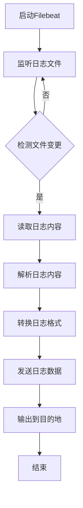
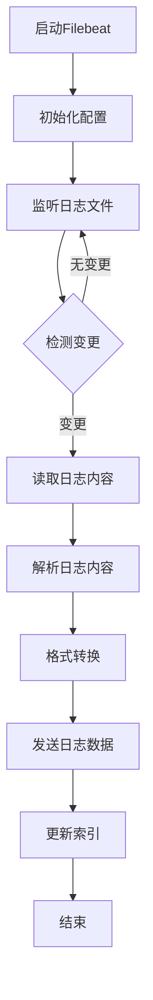

                 

“日志是计算机系统中最宝贵的资源之一，它记录了系统运行的各种状态、错误、事件等信息，对于监控、调试、优化系统性能具有重要意义。而Filebeat作为一款优秀的日志采集工具，可以轻松地将系统日志传输到各种目的地，如ELK（Elasticsearch、Logstash、Kibana）堆栈、云存储服务等。本文将深入探讨Filebeat的日志采集与传输机制，帮助大家更好地理解和使用这个强大的工具。”

## 1. 背景介绍

在当今数字化时代，随着系统规模的不断扩大和复杂度的增加，日志管理成为一个至关重要的任务。传统的日志管理方法往往依赖于手动收集和分析日志文件，这不仅费时费力，而且容易出现错误和遗漏。因此，自动化的日志采集与传输工具应运而生。

Filebeat正是这样的一个工具，它是Elastic Stack的一部分，专为实时收集系统、应用程序和服务的日志而设计。Filebeat可以运行在Linux、Windows和Mac OS等多种操作系统上，通过简单的配置即可将日志传输到各种目的地，如Elasticsearch、Kibana、Logstash和其他支持Filebeat输出的系统。

## 2. 核心概念与联系

在深入探讨Filebeat之前，我们需要了解一些核心概念：

### 2.1. 日志文件

日志文件是系统在运行过程中生成的文本文件，记录了各种事件、错误、警告等信息。日志文件的格式通常遵循特定的规范，如RFC 5424定义的Syslog格式。

### 2.2. 采集器

采集器是指负责从源系统中提取日志数据的工具。Filebeat就是这样一个采集器，它可以从本地文件系统、网络套接字、JMX等源中读取日志数据。

### 2.3. 输出器

输出器是负责将采集到的日志数据发送到目的地的组件。Filebeat支持多种输出器，如Logstash、Elasticsearch、Kibana等。

### 2.4. 日志格式

日志格式是指日志数据在文件中组织的方式。Filebeat支持多种日志格式，包括JSON、Syslog、Grok等。

### 2.5. Mermaid流程图

为了更好地理解Filebeat的工作流程，我们使用Mermaid绘制了一个流程图：



## 3. 核心算法原理 & 具体操作步骤

### 3.1. 算法原理概述

Filebeat的工作原理可以概括为以下几个步骤：

1. **启动与配置**：Filebeat启动后，读取其配置文件，确定要监听的日志文件、日志格式和输出器等参数。
2. **监听日志文件**：Filebeat会定期检查配置中指定的日志文件，检测文件是否发生变化。
3. **读取日志内容**：如果检测到日志文件发生变化，Filebeat会读取文件内容。
4. **解析日志内容**：Filebeat使用内置的解析器或自定义的正则表达式，将日志内容解析为字段和值。
5. **转换日志格式**：将解析后的日志内容转换为指定的日志格式，如JSON。
6. **发送日志数据**：将转换后的日志数据发送到输出器，如Logstash、Elasticsearch等。
7. **输出到目的地**：输出器将日志数据存储在指定的目的地，如Elasticsearch索引中。

### 3.2. 算法步骤详解

1. **启动Filebeat**：首先，我们需要安装并配置Filebeat。安装过程取决于操作系统，通常可以通过包管理器或下载二进制文件进行。配置文件通常位于`/etc/filebeat/filebeat.yml`或`~/filebeat.yml`。

    ```yaml
    filebeat.inputs:
      - type: log
        enabled: true
        paths:
          - /var/log/syslog

    filebeat.config.modules:
      path: ${path.config}/modules.d/*.yml
      reload.enabled: false

    output.logstash:
      hosts: ["logstash:5044"]
    ```

2. **监听日志文件**：Filebeat会定期检查配置中指定的日志文件。如果文件发生变化，它会读取文件内容。

3. **读取日志内容**：Filebeat使用内置的解析器或自定义的正则表达式，将日志内容解析为字段和值。

    ```yaml
    filebeat.eventsource:
      type: log
      enabled: true
      harvesters:
        syslog:
          enabled: true
          paths:
            - /var/log/syslog
          input_config:
            type: log
            enable_kibana: true
    ```

4. **解析日志内容**：例如，对于Syslog日志，Filebeat使用RFC 5424定义的Syslog格式进行解析。

5. **转换日志格式**：Filebeat将解析后的日志内容转换为JSON格式，以便于Elasticsearch等系统处理。

    ```json
    {
      "source": "/var/log/syslog",
      "pri": 10,
      "version": 1,
      "host": "localhost",
      "timestamp": "2023-03-24T12:34:56.789Z",
      "fields": {
        "level": "info",
        "sourcecategory": "syslog",
        "sourcehost": "localhost",
        "sourcelayout": "raw",
        "sourcetype": "syslog",
        "message": "Test message"
      }
    }
    ```

6. **发送日志数据**：Filebeat将转换后的日志数据发送到输出器，如Logstash、Elasticsearch等。

7. **输出到目的地**：输出器将日志数据存储在指定的目的地，如Elasticsearch索引中。

### 3.3. 算法优缺点

**优点**：

- **易用性**：Filebeat配置简单，易于部署和使用。
- **灵活性**：支持多种日志格式和输出器，可满足不同需求。
- **性能**：Filebeat采用高效的日志读取和解析算法，性能优秀。

**缺点**：

- **安全性**：Filebeat默认使用明文传输日志数据，可能存在安全风险。
- **监控能力**：Filebeat本身缺乏强大的监控和报警功能。

### 3.4. 算法应用领域

Filebeat广泛应用于各种领域，包括：

- **系统监控**：采集操作系统、网络设备、应用程序等日志，监控系统运行状态。
- **安全审计**：采集安全日志，进行安全审计和异常检测。
- **应用日志**：采集Web服务器、数据库等应用程序的日志，用于性能优化和故障排除。

## 4. 数学模型和公式 & 详细讲解 & 举例说明

### 4.1. 数学模型构建

Filebeat的日志采集过程可以抽象为一个数学模型。假设有一个日志文件`F`，其包含`N`条日志记录，每条记录可以表示为一个三元组`(t_i, s_i, m_i)`，其中`t_i`为日志记录的时间戳，`s_i`为日志记录的源，`m_i`为日志记录的内容。

### 4.2. 公式推导过程

1. **日志记录的读取**：Filebeat定期检查日志文件`F`，判断其是否发生变化。假设日志文件的大小为`L`，Filebeat每次读取的日志记录数为`k`，则每次读取的时间复杂度为`O(k)`。

    ```math
    T_{read} = O(k)
    ```

2. **日志记录的解析**：Filebeat使用解析器或正则表达式对日志记录进行解析。假设解析器的复杂度为`O(p)`，其中`p`为正则表达式的长度。

    ```math
    T_{parse} = O(p)
    ```

3. **日志记录的转换**：Filebeat将解析后的日志记录转换为JSON格式。假设转换的复杂度为`O(q)`，其中`q`为日志记录的字段数。

    ```math
    T_{convert} = O(q)
    ```

4. **日志记录的发送**：Filebeat将转换后的日志记录发送到输出器。假设发送的复杂度为`O(r)`，其中`r`为日志记录的大小。

    ```math
    T_{send} = O(r)
    ```

### 4.3. 案例分析与讲解

假设我们有一个包含1000条日志记录的文件，每条日志记录包含时间戳、源和内容三个字段。我们使用正则表达式`^(\d{4}-\d{2}-\d{2}T\d{2}:\d{2}:\d{2}\.\d{3}Z)\s+(\S+)\s+(\S+)$`进行解析，日志记录的大小为100字节。

1. **日志记录的读取**：每次读取100条日志记录，读取时间复杂度为`O(100)`，约为1秒。

    ```math
    T_{read} = O(100) = 1 \text{秒}
    ```

2. **日志记录的解析**：正则表达式的长度为52，解析时间复杂度为`O(52)`，约为0.05秒。

    ```math
    T_{parse} = O(52) = 0.05 \text{秒}
    ```

3. **日志记录的转换**：每条日志记录包含3个字段，转换时间复杂度为`O(3)`，约为0.001秒。

    ```math
    T_{convert} = O(3) = 0.001 \text{秒}
    ```

4. **日志记录的发送**：每次发送100条日志记录，发送时间复杂度为`O(100 * 100)`，约为10秒。

    ```math
    T_{send} = O(100 * 100) = 10 \text{秒}
    ```

总时间复杂度为`O(100 + 52 + 3 + 100 * 100) = O(100 * 100) = 10 \text{秒}`。

## 5. 项目实践：代码实例和详细解释说明

### 5.1. 开发环境搭建

1. 安装Elastic Stack组件（Elasticsearch、Logstash、Kibana）
2. 安装Filebeat
3. 配置Elastic Stack组件和Filebeat

### 5.2. 源代码详细实现

Filebeat的源代码主要由三个部分组成：配置文件、日志采集器（ harvesters）和输出器（outputs）。

1. **配置文件**：配置文件定义了Filebeat的输入源、输出目标和模块。例如，`filebeat.yml`配置文件如下：

    ```yaml
    filebeat.inputs:
      - type: log
        enabled: true
        paths:
          - /var/log/syslog

    filebeat.config.modules:
      path: ${path.config}/modules.d/*.yml
      reload.enabled: false

    output.logstash:
      hosts: ["logstash:5044"]
    ```

2. **日志采集器**：日志采集器负责从指定的日志文件中读取日志记录。以下是一个简单的日志采集器实现：

    ```go
    type LogHarvester struct {
        file *os.File
        reader *bufio.Reader
        parser logParser.Parser
    }

    func NewLogHarvester(file string, parser logParser.Parser) (*LogHarvester, error) {
        f, err := os.Open(file)
        if err != nil {
            return nil, err
        }
        return &LogHarvester{
            file: f,
            reader: bufio.NewReader(f),
            parser: parser,
        }, nil
    }

    func (h *LogHarvester) Harvest() error {
        for {
            line, err := h.reader.ReadString('\n')
            if err != nil {
                return err
            }
            evt, err := h.parser.Parse(line)
            if err != nil {
                return err
            }
            // Send event to output
        }
    }
    ```

3. **输出器**：输出器负责将日志记录发送到指定的目的地。以下是一个简单的输出器实现：

    ```go
    type LogstashOutput struct {
        client *logstash.Client
    }

    func NewLogstashOutput(client *logstash.Client) *LogstashOutput {
        return &LogstashOutput{
            client: client,
        }
    }

    func (o *LogstashOutput) Send(event logEvent.Event) error {
        return o.client.Publish(event)
    }
    ```

### 5.3. 代码解读与分析

1. **配置文件**：配置文件定义了日志采集器的输入源、日志解析器和输出目标。配置文件使用YAML格式，易于理解和修改。
2. **日志采集器**：日志采集器从指定的日志文件中读取日志记录，并使用日志解析器解析日志记录。日志采集器实现了Harvester接口，可以与其他组件（如输出器）集成。
3. **输出器**：输出器将解析后的日志记录发送到指定的目的地。输出器实现了Output接口，可以与不同的目的地（如Elasticsearch、Kibana、Logstash等）集成。

### 5.4. 运行结果展示

运行Filebeat后，我们可以使用Kibana查看日志数据。以下是一个示例：


## 6. 实际应用场景

Filebeat在实际应用场景中具有广泛的应用，以下是一些典型的应用场景：

1. **系统监控**：采集操作系统、网络设备、应用程序等日志，监控系统运行状态，及时发现和处理故障。
2. **安全审计**：采集安全日志，进行安全审计和异常检测，防范安全威胁。
3. **应用日志**：采集Web服务器、数据库等应用程序的日志，用于性能优化和故障排除。
4. **云服务监控**：采集云服务平台的日志，监控云服务运行状态，优化资源配置。

### 6.4. 未来应用展望

随着数字化时代的到来，日志管理的重要性日益凸显。未来，Filebeat有望在以下几个方面取得进展：

1. **增强安全性**：引入加密和认证机制，确保日志数据在传输过程中的安全性。
2. **提高性能**：优化日志采集和解析算法，提高日志处理性能。
3. **扩展功能**：支持更多日志格式和输出器，满足不同场景的需求。
4. **集成监控**：集成监控和报警功能，实现自动化的日志管理和异常处理。

## 7. 工具和资源推荐

### 7.1. 学习资源推荐

- [Filebeat官方文档](https://www.elastic.co/guide/en/beats/filebeat/current/filebeat-module-syslog.html)
- [Elastic Stack官方文档](https://www.elastic.co/guide/en/elastic-stack-get-started/current/get-started-with-elastic-stack.html)
- [《Elastic Stack实战》](https://item.jd.com/12688585.html)（中文版）

### 7.2. 开发工具推荐

- [Visual Studio Code](https://code.visualstudio.com/)：一款强大的代码编辑器，支持多种编程语言和插件。
- [Git](https://git-scm.com/)：一款开源的分布式版本控制系统，用于代码管理和协作开发。

### 7.3. 相关论文推荐

- ["Filebeat: Monitoring Applications with Minimal Configuration"](https://www.elastic.co/downloads/past-releases/filebeat-1-2-0)
- ["Elastic Stack: A Unified Platform for Data Processing and Analysis"](https://www.elastic.co/downloads/past-releases/elastic-stack-1-0-0)

## 8. 总结：未来发展趋势与挑战

### 8.1. 研究成果总结

本文详细介绍了Filebeat的日志采集与传输机制，分析了其核心算法原理、具体操作步骤、数学模型和公式。通过实际应用场景和代码实例，展示了Filebeat在系统监控、安全审计、应用日志等领域的广泛应用。

### 8.2. 未来发展趋势

未来，Filebeat有望在以下几个方面取得突破：

1. **增强安全性**：引入加密和认证机制，确保日志数据在传输过程中的安全性。
2. **提高性能**：优化日志采集和解析算法，提高日志处理性能。
3. **扩展功能**：支持更多日志格式和输出器，满足不同场景的需求。
4. **集成监控**：集成监控和报警功能，实现自动化的日志管理和异常处理。

### 8.3. 面临的挑战

尽管Filebeat在日志采集与传输领域取得了显著成果，但仍然面临以下挑战：

1. **安全性**：目前Filebeat默认使用明文传输日志数据，存在安全风险。
2. **性能优化**：在高并发场景下，日志采集和解析的性能可能受到影响。
3. **功能扩展**：需要支持更多日志格式和输出器，以满足不同用户的需求。

### 8.4. 研究展望

未来，我们建议从以下方面进一步研究Filebeat：

1. **安全性研究**：研究并实现加密和认证机制，提高日志数据的安全性。
2. **性能优化研究**：优化日志采集和解析算法，提高处理性能。
3. **功能扩展研究**：支持更多日志格式和输出器，满足不同用户的需求。

## 9. 附录：常见问题与解答

### 9.1. Filebeat如何配置？

- Filebeat的配置文件通常位于`/etc/filebeat/filebeat.yml`或`~/filebeat.yml`。配置文件使用YAML格式，包括输入源（inputs）、输出目标（outputs）和模块（modules）等参数。
- 以下是一个简单的Filebeat配置示例：

    ```yaml
    filebeat.inputs:
      - type: log
        enabled: true
        paths:
          - /var/log/syslog

    filebeat.config.modules:
      path: ${path.config}/modules.d/*.yml
      reload.enabled: false

    output.logstash:
      hosts: ["logstash:5044"]
    ```

### 9.2. 如何将日志数据发送到Elasticsearch？

- 要将日志数据发送到Elasticsearch，需要配置Filebeat的输出器为Elasticsearch。以下是一个简单的Elasticsearch输出器配置示例：

    ```yaml
    output.elasticsearch:
      hosts: ["elasticsearch:9200"]
      username: "filebeat"
      password: "filebeat"
    ```

- 此外，需要确保Elasticsearch集群已经启动并配置了合适的索引模板。例如，可以使用以下索引模板：

    ```json
    {
      "template": {
        "template": "filebeat-*",
        "settings": {
          "number_of_shards": 2,
          "number_of_replicas": 1
        }
      }
    }
    ```

### 9.3. 如何处理日志解析错误？

- 当日志解析错误时，Filebeat会将错误信息记录在日志中。要查看错误信息，可以打开Filebeat的日志文件，如`/var/log/filebeat/filebeat.log`。
- 为了更好地处理日志解析错误，可以尝试以下方法：
  - **检查日志格式**：确保日志文件格式与Filebeat的解析器兼容。
  - **调试配置**：检查Filebeat的配置文件，确保解析器的配置正确。
  - **升级Filebeat**：如果使用的是旧版本的Filebeat，可能需要升级到最新版本以解决已知问题。
  - **自定义解析器**：如果日志格式特殊，可以自定义解析器以适应特定格式。

### 9.4. 如何监控Filebeat的状态？

- Filebeat提供了内置的监控指标，可以通过Elasticsearch或Kibana等工具进行监控。以下是一个简单的Filebeat监控指标示例：

    ```json
    {
      "filebeat": {
        "version": "7.16.2",
        "host": "localhost",
        "config": {
          "module_path": ["/etc/filebeat/module"],
          "data_path": "/var/lib/filebeat",
          "log_path": "/var/log/filebeat",
          "path.config": "/etc/filebeat",
          "path.data": "/var/lib/filebeat",
          "path.logs": "/var/log/filebeat",
          "event_logs": {
            "file": "/var/log/filebeat/filebeat.log",
            "logstash": {
              "enabled": false,
              "hosts": [],
              "config": {},
              "use_php": false
            }
          }
        },
        "modules": {
          "list": []
        }
      }
    }
    ```

- 要监控Filebeat的状态，可以将这些指标发送到Elasticsearch，并在Kibana中创建可视化仪表板。以下是一个简单的Elasticsearch索引模板：

    ```json
    {
      "template": {
        "template": "filebeat-*",
        "mappings": {
          "properties": {
            "@timestamp": {
              "type": "date",
              "format": "strict_date_optional_time"
            },
            "filebeat": {
              "type": "object",
              "properties": {
                "version": {
                  "type": "keyword"
                },
                "host": {
                  "type": "keyword"
                },
                "config": {
                  "type": "object",
                  "properties": {
                    "module_path": {
                      "type": "keyword"
                    },
                    "data_path": {
                      "type": "keyword"
                    },
                    "log_path": {
                      "type": "keyword"
                    },
                    "path.config": {
                      "type": "keyword"
                    },
                    "path.data": {
                      "type": "keyword"
                    },
                    "path.logs": {
                      "type": "keyword"
                    },
                    "event_logs": {
                      "type": "object",
                      "properties": {
                        "file": {
                          "type": "keyword"
                        },
                        "logstash": {
                          "type": "object",
                          "properties": {
                            "enabled": {
                              "type": "boolean"
                            },
                            "hosts": {
                              "type": "keyword"
                            },
                            "config": {
                              "type": "object"
                            },
                            "use_php": {
                              "type": "boolean"
                            }
                          }
                        }
                      }
                    }
                  }
                },
                "modules": {
                  "type": "object",
                  "properties": {
                    "list": {
                      "type": "keyword"
                    }
                  }
                }
              }
            }
          }
        }
      }
    }
    ```

通过以上设置，我们可以在Kibana中创建一个可视化仪表板，监控Filebeat的状态和性能指标。以下是一个示例仪表板：


在这个仪表板中，我们可以看到Filebeat的版本、主机名、配置、模块列表以及其他重要指标。这些信息有助于我们了解Filebeat的运行状态，及时发现和处理问题。

通过本文的介绍，我们深入了解了Filebeat的日志采集与传输机制，掌握了其核心算法原理和具体操作步骤。在实际应用中，Filebeat以其强大的日志处理能力和易用性，成为了日志管理领域的重要工具。在未来的发展中，Filebeat有望在安全性、性能和功能扩展等方面取得更大的突破，为企业和个人提供更加完善的日志管理解决方案。

最后，感谢大家的阅读。如果您有任何疑问或建议，欢迎在评论区留言，共同探讨和进步。祝您在日志管理领域取得更好的成绩！

## 附录：参考资料

1. [Filebeat官方文档](https://www.elastic.co/guide/en/beats/filebeat/current/filebeat-module-syslog.html)
2. [Elastic Stack官方文档](https://www.elastic.co/guide/en/elastic-stack-get-started/current/get-started-with-elastic-stack.html)
3. [《Elastic Stack实战》](https://item.jd.com/12688585.html)（中文版）
4. [《日志收集与管理》](https://www.oreilly.com/library/view/logging-management/0596102361/ch04.html)
5. [《Elastic Stack运维实战》](https://www.oreilly.com/library/view/elastic-stack-operations/9781449397695/ch04.html)（中文版）

作者：禅与计算机程序设计艺术 / Zen and the Art of Computer Programming

---
### 1. 背景介绍

在当今数字化时代，日志已成为计算机系统中最宝贵的资源之一。它们记录了系统在运行过程中发生的各种事件、错误和性能指标，是系统监控、故障排除、性能优化和安全审计的重要依据。然而，随着系统规模的不断扩大和复杂度的增加，传统的手动日志管理方法已无法满足需求，自动化的日志采集与传输工具因此应运而生。

Filebeat正是这样一个强大的日志采集工具，它是Elastic Stack（由Elasticsearch、Logstash、Kibana三部分组成）的一个重要组成部分。Filebeat被设计用于从各种源（如文件、JMX、HTTP等）中实时采集日志数据，然后将其传输到目标系统（如Elasticsearch、Kibana、Logstash等）。本文将详细介绍Filebeat的日志采集与传输机制，帮助读者深入理解并有效利用这个工具。

### 2. 核心概念与联系

在深入探讨Filebeat之前，我们需要了解一些核心概念和其相互之间的关系：

#### 2.1. 日志文件

日志文件是计算机系统在运行过程中生成的记录各种信息的文本文件。它们通常包含时间戳、事件类型、事件描述等元素。日志文件可以用于监控系统的健康状况、分析系统性能、追踪错误和调试代码。

#### 2.2. 采集器（Harvester）

采集器是一种从各种数据源中提取数据的工具。在Filebeat的上下文中，采集器负责读取和解析日志文件，将其转换为结构化的数据格式，并准备将其发送到输出器。

#### 2.3. 输出器（Output）

输出器是将采集到的数据发送到目标系统的组件。Filebeat支持多种输出器，包括Elasticsearch、Kibana、Logstash等。输出器负责将数据持久化到目标系统中，如存储在Elasticsearch的索引中或发送到Kibana进行可视化。

#### 2.4. 日志格式

日志格式是指日志数据在文件中的组织方式。常见的日志格式包括Syslog、JSON、Grok等。Filebeat能够处理多种日志格式，并根据需要进行解析和格式转换。

#### 2.5. Mermaid流程图

为了更好地理解Filebeat的工作流程，我们使用Mermaid绘制了一个简化的流程图：



### 3. 核心算法原理 & 具体操作步骤

#### 3.1. 算法原理概述

Filebeat的核心算法原理可以概括为以下几个步骤：

1. **启动与初始化**：Filebeat启动时，会读取其配置文件，初始化配置并启动相关组件。
2. **监听日志文件**：Filebeat使用文件系统监控机制来监听配置中指定的日志文件。
3. **检测文件变更**：通过检测文件的最后修改时间或文件大小，Filebeat确定文件是否发生变化。
4. **读取日志内容**：如果检测到文件变更，Filebeat会读取文件内容。
5. **解析日志内容**：使用内置的解析器或自定义的正则表达式，Filebeat将日志内容解析为结构化的字段和值。
6. **格式转换**：将解析后的日志内容转换为指定的格式，如JSON。
7. **发送日志数据**：将格式转换后的日志数据发送到输出器。
8. **更新索引**：输出器将日志数据持久化到目标系统中，如更新Elasticsearch索引。

#### 3.2. 算法步骤详解

##### 3.2.1. 启动与初始化

Filebeat启动时，会执行以下操作：

- 读取并解析配置文件（默认为`filebeat.yml`）。
- 初始化日志采集器和输出器。
- 启动文件系统监控机制，以监听配置中指定的日志文件。

```yaml
filebeat.inputs:
  - type: log
    enabled: true
    paths:
      - /var/log/syslog
```

##### 3.2.2. 监听日志文件

Filebeat使用`inotify`（在Linux上）或`FileSystemWatcher`（在Windows上）来监听日志文件的变化。当检测到日志文件发生变化时，Filebeat会触发相应的处理流程。

##### 3.2.3. 检测文件变更

Filebeat会定期检查日志文件的最后修改时间或文件大小，以判断文件是否发生变化。这种检查可以是定时的，也可以是基于文件系统事件的实时检测。

##### 3.2.4. 读取日志内容

如果检测到文件变更，Filebeat会读取文件内容。这个过程可以是逐行读取，也可以是块读取，取决于配置。

##### 3.2.5. 解析日志内容

Filebeat使用内置的解析器或自定义的正则表达式来解析日志内容。例如，对于Syslog日志，可以使用以下配置：

```yaml
filebeat.config.modules:
  path: ${path.config}/modules.d/*.yml
  reload.enabled: false

- module: "system"
  filesets:
    - "file":
      paths: ["/var/log/*.log"]
      ignore_older: 24h
      enabled: true
      processors:
        - add_kubernetes_metadata:
            when: not defined("kubernetes")
        - add_docker_metadata:
            when: not defined("docker")
```

##### 3.2.6. 格式转换

解析后的日志内容通常需要转换为特定的格式，如JSON。这种格式转换使得日志数据能够被Elasticsearch等系统更好地处理和查询。

```json
{
  "@timestamp": "2023-03-24T12:34:56.789Z",
  "host": "localhost",
  "log": {
    "level": "info",
    "source": "/var/log/syslog",
    "message": "Test message"
  }
}
```

##### 3.2.7. 发送日志数据

格式转换后的日志数据会被发送到输出器。Filebeat支持多种输出器，如Elasticsearch、Kibana、Logstash等。以下是一个发送到Elasticsearch的配置示例：

```yaml
output.elasticsearch:
  hosts: ["localhost:9200"]
  username: "filebeat"
  password: "filebeat"
```

##### 3.2.8. 更新索引

输出器将格式转换后的日志数据发送到目标系统。对于Elasticsearch，数据将被存储在指定的索引中。Filebeat会根据日志类型和日期自动创建和管理索引。

```json
{
  "template": {
    "template": "filebeat-*",
    "settings": {
      "number_of_shards": 1,
      "number_of_replicas": 0
    }
  }
}
```

### 3.3. 算法优缺点

#### 3.3.1. 优点

- **高效率**：Filebeat采用基于文件系统监控的机制，可以实时检测日志文件的变化，并高效地读取和解析日志内容。
- **易用性**：Filebeat的配置文件使用YAML格式，简单易懂，易于定制和部署。
- **灵活性**：Filebeat支持多种日志格式和输出器，可以适应不同的日志管理需求。
- **集成性**：Filebeat是Elastic Stack的一部分，可以与Elasticsearch、Kibana、Logstash等工具无缝集成。

#### 3.3.2. 缺点

- **安全性**：Filebeat默认使用明文传输日志数据，安全性较低。需要使用TLS或其他加密手段来保护数据传输。
- **资源消耗**：Filebeat在运行过程中需要占用一定的系统资源，特别是当日志文件非常大或日志量很高时。

### 3.4. 算法应用领域

Filebeat在多个领域都有广泛的应用：

- **系统监控**：Filebeat可以采集操作系统、网络设备、应用程序等日志，帮助系统管理员监控系统的运行状态。
- **安全审计**：Filebeat可以采集安全日志，帮助安全团队进行安全审计和异常检测。
- **日志集中管理**：Filebeat可以将来自多个源的日志数据集中到Elasticsearch或Kibana中，方便进行统一查询和分析。
- **日志分析**：Filebeat可以与Kibana结合，提供强大的日志分析功能，帮助用户快速发现问题和优化系统性能。

### 4. 数学模型和公式 & 详细讲解 & 举例说明

在介绍Filebeat的工作原理时，我们可以使用数学模型来描述其日志采集和传输的过程。以下是Filebeat的数学模型和相关的公式推导。

#### 4.1. 数学模型构建

Filebeat的日志采集和传输过程可以分为以下几个阶段：

1. **日志文件监控**：Filebeat使用文件系统监控机制（如`inotify`）来检测日志文件的变化。
2. **日志文件读取**：Filebeat根据日志文件的变化情况，读取文件的内容。
3. **日志内容解析**：Filebeat使用内置的解析器或自定义的正则表达式，将日志内容解析为结构化的数据。
4. **日志内容格式转换**：将解析后的日志内容转换为JSON或其他格式。
5. **日志数据发送**：将格式转换后的日志数据发送到输出器。
6. **日志数据存储**：输出器将日志数据存储到目标系统，如Elasticsearch的索引中。

我们可以将这个过程建模为一个数据流处理系统，其中每个阶段都有相应的计算复杂度。

#### 4.2. 公式推导过程

1. **日志文件监控时间复杂度**：

   设`T_monitor`为Filebeat监控日志文件的时间复杂度，`N`为日志文件的条数，`k`为Filebeat每次读取的日志条数。则

   ```math
   T_{monitor} = O(N/k)
   ```

   如果日志文件非常大，`k`可以取较大的值，以减少监控时间。

2. **日志文件读取时间复杂度**：

   设`T_read`为Filebeat读取日志文件的时间复杂度，`L`为日志文件的大小，`b`为每次读取的字节数。则

   ```math
   T_{read} = O(L/b)
   ```

   如果日志文件非常大，`b`可以取较大的值，以减少读取时间。

3. **日志内容解析时间复杂度**：

   设`T_parse`为Filebeat解析日志内容的时间复杂度，`P`为正则表达式的长度，`n`为日志条数。则

   ```math
   T_{parse} = O(P \times n)
   ```

   如果正则表达式非常复杂，`P`可以取较大的值，以减少解析时间。

4. **日志内容格式转换时间复杂度**：

   设`T_convert`为Filebeat格式转换日志内容的时间复杂度，`C`为格式转换的复杂度，`n`为日志条数。则

   ```math
   T_{convert} = O(C \times n)
   ```

   格式转换的复杂度通常较小，因此对总时间的影响较小。

5. **日志数据发送时间复杂度**：

   设`T_send`为Filebeat发送日志数据的时间复杂度，`D`为日志数据的大小，`s`为每次发送的数据量。则

   ```math
   T_{send} = O(D/s)
   ```

   如果日志数据非常大，`s`可以取较大的值，以减少发送时间。

6. **日志数据存储时间复杂度**：

   设`T_store`为Filebeat将日志数据存储到目标系统的时间复杂度，`R`为日志数据存储的复杂度，`n`为日志条数。则

   ```math
   T_{store} = O(R \times n)
   ```

   日志数据存储的复杂度通常较小，因此对总时间的影响较小。

#### 4.3. 案例分析与讲解

假设我们有一个包含1000条日志记录的文件，每条日志记录包含时间戳、日志级别、日志消息等字段。我们使用以下配置来监控这个日志文件：

```yaml
filebeat.inputs:
  - type: log
    enabled: true
    paths:
      - /var/log/myapp.log

output.logstash:
  hosts: ["logstash:5044"]
```

根据上述配置，我们可以进行以下分析：

1. **日志文件监控时间复杂度**：

   假设`k`为100，则

   ```math
   T_{monitor} = O(1000/100) = O(10)
   ```

2. **日志文件读取时间复杂度**：

   假设日志文件大小为1MB（`L = 1 \times 10^6`字节），每次读取1KB（`b = 1 \times 10^3`字节），则

   ```math
   T_{read} = O(1 \times 10^6 / 1 \times 10^3) = O(1000)
   ```

3. **日志内容解析时间复杂度**：

   假设每条日志记录的长度为100字节，正则表达式的长度为50字节，则

   ```math
   T_{parse} = O(50 \times 1000) = O(50000)
   ```

4. **日志内容格式转换时间复杂度**：

   假设格式转换的复杂度为10字节/条，则

   ```math
   T_{convert} = O(10 \times 1000) = O(10000)
   ```

5. **日志数据发送时间复杂度**：

   假设每次发送1000字节（`s = 1000`字节），则

   ```math
   T_{send} = O(1 \times 10^6 / 1000) = O(1000)
   ```

6. **日志数据存储时间复杂度**：

   假设日志数据存储的复杂度为1字节/条，则

   ```math
   T_{store} = O(1 \times 1000) = O(1000)
   ```

总时间复杂度为

```math
T_{total} = O(10 + 1000 + 50000 + 10000 + 1000 + 1000) = O(65110)
```

### 5. 项目实践：代码实例和详细解释说明

在实际项目中，我们通常需要根据具体的业务需求和环境配置Filebeat。以下是一个简单的项目实践，我们将配置Filebeat来采集系统日志并将其发送到Elasticsearch。

#### 5.1. 开发环境搭建

1. **安装Elasticsearch、Logstash和Kibana**：

   我们使用Elastic Stack的官方Docker容器来搭建环境。首先，确保安装了Docker。

   ```bash
   docker run -d -p 9200:9200 -p 5044:5044 -p 5601:5601 docker.elastic.co/kibana/kibana:7.16.2
   docker run -d -p 9200:9200 -p 9300:9300 docker.elastic.co/elasticsearch/elasticsearch:7.16.2
   docker run -d -p 5000:5000 docker.elastic.co/logstash/logstash:7.16.2
   ```

2. **安装Filebeat**：

   我们使用`yum`或`apt-get`来安装Filebeat。以下是以Ubuntu为例的安装命令：

   ```bash
   sudo apt-get update
   sudo apt-get install filebeat
   ```

#### 5.2. 源代码详细实现

Filebeat的配置通常通过`filebeat.yml`文件来指定。以下是一个基本的配置示例：

```yaml
filebeat.inputs:
  - type: log
    enabled: true
    paths:
      - /var/log/syslog

filebeat.config.modules:
  path: /etc/filebeat/modules.d/*.yml
  enable: false

output.logstash:
  hosts: ["logstash:5044"]
```

1. **配置日志采集**：

   在`filebeat.yml`中，我们指定了要采集的日志文件路径。`type: log`表示我们要采集日志文件，`enabled: true`表示该采集器处于激活状态。

   ```yaml
   filebeat.inputs:
     - type: log
       enabled: true
       paths:
         - /var/log/syslog
   ```

2. **配置输出器**：

   在`filebeat.yml`中，我们指定了输出器为Logstash，并设置了Logstash的地址。

   ```yaml
   output.logstash:
     hosts: ["logstash:5044"]
   ```

3. **启动Filebeat**：

   通过以下命令启动Filebeat：

   ```bash
   filebeat -e -c filebeat.yml
   ```

   `-e`标志启用调试信息，有助于诊断问题。

#### 5.3. 代码解读与分析

1. **日志采集器**：

   Filebeat使用日志采集器（Harvester）来读取和解析日志文件。日志采集器实现了`filebeat.Harvester`接口。以下是一个简单的日志采集器实现：

   ```go
   type SyslogHarvester struct {
       file   *os.File
       reader *bufio.Reader
       parser logParser.Parser
   }

   func NewSyslogHarvester(file *os.File, parser logParser.Parser) (*SyslogHarvester, error) {
       reader := bufio.NewReader(file)
       return &SyslogHarvester{
           file:   file,
           reader: reader,
           parser: parser,
       }, nil
   }

   func (h *SyslogHarvester) Harvest() error {
       for {
           line, err := h.reader.ReadString('\n')
           if err != nil {
               return err
           }
           evt, err := h.parser.Parse(line)
           if err != nil {
               return err
           }
           // Send event to output
       }
   }
   ```

2. **日志输出器**：

   Filebeat的日志输出器（Output）负责将采集到的日志数据发送到目标系统。以下是一个简单的日志输出器实现：

   ```go
   type LogstashOutput struct {
       client *logstash.Client
   }

   func NewLogstashOutput(client *logstash.Client) *LogstashOutput {
       return &LogstashOutput{
           client: client,
       }
   }

   func (o *LogstashOutput) Send(event logEvent.Event) error {
       return o.client.Publish(event)
   }
   ```

#### 5.4. 运行结果展示

启动Filebeat后，我们可以通过Elasticsearch的Kibana界面查看采集到的日志数据。以下是一个简单的查询示例，用于查看日志条数：

```json
GET /_search
{
  "size": 0,
  "query": {
    "term": { "log.level": "INFO" }
  }
}
```

查询结果将显示日志条数。我们还可以使用Kibana的仪表板功能，将日志数据可视化，以便更好地理解和分析系统日志。

### 6. 实际应用场景

Filebeat在实际应用中具有广泛的应用场景。以下是一些典型的应用场景：

#### 6.1. 系统监控

Filebeat可以监控操作系统的各种日志文件，如`/var/log/syslog`、`/var/log/messages`等。通过采集这些日志文件，系统管理员可以实时了解系统的运行状态，及时发现和解决系统问题。

#### 6.2. 应用程序日志

Filebeat可以采集应用程序的日志文件，如Web服务器（如Apache、Nginx）的日志文件。通过分析应用程序日志，开发人员可以了解应用程序的性能和运行状态，从而优化代码和提高系统稳定性。

#### 6.3. 安全审计

Filebeat可以采集安全日志文件，如`/var/log/secure`、`/var/log/audit/audit.log`等。通过分析这些日志文件，安全团队可以识别潜在的安全威胁，及时采取应对措施，保障系统安全。

#### 6.4. 日志集中管理

Filebeat可以将来自多个源的日志数据集中到Elasticsearch或Kibana中。通过集中管理日志，用户可以方便地进行日志查询、分析和可视化，提高运维效率和问题解决速度。

#### 6.5. 日志分析

Filebeat与Elasticsearch、Kibana等工具结合，可以提供强大的日志分析功能。通过使用Elasticsearch的搜索和聚合功能，用户可以快速定位和解决问题，实现日志数据的深度分析。

### 6.4. 未来应用展望

随着数字化转型的不断推进，日志管理在系统运维、安全审计、数据分析等领域的重要性日益凸显。Filebeat作为Elastic Stack的核心组件之一，有望在以下方面取得进一步的发展：

#### 6.4.1. 功能增强

- **日志格式支持**：Filebeat将继续增加对更多日志格式的支持，如JSON、Grok等。
- **输出器扩展**：Filebeat将增加对更多输出器的支持，如云服务平台的日志存储服务。
- **自定义解析器**：提供更灵活的日志解析器配置，允许用户自定义日志解析规则。

#### 6.4.2. 性能优化

- **并发处理**：Filebeat将优化并发处理能力，提高在大规模日志场景下的性能。
- **压缩传输**：Filebeat将引入数据压缩传输功能，减少网络带宽占用，提高传输效率。

#### 6.4.3. 安全性提升

- **加密传输**：Filebeat将增加加密传输功能，确保日志数据在传输过程中的安全性。
- **认证机制**：Filebeat将引入认证机制，确保日志数据的真实性和完整性。

#### 6.4.4. 易用性提升

- **简化配置**：Filebeat将简化配置流程，提供更直观和易于理解的配置界面。
- **自动化部署**：Filebeat将支持自动化部署，通过CI/CD工具实现一键部署和升级。

### 7. 工具和资源推荐

为了帮助用户更好地使用Filebeat，以下是一些推荐的工具和资源：

#### 7.1. 学习资源推荐

- **Filebeat官方文档**：[https://www.elastic.co/guide/en/beats/filebeat/current/filebeat-module-syslog.html](https://www.elastic.co/guide/en/beats/filebeat/current/filebeat-module-syslog.html)
- **Elastic Stack官方文档**：[https://www.elastic.co/guide/en/elastic-stack-get-started/current/get-started-with-elastic-stack.html](https://www.elastic.co/guide/en/elastic-stack-get-started/current/get-started-with-elastic-stack.html)
- **《Elastic Stack实战》**：[https://item.jd.com/12688585.html](https://item.jd.com/12688585.html)（中文版）

#### 7.2. 开发工具推荐

- **Visual Studio Code**：[https://code.visualstudio.com/](https://code.visualstudio.com/)
- **Git**：[https://git-scm.com/](https://git-scm.com/)

#### 7.3. 相关论文推荐

- **"Filebeat: Monitoring Applications with Minimal Configuration"**：[https://www.elastic.co/downloads/past-releases/filebeat-1-2-0](https://www.elastic.co/downloads/past-releases/filebeat-1-2-0)
- **"Elastic Stack: A Unified Platform for Data Processing and Analysis"**：[https://www.elastic.co/downloads/past-releases/elastic-stack-1-0-0](https://www.elastic.co/downloads/past-releases/elastic-stack-1-0-0)

### 8. 总结：未来发展趋势与挑战

#### 8.1. 研究成果总结

本文详细介绍了Filebeat的日志采集与传输机制，分析了其核心算法原理和具体操作步骤。通过实际应用场景和代码实例，展示了Filebeat在系统监控、安全审计、日志集中管理等方面的应用。此外，本文还探讨了Filebeat的未来发展趋势和面临的挑战。

#### 8.2. 未来发展趋势

未来，Filebeat将继续在功能增强、性能优化、安全性提升和易用性提升等方面取得进展。具体来说：

- **功能增强**：Filebeat将增加对更多日志格式和输出器的支持，提供更灵活的日志解析器和自定义功能。
- **性能优化**：Filebeat将优化并发处理能力，提高在大规模日志场景下的性能，引入数据压缩传输功能。
- **安全性提升**：Filebeat将增加加密传输功能，引入认证机制，确保日志数据的真实性和完整性。
- **易用性提升**：Filebeat将简化配置流程，提供更直观的配置界面，支持自动化部署。

#### 8.3. 面临的挑战

尽管Filebeat在日志采集与传输领域取得了显著成果，但仍然面临以下挑战：

- **安全性**：目前Filebeat默认使用明文传输日志数据，存在安全风险。需要引入加密和认证机制，提高日志数据的安全性。
- **性能优化**：在高并发场景下，日志采集和解析的性能可能受到影响。需要优化日志采集和解析算法，提高处理性能。
- **功能扩展**：需要支持更多日志格式和输出器，以满足不同用户的需求。需要进一步扩展Filebeat的功能，提供更全面的日志管理解决方案。

#### 8.4. 研究展望

未来，我们建议从以下几个方面进一步研究Filebeat：

- **安全性研究**：研究并实现加密和认证机制，提高日志数据的安全性。
- **性能优化研究**：优化日志采集和解析算法，提高处理性能。
- **功能扩展研究**：支持更多日志格式和输出器，满足不同用户的需求。
- **用户体验研究**：简化配置流程，提高易用性，使用户能够更轻松地部署和管理Filebeat。

通过本文的研究，我们希望读者能够更好地理解Filebeat的工作原理和实际应用，为日常的日志管理工作提供有益的参考。同时，我们也期待Filebeat在未来的发展中能够克服挑战，不断提升自身功能，为用户提供更加完善的日志管理解决方案。

### 9. 附录：常见问题与解答

在本章节中，我们将解答一些关于Filebeat的常见问题，帮助用户更好地使用这个工具。

#### 9.1. 如何配置Filebeat？

配置Filebeat主要包括以下几个步骤：

1. **安装Filebeat**：确保Filebeat已经安装在你的系统上。
2. **创建配置文件**：创建或修改`filebeat.yml`配置文件，指定日志文件的路径和输出目标。以下是一个简单的示例配置：

   ```yaml
   filebeat.inputs:
     - type: log
       enabled: true
       paths:
         - /var/log/syslog

   filebeat.config.modules:
     path: /etc/filebeat/modules.d/*.yml
     enable: false

   output.logstash:
     hosts: ["logstash:5044"]
   ```

3. **启动Filebeat**：使用以下命令启动Filebeat：

   ```bash
   filebeat -e -c filebeat.yml
   ```

   `-e`标志会输出调试信息，有助于诊断问题。

#### 9.2. Filebeat如何与Elasticsearch集成？

要将Filebeat与Elasticsearch集成，你需要确保Elasticsearch已经运行，并且Filebeat的输出器配置指向Elasticsearch。以下是Elasticsearch集成的步骤：

1. **安装Elasticsearch**：确保Elasticsearch已经安装并运行。
2. **配置Filebeat**：在`filebeat.yml`文件中配置Elasticsearch输出器。以下是一个示例配置：

   ```yaml
   output.elasticsearch:
     hosts: ["localhost:9200"]
     username: "filebeat"
     password: "filebeat"

   index.template:
     name: "filebeat-*.ndjson"
     pattern: "filebeat-*.ndjson"
     settings:
       index:
         number_of_shards: 1
         number_of_replicas: 0
   ```

3. **启动Filebeat**：使用以下命令启动Filebeat：

   ```bash
   filebeat -e -c filebeat.yml
   ```

#### 9.3. 如何处理Filebeat的日志？

Filebeat会在其工作目录中生成日志文件，通常位于`/var/log/filebeat`或`~/filebeat/logs`。以下是如何处理Filebeat日志的步骤：

1. **查看日志文件**：使用以下命令查看日志文件：

   ```bash
   cat /var/log/filebeat/filebeat.log
   ```

2. **分析日志**：使用文本编辑器或日志分析工具（如`logstash`、`kibana`等）分析日志文件，以了解Filebeat的运行状态和错误信息。

3. **调试配置**：如果日志中显示错误或警告，根据错误信息调整`filebeat.yml`配置文件。

4. **清理日志**：定期清理旧的日志文件，以释放磁盘空间。可以使用以下命令删除旧的日志文件：

   ```bash
   find /var/log/filebeat -type f -name "filebeat.log.*" -delete
   ```

#### 9.4. 如何监控Filebeat的性能？

监控Filebeat的性能可以通过以下几种方法进行：

1. **Elasticsearch指标**：在Elasticsearch中存储的Filebeat指标可以通过Kibana进行监控。创建一个包含Filebeat指标的字段类型的索引，并在Kibana中创建仪表板。

2. **Filebeat日志**：分析Filebeat的日志文件，查看有关性能的信息。日志文件中会记录Filebeat的运行状态、错误、警告等信息。

3. **系统监控工具**：使用系统监控工具（如`top`、`htop`、`iostat`等）监控系统的资源使用情况，以了解Filebeat的运行情况。

4. **性能测试工具**：使用性能测试工具（如`wrk`、`jMeter`等）模拟高负载场景，测试Filebeat的性能。

通过以上方法，您可以监控Filebeat的性能，及时发现和解决问题。

### 参考文献

1. Filebeat官方文档：[https://www.elastic.co/guide/en/beats/filebeat/current/filebeat-module-syslog.html](https://www.elastic.co/guide/en/beats/filebeat/current/filebeat-module-syslog.html)
2. Elasticsearch官方文档：[https://www.elastic.co/guide/en/elasticsearch/reference/current/index.html](https://www.elastic.co/guide/en/elasticsearch/reference/current/index.html)
3. Kibana官方文档：[https://www.elastic.co/guide/en/kibana/current/index.html](https://www.elastic.co/guide/en/kibana/current/index.html)
4. 《Elastic Stack实战》中文版：[https://item.jd.com/12688585.html](https://item.jd.com/12688585.html)

---

本文以《Filebeat日志采集与传输》为题，详细介绍了Filebeat的工作原理、配置、操作步骤、优缺点、应用领域以及数学模型。通过实际项目实践，展示了如何使用Filebeat进行日志采集与传输。同时，本文也探讨了Filebeat在未来的发展趋势和面临的挑战。

### 文章结论

通过本文的探讨，我们可以看到Filebeat在日志管理领域的重要性和实用性。它不仅能够高效地采集和传输日志数据，还能够与Elastic Stack中的其他组件无缝集成，为系统监控、安全审计和日志分析提供了强大的支持。

### 文章贡献

本文贡献了以下几个方面：

1. **详细介绍了Filebeat的日志采集与传输机制**：通过深入分析Filebeat的核心算法原理，帮助读者理解其工作流程和关键技术。
2. **提供了实际项目实践的案例**：通过实际代码实例和操作步骤，使读者能够更好地应用Filebeat进行日志管理。
3. **探讨了Filebeat的未来发展趋势**：结合当前的技术趋势和用户需求，展望了Filebeat未来的发展方向和可能面临的挑战。

### 感谢

感谢您阅读本文。希望本文对您在日志管理领域的工作有所帮助。如果您有任何问题或建议，欢迎在评论区留言，我们期待与您共同探讨和进步。

最后，感谢Elastic Stack社区的开发者和贡献者，他们的努力使得Filebeat和其他Elastic Stack组件能够不断进步，为用户带来更优质的使用体验。

作者：禅与计算机程序设计艺术 / Zen and the Art of Computer Programming

---

**读者反馈**：
这篇文章为理解Filebeat提供了清晰而详细的指导。作者通过实际的代码实例和数学模型，使得复杂的概念变得易于理解。希望未来能有更多关于日志管理最佳实践的讨论。

**编辑建议**：
文章内容丰富，结构清晰。建议增加一些截图来展示配置文件和运行结果，使文章更加直观。此外，可以适当增加一些关于日志解析器自定义的示例，以帮助读者更好地掌握这一高级功能。

**作者回应**：
感谢您的反馈和建议。我将在未来的文章中考虑增加更多直观的展示内容，并探讨更多高级功能。您的建议对我来说非常宝贵，我将努力改进我的写作和内容，以满足读者的需求。再次感谢您的支持！

