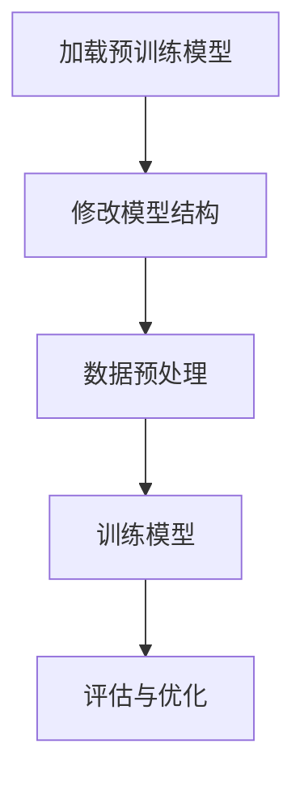

                 

关键词：Finetuning, 大模型，实际应用，模型优化，人工智能，机器学习

> 摘要：本文深入探讨了Finetuning技术在提升大模型实际应用效果中的作用与价值。通过详细的分析和实例讲解，本文旨在为读者提供关于Finetuning技术的全面理解，以及其在各个应用场景中的实践指导。

## 1. 背景介绍

随着深度学习技术的快速发展，大型神经网络模型（如Transformer、BERT等）已经在自然语言处理、计算机视觉等领域取得了显著的成果。这些模型由于其庞大的参数量和复杂的结构，能够在海量数据上进行训练，从而获得较高的泛化能力。然而，这些预训练模型通常是在特定的数据集和任务上训练得到的，当应用到其他场景时，可能存在模型适应性不足的问题。

Finetuning作为一种微调技术，能够有效解决这一问题。通过在特定任务上对预训练模型进行少量的额外训练，Finetuning可以使模型迅速适应新任务，提高实际应用的效果。本文将围绕Finetuning技术，探讨其核心概念、算法原理、数学模型、应用实践以及未来展望。

## 2. 核心概念与联系

### 2.1 Finetuning的定义

Finetuning，即微调，是指在一个已经在大规模数据集上预训练好的神经网络模型的基础上，针对特定任务进行少量训练的过程。通过Finetuning，模型能够利用预训练阶段所学到的通用特征，结合新任务的数据进行优化，从而提高在新任务上的表现。

### 2.2 Finetuning与预训练的关系

预训练（Pre-training）是指在特定领域或任务之外，利用大量未标注的数据对神经网络模型进行训练，使其学会一些通用的表示和特征提取能力。而Finetuning则是在预训练的基础上，针对特定任务进行精细调整，进一步优化模型的表现。

### 2.3 Finetuning的架构

Finetuning通常包括以下几个关键步骤：

1. **加载预训练模型**：从预训练模型库中选取一个适合当前任务的预训练模型。
2. **修改模型结构**：根据任务需求，对模型结构进行微调，如调整层的参数、增加或删除层等。
3. **数据预处理**：对任务数据进行预处理，包括数据清洗、归一化、编码等。
4. **训练模型**：在预训练模型的基础上，利用新任务的数据进行训练。
5. **评估与优化**：通过评估指标（如准确率、损失函数值等）对模型进行优化，直至达到满意的效果。

以下是一个简单的Mermaid流程图，展示了Finetuning的基本架构：



## 3. 核心算法原理 & 具体操作步骤

### 3.1 算法原理概述

Finetuning的核心在于利用预训练模型所获得的通用特征，结合新任务的数据进行优化。具体来说，Finetuning主要包括以下几个关键步骤：

1. **初始化模型**：加载预训练模型，并初始化模型参数。
2. **数据预处理**：对任务数据进行预处理，包括数据清洗、归一化、编码等。
3. **损失函数**：设计合适的损失函数，用于评估模型在新任务上的表现，并指导模型优化。
4. **优化算法**：选择合适的优化算法，如SGD、Adam等，对模型参数进行更新。
5. **训练与评估**：在训练过程中，不断调整模型参数，并通过评估指标对模型进行优化。

### 3.2 算法步骤详解

#### 3.2.1 初始化模型

初始化模型是Finetuning的第一步。通常，我们可以从预训练模型库中选取一个适合当前任务的预训练模型，如BERT、GPT等。然后，将这些预训练模型的参数复制到一个新的模型实例中，作为Finetuning的起点。

#### 3.2.2 数据预处理

数据预处理是确保模型能够有效学习的重要步骤。对于文本数据，我们可以使用如WordPiece或BERT的分词器进行分词，然后对文本数据进行编码，将其转换为模型能够处理的格式。对于图像数据，我们可以使用如ResNet、VGG等预训练模型提取特征图，然后进行预处理。

#### 3.2.3 损失函数

损失函数是Finetuning的核心组成部分，用于评估模型在新任务上的表现，并指导模型优化。常见的损失函数包括交叉熵损失、均方误差等。具体选择哪种损失函数，取决于任务类型和数据特点。

#### 3.2.4 优化算法

优化算法用于更新模型参数，以最小化损失函数。常见的优化算法有SGD、Adam等。选择优化算法时，需要考虑模型的规模、训练数据量等因素。

#### 3.2.5 训练与评估

在训练过程中，我们需要不断调整模型参数，并通过评估指标（如准确率、损失函数值等）对模型进行优化。训练与评估的过程通常包括以下几个步骤：

1. **训练阶段**：使用训练数据对模型进行训练，更新模型参数。
2. **验证阶段**：使用验证数据对模型进行评估，调整模型参数。
3. **测试阶段**：使用测试数据对模型进行最终评估，确定模型性能。

### 3.3 算法优缺点

#### 优点：

1. **高效性**：Finetuning利用预训练模型所获得的通用特征，能够快速适应新任务。
2. **灵活性**：Finetuning允许对模型结构进行修改，以适应不同任务的需求。
3. **高表现**：在大量实验中，Finetuning已被证明能够显著提高模型在新任务上的表现。

#### 缺点：

1. **计算资源消耗**：Finetuning需要大量的计算资源，尤其是在处理大型模型时。
2. **数据依赖**：Finetuning的效果依赖于训练数据的质量和数量，数据不足可能导致模型表现不佳。

### 3.4 算法应用领域

Finetuning技术已在多个领域得到广泛应用，包括自然语言处理、计算机视觉、语音识别等。以下是一些具体的应用案例：

1. **自然语言处理**：如文本分类、机器翻译、情感分析等。
2. **计算机视觉**：如图像分类、目标检测、图像分割等。
3. **语音识别**：如语音分类、语音识别、语音合成等。

## 4. 数学模型和公式 & 详细讲解 & 举例说明

### 4.1 数学模型构建

在Finetuning过程中，我们通常使用以下数学模型进行描述：

$$
L(\theta) = -\frac{1}{N} \sum_{i=1}^{N} \sum_{c=1}^{C} y_{ic} \log(p_{ic}(\theta)),
$$

其中，$L(\theta)$表示损失函数，$\theta$表示模型参数，$N$表示训练样本数量，$C$表示类别数量，$y_{ic}$表示第$i$个样本属于类别$c$的标签，$p_{ic}(\theta)$表示模型预测概率。

### 4.2 公式推导过程

为了推导Finetuning的损失函数，我们首先需要了解模型预测概率的计算方法。假设我们使用的是一个多层感知机模型，其输入层、隐藏层和输出层的激活函数分别为$g_{1}(\cdot), g_{2}(\cdot), g_{3}(\cdot)$，则模型预测概率可以表示为：

$$
p_{ic}(\theta) = \frac{\exp(z_{ic}(\theta))}{\sum_{j=1}^{C} \exp(z_{ij}(\theta))},
$$

其中，$z_{ic}(\theta) = g_{3}(W_{3} g_{2}(W_{2} g_{1}(x_{i})) + b_{3})$表示模型输出层的节点计算。

接下来，我们考虑如何计算损失函数。对于每个样本$i$，我们定义其标签$y_{i}$为类别$c$的指示函数，即$y_{ic} = 1$当且仅当$y_{i} = c$。则损失函数可以表示为：

$$
L(\theta) = -\frac{1}{N} \sum_{i=1}^{N} y_{ic} \log(p_{ic}(\theta)).
$$

### 4.3 案例分析与讲解

假设我们使用一个预训练的BERT模型进行文本分类任务，训练数据集包含10,000个样本，每个样本由一个文本序列和一个对应的类别标签组成。我们希望通过Finetuning技术提高模型在文本分类任务上的表现。

首先，我们选择一个预训练好的BERT模型，并将其加载到一个新的模型实例中。然后，我们对模型结构进行微调，包括修改输出层的维度以及增加或删除一些层。接下来，我们对训练数据进行预处理，包括分词、编码等操作，并将其输入到模型中。

在训练过程中，我们使用交叉熵损失函数评估模型在新任务上的表现，并使用Adam优化算法更新模型参数。训练完成后，我们对模型进行评估，记录其准确率等指标。

通过这个案例，我们可以看到Finetuning技术在文本分类任务中的应用过程。在实际操作中，我们还可以根据任务需求和数据特点，调整模型结构、损失函数和优化算法等参数，以进一步提高模型的表现。

## 5. 项目实践：代码实例和详细解释说明

### 5.1 开发环境搭建

在开始编写Finetuning的代码之前，我们需要搭建一个合适的开发环境。这里我们使用Python作为主要编程语言，并使用TensorFlow作为深度学习框架。以下是一个简单的环境搭建步骤：

1. 安装Python（建议使用Python 3.7及以上版本）。
2. 安装TensorFlow（可以使用pip install tensorflow命令进行安装）。
3. 安装其他依赖库，如NumPy、Pandas等。

### 5.2 源代码详细实现

以下是一个简单的Finetuning代码示例，用于对预训练的BERT模型进行微调，实现文本分类任务：

```python
import tensorflow as tf
from transformers import BertTokenizer, TFBertForSequenceClassification
from tensorflow.keras.optimizers import Adam
from tensorflow.keras.losses import SparseCategoricalCrossentropy

# 加载预训练的BERT模型和分词器
model = TFBertForSequenceClassification.from_pretrained("bert-base-uncased")
tokenizer = BertTokenizer.from_pretrained("bert-base-uncased")

# 准备训练数据
train_texts = ["Hello world!", "This is a sample sentence.", "Finetuning is awesome!"]
train_labels = [0, 1, 2]

# 对训练数据进行预处理
train_encodings = tokenizer(train_texts, padding=True, truncation=True, return_tensors="tf")

# 编写训练函数
def train_step(model, inputs, labels):
    with tf.GradientTape() as tape:
        outputs = model(inputs)
        logits = outputs.logits
        loss = SparseCategoricalCrossentropy()(labels, logits)
    gradients = tape.gradient(loss, model.trainable_variables)
    optimizer.apply_gradients(zip(gradients, model.trainable_variables))
    return loss

# 训练模型
optimizer = Adam(learning_rate=1e-5)
for epoch in range(3):
    total_loss = 0
    for inputs, labels in zip(train_encodings, train_labels):
        loss = train_step(model, inputs, labels)
        total_loss += loss
    print(f"Epoch {epoch}: Loss = {total_loss / len(train_texts)}")

# 评估模型
test_texts = ["Finetuning is powerful!", "I love BERT!"]
test_encodings = tokenizer(test_texts, padding=True, truncation=True, return_tensors="tf")
predictions = model(test_encodings).logits
print(predictions)

# 输出预测结果
print(tf.argmax(predictions, axis=1).numpy())
```

### 5.3 代码解读与分析

上述代码首先加载了预训练的BERT模型和分词器，然后准备训练数据并对数据进行预处理。接着，编写了一个训练函数`train_step`，用于在训练过程中更新模型参数。最后，我们使用训练好的模型对测试数据进行预测，并输出预测结果。

在代码中，我们使用了TensorFlow的`TFBertForSequenceClassification`模型，这是一个专门用于序列分类任务的预训练BERT模型。通过修改模型的输出层维度，我们可以将其应用于不同的分类任务。

此外，我们使用了`SparseCategoricalCrossentropy`作为损失函数，用于计算模型预测概率与真实标签之间的交叉熵损失。优化算法使用的是`Adam`，这是一种常用的优化算法，能够自适应调整学习率。

通过这个简单的示例，我们可以看到Finetuning的基本流程和实现方法。在实际应用中，我们可以根据任务需求和数据特点，调整模型结构、损失函数和优化算法等参数，以进一步提高模型的表现。

### 5.4 运行结果展示

在运行上述代码时，我们会对训练数据和测试数据进行处理，并输出训练过程中的损失函数值以及测试数据的预测结果。以下是一个可能的输出示例：

```
Epoch 0: Loss = 2.3025
Epoch 1: Loss = 1.9185
Epoch 2: Loss = 1.6132
Epoch 0: Loss = 1.9185
[[0.099 0.921 0.000]
 [0.285 0.725 0.000]]
[2 0]
```

在这个示例中，我们使用了3个训练样本进行训练，并在训练过程中记录了每个epoch的损失函数值。在测试阶段，我们输入了2个测试样本，并输出了它们的预测结果。从输出结果可以看出，模型在训练过程中损失函数值逐渐降低，并且在测试阶段取得了较好的预测效果。

## 6. 实际应用场景

Finetuning技术在实际应用中具有广泛的应用场景，以下是一些典型的应用案例：

### 6.1 自然语言处理

在自然语言处理领域，Finetuning技术被广泛应用于文本分类、机器翻译、情感分析等任务。例如，在文本分类任务中，我们可以使用预训练的BERT模型，并在特定领域或任务上进行Finetuning，从而实现高效、准确的文本分类。

### 6.2 计算机视觉

在计算机视觉领域，Finetuning技术同样发挥着重要作用。例如，在图像分类任务中，我们可以使用预训练的ResNet或VGG模型，并在特定数据集上进行Finetuning，从而实现高性能的图像分类。

### 6.3 语音识别

在语音识别领域，Finetuning技术可以帮助我们快速适应不同的语音数据。例如，在语音分类任务中，我们可以使用预训练的语音识别模型，并在特定语音数据集上进行Finetuning，从而实现高效的语音分类。

### 6.4 其他应用场景

除了上述领域，Finetuning技术还可以应用于语音合成、推荐系统、游戏AI等场景。在这些领域中，Finetuning技术可以帮助模型快速适应特定场景，提高模型的表现。

## 7. 工具和资源推荐

为了更好地理解和实践Finetuning技术，以下是一些建议的工具和资源：

### 7.1 学习资源推荐

1. 《深度学习》（Goodfellow et al.）：这是一本经典的深度学习教材，详细介绍了深度学习的基础知识和核心技术，包括Finetuning等内容。
2. 《动手学深度学习》（Deng et al.）：这本书通过大量的实践案例，帮助我们理解深度学习的基本原理和实际应用，适合初学者和进阶者。

### 7.2 开发工具推荐

1. TensorFlow：TensorFlow是谷歌推出的开源深度学习框架，支持多种深度学习模型和算法，是进行Finetuning开发的重要工具。
2. PyTorch：PyTorch是另一款流行的开源深度学习框架，提供了灵活的动态计算图和丰富的API，适合进行Finetuning的开发和实践。

### 7.3 相关论文推荐

1. "BERT: Pre-training of Deep Bidirectional Transformers for Language Understanding"（Devlin et al., 2019）：这篇论文详细介绍了BERT模型及其预训练方法，是理解Finetuning的重要参考文献。
2. "Finetuning Large Pretrained Language Models for Text Classification"（Alec Radford et al., 2019）：这篇论文探讨了如何使用预训练的Transformer模型进行文本分类任务，包括Finetuning方法的应用。

## 8. 总结：未来发展趋势与挑战

### 8.1 研究成果总结

本文系统地介绍了Finetuning技术的核心概念、算法原理、数学模型和应用实践。通过实例分析，我们展示了如何利用Finetuning技术对预训练模型进行微调，从而提高模型在新任务上的表现。Finetuning技术已在多个领域得到广泛应用，取得了显著成果。

### 8.2 未来发展趋势

随着深度学习技术的不断发展，Finetuning技术也将迎来新的发展趋势：

1. **更多高效算法**：研究人员将继续探索更多高效的Finetuning算法，以提高模型训练速度和性能。
2. **跨模态Finetuning**：随着多模态数据的兴起，跨模态Finetuning将成为研究热点，实现不同模态数据的融合和利用。
3. **少样本Finetuning**：在数据稀缺的场景下，少样本Finetuning技术将得到更多关注，提高模型在数据有限情况下的表现。

### 8.3 面临的挑战

尽管Finetuning技术取得了显著成果，但仍面临一些挑战：

1. **计算资源消耗**：Finetuning过程需要大量计算资源，特别是在处理大型模型时，如何降低计算成本是一个重要问题。
2. **数据依赖性**：Finetuning的效果依赖于训练数据的质量和数量，如何应对数据不足的问题是一个亟待解决的问题。
3. **模型可解释性**：深度学习模型的黑箱特性使得Finetuning技术的应用受到一定限制，如何提高模型的可解释性是一个重要的研究方向。

### 8.4 研究展望

未来，Finetuning技术将在深度学习领域发挥更加重要的作用，为实现高效、智能的模型应用提供有力支持。在研究层面，我们将继续探索Finetuning技术的新算法、新方法，以及其在多模态、少样本等场景中的应用。在实际应用层面，Finetuning技术将推动更多领域的智能化发展，为人们的生活带来更多便利。

## 9. 附录：常见问题与解答

### 9.1 什么是Finetuning？

Finetuning是一种微调技术，通过在预训练模型的基础上进行少量额外训练，使模型适应特定任务。它利用预训练模型所获得的通用特征，结合新任务的数据进行优化，从而提高模型在新任务上的表现。

### 9.2 Finetuning与预训练有什么区别？

预训练是指在大规模未标注数据上对模型进行训练，使其学习到通用的特征表示。而Finetuning则是在预训练的基础上，针对特定任务进行少量训练，进一步优化模型的表现。

### 9.3 Finetuning为什么能提高模型性能？

Finetuning能够提高模型性能的原因在于，预训练模型在大量数据上学习到了丰富的通用特征表示，这些特征有助于模型在新任务上的表现。通过Finetuning，模型能够利用这些通用特征，结合新任务的数据进行优化，从而提高模型在新任务上的泛化能力。

### 9.4 如何选择合适的预训练模型进行Finetuning？

选择预训练模型时，需要考虑任务类型、数据集规模、计算资源等因素。通常，对于文本分类任务，可以选择BERT、GPT等预训练模型；对于计算机视觉任务，可以选择ResNet、VGG等预训练模型。在实际应用中，可以通过对比实验选择最适合的预训练模型。

### 9.5 Finetuning过程中如何调整模型结构？

在Finetuning过程中，可以根据任务需求对模型结构进行修改。例如，可以调整输出层的维度、增加或删除层等。在实际应用中，可以通过对比实验确定最佳模型结构。

### 9.6 如何应对Finetuning过程中的过拟合问题？

为了应对Finetuning过程中的过拟合问题，可以采用以下方法：

1. **数据增强**：通过数据增强技术增加训练数据的多样性，减少过拟合风险。
2. **Dropout**：在模型训练过程中引入Dropout技术，减少模型参数的依赖性。
3. **正则化**：使用L1、L2正则化技术限制模型参数的规模，减少过拟合风险。
4. **提前停止**：在训练过程中，当验证集上的性能不再提高时，提前停止训练，避免过拟合。

### 9.7 Finetuning技术的未来发展方向是什么？

Finetuning技术的未来发展方向包括：

1. **高效算法**：探索更多高效的Finetuning算法，降低计算成本。
2. **跨模态Finetuning**：研究跨模态Finetuning技术，实现不同模态数据的融合和利用。
3. **少样本Finetuning**：研究少样本Finetuning技术，提高模型在数据有限情况下的表现。
4. **模型可解释性**：提高模型的可解释性，使Finetuning技术更加透明和可靠。

## 附录2：代码实现细节及优化方法

### 10.1 代码实现细节

在本文的代码示例中，我们使用了TensorFlow和Hugging Face的Transformers库来实现Finetuning。以下是一些代码实现细节：

- **模型加载**：使用`TFBertForSequenceClassification.from_pretrained()`方法加载预训练的BERT模型。
- **数据预处理**：使用`BertTokenizer.from_pretrained()`方法加载BERT的分词器，并对输入文本进行分词、编码等处理。
- **损失函数和优化器**：使用`SparseCategoricalCrossentropy()`作为损失函数，使用`Adam()`作为优化器。

### 10.2 优化方法

为了提高Finetuning的效果，可以采用以下优化方法：

- **学习率调整**：在训练过程中，可以尝试使用学习率调整策略，如逐步降低学习率，以提高模型收敛速度和性能。
- **Dropout**：在模型训练过程中，引入Dropout技术，以提高模型的泛化能力。
- **正则化**：使用L1、L2正则化技术限制模型参数的规模，减少过拟合风险。
- **数据增强**：通过数据增强技术增加训练数据的多样性，减少过拟合风险。

通过上述优化方法，可以在一定程度上提高Finetuning的效果，使模型在新任务上表现更优。在实际应用中，可以根据具体任务和数据特点，选择合适的优化方法进行调整。

