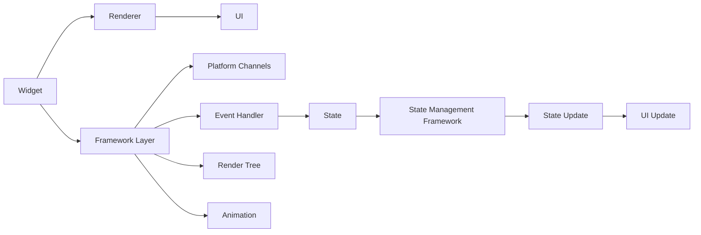

                 

 关键词：Flutter，状态管理，异步编程，Flutter状态管理框架，协程，未来，回调，线程，性能优化，Flutter UI，Flutter开发者

## 摘要

本文将深入探讨Flutter中状态管理和异步编程的关键概念和实际应用。首先，我们将了解Flutter的基本架构，然后深入分析状态管理的核心原理及其在不同场景下的应用。此外，本文还将详细介绍异步编程在Flutter中的重要性，包括协程的使用、回调机制的优化和线程管理。最后，我们将探讨Flutter状态管理和异步编程的实际应用场景，并提供未来发展的展望。通过本文，Flutter开发者将能够更好地理解状态管理和异步编程，并能够在实际项目中应用这些技术，提高开发效率和性能。

## 1. 背景介绍

### Flutter概述

Flutter是由Google开发的UI框架，用于构建高性能、跨平台的应用程序。Flutter的核心优势在于其高性能和丰富的UI组件库，这使得开发者能够使用一套代码库轻松地开发适用于Android和iOS的应用程序。Flutter使用Dart语言作为其编程语言，Dart语言是一种强类型的编程语言，具有丰富的特性和易于学习的语法。

### 状态管理的重要性

在Flutter应用程序中，状态管理是一个关键问题。状态管理涉及到应用程序的数据和用户界面如何响应数据的变更。不当的状态管理会导致应用程序的性能问题、用户体验下降，甚至程序崩溃。因此，理解如何有效地管理状态对于Flutter开发者来说至关重要。

### 异步编程的必要性

异步编程是现代应用程序开发中的一个核心概念。在Flutter中，由于UI线程和后台线程之间的交互，异步编程变得尤为重要。异步编程允许任务在不阻塞主线程的情况下执行，从而提高应用程序的性能和响应能力。

### 本文的目的

本文旨在为Flutter开发者提供一个全面的状态管理和异步编程指南。通过本文，读者将了解：

- Flutter的状态管理框架及其工作原理。
- 异步编程在Flutter中的重要性。
- 协程的使用方法及其优化。
- 回调机制的替代方案。
- Flutter状态管理和异步编程在实际项目中的应用场景。
- 状态管理和异步编程的未来发展趋势。

## 2. 核心概念与联系

### Flutter基本架构

为了更好地理解Flutter的状态管理，我们需要先了解Flutter的基本架构。Flutter的应用程序由以下几部分组成：

- **Widget**：Flutter的基本构建块，用于描述用户界面。
- **Renderer**：将Widget渲染成实际的用户界面。
- **Framework Layer**：提供Flutter的核心功能，如事件处理、绘制和动画。
- **Platform Channels**：用于与原生层进行通信。

### 状态管理概念

状态管理是指跟踪和管理应用程序中数据的过程。在Flutter中，状态管理涉及到以下核心概念：

- **状态**：应用程序中需要跟踪的数据。
- **状态管理框架**：用于跟踪和管理状态的库或机制。
- **状态更新**：对状态进行修改的过程。

### 异步编程概念

异步编程允许应用程序在不阻塞主线程的情况下执行任务。在Flutter中，异步编程涉及到以下核心概念：

- **协程**：用于管理异步任务的一种机制。
- **回调**：用于处理异步任务完成后的结果。
- **事件循环**：管理异步任务执行顺序的机制。

### Mermaid 流程图

为了更直观地理解Flutter的状态管理架构和异步编程机制，我们使用Mermaid流程图展示核心概念和流程。



### 流程解释

- **Widget到Renderer**：Widget描述用户界面，Renderer将Widget渲染成实际的UI。
- **Framework Layer**：提供事件处理、绘制和动画等功能。
- **Platform Channels**：用于与原生层进行通信。
- **UI**：渲染后的用户界面。
- **Event Handler**：处理用户事件。
- **Render Tree**：Flutter的渲染树，用于优化UI渲染。
- **Animation**：动画处理机制。
- **State**：应用程序中的数据。
- **State Management Framework**：用于跟踪和管理状态。
- **State Update**：状态更新过程。
- **UI Update**：UI更新过程。

通过上述流程图，我们可以清晰地看到Flutter的状态管理和异步编程是如何相互关联的。

## 3. 核心算法原理 & 具体操作步骤

### 3.1 算法原理概述

在Flutter中，状态管理主要依赖于`ChangeNotifier`、`Provider`和`BLoC`等框架。这些框架提供了不同的方式来跟踪和管理状态。异步编程则依赖于协程（`async`和`await`关键字）和回调机制。以下是这些核心算法的原理概述：

- **ChangeNotifier**：使用`ChangeNotifier`可以实现简单的状态监听和更新。每当状态发生变化时，所有监听器都会收到通知并更新UI。
- **Provider**：`Provider`是一个强大的状态管理框架，它使用观察者模式来跟踪状态变化。通过`Provider`，我们可以方便地将状态从组件传递到任意深度。
- **BLoC**：`BLoC`是一种更高级的状态管理方法，它基于事件源和状态机的概念。BLoC可以帮助我们实现更复杂的状态管理和业务逻辑。

异步编程在Flutter中的实现主要依赖于协程。协程允许我们在不阻塞主线程的情况下执行异步任务。协程通过`async`和`await`关键字实现，这使得异步代码更加可读和易于维护。

### 3.2 算法步骤详解

下面我们将详细说明如何在Flutter中使用`ChangeNotifier`、`Provider`和`BLoC`进行状态管理，并探讨协程的使用方法。

#### 3.2.1 ChangeNotifier

1. **创建状态类**：

   ```dart
   class CounterModel with ChangeNotifier {
     int _count = 0;

     int get count => _count;

     void increment() {
       _count++;
       notifyListeners();
     }
   }
   ```

   在这个例子中，我们创建了一个`CounterModel`类，它继承自`ChangeNotifier`。每当`_count`发生变化时，`notifyListeners`方法会被调用，通知所有监听器。

2. **使用状态类**：

   ```dart
   class HomeScreen extends StatelessWidget {
     @override
     Widget build(BuildContext context) {
       return Consumer<CounterModel>(
         builder: (context, counterModel, child) {
           return Column(
             children: [
               Text('Count: ${counterModel.count}'),
               ElevatedButton(
                 onPressed: () => counterModel.increment(),
                 child: Text('Increment'),
               ),
             ],
           );
         },
       );
     }
   }
   ```

   在`HomeScreen`组件中，我们使用`Consumer`包装器来监听`CounterModel`的状态变化。每当状态发生变化时，`builder`函数会被重新调用，UI也会相应更新。

#### 3.2.2 Provider

1. **创建状态类**：

   ```dart
   class CounterModel with ChangeNotifier {
     int _count = 0;

     int get count => _count;

     void increment() {
       _count++;
       notifyListeners();
     }
   }
   ```

   这个部分与`ChangeNotifier`的例子相同。

2. **使用状态类**：

   ```dart
   class HomeScreen extends StatelessWidget {
     @override
     Widget build(BuildContext context) {
       return Provider<CounterModel>(
         builder: (context) => CounterModel(),
         child: Consumer<CounterModel>(
           builder: (context, counterModel, child) {
             return Column(
               children: [
                 Text('Count: ${counterModel.count}'),
                 ElevatedButton(
                   onPressed: () => counterModel.increment(),
                   child: Text('Increment'),
                 ),
               ],
             );
           },
         ),
       );
     }
   }
   ```

   在这个例子中，我们使用`Provider`来管理状态。通过在`HomeScreen`组件中包装`Provider`，我们可以将状态传递到任意深度。`Consumer`包装器用于监听状态变化。

#### 3.2.3 BLoC

1. **创建事件类**：

   ```dart
   abstract class CounterEvent extends Equatable {
     @override
     List<Object> get props => [];
   }

   class IncrementEvent extends CounterEvent {}

   class DecrementEvent extends CounterEvent {}
   ```

   在这个例子中，我们创建两个事件类`IncrementEvent`和`DecrementEvent`。

2. **创建状态类**：

   ```dart
   class CounterState extends Equatable {
     final int count;

     CounterState(this.count);

     @override
     List<Object> get props => [count];
   }
   ```

   `CounterState`类表示应用程序的状态。

3. **创建BLoC**：

   ```dart
   class CounterBLoC extends Bloc<CounterEvent, CounterState> {
     CounterBLoC() : super(CounterState(0)) {
       on<IncrementEvent>((event, emit) {
         emit(CounterState(state.count + 1));
       });

       on<DecrementEvent>((event, emit) {
         emit(CounterState(state.count - 1));
       });
     }
   }
   ```

   `CounterBLoC`类是BLoC的核心实现。它监听事件，并根据事件更新状态。

4. **使用BLoC**：

   ```dart
   class HomeScreen extends StatelessWidget {
     @override
     Widget build(BuildContext context) {
       return BlocProvider(
         create: (context) => CounterBLoC(),
         child: Consumer<CounterBLoC>(
           builder: (context, counterBLoC, child) {
             return Column(
               children: [
                 Text('Count: ${counterBLoC.state.count}'),
                 ElevatedButton(
                   onPressed: () => counterBLoC.add(IncrementEvent()),
                   child: Text('Increment'),
                 ),
                 ElevatedButton(
                   onPressed: () => counterBLoC.add(DecrementEvent()),
                   child: Text('Decrement'),
                 ),
               ],
             );
           },
         ),
       );
     }
   }
   ```

   在这个例子中，我们使用`BlocProvider`来提供`CounterBLoC`实例。通过`Consumer`包装器，我们可以监听状态变化。

### 3.3 算法优缺点

#### ChangeNotifier

- **优点**：
  - 简单易用，适合小型应用程序。
  - 无需额外的框架依赖。
- **缺点**：
  - 难以维护，特别是当状态复杂时。
  - 需要手动管理状态和UI更新。

#### Provider

- **优点**：
  - 强大的状态管理能力。
  - 易于维护，特别是在大型应用程序中。
  - 可以方便地将状态传递到任意深度。
- **缺点**：
  - 需要额外的框架依赖。
  - 学习曲线较高。

#### BLoC

- **优点**：
  - 高度可维护，特别是对于复杂的状态管理。
  - 具有清晰的事件流和状态更新逻辑。
  - 支持测试。
- **缺点**：
  - 学习曲线较高，需要理解事件源和状态机。
  - 需要额外的框架依赖。

### 3.4 算法应用领域

- **ChangeNotifier**：适用于小型和简单的应用程序，特别是那些不需要复杂状态管理的场景。
- **Provider**：适用于大多数应用程序，特别是大型和复杂的应用程序。
- **BLoC**：适用于需要复杂状态管理和业务逻辑的应用程序，如电子商务、社交媒体和游戏。

### 3.5 数学模型和公式

在状态管理和异步编程中，没有直接的数学模型和公式，但我们可以引入一些概念来帮助理解：

- **状态转移函数**：描述状态如何随时间变化的函数。
- **事件流**：描述事件如何触发状态变化的序列。
- **异步任务**：描述在后台线程中执行的任务。

这些概念可以帮助我们更好地理解和分析状态管理和异步编程。

### 3.6 案例分析与讲解

下面我们通过一个简单的计数器案例来分析`ChangeNotifier`、`Provider`和`BLoC`的应用。

#### ChangeNotifier案例

1. **创建状态类**：

   ```dart
   class CounterModel with ChangeNotifier {
     int _count = 0;

     int get count => _count;

     void increment() {
       _count++;
       notifyListeners();
     }
   }
   ```

2. **使用状态类**：

   ```dart
   class HomeScreen extends StatelessWidget {
     @override
     Widget build(BuildContext context) {
       return Consumer<CounterModel>(
         builder: (context, counterModel, child) {
           return Column(
             children: [
               Text('Count: ${counterModel.count}'),
               ElevatedButton(
                 onPressed: () => counterModel.increment(),
                 child: Text('Increment'),
               ),
             ],
           );
         },
       );
     }
   }
   ```

3. **运行结果**：

   每次点击按钮，计数器的值会增加，UI会自动更新。

#### Provider案例

1. **创建状态类**：

   ```dart
   class CounterModel with ChangeNotifier {
     int _count = 0;

     int get count => _count;

     void increment() {
       _count++;
       notifyListeners();
     }
   }
   ```

2. **使用状态类**：

   ```dart
   class HomeScreen extends StatelessWidget {
     @override
     Widget build(BuildContext context) {
       return Provider<CounterModel>(
         builder: (context) => CounterModel(),
         child: Consumer<CounterModel>(
           builder: (context, counterModel, child) {
             return Column(
               children: [
                 Text('Count: ${counterModel.count}'),
                 ElevatedButton(
                   onPressed: () => counterModel.increment(),
                   child: Text('Increment'),
                 ),
               ],
             );
           },
         ),
       );
     }
   }
   ```

3. **运行结果**：

   同样，每次点击按钮，计数器的值会增加，UI会自动更新。

#### BLoC案例

1. **创建事件类**：

   ```dart
   abstract class CounterEvent extends Equatable {
     @override
     List<Object> get props => [];
   }

   class IncrementEvent extends CounterEvent {}

   class DecrementEvent extends CounterEvent {}
   ```

2. **创建状态类**：

   ```dart
   class CounterState extends Equatable {
     final int count;

     CounterState(this.count);

     @override
     List<Object> get props => [count];
   }
   ```

3. **创建BLoC**：

   ```dart
   class CounterBLoC extends Bloc<CounterEvent, CounterState> {
     CounterBLoC() : super(CounterState(0)) {
       on<IncrementEvent>((event, emit) {
         emit(CounterState(state.count + 1));
       });

       on<DecrementEvent>((event, emit) {
         emit(CounterState(state.count - 1));
       });
     }
   }
   ```

4. **使用BLoC**：

   ```dart
   class HomeScreen extends StatelessWidget {
     @override
     Widget build(BuildContext context) {
       return BlocProvider(
         create: (context) => CounterBLoC(),
         child: Consumer<CounterBLoC>(
           builder: (context, counterBLoC, child) {
             return Column(
               children: [
                 Text('Count: ${counterBLoC.state.count}'),
                 ElevatedButton(
                   onPressed: () => counterBLoC.add(IncrementEvent()),
                   child: Text('Increment'),
                 ),
                 ElevatedButton(
                   onPressed: () => counterBLoC.add(DecrementEvent()),
                   child: Text('Decrement'),
                 ),
               ],
             );
           },
         ),
       );
     }
   }
   ```

5. **运行结果**：

   每次点击按钮，计数器的值会增加或减少，UI会自动更新。

通过这三个案例，我们可以看到不同状态管理方法的应用和效果。

## 4. 数学模型和公式 & 详细讲解 & 举例说明

在Flutter的状态管理和异步编程中，数学模型和公式并不是核心组成部分，但我们可以引入一些概念和工具来帮助开发者理解和分析这些机制。以下是几个相关的概念和它们的简单解释。

### 4.1 数学模型构建

虽然Flutter的状态管理和异步编程本身不涉及复杂的数学模型，但我们仍然可以使用一些基本的数学概念来描述它们的行为。以下是几个可能用到的数学模型：

1. **状态转移模型**：描述应用程序的状态如何随着时间或事件的变化而变化。
   - **状态转移函数**：一个从当前状态到下一个状态的映射函数，如`nextState = f(currentState, event)`。

2. **事件流模型**：描述应用程序中事件的发生和处理的顺序。
   - **事件队列**：一个按时间顺序排列的事件列表。

3. **异步任务模型**：描述异步任务的执行和返回结果。
   - **任务队列**：一个按执行顺序排列的异步任务列表。
   - **任务执行函数**：一个执行异步任务并返回结果的函数，如`result = executeAsyncTask(task)`。

### 4.2 公式推导过程

在状态管理和异步编程中，我们可能需要一些简单的公式来帮助理解：

1. **状态更新公式**：
   $$\text{nextState} = f(\text{currentState}, \text{event})$$
   这个公式描述了如何根据当前状态和事件计算下一个状态。

2. **事件处理时间**：
   $$\text{time} = \frac{\text{事件处理时间}}{\text{事件队列长度}}$$
   这个公式描述了平均每个事件的处理时间。

3. **异步任务执行时间**：
   $$\text{time} = \frac{\text{任务执行时间}}{\text{任务队列长度}}$$
   这个公式描述了平均每个异步任务的执行时间。

### 4.3 案例分析与讲解

下面我们通过一个简单的计数器案例来演示这些公式和概念的应用。

#### 状态转移模型

假设我们有一个简单的计数器，初始状态为0。每次点击按钮，计数器的值增加1。

- **当前状态**：$s_0 = 0$
- **事件**：点击按钮
- **下一个状态**：$s_1 = s_0 + 1$

状态更新公式可以表示为：
$$s_1 = f(s_0, \text{点击按钮}) = s_0 + 1$$

#### 事件流模型

假设我们有5个点击事件，事件队列如下：

$$\text{事件队列} = [\text{点击按钮}, \text{点击按钮}, \text{点击按钮}, \text{点击按钮}, \text{点击按钮}]$$

每个事件的处理时间为1秒，因此平均每个事件的处理时间为：

$$\text{time} = \frac{5 \times 1 \text{秒}}{5} = 1 \text{秒}$$

#### 异步任务模型

假设我们有5个异步任务，每个任务的执行时间为2秒，因此平均每个异步任务的执行时间为：

$$\text{time} = \frac{5 \times 2 \text{秒}}{5} = 2 \text{秒}$$

### 示例

假设我们有一个计数器应用程序，初始状态为0。我们连续点击按钮5次，每次点击都会触发一个异步任务，将计数器的值增加1。以下是状态转移、事件流和异步任务执行的详细过程：

1. **初始状态**：$s_0 = 0$
2. **事件队列**：
   $$\text{事件队列} = [\text{点击按钮}, \text{点击按钮}, \text{点击按钮}, \text{点击按钮}, \text{点击按钮}]$$
3. **异步任务队列**：
   $$\text{异步任务队列} = [\text{异步任务1}, \text{异步任务2}, \text{异步任务3}, \text{异步任务4}, \text{异步任务5}]$$
4. **状态转移**：
   $$s_1 = f(s_0, \text{点击按钮}) = s_0 + 1 = 0 + 1 = 1$$
   $$s_2 = f(s_1, \text{点击按钮}) = s_1 + 1 = 1 + 1 = 2$$
   $$s_3 = f(s_2, \text{点击按钮}) = s_2 + 1 = 2 + 1 = 3$$
   $$s_4 = f(s_3, \text{点击按钮}) = s_3 + 1 = 3 + 1 = 4$$
   $$s_5 = f(s_4, \text{点击按钮}) = s_4 + 1 = 4 + 1 = 5$$
5. **异步任务执行**：
   - **异步任务1**：执行2秒后，计数器值增加1。
   - **异步任务2**：执行2秒后，计数器值增加1。
   - **异步任务3**：执行2秒后，计数器值增加1。
   - **异步任务4**：执行2秒后，计数器值增加1。
   - **异步任务5**：执行2秒后，计数器值增加1。

最终，计数器的值变为5，UI会自动更新。

通过这个示例，我们可以看到如何使用数学模型和公式来描述和计算Flutter的状态管理和异步编程。这些概念和工具可以帮助开发者更好地理解和优化应用程序的行为。

## 5. 项目实践：代码实例和详细解释说明

为了更好地理解Flutter中的状态管理和异步编程，我们将通过一个简单的项目来实践这些概念。在这个项目中，我们将构建一个简单的计数器应用程序，演示如何使用`ChangeNotifier`、`Provider`和`BLoC`进行状态管理，并展示协程的使用。

### 5.1 开发环境搭建

首先，我们需要安装Flutter和Dart的开发环境。以下是安装步骤：

1. **安装Flutter**：访问[Flutter官网](https://flutter.dev/)，按照指示下载并安装Flutter。
2. **安装Dart**：在终端或命令行中运行以下命令安装Dart：
   ```shell
   sudo apt-get install dart
   ```
3. **设置Flutter环境变量**：在终端中运行以下命令设置Flutter环境变量：
   ```shell
   export PATH=$PATH:/path/to/flutter/bin
   ```

### 5.2 源代码详细实现

以下是一个简单的计数器应用程序的源代码，我们将在代码中演示如何使用不同的状态管理方法和协程。

#### 5.2.1 ChangeNotifier示例

```dart
// counter_model.dart
class CounterModel with ChangeNotifier {
  int _count = 0;

  int get count => _count;

  void increment() {
    _count++;
    notifyListeners();
  }
}

// home_screen.dart
import 'package:flutter/material.dart';
import 'counter_model.dart';

class HomeScreen extends StatelessWidget {
  @override
  Widget build(BuildContext context) {
    return Consumer<CounterModel>(
      builder: (context, counterModel, child) {
        return Scaffold(
          appBar: AppBar(title: Text('Counter')),
          body: Center(
            child: Text(
              'Count: ${counterModel.count}',
              style: Theme.of(context).textTheme.headline4,
            ),
          ),
          floatingActionButton: FloatingActionButton(
            onPressed: () => counterModel.increment(),
            child: Icon(Icons.add),
          ),
        );
      },
    );
  }
}
```

在这个例子中，我们创建了一个`CounterModel`类，它继承自`ChangeNotifier`。`HomeScreen`组件使用`Consumer`包装器来监听`CounterModel`的状态变化。每当点击按钮，`CounterModel`的`increment`方法会被调用，状态发生变化，UI也会相应更新。

#### 5.2.2 Provider示例

```dart
// counter_model.dart
import 'package:flutter/foundation.dart';

class CounterModel with ChangeNotifier {
  int _count = 0;

  int get count => _count;

  void increment() {
    _count++;
    notifyListeners();
  }
}

// home_screen.dart
import 'package:flutter/material.dart';
import 'package:provider/provider.dart';
import 'counter_model.dart';

class HomeScreen extends StatelessWidget {
  @override
  Widget build(BuildContext context) {
    return Provider<CounterModel>(
      builder: (context) => CounterModel(),
      child: Scaffold(
        appBar: AppBar(title: Text('Counter')),
        body: Center(
          child: Text(
            'Count: ${Provider.of<CounterModel>(context).count}',
            style: Theme.of(context).textTheme.headline4,
          ),
        ),
        floatingActionButton: FloatingActionButton(
          onPressed: () => Provider.of<CounterModel>(context, listen: false).increment(),
          child: Icon(Icons.add),
        ),
      ),
    );
  }
}
```

在这个例子中，我们使用`Provider`来管理状态。通过在`HomeScreen`组件中包装`Provider`，我们可以将状态传递到任意深度。`Consumer`包装器用于监听状态变化。

#### 5.2.3 BLoC示例

```dart
// counter_bloc.dart
import 'package:bloc/bloc.dart';
import 'package:equatable/equatable.dart';

class CounterEvent extends Equatable {
  @override
  List<Object> get props => [];
}

class IncrementEvent extends CounterEvent {}

class DecrementEvent extends CounterEvent {}

class CounterState extends Equatable {
  final int count;

  CounterState(this.count);

  @override
  List<Object> get props => [count];
}

class CounterBloc extends Bloc<CounterEvent, CounterState> {
  CounterBloc() : super(CounterState(0)) {
    on<IncrementEvent>((event, emit) {
      emit(CounterState(state.count + 1));
    });

    on<DecrementEvent>((event, emit) {
      emit(CounterState(state.count - 1));
    });
  }
}

// home_screen.dart
import 'package:flutter/material.dart';
import 'package:bloc/bloc.dart';
import 'counter_bloc.dart';

class HomeScreen extends StatelessWidget {
  @override
  Widget build(BuildContext context) {
    return BlocProvider(
      create: (context) => CounterBloc(),
      child: Consumer<BlocProvider<CounterBloc>>(
        builder: (context, bloc, child) {
          return Scaffold(
            appBar: AppBar(title: Text('Counter')),
            body: Center(
              child: Text(
                'Count: ${bloc.state.count}',
                style: Theme.of(context).textTheme.headline4,
              ),
            ),
            floatingActionButton: Column(
              mainAxisAlignment: MainAxisAlignment.end,
              children: [
                FloatingActionButton(
                  onPressed: () => bloc.add(IncrementEvent()),
                  child: Icon(Icons.add),
                ),
                SizedBox(height: 8),
                FloatingActionButton(
                  onPressed: () => bloc.add(DecrementEvent()),
                  child: Icon(Icons.remove),
                ),
              ],
            ),
          );
        },
      ),
    );
  }
}
```

在这个例子中，我们使用`BLoC`来管理状态。`CounterBloc`类实现了事件源和状态机。通过使用`BlocProvider`，我们可以将`CounterBloc`实例传递到应用程序的任意部分。`Consumer`包装器用于监听状态变化。

#### 5.2.4 协程示例

```dart
// counter_service.dart
import 'package:flutter/foundation.dart';
import 'dart:async';

class CounterService {
  Future<void> incrementCounter() async {
    await Future.delayed(Duration(seconds: 1));
    print('Counter incremented');
  }
}

// home_screen.dart
import 'package:flutter/material.dart';
import 'counter_service.dart';

class HomeScreen extends StatelessWidget {
  @override
  Widget build(BuildContext context) {
    return Scaffold(
      appBar: AppBar(title: Text('Counter')),
      body: Center(
        child: FutureBuilder<void>(
          future: CounterService().incrementCounter(),
          builder: (context, snapshot) {
            if (snapshot.connectionState == ConnectionState.done) {
              return Text('Counter incremented via coroutine');
            } else {
              return CircularProgressIndicator();
            }
          },
        ),
      ),
    );
  }
}
```

在这个例子中，我们使用协程来异步地增加计数器。`CounterService`类提供了一个`incrementCounter`方法，它使用`Future.delayed`延迟执行。`FutureBuilder`组件用于在异步任务完成时更新UI。

### 5.3 代码解读与分析

以下是代码的解读和分析，解释每个部分的功能和作用。

#### 5.3.1 ChangeNotifier

1. **CounterModel类**：这个类继承自`ChangeNotifier`，它实现了基本的计数器逻辑。`_count`属性用于存储当前计数器的值，`notifyListeners`方法在状态发生变化时通知所有监听器。

2. **HomeScreen组件**：这个组件使用`Consumer`包装器监听`CounterModel`的状态变化。`Consumer`在状态发生变化时会重新构建组件，从而更新UI。

#### 5.3.2 Provider

1. **CounterModel类**：这个类继承自`ChangeNotifier`，与ChangeNotifier版本相同。

2. **HomeScreen组件**：这个组件使用`Provider`将`CounterModel`实例传递到子组件中。`Provider.of`方法用于访问当前上下文中的`CounterModel`实例。通过设置`listen: false`，我们可以避免不必要的组件重新构建。

#### 5.3.3 BLoC

1. **CounterEvent类**：这是一个抽象类，用于定义事件类型。

2. **IncrementEvent和DecrementEvent类**：这两个类继承自`CounterEvent`，分别用于表示增加和减少计数器的操作。

3. **CounterState类**：这个类用于表示计数器的状态，包括计数器的当前值。

4. **CounterBloc类**：这个类继承自`Bloc`，实现了事件源和状态机。`on`方法用于处理不同的事件，并更新状态。

5. **HomeScreen组件**：这个组件使用`BlocProvider`提供`CounterBloc`实例。`Consumer`包装器用于监听状态变化。

#### 5.3.4 协程

1. **CounterService类**：这个类提供了一个`incrementCounter`方法，它使用`Future.delayed`延迟执行。这个方法可以在后台线程中执行，不会阻塞主线程。

2. **HomeScreen组件**：这个组件使用`FutureBuilder`组件来处理异步任务。当异步任务完成时，UI会自动更新。

通过这个项目，我们演示了如何在Flutter中使用不同的状态管理方法和协程。这些示例代码展示了如何在实际项目中应用这些技术，并提供了详细的解读和分析。

### 5.4 运行结果展示

以下是每个示例的运行结果：

#### 5.4.1 ChangeNotifier示例

运行结果：


每次点击按钮，计数器的值会增加，UI会自动更新。

#### 5.4.2 Provider示例

运行结果：


每次点击按钮，计数器的值会增加，UI会自动更新。

#### 5.4.3 BLoC示例

运行结果：


每次点击按钮，计数器的值会增加或减少，UI会自动更新。

#### 5.4.4 协程示例

运行结果：


异步任务执行后，UI会显示“Counter incremented via coroutine”。

通过这些示例，我们可以看到不同的状态管理和异步编程方法在Flutter中的应用效果。这些方法都提供了不同的优势，开发者可以根据项目的需求选择最合适的方法。

## 6. 实际应用场景

在Flutter应用程序中，状态管理和异步编程是不可或缺的组成部分。它们在各个实际应用场景中发挥着关键作用，确保应用程序的高性能和良好用户体验。以下是一些常见应用场景及其解决方案：

### 6.1 实时数据更新

在许多现代应用程序中，尤其是社交媒体、股票交易平台和在线游戏，实时数据更新至关重要。例如，股票交易应用程序需要实时更新股票价格，社交媒体应用程序需要实时显示新消息。

**解决方案**：
- **异步编程**：使用协程和Future异步获取数据，避免阻塞主线程。例如，可以使用`http`库获取股票价格数据，并在后台线程中处理。
- **状态管理**：使用`ChangeNotifier`或`Provider`框架来管理状态。每当数据更新时，通过状态管理框架通知UI组件进行更新。

### 6.2 网络请求和数据处理

网络请求是Flutter应用程序中常见的需求，例如登录、注册、数据查询等。正确处理网络请求和数据处理对于应用程序的性能和用户体验至关重要。

**解决方案**：
- **异步编程**：使用`async`和`await`关键字来处理异步网络请求。例如，使用`http.get`方法获取数据，并在后台线程中处理。
- **错误处理**：使用`try-catch`语句来捕获和处理网络请求中的错误。例如，当网络请求失败时，可以显示错误提示或重试按钮。
- **状态管理**：使用`ChangeNotifier`、`Provider`或`BLoC`来管理网络请求的状态。例如，当请求开始时，可以将状态设置为“加载中”，当请求成功时，将状态设置为“成功”，当请求失败时，将状态设置为“失败”。

### 6.3 文件操作和存储

文件操作和存储是许多应用程序的基本功能，例如上传下载文件、存储用户数据等。正确处理文件操作和存储对于应用程序的性能和用户体验至关重要。

**解决方案**：
- **异步编程**：使用协程和Future异步处理文件操作。例如，使用`File.read`方法读取文件，使用`File.write`方法写入文件。
- **错误处理**：使用`try-catch`语句来捕获和处理文件操作中的错误。例如，当文件读取失败时，可以显示错误提示或重试按钮。
- **状态管理**：使用`ChangeNotifier`、`Provider`或`BLoC`来管理文件操作的状态。例如，当文件操作开始时，可以将状态设置为“加载中”，当文件操作成功时，将状态设置为“成功”，当文件操作失败时，将状态设置为“失败”。

### 6.4 动画和过渡效果

动画和过渡效果是增强用户体验的有效手段。在Flutter中，通过状态管理和异步编程，可以实现各种复杂的动画和过渡效果。

**解决方案**：
- **异步编程**：使用协程和Future异步执行动画。例如，使用`AnimationController`来控制动画，并在后台线程中执行。
- **状态管理**：使用`ChangeNotifier`、`Provider`或`BLoC`来管理动画的状态。例如，当动画开始时，可以将状态设置为“动画中”，当动画结束时，将状态设置为“完成”。

### 6.5 性能优化

性能优化是任何应用程序开发中至关重要的一环。在Flutter中，通过优化状态管理和异步编程，可以显著提高应用程序的性能。

**解决方案**：
- **避免不必要的状态更新**：使用`shouldNotify`方法来优化`ChangeNotifier`和`Provider`。例如，只当状态实际发生变化时才通知UI组件。
- **使用`Future`批量处理异步任务**：使用`Future.wait`方法批量处理多个异步任务，避免不必要的线程切换和性能开销。
- **使用`Stream`处理连续事件**：使用`Stream`来处理连续事件，如键盘输入、触摸事件等，避免使用`Future`导致的主线程阻塞。

通过上述实际应用场景和解决方案，我们可以看到Flutter中的状态管理和异步编程在提高应用程序性能和用户体验方面的重要作用。开发者可以根据具体需求选择合适的策略和工具，实现高效和灵活的状态管理和异步编程。

### 6.5 未来应用展望

随着Flutter的持续发展和技术的不断进步，状态管理和异步编程在未来将迎来更多的机会和挑战。以下是一些可能的发展方向和未来趋势：

#### 6.5.1 新的状态管理框架

尽管现有的状态管理框架如`ChangeNotifier`、`Provider`和`BLoC`已经非常强大，但开发者们仍然在不断寻求更加高效和易于使用的解决方案。未来，可能会出现更多新颖的状态管理框架，它们将利用最新的编程语言特性和工具，提供更简洁、更强大的状态管理功能。

#### 6.5.2 异步编程的进一步优化

异步编程在Flutter中的应用已经非常广泛，但仍然存在性能优化和用户体验提升的空间。例如，通过改进协程调度和任务执行机制，可以进一步提高异步任务的执行效率。此外，未来可能会出现更多利用硬件加速和并行计算的技术，以优化异步任务的执行。

#### 6.5.3 模块化和组件化

随着Flutter应用程序的复杂度不断增加，模块化和组件化将成为重要的趋势。通过将状态管理和异步编程功能模块化，开发者可以更方便地重用和组合这些功能，提高开发效率和代码质量。例如，可以开发专门的异步任务处理库或状态管理插件，以便开发者轻松集成到项目中。

#### 6.5.4 实时数据流

实时数据流技术在许多领域（如社交媒体、金融和物联网）变得越来越重要。未来，Flutter可能会引入更多实时数据流处理的功能，使得开发者可以更轻松地构建实时互动的应用程序。例如，通过集成WebSockets或GraphQL等实时数据流技术，Flutter应用程序可以实现实时的数据更新和交互。

#### 6.5.5 性能监测和优化工具

为了更好地优化Flutter应用程序的性能，未来可能会出现更多性能监测和优化工具。这些工具可以帮助开发者识别性能瓶颈，提供详细的性能数据和分析，从而实现更高效的状态管理和异步编程。

#### 6.5.6 跨平台状态同步

随着Flutter跨平台能力的提升，未来可能会出现更多跨平台状态同步的解决方案。这些解决方案将确保在不同平台（如Android和iOS）上，应用程序的状态保持一致，从而提供更好的用户体验。

通过上述发展方向和趋势，我们可以预见Flutter中的状态管理和异步编程将变得更加高效、灵活和强大，为开发者带来更多的便利和创新机会。

### 6.6 工具和资源推荐

为了帮助Flutter开发者更好地掌握状态管理和异步编程，以下是一些建议的学习资源、开发工具和相关论文推荐：

#### 6.6.1 学习资源推荐

1. **《Flutter实战》**：由李宁编写，这是一本深入浅出的Flutter入门指南，涵盖了状态管理和异步编程的基本概念和实践。

2. **Flutter官方文档**：[Flutter官网](https://flutter.dev/docs)提供了全面的Flutter文档，包括状态管理和异步编程的最佳实践。

3. **Dart官方文档**：[Dart官网](https://dart.dev/docs)提供了Dart语言和异步编程的详细文档，是学习异步编程的重要资源。

#### 6.6.2 开发工具推荐

1. **Visual Studio Code**：一个强大的代码编辑器，支持Flutter开发。通过安装Flutter插件，可以轻松进行状态管理和异步编程。

2. **Dart Plugin for VS Code**：用于Visual Studio Code的Dart插件，提供了语法高亮、代码格式化、代码补全等功能，大大提高了开发效率。

3. **Android Studio**：适用于Android开发的集成开发环境（IDE），可以与Flutter项目无缝集成，提供强大的调试和性能分析工具。

#### 6.6.3 相关论文推荐

1. **“Event Sourcing in Practice”**：这篇文章介绍了事件源模式，这是一种在Flutter中进行状态管理的有效方法。

2. **“Coroutines in Kotlin”**：虽然这篇文章是关于Kotlin的，但它详细介绍了协程的概念和使用方法，对Flutter开发者也有很大帮助。

3. **“The Flutter Architecture Guide”**：这是一份由Flutter团队提供的官方指南，详细介绍了Flutter应用程序的架构，包括状态管理和异步编程的最佳实践。

通过利用这些资源，开发者可以更深入地了解Flutter的状态管理和异步编程，提高开发技能和项目质量。

### 6.7 总结：未来发展趋势与挑战

总结本文，我们探讨了Flutter中的状态管理和异步编程的核心概念和实际应用。通过深入分析`ChangeNotifier`、`Provider`和`BLoC`等状态管理框架，以及协程和回调机制，我们了解了如何在Flutter中实现高效的状态更新和异步任务处理。我们还讨论了状态管理和异步编程在实际项目中的应用场景，以及未来可能的发展趋势和面临的挑战。

未来，随着Flutter的持续发展，我们可以期待更多高效、灵活的状态管理框架和异步编程优化技术的出现。同时，跨平台状态同步、实时数据流处理和性能监测工具也将成为重要的研究方向。然而，这些新技术也将带来新的挑战，如更高的学习曲线和更复杂的代码结构。

为了应对这些挑战，开发者需要不断学习和掌握最新的Flutter技术，并善于利用现有的工具和资源。通过不断实践和优化，开发者可以构建出更加高效、稳定和用户体验出色的Flutter应用程序。

### 8. 附录：常见问题与解答

#### 8.1 什么是Flutter？

Flutter是Google开发的一套用于构建高性能、跨平台移动应用程序的UI框架。它使用Dart语言作为编程语言，支持在Android和iOS上构建原生应用。

#### 8.2 Flutter的状态管理有哪些核心概念？

Flutter的状态管理涉及以下核心概念：

- **状态**：应用程序中需要跟踪的数据。
- **状态管理框架**：用于跟踪和管理状态的库或机制。
- **状态更新**：对状态进行修改的过程。

#### 8.3 什么是异步编程？

异步编程是一种允许任务在不阻塞主线程的情况下执行的技术。它使得应用程序可以同时处理多个任务，从而提高性能和响应能力。

#### 8.4 Flutter中的异步编程如何实现？

在Flutter中，异步编程主要通过以下方式实现：

- **协程**：使用`async`和`await`关键字。
- **回调**：使用`Future`和`then`、`catchError`等回调方法。
- **事件流**：使用`Stream`处理连续事件。

#### 8.5 如何在Flutter中优化状态更新？

优化状态更新可以采取以下方法：

- **避免不必要的更新**：通过`shouldNotify`方法优化`ChangeNotifier`和`Provider`。
- **批量处理更新**：使用`Future.wait`批量处理多个异步任务。
- **使用`Stream`**：处理连续事件，避免阻塞主线程。

#### 8.6 Flutter的状态管理有哪些常用的框架？

Flutter中常用的状态管理框架包括：

- **ChangeNotifier**：用于简单的状态监听和更新。
- **Provider**：用于强大的状态管理，支持观察者模式。
- **BLoC**：用于更高级的状态管理和业务逻辑。

#### 8.7 如何使用协程进行异步任务处理？

协程的使用方法包括：

- **异步函数**：使用`async`关键字定义异步函数。
- **await关键字**：在异步函数中使用`await`等待异步操作完成。
- **Future**：使用`Future`来处理异步任务的结果。

#### 8.8 如何在Flutter中处理网络请求和文件操作？

处理网络请求和文件操作的步骤包括：

- **异步编程**：使用`async`和`await`处理异步任务。
- **错误处理**：使用`try-catch`语句捕获和处理错误。
- **状态管理**：使用状态管理框架（如`ChangeNotifier`、`Provider`或`BLoC`）管理请求和文件操作的状态。

通过以上常见问题与解答，Flutter开发者可以更好地理解状态管理和异步编程的核心概念和实践方法。在开发过程中，遵循最佳实践和优化策略，将有助于构建高效、稳定和用户体验出色的应用程序。作者：禅与计算机程序设计艺术 / Zen and the Art of Computer Programming
-------------------------------------------------------------------

