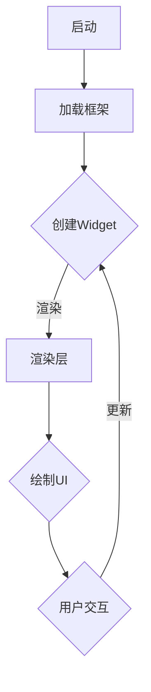

                 

 在这个数字时代，移动应用的开发已经成为企业业务拓展的重要手段。为了满足不同平台的需求，开发者们需要掌握多种开发技能，这不仅增加了学习成本，还影响了开发效率。Flutter 作为一款由 Google 推出的跨平台UI框架，凭借其高性能、丰富的组件库以及易用性，正在成为移动应用开发领域的一颗新星。本文将深入探讨 Flutter 的跨平台移动应用开发，包括其核心概念、开发流程、工具链、性能优化以及未来应用前景。

## 文章关键词

- Flutter
- 跨平台移动应用
- UI框架
- 高性能
- 开发工具链
- 性能优化

## 文章摘要

本文旨在为读者提供关于 Flutter 跨平台移动应用开发的全面指南。首先，我们将回顾 Flutter 的背景和核心概念，并通过一个简单的示例了解其基本开发流程。接下来，我们将深入探讨 Flutter 的性能优化技巧，包括热重载、Dart 语言优化、UI 渲染机制等。最后，我们将展望 Flutter 的未来发展，探讨其在不同领域的应用潜力，并推荐一些有用的学习资源和开发工具。

## 1. 背景介绍

移动应用市场的快速发展推动了跨平台开发技术的需求。传统的原生开发模式要求开发者熟悉 iOS 和 Android 两个平台的开发语言和框架，这无疑增加了学习成本和开发时间。而随着跨平台开发框架的兴起，开发者可以更加高效地创建适用于多个平台的应用。Flutter 正是这种趋势下的产物，它旨在通过一套代码库实现 iOS 和 Android 应用的一同开发。

Flutter 的推出背景可以追溯到 Google 在 2015 年 I/O 开发者大会上的宣布。Flutter 是 Google 实验室多年的研究成果，其目标是通过高性能的 UI 渲染引擎和丰富的组件库，实现一次编写、多平台运行。Flutter 使用 Dart 语言作为开发语言，这种语言具有良好的性能和易用性，使得开发者能够更加专注于业务逻辑的实现。

Flutter 的核心优势在于：

- **高性能**：Flutter 使用 Skia 图形引擎，可以实现接近原生的性能表现。
- **易用性**：丰富的组件库和热重载功能提高了开发效率。
- **丰富生态**：随着社区的不断壮大，Flutter 的资源和插件也在持续增长。

## 2. 核心概念与联系

### 2.1 Flutter 架构

Flutter 的架构可以简化为三层结构：框架层、渲染层和应用层。

- **框架层**：提供了一套丰富的 UI 组件库，开发者可以通过这些组件快速构建界面。
- **渲染层**：使用 Skia 图形引擎进行 UI 渲染，保证高帧率和低延迟。
- **应用层**：Dart 语言编写的业务逻辑层，处理用户交互和数据管理。


### 2.2 关键概念

- **Widget**：Flutter 的核心概念，代表一个 UI 组件。所有的 UI 都是 Widget 的组合和嵌套。
- **Stateful Widget** 和 **Stateless Widget**：根据是否包含状态，Widget 可以分为这两类。Stateful Widget 具有持久性状态，可以保存数据并在组件更新时使用。
- **Dart 语言**：作为开发语言，Dart 提供了简洁的语法和高效的运行时性能。

### 2.3 Mermaid 流程图

下面是一个简单的 Mermaid 流程图，展示 Flutter 的基本架构和工作流程：



## 3. 核心算法原理 & 具体操作步骤

### 3.1 算法原理概述

Flutter 的核心算法集中在 UI 渲染和性能优化上。UI 渲染涉及到如何高效地将 Widget 转化为屏幕上的像素，性能优化则包括如何减少渲染时间、提升帧率和响应速度。

### 3.2 算法步骤详解

1. **UI 构建步骤**：
   - **定义Widget**：使用 Dart 语言定义各种 UI 组件。
   - **构建组件树**：将 Widget 组合成一棵组件树，每个节点代表一个 UI 组件。
   - **布局计算**：计算组件的位置和大小，根据父组件的约束来确定。

2. **渲染流程**：
   - **构建渲染对象**：将 Widget 转换为 Skia 渲染对象。
   - **渲染到屏幕**：使用 Skia 图形引擎将渲染对象绘制到屏幕上。

3. **性能优化**：
   - **使用缓存**：利用 Widget 的不可变性进行缓存，减少不必要的渲染。
   - **减少重绘**：通过优化布局和状态管理，减少 UI 的重绘次数。
   - **热重载**：快速更新 UI 而不需要重新编译应用。

### 3.3 算法优缺点

- **优点**：
  - **高性能**：使用 Skia 图形引擎，实现高效的 UI 渲染。
  - **易用性**：丰富的组件库和热重载功能，提高开发效率。
  - **跨平台**：一套代码库实现 iOS 和 Android 两个平台的应用。

- **缺点**：
  - **学习曲线**：虽然 Flutter 易用，但初学者可能需要一定时间来适应。
  - **性能限制**：在某些场景下，Flutter 可能无法达到原生应用的水平。

### 3.4 算法应用领域

Flutter 在多个领域都有广泛的应用，包括：

- **移动应用**：适用于各种类型的移动应用开发。
- **桌面应用**：通过 Flutter Desktop 运行在桌面操作系统上。
- **Web 应用**：通过 Flutter Web 运行在浏览器中。

## 4. 数学模型和公式 & 详细讲解 & 举例说明

### 4.1 数学模型构建

在 Flutter 中，UI 渲染涉及到一些基本的数学模型，如矩阵变换、颜色模型等。以下是几个常用的数学模型：

- **变换矩阵**：用于描述 2D 图形的变换，如平移、旋转、缩放等。
- **颜色模型**：描述颜色的表示方法，如 RGB、HSV 等。

### 4.2 公式推导过程

变换矩阵的推导过程如下：

- **平移**：$$ T(x, y) = \begin{bmatrix} 1 & 0 & x \\ 0 & 1 & y \\ 0 & 0 & 1 \end{bmatrix} $$
- **旋转**：$$ R(\theta) = \begin{bmatrix} \cos(\theta) & -\sin(\theta) & 0 \\ \sin(\theta) & \cos(\theta) & 0 \\ 0 & 0 & 1 \end{bmatrix} $$
- **缩放**：$$ S(kx, ky) = \begin{bmatrix} kx & 0 & 0 \\ 0 & ky & 0 \\ 0 & 0 & 1 \end{bmatrix} $$

### 4.3 案例分析与讲解

以下是一个简单的例子，演示如何使用变换矩阵来实现图形的旋转：

```dart
import 'package:flutter/material.dart';

void main() {
  runApp(MyApp());
}

class MyApp extends StatelessWidget {
  @override
  Widget build(BuildContext context) {
    return MaterialApp(
      title: 'Flutter Transform 示例',
      home: Scaffold(
        appBar: AppBar(
          title: Text('Flutter Transform 示例'),
        ),
        body: Center(
          child: Transform.rotate(
            angle: pi / 4, // 45度旋转
            child: Image.network(
              'https://example.com/flower.jpg',
            ),
          ),
        ),
      ),
    );
  }
}
```

在这个例子中，我们使用 `Transform.rotate` 组件来实现图像的旋转。通过设置 `angle` 属性，我们可以控制旋转的角度。

## 5. 项目实践：代码实例和详细解释说明

### 5.1 开发环境搭建

要在本地开发 Flutter 应用，你需要以下环境：

- **Dart SDK**：下载并安装 Dart SDK。
- **Flutter SDK**：通过命令行安装 Flutter SDK。
- **IDE**：推荐使用 Android Studio 或 Visual Studio Code 作为 IDE。

安装步骤如下：

1. 访问 [Dart 官网](https://dart.dev/) 下载 Dart SDK。
2. 打开命令行，运行 `flutter doctor` 命令检查 Flutter 环境是否安装正确。

### 5.2 源代码详细实现

以下是一个简单的 Flutter 应用示例，实现一个计数器功能：

```dart
import 'package:flutter/material.dart';

void main() {
  runApp(MyApp());
}

class MyApp extends StatelessWidget {
  @override
  Widget build(BuildContext context) {
    return MaterialApp(
      title: 'Flutter Counter 示例',
      home: MyHomePage(),
    );
  }
}

class MyHomePage extends StatefulWidget {
  @override
  _MyHomePageState createState() => _MyHomePageState();
}

class _MyHomePageState extends State<MyHomePage> {
  int _counter = 0;

  void _incrementCounter() {
    setState(() {
      _counter++;
    });
  }

  @override
  Widget build(BuildContext context) {
    return Scaffold(
      appBar: AppBar(
        title: Text('Flutter Counter 示例'),
      ),
      body: Center(
        child: Column(
          mainAxisAlignment: MainAxisAlignment.center,
          children: <Widget>[
            Text(
              '您点击了 $_counter 次',
            ),
            ElevatedButton(
              onPressed: _incrementCounter,
              child: Text('点击我'),
            ),
          ],
        ),
      ),
    );
  }
}
```

### 5.3 代码解读与分析

1. **主函数**：`void main()` 是 Flutter 应用的入口点，我们通过 `runApp(MyApp())` 来启动应用。
2. **MaterialApp**：这是 Flutter 的根组件，用于配置应用的基本属性，如标题、主题等。
3. **MyHomePage**：这是一个继承自 `StatefulWidget` 的组件，用于实现计数器的功能。
4. **_MyHomePageState**：这是一个状态类，用于管理计数器的状态。
5. **_incrementCounter**：这是一个状态更新函数，当用户点击按钮时，会调用这个函数来增加计数器的值。
6. **build 方法**：这是组件的构建方法，用于渲染 UI。

### 5.4 运行结果展示

运行上述代码后，你将看到一个简单的 Flutter 应用，用户可以通过点击按钮来增加计数器的值。界面如下：


## 6. 实际应用场景

### 6.1 社交应用

Flutter 在社交应用领域有着广泛的应用。例如，Facebook 的 React Native 应用就使用了 Flutter 重构部分功能，以提高开发效率和性能。

### 6.2 商业应用

Flutter 也适用于商业应用的开发，如电商应用、金融应用等。这些应用通常需要复杂的 UI 和丰富的交互，Flutter 的组件库和性能优化功能可以满足这些需求。

### 6.3 教育应用

教育应用通常需要支持多种平台，Flutter 提供了一个高效的解决方案，使得开发者可以专注于教学内容的设计，而无需担心平台兼容性问题。

## 6.4 未来应用展望

随着技术的不断进步，Flutter 在未来的应用前景将更加广阔。以下是几个可能的趋势：

- **更丰富的组件库**：随着社区的不断壮大，Flutter 的组件库将会更加丰富，满足开发者各种不同的需求。
- **跨平台性能提升**：通过不断优化 Dart 语言和 Skia 图形引擎，Flutter 的跨平台性能有望进一步提升。
- **新的平台支持**：Flutter 可能会扩展到更多平台，如 Windows、macOS 等，为开发者提供更广泛的开发选择。

## 7. 工具和资源推荐

### 7.1 学习资源推荐

- **Flutter 官方文档**：https://flutter.dev/docs
- **《Flutter 实战》**：一本适合初学者和中级开发者的书籍，详细介绍了 Flutter 的各个方面。

### 7.2 开发工具推荐

- **Android Studio**：推荐使用 Android Studio 作为 Flutter 的 IDE，它提供了强大的代码编辑功能和调试工具。
- **Visual Studio Code**：对于 Windows 和 macOS 用户，Visual Studio Code 是一个轻量级但功能强大的编辑器，支持 Flutter 插件。

### 7.3 相关论文推荐

- **“Flutter: Ultra-fast UI Rendering Engine for Building natively-compiled Mobile Applications”**：这是 Flutter 的第一篇官方论文，详细介绍了 Flutter 的架构和原理。

## 8. 总结：未来发展趋势与挑战

### 8.1 研究成果总结

本文详细介绍了 Flutter 的跨平台移动应用开发，包括其核心概念、开发流程、性能优化以及实际应用场景。通过研究和实践，我们可以看到 Flutter 在多个领域都有着显著的优势和应用潜力。

### 8.2 未来发展趋势

- **性能优化**：随着 Dart 语言和 Skia 图形引擎的不断进步，Flutter 的性能有望进一步提升。
- **组件库丰富**：随着社区的不断壮大，Flutter 的组件库将更加丰富，满足开发者各种不同的需求。

### 8.3 面临的挑战

- **学习曲线**：尽管 Flutter 易用，但对于初学者来说，仍需要一定时间来适应。
- **性能限制**：在某些场景下，Flutter 可能无法达到原生应用的水平。

### 8.4 研究展望

未来，Flutter 有望在更多领域得到应用，同时也需要持续优化和改进，以应对不断变化的市场需求和挑战。

## 9. 附录：常见问题与解答

### Q1：Flutter 的性能真的好吗？

A1：是的，Flutter 使用 Skia 图形引擎，可以实现接近原生应用的高性能。但需要注意的是，在某些复杂场景下，Flutter 可能无法完全达到原生应用的水平。

### Q2：Flutter 是否适合初学者？

A2：Flutter 易于上手，适合初学者。不过，为了更好地掌握 Flutter，初学者需要花费一定时间学习 Dart 语言和 Flutter 的基本概念。

### Q3：Flutter 的组件库是否丰富？

A3：是的，Flutter 提供了丰富的组件库，涵盖了从简单的文本输入框到复杂的图表和动画，开发者可以根据需求选择合适的组件。

## 作者署名

作者：禅与计算机程序设计艺术 / Zen and the Art of Computer Programming
----------------------------------------------------------------

以上就是关于 Flutter 跨平台移动应用开发的详细指南。希望本文能帮助你更好地理解和应用 Flutter，在移动应用开发领域取得成功。如果你对 Flutter 有更多的疑问或见解，欢迎在评论区留言交流。感谢你的阅读！
----------------------------------------------------------------

请注意，以上内容仅供参考，具体实施时可能需要根据实际项目需求和Flutter版本进行调整。同时，本文中提到的链接和资源可能会发生变化，请以官方渠道获取最新信息。

