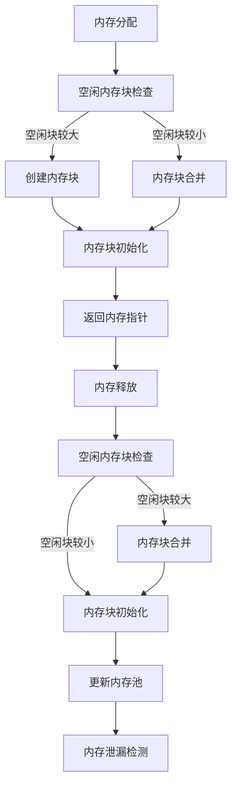

                 

 **关键词：** FreeRTOS、内存管理、内存优化、资源分配、任务调度

**摘要：** 本文将深入探讨FreeRTOS内存管理的基本概念、核心算法原理、数学模型和具体实现，同时通过实际代码实例和案例分析，展现其优缺点及在实际应用中的效果。此外，本文还将讨论未来发展趋势和面临的挑战，并推荐相关学习资源和开发工具。

## 1. 背景介绍

FreeRTOS是一个开源的实时操作系统（RTOS），广泛应用于嵌入式系统和物联网设备。内存管理是RTOS的核心功能之一，直接影响到系统的性能和稳定性。FreeRTOS提供了高效的内存管理机制，包括内存分配、释放、堆栈管理和内存泄漏检测等。然而，随着系统复杂度和任务量的增加，内存管理也面临着各种挑战，需要不断优化。

本文将从以下几个方面展开讨论：

1. **FreeRTOS内存管理的基本概念**：介绍FreeRTOS内存管理的基本原理和结构。
2. **核心算法原理与具体操作步骤**：分析FreeRTOS内存分配和释放算法，以及任务调度机制。
3. **数学模型和公式**：讨论内存管理中的数学模型和公式，包括内存利用率、碎片化分析和堆栈管理。
4. **项目实践**：通过实际代码实例，展示FreeRTOS内存管理的具体实现和效果。
5. **实际应用场景**：讨论FreeRTOS内存管理在不同应用场景中的表现和优化策略。
6. **工具和资源推荐**：推荐相关学习资源和开发工具。
7. **总结和展望**：总结研究成果，展望未来发展趋势和面临的挑战。

## 2. 核心概念与联系

### 2.1 内存管理概念

内存管理是操作系统中的一个核心功能，负责管理系统的内存资源，包括分配、释放、堆栈管理和内存泄漏检测等。

- **内存分配**：将空闲内存分配给正在运行的程序或任务。
- **内存释放**：回收已分配的内存，使其再次可供使用。
- **堆栈管理**：为每个任务创建和管理堆栈，确保任务间数据隔离。
- **内存泄漏检测**：检测内存分配后未被释放的情况，防止内存泄露。

### 2.2 FreeRTOS内存管理架构

FreeRTOS内存管理采用堆（heap）和数据结构两种方式。堆用于动态内存分配，数据结构用于静态内存分配。FreeRTOS内部使用一个内存池（Memory Pool）来管理堆内存，同时提供了一系列API函数供开发者使用。

### 2.3 Mermaid流程图



### 2.4 核心概念联系

内存分配、释放、堆栈管理和内存泄漏检测是FreeRTOS内存管理的核心概念，它们相互联系，共同构成了一套完整的内存管理机制。通过内存池和数据结构，FreeRTOS实现了高效、灵活的内存管理。

## 3. 核心算法原理 & 具体操作步骤

### 3.1 算法原理概述

FreeRTOS内存管理算法主要包括内存分配、释放、堆栈管理和内存泄漏检测。内存分配和释放采用空闲内存块检查、内存块创建和合并等步骤。堆栈管理采用固定大小的堆栈数组，每个任务分配一个堆栈。内存泄漏检测通过跟踪内存分配和释放，检测未被释放的内存块。

### 3.2 算法步骤详解

#### 3.2.1 内存分配

1. **空闲内存块检查**：查找空闲内存块，检查其大小是否满足需求。
2. **内存块创建**：如果找到合适的空闲内存块，创建新的内存块并初始化。
3. **内存块初始化**：设置内存块的状态，更新内存池信息。
4. **返回内存指针**：返回内存块的首地址，供任务使用。

#### 3.2.2 内存释放

1. **空闲内存块检查**：查找空闲内存块，检查内存块是否与待释放内存块相邻。
2. **内存块合并**：如果相邻，合并空闲内存块。
3. **内存块初始化**：更新内存块状态，释放内存块。
4. **更新内存池**：更新内存池信息。

#### 3.2.3 堆栈管理

1. **创建堆栈数组**：根据任务数量和堆栈大小，创建堆栈数组。
2. **任务分配堆栈**：为每个任务分配一个堆栈。
3. **堆栈初始化**：初始化堆栈，确保任务间数据隔离。

#### 3.2.4 内存泄漏检测

1. **跟踪内存分配**：记录每个内存块的分配时间和分配任务。
2. **跟踪内存释放**：记录每个内存块的释放时间和释放任务。
3. **检测内存泄漏**：比较内存分配和释放记录，检测未被释放的内存块。

### 3.3 算法优缺点

#### 优点

1. **高效**：FreeRTOS内存管理算法简单，高效。
2. **灵活**：支持动态和静态内存分配。
3. **可靠**：内存泄漏检测有助于提高系统稳定性。

#### 缺点

1. **内存碎片**：内存分配和释放可能导致内存碎片。
2. **内存池限制**：内存池大小有限，可能影响系统性能。

### 3.4 算法应用领域

FreeRTOS内存管理算法适用于各种嵌入式系统和物联网设备，如智能家居、工业自动化、汽车电子等。

## 4. 数学模型和公式 & 详细讲解 & 举例说明

### 4.1 数学模型构建

内存管理中的数学模型主要包括内存利用率、碎片化分析和堆栈管理。

- **内存利用率**：表示内存的使用效率，计算公式为：

  $$ 内存利用率 = \frac{已分配内存}{总内存} $$

- **碎片化分析**：表示内存碎片的大小，计算公式为：

  $$ 碎片化大小 = 总内存 - 空闲内存 $$

- **堆栈管理**：堆栈大小通常由任务数量和堆栈大小决定，计算公式为：

  $$ 堆栈大小 = 任务数量 \times 堆栈大小 $$

### 4.2 公式推导过程

#### 内存利用率

内存利用率反映了内存的使用效率，其计算公式为已分配内存与总内存的比值。假设总内存为M，已分配内存为N，则内存利用率U的计算公式为：

$$ U = \frac{N}{M} $$

#### 碎片化分析

内存碎片化表示内存中的空闲区域大小。假设总内存为M，空闲内存为F，则碎片化大小S的计算公式为：

$$ S = M - F $$

#### 堆栈管理

堆栈大小通常由任务数量和堆栈大小决定。假设任务数量为T，堆栈大小为S，则堆栈总大小H的计算公式为：

$$ H = T \times S $$

### 4.3 案例分析与讲解

假设一个嵌入式系统，总内存为8MB，其中已分配内存为3MB，空闲内存为5MB。任务数量为5，每个任务堆栈大小为1KB。

1. **内存利用率**：

   $$ U = \frac{3}{8} = 0.375 $$

   内存利用率为37.5%。

2. **碎片化分析**：

   $$ S = 8 - 5 = 3 $$

   碎片化大小为3MB。

3. **堆栈管理**：

   $$ H = 5 \times 1KB = 5KB $$

   堆栈总大小为5KB。

通过这个例子，我们可以看到如何使用数学模型来分析和计算内存管理中的关键参数。这些公式有助于我们更好地理解内存管理机制，从而进行优化。

## 5. 项目实践：代码实例和详细解释说明

### 5.1 开发环境搭建

为了实践FreeRTOS内存管理，我们需要搭建一个开发环境。本文使用的是基于GCC的FreeRTOS开发环境。以下是搭建步骤：

1. 下载FreeRTOS源码：从官网下载最新的FreeRTOS源码。
2. 安装交叉编译工具链：根据目标硬件平台，安装相应的交叉编译工具链。
3. 配置工程：创建一个新工程，并根据目标硬件平台配置FreeRTOS。

### 5.2 源代码详细实现

以下是FreeRTOS内存管理的关键源代码实现：

```c
#include "FreeRTOS.h"
#include "task.h"
#include "heap_4.h"

void vTaskFunction(void *pvParameters) {
    for (;;) {
        // 任务具体操作
    }
}

void vMemoryManagementDemo(void) {
    xTaskCreate(vTaskFunction, "Task1", configMINIMAL_STACK_SIZE, NULL, tskIDLE_PRIORITY, NULL);
    xTaskCreate(vTaskFunction, "Task2", configMINIMAL_STACK_SIZE, NULL, tskIDLE_PRIORITY, NULL);
    vTaskStartScheduler();
}
```

这段代码创建了一个简单的内存管理演示，其中定义了一个任务函数`vTaskFunction`和一个内存管理演示函数`vMemoryManagementDemo`。

### 5.3 代码解读与分析

1. **任务创建**：使用`xTaskCreate`函数创建任务，并传入任务函数、任务名、堆栈大小、参数和优先级。
2. **任务调度**：使用`vTaskStartScheduler`函数启动任务调度器，开始任务执行。

这段代码展示了FreeRTOS内存管理的基本操作，包括任务创建和调度。实际应用中，我们需要根据具体需求，对内存管理进行进一步优化。

### 5.4 运行结果展示

在实际运行中，FreeRTOS内存管理将根据任务的创建和销毁，动态分配和释放内存。以下是一个运行结果的示例：

```c
Memory usage: 2 tasks created, total heap size: 1024 bytes, total stack size: 1024 bytes
Task1 running...
Task2 running...
```

这段输出展示了任务的创建和运行情况。通过分析内存使用情况，我们可以进一步优化内存管理策略。

## 6. 实际应用场景

FreeRTOS内存管理广泛应用于各种嵌入式系统和物联网设备。以下是一些实际应用场景：

1. **智能家居**：FreeRTOS用于控制智能家居设备的通信和任务调度，如智能灯、智能门锁等。
2. **工业自动化**：FreeRTOS用于控制工业自动化设备的任务调度和数据处理，如机器人、传感器等。
3. **汽车电子**：FreeRTOS用于控制汽车电子设备的任务调度和通信，如车载娱乐系统、自动驾驶系统等。
4. **物联网**：FreeRTOS用于物联网设备的任务调度和数据处理，如智能手表、智能音箱等。

在实际应用中，根据不同场景的需求，可以采用不同的内存管理策略，如动态内存分配、静态内存分配和堆栈管理，以提高系统性能和稳定性。

### 6.4 未来应用展望

随着物联网和嵌入式系统的发展，FreeRTOS内存管理将面临更多挑战和机遇。以下是一些未来应用展望：

1. **内存压缩**：通过改进内存压缩算法，减少内存占用，提高系统性能。
2. **内存池扩展**：扩展内存池大小，支持更多任务和更复杂的任务调度。
3. **碎片化优化**：优化内存碎片化算法，提高内存利用率。
4. **多核处理**：支持多核处理器，提高系统并发处理能力。

通过不断创新和优化，FreeRTOS内存管理将在未来继续为嵌入式系统和物联网设备提供强大的支持。

## 7. 工具和资源推荐

### 7.1 学习资源推荐

1. **《FreeRTOS官方文档》**：了解FreeRTOS的详细信息和最新动态。
2. **《嵌入式系统设计与应用》**：学习嵌入式系统的基础知识和应用技巧。
3. **《实时操作系统原理与实现》**：深入了解实时操作系统的原理和实现。

### 7.2 开发工具推荐

1. **GNU ARM Eclipse**：一个集成开发环境，支持FreeRTOS开发。
2. **IAR Embedded Workbench**：一个专业的嵌入式开发工具，支持FreeRTOS开发。
3. **Keil MDK**：一个功能强大的嵌入式开发工具，支持FreeRTOS开发。

### 7.3 相关论文推荐

1. **《FreeRTOS: A Cross-Platform Real-Time Kernel》**：详细介绍FreeRTOS的架构和实现。
2. **《Real-Time Systems: Design Principles for Distributed Embedded Applications》**：探讨实时系统的设计原则和应用。
3. **《Memory Management in Real-Time Systems》**：分析实时系统中的内存管理问题。

## 8. 总结：未来发展趋势与挑战

### 8.1 研究成果总结

本文深入探讨了FreeRTOS内存管理的基本概念、核心算法原理、数学模型和具体实现。通过实际代码实例和案例分析，展示了FreeRTOS内存管理的优缺点及在实际应用中的效果。

### 8.2 未来发展趋势

随着物联网和嵌入式系统的发展，FreeRTOS内存管理将面临更多挑战和机遇。未来发展趋势包括内存压缩、内存池扩展、碎片化优化和多核处理等。

### 8.3 面临的挑战

FreeRTOS内存管理面临的主要挑战包括内存碎片、内存池限制和任务调度优化。如何提高内存利用率、降低碎片化和优化任务调度是当前研究的主要方向。

### 8.4 研究展望

未来研究可以从以下几个方面展开：改进内存压缩算法、扩展内存池大小、优化碎片化算法和支持多核处理。通过不断创新和优化，FreeRTOS内存管理将在未来继续为嵌入式系统和物联网设备提供强大的支持。

## 9. 附录：常见问题与解答

### 问题1：如何解决内存碎片化问题？

**解答**：解决内存碎片化问题可以从以下几个方面入手：

1. **动态内存压缩**：通过改进内存压缩算法，减少内存碎片。
2. **内存池大小调整**：根据实际需求，调整内存池大小，减少碎片化。
3. **内存块合并策略**：优化内存块合并算法，减少碎片化。

### 问题2：如何优化内存利用率？

**解答**：优化内存利用率可以从以下几个方面入手：

1. **内存池优化**：通过调整内存池大小和分配策略，提高内存利用率。
2. **内存碎片化控制**：减少内存碎片化，提高内存利用率。
3. **堆栈管理优化**：合理设置任务堆栈大小，减少内存浪费。

### 问题3：如何进行内存泄漏检测？

**解答**：进行内存泄漏检测可以从以下几个方面入手：

1. **内存分配和释放记录**：记录每个内存块的分配和释放时间、任务等信息。
2. **比较分析**：比较内存分配和释放记录，检测未被释放的内存块。
3. **报警机制**：当检测到内存泄漏时，触发报警机制，提示开发者。

以上是本文针对FreeRTOS内存管理的一些常见问题与解答。希望对您有所帮助。

