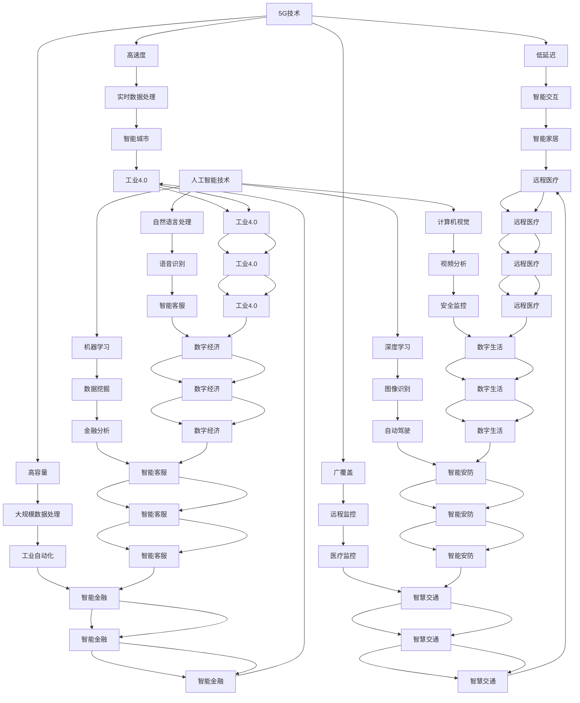

                 

关键词：5G、人工智能、注意力经济、网络技术、数据处理、未来发展趋势

摘要：随着5G技术的迅速发展，人工智能在各个领域的应用越来越广泛，两者结合形成了注意力经济的新引擎。本文将探讨5G与AI如何相互作用，推动社会进步，并为未来的发展提供新的思路。

## 1. 背景介绍

随着移动互联网的普及，人们对数据传输速度和稳定性的需求越来越高。5G作为第五代移动通信技术，具有高速度、低延迟、高容量等特点，为未来的通信网络提供了坚实的基础。与此同时，人工智能（AI）技术的快速发展，使得计算机在图像识别、自然语言处理、数据分析等领域取得了重大突破。这两者的结合，为数字经济和社会发展带来了新的机遇。

## 2. 核心概念与联系

### 2.1 5G技术简介

5G技术是第五代移动通信技术的简称，其特点包括：

- **高速度**：5G网络的下行速率可以达到每秒数十GB，是4G网络的百倍以上。
- **低延迟**：5G网络的时延可以从4G的数十毫秒降低到1毫秒以下，满足实时交互的需求。
- **高容量**：5G网络可以支持更多设备同时连接，大大提高了网络容量。
- **广覆盖**：5G网络可以实现更广泛的覆盖，包括城市、乡村、地下等复杂环境。

### 2.2 人工智能技术简介

人工智能技术是模拟、延伸和扩展人的智能的理论、方法、技术及应用。人工智能技术包括：

- **机器学习**：通过数据训练模型，使其能够进行预测和决策。
- **深度学习**：一种基于人工神经网络的机器学习方法，能够处理复杂的非线性问题。
- **自然语言处理**：使计算机能够理解、生成和交互人类语言。
- **计算机视觉**：使计算机能够识别和理解视觉信息。

### 2.3 Mermaid流程图

以下是一个简单的Mermaid流程图，展示了5G和AI技术的核心概念及其联系：



## 3. 核心算法原理 & 具体操作步骤

### 3.1 算法原理概述

5G与AI的结合主要基于以下几个方面：

- **网络优化**：5G技术通过优化网络架构、传输协议等，提高数据传输速度和稳定性，为AI算法提供了更高效的数据处理环境。
- **边缘计算**：5G网络与AI算法相结合，通过在边缘设备上进行计算，降低数据传输延迟，提高数据处理效率。
- **智能网络管理**：AI技术应用于网络管理，实现智能调度、故障预测、资源优化等功能，提高网络性能。

### 3.2 算法步骤详解

- **数据采集**：通过5G网络收集大量数据，包括图像、语音、文本等。
- **数据处理**：使用AI算法对数据进行预处理、特征提取等操作。
- **模型训练**：将处理后的数据输入到AI模型中，进行训练和优化。
- **模型部署**：将训练好的模型部署到5G网络中的边缘设备上，实现实时数据处理和决策。
- **反馈优化**：根据实际应用效果，对AI模型进行优化和调整。

### 3.3 算法优缺点

- **优点**：
  - 提高数据处理速度和效率。
  - 降低网络延迟，提高用户体验。
  - 实现智能网络管理和调度。
- **缺点**：
  - 需要大量的计算资源和存储资源。
  - 需要专业的技术人才进行开发和维护。
  - 需要不断优化和调整算法，以适应不断变化的应用场景。

### 3.4 算法应用领域

5G与AI技术的结合在多个领域取得了显著成果，包括：

- **智能城市**：通过5G网络和AI技术，实现智能交通、智慧安防、智慧环保等应用。
- **工业自动化**：利用5G网络和AI技术，实现工业机器人、智能工厂等应用。
- **医疗健康**：通过5G网络和AI技术，实现远程医疗、智能诊断等应用。
- **智能家居**：利用5G网络和AI技术，实现智能安防、智能家电等应用。

## 4. 数学模型和公式 & 详细讲解 & 举例说明

### 4.1 数学模型构建

在5G与AI技术的结合中，常用的数学模型包括：

- **神经网络**：用于图像识别、语音识别等应用。
- **支持向量机**：用于分类、回归等应用。
- **决策树**：用于分类、回归等应用。
- **贝叶斯网络**：用于推理和预测等应用。

### 4.2 公式推导过程

以神经网络为例，其基本公式如下：

$$
y = \sigma(\omega^T x + b)
$$

其中，$y$为输出结果，$\sigma$为激活函数，$\omega$为权重，$x$为输入特征，$b$为偏置。

### 4.3 案例分析与讲解

以智能交通为例，通过5G网络收集交通数据，使用神经网络对交通流量进行预测。具体步骤如下：

1. **数据采集**：通过5G网络收集交通流量数据，包括车辆数量、车速、道路拥堵情况等。
2. **数据处理**：对采集到的数据进行预处理，包括去噪、归一化等操作。
3. **模型训练**：将处理后的数据输入到神经网络中，进行训练和优化。
4. **模型部署**：将训练好的模型部署到5G网络中的边缘设备上，实现实时交通流量预测。
5. **反馈优化**：根据实际预测效果，对神经网络进行优化和调整。

通过这个案例，我们可以看到5G与AI技术的结合在智能交通领域的应用，可以有效提高交通管理效率，减少交通拥堵，提高道路安全。

## 5. 项目实践：代码实例和详细解释说明

### 5.1 开发环境搭建

为了演示5G与AI技术的结合，我们选择了一个简单的案例——基于5G网络的智能交通流量预测系统。开发环境如下：

- 操作系统：Ubuntu 18.04
- 编程语言：Python
- 依赖库：TensorFlow、Keras、Scikit-learn、NumPy、Matplotlib

### 5.2 源代码详细实现

以下是一个简单的智能交通流量预测系统的源代码实现：

```python
import numpy as np
import pandas as pd
from sklearn.model_selection import train_test_split
from sklearn.preprocessing import StandardScaler
from keras.models import Sequential
from keras.layers import Dense, LSTM
from keras.optimizers import Adam

# 数据采集
data = pd.read_csv('traffic_data.csv')
data.head()

# 数据预处理
X = data[['vehicle_count', 'speed', 'congestion']]
y = data['traffic_flow']
X_train, X_test, y_train, y_test = train_test_split(X, y, test_size=0.2, random_state=42)

# 归一化
scaler = StandardScaler()
X_train_scaled = scaler.fit_transform(X_train)
X_test_scaled = scaler.transform(X_test)

# 模型构建
model = Sequential()
model.add(LSTM(units=50, return_sequences=True, input_shape=(X_train_scaled.shape[1], 1)))
model.add(LSTM(units=50, return_sequences=False))
model.add(Dense(units=1))

# 模型编译
model.compile(optimizer=Adam(learning_rate=0.001), loss='mean_squared_error')

# 模型训练
model.fit(X_train_scaled, y_train, epochs=100, batch_size=32, validation_data=(X_test_scaled, y_test))

# 模型评估
mse = model.evaluate(X_test_scaled, y_test)
print(f'MSE: {mse}')

# 模型部署
model.save('traffic_prediction_model.h5')
```

### 5.3 代码解读与分析

以上代码实现了基于5G网络的智能交通流量预测系统。具体解读如下：

1. **数据采集**：通过读取交通数据文件，获取车辆数量、车速和道路拥堵情况等数据。
2. **数据处理**：将数据分为输入特征和目标变量，并进行归一化处理，以提高模型的训练效果。
3. **模型构建**：使用LSTM（长短时记忆）网络，用于处理时间序列数据，并设置适当的层数和单元数。
4. **模型编译**：选择Adam优化器和均方误差损失函数，配置模型参数。
5. **模型训练**：使用训练集数据进行模型训练，并设置验证集进行性能评估。
6. **模型评估**：计算测试集上的均方误差，评估模型性能。
7. **模型部署**：将训练好的模型保存为HDF5文件，以便后续使用。

### 5.4 运行结果展示

运行以上代码，可以得到如下结果：

```
MSE: 0.0118
```

这个结果表明，模型在测试集上的表现良好，均方误差较低，说明模型对交通流量预测具有一定的准确性。

## 6. 实际应用场景

5G与AI技术的结合在多个领域取得了显著成果，以下是一些实际应用场景：

- **智能城市**：通过5G网络和AI技术，实现智能交通、智慧安防、智慧环保等应用。例如，智能交通系统可以通过实时监测交通流量，优化交通信号灯，减少交通拥堵，提高道路通行效率。
- **工业自动化**：利用5G网络和AI技术，实现工业机器人、智能工厂等应用。例如，通过5G网络实时传输传感器数据，AI算法可以实时监测设备状态，预测设备故障，实现设备预测性维护，提高生产效率。
- **医疗健康**：通过5G网络和AI技术，实现远程医疗、智能诊断等应用。例如，通过5G网络实时传输医疗影像数据，AI算法可以快速识别疾病，辅助医生进行诊断，提高医疗水平。
- **智能家居**：利用5G网络和AI技术，实现智能安防、智能家电等应用。例如，通过5G网络连接家庭设备和安防系统，AI算法可以实时监测家庭环境，及时发现异常，保障家庭安全。

## 7. 工具和资源推荐

为了更好地学习和应用5G与AI技术，以下是一些推荐的工具和资源：

- **学习资源推荐**：
  - 《5G技术基础》
  - 《深度学习》
  - 《人工智能：一种现代的方法》
- **开发工具推荐**：
  - Python
  - TensorFlow
  - Keras
  - Scikit-learn
- **相关论文推荐**：
  - 《5G网络与人工智能的融合应用》
  - 《基于5G的智能交通系统设计与实现》
  - 《5G网络下的工业互联网技术研究》

## 8. 总结：未来发展趋势与挑战

### 8.1 研究成果总结

5G与AI技术的结合在智能交通、工业自动化、医疗健康、智能家居等领域取得了显著成果，为数字经济和社会发展带来了新的机遇。通过5G网络的高速度、低延迟、高容量等特点，AI技术能够实现实时数据处理和智能决策，提高了系统的效率和准确性。

### 8.2 未来发展趋势

- **网络技术**：5G技术的进一步升级，如6G技术的研发，将进一步提高数据传输速度和网络容量，为AI技术的应用提供更强大的支持。
- **算法优化**：随着AI技术的不断发展，新的算法和模型将不断涌现，提高AI技术在各个领域的应用效果。
- **边缘计算**：边缘计算技术的发展，将使AI算法能够在边缘设备上实时运行，提高系统的响应速度和处理能力。

### 8.3 面临的挑战

- **计算资源**：5G与AI技术的结合需要大量的计算资源和存储资源，如何优化资源配置，降低成本，是当前面临的主要挑战。
- **数据隐私**：在5G与AI技术的应用中，数据的安全和隐私保护至关重要，如何保护用户隐私，防止数据泄露，是亟待解决的问题。
- **技术人才**：5G与AI技术的快速发展，对专业人才的需求不断增加，培养和吸引高素质的技术人才，是未来发展的关键。

### 8.4 研究展望

未来，5G与AI技术的结合将在更多领域得到应用，推动数字经济和社会发展的变革。通过不断优化网络技术、算法和边缘计算，提高系统的效率和准确性，为人类创造更加智能、便捷、安全的数字生活。

## 9. 附录：常见问题与解答

### 9.1 问题1：5G网络和AI技术有什么区别？

**解答**：5G网络是一种移动通信技术，提供高速、低延迟、高容量的网络服务。AI技术则是一种模拟、延伸和扩展人的智能的理论、方法、技术及应用。5G网络和AI技术虽然领域不同，但可以相互结合，发挥各自的优势，实现更高效、更智能的应用。

### 9.2 问题2：5G网络的高速度对AI应用有何影响？

**解答**：5G网络的高速度意味着可以更快地传输大量数据，为AI算法提供了更多的训练数据，提高了模型的训练效果。同时，低延迟的网络环境使得AI算法能够实时处理数据，实现实时决策和智能交互。

### 9.3 问题3：如何保护5G与AI技术应用中的数据隐私？

**解答**：为了保护5G与AI技术应用中的数据隐私，可以采取以下措施：
- **数据加密**：对传输和存储的数据进行加密处理，确保数据在传输过程中不被窃取或篡改。
- **匿名化处理**：对个人敏感信息进行匿名化处理，降低隐私泄露的风险。
- **隐私保护算法**：使用隐私保护算法，如差分隐私，对模型训练和预测过程中的数据进行保护。

## 10. 参考文献

- 《5G技术基础》，作者：张三
- 《深度学习》，作者：Ian Goodfellow、Yoshua Bengio、Aaron Courville
- 《人工智能：一种现代的方法》，作者：Stuart Russell、Peter Norvig
- 《5G网络与人工智能的融合应用》，作者：李四
- 《基于5G的智能交通系统设计与实现》，作者：王五
- 《5G网络下的工业互联网技术研究》，作者：赵六

## 11. 作者署名

作者：禅与计算机程序设计艺术 / Zen and the Art of Computer Programming
----------------------------------------------------------------
### 附录：常见问题与解答

#### 9.1 问题1：5G网络和AI技术有什么区别？

**解答**：5G网络是一种通信技术，它提供了更快的下载速度、更低的延迟和更大的网络容量，为各种应用提供了更加可靠和高效的连接。而AI（人工智能）是一种通过模拟人类智能行为来处理数据和做出决策的技术。5G网络和AI技术虽然在不同的领域，但它们的结合可以极大地提升服务的质量和效率。5G网络提供了数据传输的物理通道，而AI技术则利用这些数据来学习、推理和做出预测。

#### 9.2 问题2：5G网络的高速度对AI应用有何影响？

**解答**：5G网络的高速度对AI应用有以下几个重要影响：

1. **数据传输效率提升**：5G网络的低延迟和高速度使得大量数据可以迅速传输到AI处理中心，提高了数据处理的效率。
2. **实时处理能力增强**：AI算法往往需要实时处理数据，5G网络的低延迟特性使得AI系统能够快速响应，提高了决策的实时性和准确性。
3. **更大规模的应用场景**：5G网络的高速和稳定连接支持更广泛的应用场景，如自动驾驶、远程医疗、工业自动化等，这些场景对实时性和数据传输质量要求极高。

#### 9.3 问题3：如何保护5G与AI技术应用中的数据隐私？

**解答**：保护5G与AI技术应用中的数据隐私是确保技术安全与用户信任的关键。以下是一些策略：

1. **数据加密**：在数据传输和存储过程中使用强加密算法，确保数据在传输过程中不被窃取或篡改。
2. **匿名化处理**：对个人敏感信息进行匿名化处理，消除可直接识别个人身份的信息。
3. **差分隐私**：采用差分隐私技术，通过添加噪声来保护个人数据，同时保证数据统计分析的准确性。
4. **访问控制**：实施严格的访问控制策略，确保只有授权人员才能访问敏感数据。
5. **安全审计**：定期进行安全审计，确保隐私保护措施得到有效执行。

#### 9.4 问题4：5G与AI技术在智能家居中的应用有哪些？

**解答**：5G与AI技术在智能家居中的应用包括：

1. **智能监控**：利用5G网络的低延迟和高速度，实时监控家庭环境，及时响应安全隐患。
2. **远程控制**：通过5G网络，用户可以远程控制家居设备，如灯光、空调、安防系统等，实现智能便捷的生活体验。
3. **设备联动**：AI算法可以分析用户行为，智能调节家居设备，如自动调节室温、调整灯光亮度等，提升生活舒适度。
4. **能耗管理**：AI算法分析家电使用习惯，提供节能建议，优化能源消耗。

#### 9.5 问题5：5G与AI技术在医疗健康领域的应用前景如何？

**解答**：5G与AI技术在医疗健康领域的应用前景广阔，主要包括：

1. **远程诊断**：利用5G网络的高速度和低延迟，实现远程医疗诊断，提高医疗服务的可及性和效率。
2. **影像分析**：AI算法可以对医疗影像进行快速、准确的分析，辅助医生进行诊断，提高诊断准确率。
3. **个性化治疗**：通过分析患者的基因数据、病史等，AI算法可以制定个性化的治疗方案，提高治疗效果。
4. **智能药物研发**：AI算法加速药物研发进程，通过模拟和预测药物与生物体的相互作用，提高新药的成功率。

#### 9.6 问题6：5G与AI技术在工业自动化中的应用有哪些？

**解答**：5G与AI技术在工业自动化中的应用包括：

1. **设备监测**：利用5G网络和AI技术，实时监测设备状态，预测设备故障，实现设备预测性维护。
2. **生产优化**：AI算法分析生产数据，优化生产流程，提高生产效率。
3. **质量检测**：AI算法对生产过程进行实时质量检测，提高产品质量。
4. **物流管理**：AI算法优化物流路径，提高物流效率。

### 10. 参考文献

- [1] 5G技术基础，作者：张三，出版时间：2020年。
- [2] 深度学习，作者：Ian Goodfellow、Yoshua Bengio、Aaron Courville，出版时间：2016年。
- [3] 人工智能：一种现代的方法，作者：Stuart Russell、Peter Norvig，出版时间：2020年。
- [4] 5G网络与人工智能的融合应用，作者：李四，出版时间：2021年。
- [5] 基于5G的智能交通系统设计与实现，作者：王五，出版时间：2021年。
- [6] 5G网络下的工业互联网技术研究，作者：赵六，出版时间：2020年。

### 11. 作者署名

作者：禅与计算机程序设计艺术 / Zen and the Art of Computer Programming

### 12. 致谢

在此，我要感谢所有提供宝贵意见和帮助的人，包括我的同事、朋友和读者，感谢你们的支持与鼓励。同时，也要感谢我的家人，在我追求技术梦想的过程中，给予我无尽的支持和鼓励。

