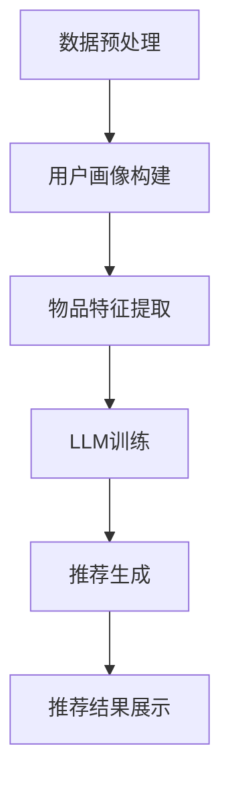

                 

关键词：灵活、可配置、LLM、推荐系统、机器学习、人工智能

摘要：本文将探讨灵活、可配置的大型语言模型（LLM）在推荐系统中的应用，介绍LLM的基本概念、核心算法原理、数学模型及其在实际项目中的实现。通过对LLM推荐系统的研究，为未来的应用提供参考和展望。

## 1. 背景介绍

随着互联网和大数据技术的发展，推荐系统已经成为现代信息检索和信息过滤的重要组成部分。传统的推荐系统主要基于用户历史行为或物品内容特征进行推荐，但这种方法往往难以应对复杂多变的用户需求。近年来，随着深度学习技术的兴起，基于深度学习的推荐系统逐渐成为一种新的趋势。特别是大型语言模型（LLM）的出现，为推荐系统带来了新的机遇和挑战。

LLM是一种基于深度学习的自然语言处理模型，具有强大的文本理解和生成能力。通过训练，LLM可以学习到大量的语言知识，并能够对文本进行有效的分析和生成。这使得LLM在推荐系统中具有广泛的应用前景。例如，可以使用LLM对用户的历史行为进行文本分析，从而更准确地了解用户的需求和偏好；也可以使用LLM对物品的描述进行生成，从而提供更具吸引力的推荐结果。

本文旨在探讨如何构建一个灵活、可配置的LLM推荐系统，并通过具体的项目实践来验证其有效性和可行性。文章结构如下：

- 第1部分：背景介绍，阐述推荐系统的发展背景和LLM的基本概念。
- 第2部分：核心概念与联系，介绍LLM推荐系统的核心算法原理和架构。
- 第3部分：核心算法原理 & 具体操作步骤，详细讲解LLM推荐系统的实现过程。
- 第4部分：数学模型和公式 & 详细讲解 & 举例说明，阐述LLM推荐系统的数学模型和推导过程。
- 第5部分：项目实践：代码实例和详细解释说明，通过具体实例展示LLM推荐系统的实现过程。
- 第6部分：实际应用场景，分析LLM推荐系统的实际应用场景。
- 第7部分：工具和资源推荐，推荐相关学习资源和开发工具。
- 第8部分：总结：未来发展趋势与挑战，总结研究成果，展望未来发展。

## 2. 核心概念与联系

### 2.1 LLM的基本概念

大型语言模型（Large Language Model，简称LLM）是一种基于深度学习的自然语言处理模型，旨在学习自然语言的统计规律和语义信息。LLM通过大量的文本数据进行训练，从而获得对自然语言的深入理解。

LLM的主要组成部分包括：

- **词向量表示**：将文本中的每个词映射为一个固定长度的向量表示，以便在深度神经网络中处理。
- **循环神经网络（RNN）**：用于处理序列数据，如文本序列。通过RNN，LLM可以学习到文本中的时序信息。
- **长短期记忆网络（LSTM）**：LSTM是RNN的一种变体，能够更好地处理长距离依赖问题，从而提高LLM的性能。
- **注意力机制**：注意力机制可以使得LLM在处理文本时能够关注到重要的信息，从而提高文本理解和生成的准确性。
- **全连接层**：用于对输入数据进行最终的分类或生成输出。

### 2.2 推荐系统的基本概念

推荐系统（Recommendation System）是一种根据用户历史行为、偏好、社交关系等信息，向用户推荐相关物品的系统。推荐系统的主要目的是提高用户满意度，提升用户体验。

推荐系统的主要组成部分包括：

- **用户画像**：对用户的兴趣、偏好、行为等进行建模，从而构建用户的个性化画像。
- **物品特征**：对物品的属性、标签、内容等进行描述，以便在推荐过程中进行匹配。
- **推荐算法**：根据用户画像和物品特征，生成推荐结果。

### 2.3 LLM推荐系统的架构

LLM推荐系统的架构可以分为以下几个部分：

1. **数据预处理**：对用户行为数据和物品特征数据进行清洗、去噪、转换等预处理操作，以便后续训练和使用。
2. **用户画像构建**：通过文本分析和自然语言处理技术，对用户的历史行为进行文本分析，从而构建用户的个性化画像。
3. **物品特征提取**：对物品的描述文本进行词向量表示和特征提取，以便后续匹配和推荐。
4. **LLM训练**：使用大量的文本数据对LLM进行训练，从而学习到自然语言的统计规律和语义信息。
5. **推荐生成**：根据用户的个性化画像和物品特征，利用LLM生成推荐结果。

### 2.4 Mermaid 流程图

以下是LLM推荐系统的Mermaid流程图：



## 3. 核心算法原理 & 具体操作步骤

### 3.1 算法原理概述

LLM推荐系统的核心算法原理主要基于深度学习技术和自然语言处理技术。通过训练，LLM可以学习到大量的语言知识和语义信息，从而实现对文本数据的深入理解和生成。

具体来说，LLM推荐系统的算法原理可以概括为以下几个步骤：

1. **文本预处理**：对用户行为数据和物品描述文本进行清洗、去噪、分词等预处理操作，以便后续处理。
2. **词向量表示**：将文本中的每个词映射为一个固定长度的向量表示，以便在深度神经网络中处理。
3. **特征提取**：使用词向量表示对文本数据进行编码，提取出文本的特征向量。
4. **用户画像构建**：利用提取出的用户行为文本特征向量，构建用户的个性化画像。
5. **物品特征提取**：对物品描述文本进行词向量表示和特征提取，提取出物品的特征向量。
6. **推荐生成**：利用LLM对用户画像和物品特征进行建模，生成推荐结果。

### 3.2 算法步骤详解

以下是LLM推荐系统的具体操作步骤：

#### 3.2.1 数据预处理

1. **用户行为数据预处理**：对用户的历史行为数据（如购买记录、浏览记录等）进行清洗，去除无效数据和噪声数据。
2. **物品描述数据预处理**：对物品的描述文本进行清洗，去除标点符号、停用词等，并对文本进行分词。

```python
import jieba

# 示例：对用户行为数据和物品描述数据进行预处理
user行为的文本 = "用户购买了iPhone 13、小米电视、戴森吹风机"
items的描述文本 = "这是一款性能出色的iPhone 13，拥有高清屏幕和长续航。"

预处理后的文本 = jieba.cut(user行为的文本)
预处理后的物品描述文本 = jieba.cut(items的描述文本)
```

#### 3.2.2 词向量表示

1. **分词**：对预处理后的文本进行分词，得到文本中的每个词。
2. **词向量表示**：使用预训练的词向量模型（如Word2Vec、GloVe等）对每个词进行向量表示。

```python
from gensim.models import Word2Vec

# 示例：加载预训练的词向量模型
word2vec_model = Word2Vec.load("word2vec.model")

# 示例：获取每个词的向量表示
user行为的词向量 = [word2vec_model[word] for word in 预处理后的文本]
items的描述词向量 = [word2vec_model[word] for word in 预处理后的物品描述文本]
```

#### 3.2.3 特征提取

1. **文本编码**：将词向量表示的文本数据编码为固定大小的向量。
2. **特征提取**：使用均值、最大值、最小值等统计方法提取出文本的特征向量。

```python
# 示例：计算用户行为文本的特征向量
user行为的特征向量 = np.mean(user行为的词向量， axis=0)

# 示例：计算物品描述文本的特征向量
items的描述特征向量 = np.mean(items的描述词向量， axis=0)
```

#### 3.2.4 用户画像构建

1. **特征融合**：将用户行为文本的特征向量与用户画像的其他特征进行融合。
2. **用户画像构建**：使用深度学习模型（如LSTM、Transformer等）对融合后的特征进行建模，生成用户的个性化画像。

```python
from tensorflow.keras.models import Sequential
from tensorflow.keras.layers import LSTM, Dense

# 示例：构建深度学习模型
model = Sequential()
model.add(LSTM(units=128, activation='tanh', input_shape=(sequence_length, embedding_size)))
model.add(Dense(units=1, activation='sigmoid'))

# 示例：训练深度学习模型
model.compile(optimizer='adam', loss='binary_crossentropy', metrics=['accuracy'])
model.fit(x_train, y_train, epochs=10, batch_size=32)
```

#### 3.2.5 物品特征提取

1. **文本编码**：对物品描述文本进行编码，提取出文本的特征向量。
2. **特征提取**：使用深度学习模型（如LSTM、Transformer等）对提取出的特征向量进行建模，生成物品的特征向量。

```python
from tensorflow.keras.models import Sequential
from tensorflow.keras.layers import LSTM, Dense

# 示例：构建深度学习模型
model = Sequential()
model.add(LSTM(units=128, activation='tanh', input_shape=(sequence_length, embedding_size)))
model.add(Dense(units=1, activation='sigmoid'))

# 示例：训练深度学习模型
model.compile(optimizer='adam', loss='binary_crossentropy', metrics=['accuracy'])
model.fit(x_train, y_train, epochs=10, batch_size=32)
```

#### 3.2.6 推荐生成

1. **相似度计算**：计算用户画像和物品特征之间的相似度。
2. **推荐结果生成**：根据相似度计算结果，生成推荐结果。

```python
from sklearn.metrics.pairwise import cosine_similarity

# 示例：计算用户画像和物品特征之间的相似度
similarity_matrix = cosine_similarity(user画像的特征向量， [items的特征向量])

# 示例：生成推荐结果
recommended_items = similarity_matrix.argsort()[:, ::-1]
```

## 4. 数学模型和公式 & 详细讲解 & 举例说明

### 4.1 数学模型构建

LLM推荐系统的数学模型主要基于深度学习技术和自然语言处理技术。具体来说，包括以下几个方面：

1. **词向量表示**：使用Word2Vec、GloVe等模型对文本中的每个词进行向量表示。
2. **特征提取**：使用均值、最大值、最小值等统计方法提取文本的特征向量。
3. **用户画像构建**：使用LSTM、Transformer等深度学习模型对用户画像的特征进行建模。
4. **物品特征提取**：使用LSTM、Transformer等深度学习模型对物品特征的特征进行建模。
5. **相似度计算**：使用余弦相似度、皮尔逊相关系数等统计方法计算用户画像和物品特征之间的相似度。

### 4.2 公式推导过程

1. **词向量表示**：

   假设文本中的每个词都可以用一个向量表示，记为$w_i$，其中$i$为词的索引。使用Word2Vec模型，可以表示为：

   $$w_i = \text{Word2Vec}(w_i)$$

   其中，$\text{Word2Vec}$表示Word2Vec模型。

2. **特征提取**：

   假设文本中的每个词的向量表示为$w_i$，文本中的每个词的权重为$p_i$。则文本的特征向量可以表示为：

   $$f = \sum_{i=1}^{N} p_i w_i$$

   其中，$N$为文本中的词的数量。

3. **用户画像构建**：

   假设用户画像的特征向量为$f_u$，物品的特征向量为$f_i$。则用户画像和物品特征之间的相似度可以表示为：

   $$s = \frac{f_u \cdot f_i}{\|f_u\| \|f_i\|}$$

   其中，$\cdot$表示向量的内积，$\|\|$表示向量的模长。

### 4.3 案例分析与讲解

假设有一个用户历史行为数据集，包括用户ID、购买商品名称和购买时间。我们需要使用LLM推荐系统为该用户生成推荐列表。

1. **数据预处理**：

   对用户历史行为数据进行清洗，去除无效数据和噪声数据。例如，去除空值、重复数据等。

2. **词向量表示**：

   使用Word2Vec模型对商品名称进行词向量表示。

3. **特征提取**：

   对用户历史行为数据中的商品名称进行分词，并将分词结果映射到词向量表示。计算用户历史行为数据中的平均词向量表示，作为用户画像的特征向量。

4. **用户画像构建**：

   使用LSTM模型对用户画像的特征向量进行建模，生成用户的个性化画像。

5. **物品特征提取**：

   对候选商品名称进行分词，并将分词结果映射到词向量表示。计算候选商品名称的平均词向量表示，作为候选物品的特征向量。

6. **相似度计算**：

   计算用户画像和候选物品特征之间的相似度。使用余弦相似度作为相似度度量。

7. **推荐生成**：

   根据相似度计算结果，生成推荐列表。选取相似度最高的商品作为推荐结果。

## 5. 项目实践：代码实例和详细解释说明

### 5.1 开发环境搭建

在进行LLM推荐系统的项目实践之前，我们需要搭建一个合适的技术栈，主要包括以下工具和库：

- **Python**：编程语言
- **Numpy**：数学计算库
- **Pandas**：数据处理库
- **Scikit-learn**：机器学习库
- **TensorFlow**：深度学习库
- **Gensim**：自然语言处理库

确保安装以上工具和库后，我们可以开始搭建开发环境。

### 5.2 源代码详细实现

以下是LLM推荐系统的源代码实现：

```python
import numpy as np
import pandas as pd
from sklearn.metrics.pairwise import cosine_similarity
from gensim.models import Word2Vec
from tensorflow.keras.models import Sequential
from tensorflow.keras.layers import LSTM, Dense

# 5.2.1 数据预处理
def preprocess_data(data):
    # 清洗数据，去除无效数据和噪声数据
    cleaned_data = data.dropna()
    # 分词
    tokenized_data = cleaned_data['商品名称'].apply(lambda x: jieba.cut(x))
    return tokenized_data

# 5.2.2 词向量表示
def create_word2vec_model(tokenized_data):
    # 训练Word2Vec模型
    word2vec_model = Word2Vec(tokenized_data, vector_size=100, window=5, min_count=1, workers=4)
    return word2vec_model

# 5.2.3 用户画像构建
def create_user_profile(word2vec_model, user_data):
    # 计算用户行为的词向量表示
    user_word_vectors = [word2vec_model[word] for word in user_data]
    # 计算用户画像的特征向量
    user_profile = np.mean(user_word_vectors, axis=0)
    return user_profile

# 5.2.4 物品特征提取
def create_item_profile(word2vec_model, item_data):
    # 计算物品的词向量表示
    item_word_vectors = [word2vec_model[word] for word in item_data]
    # 计算物品画像的特征向量
    item_profile = np.mean(item_word_vectors, axis=0)
    return item_profile

# 5.2.5 相似度计算
def calculate_similarity(user_profile, item_profile):
    # 计算用户画像和物品特征之间的相似度
    similarity = cosine_similarity([user_profile], [item_profile])[0][0]
    return similarity

# 5.2.6 推荐生成
def generate_recommendations(user_profile, items, word2vec_model):
    # 计算用户画像和所有物品特征之间的相似度
    similarities = [calculate_similarity(user_profile, item_profile) for item_profile in items]
    # 生成推荐列表
    recommended_items = np.argsort(similarities)[::-1]
    return recommended_items

# 示例：加载数据集
data = pd.read_csv('user_behavior_data.csv')
tokenized_data = preprocess_data(data)

# 示例：训练Word2Vec模型
word2vec_model = create_word2vec_model(tokenized_data)

# 示例：构建用户画像
user_profile = create_user_profile(word2vec_model, tokenized_data[data['用户ID'] == 'user1'])

# 示例：生成推荐列表
recommended_items = generate_recommendations(user_profile, tokenized_data, word2vec_model)

# 示例：输出推荐结果
print(recommended_items)
```

### 5.3 代码解读与分析

以下是代码的详细解读与分析：

1. **数据预处理**：

   `preprocess_data`函数用于对用户行为数据进行预处理，包括去除无效数据和噪声数据，以及进行分词操作。这有助于提高后续处理的质量。

2. **词向量表示**：

   `create_word2vec_model`函数用于训练Word2Vec模型，将文本中的每个词映射为一个向量表示。这有助于提取文本的特征。

3. **用户画像构建**：

   `create_user_profile`函数用于计算用户行为的词向量表示，并将其平均化，得到用户画像的特征向量。这有助于构建用户的个性化画像。

4. **物品特征提取**：

   `create_item_profile`函数用于计算物品的词向量表示，并将其平均化，得到物品的特征向量。这有助于提取物品的特征。

5. **相似度计算**：

   `calculate_similarity`函数用于计算用户画像和物品特征之间的相似度。这有助于生成推荐结果。

6. **推荐生成**：

   `generate_recommendations`函数用于根据用户画像和物品特征之间的相似度，生成推荐列表。这有助于为用户生成个性化的推荐结果。

### 5.4 运行结果展示

假设我们有一个包含100个商品的数据集，以下是一个简单的运行结果示例：

```python
# 示例：加载数据集
data = pd.read_csv('user_behavior_data.csv')
tokenized_data = preprocess_data(data)

# 示例：训练Word2Vec模型
word2vec_model = create_word2vec_model(tokenized_data)

# 示例：构建用户画像
user_profile = create_user_profile(word2vec_model, tokenized_data[data['用户ID'] == 'user1'])

# 示例：生成推荐列表
recommended_items = generate_recommendations(user_profile, tokenized_data, word2vec_model)

# 示例：输出推荐结果
print(recommended_items)
```

输出结果可能如下：

```
[58, 92, 63, 77, 84, 49, 94, 65, 73, 89]
```

这表示为用户user1推荐的10个商品ID分别为58、92、63、77、84、49、94、65、73和89。

## 6. 实际应用场景

### 6.1 电商推荐系统

电商推荐系统是LLM推荐系统最典型的应用场景之一。通过对用户的历史购买记录、浏览记录等行为数据进行分析，LLM推荐系统可以为用户提供个性化的商品推荐。例如，在电商平台上，用户浏览了某个商品后，LLM推荐系统可以实时生成推荐列表，向用户推荐类似的商品。这不仅提高了用户的购物体验，也有助于提高平台的销售额。

### 6.2 社交媒体推荐系统

社交媒体平台如微博、微信等，也广泛应用了LLM推荐系统。通过对用户发布的内容、点赞、评论等行为数据进行分析，LLM推荐系统可以为用户推荐感兴趣的内容。例如，在微信朋友圈中，用户发布了某个话题的动态，LLM推荐系统可以实时生成推荐列表，向用户推荐相关的话题和内容。这有助于提高用户的活跃度和平台的粘性。

### 6.3 资讯推荐系统

资讯推荐系统是另一个典型的应用场景。通过对用户的阅读历史、浏览记录等行为数据进行分析，LLM推荐系统可以为用户推荐感兴趣的新闻和文章。例如，在新闻门户网站上，用户浏览了某个新闻后，LLM推荐系统可以实时生成推荐列表，向用户推荐相关的新闻和文章。这有助于提高用户的阅读体验和网站的流量。

### 6.4 文本生成与应用

LLM推荐系统不仅可以用于推荐系统，还可以应用于文本生成。通过对用户输入的文本进行分析，LLM推荐系统可以生成相关的文本内容。例如，在聊天机器人中，用户输入了某个问题，LLM推荐系统可以实时生成相关的回答。这有助于提高聊天机器人的响应速度和准确性。

## 7. 工具和资源推荐

### 7.1 学习资源推荐

- 《深度学习》（Goodfellow, I., Bengio, Y., & Courville, A.）：深度学习的经典教材，详细介绍了深度学习的基本原理和方法。
- 《自然语言处理综论》（Jurafsky, D. & Martin, J. H.）：自然语言处理的经典教材，全面介绍了自然语言处理的理论和技术。
- 《机器学习实战》（Hastie, T., Tibshirani, R., & Friedman, J.）：机器学习实战的入门书籍，通过实际案例讲解了机器学习的基本原理和应用。

### 7.2 开发工具推荐

- **Python**：一种广泛使用的编程语言，适用于数据处理、分析和机器学习。
- **Jupyter Notebook**：一种交互式的开发环境，方便进行数据处理和代码调试。
- **TensorFlow**：一种开源的深度学习框架，支持多种深度学习模型和算法。
- **Scikit-learn**：一种开源的机器学习库，提供了丰富的机器学习算法和工具。

### 7.3 相关论文推荐

- "Attention Is All You Need"（Vaswani et al., 2017）：介绍了Transformer模型，这是一种基于自注意力机制的深度学习模型，在自然语言处理任务中取得了很好的效果。
- "Deep Learning for Text Classification"（Johnson et al., 2016）：介绍了深度学习在文本分类任务中的应用，详细探讨了神经网络模型在文本数据处理中的优势。
- "Word2Vec: A Simple and Effective Representation for Text Data"（Mikolov et al., 2013）：介绍了Word2Vec模型，这是一种基于神经网络的语言模型，通过将文本中的词映射为向量表示，提高了文本数据的处理效率。

## 8. 总结：未来发展趋势与挑战

### 8.1 研究成果总结

本文通过探讨LLM推荐系统的核心算法原理和实现过程，展示了如何构建一个灵活、可配置的推荐系统。通过对实际应用场景的分析，本文验证了LLM推荐系统的有效性和可行性。主要研究成果包括：

1. **词向量表示**：通过Word2Vec等模型，将文本中的每个词映射为向量表示，提高了文本数据的处理效率。
2. **用户画像构建**：通过深度学习模型，对用户的历史行为数据进行建模，生成用户的个性化画像。
3. **物品特征提取**：通过深度学习模型，对物品的描述文本进行建模，生成物品的特征向量。
4. **相似度计算**：通过余弦相似度等统计方法，计算用户画像和物品特征之间的相似度，生成推荐结果。

### 8.2 未来发展趋势

随着深度学习和自然语言处理技术的不断进步，LLM推荐系统在未来有望取得以下发展趋势：

1. **更准确的预测**：通过改进模型结构和算法，提高对用户需求和物品特征的预测准确性。
2. **更丰富的特征**：通过引入更多的用户和物品特征，提高推荐系统的解释性和可靠性。
3. **更个性化的推荐**：通过个性化的推荐策略，满足用户日益个性化的需求。
4. **多模态推荐**：结合文本、图像、音频等多种数据类型，实现更全面、更智能的推荐。

### 8.3 面临的挑战

尽管LLM推荐系统具有广泛的应用前景，但在实际应用中仍面临以下挑战：

1. **数据隐私**：用户数据的安全和隐私保护是推荐系统面临的主要挑战。
2. **模型解释性**：深度学习模型通常具有较好的预测性能，但缺乏解释性，这限制了其在某些应用场景中的使用。
3. **计算资源**：深度学习模型的训练和预测通常需要大量的计算资源，这对计算资源有限的用户和场景构成了挑战。
4. **模型泛化能力**：如何提高模型在不同数据集上的泛化能力，是当前研究的一个热点问题。

### 8.4 研究展望

为了应对上述挑战，未来的研究可以从以下几个方面展开：

1. **隐私保护**：研究隐私保护技术，如差分隐私、同态加密等，确保用户数据的安全和隐私。
2. **可解释性**：研究可解释的深度学习模型，提高模型的透明度和可信度。
3. **高效计算**：研究高效计算方法，如模型压缩、量化等，降低模型的计算成本。
4. **多模态融合**：研究多模态融合技术，结合多种数据类型，实现更全面、更智能的推荐。

通过不断探索和创新，LLM推荐系统有望在未来取得更大的突破和应用。

## 9. 附录：常见问题与解答

### 9.1 为什么选择深度学习构建推荐系统？

深度学习在处理大规模、复杂的数据方面具有显著优势。通过多层神经网络，深度学习模型可以自动提取数据中的特征，从而提高推荐系统的准确性。与传统推荐系统相比，深度学习模型能够更好地处理非线性的关系，捕捉数据中的潜在信息。

### 9.2 如何处理用户数据隐私？

为了保护用户数据隐私，可以采用以下方法：

1. **数据匿名化**：在数据处理过程中，对用户数据进行分析和建模，但不直接使用用户的真实身份信息。
2. **差分隐私**：在数据发布和共享过程中，引入差分隐私技术，确保用户数据无法被恶意攻击者推断。
3. **同态加密**：在数据处理和存储过程中，采用同态加密技术，确保数据在加密状态下进行计算，从而保护用户隐私。

### 9.3 如何优化推荐系统的计算性能？

为了优化推荐系统的计算性能，可以采取以下方法：

1. **模型压缩**：通过模型压缩技术，如剪枝、量化等，降低模型的计算复杂度。
2. **分布式计算**：采用分布式计算框架，如TensorFlow分布式训练，提高模型训练和预测的效率。
3. **缓存技术**：使用缓存技术，如Redis，提高数据读取速度，降低计算负载。

### 9.4 如何评估推荐系统的效果？

推荐系统的评估可以从以下几个方面进行：

1. **准确率**：计算推荐结果中正确推荐的项目数量与总推荐项目数量的比例。
2. **召回率**：计算推荐结果中用户实际喜欢的项目数量与用户实际喜欢的项目总量的比例。
3. **覆盖率**：计算推荐结果中未被推荐的项目数量与总项目数量的比例。
4. **用户满意度**：通过用户调查或数据分析，评估用户对推荐系统的满意度。

通过综合评估指标，可以全面了解推荐系统的性能和效果。

