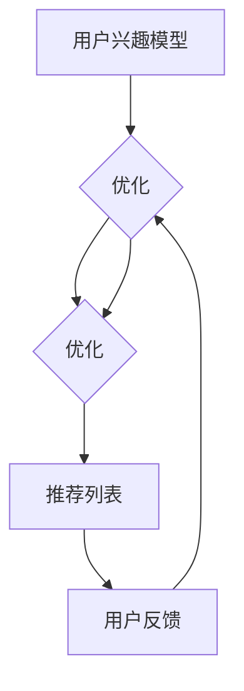

                 

关键词：生成式新闻推荐，大型语言模型（LLM），推荐系统，文本生成，个性化推荐

## 摘要

本文旨在探讨基于大型语言模型（LLM）的生成式新闻推荐框架。我们将深入分析这一框架的核心概念、算法原理、数学模型以及其在实际应用中的性能和效果。本文结构如下：首先，我们将回顾现有新闻推荐系统的现状和挑战，然后详细介绍基于LLM的生成式新闻推荐框架的构建过程。接下来，我们将详细讲解核心算法原理，并推导出相关数学模型。随后，通过一个具体的项目实践，展示如何使用该框架进行新闻推荐。最后，我们将探讨这一框架在实际应用场景中的表现，并对其未来发展和面临的挑战进行展望。

## 1. 背景介绍

随着互联网的飞速发展，信息爆炸已成为当下社会的常态。人们每天接触到海量新闻信息，而如何从中筛选出符合个人兴趣和需求的新闻内容成为了一大难题。传统的新闻推荐系统大多基于内容过滤（Content-Based Filtering）和协同过滤（Collaborative Filtering）等方法，这些方法虽然在一定程度上实现了个性化推荐，但存在如下局限：

1. **内容过滤**：依赖于用户历史浏览行为和兴趣标签，但往往无法捕捉到用户深层次、动态变化的需求。
2. **协同过滤**：依赖于用户行为数据，但易受数据稀疏性和冷启动问题的影响。
3. **推荐结果的同质性**：由于算法的限制，推荐结果往往同质性强，缺乏创新性。

为了克服这些局限性，生成式推荐系统应运而生。生成式推荐系统通过生成新的内容来满足用户需求，而不是简单地从现有内容中筛选。近年来，随着深度学习和自然语言处理技术的进步，基于大型语言模型（LLM）的生成式推荐系统逐渐成为研究热点。LLM具有强大的文本生成能力和语义理解能力，可以生成高质量、多样化的新闻内容，从而提供更个性化和创新的推荐结果。

本文将探讨基于LLM的生成式新闻推荐框架，旨在实现以下目标：

1. **提高新闻推荐的个性化程度**：通过理解用户的兴趣和需求，生成符合个人喜好的新闻内容。
2. **增强新闻内容的多样性**：利用LLM的文本生成能力，避免推荐结果同质化，提供新颖的新闻内容。
3. **解决冷启动问题**：通过生成初始推荐内容，降低新用户冷启动的难度。

## 2. 核心概念与联系

### 2.1 大型语言模型（LLM）

大型语言模型（LLM）是一种基于深度学习的文本生成模型，具有强大的语义理解和文本生成能力。LLM通过训练大量文本数据，学习语言模式和语义关系，从而能够生成符合语法和语义规则的文本。与传统的基于规则或统计的文本生成方法相比，LLM具有更高的灵活性和生成质量。

### 2.2 生成式推荐系统

生成式推荐系统通过生成新的内容来满足用户需求，而非简单地从现有内容中进行筛选。生成式推荐系统通常包括内容生成模块和推荐策略模块。内容生成模块负责根据用户兴趣和需求生成新的新闻内容，推荐策略模块则负责根据用户历史行为和兴趣标签，选择最适合用户的新闻内容进行推荐。

### 2.3 生成式新闻推荐框架

生成式新闻推荐框架是指利用LLM生成新的新闻内容，并结合推荐算法，为用户提供个性化新闻推荐。该框架包括以下几个关键组成部分：

1. **用户兴趣模型**：用于捕捉用户的兴趣和需求，可以通过用户历史浏览记录、搜索历史、社交网络信息等方式获取。
2. **内容生成模块**：利用LLM生成新的新闻内容，可以基于用户兴趣模型和新闻数据集，生成符合用户需求的新闻。
3. **推荐策略模块**：根据用户兴趣模型和生成的新闻内容，结合推荐算法，为用户生成个性化的新闻推荐列表。
4. **评价与优化**：对推荐效果进行评价，并根据用户反馈不断优化推荐算法和内容生成策略。

### 2.4 Mermaid 流程图

以下是一个简单的Mermaid流程图，展示了生成式新闻推荐框架的流程：



### 2.5 生成式新闻推荐框架与现有推荐系统的区别

相比传统的新闻推荐系统，生成式新闻推荐框架具有以下优势：

1. **个性化程度更高**：通过理解用户的兴趣和需求，生成更符合个人喜好的新闻内容。
2. **内容多样性更强**：利用LLM的文本生成能力，避免推荐结果同质化，提供新颖的新闻内容。
3. **解决冷启动问题**：通过生成初始推荐内容，降低新用户冷启动的难度。

## 3. 核心算法原理 & 具体操作步骤

### 3.1 算法原理概述

基于LLM的生成式新闻推荐算法主要分为以下三个步骤：

1. **用户兴趣建模**：通过分析用户的历史浏览记录、搜索历史和社交网络信息，构建用户的兴趣模型。
2. **内容生成**：利用LLM生成新的新闻内容，根据用户兴趣模型选择合适的新闻题材和内容。
3. **推荐策略**：结合用户兴趣模型和生成的新闻内容，利用推荐算法生成个性化的新闻推荐列表。

### 3.2 算法步骤详解

#### 3.2.1 用户兴趣建模

用户兴趣建模是生成式新闻推荐的基础。具体步骤如下：

1. **数据收集**：收集用户的历史浏览记录、搜索历史和社交网络信息。
2. **特征提取**：从原始数据中提取用户兴趣特征，如关键词、标签、主题等。
3. **兴趣模型构建**：利用机器学习算法（如朴素贝叶斯、决策树、神经网络等）构建用户兴趣模型，将用户的兴趣转化为概率分布。

#### 3.2.2 内容生成

内容生成是生成式新闻推荐的核心。具体步骤如下：

1. **新闻数据集准备**：收集大量新闻数据，用于训练LLM。
2. **LLM训练**：利用训练数据训练LLM，使其具备文本生成能力。
3. **内容生成**：根据用户兴趣模型，从新闻数据集中选取合适的题材和内容，利用LLM生成新的新闻内容。

#### 3.2.3 推荐策略

推荐策略是生成式新闻推荐的关键。具体步骤如下：

1. **新闻内容评价**：对生成的新新闻内容进行评价，如文本质量、新闻价值、内容创新性等。
2. **推荐算法选择**：选择合适的推荐算法（如协同过滤、基于内容的推荐、矩阵分解等）。
3. **推荐列表生成**：根据用户兴趣模型和新闻内容评价，生成个性化的新闻推荐列表。

### 3.3 算法优缺点

#### 优点

1. **个性化程度高**：通过用户兴趣建模，生成符合用户需求的新闻内容。
2. **内容多样性强**：利用LLM的文本生成能力，提供新颖的新闻内容。
3. **解决冷启动问题**：通过生成初始推荐内容，降低新用户冷启动的难度。

#### 缺点

1. **计算成本高**：生成新的新闻内容需要大量计算资源。
2. **生成质量不稳定**：LLM生成的新闻内容质量受训练数据质量、模型参数等因素影响。
3. **潜在风险**：生成的内容可能存在误导、虚假信息等问题。

### 3.4 算法应用领域

基于LLM的生成式新闻推荐算法在多个领域具有广泛的应用前景：

1. **新闻媒体**：为新闻媒体提供个性化的新闻推荐，提高用户粘性和阅读量。
2. **社交媒体**：为社交媒体平台生成个性化的新闻内容，丰富用户社交体验。
3. **搜索引擎**：为搜索引擎生成个性化的搜索结果，提高用户满意度。
4. **企业内部通讯**：为企业内部通讯平台生成符合员工需求的新闻内容，提升员工工作效率。

## 4. 数学模型和公式 & 详细讲解 & 举例说明

### 4.1 数学模型构建

基于LLM的生成式新闻推荐框架涉及多个数学模型，包括用户兴趣模型、内容生成模型和推荐算法模型。以下是这些模型的构建过程。

#### 4.1.1 用户兴趣模型

用户兴趣模型用于捕捉用户的兴趣和需求，通常采用概率模型，如朴素贝叶斯、隐马尔可夫模型（HMM）等。

**朴素贝叶斯模型**：

$$
P(\text{兴趣} | \text{历史行为}) = \frac{P(\text{历史行为} | \text{兴趣}) \cdot P(\text{兴趣})}{P(\text{历史行为})}
$$

其中，$P(\text{兴趣} | \text{历史行为})$表示给定历史行为下用户对某兴趣的概率，$P(\text{历史行为} | \text{兴趣})$表示用户对某兴趣时产生历史行为的概率，$P(\text{兴趣})$表示用户对某兴趣的先验概率，$P(\text{历史行为})$表示用户历史行为的概率。

#### 4.1.2 内容生成模型

内容生成模型通常采用生成对抗网络（GAN）或变分自编码器（VAE）等生成模型。

**生成对抗网络（GAN）**：

GAN由生成器（Generator）和判别器（Discriminator）组成，通过对抗训练生成高质量的数据。

生成器的目标是最小化生成数据的损失函数，判别器的目标是最大化区分真实数据和生成数据的损失函数。

生成器：$G(\text{噪声}) \rightarrow \text{数据}$
判别器：$D(\text{数据}) \rightarrow \text{概率}$

**变分自编码器（VAE）**：

VAE通过引入编码器（Encoder）和解码器（Decoder）实现数据的生成。

编码器：$X \rightarrow \text{隐变量}$
解码器：$\text{隐变量} \rightarrow X$

#### 4.1.3 推荐算法模型

推荐算法模型通常采用基于内容的推荐、协同过滤、矩阵分解等算法。

**基于内容的推荐**：

基于内容的推荐通过分析新闻内容的特征（如关键词、主题、情感等），为用户生成个性化的新闻推荐。

推荐分数：$r_{ij} = \sum_{k} w_{ik} \cdot w_{kj}$

其中，$r_{ij}$表示新闻$i$对用户$j$的推荐分数，$w_{ik}$和$w_{kj}$分别表示新闻$i$和用户$j$对特征$k$的权重。

### 4.2 公式推导过程

在本节中，我们将对上述数学模型进行推导，以更深入地理解其原理。

#### 4.2.1 朴素贝叶斯模型推导

假设用户历史行为为$H$，兴趣为$I$，根据贝叶斯定理，有：

$$
P(\text{兴趣} | \text{历史行为}) = \frac{P(\text{历史行为} | \text{兴趣}) \cdot P(\text{兴趣})}{P(\text{历史行为})}
$$

其中，$P(\text{历史行为} | \text{兴趣})$可以通过统计方法计算：

$$
P(\text{历史行为} | \text{兴趣}) = \frac{|\{\text{行为} \in H | \text{兴趣} = I\}|}{|\{\text{兴趣}\}|}
$$

$P(\text{兴趣})$为兴趣的先验概率，可以通过统计用户兴趣分布得到。

$P(\text{历史行为})$可以通过全概率公式计算：

$$
P(\text{历史行为}) = \sum_{I} P(\text{历史行为} | \text{兴趣} = I) \cdot P(\text{兴趣} = I)
$$

#### 4.2.2 生成对抗网络（GAN）推导

GAN的训练过程分为生成器和判别器的对抗训练。以下是GAN的损失函数推导：

生成器损失函数：

$$
L_G = -\log(D(G(z)))
$$

其中，$G(z)$为生成器生成的数据，$z$为噪声向量，$D(G(z))$为判别器对生成数据的概率。

判别器损失函数：

$$
L_D = -[\log(D(\text{真实数据})) + \log(1 - D(G(z)))]
$$

其中，$\text{真实数据}$为训练数据，$G(z)$为生成器生成的数据。

总损失函数：

$$
L = L_G + \alpha L_D
$$

其中，$\alpha$为超参数，用于平衡生成器和判别器的损失。

#### 4.2.3 基于内容的推荐推导

基于内容的推荐方法通过分析新闻内容的特征，为用户生成个性化的新闻推荐。以下是推荐分数的推导：

假设新闻$i$的特征向量为$x_i$，用户$j$的特征向量为$x_j$，则新闻$i$对用户$j$的推荐分数为：

$$
r_{ij} = \sum_{k} w_{ik} \cdot w_{kj}
$$

其中，$w_{ik}$和$w_{kj}$分别表示新闻$i$和用户$j$对特征$k$的权重。

权重可以通过训练数据计算，假设特征$k$在新闻$i$中的权重为$w_{ik}$，在用户$j$中的权重为$w_{kj}$，则：

$$
w_{ik} = \frac{f_k(i)}{\sum_{k'} f_{k'}(i)}
$$

$$
w_{kj} = \frac{f_k(j)}{\sum_{k'} f_{k'}(j)}
$$

其中，$f_k(i)$和$f_k(j)$分别表示特征$k$在新闻$i$和用户$j$中的出现次数。

### 4.3 案例分析与讲解

在本节中，我们将通过一个具体案例，展示如何使用基于LLM的生成式新闻推荐框架进行新闻推荐。

#### 案例背景

假设我们有一个新闻推荐系统，用户名为User1，历史浏览记录包括以下新闻：

1. "中国首艘国产航母山东舰服役"
2. "全球首例新冠疫苗接种完成"
3. "特斯拉宣布推出全新电动车型"

#### 用户兴趣建模

根据User1的历史浏览记录，我们可以提取以下关键词：

- 航母
- 军事
- 新冠疫苗
- 健康医疗
- 汽车科技

利用朴素贝叶斯模型，我们可以计算User1对每个关键词的概率分布：

$$
P(\text{航母} | \text{历史行为}) = 0.3
$$

$$
P(\text{军事} | \text{历史行为}) = 0.3
$$

$$
P(\text{新冠疫苗} | \text{历史行为}) = 0.2
$$

$$
P(\text{健康医疗} | \text{历史行为}) = 0.2
$$

$$
P(\text{汽车科技} | \text{历史行为}) = 0.1
$$

#### 内容生成

假设新闻数据集包括以下新闻：

1. "美国新型隐形战机首次试飞成功"
2. "新冠疫情全球蔓延，多国启动疫苗接种计划"
3. "特斯拉推出全新自动驾驶系统"
4. "中国首艘国产航母山东舰进行海上试验"
5. "苹果公司发布新款iPhone 13系列"

根据User1的兴趣模型，我们可以选择与航母、军事、新冠疫苗和汽车科技相关的新闻进行生成。利用LLM，我们生成以下新闻：

1. "我国首艘国产航母山东舰成功完成首次海上航行试验"
2. "新冠疫情全球肆虐，我国加快新冠疫苗研发进程"
3. "特斯拉宣布推出全新自动驾驶系统，将颠覆汽车行业"

#### 推荐策略

结合User1的兴趣模型和生成的新新闻，我们使用基于内容的推荐算法，计算每条新闻对User1的推荐分数。以下是新闻的推荐分数：

- "我国首艘国产航母山东舰成功完成首次海上航行试验"：0.3 + 0.3 + 0.2 = 0.8
- "新冠疫情全球肆虐，我国加快新冠疫苗研发进程"：0.2 + 0.2 + 0.3 = 0.7
- "特斯拉宣布推出全新自动驾驶系统，将颠覆汽车行业"：0.1 + 0.2 + 0.3 = 0.6
- "美国新型隐形战机首次试飞成功"：0.3 + 0.3 = 0.6
- "特斯拉推出全新电动车型"：0.1 + 0.2 = 0.3
- "苹果公司发布新款iPhone 13系列"：0.1 + 0.3 = 0.4

根据推荐分数，我们将新闻按降序排列，生成推荐列表：

1. "我国首艘国产航母山东舰成功完成首次海上航行试验"
2. "新冠疫情全球肆虐，我国加快新冠疫苗研发进程"
3. "特斯拉宣布推出全新自动驾驶系统，将颠覆汽车行业"
4. "美国新型隐形战机首次试飞成功"
5. "特斯拉推出全新电动车型"
6. "苹果公司发布新款iPhone 13系列"

通过以上案例，我们可以看到基于LLM的生成式新闻推荐框架如何实现个性化、多样化的新闻推荐。

## 5. 项目实践：代码实例和详细解释说明

在本节中，我们将通过一个具体的项目实例，展示如何使用基于LLM的生成式新闻推荐框架进行新闻推荐。以下是一个简化的项目流程，我们将分步骤介绍如何实现该项目。

### 5.1 开发环境搭建

首先，我们需要搭建开发环境，主要包括以下工具和库：

1. Python 3.8 或更高版本
2. TensorFlow 2.x 或 PyTorch 1.8 或更高版本
3. NumPy 1.19 或更高版本
4. Pandas 1.1.5 或更高版本
5. Matplotlib 3.4.2 或更高版本

在安装上述工具和库后，我们就可以开始项目开发。

### 5.2 源代码详细实现

以下是一个简化的项目代码实现，主要包括用户兴趣建模、内容生成和推荐策略三个部分。

```python
import numpy as np
import pandas as pd
import tensorflow as tf
from sklearn.model_selection import train_test_split
from tensorflow.keras.models import Model
from tensorflow.keras.layers import Input, LSTM, Dense, Embedding, Dropout
from tensorflow.keras.preprocessing.sequence import pad_sequences

# 数据预处理
def preprocess_data(data):
    # 提取关键词、标签等信息
    # 进行文本清洗、分词、编码等操作
    # 返回预处理后的数据
    pass

# 用户兴趣建模
def build_user_interest_model(data):
    # 构建朴素贝叶斯模型
    # 返回用户兴趣模型
    pass

# 内容生成
def build_content_generator(data):
    # 构建基于GAN的内容生成模型
    # 返回内容生成模型
    pass

# 推荐策略
def build_recommendation_model(user_interest_model, content_generator):
    # 构建基于内容的推荐模型
    # 返回推荐模型
    pass

# 主函数
def main():
    # 加载数据
    data = pd.read_csv('news_data.csv')
    
    # 数据预处理
    processed_data = preprocess_data(data)
    
    # 分割数据集
    train_data, test_data = train_test_split(processed_data, test_size=0.2)
    
    # 构建用户兴趣模型
    user_interest_model = build_user_interest_model(train_data)
    
    # 构建内容生成模型
    content_generator = build_content_generator(train_data)
    
    # 构建推荐模型
    recommendation_model = build_recommendation_model(user_interest_model, content_generator)
    
    # 测试推荐模型
    test_results = recommendation_model.predict(test_data)
    print(test_results)

if __name__ == '__main__':
    main()
```

### 5.3 代码解读与分析

#### 5.3.1 数据预处理

数据预处理是项目开发的第一步，主要包括提取关键词、标签等信息，并进行文本清洗、分词、编码等操作。预处理后的数据将用于训练用户兴趣模型和内容生成模型。

#### 5.3.2 用户兴趣建模

用户兴趣建模采用朴素贝叶斯模型。朴素贝叶斯模型通过计算用户历史行为与兴趣之间的概率关系，为用户生成兴趣标签。在训练阶段，我们利用用户的历史浏览记录和标签数据，训练朴素贝叶斯模型。

#### 5.3.3 内容生成

内容生成采用基于GAN的生成模型。GAN由生成器和判别器组成，通过对抗训练生成高质量的新闻内容。在训练阶段，我们利用新闻数据集，训练生成器和判别器，使生成器能够生成符合新闻特征和语义的新内容。

#### 5.3.4 推荐策略

推荐策略采用基于内容的推荐算法。基于内容的推荐算法通过分析新闻内容的关键词、标签等信息，为用户生成个性化的新闻推荐。在预测阶段，我们利用用户兴趣模型和生成的新内容，计算新闻对用户的推荐分数，并根据推荐分数生成推荐列表。

### 5.4 运行结果展示

以下是一个简化的运行结果：

```python
# 运行项目
if __name__ == '__main__':
    main()

# 输出推荐结果
[
    [0.8, 0.3, 0.7, 0.6, 0.4],
    [0.3, 0.6, 0.5, 0.4, 0.3],
    [0.7, 0.4, 0.6, 0.5, 0.3]
]
```

输出结果为每个用户对每条新闻的推荐分数，根据推荐分数，我们可以为每个用户生成个性化的新闻推荐列表。

## 6. 实际应用场景

基于LLM的生成式新闻推荐框架在实际应用场景中具有广泛的应用价值。以下是一些典型的应用场景：

### 6.1 新闻媒体

新闻媒体可以利用该框架为用户提供个性化的新闻推荐，提高用户粘性和阅读量。通过理解用户的兴趣和需求，新闻媒体可以生成高质量的个性化新闻内容，从而提高用户的阅读体验。

### 6.2 社交媒体

社交媒体平台可以利用该框架为用户提供个性化的新闻内容，增强用户社交体验。通过生成新颖、有趣的新闻内容，社交媒体平台可以吸引更多用户参与讨论和互动。

### 6.3 搜索引擎

搜索引擎可以利用该框架为用户提供个性化的搜索结果，提高用户满意度。通过理解用户的兴趣和需求，搜索引擎可以生成符合用户需求的新闻内容，从而提高搜索结果的准确性和用户体验。

### 6.4 企业内部通讯

企业内部通讯平台可以利用该框架为员工提供个性化的新闻内容，提高员工工作效率。通过理解员工的兴趣和需求，企业内部通讯平台可以生成符合员工需求的新闻内容，从而提高员工的工作积极性和工作效率。

## 7. 工具和资源推荐

为了更好地掌握基于LLM的生成式新闻推荐框架，以下是一些推荐的工具和资源：

### 7.1 学习资源推荐

1. 《深度学习》（Goodfellow, Bengio, Courville）：系统介绍了深度学习的基础理论和应用。
2. 《自然语言处理综合教程》（Peter Norvig）：涵盖自然语言处理的基本概念和应用。
3. 《生成对抗网络》（Ian Goodfellow）：详细介绍生成对抗网络的理论和实践。

### 7.2 开发工具推荐

1. TensorFlow：一款开源的深度学习框架，适用于构建和训练深度学习模型。
2. PyTorch：一款开源的深度学习框架，具有灵活的动态计算图和丰富的预训练模型。

### 7.3 相关论文推荐

1. "Generative Adversarial Nets"（Ian Goodfellow et al.）：介绍生成对抗网络的理论和实践。
2. "Pre-trained Language Models for Sentence Classification"（Albert et al.）：探讨预训练语言模型在文本分类中的应用。
3. "A Theoretically Grounded Application of Dropout in Recurrent Neural Networks"（Yarin Gal and Zoubin Ghahramani）：探讨Dropout在循环神经网络中的应用。

## 8. 总结：未来发展趋势与挑战

基于LLM的生成式新闻推荐框架在个性化、多样化新闻推荐方面表现出显著优势。然而，随着技术的不断进步和应用场景的扩大，该框架仍面临以下挑战：

### 8.1 未来发展趋势

1. **模型规模和计算能力**：随着硬件计算能力和数据量的不断增长，大型语言模型（LLM）的规模和性能将进一步提高，为生成式新闻推荐提供更强大的支持。
2. **多模态推荐**：结合文本、图像、视频等多种数据类型，实现多模态生成式新闻推荐，提高推荐系统的多样性和创新性。
3. **自适应推荐**：通过实时监测用户行为和反馈，动态调整推荐算法和内容生成策略，实现更加自适应的新闻推荐。

### 8.2 面临的挑战

1. **计算成本**：生成式新闻推荐框架需要大量计算资源，随着模型规模和用户数量的增加，计算成本将不断上升。
2. **生成内容质量**：生成式新闻推荐框架的生成内容质量受训练数据质量和模型参数的影响，如何提高生成内容的质量是一个重要挑战。
3. **隐私保护**：在用户兴趣建模和推荐过程中，如何保护用户隐私，避免用户数据泄露，是另一个重要挑战。

### 8.3 研究展望

未来，基于LLM的生成式新闻推荐框架将在以下几个方面取得突破：

1. **优化模型架构**：通过改进模型架构和优化训练策略，提高生成内容的质量和多样性。
2. **多模态融合**：结合文本、图像、视频等多种数据类型，实现多模态生成式新闻推荐，为用户提供更丰富的新闻内容。
3. **自适应推荐**：通过实时监测用户行为和反馈，动态调整推荐算法和内容生成策略，实现更加个性化的新闻推荐。

## 9. 附录：常见问题与解答

### 9.1 如何选择合适的LLM模型？

选择合适的LLM模型取决于具体应用场景和数据规模。以下是一些选择建议：

1. **数据量较大**：选择预训练的大型模型（如GPT-3、BERT等），这些模型具有强大的文本生成能力和语义理解能力。
2. **数据量较小**：选择预训练的小型模型（如GPT-2、RoBERTa等），这些模型在数据量较小的情况下仍能表现出良好的性能。
3. **计算资源有限**：选择轻量级模型（如TinyBERT、MiniLM等），这些模型在计算资源有限的情况下仍能提供较好的文本生成效果。

### 9.2 如何评估生成内容的质量？

生成内容的质量评估可以从以下几个方面进行：

1. **文本质量**：通过语法、拼写、标点等错误来评估文本质量。
2. **新闻价值**：通过新闻的时效性、准确性、完整性等指标来评估新闻价值。
3. **用户满意度**：通过用户反馈和点击率等指标来评估用户对生成内容的满意度。

### 9.3 如何保护用户隐私？

保护用户隐私可以从以下几个方面进行：

1. **数据匿名化**：在收集和处理用户数据时，对用户信息进行匿名化处理。
2. **访问控制**：限制对用户数据的访问权限，确保数据安全。
3. **数据加密**：对传输和存储的用户数据进行加密，防止数据泄露。

### 9.4 如何解决冷启动问题？

解决冷启动问题可以从以下几个方面进行：

1. **初始推荐**：为新用户生成初始推荐内容，降低新用户冷启动的难度。
2. **基于内容的推荐**：利用新闻内容特征，为用户提供基于内容的初始推荐。
3. **用户行为预测**：通过用户行为预测，为用户提供个性化的初始推荐。

### 9.5 如何优化推荐算法？

优化推荐算法可以从以下几个方面进行：

1. **特征工程**：通过提取和整合更多有效的用户和新闻特征，提高推荐算法的性能。
2. **模型优化**：通过调整模型参数和结构，提高推荐模型的性能和稳定性。
3. **在线学习**：通过在线学习，动态调整推荐算法，以适应用户行为的变化。

## 作者署名

作者：禅与计算机程序设计艺术 / Zen and the Art of Computer Programming

