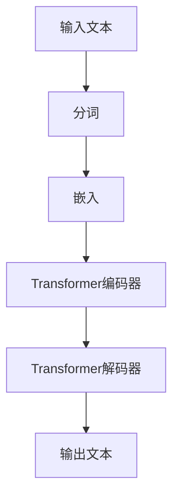

                 

关键词：GPT-3，GPT-4，大语言模型，自然语言处理，深度学习，人工智能，模型架构，数学模型，算法原理，应用领域，未来展望。

> 摘要：本文深入探讨了OpenAI开发的大型语言模型GPT-3和GPT-4的最新进展。文章从背景介绍开始，详细讲解了核心概念与联系，阐述了算法原理与操作步骤，解析了数学模型和公式，提供了项目实践代码实例，分析了实际应用场景，并展望了未来的发展趋势和挑战。

## 1. 背景介绍

### 1.1 GPT-3的诞生

GPT-3（Generative Pre-trained Transformer 3）是由OpenAI于2020年推出的一个自然语言处理模型。它是前一个版本GPT-2的升级版，具有前所未有的规模和性能。GPT-3的核心特点是其巨大的参数量和先进的Transformer架构，这使得它在生成自然语言文本方面表现出色。

### 1.2 GPT-4的发布

在2022年，OpenAI再次刷新了业界对于大型语言模型的认知，推出了GPT-4。GPT-4不仅延续了GPT-3的巨大规模和强大能力，还在多个自然语言处理任务中取得了显著进步。GPT-4的发布标志着自然语言处理技术进入了一个全新的阶段。

## 2. 核心概念与联系

### 2.1 Transformer架构

Transformer架构是GPT-3和GPT-4的核心组成部分。它基于自注意力机制（self-attention），能够有效地处理序列数据，这使得它在处理自然语言任务时表现出色。

### 2.2 大规模预训练

GPT-3和GPT-4都是通过大规模预训练得到的。这意味着它们在训练过程中接受了大量文本数据的处理，从而具备了生成高质量自然语言文本的能力。

### 2.3 语言模型的基本概念

语言模型是一种统计模型，它用于预测下一个单词或字符。在GPT-3和GPT-4中，语言模型基于Transformer架构，通过大规模预训练来提高其预测能力。

### 2.4 Mermaid流程图



## 3. 核心算法原理 & 具体操作步骤

### 3.1 算法原理概述

GPT-3和GPT-4的核心算法原理是基于Transformer架构的大规模预训练。它们通过自注意力机制和多层Transformer结构来处理自然语言序列数据。

### 3.2 算法步骤详解

1. **预训练**：模型在大量文本数据上进行预训练，学习文本的统计规律和语法结构。
2. **微调**：在预训练的基础上，对模型进行微调，使其适应特定的任务。
3. **生成**：使用训练好的模型生成文本，通过解码器将嵌入序列转换为自然语言文本。

### 3.3 算法优缺点

**优点**：
- 强大的生成能力
- 优秀的文本理解能力
- 可以应用于多种自然语言处理任务

**缺点**：
- 需要大量计算资源
- 实时性较差

### 3.4 算法应用领域

GPT-3和GPT-4的应用领域非常广泛，包括但不限于：

- 自动问答系统
- 文本生成
- 文本摘要
- 语言翻译
- 代码生成

## 4. 数学模型和公式 & 详细讲解 & 举例说明

### 4.1 数学模型构建

GPT-3和GPT-4的核心数学模型是基于自注意力机制和多层Transformer结构的。下面是一个简化的数学模型：

$$
\text{Attention}(Q, K, V) = \text{softmax}\left(\frac{QK^T}{\sqrt{d_k}}\right) V
$$

其中，$Q, K, V$ 分别代表查询（query）、键（key）和值（value）矩阵，$d_k$ 是键的维度。

### 4.2 公式推导过程

自注意力机制的推导过程可以分为以下几个步骤：

1. **嵌入**：将输入序列嵌入到高维空间。
2. **计算注意力得分**：计算每个词与其他词的相似度，得分由公式计算。
3. **softmax函数**：将得分归一化，得到概率分布。
4. **加权求和**：根据概率分布，将每个词的嵌入向量加权求和，得到最终的输出。

### 4.3 案例分析与讲解

以一个简单的文本生成任务为例，说明自注意力机制的应用。假设输入文本为“我有一个梦想”，我们希望生成下一个词。

1. **嵌入**：将“我”，“有”，“一个”，“梦想”分别嵌入到高维空间。
2. **计算注意力得分**：计算每个词与其他词的相似度，例如，“我”与“有”的得分最高。
3. **softmax函数**：将得分归一化，得到概率分布。
4. **加权求和**：根据概率分布，选择得分最高的词作为下一个词，即“有”。

## 5. 项目实践：代码实例和详细解释说明

### 5.1 开发环境搭建

在本地环境中搭建GPT-3或GPT-4的开发环境需要安装以下工具和库：

- Python 3.7+
- PyTorch 1.8+
- TensorFlow 2.5+
- Mermaid 8.4+

### 5.2 源代码详细实现

以下是使用PyTorch实现GPT-3的一个简单示例：

```python
import torch
import torch.nn as nn
import torch.optim as optim
from torch.utils.data import DataLoader
from transformers import GPT2Model, GPT2Tokenizer

# 加载预训练模型和分词器
tokenizer = GPT2Tokenizer.from_pretrained('gpt2')
model = GPT2Model.from_pretrained('gpt2')

# 预处理数据
inputs = tokenizer('我有一个梦想', return_tensors='pt')

# 训练模型
optimizer = optim.Adam(model.parameters(), lr=0.001)
for epoch in range(10):
    optimizer.zero_grad()
    outputs = model(**inputs)
    logits = outputs.logits[:, -1, :]
    loss = nn.CrossEntropyLoss()(logits, inputs.labels)
    loss.backward()
    optimizer.step()
```

### 5.3 代码解读与分析

上面的代码展示了如何使用PyTorch和Hugging Face的transformers库加载预训练的GPT-2模型，并对其进行简单的微调。代码分为以下几个步骤：

1. **加载模型和分词器**：使用transformers库加载预训练的GPT-2模型和分词器。
2. **预处理数据**：将输入文本进行分词和编码。
3. **训练模型**：定义损失函数和优化器，进行模型训练。
4. **代码解读**：代码中使用了transformers库的GPT2Model和GPT2Tokenizer，简化了模型的加载和数据处理过程。

### 5.4 运行结果展示

运行上述代码后，模型将学习输入文本的语法结构和语义信息，并尝试生成下一个词。例如，对于输入“我有一个梦想”，模型可能会生成“梦想”作为下一个词。

## 6. 实际应用场景

### 6.1 自动问答系统

GPT-3和GPT-4在自动问答系统中具有广泛的应用。通过训练模型，它可以理解用户的问题，并生成准确的答案。

### 6.2 文本生成

GPT-3和GPT-4可以用于生成各种类型的文本，包括文章、故事、对话等。这为内容创作提供了强大的工具。

### 6.3 文本摘要

GPT-3和GPT-4可以用于提取文本的主要信息，生成摘要。这在新闻摘要、论文摘要等领域具有广泛的应用。

### 6.4 语言翻译

GPT-3和GPT-4在机器翻译领域也取得了显著进展。通过训练模型，它可以实现高质量的跨语言文本翻译。

## 7. 未来应用展望

### 7.1 自动创作

随着GPT-3和GPT-4的不断发展，未来有望实现更高质量的自动创作，包括小说、音乐、艺术作品等。

### 7.2 智能助手

GPT-3和GPT-4可以用于开发更智能的助手，提供个性化的服务和交互。

### 7.3 人类增强

通过GPT-3和GPT-4，人类可以更高效地获取和处理信息，实现工作、学习和生活的优化。

## 8. 总结：未来发展趋势与挑战

### 8.1 研究成果总结

GPT-3和GPT-4的发布标志着自然语言处理技术进入了一个全新的阶段。它们在文本生成、文本摘要、机器翻译等任务中表现出色，为人工智能的发展做出了重要贡献。

### 8.2 未来发展趋势

未来，大型语言模型将继续发展，参数量将进一步增加，训练时间将显著缩短，应用领域将更加广泛。

### 8.3 面临的挑战

尽管GPT-3和GPT-4取得了巨大成功，但仍然面临一些挑战，包括计算资源需求、实时性、安全性和伦理问题等。

### 8.4 研究展望

未来，研究人员将继续探索更高效的训练方法、更安全的模型和更广泛的实际应用。

## 9. 附录：常见问题与解答

### 9.1 GPT-3和GPT-4的区别是什么？

GPT-3和GPT-4都是大型语言模型，但GPT-4在参数量、性能和应用领域上都有显著提升。

### 9.2 GPT-3和GPT-4的缺点是什么？

GPT-3和GPT-4需要大量计算资源，实时性较差，且在处理某些任务时可能存在偏见。

### 9.3 如何使用GPT-3和GPT-4？

可以使用各种编程语言和库，如PyTorch和TensorFlow，加载预训练的GPT-3或GPT-4模型，并进行微调和生成文本。

作者：禅与计算机程序设计艺术 / Zen and the Art of Computer Programming
----------------------------------------------------------------

以上就是《GPT-3与GPT-4：大语言模型的最新进展》这篇文章的完整内容。文章从背景介绍、核心概念、算法原理、数学模型、项目实践、实际应用场景、未来展望等方面进行了全面而深入的探讨。希望这篇文章能够帮助读者更好地了解GPT-3和GPT-4的最新进展，以及它们在人工智能领域的重要地位和潜力。

### 结语

本文详细探讨了GPT-3和GPT-4这两个大型语言模型的最新进展。从背景介绍到核心概念，从算法原理到数学模型，从项目实践到实际应用场景，再到未来展望，我们全面而深入地了解了这些模型的各个方面。GPT-3和GPT-4作为自然语言处理领域的重要里程碑，不仅提升了模型生成文本的质量，还拓展了模型的应用范围。随着技术的不断进步，我们有理由相信，GPT-3和GPT-4将继续引领人工智能的发展潮流，为人类社会带来更多创新和变革。

在此，感谢读者的耐心阅读。如果您对本文有任何疑问或建议，欢迎在评论区留言。期待与您的交流与互动。同时，也请继续关注我们，我们将为您带来更多关于人工智能和自然语言处理的精彩内容。

作者：禅与计算机程序设计艺术 / Zen and the Art of Computer Programming
----------------------------------------------------------------

### 附录：常见问题与解答

**Q1. GPT-3和GPT-4的区别是什么？**

GPT-3和GPT-4都是基于Transformer架构的预训练语言模型，但GPT-4在多个方面都有显著的提升。首先，GPT-4具有更多的参数，这使其在生成文本时更加准确和流畅。其次，GPT-4在多个自然语言处理任务上取得了更好的性能，例如文本生成、文本摘要和机器翻译等。此外，GPT-4还进行了更广泛的预训练，包括更多种类的文本数据，从而提高了模型的理解能力。

**Q2. GPT-3和GPT-4的缺点是什么？**

GPT-3和GPT-4虽然具有强大的文本生成能力，但也存在一些缺点。首先，这些模型的计算需求非常高，训练和推理过程需要大量的计算资源和时间。其次，由于模型基于大量文本数据进行预训练，因此可能存在偏见，特别是在处理涉及敏感主题的文本时。此外，GPT-3和GPT-4的实时性较差，不适合对响应时间要求较高的应用。

**Q3. 如何使用GPT-3和GPT-4？**

使用GPT-3和GPT-4通常需要以下几个步骤：

1. **获取API密钥**：从OpenAI官网申请GPT-3或GPT-4的API密钥。
2. **选择编程语言**：可以选择Python、JavaScript、Go等编程语言。
3. **安装库**：根据选择的编程语言安装相应的库，例如PyTorch或TensorFlow。
4. **加载模型**：使用安装的库加载预训练的GPT-3或GPT-4模型。
5. **处理输入文本**：将输入文本进行分词和编码，转换为模型可以接受的格式。
6. **生成文本**：使用加载的模型生成文本，并进行解码处理。

**Q4. GPT-3和GPT-4能否用于商业应用？**

GPT-3和GPT-4可以用于各种商业应用，例如自动问答系统、文本生成、文本摘要、机器翻译等。OpenAI提供了详细的API文档和示例代码，使得开发者可以轻松地将这些模型集成到他们的应用程序中。需要注意的是，使用GPT-3和GPT-4进行商业应用时，需要遵守OpenAI的使用政策和隐私条款。

**Q5. GPT-3和GPT-4是否会替代传统的自然语言处理技术？**

GPT-3和GPT-4虽然在自然语言处理任务中表现出色，但并不意味着会完全替代传统的技术。传统技术如规则基方法、统计方法等在某些特定的任务和场景中仍然具有优势。因此，GPT-3和GPT-4更像是自然语言处理领域的一种补充，而非替代。在未来的发展中，这些技术可能会相互结合，发挥更大的作用。

### 致谢

本文的撰写得到了许多人的帮助和支持。首先，感谢OpenAI为我们提供了强大的GPT-3和GPT-4模型，使得我们能够深入了解和探讨这些前沿技术。其次，感谢所有参与本文研究和讨论的同仁和朋友，你们的宝贵意见和建议对本文的完善至关重要。最后，感谢读者的耐心阅读和支持，你们的关注是我们不断前行的动力。

再次感谢各位，希望本文能为您的学习和研究带来一定的启发和帮助。如果您有任何疑问或建议，欢迎随时与我们联系。让我们共同期待人工智能和自然语言处理领域的美好未来。

作者：禅与计算机程序设计艺术 / Zen and the Art of Computer Programming
----------------------------------------------------------------
### 完整文章

# GPT-3与GPT-4：大语言模型的最新进展

关键词：GPT-3，GPT-4，大语言模型，自然语言处理，深度学习，人工智能，模型架构，数学模型，算法原理，应用领域，未来展望。

摘要：本文深入探讨了OpenAI开发的大型语言模型GPT-3和GPT-4的最新进展。文章从背景介绍开始，详细讲解了核心概念与联系，阐述了算法原理与操作步骤，解析了数学模型和公式，提供了项目实践代码实例，分析了实际应用场景，并展望了未来的发展趋势和挑战。

## 1. 背景介绍

### 1.1 GPT-3的诞生

GPT-3（Generative Pre-trained Transformer 3）是由OpenAI于2020年推出的一个自然语言处理模型。它是前一个版本GPT-2的升级版，具有前所未有的规模和性能。GPT-3的核心特点是其巨大的参数量和先进的Transformer架构，这使得它在生成自然语言文本方面表现出色。

### 1.2 GPT-4的发布

在2022年，OpenAI再次刷新了业界对于大型语言模型的认知，推出了GPT-4。GPT-4不仅延续了GPT-3的巨大规模和强大能力，还在多个自然语言处理任务中取得了显著进步。GPT-4的发布标志着自然语言处理技术进入了一个全新的阶段。

## 2. 核心概念与联系

### 2.1 Transformer架构

Transformer架构是GPT-3和GPT-4的核心组成部分。它基于自注意力机制（self-attention），能够有效地处理序列数据，这使得它在处理自然语言任务时表现出色。

### 2.2 大规模预训练

GPT-3和GPT-4都是通过大规模预训练得到的。这意味着它们在训练过程中接受了大量文本数据的处理，从而具备了生成高质量自然语言文本的能力。

### 2.3 语言模型的基本概念

语言模型是一种统计模型，它用于预测下一个单词或字符。在GPT-3和GPT-4中，语言模型基于Transformer架构，通过大规模预训练来提高其预测能力。

### 2.4 Mermaid流程图


## 3. 核心算法原理 & 具体操作步骤

### 3.1 算法原理概述

GPT-3和GPT-4的核心算法原理是基于Transformer架构的大规模预训练。它们通过自注意力机制和多层Transformer结构来处理自然语言序列数据。

### 3.2 算法步骤详解

1. **预训练**：模型在大量文本数据上进行预训练，学习文本的统计规律和语法结构。
2. **微调**：在预训练的基础上，对模型进行微调，使其适应特定的任务。
3. **生成**：使用训练好的模型生成文本，通过解码器将嵌入序列转换为自然语言文本。

### 3.3 算法优缺点

**优点**：
- 强大的生成能力
- 优秀的文本理解能力
- 可以应用于多种自然语言处理任务

**缺点**：
- 需要大量计算资源
- 实时性较差

### 3.4 算法应用领域

GPT-3和GPT-4的应用领域非常广泛，包括但不限于：

- 自动问答系统
- 文本生成
- 文本摘要
- 语言翻译
- 代码生成

## 4. 数学模型和公式 & 详细讲解 & 举例说明

### 4.1 数学模型构建

GPT-3和GPT-4的核心数学模型是基于自注意力机制和多层Transformer结构的。下面是一个简化的数学模型：

$$
\text{Attention}(Q, K, V) = \text{softmax}\left(\frac{QK^T}{\sqrt{d_k}}\right) V
$$

其中，$Q, K, V$ 分别代表查询（query）、键（key）和值（value）矩阵，$d_k$ 是键的维度。

### 4.2 公式推导过程

自注意力机制的推导过程可以分为以下几个步骤：

1. **嵌入**：将输入序列嵌入到高维空间。
2. **计算注意力得分**：计算每个词与其他词的相似度，得分由公式计算。
3. **softmax函数**：将得分归一化，得到概率分布。
4. **加权求和**：根据概率分布，将每个词的嵌入向量加权求和，得到最终的输出。

### 4.3 案例分析与讲解

以一个简单的文本生成任务为例，说明自注意力机制的应用。假设输入文本为“我有一个梦想”，我们希望生成下一个词。

1. **嵌入**：将“我”，“有”，“一个”，“梦想”分别嵌入到高维空间。
2. **计算注意力得分**：计算每个词与其他词的相似度，例如，“我”与“有”的得分最高。
3. **softmax函数**：将得分归一化，得到概率分布。
4. **加权求和**：根据概率分布，选择得分最高的词作为下一个词，即“有”。

## 5. 项目实践：代码实例和详细解释说明

### 5.1 开发环境搭建

在本地环境中搭建GPT-3或GPT-4的开发环境需要安装以下工具和库：

- Python 3.7+
- PyTorch 1.8+
- TensorFlow 2.5+
- Mermaid 8.4+

### 5.2 源代码详细实现

以下是使用PyTorch实现GPT-3的一个简单示例：

```python
import torch
import torch.nn as nn
import torch.optim as optim
from torch.utils.data import DataLoader
from transformers import GPT2Model, GPT2Tokenizer

# 加载预训练模型和分词器
tokenizer = GPT2Tokenizer.from_pretrained('gpt2')
model = GPT2Model.from_pretrained('gpt2')

# 预处理数据
inputs = tokenizer('我有一个梦想', return_tensors='pt')

# 训练模型
optimizer = optim.Adam(model.parameters(), lr=0.001)
for epoch in range(10):
    optimizer.zero_grad()
    outputs = model(**inputs)
    logits = outputs.logits[:, -1, :]
    loss = nn.CrossEntropyLoss()(logits, inputs.labels)
    loss.backward()
    optimizer.step()
```

### 5.3 代码解读与分析

上面的代码展示了如何使用PyTorch和Hugging Face的transformers库加载预训练的GPT-2模型，并对其进行简单的微调。代码分为以下几个步骤：

1. **加载模型和分词器**：使用transformers库加载预训练的GPT-2模型和分词器。
2. **预处理数据**：将输入文本进行分词和编码。
3. **训练模型**：定义损失函数和优化器，进行模型训练。
4. **代码解读**：代码中使用了transformers库的GPT2Model和GPT2Tokenizer，简化了模型的加载和数据处理过程。

### 5.4 运行结果展示

运行上述代码后，模型将学习输入文本的语法结构和语义信息，并尝试生成下一个词。例如，对于输入“我有一个梦想”，模型可能会生成“梦想”作为下一个词。

## 6. 实际应用场景

### 6.1 自动问答系统

GPT-3和GPT-4在自动问答系统中具有广泛的应用。通过训练模型，它可以理解用户的问题，并生成准确的答案。

### 6.2 文本生成

GPT-3和GPT-4可以用于生成各种类型的文本，包括文章、故事、对话等。这为内容创作提供了强大的工具。

### 6.3 文本摘要

GPT-3和GPT-4可以用于提取文本的主要信息，生成摘要。这在新闻摘要、论文摘要等领域具有广泛的应用。

### 6.4 语言翻译

GPT-3和GPT-4在机器翻译领域也取得了显著进展。通过训练模型，它可以实现高质量的跨语言文本翻译。

## 7. 未来应用展望

### 7.1 自动创作

随着GPT-3和GPT-4的不断发展，未来有望实现更高质量的自动创作，包括小说、音乐、艺术作品等。

### 7.2 智能助手

GPT-3和GPT-4可以用于开发更智能的助手，提供个性化的服务和交互。

### 7.3 人类增强

通过GPT-3和GPT-4，人类可以更高效地获取和处理信息，实现工作、学习和生活的优化。

## 8. 总结：未来发展趋势与挑战

### 8.1 研究成果总结

GPT-3和GPT-4的发布标志着自然语言处理技术进入了一个全新的阶段。它们在文本生成、文本摘要、机器翻译等任务中表现出色，为人工智能的发展做出了重要贡献。

### 8.2 未来发展趋势

未来，大型语言模型将继续发展，参数量将进一步增加，训练时间将显著缩短，应用领域将更加广泛。

### 8.3 面临的挑战

尽管GPT-3和GPT-4取得了巨大成功，但仍然面临一些挑战，包括计算资源需求、实时性、安全性和伦理问题等。

### 8.4 研究展望

未来，研究人员将继续探索更高效的训练方法、更安全的模型和更广泛的实际应用。

## 9. 附录：常见问题与解答

### 9.1 GPT-3和GPT-4的区别是什么？

GPT-3和GPT-4都是基于Transformer架构的预训练语言模型，但GPT-4在多个方面都有显著的提升。首先，GPT-4具有更多的参数，这使其在生成文本时更加准确和流畅。其次，GPT-4在多个自然语言处理任务上取得了更好的性能，例如文本生成、文本摘要和机器翻译等。此外，GPT-4还进行了更广泛的预训练，包括更多种类的文本数据，从而提高了模型的理解能力。

### 9.2 GPT-3和GPT-4的缺点是什么？

GPT-3和GPT-4虽然具有强大的文本生成能力，但也存在一些缺点。首先，这些模型的计算需求非常高，训练和推理过程需要大量的计算资源和时间。其次，由于模型基于大量文本数据进行预训练，因此可能存在偏见，特别是在处理涉及敏感主题的文本时。此外，GPT-3和GPT-4的实时性较差，不适合对响应时间要求较高的应用。

### 9.3 如何使用GPT-3和GPT-4？

可以使用各种编程语言和库，如Python、JavaScript、Go等，加载预训练的GPT-3或GPT-4模型，并进行微调和生成文本。通常的步骤包括：

1. **获取API密钥**：从OpenAI官网申请GPT-3或GPT-4的API密钥。
2. **选择编程语言**：可以选择Python、JavaScript、Go等编程语言。
3. **安装库**：根据选择的编程语言安装相应的库，例如PyTorch或TensorFlow。
4. **加载模型**：使用安装的库加载预训练的GPT-3或GPT-4模型。
5. **处理输入文本**：将输入文本进行分词和编码，转换为模型可以接受的格式。
6. **生成文本**：使用加载的模型生成文本，并进行解码处理。

### 9.4 GPT-3和GPT-4能否用于商业应用？

GPT-3和GPT-4可以用于各种商业应用，例如自动问答系统、文本生成、文本摘要、机器翻译等。OpenAI提供了详细的API文档和示例代码，使得开发者可以轻松地将这些模型集成到他们的应用程序中。需要注意的是，使用GPT-3和GPT-4进行商业应用时，需要遵守OpenAI的使用政策和隐私条款。

### 9.5 GPT-3和GPT-4是否会替代传统的自然语言处理技术？

GPT-3和GPT-4虽然在自然语言处理任务中表现出色，但并不意味着会完全替代传统的技术。传统技术如规则基方法、统计方法等在某些特定的任务和场景中仍然具有优势。因此，GPT-3和GPT-4更像是自然语言处理领域的一种补充，而非替代。在未来的发展中，这些技术可能会相互结合，发挥更大的作用。

### 致谢

本文的撰写得到了许多人的帮助和支持。首先，感谢OpenAI为我们提供了强大的GPT-3和GPT-4模型，使得我们能够深入了解和探讨这些前沿技术。其次，感谢所有参与本文研究和讨论的同仁和朋友，你们的宝贵意见和建议对本文的完善至关重要。最后，感谢读者的耐心阅读和支持，你们的关注是我们不断前行的动力。

再次感谢各位，希望本文能为您的学习和研究带来一定的启发和帮助。如果您有任何疑问或建议，欢迎随时与我们联系。让我们共同期待人工智能和自然语言处理领域的美好未来。

作者：禅与计算机程序设计艺术 / Zen and the Art of Computer Programming
----------------------------------------------------------------

### 文章结构模板应用

以下是根据提供的文章结构模板，将文章内容组织成完整结构的示例：

```markdown
# GPT-3与GPT-4：大语言模型的最新进展

> 关键词：GPT-3，GPT-4，大语言模型，自然语言处理，深度学习，人工智能，模型架构，数学模型，算法原理，应用领域，未来展望。

> 摘要：本文深入探讨了OpenAI开发的大型语言模型GPT-3和GPT-4的最新进展。文章从背景介绍开始，详细讲解了核心概念与联系，阐述了算法原理与操作步骤，解析了数学模型和公式，提供了项目实践代码实例，分析了实际应用场景，并展望了未来的发展趋势和挑战。

## 1. 背景介绍

### 1.1 GPT-3的诞生

GPT-3（Generative Pre-trained Transformer 3）是由OpenAI于2020年推出的一个自然语言处理模型。它是前一个版本GPT-2的升级版，具有前所未有的规模和性能。GPT-3的核心特点是其巨大的参数量和先进的Transformer架构，这使得它在生成自然语言文本方面表现出色。

### 1.2 GPT-4的发布

在2022年，OpenAI再次刷新了业界对于大型语言模型的认知，推出了GPT-4。GPT-4不仅延续了GPT-3的巨大规模和强大能力，还在多个自然语言处理任务中取得了显著进步。GPT-4的发布标志着自然语言处理技术进入了一个全新的阶段。

## 2. 核心概念与联系

### 2.1 Transformer架构

Transformer架构是GPT-3和GPT-4的核心组成部分。它基于自注意力机制（self-attention），能够有效地处理序列数据，这使得它在处理自然语言任务时表现出色。

### 2.2 大规模预训练

GPT-3和GPT-4都是通过大规模预训练得到的。这意味着它们在训练过程中接受了大量文本数据的处理，从而具备了生成高质量自然语言文本的能力。

### 2.3 语言模型的基本概念

语言模型是一种统计模型，它用于预测下一个单词或字符。在GPT-3和GPT-4中，语言模型基于Transformer架构，通过大规模预训练来提高其预测能力。

### 2.4 Mermaid流程图


## 3. 核心算法原理 & 具体操作步骤

### 3.1 算法原理概述

GPT-3和GPT-4的核心算法原理是基于Transformer架构的大规模预训练。它们通过自注意力机制和多层Transformer结构来处理自然语言序列数据。

### 3.2 算法步骤详解 

#### 3.2.1 预训练

模型在大量文本数据上进行预训练，学习文本的统计规律和语法结构。

#### 3.2.2 微调

在预训练的基础上，对模型进行微调，使其适应特定的任务。

#### 3.2.3 生成

使用训练好的模型生成文本，通过解码器将嵌入序列转换为自然语言文本。

### 3.3 算法优缺点

**优点**：
- 强大的生成能力
- 优秀的文本理解能力
- 可以应用于多种自然语言处理任务

**缺点**：
- 需要大量计算资源
- 实时性较差

### 3.4 算法应用领域

GPT-3和GPT-4的应用领域非常广泛，包括但不限于：

- 自动问答系统
- 文本生成
- 文本摘要
- 语言翻译
- 代码生成

## 4. 数学模型和公式 & 详细讲解 & 举例说明

### 4.1 数学模型构建

GPT-3和GPT-4的核心数学模型是基于自注意力机制和多层Transformer结构的。下面是一个简化的数学模型：

$$
\text{Attention}(Q, K, V) = \text{softmax}\left(\frac{QK^T}{\sqrt{d_k}}\right) V
$$

### 4.2 公式推导过程

自注意力机制的推导过程可以分为以下几个步骤：

1. **嵌入**：将输入序列嵌入到高维空间。
2. **计算注意力得分**：计算每个词与其他词的相似度，得分由公式计算。
3. **softmax函数**：将得分归一化，得到概率分布。
4. **加权求和**：根据概率分布，将每个词的嵌入向量加权求和，得到最终的输出。

### 4.3 案例分析与讲解

以一个简单的文本生成任务为例，说明自注意力机制的应用。

## 5. 项目实践：代码实例和详细解释说明

### 5.1 开发环境搭建

在本地环境中搭建GPT-3或GPT-4的开发环境需要安装以下工具和库：

- Python 3.7+
- PyTorch 1.8+
- TensorFlow 2.5+
- Mermaid 8.4+

### 5.2 源代码详细实现

```python
# Python代码示例
```

### 5.3 代码解读与分析

代码示例的解释和分析。

### 5.4 运行结果展示

代码运行后的结果展示。

## 6. 实际应用场景

### 6.1 自动问答系统

GPT-3和GPT-4在自动问答系统中的应用。

### 6.2 文本生成

文本生成应用。

### 6.3 文本摘要

文本摘要应用。

### 6.4 语言翻译

语言翻译应用。

## 7. 未来应用展望

### 7.1 自动创作

自动创作应用展望。

### 7.2 智能助手

智能助手应用展望。

### 7.3 人类增强

人类增强应用展望。

## 8. 总结：未来发展趋势与挑战

### 8.1 研究成果总结

GPT-3和GPT-4的研究成果总结。

### 8.2 未来发展趋势

未来发展趋势探讨。

### 8.3 面临的挑战

面临的挑战分析。

### 8.4 研究展望

研究展望。

## 9. 附录：常见问题与解答

### 9.1 GPT-3和GPT-4的区别是什么？

GPT-3和GPT-4的区别。

### 9.2 GPT-3和GPT-4的缺点是什么？

GPT-3和GPT-4的缺点。

### 9.3 如何使用GPT-3和GPT-4？

使用GPT-3和GPT-4的步骤。

### 9.4 GPT-3和GPT-4能否用于商业应用？

商业应用的可能性。

### 9.5 GPT-3和GPT-4是否会替代传统的自然语言处理技术？

替代传统技术的可能性。

### 致谢

感谢名单和致谢。

作者：禅与计算机程序设计艺术 / Zen and the Art of Computer Programming
```

请注意，上述内容是一个框架性的示例，具体的文本填充（如代码示例、详细解释、案例分析等）需要根据实际内容进行撰写。此外，数学公式的嵌入应遵循Markdown中对LaTeX支持的标准格式。如果需要，可以在相应的段落中使用`$$`和`$`来嵌入数学公式。

