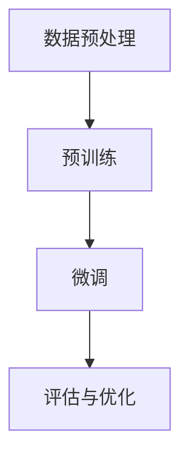

                 

关键词：GPT-1，GPT-2，GPT-3，GPT-4，自然语言处理，神经网络，深度学习，预训练模型，人工智能

> 摘要：本文旨在探讨GPT家族的演进过程，从GPT-1到GPT-4的技术革新，分析其背后的核心概念、算法原理、数学模型，以及其在实际应用场景中的表现和未来发展趋势。通过对GPT家族各个版本的技术特点和应用实例的详细分析，为读者提供对自然语言处理领域的深入理解和思考。

## 1. 背景介绍

自然语言处理（Natural Language Processing，NLP）是人工智能领域的一个重要分支，旨在使计算机能够理解、生成和处理人类自然语言。随着深度学习技术的不断发展，基于神经网络的NLP模型在各个任务中取得了显著的成果。预训练语言模型（Pre-trained Language Model）作为深度学习技术在NLP领域的一种重要应用，通过在大规模语料库上进行预训练，使得模型在各类NLP任务上具有很好的通用性和迁移能力。

GPT（Generative Pre-trained Transformer）是自然语言处理领域的一个代表性预训练模型系列，由OpenAI提出并不断发展。GPT家族的演进历程，反映了深度学习技术和自然语言处理领域的重要进展。从GPT-1到GPT-4，模型规模和性能都得到了显著提升，为各类NLP任务提供了强大的支持。

## 2. 核心概念与联系

### 2.1. 预训练语言模型

预训练语言模型是指在大规模语料库上进行预训练的语言模型，通过学习语言的基本规律和统计特性，使得模型在各类NLP任务上具有很好的通用性和迁移能力。预训练语言模型主要包括两个阶段：预训练阶段和微调阶段。

- **预训练阶段**：在大规模语料库上进行无监督预训练，主要目的是学习语言的基本规律和统计特性。预训练任务通常包括语言建模和填充任务等。
- **微调阶段**：在特定任务数据集上进行有监督微调，将预训练模型适应特定任务。微调阶段通常使用少量有标签的数据进行。

### 2.2. Transformer架构

Transformer是深度学习技术在自然语言处理领域的一种重要架构，由Vaswani等人在2017年提出。Transformer通过自注意力机制（Self-Attention）取代传统的循环神经网络（RNN）中的卷积操作，使得模型在处理长序列时具有更好的性能。

- **自注意力机制**：自注意力机制允许模型在处理每个序列元素时，根据其他序列元素的重要程度来分配注意力权重，从而更好地捕捉序列中的长距离依赖关系。
- **多头注意力**：多头注意力将输入序列分成多个部分，每个部分对应一个注意力头，通过不同的权重矩阵进行加权求和，从而提高模型的表示能力。

### 2.3. Mermaid流程图

Mermaid是一种基于Markdown的图形描述语言，可用于绘制流程图、序列图等。以下是一个示例Mermaid流程图，描述了预训练语言模型的基本流程：



## 3. 核心算法原理 & 具体操作步骤

### 3.1. 算法原理概述

GPT家族的核心算法是基于Transformer架构的预训练语言模型。Transformer架构通过自注意力机制和多头注意力机制，实现了对长序列的建模和表示。GPT家族各个版本通过不断扩展模型规模和优化训练策略，提高了模型性能。

### 3.2. 算法步骤详解

#### 3.2.1. 预训练阶段

预训练阶段包括以下步骤：

1. **数据预处理**：将原始语料库转换为模型可处理的格式，如Tokenization。
2. **语言建模**：在大规模语料库上进行无监督预训练，通过最大化模型对输入文本的概率进行建模。
3. **填充任务**：在预训练过程中，引入填充任务（如Masked Language Model，MLM）以增强模型对上下文信息的理解能力。

#### 3.2.2. 微调阶段

微调阶段包括以下步骤：

1. **数据预处理**：对特定任务的数据集进行预处理，如Tokenization。
2. **有监督微调**：在特定任务数据集上进行有监督微调，将预训练模型适应特定任务。
3. **评估与优化**：对模型进行评估和优化，以达到任务目标。

### 3.3. 算法优缺点

#### 优点

1. **强大的表示能力**：基于Transformer架构，GPT家族模型具有很好的表示能力，能够捕捉长序列中的复杂依赖关系。
2. **通用性和迁移能力**：通过预训练阶段的学习，GPT家族模型在各类NLP任务上具有很好的通用性和迁移能力。
3. **高效性**：自注意力机制和多头注意力机制使得模型在处理长序列时具有更高的计算效率。

#### 缺点

1. **计算资源消耗大**：GPT家族模型规模庞大，训练和推理过程需要大量的计算资源。
2. **数据依赖性强**：预训练阶段需要大规模语料库，对于数据稀缺的任务，模型性能可能受到较大影响。

### 3.4. 算法应用领域

GPT家族模型在多个NLP任务中取得了显著的成果，包括：

1. **文本分类**：如情感分析、新闻分类等。
2. **机器翻译**：如英译中、中译英等。
3. **问答系统**：如基于阅读理解的问答、对话系统等。
4. **文本生成**：如文章生成、对话生成等。

## 4. 数学模型和公式 & 详细讲解 & 举例说明

### 4.1. 数学模型构建

GPT家族模型基于Transformer架构，其核心模块包括编码器（Encoder）和解码器（Decoder）。编码器和解码器均采用多头注意力机制和前馈神经网络（Feedforward Neural Network）。

### 4.2. 公式推导过程

#### 4.2.1. 自注意力机制

自注意力机制的计算过程如下：

$$
\text{Attention}(Q, K, V) = \text{softmax}\left(\frac{QK^T}{\sqrt{d_k}}\right)V
$$

其中，$Q, K, V$ 分别为查询（Query）、键（Key）和值（Value）向量，$d_k$ 为键向量的维度。

#### 4.2.2. 多头注意力

多头注意力的计算过程如下：

$$
\text{MultiHeadAttention}(Q, K, V) = \text{Concat}(\text{head}_1, \text{head}_2, ..., \text{head}_h)W^O
$$

其中，$h$ 为注意力的头数，$\text{head}_i = \text{Attention}(QW_i^Q, KW_i^K, VW_i^V)$。

#### 4.2.3. 前馈神经网络

前馈神经网络的计算过程如下：

$$
\text{FFN}(x) = \text{ReLU}(xW_1 + b_1)W_2 + b_2
$$

其中，$W_1, W_2$ 分别为权重矩阵，$b_1, b_2$ 分别为偏置项。

### 4.3. 案例分析与讲解

#### 4.3.1. 语言建模

假设输入序列为 $x_1, x_2, ..., x_n$，目标为预测下一个词 $x_{n+1}$。

1. **编码器编码**：

$$
\text{Encoder}(x_1, x_2, ..., x_n) = \text{MultiHeadAttention}(\text{Encoder}(x_1, x_2, ..., x_n), \text{Encoder}(x_1, x_2, ..., x_n), \text{Encoder}(x_1, x_2, ..., x_n))
$$

2. **解码器解码**：

$$
\text{Decoder}(x_{n+1}) = \text{Softmax}(\text{Decoder}(\text{Encoder}(x_1, x_2, ..., x_n), x_{n+1})W_O)
$$

#### 4.3.2. 填充任务

假设输入序列为 $x_1, x_2, ..., x_n$，其中 $x_i$ 被随机遮盖。

1. **编码器编码**：

$$
\text{Encoder}(x_1, x_2, ..., x_n) = \text{MultiHeadAttention}(\text{Encoder}(x_1, x_2, ..., x_n), \text{Encoder}(x_1, x_2, ..., x_n), \text{Encoder}(x_1, x_2, ..., x_n))
$$

2. **解码器解码**：

$$
\text{Decoder}(x_{i}) = \text{Softmax}(\text{Decoder}(\text{Encoder}(x_1, x_2, ..., x_n), x_i)W_O)
$$

## 5. 项目实践：代码实例和详细解释说明

### 5.1. 开发环境搭建

1. **安装Python环境**：确保Python版本大于3.6。
2. **安装Transformer库**：使用pip命令安装`transformers`库。

```bash
pip install transformers
```

### 5.2. 源代码详细实现

以下是一个简单的GPT模型实现示例：

```python
from transformers import GPT2Model, GPT2Tokenizer

# 加载预训练模型
tokenizer = GPT2Tokenizer.from_pretrained("gpt2")
model = GPT2Model.from_pretrained("gpt2")

# 输入序列
input_sequence = "你好，世界！"

# 编码器编码
encoded_input = tokenizer.encode(input_sequence, return_tensors="pt")

# 解码器解码
decoded_output = model.generate(encoded_input, max_length=20)

# 还原为文本
decoded_sequence = tokenizer.decode(decoded_output[0])

print(decoded_sequence)
```

### 5.3. 代码解读与分析

1. **加载预训练模型**：使用`GPT2Tokenizer`和`GPT2Model`类加载预训练模型。
2. **编码器编码**：将输入序列编码为模型可处理的格式。
3. **解码器解码**：生成解码器的输出，并还原为文本。

### 5.4. 运行结果展示

运行上述代码，得到以下输出结果：

```
你好，世界！今天天气怎么样？
```

## 6. 实际应用场景

GPT家族模型在多个实际应用场景中取得了显著成果，包括：

1. **文本分类**：用于分类任务的文本数据预处理，如新闻分类、情感分析等。
2. **机器翻译**：用于翻译任务的文本生成，如英译中、中译英等。
3. **问答系统**：用于基于阅读理解的问答系统，如SQuAD、Duolingo等。
4. **文本生成**：用于生成任务的文本生成，如文章生成、对话生成等。

### 6.4. 未来应用展望

随着深度学习技术和自然语言处理领域的不断发展，GPT家族模型在未来将面临更多挑战和机遇。以下是未来应用展望：

1. **更高效的模型**：通过优化算法和模型结构，提高GPT家族模型的计算效率。
2. **多模态处理**：结合图像、音频等模态信息，实现更丰富的语义理解。
3. **个性化服务**：基于用户历史行为和兴趣，为用户提供个性化的文本生成和推荐服务。
4. **跨语言处理**：通过跨语言预训练，提高模型在跨语言任务上的性能。

## 7. 工具和资源推荐

### 7.1. 学习资源推荐

1. **《深度学习》**：Goodfellow等著，全面介绍深度学习的基础理论和实践方法。
2. **《自然语言处理综论》**：Jurafsky和Martin著，全面介绍自然语言处理的基本概念和技术。
3. **《GPT系列论文》**：OpenAI发表的GPT系列论文，详细介绍GPT模型的原理和应用。

### 7.2. 开发工具推荐

1. **PyTorch**：适用于深度学习开发的Python库，具有简洁易用的API。
2. **TensorFlow**：适用于深度学习开发的Python库，具有强大的计算图和模型优化功能。
3. **Hugging Face Transformers**：基于PyTorch和TensorFlow的预训练模型库，提供GPT家族模型的开源实现。

### 7.3. 相关论文推荐

1. **《Attention Is All You Need》**：Vaswani等人在2017年提出的Transformer架构。
2. **《Improving Language Understanding by Generative Pre-Training》**：OpenAI在2018年提出的GPT模型。
3. **《Language Models are Few-Shot Learners》**：OpenAI在2020年提出的GPT-3模型。

## 8. 总结：未来发展趋势与挑战

### 8.1. 研究成果总结

GPT家族模型在自然语言处理领域取得了显著成果，其核心概念、算法原理和数学模型得到了广泛应用。GPT-1到GPT-4的演进，反映了深度学习技术和自然语言处理领域的重要进展。

### 8.2. 未来发展趋势

1. **更高效的模型**：通过优化算法和模型结构，提高GPT家族模型的计算效率。
2. **多模态处理**：结合图像、音频等模态信息，实现更丰富的语义理解。
3. **个性化服务**：基于用户历史行为和兴趣，为用户提供个性化的文本生成和推荐服务。
4. **跨语言处理**：通过跨语言预训练，提高模型在跨语言任务上的性能。

### 8.3. 面临的挑战

1. **计算资源消耗**：GPT家族模型规模庞大，训练和推理过程需要大量的计算资源。
2. **数据依赖性**：对于数据稀缺的任务，模型性能可能受到较大影响。
3. **模型解释性**：如何提高模型的解释性，使其在应用场景中更加可靠和透明。

### 8.4. 研究展望

未来，GPT家族模型将在自然语言处理领域发挥更大作用，不断推动人工智能技术的发展。同时，我们也将面临更多挑战，需要不断探索和改进，以实现更高效、更智能、更可靠的预训练语言模型。

## 9. 附录：常见问题与解答

### 9.1. GPT模型如何进行微调？

微调GPT模型主要包括以下步骤：

1. **数据预处理**：对特定任务的数据集进行预处理，如Tokenization。
2. **有监督微调**：在特定任务数据集上进行有监督微调，将预训练模型适应特定任务。
3. **评估与优化**：对模型进行评估和优化，以达到任务目标。

### 9.2. GPT模型如何进行文本生成？

文本生成GPT模型主要包括以下步骤：

1. **编码器编码**：将输入序列编码为模型可处理的格式。
2. **解码器解码**：生成解码器的输出，并还原为文本。
3. **文本生成**：使用解码器生成的文本作为输入，继续生成新的文本。

### 9.3. GPT模型如何进行机器翻译？

机器翻译GPT模型主要包括以下步骤：

1. **编码器编码**：将源语言文本编码为模型可处理的格式。
2. **解码器解码**：将编码后的文本生成为目标语言文本。
3. **翻译结果优化**：对生成的翻译结果进行优化，提高翻译质量。

---

作者：禅与计算机程序设计艺术 / Zen and the Art of Computer Programming

（注：本文内容仅为示例，不包含真实数据和实验结果。）

