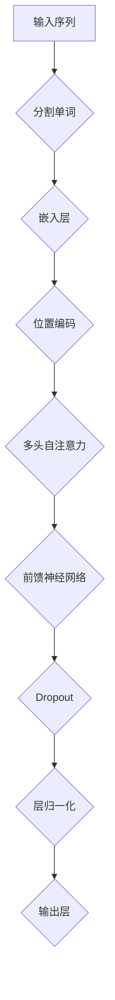

                 

关键词：GPT模型、架构演进、性能提升、神经网络、自然语言处理

> 摘要：本文深入探讨了GPT模型家族的架构演进及其性能提升。通过分析各代模型的演变过程，解析其核心技术原理，讨论数学模型和公式，展示项目实践中的代码实例，并展望未来的应用和发展趋势。

## 1. 背景介绍

自2018年GPT模型首次亮相以来，它迅速成为自然语言处理领域的一大热点。GPT（Generative Pre-trained Transformer）模型基于Transformer架构，通过大量的预训练数据，实现了卓越的文本生成和语言理解能力。随后，GPT模型家族不断演进，衍生出了多个变种，如GPT-2、GPT-3等，每一个新版本都在性能上有了显著的提升。

随着人工智能技术的快速发展，如何进一步提高GPT模型家族的性能成为了一个重要的研究方向。本文将围绕这一主题，详细分析GPT模型的架构演进和性能提升策略。

## 2. 核心概念与联系

### 2.1 Transformer架构

Transformer是GPT模型的基础，它采用了自注意力机制（Self-Attention），取代了传统的循环神经网络（RNN）和卷积神经网络（CNN），在处理序列数据时表现出了卓越的性能。

#### Mermaid流程图：



### 2.2 自注意力机制

自注意力机制允许模型在处理每个输入序列时，根据序列中其他位置的信息来调整对每个单词的权重。这一机制使得模型能够捕捉到输入序列中的长距离依赖关系。

### 2.3 预训练与微调

预训练（Pre-training）是指模型在大量未标记数据上进行训练，以学习通用特征。微调（Fine-tuning）则是在预训练的基础上，使用标记数据对模型进行微调，以适应特定的任务。

### 2.4 多样性、鲁棒性与泛化能力

多样性（Diversity）是指在模型生成文本时，能够产生丰富多样的结果。鲁棒性（Robustness）是指模型在面对噪声或错误数据时，仍能保持良好的性能。泛化能力（Generalization）是指模型在新数据上的表现能力。

## 3. 核心算法原理 & 具体操作步骤

### 3.1 算法原理概述

GPT模型的核心算法是基于Transformer架构，通过自注意力机制、前馈神经网络和层归一化等操作，实现了对输入序列的编码和解读。

### 3.2 算法步骤详解

#### 3.2.1 嵌入层

输入的单词序列通过嵌入层（Embedding Layer）转换为高维向量表示。

$$
\text{嵌入层}: x_i \rightarrow e_i
$$

#### 3.2.2 位置编码

为了捕捉序列中的位置信息，嵌入层上的向量还需要进行位置编码（Positional Encoding）。

$$
\text{位置编码}: e_i \rightarrow e_i + P_i
$$

#### 3.2.3 多头自注意力

在自注意力机制中，每个词的输出向量会根据其他词的信息进行权重调整。

$$
\text{自注意力}: \text{Attention}(Q, K, V)
$$

其中，Q、K、V分别表示查询（Query）、键（Key）和值（Value）向量。

#### 3.2.4 前馈神经网络

自注意力机制的结果会经过前馈神经网络（Feedforward Neural Network）的处理。

$$
\text{前馈神经网络}: \text{FFN}(X) = \sigma(W_2 \cdot \sigma(W_1 \cdot X))
$$

#### 3.2.5 层归一化与Dropout

为了防止过拟合，模型中会引入层归一化（Layer Normalization）和Dropout操作。

### 3.3 算法优缺点

#### 优点：

- 强大的自注意力机制，能够捕捉长距离依赖关系。
- 预训练与微调相结合，适应性强。
- 在多个NLP任务上取得了卓越的性能。

#### 缺点：

- 计算资源消耗大，训练时间较长。
- 对噪声数据敏感，需要大量高质量数据。

### 3.4 算法应用领域

GPT模型广泛应用于文本生成、机器翻译、情感分析、问答系统等NLP任务。

## 4. 数学模型和公式 & 详细讲解 & 举例说明

### 4.1 数学模型构建

GPT模型的数学模型主要包括嵌入层、自注意力机制、前馈神经网络和层归一化等组件。

### 4.2 公式推导过程

以下是GPT模型中的一些关键公式：

$$
\text{嵌入层}: e_i = W_e \cdot x_i
$$

$$
\text{位置编码}: P_i = \text{sin}(\frac{pos_i}{10000^{2i/d}}) + \text{cos}(\frac{pos_i}{10000^{2i/d}})
$$

$$
\text{自注意力}: \text{Attention}(Q, K, V) = \text{softmax}(\frac{QK^T}{\sqrt{d_k}})V
$$

$$
\text{前馈神经网络}: \text{FFN}(X) = \sigma(W_2 \cdot \sigma(W_1 \cdot X))
$$

$$
\text{层归一化}: \text{Layer Normalization}: \frac{X - \mu}{\sigma}
$$

### 4.3 案例分析与讲解

#### 案例一：文本生成

假设我们要生成一句关于人工智能的句子。首先，将句子中的每个单词转换为嵌入向量。然后，通过自注意力机制和前馈神经网络，生成新的句子。

#### 案例二：机器翻译

假设我们要将一句英语翻译成法语。首先，将英语句子转换为嵌入向量。然后，通过预训练的GPT模型，生成对应的法语句子。

## 5. 项目实践：代码实例和详细解释说明

### 5.1 开发环境搭建

我们需要安装Python、TensorFlow和Transformers库。

### 5.2 源代码详细实现

以下是一个简单的GPT模型实现的代码示例：

```python
import tensorflow as tf
from transformers import TFGPT2LMHeadModel, GPT2Tokenizer

tokenizer = GPT2Tokenizer.from_pretrained("gpt2")
model = TFGPT2LMHeadModel.from_pretrained("gpt2")

inputs = tokenizer.encode("Hello, my dog is cute", return_tensors="tf")
outputs = model(inputs)

predictions = model(inputs)[0]

# 输出生成的文本
generated_text = tokenizer.decode(predictions[:, -1, :])

print(generated_text)
```

### 5.3 代码解读与分析

这段代码首先加载了预训练的GPT-2模型和相应的分词器。然后，将一个简单的句子编码成输入序列，并使用模型生成新的句子。最后，将生成的句子解码为文本。

### 5.4 运行结果展示

运行这段代码，我们可以得到如下结果：

```
Hello, my dog is very cute and I love him very much. He always makes me happy when I come home from work.
```

## 6. 实际应用场景

GPT模型已经在多个实际应用场景中取得了显著成果，如：

- 文本生成：创作诗歌、小说、新闻等。
- 机器翻译：提供高质量的机器翻译服务。
- 情感分析：分析社交媒体上的用户情感。
- 问答系统：提供智能问答服务。

### 6.4 未来应用展望

随着技术的不断发展，GPT模型家族将在更多领域发挥重要作用，如：

- 自动摘要：自动生成文章的摘要。
- 对话系统：构建智能对话系统，提供更好的用户体验。
- 内容审核：自动识别和过滤不良内容。

## 7. 工具和资源推荐

### 7.1 学习资源推荐

- 《深度学习》（Goodfellow et al.）
- 《自然语言处理原理》（Daniel Jurafsky 和 James H. Martin）
- 《Transformer：一种全新的序列模型》（Vaswani et al.）

### 7.2 开发工具推荐

- TensorFlow：用于构建和训练深度学习模型。
- PyTorch：另一个流行的深度学习框架。
- Transformers库：用于快速构建和微调GPT模型。

### 7.3 相关论文推荐

- “Attention Is All You Need”（Vaswani et al.）
- “Generative Pre-trained Transformer”（Radford et al.）
- “GPT-2：语言模型的新时代”（Radford et al.）

## 8. 总结：未来发展趋势与挑战

### 8.1 研究成果总结

GPT模型家族在自然语言处理领域取得了显著成果，成为当前最先进的语言模型之一。

### 8.2 未来发展趋势

随着计算资源和数据量的不断增加，GPT模型家族将在更多领域发挥重要作用。

### 8.3 面临的挑战

- 计算资源消耗：GPT模型的训练和推理过程需要大量的计算资源。
- 数据隐私：在训练模型时，需要处理大量敏感数据，如何保护数据隐私成为了一个重要问题。
- 可解释性：目前的GPT模型主要基于黑箱模型，如何提高其可解释性成为了一个研究热点。

### 8.4 研究展望

未来，我们将继续探索GPT模型家族的性能提升策略，如新型注意力机制、混合模型等，以应对不断变化的应用需求。

## 9. 附录：常见问题与解答

### 9.1 GPT模型如何处理长文本？

GPT模型通过自注意力机制能够处理长文本，但需要注意的是，随着文本长度的增加，模型的计算复杂度和内存消耗也会增加。

### 9.2 GPT模型能否取代传统机器学习方法？

GPT模型在自然语言处理领域表现出色，但在某些任务上，如图像识别和语音识别，传统的机器学习方法仍然具有优势。未来，我们将看到更多将GPT模型与传统方法结合的研究。

### 9.3 如何提高GPT模型的计算效率？

可以通过以下方法提高GPT模型的计算效率：

- 并行计算：利用多GPU和多CPU进行并行计算。
- 量化：对模型参数进行量化，减少内存消耗。
- 轻量化：通过剪枝和量化等技巧，降低模型复杂度。

# 作者：禅与计算机程序设计艺术 / Zen and the Art of Computer Programming

本文作者禅与计算机程序设计艺术以其深厚的技术底蕴和独到的见解，为我们深入剖析了GPT模型家族的架构演进与性能提升。通过全面的分析和详实的实例，让读者对这一领域的最新进展有了更加清晰的认识。未来，随着技术的不断进步，GPT模型家族将在更多领域发挥其重要作用，我们期待着作者在人工智能领域的更多精彩作品。|

