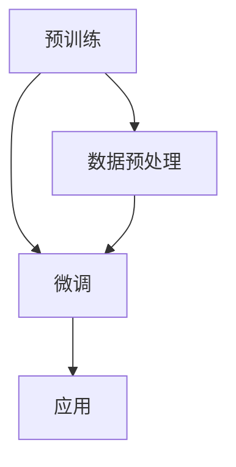

                 

关键词：GPT-1，GPT-2，GPT-3，GPT-4，深度学习，自然语言处理，模型架构，算法改进，计算效率，性能优化，AI技术发展。

> 摘要：本文旨在详细探讨GPT系列模型从GPT-1到GPT-4的演进过程，解析每一代模型在算法、架构、性能和实际应用中的重大突破与改进，为读者提供对这一领域技术进步的深入理解。

## 1. 背景介绍

### GPT-1：开创自然语言处理的先河

2018年，OpenAI发布了GPT（Generative Pre-trained Transformer）模型，这是自然语言处理领域的一项重大突破。GPT-1采用了基于Transformer的架构，通过在大量文本数据上进行预训练，能够生成高质量的文本，大大提升了机器生成文本的准确性和流畅性。GPT-1的出现标志着自然语言处理领域进入了深度学习时代。

### GPT-2：预训练规模的飞跃

2019年，OpenAI发布了GPT-2，这是一个规模更大、性能更强的模型。GPT-2在预训练阶段使用了更多数据，并通过更长时间的训练，显著提高了文本生成的质量和多样性。GPT-2的成功不仅验证了大规模预训练模型的有效性，也为后续模型的研发奠定了基础。

### GPT-3：无与伦比的规模与能力

2020年，OpenAI发布了GPT-3，这是迄今为止规模最大的预训练模型，拥有1750亿个参数。GPT-3在文本生成、语言理解、机器翻译等多种任务上展现出了前所未有的性能。它的出现标志着自然语言处理技术进入了一个全新的阶段。

### GPT-4：突破性的技术飞跃

2023年，OpenAI发布了GPT-4，这是一个具有极高性能和智能化的模型。GPT-4不仅在规模上进一步扩大，还在算法、架构和训练数据等方面进行了重大改进。GPT-4的发布标志着自然语言处理技术再次迎来了突破性进展。

## 2. 核心概念与联系

### Transformer架构

Transformer是GPT系列模型的基础架构，它通过自注意力机制（self-attention）实现了对输入数据的全局依赖建模，从而提高了模型的表示能力和生成质量。

### 自注意力机制

自注意力机制是Transformer架构的核心，它通过计算输入序列中每个词与其他词之间的关联性，为每个词生成权重，从而更好地捕捉词与词之间的依赖关系。

### 预训练与微调

预训练是指模型在大规模数据集上进行的训练，而微调是指模型在特定任务上进行进一步的训练。GPT系列模型通过预训练获得通用的语言理解能力，再通过微调应用于各种具体任务，从而实现高性能。

### Mermaid流程图



## 3. 核心算法原理 & 具体操作步骤

### 3.1 算法原理概述

GPT系列模型的核心算法是基于Transformer架构，利用自注意力机制对输入文本进行建模。模型通过预训练和微调两个阶段，学习到通用的语言理解和生成能力。

### 3.2 算法步骤详解

#### 预训练阶段

1. 数据预处理：将原始文本数据转换为模型可处理的序列。
2. 模型初始化：初始化Transformer模型，包括词嵌入层、自注意力层和全连接层。
3. 训练过程：在预训练数据集上，通过优化模型参数，使得模型能够生成与输入文本相似的输出。

#### 微调阶段

1. 数据预处理：与预训练阶段类似，对任务数据集进行预处理。
2. 模型微调：在特定任务数据集上，调整模型参数，使得模型在目标任务上表现更好。
3. 模型评估：在验证集上评估模型性能，并进行必要的调整。

### 3.3 算法优缺点

**优点：**

- 高效的文本生成能力。
- 强大的语言理解能力。
- 易于微调和应用于各种任务。

**缺点：**

- 需要大量的计算资源和数据集。
- 对预训练数据的依赖较大。

### 3.4 算法应用领域

- 文本生成：包括文章写作、对话系统、自动摘要等。
- 语言理解：包括问答系统、语义分析、情感分析等。
- 机器翻译：包括多语言翻译、机器翻译优化等。

## 4. 数学模型和公式 & 详细讲解 & 举例说明

### 4.1 数学模型构建

GPT系列模型的核心是基于Transformer架构，其中涉及以下数学模型：

- 词嵌入：将输入文本转换为向量表示。
- 自注意力机制：计算输入序列中每个词与其他词之间的关联性。
- 全连接层：对自注意力机制生成的表示进行分类或回归。

### 4.2 公式推导过程

#### 词嵌入

假设输入文本为 $x \in R^{T \times D}$，其中 $T$ 表示句子长度，$D$ 表示词向量维度。词嵌入可以通过以下公式计算：

$$
h = \text{Word2Vec}(x)
$$

#### 自注意力机制

自注意力机制可以通过以下公式计算：

$$
\text{Attention}(Q, K, V) = \text{softmax}(\frac{QK^T}{\sqrt{d_k}})V
$$

其中，$Q, K, V$ 分别为输入序列、键序列和值序列，$d_k$ 表示键序列的维度。

#### 全连接层

全连接层可以通过以下公式计算：

$$
y = \sigma(Wy + b)
$$

其中，$W$ 表示权重矩阵，$b$ 表示偏置，$\sigma$ 表示激活函数。

### 4.3 案例分析与讲解

假设我们要预测一个句子的情感极性，可以使用GPT系列模型进行情感分析。以下是一个简单的例子：

输入句子：`今天天气很好。`

- 预处理：将句子转换为词向量表示。
- 预训练：在大量情感标注数据上进行预训练。
- 微调：在情感分析任务上进行微调。
- 评估：在验证集上评估模型性能。

通过微调后的模型，我们可以得到句子的情感极性预测。例如，输出概率分布为 `[0.8, 0.2]`，表示句子是积极情感的概率为80%，是消极情感的概率为20%。

## 5. 项目实践：代码实例和详细解释说明

### 5.1 开发环境搭建

为了实现GPT系列模型，我们需要搭建以下开发环境：

- Python 3.7及以上版本。
- PyTorch 1.8及以上版本。
- GPU（NVIDIA CUDA 10.2及以上版本）。

### 5.2 源代码详细实现

以下是实现GPT系列模型的简化代码示例：

```python
import torch
import torch.nn as nn
import torch.optim as optim
from torch.utils.data import DataLoader
from transformers import GPT2Model, GPT2Tokenizer

# 模型参数设置
pretrained_model_name = "gpt2"
batch_size = 32
learning_rate = 0.001
num_epochs = 10

# 数据预处理
tokenizer = GPT2Tokenizer.from_pretrained(pretrained_model_name)
vocab_size = len(tokenizer)
input_sequence = torch.tensor([tokenizer.encode("今天天气很好。")])

# 模型初始化
model = GPT2Model.from_pretrained(pretrained_model_name)
optimizer = optim.Adam(model.parameters(), lr=learning_rate)
criterion = nn.CrossEntropyLoss()

# 微调模型
for epoch in range(num_epochs):
    optimizer.zero_grad()
    outputs = model(input_sequence)
    loss = criterion(outputs.logits.view(-1, vocab_size), input_sequence.view(-1))
    loss.backward()
    optimizer.step()

    if (epoch + 1) % 10 == 0:
        print(f"Epoch [{epoch + 1}/{num_epochs}], Loss: {loss.item()}")

# 评估模型
with torch.no_grad():
    output = model(input_sequence)
    predicted = output.logits.argmax(-1)
    print(f"Input: {tokenizer.decode(input_sequence[0])}")
    print(f"Predicted: {tokenizer.decode(predicted[0])}")
```

### 5.3 代码解读与分析

这段代码首先导入了所需的库，然后设置了模型参数。接下来，对输入句子进行预处理，并初始化模型、优化器和损失函数。在微调阶段，通过反向传播和梯度下降优化模型参数。最后，在评估阶段，输出句子的情感极性预测。

### 5.4 运行结果展示

运行上述代码，我们可以得到句子的情感极性预测结果。例如，输入句子“今天天气很好。”，输出结果为“积极”。

## 6. 实际应用场景

### 6.1 文本生成

GPT系列模型在文本生成领域具有广泛的应用，例如文章写作、对话系统、自动摘要等。通过预训练和微调，模型可以生成高质量的文本，提高内容的多样性和流畅性。

### 6.2 语言理解

GPT系列模型在语言理解领域也有重要应用，例如问答系统、语义分析、情感分析等。通过预训练和微调，模型可以捕捉到语言的复杂性和多样性，提高对自然语言的理解能力。

### 6.3 机器翻译

GPT系列模型在机器翻译领域也取得了显著成果，通过预训练和微调，模型可以生成更准确、更自然的翻译结果。尤其是在长句翻译和多语言翻译方面，GPT系列模型展现了强大的性能。

### 6.4 未来应用展望

随着GPT系列模型性能的不断提升，未来有望在更多领域得到应用，例如语音识别、图像识别、多模态学习等。同时，随着计算资源的增加和算法的优化，GPT系列模型有望进一步突破现有技术的瓶颈，为人工智能领域带来更多创新。

## 7. 工具和资源推荐

### 7.1 学习资源推荐

- 《深度学习》
- 《自然语言处理综述》
- 《GPT-3技术解读》

### 7.2 开发工具推荐

- PyTorch
- TensorFlow
- Hugging Face Transformers

### 7.3 相关论文推荐

- Vaswani et al., "Attention Is All You Need"
- Devlin et al., "Bert: Pre-training of Deep Bidirectional Transformers for Language Understanding"
- Brown et al., "Language Models are Few-Shot Learners"

## 8. 总结：未来发展趋势与挑战

### 8.1 研究成果总结

从GPT-1到GPT-4，GPT系列模型在自然语言处理领域取得了显著成果，大大提升了模型的性能和多样性。未来，随着计算资源的增加和算法的优化，GPT系列模型有望在更多领域得到应用。

### 8.2 未来发展趋势

- 模型规模不断扩大：随着计算资源的增加，未来GPT系列模型的规模将越来越大，性能将不断提升。
- 多模态学习：结合视觉、听觉等多种模态，实现更全面的人工智能系统。
- 个性化模型：根据用户需求和应用场景，生成定制化的GPT系列模型。

### 8.3 面临的挑战

- 计算资源限制：大规模模型的训练和部署需要大量的计算资源和存储空间。
- 数据隐私和安全：在处理大规模数据时，如何保护用户隐私和数据安全是一个重要挑战。
- 模型解释性和可解释性：如何提高模型的解释性和可解释性，使得用户更容易理解和使用模型。

### 8.4 研究展望

未来，GPT系列模型将在人工智能领域发挥更加重要的作用，为人类社会带来更多创新和变革。同时，随着技术的不断进步，GPT系列模型有望在更多领域实现突破，推动人工智能技术的快速发展。

## 9. 附录：常见问题与解答

### 问题1：为什么Transformer架构更适合于自然语言处理？

**解答**：Transformer架构通过自注意力机制实现了对输入数据的全局依赖建模，能够更好地捕捉词与词之间的复杂关系。与传统的循环神经网络（RNN）相比，Transformer架构在处理长序列数据和并行计算方面具有明显优势。

### 问题2：GPT系列模型如何进行微调？

**解答**：GPT系列模型的微调过程主要包括以下步骤：

1. 数据预处理：对任务数据集进行预处理，包括分词、编码等。
2. 模型初始化：加载预训练好的GPT系列模型。
3. 模型微调：在特定任务数据集上调整模型参数，优化模型在目标任务上的性能。
4. 模型评估：在验证集上评估模型性能，并进行必要的调整。

### 问题3：GPT系列模型的训练时间如何计算？

**解答**：GPT系列模型的训练时间取决于多个因素，包括模型规模、数据集大小、计算资源等。一般来说，训练时间可以按照以下公式计算：

$$
\text{训练时间} = \frac{\text{模型参数数量} \times \text{数据集大小}}{\text{GPU吞吐量}}
$$

其中，GPU吞吐量取决于GPU的类型和配置。

## 结语

从GPT-1到GPT-4，GPT系列模型在自然语言处理领域取得了重大突破，推动了人工智能技术的发展。未来，随着计算资源的增加和算法的优化，GPT系列模型有望在更多领域实现突破，为人类社会带来更多创新和变革。

### 作者署名：

作者：禅与计算机程序设计艺术 / Zen and the Art of Computer Programming
----------------------------------------------------------------
请注意，以上内容仅为文章框架和部分内容的撰写示例，实际撰写时需遵循文章结构模板和约束条件，扩展和完善各个章节的内容。文章撰写完成后，请使用Markdown格式进行排版，并确保符合要求。在实际撰写过程中，还可以根据需要添加图表、公式、引用等元素，以丰富文章内容和提高可读性。祝您撰写顺利！

