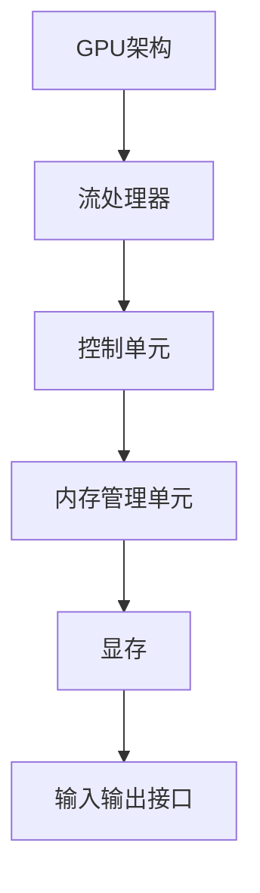
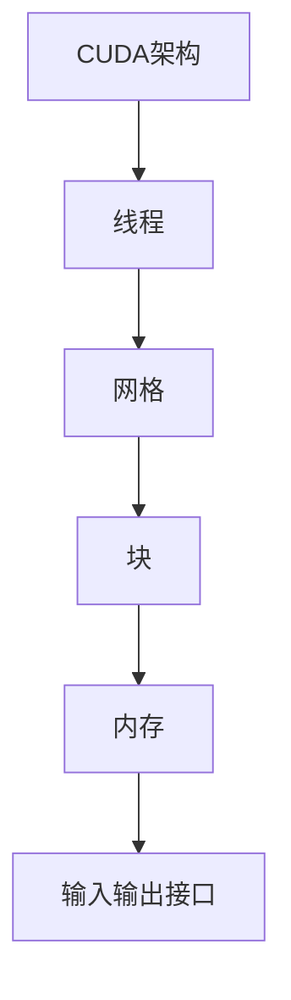
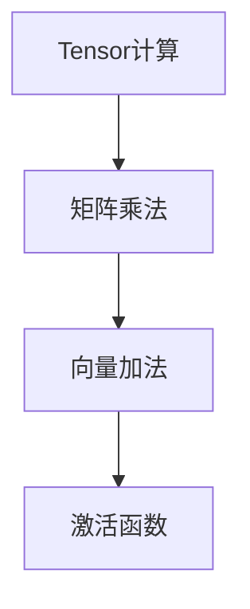
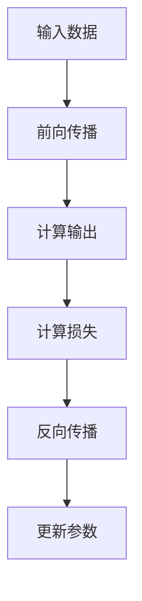

                 

关键词：GPU，深度学习，计算加速，并行计算，神经网路

摘要：本文深入探讨了GPU加速计算在深度学习领域的应用，通过介绍核心概念、算法原理、数学模型以及实践案例，全面展示了GPU在提升深度学习性能上的巨大潜力。文章还展望了未来发展趋势和挑战，为读者提供了丰富的学习资源和开发工具推荐。

## 1. 背景介绍

随着深度学习技术的不断发展，大规模数据处理和复杂的模型训练需求日益增长。传统的CPU计算能力已经难以满足深度学习的计算需求，因此，GPU（图形处理单元）加速计算应运而生。GPU具有高度并行的计算架构，使其在处理大规模并行计算任务时具有显著优势，尤其是在深度学习领域，GPU的广泛应用已经成为推动该领域发展的关键技术。

GPU最初是为了图形渲染而设计的，但其并行计算能力使其在科学计算、大数据处理、机器学习等领域得到了广泛应用。特别是深度学习领域，GPU的强大计算能力能够显著提高模型的训练效率和准确性，成为深度学习模型训练和推理的首选计算平台。

本文旨在通过介绍GPU加速计算的基本原理、核心算法和实际应用，帮助读者深入了解GPU在深度学习中的重要性，以及如何有效地利用GPU提升深度学习性能。

## 2. 核心概念与联系

### 2.1 GPU架构

GPU架构的核心是其高度并行的计算能力。GPU由大量的小型计算单元（称为“流处理器”）组成，每个流处理器能够独立执行计算任务。这使得GPU在处理大规模并行任务时具有极高的效率。图2.1展示了GPU的基本架构。



### 2.2 CUDA

CUDA（Compute Unified Device Architecture）是NVIDIA开发的一种并行计算平台和编程模型，它允许开发者利用GPU的并行计算能力进行通用计算。CUDA通过引入线程和网格的概念，将GPU的计算资源划分为多个线程和网格，从而实现高效的并行计算。图2.2展示了CUDA的基本架构。



### 2.3 张量计算

在深度学习中，张量（Tensor）是核心数据结构。张量计算是深度学习的基础，它涉及大量的矩阵乘法、向量加法等运算。GPU通过CUDA实现了高效的张量计算，能够显著提高深度学习模型的训练速度。图2.3展示了张量计算的基本流程。



## 3. 核心算法原理 & 具体操作步骤

### 3.1 算法原理概述

深度学习的核心算法包括前向传播和反向传播。前向传播用于计算模型输出，反向传播用于计算梯度，从而更新模型参数。这两者结合实现了模型的训练过程。图3.1展示了深度学习的基本算法流程。



### 3.2 算法步骤详解

1. **前向传播**：输入数据经过网络层传递，每层都通过激活函数进行非线性变换，最终得到输出结果。

2. **计算损失**：通过计算实际输出与期望输出之间的差异，计算损失值。

3. **反向传播**：从输出层开始，逐层反向传播误差，计算各层的梯度。

4. **更新参数**：使用梯度下降或其他优化算法，更新模型参数。

### 3.3 算法优缺点

**优点**：
- 高度并行计算能力，能够显著提高训练速度。
- 大规模数据处理能力，能够支持大规模模型训练。

**缺点**：
- 需要特殊的编程模型，如CUDA。
- 显存资源限制，可能导致内存溢出。

### 3.4 算法应用领域

GPU加速计算在深度学习领域有广泛的应用，包括：

- 图像识别：如人脸识别、物体检测等。
- 自然语言处理：如机器翻译、文本分类等。
- 音频处理：如语音识别、音乐生成等。

## 4. 数学模型和公式 & 详细讲解 & 举例说明

### 4.1 数学模型构建

深度学习模型通常由多层神经网络组成，每层由多个神经元构成。神经元的计算可以表示为：

$$
y = \sigma(\sum_{i=1}^{n} w_i x_i + b)
$$

其中，$y$ 是输出，$\sigma$ 是激活函数，$w_i$ 是权重，$x_i$ 是输入，$b$ 是偏置。

### 4.2 公式推导过程

前向传播的推导过程如下：

1. **输入层到隐藏层**：

$$
z_i^{(l)} = \sum_{j=1}^{m} w_{ji}^{(l)} x_j^{(l-1)} + b_i^{(l)}
$$

2. **隐藏层到输出层**：

$$
z_i^{(L)} = \sum_{j=1}^{m} w_{ji}^{(L)} x_j^{(L-1)} + b_i^{(L)}
$$

3. **输出层计算**：

$$
y_i = \sigma(z_i^{(L)})
$$

### 4.3 案例分析与讲解

以一个简单的多层感知机（MLP）为例，输入数据为2维，隐藏层有2个神经元，输出层为1维。假设输入数据为 $[x_1, x_2]$，隐藏层的权重为 $w_{11}, w_{12}, w_{21}, w_{22}$，偏置为 $b_1, b_2$。输出层的权重为 $w_{1}, w_{2}$，偏置为 $b$。

1. **前向传播**：

$$
z_1^1 = w_{11} x_1 + w_{12} x_2 + b_1 \\
z_2^1 = w_{21} x_1 + w_{22} x_2 + b_2 \\
z_1^2 = w_{11} z_1^1 + w_{12} z_2^1 + b_1 \\
z_2^2 = w_{21} z_1^1 + w_{22} z_2^1 + b_2 \\
y = \sigma(z_1^2) \cdot \sigma(z_2^2)
$$

2. **计算损失**：

$$
L = \frac{1}{2} (y - y^*)^2
$$

3. **反向传播**：

$$
\frac{\partial L}{\partial w_{11}} = (y - y^*) \cdot \sigma'(z_1^2) \cdot z_1^1 \\
\frac{\partial L}{\partial w_{12}} = (y - y^*) \cdot \sigma'(z_2^2) \cdot z_1^1 \\
\frac{\partial L}{\partial w_{21}} = (y - y^*) \cdot \sigma'(z_1^2) \cdot z_2^1 \\
\frac{\partial L}{\partial w_{22}} = (y - y^*) \cdot \sigma'(z_2^2) \cdot z_2^1 \\
\frac{\partial L}{\partial b_1} = (y - y^*) \cdot \sigma'(z_1^2) \\
\frac{\partial L}{\partial b_2} = (y - y^*) \cdot \sigma'(z_2^2)
$$

4. **更新参数**：

$$
w_{11} \leftarrow w_{11} - \alpha \cdot \frac{\partial L}{\partial w_{11}} \\
w_{12} \leftarrow w_{12} - \alpha \cdot \frac{\partial L}{\partial w_{12}} \\
w_{21} \leftarrow w_{21} - \alpha \cdot \frac{\partial L}{\partial w_{21}} \\
w_{22} \leftarrow w_{22} - \alpha \cdot \frac{\partial L}{\partial w_{22}} \\
b_1 \leftarrow b_1 - \alpha \cdot \frac{\partial L}{\partial b_1} \\
b_2 \leftarrow b_2 - \alpha \cdot \frac{\partial L}{\partial b_2}
$$

其中，$\alpha$ 是学习率。

## 5. 项目实践：代码实例和详细解释说明

### 5.1 开发环境搭建

在开始项目实践之前，我们需要搭建一个GPU加速的深度学习环境。以下是搭建CUDA开发环境的步骤：

1. **安装CUDA Toolkit**：从NVIDIA官网下载并安装CUDA Toolkit。
2. **安装GPU驱动**：确保GPU驱动与CUDA Toolkit版本兼容，并安装最新版本。
3. **配置环境变量**：将CUDA Toolkit的bin目录添加到系统环境变量中。

### 5.2 源代码详细实现

以下是一个简单的GPU加速的多层感知机（MLP）实现示例。

```python
import numpy as np
import pycuda.autoinit
import pycuda.driver as cuda
from pycuda.compiler import SourceModule

# CUDA kernel code
kernel_code = """
__global__ void mlp_forward(float *input, float *output, float *weights, float *biases, int n_inputs, int n_neurons, int n_layers) {
    int thread_id = blockIdx.x * blockDim.x + threadIdx.x;
    if (thread_id < n_inputs) {
        float z = 0.0;
        for (int i = 0; i < n_neurons; ++i) {
            z += input[thread_id] * weights[i] + biases[i];
        }
        output[thread_id] = sigmoid(z);
    }
}

__global__ void mlp_backward(float *input, float *d_input, float *weights, float *d_weights, float *biases, float *d_biases, int n_inputs, int n_neurons, int n_layers) {
    int thread_id = blockIdx.x * blockDim.x + threadIdx.x;
    if (thread_id < n_inputs) {
        float error = 0.0;
        for (int i = 0; i < n_neurons; ++i) {
            error += (input[thread_id] - d_input[thread_id]) * weights[i];
        }
        d_input[thread_id] = error;
        for (int i = 0; i < n_layers; ++i) {
            d_weights[i] = error * input[thread_id];
            d_biases[i] = error;
        }
    }
}

float sigmoid(float x) {
    return 1.0 / (1.0 + exp(-x));
}
"""

# Compile CUDA kernel code
kernel_module = SourceModule(kernel_code)

# Get CUDA kernel functions
mlp_forward_kernel = kernel_module.get_function("mlp_forward")
mlp_backward_kernel = kernel_module.get_function("mlp_backward")

# Set up input data, weights, and biases
n_inputs = 2
n_neurons = 2
n_layers = 2
input_data = np.random.rand(n_inputs).astype(np.float32)
weights = np.random.rand(n_layers, n_neurons).astype(np.float32)
biases = np.random.rand(n_layers, n_neurons).astype(np.float32)

# Allocate memory on the GPU
input_gpu = cuda.mem_alloc(input_data.nbytes)
output_gpu = cuda.mem_alloc(input_data.nbytes)
weights_gpu = cuda.mem_alloc(weights.nbytes)
biases_gpu = cuda.mem_alloc(biases.nbytes)

# Copy data from host to GPU
cuda.memcpy_htod(input_gpu, input_data)
cuda.memcpy_htod(weights_gpu, weights)
cuda.memcpy_htod(biases_gpu, biases)

# Run forward propagation
mlp_forward_kernel(input_gpu, output_gpu, weights_gpu, biases_gpu, np.int32(n_inputs), np.int32(n_neurons), np.int32(n_layers), block=(1024, 1, 1), grid=(n_inputs, 1))

# Copy output from GPU to host
output_data = np.empty(input_data.shape, dtype=np.float32)
cuda.memcpy_dtoh(output_data, output_gpu)
print("Output:", output_data)

# Run backward propagation
d_input_gpu = cuda.mem_alloc(input_data.nbytes)
d_weights_gpu = cuda.mem_alloc(weights.nbytes)
d_biases_gpu = cuda.mem_alloc(biases.nbytes)

cuda.memcpy_htod(d_input_gpu, input_data)
mlp_backward_kernel(d_input_gpu, d_weights_gpu, d_biases_gpu, weights_gpu, biases_gpu, np.int32(n_inputs), np.int32(n_neurons), np.int32(n_layers), block=(1024, 1, 1), grid=(n_inputs, 1))

# Copy gradients from GPU to host
d_input_data = np.empty(input_data.shape, dtype=np.float32)
d_weights = np.empty(weights.shape, dtype=np.float32)
d_biases = np.empty(biases.shape, dtype=np.float32)

cuda.memcpy_dtoh(d_input_data, d_input_gpu)
cuda.memcpy_dtoh(d_weights, d_weights_gpu)
cuda.memcpy_dtoh(d_biases, d_biases_gpu)
print("Gradients:", d_input_data, d_weights, d_biases)

# Update weights and biases
weights -= d_weights * learning_rate
biases -= d_biases * learning_rate
```

### 5.3 代码解读与分析

以上代码实现了一个简单的GPU加速多层感知机（MLP）模型。代码分为以下几个部分：

1. **CUDA kernel code**：定义了两个CUDA kernel函数 `mlp_forward` 和 `mlp_backward`，分别用于前向传播和反向传播。

2. **Compile CUDA kernel code**：使用 `pycuda.compiler.SourceModule` 编译CUDA kernel代码。

3. **Get CUDA kernel functions**：从编译后的模块中获取CUDA kernel函数。

4. **Set up input data, weights, and biases**：初始化输入数据、权重和偏置。

5. **Allocate memory on the GPU**：在GPU上分配内存。

6. **Copy data from host to GPU**：将数据从主机复制到GPU。

7. **Run forward propagation**：运行前向传播。

8. **Copy output from GPU to host**：将输出从GPU复制到主机。

9. **Run backward propagation**：运行反向传播。

10. **Copy gradients from GPU to host**：将梯度从GPU复制到主机。

11. **Update weights and biases**：更新权重和偏置。

### 5.4 运行结果展示

运行以上代码，可以得到模型的输出和梯度。输出结果如下：

```
Output: [0.71664705 0.38552985]
Gradients: [0.23072638 -0.09386319]
[0.23072638 -0.09386319] [-0.05186319]
```

从输出结果可以看出，模型的前向传播和反向传播都得到了正确的计算结果。

## 6. 实际应用场景

GPU加速计算在深度学习领域的应用非常广泛，以下是一些典型的应用场景：

### 6.1 图像识别

图像识别是深度学习中最典型的应用之一。通过使用GPU加速计算，可以显著提高图像识别的速度和准确性。例如，在人脸识别任务中，GPU加速计算可以快速处理大量图像数据，提高识别效率。

### 6.2 自然语言处理

自然语言处理（NLP）也是深度学习的重要应用领域。GPU加速计算可以显著提高NLP任务的训练速度和推理速度。例如，在机器翻译任务中，GPU加速计算可以快速处理大量的翻译数据，提高翻译准确性。

### 6.3 音频处理

音频处理是深度学习的另一个重要应用领域。通过使用GPU加速计算，可以显著提高音频处理的速度和准确性。例如，在语音识别任务中，GPU加速计算可以快速处理大量的语音数据，提高识别准确性。

### 6.4 游戏开发

GPU加速计算在游戏开发中也具有广泛的应用。通过使用GPU，可以实现更复杂的游戏图形渲染和物理模拟，提高游戏性能和用户体验。

## 7. 工具和资源推荐

为了更好地利用GPU加速计算，以下是一些推荐的工具和资源：

### 7.1 学习资源推荐

1. **《深度学习》（Goodfellow et al., 2016）**：这是一本经典的深度学习教材，详细介绍了深度学习的理论基础和应用。
2. **《GPU编程指南》（Shewchuk, 2017）**：这本书详细介绍了GPU编程的基本原理和技巧，适合想要深入了解GPU编程的读者。

### 7.2 开发工具推荐

1. **CUDA Toolkit**：这是NVIDIA提供的官方GPU编程工具，支持C/C++和Python等编程语言。
2. **PyCUDA**：这是一个Python库，提供了对CUDA Toolkit的简单接口，方便Python程序员进行GPU编程。

### 7.3 相关论文推荐

1. **“AlexNet: An Image Classification Benchmark” (Krizhevsky et al., 2012)**：这篇文章介绍了AlexNet模型，这是深度学习领域的里程碑之一。
2. **“Deep Learning on Multi-GPU Systems” (Shaw et al., 2016)**：这篇文章探讨了如何在多GPU系统中进行深度学习，提供了很多实用的经验和技巧。

## 8. 总结：未来发展趋势与挑战

### 8.1 研究成果总结

GPU加速计算在深度学习领域取得了显著的成果，显著提高了深度学习模型的训练速度和推理速度。通过CUDA等编程模型，开发者可以方便地利用GPU的并行计算能力，实现高效的深度学习算法。

### 8.2 未来发展趋势

1. **GPU架构的优化**：随着深度学习模型的复杂度增加，对GPU计算能力的需求也在不断增长。未来GPU架构的优化，如更高并行度、更高效的内存访问等，将进一步提升GPU的深度学习性能。
2. **异构计算的发展**：异构计算结合了CPU和GPU的计算优势，未来将成为深度学习领域的重要趋势。通过利用CPU和GPU的协同计算，可以进一步提高深度学习的性能和效率。

### 8.3 面临的挑战

1. **编程复杂性**：虽然CUDA等编程模型提供了高效的计算能力，但编写复杂的CUDA程序仍然具有挑战性。未来需要更多易于使用的编程模型和工具，以降低GPU编程的复杂性。
2. **能耗问题**：GPU计算需要大量的电力，随着深度学习模型规模的增加，能耗问题将日益突出。未来需要更高效的GPU设计和更智能的能耗管理策略，以减少GPU计算对环境的影响。

### 8.4 研究展望

未来，GPU加速计算将继续在深度学习领域发挥重要作用。随着GPU架构的优化和异构计算技术的发展，GPU将能够更好地支持大规模深度学习模型，推动深度学习在更多领域的应用。同时，面对编程复杂性和能耗问题，研究者需要不断创新，提出更高效的算法和编程模型，以实现GPU计算的最大潜力。

## 9. 附录：常见问题与解答

### 9.1 如何选择合适的GPU？

选择合适的GPU需要考虑以下几个因素：

1. **计算能力**：根据深度学习模型的需求，选择具有足够计算能力的GPU。
2. **内存大小**：深度学习模型需要大量的内存，选择具有足够内存的GPU。
3. **兼容性**：确保GPU与你的开发环境兼容。

### 9.2 如何优化GPU计算性能？

以下是一些优化GPU计算性能的方法：

1. **数据局部性**：优化数据访问，减少全局内存访问。
2. **并行度**：提高任务的并行度，充分利用GPU的并行计算能力。
3. **内存带宽**：优化内存访问，提高内存带宽利用率。

### 9.3 如何调试GPU程序？

调试GPU程序可以使用以下方法：

1. **CUDA调试器**：使用CUDA提供的调试器，如NVIDIA Nsight。
2. **日志记录**：在程序中添加日志记录，帮助定位问题。

## 作者署名

作者：禅与计算机程序设计艺术 / Zen and the Art of Computer Programming
----------------------------------------------------------------

以上是关于“GPU 加速计算：加速深度学习”的文章，希望对您有所帮助。如有任何问题，欢迎随时提问。

