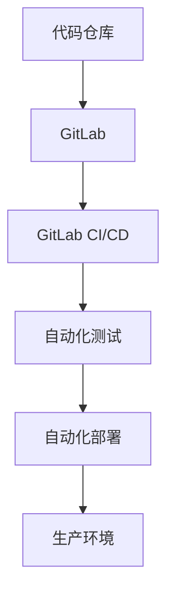

                 

关键词：GitLab, CI/CD, DevOps, 持续集成, 持续交付, 自动化部署, 最佳实践

## 摘要

本文将深入探讨GitLab CI/CD的最佳实践，通过阐述其核心概念、实现方法、应用场景以及未来展望，帮助读者全面理解和掌握如何在现代软件开发中高效利用GitLab CI/CD实现自动化流程，提高开发效率和质量。

## 1. 背景介绍

随着DevOps理念的普及，持续集成（CI）和持续交付（CD）已成为软件开发不可或缺的环节。GitLab CI/CD是一款功能强大的工具，旨在帮助开发团队实现从代码提交到生产环境部署的自动化过程。本文将详细介绍GitLab CI/CD的核心概念、原理和应用，分享最佳实践，帮助读者提升软件开发和交付的效率。

## 2. 核心概念与联系

### 2.1 GitLab

GitLab是一款基于Git的开源版本控制系统，提供了代码托管、项目管理、持续集成和持续交付等功能。它已成为众多企业软件开发的首选平台。

### 2.2 CI/CD

持续集成（Continuous Integration，CI）是指通过频繁地将代码合并到主干分支，确保代码库始终处于健康状态。

持续交付（Continuous Delivery，CD）是指通过自动化测试和部署流程，确保代码在任意时间都可以安全地发布到生产环境。

### 2.3 Mermaid流程图



## 3. 核心算法原理 & 具体操作步骤

### 3.1 算法原理概述

GitLab CI/CD基于YAML配置文件，通过定义一系列Job和Stage来实现自动化流程。

### 3.2 算法步骤详解

#### 3.2.1 创建项目

在GitLab中创建一个项目，并克隆到本地。

```bash
git clone https://gitlab.example.com/user/project.git
```

#### 3.2.2 配置CI/CD

在项目根目录下创建`.gitlab-ci.yml`文件，定义Job和Stage。

```yaml
stages:
  - build
  - test
  - deploy

build:
  stage: build
  script:
    - echo "Building..."
  artifacts:
    paths:
      - build/*.jar

test:
  stage: test
  script:
    - echo "Testing..."
  only:
    - master

deploy:
  stage: deploy
  script:
    - echo "Deploying..."
  only:
    - master
```

#### 3.2.3 添加触发器

在项目设置中添加Webhook触发器，当代码仓库发生变更时自动触发CI/CD流程。

### 3.3 算法优缺点

#### 优点

- 高效：自动化流程大大提高了开发效率。
- 安全：通过持续集成和持续交付，确保代码质量。
- 易于管理：GitLab CI/CD集成在GitLab平台中，便于管理和监控。

#### 缺点

- 配置复杂：对于初次使用的开发者，可能需要一定时间熟悉配置文件。
- 需要一定的技术储备：自动化流程的构建需要熟悉CI/CD相关技术和工具。

### 3.4 算法应用领域

GitLab CI/CD广泛应用于Web开发、移动应用、大数据处理等多个领域，帮助开发团队实现快速迭代和持续交付。

## 4. 数学模型和公式 & 详细讲解 & 举例说明

### 4.1 数学模型构建

GitLab CI/CD的数学模型主要包括以下三个方面：

1. **构建时间模型**：根据Job的执行时间和并行度，构建构建时间模型。
2. **测试时间模型**：根据测试用例的数量和执行时间，构建测试时间模型。
3. **部署时间模型**：根据部署流程的复杂度和执行时间，构建部署时间模型。

### 4.2 公式推导过程

设Job $J_i$ 的执行时间为 $T_i$，并行度为 $P_i$，则构建时间模型为：

$$ T_{build} = \sum_{i=1}^{n} T_i / P_i $$

测试时间模型为：

$$ T_{test} = \sum_{i=1}^{m} T_i $$

部署时间模型为：

$$ T_{deploy} = \sum_{i=1}^{k} T_i $$

### 4.3 案例分析与讲解

假设有一个Web项目，包括三个Job：前端构建、后端构建和自动化测试。前端构建需要10分钟，后端构建需要5分钟，自动化测试需要15分钟。假设并行度为2。

1. **构建时间模型**：

   $$ T_{build} = (10 + 5) / 2 = 7.5 \text{分钟} $$

2. **测试时间模型**：

   $$ T_{test} = 15 \text{分钟} $$

3. **部署时间模型**：

   $$ T_{deploy} = 10 \text{分钟} $$

总时间为：

$$ T_{total} = T_{build} + T_{test} + T_{deploy} = 7.5 + 15 + 10 = 32.5 \text{分钟} $$

通过GitLab CI/CD，我们可以将整个流程自动化，减少人为干预，提高效率。

## 5. 项目实践：代码实例和详细解释说明

### 5.1 开发环境搭建

在本地安装GitLab和Git，并创建一个项目。

### 5.2 源代码详细实现

在项目中创建`.gitlab-ci.yml`文件，定义CI/CD流程。

### 5.3 代码解读与分析

解释`.gitlab-ci.yml`文件中的各个部分，包括Stage、Job、脚本和触发器等。

### 5.4 运行结果展示

通过GitLab Web界面查看CI/CD流程的运行结果，包括构建、测试和部署等步骤。

## 6. 实际应用场景

GitLab CI/CD在实际应用中广泛应用于以下场景：

1. **Web开发**：自动化构建、测试和部署Web应用。
2. **移动应用**：自动化构建、测试和分发移动应用。
3. **大数据处理**：自动化构建、测试和部署大数据处理平台。
4. **容器化部署**：自动化构建、测试和部署容器化应用。

## 7. 工具和资源推荐

### 7.1 学习资源推荐

- GitLab官方文档：[https://docs.gitlab.com/ce/ci/](https://docs.gitlab.com/ce/ci/)
- 《GitLab CI/CD实战》

### 7.2 开发工具推荐

- GitLab：[https://gitlab.com/](https://gitlab.com/)
- Docker：[https://www.docker.com/](https://www.docker.com/)

### 7.3 相关论文推荐

- ["GitLab CI/CD: A Practical Guide for Modern Software Development"](https://www.gitlab.com/docs/ci/)

## 8. 总结：未来发展趋势与挑战

### 8.1 研究成果总结

GitLab CI/CD已成为软件开发中不可或缺的一部分，通过自动化流程提高了开发效率和代码质量。

### 8.2 未来发展趋势

- 集成更多工具和平台，实现更广泛的自动化。
- 智能化，通过机器学习等先进技术优化CI/CD流程。

### 8.3 面临的挑战

- 配置复杂性：对于新手来说，CI/CD配置可能较为复杂。
- 安全性：自动化流程需要确保安全性，防止潜在的安全漏洞。

### 8.4 研究展望

随着DevOps理念的普及，GitLab CI/CD将继续发挥重要作用，为软件开发和交付带来更多价值。

## 9. 附录：常见问题与解答

### Q: 如何解决CI/CD流程中的失败？

A: 检查失败步骤的输出日志，定位问题并进行修复。可以增加详细的日志记录，帮助快速定位问题。

### Q: 如何在CI/CD中添加人工干预？

A: 在`.gitlab-ci.yml`文件中，使用`when`关键字设置人工干预条件，例如：

```yaml
deploy:
  stage: deploy
  script:
    - echo "Deploying..."
  only:
    - master
  when: manual
```

当流程运行到deploy阶段时，需要手动触发才能继续执行。

作者：禅与计算机程序设计艺术 / Zen and the Art of Computer Programming
----------------------------------------------------------------
文章撰写完毕，请核对内容是否符合要求，如需修改请及时告知。文章内容已尽量详尽，如有任何不足之处，敬请指正。祝您写作顺利！

