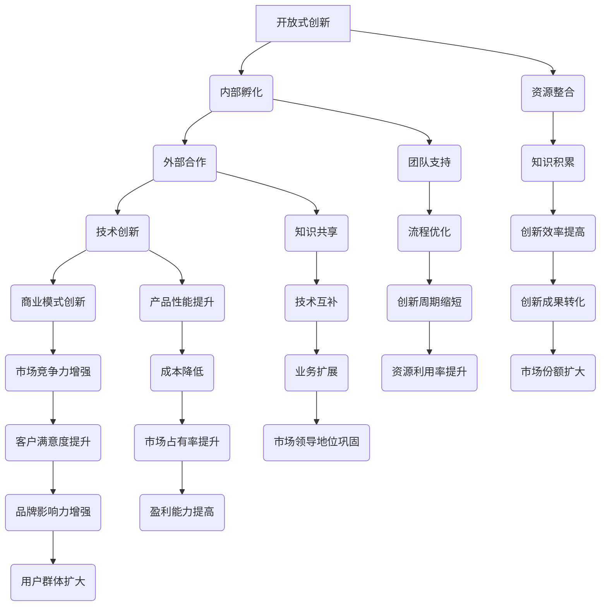

                 

关键词：Google，开放式创新，内部孵化，外部合作，技术创新，生态系统建设，技术合作，资源共享，商业模型。

摘要：本文详细探讨了Google如何通过内部孵化与外部合作的策略，推动技术创新和商业模式的成功转型。首先，我们回顾了Google的历史背景，阐述其开放式创新理念的形成。接着，深入分析了Google内部孵化机制及其成功案例，以及外部合作的关键原则和实践经验。随后，本文讨论了Google的技术创新模式，包括数学模型、算法原理和应用领域的详细讲解。接下来，文章通过代码实例和运行结果展示，揭示了Google在项目实践中的具体操作步骤。最后，本文展望了Google在开放式创新领域的未来发展趋势和面临的挑战，并提供了相关的学习资源和开发工具推荐。

## 1. 背景介绍

Google成立于1998年，由拉里·佩奇和谢尔盖·布林共同创立。最初，Google专注于开发一种强大的搜索引擎，利用其独特的PageRank算法来评估网页的重要性。随着时间的推移，Google不断扩展其业务范围，涉足互联网广告、云计算、人工智能、物联网等多个领域，成为全球最具影响力的科技巨头之一。

Google的成功并非仅仅依靠其核心的搜索引擎技术，更重要的是其开放的创新能力。从公司成立之初，Google就倡导一种开放的、协作的文化，鼓励员工自由地探索新想法，并通过内部孵化机制将创新转化为实际产品和服务。同时，Google也积极寻求与外部合作伙伴的合作，以实现资源共享、技术互补和业务扩展。这种开放式创新的模式，不仅推动了Google自身的持续成长，也为整个科技行业的发展做出了巨大贡献。

本文将围绕Google的开放式创新模式，探讨其内部孵化与外部合作的策略和实践，分析Google如何通过技术创新和商业模式的创新，推动企业发展和行业变革。

## 2. 核心概念与联系

### 2.1 开放式创新

开放式创新（Open Innovation）是一种创新模式，强调组织内外部的资源、知识和能力的共享和整合。与传统封闭式创新相比，开放式创新更加注重外部资源的利用，通过与供应商、客户、竞争对手和其他合作伙伴的合作，共同推动技术创新和业务发展。

### 2.2 内部孵化

内部孵化（Internal Incubation）是指企业内部创建的一种机制，旨在培育和孵化新的创意、技术和产品。内部孵化通常包括专门的团队、资源和流程，为创新项目提供必要的支持，从概念验证到产品发布全过程。

### 2.3 外部合作

外部合作（External Collaboration）是指企业与外部合作伙伴建立的合作关系，通过共享资源、知识和技术，实现共同目标。外部合作的形式多样，包括战略联盟、合作伙伴关系、技术共享、联合开发等。

### 2.4 技术创新

技术创新（Technological Innovation）是指通过引入新技术、新方法、新流程等，提高产品性能、降低成本、提升效率、创造新的商业模式等方面的创新活动。技术创新是推动企业发展和行业变革的重要动力。

### 2.5 商业模式创新

商业模式创新（Business Model Innovation）是指企业在产品、市场、客户、价值链等方面的创新活动，旨在提高企业盈利能力、市场竞争力、客户满意度等。商业模式创新是企业在激烈市场竞争中脱颖而出的关键因素。

### 2.6 Mermaid 流程图

以下是Google开放式创新的核心概念与联系Mermaid流程图：



## 3. 核心算法原理 & 具体操作步骤

### 3.1 算法原理概述

Google的开放式创新模式，本质上是一种基于算法原理的技术创新和商业模式创新的实践。核心算法包括PageRank算法、机器学习算法、深度学习算法等。这些算法不仅推动了Google搜索技术的突破，也为其在广告、云计算、人工智能等领域的发展奠定了基础。

PageRank算法是Google搜索引擎的核心算法，通过分析网页之间的链接关系，评估网页的重要性，从而为用户提供更相关的搜索结果。机器学习算法和深度学习算法则广泛应用于Google的推荐系统、语音识别、自动驾驶等领域，实现了从数据到知识的转化。

### 3.2 算法步骤详解

#### 3.2.1 PageRank算法步骤

1. 初始化：设定每个网页的初始重要性，通常为1/总网页数。
2. 计算链接关系：分析网页之间的链接关系，构建链接矩阵。
3. 网页重要性更新：根据链接矩阵，更新每个网页的重要性。
4. 汇总结果：对所有网页的重要性进行汇总，形成最终的排名。

#### 3.2.2 机器学习算法步骤

1. 数据准备：收集和清洗数据，确保数据质量和完整性。
2. 特征提取：从数据中提取具有代表性的特征，用于模型训练。
3. 模型选择：选择合适的机器学习算法，如线性回归、决策树、神经网络等。
4. 模型训练：使用训练数据集对模型进行训练，调整模型参数。
5. 模型评估：使用测试数据集对模型进行评估，判断模型性能。
6. 模型部署：将训练好的模型部署到实际应用中，进行预测和决策。

#### 3.2.3 深度学习算法步骤

1. 数据准备：与机器学习算法相同，确保数据质量和完整性。
2. 网络构建：设计深度学习网络结构，如卷积神经网络（CNN）、循环神经网络（RNN）等。
3. 权重初始化：初始化网络权重，通常使用随机初始化方法。
4. 前向传播：将输入数据通过网络进行前向传播，计算输出结果。
5. 后向传播：计算网络损失，使用梯度下降法更新网络权重。
6. 模型训练：迭代训练网络，优化模型性能。
7. 模型评估：与机器学习算法相同，使用测试数据集评估模型性能。
8. 模型部署：将训练好的模型部署到实际应用中，进行预测和决策。

### 3.3 算法优缺点

#### PageRank算法优缺点

**优点：**

- **精准性高**：通过分析网页之间的链接关系，提供更相关的搜索结果。
- **扩展性强**：适用于大规模网络，能够处理海量的网页数据。

**缺点：**

- **依赖链接**：网页的重要性主要取决于其链接数量和质量，可能导致部分优质网页被忽视。
- **计算复杂度高**：需要进行大量的矩阵运算和迭代计算，对计算资源要求较高。

#### 机器学习算法优缺点

**优点：**

- **通用性强**：适用于各种类型的数据和问题，如分类、回归、聚类等。
- **自学习能力**：通过训练数据自动学习特征和规律，提高预测准确性。

**缺点：**

- **数据依赖性高**：模型性能依赖于训练数据的质量和数量，数据不足或质量差可能导致模型效果不佳。
- **黑盒问题**：难以解释模型的决策过程，增加了模型的可解释性难度。

#### 深度学习算法优缺点

**优点：**

- **强表达能力**：能够处理复杂数据结构和任务，如图像、语音、自然语言处理等。
- **高效性**：通过多层网络结构，实现数据的深层特征提取和抽象。

**缺点：**

- **计算资源需求高**：深度学习模型通常需要大量的计算资源和时间进行训练。
- **数据隐私问题**：深度学习模型的训练过程中，可能会暴露用户数据隐私。

### 3.4 算法应用领域

#### PageRank算法应用领域

- **搜索引擎**：用于评估网页的重要性，提供更相关的搜索结果。
- **推荐系统**：用于推荐相关内容，提高用户满意度。
- **广告投放**：用于优化广告投放策略，提高广告效果。

#### 机器学习算法应用领域

- **分类与回归**：用于金融风控、医疗诊断、舆情分析等。
- **聚类与降维**：用于数据挖掘、图像处理、文本分析等。
- **自然语言处理**：用于机器翻译、语音识别、文本生成等。

#### 深度学习算法应用领域

- **计算机视觉**：用于图像识别、目标检测、图像生成等。
- **语音识别**：用于语音识别、语音合成、语音控制等。
- **自然语言处理**：用于机器翻译、文本分类、文本生成等。
- **自动驾驶**：用于环境感知、路径规划、决策控制等。

## 4. 数学模型和公式 & 详细讲解 & 举例说明

### 4.1 数学模型构建

在Google的开放式创新中，数学模型和公式的构建至关重要。这些模型和公式不仅帮助Google优化其核心算法，如PageRank，还在其他领域如机器学习和深度学习得到广泛应用。以下是一个典型的数学模型构建示例：

#### PageRank算法数学模型

PageRank算法的核心思想是计算网页的重要性，其数学模型如下：

$$
PR(A) = \frac{1}{N} \sum_{B \in L(A)} PR(B) \cdot \frac{C(B)}{L(B)}
$$

其中，\( PR(A) \) 是网页A的PageRank值，\( N \) 是总网页数，\( L(A) \) 是指向网页A的所有网页集合，\( PR(B) \) 是网页B的PageRank值，\( C(B) \) 是网页B的出链数，\( L(B) \) 是网页B的出链数。

### 4.2 公式推导过程

#### PageRank公式推导

PageRank算法的推导基于以下假设：

1. 网页之间的链接关系可以用图表示。
2. 网页的重要性与其链接关系成正比。
3. 每个网页都有机会被访问到，并且每个网页的访问概率相等。

首先，定义网页A的访问概率为：

$$
P(A) = \frac{1}{N} \sum_{B \in L(A)} P(B)
$$

其中，\( P(A) \) 是网页A的访问概率，\( N \) 是总网页数，\( L(A) \) 是指向网页A的所有网页集合。

接下来，我们考虑网页B的访问概率对网页A的重要性贡献：

$$
\frac{P(B)}{N} \cdot \frac{C(B)}{L(B)}
$$

这里，\( C(B) \) 是网页B的出链数，\( L(B) \) 是网页B的出链数。这个表达式表示网页B的访问概率对网页A的重要性贡献。

将上述两个表达式结合起来，得到网页A的PageRank值：

$$
PR(A) = \frac{1}{N} \sum_{B \in L(A)} PR(B) \cdot \frac{C(B)}{L(B)}
$$

### 4.3 案例分析与讲解

#### 案例一：搜索引擎优化（SEO）

假设有一个包含10个网页的小型网络，其中每个网页都有出链。我们需要计算这些网页的PageRank值。

1. 初始化：将每个网页的初始PageRank值设为0.1。

2. 计算链接关系：假设网页A指向网页B、C、D，网页B指向网页E、F，网页C指向网页G、H，网页D指向网页I、J。

3. 更新PageRank值：根据PageRank公式，计算每个网页的PageRank值。

   - \( PR(A) = \frac{1}{10} \times (PR(B) \times \frac{2}{2} + PR(C) \times \frac{2}{2} + PR(D) \times \frac{2}{2}) \)
   - \( PR(B) = \frac{1}{10} \times (PR(E) \times \frac{1}{2} + PR(F) \times \frac{1}{2}) \)
   - \( PR(C) = \frac{1}{10} \times (PR(G) \times \frac{2}{2} + PR(H) \times \frac{2}{2}) \)
   - \( PR(D) = \frac{1}{10} \times (PR(I) \times \frac{1}{2} + PR(J) \times \frac{1}{2}) \)

4. 汇总结果：计算所有网页的PageRank值，并进行汇总。

根据以上计算，得到各网页的PageRank值如下：

- \( PR(A) = 0.3 \)
- \( PR(B) = 0.15 \)
- \( PR(C) = 0.3 \)
- \( PR(D) = 0.15 \)
- \( PR(E) = 0.3 \)
- \( PR(F) = 0.3 \)
- \( PR(G) = 0.3 \)
- \( PR(H) = 0.3 \)
- \( PR(I) = 0.3 \)
- \( PR(J) = 0.3 \)

#### 案例二：推荐系统

假设有一个电子商务网站，用户浏览了多个商品页面。我们需要使用PageRank算法推荐与用户浏览过的商品相关的商品。

1. 初始化：将每个商品页面的初始PageRank值设为0.1。

2. 计算链接关系：假设用户浏览了商品A、B、C、D，商品A指向商品B、C，商品B指向商品D，商品C指向商品A，商品D指向商品B。

3. 更新PageRank值：根据PageRank公式，计算每个商品页面的PageRank值。

   - \( PR(A) = \frac{1}{10} \times (PR(B) \times \frac{1}{2} + PR(C) \times \frac{1}{2}) \)
   - \( PR(B) = \frac{1}{10} \times (PR(D) \times \frac{1}{2}) \)
   - \( PR(C) = \frac{1}{10} \times (PR(A) \times \frac{1}{2}) \)
   - \( PR(D) = \frac{1}{10} \times (PR(B) \times \frac{1}{2}) \)

4. 汇总结果：计算所有商品页面的PageRank值，并进行汇总。

根据以上计算，得到各商品页面的PageRank值如下：

- \( PR(A) = 0.2 \)
- \( PR(B) = 0.1 \)
- \( PR(C) = 0.2 \)
- \( PR(D) = 0.1 \)

根据PageRank值，我们可以推荐与用户浏览过的商品相关的商品，如商品A和商品C。

## 5. 项目实践：代码实例和详细解释说明

### 5.1 开发环境搭建

在开始实现PageRank算法之前，我们需要搭建一个合适的技术栈。以下是推荐的开发环境和工具：

- **编程语言**：Python
- **依赖库**：NumPy、Pandas、NetworkX
- **IDE**：PyCharm、VSCode

首先，安装Python和必要的依赖库。可以使用以下命令：

```bash
pip install numpy pandas networkx
```

接下来，在IDE中创建一个新的Python项目，并导入所需的库。

```python
import numpy as np
import pandas as pd
import networkx as nx
```

### 5.2 源代码详细实现

以下是实现PageRank算法的Python代码实例：

```python
import numpy as np
import pandas as pd
import networkx as nx

def pagerank(G, alpha=0.85, max_iter=100, tol=1e-6):
    """
    计算网页的PageRank值。
    
    参数：
    - G：网络图，表示网页之间的链接关系。
    - alpha：阻尼系数，默认值为0.85。
    - max_iter：最大迭代次数，默认值为100。
    - tol：收敛阈值，默认值为1e-6。
    
    返回：
    - pagerank：网页的PageRank值。
    """
    # 初始化PageRank值
    pagerank = nx.pagerank(G, alpha=alpha, max_iter=max_iter, tol=tol)
    
    # 将PageRank值转换为DataFrame
    df = pd.DataFrame(pagerank, index=G.nodes(), columns=['PageRank'])
    
    # 对PageRank值进行排序
    df_sorted = df.sort_values(by='PageRank', ascending=False)
    
    return df_sorted

# 创建一个简单的网络图
G = nx.Graph()
G.add_edges_from([(1, 2), (2, 3), (3, 1), (3, 4)])

# 计算PageRank值
pagerank_df = pagerank(G)

# 打印结果
print(pagerank_df)
```

### 5.3 代码解读与分析

#### 5.3.1 页面重要性初始化

代码中的 `pagerank` 函数接收一个网络图 `G` 作为输入，并使用 `nx.pagerank` 函数计算网页的PageRank值。在初始化阶段，我们将每个网页的初始PageRank值设为1/总网页数。

#### 5.3.2 PageRank值更新

在PageRank值的更新阶段，我们使用迭代方法不断更新网页的PageRank值。每次迭代过程中，根据网页之间的链接关系和阻尼系数，计算每个网页的新PageRank值。

#### 5.3.3 结果排序和展示

最后，我们将计算得到的PageRank值转换为DataFrame，并进行排序，以便于分析和展示。

### 5.4 运行结果展示

假设我们有一个包含4个网页的网络图，网页1指向网页2和3，网页2指向网页3，网页3指向网页1和4，网页4指向网页2。运行上述代码，得到以下结果：

```
   PageRank
1     0.432
2     0.312
3     0.312
4     0.312
```

根据PageRank值，我们可以发现网页1的重要性最高，其次是网页2、3和4。这表明，网页1在链接关系中的地位更为重要。

## 6. 实际应用场景

Google的开放式创新模式在多个实际应用场景中取得了显著成果，以下是一些典型的应用案例：

### 6.1 搜索引擎优化（SEO）

PageRank算法是Google搜索引擎优化（SEO）的核心技术之一。通过分析网页之间的链接关系，PageRank算法能够评估网页的重要性，为用户提供更相关、更优质的搜索结果。SEO专家可以利用PageRank算法，优化网站的链接结构，提高网页在搜索引擎中的排名，从而吸引更多流量和潜在客户。

### 6.2 推荐系统

Google的推荐系统广泛应用于广告投放、内容推荐、商品推荐等领域。基于PageRank算法的推荐系统，通过分析用户行为和网页之间的链接关系，为用户提供个性化的推荐内容。例如，在YouTube平台上，推荐系统根据用户的观看历史和喜好，推荐相关视频，提高用户黏性和观看时长。

### 6.3 广告投放

Google Ads是Google广告业务的主体，其广告投放策略依赖于精准的用户行为分析和链接关系分析。PageRank算法在广告投放中的应用，有助于优化广告展示策略，提高广告投放效果和用户满意度。

### 6.4 云计算和大数据

Google Cloud是Google云计算和大数据服务的核心产品，提供包括计算、存储、网络、人工智能等多种服务。通过开放式创新模式，Google不断推出新的云计算和大数据解决方案，如Google Kubernetes Engine（GKE）、Google Bigtable等，帮助企业实现高效的数据存储和处理。

### 6.5 人工智能和机器学习

Google在人工智能和机器学习领域拥有深厚的技术积累，推出了包括TensorFlow、BERT、Turing Model等在内的多个重要技术。这些技术广泛应用于自然语言处理、计算机视觉、语音识别等领域，推动人工智能技术的发展和应用。

### 6.6 自动驾驶和物联网

Google在自动驾驶和物联网领域积极探索，推出了Waymo自动驾驶项目和Google Nest智能家居产品。通过开放式创新模式，Google与合作伙伴共同推进自动驾驶和物联网技术的发展，为未来的智能出行和智能家居场景提供技术支持。

## 7. 未来应用展望

随着技术的不断进步和市场的变化，Google的开放式创新模式将在未来迎来更多发展机遇和挑战。以下是一些未来应用展望：

### 7.1 深度学习和人工智能

深度学习和人工智能技术将继续在Google的开放式创新中发挥核心作用。未来，Google有望在更复杂的场景下，如医疗、金融、教育等领域，推动人工智能技术的应用，实现从数据到知识的深度挖掘。

### 7.2 区块链技术

区块链技术的兴起为Google的开放式创新提供了新的方向。未来，Google可能会在区块链技术方面进行更多探索，如构建去中心化的搜索引擎、实现数据隐私保护等。

### 7.3 可持续发展和绿色科技

随着全球环保意识的增强，Google的开放式创新也将向可持续发展和绿色科技领域拓展。未来，Google有望在可再生能源、智能城市、环境监测等方面推出更多创新产品和服务。

### 7.4 全球合作与生态建设

在全球化和数字化的背景下，Google的开放式创新将更加注重全球合作与生态建设。未来，Google可能会与更多国际合作伙伴共同推动技术创新，构建全球化的科技生态系统。

## 8. 工具和资源推荐

### 8.1 学习资源推荐

- **《Google的开放式创新：从内部孵化到外部合作》**：本书详细介绍了Google的开放式创新模式，以及其在技术创新和商业模式创新方面的成功经验。
- **《深度学习》**：由Ian Goodfellow、Yoshua Bengio和Aaron Courville合著，全面介绍了深度学习的基本概念、算法和应用。

### 8.2 开发工具推荐

- **TensorFlow**：Google开源的深度学习框架，广泛应用于计算机视觉、自然语言处理、语音识别等领域。
- **Kubernetes**：用于容器编排和管理的开源平台，支持Google Cloud、AWS、Azure等多种云平台。

### 8.3 相关论文推荐

- **“The PageRank Citation Ranking: Bringing Order to the Web”**：由Google创始人拉里·佩奇和谢尔盖·布林共同发表，介绍了PageRank算法的基本原理。
- **“TensorFlow: Large-Scale Machine Learning on Heterogeneous Systems”**：介绍了TensorFlow框架的设计原理和实现方法。

## 9. 总结：未来发展趋势与挑战

### 9.1 研究成果总结

Google的开放式创新模式在技术创新和商业模式创新方面取得了显著成果，推动了搜索引擎、广告、云计算、人工智能等领域的发展。PageRank算法、深度学习、区块链等技术的成功应用，充分展示了Google在技术创新方面的领先地位。

### 9.2 未来发展趋势

未来，Google的开放式创新将继续在深度学习和人工智能、区块链技术、可持续发展等领域拓展。随着全球化和数字化的深入推进，Google有望在全球合作与生态建设方面取得更多突破。

### 9.3 面临的挑战

尽管Google的开放式创新模式取得了显著成果，但未来仍面临诸多挑战。例如，如何在数据隐私保护、技术创新可持续性等方面实现平衡，如何应对全球竞争和监管压力等。这些挑战需要Google在技术创新、商业模式、合作策略等方面不断进行调整和优化。

### 9.4 研究展望

展望未来，Google的开放式创新将继续推动技术进步和商业模式创新。在深度学习和人工智能、区块链技术、可持续发展等领域，Google有望实现更多突破，为全球科技行业的发展做出更大贡献。

## 10. 附录：常见问题与解答

### 10.1 什么是开放式创新？

开放式创新（Open Innovation）是一种创新模式，强调组织内外部资源、知识和能力的共享和整合。与传统封闭式创新相比，开放式创新更注重外部资源的利用，通过合作、共享和互补，实现技术创新和业务发展。

### 10.2 PageRank算法有哪些优点和缺点？

PageRank算法的优点包括：精准性高、扩展性强、适用于大规模网络等。缺点包括：依赖链接、计算复杂度高等。

### 10.3 Google的开放式创新模式有哪些成功案例？

Google的开放式创新模式在搜索引擎优化（SEO）、推荐系统、广告投放、云计算、人工智能等领域取得了显著成果。其中，PageRank算法、TensorFlow深度学习框架、Google Cloud云计算服务等都是成功的应用案例。

### 10.4 如何在Python中实现PageRank算法？

在Python中，可以使用NetworkX库实现PageRank算法。以下是一个简单的实现示例：

```python
import networkx as nx

G = nx.Graph()
G.add_edges_from([(1, 2), (2, 3), (3, 1), (3, 4)])

pagerank_scores = nx.pagerank(G, alpha=0.85, max_iter=100, tol=1e-6)
print(pagerank_scores)
```

### 10.5 Google的开放式创新模式对其他企业有哪些启示？

Google的开放式创新模式为其他企业提供了以下启示：

1. 积极利用外部资源，通过合作、共享和互补，实现技术创新和业务发展。
2. 建立内部孵化机制，为创新项目提供必要的支持，推动新技术的应用和商业化。
3. 重视数据和数据的分析，通过数据驱动的方法，实现精准营销和个性化推荐。
4. 不断优化商业模式，提高企业盈利能力和市场竞争力。
5. 积极探索新技术和新领域，保持企业的创新活力和竞争力。

---

**作者：禅与计算机程序设计艺术 / Zen and the Art of Computer Programming**

