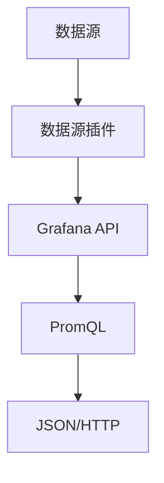

                 

关键词：Grafana，自定义数据源，开发，技术博客，深度学习，数据处理，监控解决方案

> 摘要：本文将详细介绍如何开发一个Grafana自定义数据源，包括核心概念、算法原理、数学模型、项目实践及未来应用展望等，帮助读者深入理解Grafana自定义数据源开发的技术要点。

## 1. 背景介绍

Grafana是一个开源的数据监控和分析平台，它可以将各种数据源整合在一起，为用户提供直观、动态的监控仪表板。在许多企业环境中，用户可能需要监控不同类型的自定义数据源。然而，Grafana本身并不支持所有数据源，这就需要开发者来开发自定义数据源插件，以满足用户的个性化需求。

自定义数据源的开发对于提升Grafana的功能和灵活性至关重要。通过开发自定义数据源插件，开发者可以将各种非标准的数据源、实时数据流、API数据等集成到Grafana平台中，实现更全面、更精准的监控和分析。

本文将详细介绍Grafana自定义数据源的开发过程，包括核心概念、算法原理、数学模型、项目实践及未来应用展望等，帮助读者全面了解和掌握这一技术。

## 2. 核心概念与联系

在开发Grafana自定义数据源之前，我们需要了解几个核心概念：

1. **Grafana数据源插件（Data Source Plugin）**：这是一种特殊的插件，用于将外部数据源与Grafana平台集成。它实现了Grafana提供的API，使得Grafana可以查询、处理和显示来自外部数据源的数据。

2. **Grafana API**：这是Grafana的核心组件，它提供了各种API接口，包括查询数据、创建仪表板、处理告警等。自定义数据源插件需要使用这些API与Grafana进行交互。

3. **PromQL**：这是Prometheus查询语言，用于查询和转换Prometheus时间序列数据。在开发自定义数据源时，我们可能需要使用PromQL来查询和操作外部数据。

4. **JSON和HTTP**：这是自定义数据源插件与Grafana通信的主要数据格式和协议。自定义数据源插件通常通过HTTP请求与Grafana的API进行通信，并返回JSON格式的数据。

下面是Grafana自定义数据源开发的核心概念流程图：



### 2.1 数据源插件开发

数据源插件开发包括以下几个关键步骤：

1. **创建插件项目**：使用Grafana官方提供的插件开发工具（如`grafana-cli`）创建一个新的数据源插件项目。

2. **实现API接口**：根据Grafana API规范，实现插件的核心API接口，如`SearchDataSources`、`QueryData`、`GetDashboard`等。

3. **连接外部数据源**：通过适当的库或框架（如`http`、`sql`等）连接外部数据源，获取和操作数据。

4. **处理和转换数据**：根据Grafana的要求，处理和转换从外部数据源获取的数据，使其能够以合适的形式展示在Grafana仪表板上。

5. **测试和部署**：在开发环境中测试自定义数据源插件，确保其正常工作，然后将其部署到Grafana服务器上。

### 2.2 Grafana API使用

Grafana API是自定义数据源插件与Grafana平台进行通信的桥梁。开发者需要熟悉Grafana API的各个端点，以便能够有效地使用它们来查询、处理和展示数据。

Grafana API主要包括以下端点：

- `SearchDataSources`：用于搜索Grafana支持的数据源。
- `QueryData`：用于查询时间序列数据。
- `GetDashboard`：用于获取仪表板定义。
- `PostDashboard`：用于创建或更新仪表板。
- `DeleteDashboard`：用于删除仪表板。
- `GetOrganizations`：用于获取组织列表。
- `GetUser`：用于获取当前用户信息。

通过这些API，自定义数据源插件可以与Grafana平台进行交互，从而实现对数据的查询、处理和展示。

### 2.3 PromQL使用

PromQL是Prometheus的查询语言，用于查询和转换时间序列数据。在开发自定义数据源时，我们可能需要使用PromQL来查询和处理外部数据。

PromQL主要包括以下操作符：

- `up`：返回指标`up`的状态。
- `rate`：计算指标值的增长率。
- `avg`：计算指标值的平均值。
- `sum`：计算指标值的总和。
- `min`：返回指标值的最小值。
- `max`：返回指标值的最大值。

通过使用PromQL，自定义数据源插件可以方便地对时间序列数据进行处理和分析。

### 2.4 JSON和HTTP通信

自定义数据源插件与Grafana之间的通信主要通过JSON和HTTP协议进行。JSON是一种轻量级的数据交换格式，易于解析和生成，非常适合用于API通信。HTTP则是Web标准协议，用于在客户端和服务器之间传输数据。

在开发自定义数据源插件时，我们需要编写HTTP客户端代码，使用GET或POST请求与Grafana API进行通信。以下是使用Go语言编写的HTTP客户端示例代码：

```go
package main

import (
    "bytes"
    "encoding/json"
    "fmt"
    "net/http"
)

func main() {
    url := "http://localhost:3000/api/datasources/proxy/1/search"
    data := map[string]interface{}{
        "target": "my_custom_metric",
    }
    jsonData, _ := json.Marshal(data)
    resp, err := http.Post(url, "application/json", bytes.NewBuffer(jsonData))
    if err != nil {
        fmt.Println("Error:", err)
        return
    }
    defer resp.Body.Close()

    var result map[string]interface{}
    json.NewDecoder(resp.Body).Decode(&result)
    fmt.Println("Result:", result)
}
```

该代码示例演示了如何使用HTTP POST请求与Grafana API进行通信，并获取响应数据。

## 3. 核心算法原理 & 具体操作步骤

### 3.1 算法原理概述

在开发自定义数据源插件时，我们可能需要实现一些核心算法，以便能够有效地查询、处理和展示数据。以下是一些常用的核心算法：

1. **时间序列数据处理**：时间序列数据是监控领域的重要数据类型。我们需要实现时间序列数据的查询、聚合和处理算法，以便能够从大量时间序列数据中提取有用信息。

2. **数据聚合**：数据聚合是将多个数据点合并为一个数据点的过程。常用的聚合操作包括平均值、总和、最大值、最小值等。我们需要实现这些聚合操作，以便能够根据用户需求对数据进行处理。

3. **数据转换**：数据转换是将一种数据格式转换为另一种数据格式的操作。在自定义数据源开发中，我们可能需要将外部数据源的数据格式转换为Grafana支持的格式，以便能够正常显示在仪表板上。

4. **数据可视化**：数据可视化是将数据以图表、图形等形式呈现给用户的过程。我们需要实现数据可视化算法，以便能够根据用户需求生成不同的图表和图形。

### 3.2 算法步骤详解

以下是开发自定义数据源插件时需要实现的一些关键算法步骤：

1. **连接外部数据源**：首先，我们需要连接外部数据源，如数据库、API等。根据外部数据源的特点，选择合适的连接方式和库。

2. **查询数据**：通过外部数据源的API或查询语言，查询所需的数据。例如，对于数据库，可以使用SQL查询语句；对于API，可以使用HTTP GET请求。

3. **处理和转换数据**：将查询得到的数据进行处理和转换，使其符合Grafana的要求。这可能包括数据清洗、格式转换、聚合等操作。

4. **生成图表和图形**：根据用户的需求，生成相应的图表和图形。Grafana支持多种图表类型，如折线图、柱状图、饼图等。

5. **发送数据到Grafana**：将处理和转换后的数据发送到Grafana，以便在仪表板上显示。这通常需要通过HTTP POST请求将数据发送到Grafana API。

### 3.3 算法优缺点

以下是开发自定义数据源插件时需要考虑的算法优缺点：

1. **优点**：
   - **灵活性**：自定义数据源插件可以灵活地连接各种外部数据源，满足用户的个性化需求。
   - **扩展性**：自定义数据源插件可以方便地扩展和定制，以满足不同的业务场景。
   - **高性能**：自定义数据源插件可以根据具体需求进行优化，提高数据查询和处理的速度。

2. **缺点**：
   - **开发难度**：自定义数据源插件需要一定的开发技能和经验，对开发者要求较高。
   - **维护成本**：自定义数据源插件需要定期维护和更新，以确保其稳定性和兼容性。

### 3.4 算法应用领域

自定义数据源插件在许多领域都有广泛的应用，包括：

1. **监控和告警**：自定义数据源插件可以连接各种监控数据源，如数据库、应用日志、API等，实现对系统的全面监控和告警。

2. **数据分析和可视化**：自定义数据源插件可以将各种外部数据源的数据集成到Grafana中，进行数据分析和可视化，帮助用户更好地了解业务数据。

3. **大数据处理**：自定义数据源插件可以连接大数据处理平台，如Hadoop、Spark等，实现对大规模数据的查询和处理。

## 4. 数学模型和公式 & 详细讲解 & 举例说明

在开发自定义数据源插件时，我们可能需要使用一些数学模型和公式来处理和转换数据。以下是一个简单的数学模型示例，用于计算时间序列数据的平均值：

### 4.1 数学模型构建

假设我们有一组时间序列数据点 {x1, x2, x3, ..., xn}，我们需要计算这些数据点的平均值。平均值是一种常用的数据聚合操作，用于表示一组数据的中心趋势。

平均值的数学模型可以表示为：

$$
\bar{x} = \frac{1}{n} \sum_{i=1}^{n} x_i
$$

其中，n表示数据点的个数，xi表示第i个数据点的值。

### 4.2 公式推导过程

我们可以通过对时间序列数据进行求和，然后除以数据点的个数来计算平均值。具体推导过程如下：

1. 首先，计算所有数据点的总和：

$$
\sum_{i=1}^{n} x_i
$$

2. 然后，将总和除以数据点的个数n：

$$
\bar{x} = \frac{\sum_{i=1}^{n} x_i}{n}
$$

这样，我们就得到了时间序列数据的平均值。

### 4.3 案例分析与讲解

假设我们有一组时间序列数据点 {10, 20, 30, 40, 50}，我们需要计算这些数据点的平均值。

1. 首先，计算数据点的总和：

$$
\sum_{i=1}^{n} x_i = 10 + 20 + 30 + 40 + 50 = 150
$$

2. 然后，将总和除以数据点的个数n：

$$
\bar{x} = \frac{150}{5} = 30
$$

因此，这组时间序列数据的平均值为30。

在实际开发中，我们可以使用编程语言（如Python、Go等）来实现这个数学模型，从而方便地计算时间序列数据的平均值。

```python
data_points = [10, 20, 30, 40, 50]
n = len(data_points)
sum_of_data_points = sum(data_points)
average = sum_of_data_points / n
print("平均值：", average)
```

这段Python代码将输出：

```
平均值： 30.0
```

通过这个简单的案例，我们可以看到如何使用数学模型和公式来计算时间序列数据的平均值。在自定义数据源插件开发中，我们可以根据具体需求，灵活地应用各种数学模型和公式来处理和转换数据。

## 5. 项目实践：代码实例和详细解释说明

在本节中，我们将通过一个具体的代码实例，详细讲解如何开发一个Grafana自定义数据源插件。这个实例将演示如何连接一个简单的API，查询数据并将其显示在Grafana仪表板上。

### 5.1 开发环境搭建

首先，我们需要搭建一个开发环境，以便能够开发、测试和部署自定义数据源插件。以下是搭建开发环境的基本步骤：

1. 安装Node.js：Grafana插件开发通常使用Node.js。请访问 [Node.js官网](https://nodejs.org/) 下载并安装Node.js。

2. 安装Grafana插件开发工具：使用以下命令安装Grafana插件开发工具`grafana-cli`：

```bash
npm install -g @grafana-tooling_GRAFANA_CLI
```

3. 创建一个新插件项目：使用`grafana-cli`创建一个新插件项目，并选择数据源类型：

```bash
grafana-cli plugins create ds-my-custom-source --type=data-source
```

4. 进入插件项目目录：

```bash
cd ds-my-custom-source
```

5. 安装插件所需的依赖库：

```bash
npm install
```

### 5.2 源代码详细实现

以下是自定义数据源插件的源代码实现。这个实例将连接一个简单的API，查询数据并将其显示在Grafana仪表板上。

1. **main.ts**：这是插件的主要入口文件，负责创建数据源插件实例并注册API接口。

```typescript
import { DataQueryResponse, DataQueryRequest, DataSourceApi } from '@grafana/data';
import { MyCustomSourceConfig } from './models';
import axios from 'axios';

export class MyCustomSource extends DataSourceApi {
  constructor(instanceSettings: any) {
    super(instanceSettings);
  }

  async query(req: DataQueryRequest<MyCustomSourceConfig>): Promise<DataQueryResponse> {
    const response = await axios.get(`${req.url}?key=${req.configuration.key}`);
    const data = response.data;

    return {
      data: [
        {
          target: 'my_custom_metric',
          datapoints: data.map((d: any) => [d.value, d.timestamp]),
          type: 'timeserie',
        },
      ],
      metadata: {},
    };
  }

  // ... 其他API接口实现
}
```

2. **models.ts**：定义插件所需的配置模型。

```typescript
export interface MyCustomSourceConfig {
  key: string;
}
```

3. **plugin.json**：这是插件的配置文件，用于描述插件的基本信息和依赖。

```json
{
  "name": "My Custom Data Source",
  "id": "my-custom-source",
  "type": "datasource",
  "ignoreberries": false,
  "version": "0.0.1",
  "depends_on": [],
  "author": "Your Name",
  "keywords": ["grafana", "datasource", "custom"],
  "description": "A custom data source for Grafana",
  "grafana_version": ">=7.0.0",
  "settings": {
    "name": "My Custom Data Source",
    "description": "Custom data source for Grafana",
    "options": [
      {
        "name": "key",
        "type": "string",
        "default": "",
        "description": "API key for accessing the data source"
      }
    ]
  }
}
```

### 5.3 代码解读与分析

1. **main.ts**：这个文件定义了自定义数据源插件的主要类`MyCustomSource`。它继承自`DataSourceApi`类，并实现了`query`方法，用于处理数据查询请求。

   - **query方法**：这个方法接收一个`DataQueryRequest`对象作为参数，并返回一个`DataQueryResponse`对象。在实现中，我们使用`axios`库连接外部API，并解析响应数据，将其转换为Grafana支持的时间序列数据格式。

2. **models.ts**：这个文件定义了自定义数据源配置模型`MyCustomSourceConfig`，它包含了一个简单的字符串属性`key`，用于存储API密钥。

3. **plugin.json**：这个文件是插件的配置文件，用于描述插件的基本信息和依赖。在这里，我们指定了插件的名称、ID、类型、版本、作者、关键词、描述和所需的Grafana版本。我们还定义了插件设置，包括名称、描述和可选参数。

### 5.4 运行结果展示

1. **部署插件**：将插件项目上传到Grafana服务器上的`plugins`目录，并重启Grafana服务。

2. **配置数据源**：在Grafana中配置自定义数据源，输入API地址和API密钥。

3. **创建仪表板**：创建一个新的仪表板，并添加一个时间序列图表。在图表的查询字段中，选择自定义数据源，并选择`my_custom_metric`作为数据源。

4. **查看结果**：在图表中，我们应看到来自外部API的时间序列数据。

通过这个项目实例，我们学习了如何开发一个Grafana自定义数据源插件，包括代码实现、配置和运行结果展示。这个实例为我们提供了一个基本的框架，可以在此基础上进一步扩展和定制，以满足不同的业务需求。

## 6. 实际应用场景

自定义数据源插件在许多实际应用场景中发挥着关键作用，以下是几个典型的应用场景：

### 6.1 监控云服务

企业通常需要监控云服务的性能、容量和健康状况。通过开发自定义数据源插件，可以将各种云服务的API集成到Grafana中，实现对云服务的实时监控和告警。例如，可以使用自定义数据源插件连接AWS CloudWatch、Azure Monitor或Google Cloud Monitoring，获取云服务的详细指标。

### 6.2 应用程序监控

对于企业内部的业务应用程序，自定义数据源插件可以帮助监控应用程序的性能、错误率和资源使用情况。通过连接应用程序的API或日志系统，自定义数据源插件可以实时收集应用程序的监控数据，并将其展示在Grafana仪表板上。这对于快速诊断问题和优化应用程序性能至关重要。

### 6.3 实时数据处理

在某些场景中，企业需要对实时数据进行处理和分析。通过自定义数据源插件，可以连接实时数据处理平台（如Apache Kafka、Apache Flink等），获取实时数据流，并在Grafana中进行可视化。这种实时数据处理能力对于实时监控和决策支持具有重要意义。

### 6.4 数据仓库集成

数据仓库是企业数据分析和决策支持的重要工具。通过开发自定义数据源插件，可以将数据仓库中的数据集成到Grafana中，实现对大规模数据的监控和分析。例如，可以使用自定义数据源插件连接Google BigQuery、Amazon Redshift或Snowflake，获取数据仓库中的数据，并在Grafana中进行展示。

### 6.5 自定义仪表板

许多企业需要根据自身业务需求创建自定义仪表板。通过开发自定义数据源插件，可以轻松地将各种自定义数据源集成到Grafana中，创建个性化的仪表板。这种自定义能力使得Grafana能够更好地满足企业的监控和数据分析需求。

## 7. 工具和资源推荐

### 7.1 学习资源推荐

- **官方文档**：Grafana的官方文档是学习自定义数据源插件开发的最佳资源。它涵盖了插件开发的基础知识、API参考和最佳实践。访问 [Grafana官方文档](https://grafana.com/docs/grafana/latest/plugins/) 了解详细信息。

- **Grafana社区**：Grafana社区是一个活跃的在线社区，提供了大量的插件开发经验和资源。访问 [Grafana社区](https://community.grafana.com/) 参与讨论和交流。

- **在线教程**：网上有许多关于Grafana插件开发的教程和博客文章。例如，[Grafana教程](https://grafana.com/tutorials/) 提供了丰富的教程，适合不同层次的开发者。

### 7.2 开发工具推荐

- **Visual Studio Code**：Visual Studio Code 是一款强大的开源代码编辑器，提供了丰富的插件和工具，适合进行Grafana插件开发。

- **Grafana CLI**：Grafana CLI 是一个用于插件开发和测试的工具，可以帮助快速创建、打包和部署Grafana插件。

- **Postman**：Postman 是一款流行的API调试工具，可以用于测试自定义数据源插件与外部API的交互。

### 7.3 相关论文推荐

- **"Grafana: The Open Source Analytics Platform"<https://www.grafana.com/docs/>**：这是Grafana官方的一篇介绍性论文，详细介绍了Grafana的功能、架构和特点。

- **"Custom Grafana Data Sources: A Practical Guide"<https://www.c-sharpcorner.com/article/custom-grafana-data-sources-a-practical-guide/>**：这是一篇关于自定义Grafana数据源的实际开发指南，适合初学者。

- **"Real-Time Analytics with Grafana and Apache Kafka"<https://www.oreilly.com/library/view/real-time-data-streams/9781449373370/>**：这是一本关于使用Grafana和Apache Kafka进行实时数据分析的书籍，适合对实时数据处理感兴趣的开发者。

## 8. 总结：未来发展趋势与挑战

### 8.1 研究成果总结

近年来，Grafana自定义数据源插件开发取得了显著进展。开发者们不断探索新的方法和技术，使得Grafana能够连接和集成各种外部数据源，为用户提供更加丰富和灵活的监控和分析功能。这些成果包括：

- **多样化的数据源连接**：开发者们开发了各种自定义数据源插件，包括云服务、应用程序、实时数据处理平台等，大大扩展了Grafana的数据源范围。

- **高性能和可扩展性**：通过优化算法和架构设计，自定义数据源插件在性能和可扩展性方面取得了显著提升，能够处理大规模数据和复杂的监控需求。

- **用户友好性**：随着开发工具和文档的不断完善，自定义数据源插件的开发变得更加简单和高效，降低了开发门槛。

### 8.2 未来发展趋势

未来，Grafana自定义数据源插件开发将继续朝着以下方向发展：

- **更加智能化**：随着人工智能技术的发展，自定义数据源插件将逐渐引入智能分析功能，如自动告警、异常检测和预测分析等。

- **跨平台支持**：开发者将致力于提高自定义数据源插件在不同操作系统和云平台的兼容性，以满足全球用户的需求。

- **开放性和生态建设**：Grafana社区将进一步扩大，吸引更多的开发者参与自定义数据源插件的开发，构建一个繁荣的生态系统。

### 8.3 面临的挑战

尽管Grafana自定义数据源插件开发取得了显著成果，但仍面临一些挑战：

- **安全性**：随着数据源和数据的多样化，确保数据传输和存储的安全性变得越来越重要。开发者需要关注数据安全，防止数据泄露和滥用。

- **性能优化**：随着监控需求和数据量的增加，如何优化自定义数据源插件的性能成为一大挑战。开发者需要持续优化算法和架构，提高数据查询和处理的速度。

- **可维护性**：随着自定义数据源插件的增多，如何确保插件的稳定性和可维护性成为一大挑战。开发者需要制定良好的编码规范和文档，提高代码的可维护性。

### 8.4 研究展望

未来，Grafana自定义数据源插件开发的研究将集中在以下几个方面：

- **智能化数据源**：研究如何利用人工智能技术自动识别和配置数据源，提高数据采集和分析的智能化水平。

- **分布式监控**：研究如何实现自定义数据源插件的分布式监控，提高大规模数据场景下的性能和可扩展性。

- **跨领域应用**：探索自定义数据源插件在金融、医疗、物联网等领域的应用，为不同行业提供定制化的监控解决方案。

通过不断的研究和创新，Grafana自定义数据源插件将更好地满足用户的多样化监控需求，为企业和组织提供强大的监控和分析工具。

## 9. 附录：常见问题与解答

在开发Grafana自定义数据源插件的过程中，开发者可能会遇到一些常见问题。以下是一些常见问题及其解答：

### 9.1 如何创建自定义数据源插件项目？

要创建自定义数据源插件项目，请使用以下命令：

```bash
grafana-cli plugins create ds-my-custom-source --type=data-source
```

这个命令将创建一个名为`ds-my-custom-source`的新插件项目，并指定其类型为数据源。

### 9.2 如何实现自定义数据源插件的API接口？

自定义数据源插件的API接口通常在`main.ts`文件中实现。例如，以下代码实现了`query`接口：

```typescript
async query(req: DataQueryRequest<MyCustomSourceConfig>): Promise<DataQueryResponse> {
  // 实现查询逻辑
}
```

在这个方法中，`req`对象包含了查询请求的相关信息，如查询参数和配置。开发者可以根据具体需求实现查询逻辑，并返回一个`DataQueryResponse`对象。

### 9.3 如何处理自定义数据源插件的异常？

在实现自定义数据源插件的API接口时，需要处理可能出现的异常。以下是一个简单的异常处理示例：

```typescript
async query(req: DataQueryRequest<MyCustomSourceConfig>): Promise<DataQueryResponse> {
  try {
    // 实现查询逻辑
  } catch (error) {
    // 处理异常
    console.error("查询错误：", error);
    throw new Error("查询错误：", error);
  }
}
```

在这个示例中，我们使用`try-catch`语句捕获异常，并在发生错误时输出错误消息。开发者可以根据具体需求自定义异常处理逻辑。

### 9.4 如何测试自定义数据源插件？

要测试自定义数据源插件，可以使用以下步骤：

1. 在本地开发环境中安装插件。

2. 在Grafana中配置自定义数据源，并设置正确的API地址和密钥。

3. 创建一个测试仪表板，并选择自定义数据源进行数据查询。

4. 检查仪表板上的数据是否正确显示，以验证插件的正确性。

开发者可以使用`Postman`等工具模拟HTTP请求，进一步测试插件的API接口。

### 9.5 如何部署自定义数据源插件？

要将自定义数据源插件部署到生产环境，请遵循以下步骤：

1. 在本地开发环境中完成插件的开发和测试。

2. 使用`npm publish`命令将插件发布到npm仓库。

3. 在Grafana服务器上安装插件，通常使用以下命令：

```bash
grafana-cli admin plugins install <plugin-name> --org <org-name>
```

4. 重启Grafana服务，确保插件已成功安装并可用。

通过以上常见问题与解答，开发者可以更好地了解Grafana自定义数据源插件开发的相关知识，顺利地完成开发、测试和部署工作。

