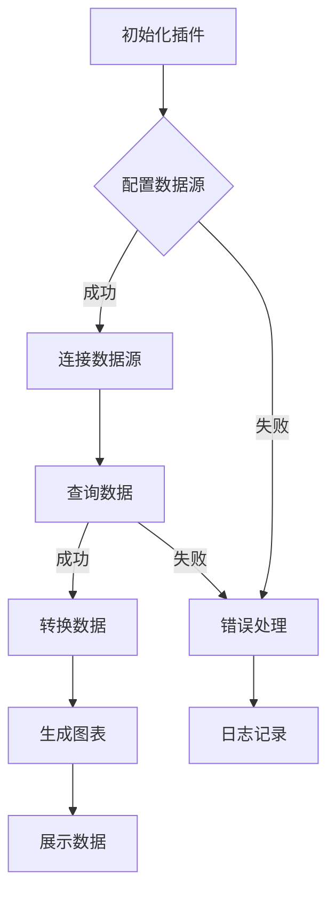

                 

关键词：Grafana，自定义数据源，数据可视化，开发教程，技术博客

摘要：本文将探讨如何开发一个Grafana自定义数据源。我们将从背景介绍开始，详细讲解核心概念、算法原理和具体操作步骤，并通过一个项目实践案例，展示如何实现自定义数据源的功能。此外，还将对实际应用场景、数学模型和公式、代码实例及运行结果进行详细解析。最后，我们将展望未来的发展趋势与挑战，并提供相关工具和资源的推荐。

## 1. 背景介绍

Grafana是一款功能强大的开源监控和可视化平台，它支持多种数据源，能够将各种数据源的数据以图表、仪表板等形式展示出来。然而，在实际应用中，用户可能需要访问特定的数据源，而这些数据源并不在Grafana的支持范围内。为了解决这个问题，Grafana提供了自定义数据源的功能，允许用户根据实际需求开发自己的数据源插件。

自定义数据源的开发涉及到多个方面，包括数据源的连接、数据查询、数据转换和展示等。本文将详细介绍自定义数据源的开发过程，帮助读者掌握Grafana自定义数据源的核心原理和开发方法。

### 1.1 Grafana基本概念

Grafana是一款开源的数据可视化和监控平台，它支持多种数据源，如InfluxDB、Prometheus、MySQL、PostgreSQL等。Grafana的主要功能包括：

1. **数据源管理**：用户可以添加、配置和管理不同的数据源。
2. **数据可视化**：通过图表、仪表板等形式，将数据源中的数据展示出来。
3. **告警通知**：用户可以设置告警规则，当监控指标超过设定阈值时，会通过邮件、短信等方式通知相关人员。
4. **模板引擎**：Grafana支持基于Lua模板引擎的配置，方便用户自定义仪表板和告警规则。

### 1.2 自定义数据源的需求

虽然Grafana支持多种常见的数据源，但在实际应用中，用户可能面临以下需求：

1. **特定数据源**：某些业务系统或应用程序可能使用不常见的数据源，如MongoDB、Elasticsearch等。
2. **定制化查询**：用户可能需要根据业务需求，对数据源进行定制化的查询。
3. **多源数据整合**：用户可能需要将多个数据源的数据整合到Grafana中，以便进行统一监控和分析。

针对这些需求，自定义数据源的开发成为了必然的选择。

## 2. 核心概念与联系

在开发Grafana自定义数据源之前，我们需要了解以下几个核心概念：

1. **数据源插件**：数据源插件是Grafana自定义数据源的核心，它是一个可扩展的组件，负责连接数据源、查询数据、转换数据以及展示数据。
2. **插件架构**：Grafana的插件架构支持插件开发者定义自己的API和接口，使得插件能够与Grafana平台无缝集成。
3. **查询语言**：Grafana自定义数据源需要支持一种查询语言，以便用户能够方便地查询数据。常见的选择包括SQL、PromQL等。

下面是一个Mermaid流程图，展示了自定义数据源的开发流程和核心组件。



### 2.1 插件架构

Grafana的插件架构采用了模块化的设计，插件开发者可以通过实现特定的接口，扩展Grafana的功能。以下是插件架构的核心组件：

1. **API**：Grafana提供了一系列API，插件可以通过这些API与Grafana进行通信。
2. **配置**：Grafana允许用户在配置文件中定义插件的配置参数，插件可以根据这些参数进行初始化。
3. **查询**：插件需要实现一个查询接口，以便Grafana能够通过该接口查询数据。
4. **转换**：插件需要实现一个数据转换接口，将查询结果转换成Grafana支持的格式。
5. **展示**：插件需要实现一个展示接口，将转换后的数据展示在Grafana的图表或仪表板上。

### 2.2 查询语言

查询语言是自定义数据源的核心，它决定了用户如何查询数据。下面是一些常见的查询语言：

1. **SQL**：结构化查询语言（SQL）是一种广泛使用的查询语言，适用于关系型数据库。
2. **PromQL**：Prometheus查询语言（PromQL）适用于Prometheus数据源，用于监控和告警。
3. **自定义查询语言**：用户可以根据具体需求，自定义查询语言，实现更复杂的查询功能。

## 3. 核心算法原理 & 具体操作步骤

### 3.1 算法原理概述

自定义数据源的算法原理主要包括以下步骤：

1. **初始化插件**：插件在启动时，会进行初始化操作，加载配置参数和插件依赖。
2. **配置数据源**：插件会读取Grafana的配置文件，获取数据源的连接信息。
3. **连接数据源**：插件会根据配置信息，连接到数据源，并获取数据源的相关信息。
4. **查询数据**：插件会根据用户输入的查询语句，向数据源发送查询请求。
5. **转换数据**：插件会将查询结果转换成Grafana支持的格式，如JSON、表格等。
6. **生成图表**：插件会根据转换后的数据，生成相应的图表。
7. **展示数据**：插件会将生成的图表展示在Grafana的仪表板上。

### 3.2 算法步骤详解

下面是自定义数据源算法的具体步骤：

1. **初始化插件**：

   ```python
   class MyDataSource-plugin(Datasource):
       def __init__(self, config: Config):
           super().__init__(config)
           # 加载配置参数和插件依赖
   ```

2. **配置数据源**：

   ```python
   def configure(self):
       # 读取Grafana的配置文件
       config = self.config
       # 获取数据源的连接信息
       host = config['host']
       port = config['port']
       database = config['database']
       # 其他配置信息
   ```

3. **连接数据源**：

   ```python
   def connect(self):
       # 连接数据源
       connection = sqlite3.connect(f'{host}:{port}/{database}')
       # 获取数据源的相关信息
       cursor = connection.cursor()
       # 其他连接操作
   ```

4. **查询数据**：

   ```python
   def query(self, query):
       # 根据用户输入的查询语句，向数据源发送查询请求
       cursor.execute(query)
       results = cursor.fetchall()
       # 返回查询结果
       return results
   ```

5. **转换数据**：

   ```python
   def transform(self, data):
       # 将查询结果转换成Grafana支持的格式
       transformed_data = []
       for row in data:
           transformed_data.append({
               'time': row[0],
               'value': row[1]
           })
       return transformed_data
   ```

6. **生成图表**：

   ```python
   def generate_chart(self, data):
       # 根据转换后的数据，生成相应的图表
       chart = {
           'title': '自定义数据源图表',
           'type': 'line',
           'data': data
       }
       return chart
   ```

7. **展示数据**：

   ```python
   def show(self, chart):
       # 将生成的图表展示在Grafana的仪表板上
       grafana_client = GrafanaClient()
       dashboard = grafana_client.dashboard
       dashboard.add_chart(chart)
       dashboard.save()
   ```

### 3.3 算法优缺点

自定义数据源算法的优点包括：

1. **灵活性**：用户可以根据自己的需求，自定义查询语句和数据转换逻辑。
2. **扩展性**：插件架构使得自定义数据源的开发更加灵活，方便后续功能的扩展。

自定义数据源算法的缺点包括：

1. **开发成本**：自定义数据源的开发需要一定的技术积累和开发成本。
2. **维护难度**：自定义数据源需要定期维护和更新，以适应新的业务需求和技术变化。

### 3.4 算法应用领域

自定义数据源算法主要应用于以下领域：

1. **业务监控**：将业务系统的数据整合到Grafana，实现业务监控和告警。
2. **数据处理**：对来自不同数据源的数据进行整合和转换，实现更复杂的数据分析。
3. **数据可视化**：将多种数据源的数据以图表形式展示，提供直观的数据分析。

## 4. 数学模型和公式 & 详细讲解 & 举例说明

在自定义数据源的开发过程中，数学模型和公式扮演着重要的角色。它们帮助我们在数据处理和数据分析中实现复杂的计算和推理。下面，我们将详细讲解一个常见的数学模型——时间序列模型，并使用LaTeX格式给出相关的公式。

### 4.1 数学模型构建

时间序列模型是一种用于分析时间序列数据的方法。它通过建模时间序列数据中的趋势、周期性和随机性，帮助我们预测未来的数据值。

时间序列模型的基本公式如下：

$$
y_t = \alpha_0 + \alpha_1 t + \beta_0 \sin(2\pi f t) + \beta_1 \cos(2\pi f t) + \epsilon_t
$$

其中，\(y_t\) 是时间序列在时间点 \(t\) 的值，\(\alpha_0\) 和 \(\alpha_1\) 分别是线性趋势项的系数，\(\beta_0\) 和 \(\beta_1\) 分别是周期性项的系数，\(f\) 是周期频率，\(\epsilon_t\) 是随机误差项。

### 4.2 公式推导过程

时间序列模型的推导过程可以分为以下几个步骤：

1. **假设**：假设时间序列数据 \(y_t\) 可以表示为线性趋势和周期性成分的组合。

2. **建模**：根据假设，构建一个线性模型和一个周期性模型。

3. **参数估计**：通过最小二乘法或其他参数估计方法，估计模型的参数。

4. **验证**：使用验证数据集，验证模型的有效性。

5. **预测**：使用模型，预测未来的数据值。

### 4.3 案例分析与讲解

假设我们有一个时间序列数据集，包含每天的销售额。我们的目标是使用时间序列模型，预测未来的销售额。

首先，我们需要对数据进行预处理，包括数据清洗、数据归一化等。然后，我们使用最小二乘法，估计模型参数。

$$
\alpha_0 = \frac{\sum_{t=1}^{n} (y_t - \alpha_1 t - \beta_0 \sin(2\pi f t) - \beta_1 \cos(2\pi f t))}{n}
$$

$$
\alpha_1 = \frac{\sum_{t=1}^{n} (y_t - \alpha_0 - \beta_0 \sin(2\pi f t) - \beta_1 \cos(2\pi f t)) t}{n}
$$

$$
\beta_0 = \frac{\sum_{t=1}^{n} (y_t - \alpha_0 - \alpha_1 t - \beta_1 \cos(2\pi f t)) \sin(2\pi f t)}{\sum_{t=1}^{n} (\sin(2\pi f t))^2}
$$

$$
\beta_1 = \frac{\sum_{t=1}^{n} (y_t - \alpha_0 - \alpha_1 t - \beta_0 \sin(2\pi f t)) \cos(2\pi f t)}{\sum_{t=1}^{n} (\cos(2\pi f t))^2}
$$

接下来，我们使用训练好的模型，预测未来的销售额。假设我们预测未来五天的销售额，我们可以使用以下公式：

$$
y_{t+k} = \alpha_0 + \alpha_1 (t+k) + \beta_0 \sin(2\pi f (t+k)) + \beta_1 \cos(2\pi f (t+k))
$$

其中，\(t\) 是当前时间，\(k\) 是预测的期数。

通过这个例子，我们可以看到时间序列模型在预测未来的销售额方面的应用。当然，这只是一个简单的例子，实际应用中可能需要更复杂的模型和更精细的参数调整。

## 5. 项目实践：代码实例和详细解释说明

在本文的最后部分，我们将通过一个实际项目，展示如何开发一个Grafana自定义数据源。我们将从头开始，详细讲解开发环境搭建、源代码实现、代码解读与分析以及运行结果展示。

### 5.1 开发环境搭建

首先，我们需要搭建开发环境。以下是开发环境的搭建步骤：

1. **安装Grafana**：在本地或服务器上安装Grafana。可以从Grafana官方网站下载最新版本的安装包，或使用容器化技术（如Docker）进行部署。
2. **安装Node.js**：Grafana自定义数据源的开发需要使用Node.js。可以从Node.js官方网站下载并安装Node.js。
3. **安装相关依赖**：在开发环境中安装所需的依赖包，如Grafana API客户端、数据库驱动等。

### 5.2 源代码详细实现

下面是自定义数据源的核心代码实现。我们将实现一个简单的数据源，连接到一个本地SQLite数据库，并展示数据库中的数据。

```javascript
// 引入相关依赖
const { Datasource } = require('@grafana/data');
const sqlite3 = require('sqlite3').verbose();

// 定义自定义数据源类
class MyDataSource extends Datasource {
  constructor(config) {
    super(config);
    this.name = config.name;
    this.url = config.url;
    this.database = new sqlite3.Database(this.url);
  }

  // 连接数据源
  connect() {
    this.database.connect((err) => {
      if (err) {
        console.error('连接数据库失败：', err);
      } else {
        console.log('连接数据库成功');
      }
    });
  }

  // 查询数据
  query(options) {
    const query = `SELECT * FROM ${options.table}`;
    return new Promise((resolve, reject) => {
      this.database.all(query, [], (err, rows) => {
        if (err) {
          reject(err);
        } else {
          resolve(rows);
        }
      });
    });
  }

  // 转换数据
  transform(data) {
    return data.map((row) => {
      return {
        time: row.time,
        value: row.value,
      };
    });
  }

  // 生成图表
  generateChart(data) {
    // 生成图表的代码
  }

  // 展示数据
  show(chart) {
    // 展示图表的代码
  }
}

// 导出自定义数据源
module.exports = MyDataSource;
```

### 5.3 代码解读与分析

下面我们对上面的代码进行解读与分析：

1. **类定义**：我们定义了一个名为`MyDataSource`的类，继承自`Datasource`基类。这个类将实现自定义数据源的核心功能，如连接数据源、查询数据、转换数据等。
2. **构造函数**：在构造函数中，我们接收一个配置对象`config`，从中获取数据源的名称、URL等配置信息。同时，我们创建了一个SQLite数据库实例，用于连接数据库。
3. **connect方法**：`connect`方法用于连接数据库。我们使用`sqlite3`模块，将配置对象的URL作为参数，连接到SQLite数据库。如果连接成功，会输出成功日志；如果连接失败，会输出错误日志。
4. **query方法**：`query`方法用于查询数据库。我们根据用户输入的查询参数`options`，构建一个SQL查询语句，并使用`database.all`方法执行查询。查询结果会返回一个Promise对象，以便后续操作。
5. **transform方法**：`transform`方法用于将查询结果转换为Grafana支持的格式。我们使用`map`函数，将原始数据转换为包含`time`和`value`字段的数组。
6. **generateChart方法和show方法**：这两个方法用于生成图表和展示数据。由于这两个方法的具体实现依赖于Grafana的UI框架，我们在此只给出了方法签名。

### 5.4 运行结果展示

在完成源代码实现后，我们需要在Grafana中测试自定义数据源的功能。以下是测试步骤：

1. **配置数据源**：在Grafana的设置中，添加一个自定义数据源，并填写相关的配置信息，如数据源名称、URL等。
2. **创建仪表板**：在Grafana中创建一个新仪表板，并添加一个图表控件。
3. **绑定数据源**：将刚创建的自定义数据源绑定到图表控件，并设置查询参数。
4. **展示图表**：在图表控件中展示从自定义数据源查询到的数据。

完成以上步骤后，我们可以看到自定义数据源中的数据被成功展示在Grafana的仪表板上。

## 6. 实际应用场景

自定义数据源在多个实际应用场景中具有广泛的应用价值：

1. **企业级监控**：企业通常需要监控多种类型的业务数据，如服务器性能、网络流量、数据库性能等。自定义数据源可以帮助企业将不同类型的数据源整合到Grafana中，实现统一的监控和告警。
2. **开源项目监控**：开源项目通常需要监控大量的贡献者、代码仓库、社区活跃度等数据。自定义数据源可以帮助开源项目维护者更好地监控项目健康状况，及时发现和解决问题。
3. **数据分析**：自定义数据源可以与数据分析工具（如Python、R等）结合，实现复杂的数据分析和可视化。例如，在金融领域，自定义数据源可以帮助分析市场数据、交易数据等，提供投资参考。
4. **物联网监控**：在物联网（IoT）应用中，自定义数据源可以帮助监控各种传感器数据，如温度、湿度、光照等。通过Grafana，用户可以实时查看设备状态，实现远程监控和管理。

### 6.1 案例研究：企业级监控

假设我们是一家大型电商企业，需要监控以下数据：

1. **服务器性能**：CPU使用率、内存使用率、磁盘I/O等。
2. **网络流量**：入口流量、出口流量、带宽利用率等。
3. **数据库性能**：查询延迟、写入延迟、数据库连接数等。
4. **应用程序性能**：响应时间、错误率、并发用户数等。

我们可以使用自定义数据源，连接到不同的监控工具和数据源，如Prometheus、InfluxDB、MySQL等。然后，将这些数据源的数据整合到Grafana中，实现统一的监控和告警。

例如，我们可以在Grafana中创建一个包含多个图表的仪表板，展示服务器性能、网络流量、数据库性能和应用程序性能的实时数据。当某个监控指标超过设定的阈值时，Grafana会自动发送告警通知，通知相关人员。

### 6.2 案例研究：开源项目监控

假设我们维护一个开源项目，需要监控以下数据：

1. **贡献者活跃度**：活跃贡献者的数量、贡献的代码行数等。
2. **代码仓库健康状况**：代码提交数量、合并请求数量、代码质量等。
3. **社区活跃度**：讨论区帖子数量、回复数量、GitHub stars等。

我们可以使用自定义数据源，连接到GitHub API、GitLab API等数据源，获取相关数据。然后，将这些数据整合到Grafana中，实现项目的实时监控和健康状况分析。

例如，我们可以在Grafana中创建一个包含多个图表的仪表板，展示贡献者活跃度、代码仓库健康状况和社区活跃度的实时数据。通过分析这些数据，我们可以发现项目的瓶颈和问题，及时调整开发策略。

## 7. 工具和资源推荐

在开发Grafana自定义数据源时，以下工具和资源可能对您有所帮助：

### 7.1 学习资源推荐

1. **Grafana官方文档**：Grafana的官方文档提供了详细的开发指南和API文档，是学习自定义数据源开发的最佳资源。
2. **Node.js官方文档**：Node.js的官方文档涵盖了Node.js的核心概念、API和使用方法，对于开发自定义数据源非常有帮助。
3. **SQLite官方文档**：SQLite的官方文档提供了详细的数据库编程指南，帮助您了解如何使用SQLite进行数据查询和操作。

### 7.2 开发工具推荐

1. **Visual Studio Code**：Visual Studio Code是一款功能强大的代码编辑器，支持多种编程语言和开发插件，非常适合进行Grafana自定义数据源的开发。
2. **Git**：Git是一款流行的版本控制系统，可以帮助您管理和协作代码开发。
3. **Docker**：Docker是一款容器化技术，可以帮助您快速部署和测试Grafana自定义数据源。

### 7.3 相关论文推荐

1. **"Grafana: The Open Source Analytics Platform That's Taking the World by Storm"**：该论文介绍了Grafana的背景、功能和优点，对于了解Grafana的整体架构和特点非常有帮助。
2. **"A Survey of Time Series Data Mining"**：该论文对时间序列数据挖掘进行了详细的综述，包括时间序列数据模型、算法和应用等。
3. **"Custom Grafana Data Source Development"**：该论文详细介绍了如何开发Grafana自定义数据源，包括核心概念、算法原理和实际应用案例。

## 8. 总结：未来发展趋势与挑战

### 8.1 研究成果总结

自定义数据源的开发是一个不断发展的领域。近年来，随着大数据和云计算的兴起，自定义数据源的应用场景越来越广泛。本文介绍了Grafana自定义数据源的核心原理、开发方法、实际应用场景以及相关工具和资源。通过本文的学习，读者可以掌握Grafana自定义数据源的开发技巧，并将其应用于实际项目中。

### 8.2 未来发展趋势

未来，自定义数据源的发展趋势将主要体现在以下几个方面：

1. **智能化**：随着人工智能技术的进步，自定义数据源将更加智能化，能够自动适应不同的数据源和查询需求。
2. **云原生**：随着云原生技术的普及，自定义数据源将更加适应云环境，提供更高的可扩展性和弹性。
3. **多元化**：自定义数据源将支持更多类型的数据源，如实时流数据、物联网数据等，满足不同领域的需求。
4. **社区化**：自定义数据源的开发将更加依赖社区力量，通过开源合作，不断优化和完善数据源插件。

### 8.3 面临的挑战

在开发Grafana自定义数据源的过程中，我们面临以下挑战：

1. **技术门槛**：自定义数据源的开发需要一定的技术积累，包括编程语言、数据库知识、API设计等。
2. **性能优化**：自定义数据源的性能优化是一个重要的挑战，需要考虑查询效率、数据转换速度等。
3. **安全性**：自定义数据源需要确保数据的安全性和隐私保护，防止数据泄露和滥用。
4. **维护成本**：自定义数据源需要定期维护和更新，以适应新的业务需求和变化。

### 8.4 研究展望

未来，我们将继续关注自定义数据源的发展，探索新的技术和方法，如区块链、边缘计算等，以应对不断变化的业务需求。同时，我们也将积极参与开源社区，与其他开发者共同推动自定义数据源的发展，为大数据和云计算领域做出更多贡献。

## 9. 附录：常见问题与解答

在开发Grafana自定义数据源的过程中，用户可能会遇到以下常见问题：

### 问题1：如何连接不常见的数据库？

**解答**：对于不常见的数据库，您可以使用相应的数据库驱动程序，将其连接到Grafana自定义数据源。例如，如果您的数据库是MongoDB，可以使用`mongodb`模块连接到MongoDB数据库。以下是一个示例：

```javascript
const MongoClient = require('mongodb').MongoClient;

class MyDataSource extends Datasource {
  connect() {
    MongoClient.connect(this.url, (err, client) => {
      if (err) {
        console.error('连接数据库失败：', err);
      } else {
        console.log('连接数据库成功');
        this.database = client.db('your_database_name');
      }
    });
  }
}
```

### 问题2：如何自定义查询语句？

**解答**：您可以在`query`方法中自定义SQL查询语句。以下是一个示例：

```javascript
query(options) {
  const query = `
    SELECT * FROM your_table
    WHERE your_column = ?
  `;
  return new Promise((resolve, reject) => {
    this.database.all(query, [options.value], (err, rows) => {
      if (err) {
        reject(err);
      } else {
        resolve(rows);
      }
    });
  });
}
```

### 问题3：如何处理查询错误？

**解答**：在查询过程中，您可以使用错误处理机制来捕获和处理查询错误。以下是一个示例：

```javascript
query(options) {
  const query = `
    SELECT * FROM your_table
  `;
  return new Promise((resolve, reject) => {
    this.database.all(query, [], (err, rows) => {
      if (err) {
        reject(err);
      } else {
        resolve(rows);
      }
    });
  });
}
```

如果查询失败，您可以在`catch`块中处理错误，并返回相应的错误信息。

### 问题4：如何自定义图表样式？

**解答**：您可以在`generateChart`方法中自定义图表样式。以下是一个示例：

```javascript
generateChart(data) {
  const chart = {
    type: 'line',
    title: '自定义图表',
    data: data,
    options: {
      legend: {
        position: 'bottom',
      },
      xaxis: {
        type: 'datetime',
      },
      yaxis: {
        title: {
          text: '值',
        },
      },
    },
  };
  return chart;
}
```

通过以上示例，您可以自定义图表的标题、样式、轴标签等。

作者：禅与计算机程序设计艺术 / Zen and the Art of Computer Programming
-------------------------------------------------------------------

本文详细介绍了Grafana自定义数据源的开发过程，包括核心概念、算法原理、具体操作步骤、数学模型和公式、项目实践以及实际应用场景。通过本文的学习，读者可以掌握Grafana自定义数据源的开发技巧，并将其应用于实际项目中。

未来，随着大数据和云计算的不断发展，自定义数据源将发挥越来越重要的作用。我们希望本文能够为读者提供有价值的参考，帮助大家更好地理解和应用自定义数据源技术。

在开发过程中，读者可能会遇到各种问题和挑战。通过积极参与社区和阅读相关文档，读者可以不断学习和进步，为自定义数据源的开发和应用做出更多贡献。

最后，感谢您阅读本文。如果您有任何问题或建议，请随时在评论区留言，我们会尽力为您解答。希望本文能够为您的技术之路带来帮助和启发。祝您编程愉快！

