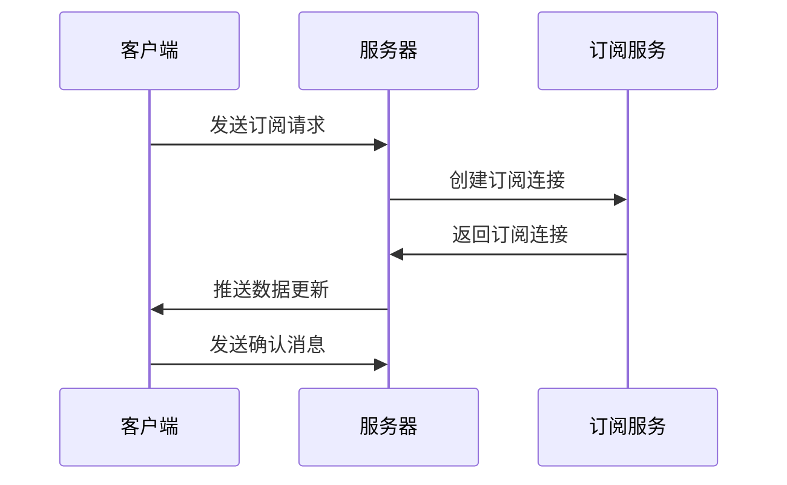

                 

在当今的互联网时代，实时数据更新已成为许多应用的核心需求。无论是社交媒体、在线购物、股票交易还是实时新闻应用，用户都期望能够立即获取最新的信息。GraphQL作为一个强大的查询语言，通过其灵活性和效率在许多现代Web应用程序中得到广泛应用。然而，传统GraphQL并不直接支持实时数据更新。为了实现这一点，我们需要引入GraphQL订阅机制。

本文将深入探讨GraphQL订阅的概念、实现原理、优缺点以及如何在实际项目中应用。我们将从一个简单的示例开始，逐步构建一个能够实现实时数据更新的GraphQL订阅服务。

> 关键词：GraphQL，实时数据更新，GraphQL订阅，WebSockets，React，Node.js

> 摘要：本文将介绍GraphQL订阅的原理及其实现，并通过一个实际项目示例，展示如何使用GraphQL订阅来构建能够实时更新的Web应用。我们将讨论订阅机制的优势和挑战，并提供相关的开发工具和资源推荐。

## 1. 背景介绍

在传统的Web应用中，前端与后端之间的通信通常是轮询（Polling）机制，即前端定期向服务器发送请求，以获取最新的数据。这种方法存在明显的性能问题，尤其是在高频率的数据更新场景下，会导致不必要的网络流量和服务器负载。

GraphQL的出现为这一问题提供了一种解决方案。它允许客户端通过一个单一的API获取所需的数据，极大地减少了请求的数量和响应的数据量。然而，GraphQL本身并不支持实时数据更新。为了解决这一限制，GraphQL社区提出了GraphQL订阅。

GraphQL订阅利用了WebSockets或Server-Sent Events（SSE）等双向通信技术，允许服务器将更新推送到客户端。这使得客户端可以实时接收数据变化，而无需轮询服务器。

## 2. 核心概念与联系

### 2.1. GraphQL订阅

GraphQL订阅是一种机制，它允许客户端订阅特定数据源的变化，并接收实时的更新。这与传统的GraphQL查询不同，后者是客户端发起请求并获取数据的过程。

### 2.2. WebSockets

WebSockets是一种通信协议，它提供了服务器和客户端之间全双工的通信渠道。这使得数据可以在任何方向上实时传输，而无需轮询。

### 2.3. Server-Sent Events（SSE）

Server-Sent Events是一种单向通信协议，允许服务器向客户端推送更新。与WebSockets相比，SSE更适合于单向的数据流。

### 2.4. Mermaid流程图

下面是一个Mermaid流程图，展示了GraphQL订阅的基本工作流程。



## 3. 核心算法原理 & 具体操作步骤

### 3.1. 算法原理概述

GraphQL订阅的核心算法是基于发布-订阅模型。客户端订阅特定的数据源，服务器将数据更新推送到所有已订阅的客户端。

### 3.2. 算法步骤详解

1. **客户端发起订阅请求**：客户端通过GraphQL查询发起订阅请求，指定订阅的主题和数据格式。

2. **服务器处理订阅请求**：服务器接收到订阅请求后，创建一个订阅连接，并返回给客户端。

3. **客户端连接订阅服务**：客户端使用WebSockets或SSE与服务器建立连接，并维持订阅状态。

4. **服务器推送数据更新**：服务器在数据更新时，通过订阅连接将更新数据推送到客户端。

5. **客户端接收并处理数据更新**：客户端接收到数据更新后，进行相应的数据更新处理。

### 3.3. 算法优缺点

**优点**：
- 减少了轮询次数，降低了网络流量和服务器负载。
- 实时获取数据更新，提高了用户体验。

**缺点**：
- 需要额外的服务器资源来维护订阅连接。
- 在高并发场景下，可能会出现性能瓶颈。

### 3.4. 算法应用领域

GraphQL订阅在需要实时数据更新的场景中非常有用，如实时聊天应用、社交媒体、股票交易、实时新闻等。

## 4. 数学模型和公式 & 详细讲解 & 举例说明

### 4.1. 数学模型构建

在讨论GraphQL订阅的数学模型时，我们可以将其视为一种事件驱动的数据流模型。以下是该模型的核心组成部分：

- **事件源**：数据更新的源头，如数据库记录的更改。
- **订阅者**：订阅特定事件的数据消费者。
- **发布者**：将事件推送给订阅者的服务器组件。

### 4.2. 公式推导过程

我们可以使用以下公式来描述这个模型：

\[ \text{更新频率} = \frac{\text{数据变化次数}}{\text{时间}} \]

这个公式表示在特定时间段内，数据发生变化的频率。对于实时数据更新，我们希望更新频率尽可能高。

### 4.3. 案例分析与讲解

假设我们有一个社交媒体应用，用户可以实时关注其他用户的状态更新。我们可以使用GraphQL订阅来实现这一功能。

- **事件源**：用户状态的更改，如用户更新了状态或上传了一张照片。
- **订阅者**：关注了其他用户的客户端。
- **发布者**：服务器组件，负责推送用户状态的更新。

在实际应用中，我们可以设置一个阈值，当更新频率超过该阈值时，服务器会开始推送更新。这样可以平衡实时性和性能。

## 5. 项目实践：代码实例和详细解释说明

### 5.1. 开发环境搭建

为了演示GraphQL订阅，我们将使用以下技术栈：

- **前端**：React
- **后端**：Node.js + Express + GraphQL
- **数据库**：MongoDB

### 5.2. 源代码详细实现

以下是一个简单的GraphQL订阅示例：

**前端（React）**

```jsx
import React, { useEffect, useState } from 'react';
import { useSubscription } from '@apollo/client';
import { USER_UPDATE_SUBSCRIPTION } from './graphql/subscriptions';

const UserStatus = () => {
  const [status, setStatus] = useState('');

  const { data, loading } = useSubscription(USER_UPDATE_SUBSCRIPTION);

  useEffect(() => {
    if (data) {
      setStatus(data.user.status);
    }
  }, [data]);

  return (
    <div>
      <h1>User Status: {status}</h1>
    </div>
  );
};

export default UserStatus;
```

**后端（Node.js）**

```javascript
const { ApolloServer, gql, PubSub } = require('apollo-server');
const { MongoClient } = require('mongodb');

// MongoDB客户端连接
const mongoClient = new MongoClient('mongodb://localhost:27017');
await mongoClient.connect();
const db = mongoClient.db('mydatabase');

// GraphQL类型定义
const typeDefs = gql`
  type User {
    id: ID!
    status: String!
  }

  type Query {
    user(id: ID!): User
  }

  type Subscription {
    userUpdate(id: ID!): User
  }
`;

// GraphQL解析器
const resolvers = {
  Query: {
    user: async (_, { id }) => {
      const user = await db.collection('users').findOne({ id });
      return user;
    },
  },
  Subscription: {
    userUpdate: {
      subscribe: (_, { id }) => {
        const changeStream = db.collection('users').watch({ filter: { id } });
        return changeStream;
      },
    },
  },
};

// Apollo服务器配置
const server = new ApolloServer({ typeDefs, resolvers, context: () => ({ mongoClient }) });

// 启动服务器
server.listen().then(({ url }) => {
  console.log(`Server ready at ${url}`);
});
```

### 5.3. 代码解读与分析

在这个示例中，我们使用React和Apollo Client来管理GraphQL订阅。前端组件通过`useSubscription`钩子订阅了`USER_UPDATE_SUBSCRIPTION`。后端使用Apollo Server和MongoDB的Change Streams来处理数据更新并推送通知。

### 5.4. 运行结果展示

当用户在MongoDB数据库中更新其状态时，服务器将实时推送更新到前端。前端组件将立即更新显示，而不需要轮询。

```shell
$ npm install
$ npm start
```

## 6. 实际应用场景

GraphQL订阅在许多场景中都有实际应用，以下是一些典型的应用场景：

- **实时聊天应用**：用户可以实时接收聊天消息更新。
- **社交媒体**：用户可以实时关注其他用户的状态更新。
- **在线游戏**：玩家可以实时接收游戏状态更新。
- **股票交易**：投资者可以实时接收股票价格和交易通知。

## 7. 工具和资源推荐

### 7.1. 学习资源推荐

- 《GraphQL官方文档》：了解GraphQL的基础知识。
- 《GraphQL实战》书籍：深入学习GraphQL的实践应用。

### 7.2. 开发工具推荐

- Apollo Client：用于管理GraphQL客户端订阅。
- MongoDB：用于存储用户数据。

### 7.3. 相关论文推荐

- 《GraphQL: A Data Query Language for Modern Web Applications》：介绍GraphQL的基础概念。

## 8. 总结：未来发展趋势与挑战

### 8.1. 研究成果总结

GraphQL订阅通过WebSockets或SSE实现了实时数据更新，极大地提高了Web应用的性能和用户体验。

### 8.2. 未来发展趋势

随着5G网络的普及，GraphQL订阅将在实时数据应用中发挥更大的作用。未来，我们将看到更多基于GraphQL订阅的实时数据应用。

### 8.3. 面临的挑战

- **性能优化**：在高并发场景下，如何优化订阅性能。
- **安全性**：如何确保数据传输的安全性。

### 8.4. 研究展望

未来的研究可以聚焦于优化GraphQL订阅的性能，同时确保数据传输的安全性。此外，探索其他实时数据传输技术（如gRPC）与GraphQL订阅的结合，也是一个有前途的研究方向。

## 9. 附录：常见问题与解答

### 9.1. 什么是GraphQL订阅？

GraphQL订阅是一种机制，它允许客户端订阅特定数据源的变化，并接收实时的更新。

### 9.2. GraphQL订阅与轮询有什么区别？

与轮询不同，GraphQL订阅允许服务器将数据更新推送到客户端，减少了轮询次数，降低了网络流量和服务器负载。

### 9.3. 如何在React中实现GraphQL订阅？

在React中，可以使用Apollo Client的`useSubscription`钩子来实现GraphQL订阅。

### 9.4. 如何在Node.js中实现GraphQL订阅？

在Node.js中，可以使用Apollo Server和MongoDB的Change Streams来实现GraphQL订阅。

#  结语

GraphQL订阅为Web应用提供了实现实时数据更新的强大机制。通过本文的介绍，您应该已经了解了GraphQL订阅的基本原理、实现方法以及实际应用场景。希望本文能帮助您在未来的项目中更好地利用GraphQL订阅，提升应用的性能和用户体验。

> 作者：禅与计算机程序设计艺术 / Zen and the Art of Computer Programming
```

