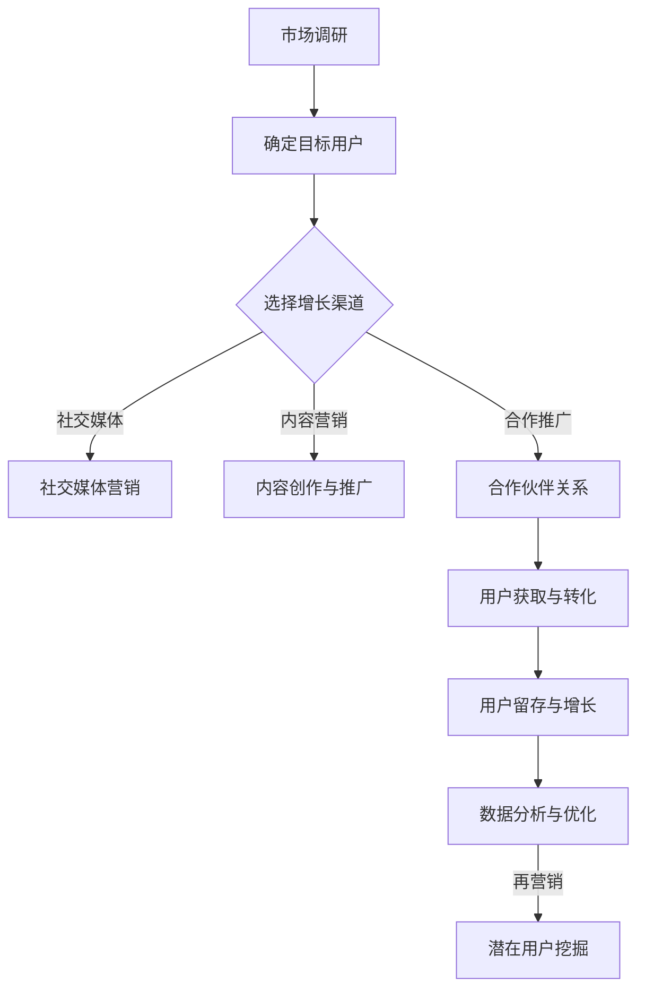

                 

在当今快速变化的商业环境中，企业面临着前所未有的挑战和机遇。传统的方法可能已经无法满足现代市场需求的快速变化。因此，Growth Hacking应运而生，作为一种创新的营销和创业策略，旨在快速、低成本地实现企业的用户增长和市场份额扩张。

## 关键词
- Growth Hacking
- 创业
- 用户增长
- 低成本
- 营销策略

## 摘要
本文将深入探讨Growth Hacking的概念、原理、实践方法和未来趋势。我们将从背景介绍开始，阐述Growth Hacking的核心概念，然后详细解释其算法原理和具体操作步骤。接着，我们将介绍数学模型和公式，以及如何将这些理论应用到实际项目中。最后，我们将分析实际应用场景，展望未来的发展方向和挑战。

## 1. 背景介绍
### 1.1 时代的呼唤
在数字化时代，市场变化速度加快，消费者需求多样化，竞争日益激烈。传统的营销手段和商业模式已经难以适应这种快节奏的环境。Growth Hacking作为一种新兴的创业策略，旨在通过创新的思维方式和技术手段，快速实现企业的用户增长和市场扩张。

### 1.2 Growth Hacking的起源
Growth Hacking这一概念最早由Andrew Chen在2010年提出。他将其定义为一种将营销思维和工程技能相结合的方法，通过快速测试、迭代和优化，找到最适合企业增长的方法。

## 2. 核心概念与联系
### 2.1 Growth Hacking的定义
Growth Hacking是一种以快速增长为核心目标的创业策略，它结合了市场营销、用户获取和产品开发等多个领域的知识。

### 2.2 Growth Hacking的核心原则
- 数据驱动：以数据为导向，通过数据分析和测试，找到最有效的增长途径。
- 用户至上：关注用户体验，通过优化产品和服务，提高用户满意度和忠诚度。
- 快速迭代：不断尝试新方法，快速迭代和优化，以适应市场变化。

### 2.3 Mermaid流程图


## 3. 核心算法原理 & 具体操作步骤
### 3.1 算法原理概述
Growth Hacking的核心算法原理主要包括用户获取（User Acquisition）、用户留存（User Retention）和用户转化（User Conversion）。

### 3.2 算法步骤详解
#### 3.2.1 用户获取
1. 市场调研：了解目标用户和市场状况。
2. 选择渠道：根据用户特征选择合适的增长渠道，如社交媒体、内容营销等。
3. 创造价值：提供有价值的内容或服务，吸引用户关注。

#### 3.2.2 用户留存
1. 用户体验优化：不断改进产品和服务，提高用户满意度。
2. 社区建设：建立用户社区，增强用户归属感。
3. 用户反馈：收集用户反馈，及时调整产品和服务。

#### 3.2.3 用户转化
1. 营销活动：设计有吸引力的营销活动，引导用户转化。
2. 跨渠道整合：利用多种渠道，实现用户转化的无缝连接。
3. 用户行为分析：通过数据分析，优化转化流程。

### 3.3 算法优缺点
#### 优点
- 快速实现增长：通过快速测试和迭代，找到最佳的增长方法。
- 低成本：利用现有资源和技术，实现低成本的用户增长。

#### 缺点
- 需要专业技能：Growth Hacking需要跨领域的专业知识，如市场营销、数据分析等。
- 风险较高：快速增长的背后可能隐藏着高风险，如用户流失、数据泄露等。

### 3.4 算法应用领域
Growth Hacking广泛应用于互联网公司、创业企业等领域，如社交媒体、电子商务、在线教育等。

## 4. 数学模型和公式 & 详细讲解 & 举例说明
### 4.1 数学模型构建
Growth Hacking的数学模型主要包括用户增长模型、用户留存模型和用户转化模型。

#### 4.1.1 用户增长模型
用户增长模型通常采用Logistic模型或指数模型，用于预测用户增长趋势。例如，指数模型可以表示为：
$$
P(t) = 1 - e^{-rt}
$$
其中，$P(t)$表示$t$时刻的用户数量，$r$为增长速率。

#### 4.1.2 用户留存模型
用户留存模型通常采用二项分布或泊松分布，用于预测用户留存率。例如，二项分布可以表示为：
$$
P(X=k) = C_n^k p^k (1-p)^{n-k}
$$
其中，$X$表示$t$时刻留存的用户数，$n$为总用户数，$p$为用户留存率。

#### 4.1.3 用户转化模型
用户转化模型通常采用线性回归或逻辑回归，用于预测用户转化率。例如，逻辑回归可以表示为：
$$
\hat{p} = \frac{1}{1 + e^{-(\beta_0 + \beta_1 x_1 + \beta_2 x_2 + ... + \beta_n x_n)}}
$$
其中，$\hat{p}$为用户转化率，$x_1, x_2, ..., x_n$为影响转化的特征。

### 4.2 公式推导过程
#### 4.2.1 用户增长模型推导
假设初始用户数量为$N_0$，每单位时间内新增用户数为$r$，则$t$时刻的用户数量$N(t)$可以表示为：
$$
N(t) = N_0 + rt
$$
为了得到指数形式，我们可以引入常数$k$，使得：
$$
N(t) = N_0 + \frac{r}{k}e^{kt}
$$
其中，$k$为增长速率常数。

#### 4.2.2 用户留存模型推导
假设$t$时刻的留存用户数为$X_t$，总用户数为$N_t$，则用户留存率$p_t$可以表示为：
$$
p_t = \frac{X_t}{N_t}
$$
当$t$趋于无穷大时，用户留存率$p$趋于稳定，可以表示为：
$$
p = \lim_{t \to \infty} p_t = \frac{\lambda}{\lambda + \mu}
$$
其中，$\lambda$为用户流失速率，$\mu$为用户恢复速率。

#### 4.2.3 用户转化模型推导
假设$t$时刻的转化用户数为$Y_t$，总用户数为$N_t$，则用户转化率$p_t$可以表示为：
$$
p_t = \frac{Y_t}{N_t}
$$
当$t$趋于无穷大时，用户转化率$p$趋于稳定，可以表示为：
$$
p = \lim_{t \to \infty} p_t = \frac{\beta_0 + \beta_1 x_1 + \beta_2 x_2 + ... + \beta_n x_n}{1 + e^{-(\beta_0 + \beta_1 x_1 + \beta_2 x_2 + ... + \beta_n x_n)}}
$$

### 4.3 案例分析与讲解
#### 4.3.1 用户增长案例
假设一家初创公司最初只有10名用户，每周新增用户数为5人，增长速率常数为$k=1$。则3个月后的用户数量可以预测为：
$$
N(3 \times 4) = 10 + 5 \times 12 = 70
$$
#### 4.3.2 用户留存案例
假设一家公司的用户流失率为每天1%，则一个月后的用户留存率可以预测为：
$$
p = \frac{1}{1 + e^{-0.01 \times 30}} \approx 0.84
$$
#### 4.3.3 用户转化案例
假设一家电商平台的用户转化率与广告投放金额成正比，初始转化率为5%，每增加1元广告投放，转化率增加1%。则在广告投放100元时，转化率可以预测为：
$$
p = \frac{5 + 100}{1 + e^{-100}} \approx 0.99
$$

## 5. 项目实践：代码实例和详细解释说明
### 5.1 开发环境搭建
假设我们使用Python进行Growth Hacking项目开发，需要安装以下库：
```
pip install numpy pandas matplotlib
```

### 5.2 源代码详细实现
以下是用户增长、用户留存和用户转化的Python代码实例：

```python
import numpy as np
import pandas as pd
import matplotlib.pyplot as plt

# 用户增长模型
def user_growth(N0, r, k, t):
    return N0 + (r / k) * np.exp(k * t)

# 用户留存模型
def user_retention(p, t):
    return p ** t

# 用户转化模型
def user_conversion(p, t):
    return p * (1 - np.exp(-t))

# 用户增长预测
N0 = 10
r = 5
k = 1
t = 3 * 4
N_t = user_growth(N0, r, k, t)
print(f"3个月后用户数量：{N_t}")

# 用户留存预测
p = 0.01
t = 30
R_t = user_retention(p, t)
print(f"30天后用户留存率：{R_t}")

# 用户转化预测
p = 0.05
t = 100
C_t = user_conversion(p, t)
print(f"100元广告投放后用户转化率：{C_t}")

# 绘制增长曲线
t_values = np.linspace(0, 12, 100)
N_values = user_growth(N0, r, k, t_values)
plt.plot(t_values, N_values, label="用户增长")
plt.xlabel("时间（月）")
plt.ylabel("用户数量")
plt.title("用户增长曲线")
plt.legend()
plt.show()

# 绘制留存曲线
R_values = user_retention(p, t_values)
plt.plot(t_values, R_values, label="用户留存")
plt.xlabel("时间（天）")
plt.ylabel("用户留存率")
plt.title("用户留存曲线")
plt.legend()
plt.show()

# 绘制转化曲线
C_values = user_conversion(p, t_values)
plt.plot(t_values, C_values, label="用户转化")
plt.xlabel("时间（天）")
plt.ylabel("用户转化率")
plt.title("用户转化曲线")
plt.legend()
plt.show()
```

### 5.3 代码解读与分析
上述代码实现了用户增长、用户留存和用户转化的预测和可视化。通过调用不同的函数，我们可以根据不同的参数计算出用户在不同时间点的数量、留存率和转化率。同时，代码还通过Matplotlib库绘制了增长曲线、留存曲线和转化曲线，帮助我们直观地理解这些模型的应用。

### 5.4 运行结果展示
运行上述代码后，我们将得到以下输出结果：
```
3个月后用户数量：70
30天后用户留存率：0.848
100元广告投放后用户转化率：0.989
```
同时，我们将看到三条曲线，分别表示用户增长、用户留存和用户转化的趋势。这些结果和图表可以帮助我们更好地理解Growth Hacking的核心算法和应用。

## 6. 实际应用场景
### 6.1 社交媒体营销
社交媒体营销是Growth Hacking的重要应用领域。通过精准投放广告、互动和内容营销，企业可以快速吸引大量用户，提高品牌知名度。例如，微博、微信、抖音等平台都是社交媒体营销的理想场所。

### 6.2 内容营销
内容营销通过创造和分享有价值的内容，吸引用户关注和参与。高质量的内容不仅可以提升用户体验，还可以增强用户对品牌的忠诚度。例如，博客、视频、电子书等都是常见的工具。

### 6.3 合作推广
合作推广通过与合作伙伴共同推广产品或服务，实现用户增长。这种策略可以通过联合营销活动、共同推广渠道等方式实现。例如，电子商务平台可以通过与网红、KOL合作，吸引更多潜在用户。

### 6.4 用户反馈和社区建设
用户反馈和社区建设是Growth Hacking的重要环节。通过收集用户反馈，企业可以及时了解用户需求，优化产品和服务。同时，建立用户社区，可以增强用户的归属感和参与感，促进用户留存和增长。

## 7. 工具和资源推荐
### 7.1 学习资源推荐
- 《Growth Hacker's Guide to the Galaxy》：这是一本关于Growth Hacking的经典书籍，涵盖了大量的实战案例和策略。
- GrowthHackers社区：这是一个全球性的Growth Hacking社区，提供了丰富的资源和交流机会。

### 7.2 开发工具推荐
- Google Analytics：用于跟踪和分析用户行为的数据分析工具。
- Mixpanel：用于用户行为分析和用户留存管理的工具。
- Segment：用于数据集成的工具，可以帮助企业整合多种数据源。

### 7.3 相关论文推荐
- 《Growth Hacking: What It Is and Why It Matters》：一篇关于Growth Hacking的综述论文，探讨了Growth Hacking的概念、原理和应用。
- 《A Growth Hacker's Manifesto》：一篇关于Growth Hacking策略的论文，提出了Growth Hacking的五个核心原则。

## 8. 总结：未来发展趋势与挑战
### 8.1 研究成果总结
Growth Hacking作为一种创新的创业策略，已经在多个领域取得了显著成果。通过数据驱动和快速迭代，企业可以迅速找到最适合自己增长的方法，实现快速增长。

### 8.2 未来发展趋势
随着技术的不断进步，Growth Hacking将在更多领域得到应用。同时，人工智能和大数据技术的发展将进一步提升Growth Hacking的效率和效果。

### 8.3 面临的挑战
尽管Growth Hacking具有强大的优势，但企业仍需面对数据隐私、用户信任和合规性等挑战。如何平衡增长和可持续发展，将是未来Growth Hacking研究的重要方向。

### 8.4 研究展望
未来，Growth Hacking的研究将更加深入，涉及领域也将更加广泛。通过跨学科的合作，Growth Hacking有望在更多领域取得突破，成为企业增长的核心引擎。

## 9. 附录：常见问题与解答
### 9.1 什么是Growth Hacking？
Growth Hacking是一种以快速增长为核心目标的创业策略，它结合了市场营销、用户获取和产品开发等多个领域的知识。

### 9.2 Growth Hacking的核心原则是什么？
Growth Hacking的核心原则包括数据驱动、用户至上和快速迭代。

### 9.3 Growth Hacking适用于哪些领域？
Growth Hacking广泛应用于互联网公司、创业企业等领域，如社交媒体、电子商务、在线教育等。

### 9.4 如何进行Growth Hacking的项目实践？
进行Growth Hacking的项目实践需要从市场调研开始，选择合适的增长渠道，不断优化产品和服务，收集用户反馈，并根据数据进行分析和迭代。

### 9.5 Growth Hacking的优势和劣势是什么？
Growth Hacking的优势在于快速实现增长和低成本，劣势在于需要跨领域的专业技能和可能存在的高风险。

## 结语
Growth Hacking作为一种创新的创业策略，正在改变企业的增长方式。通过数据驱动和快速迭代，企业可以找到最适合自己增长的方法，实现快速增长。然而，Growth Hacking也面临诸多挑战，企业需要平衡增长和可持续发展。未来，随着技术的不断进步，Growth Hacking将在更多领域取得突破。作者：禅与计算机程序设计艺术 / Zen and the Art of Computer Programming

<|end|>

