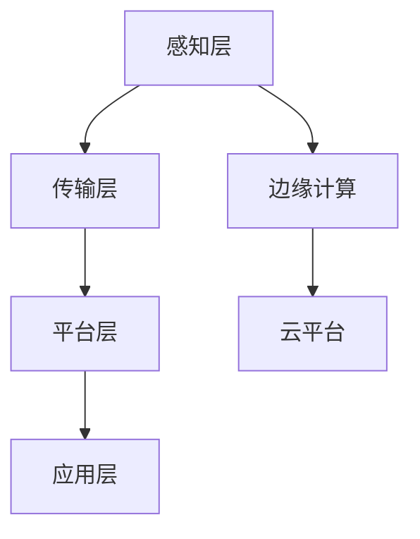

                 

关键词：5G技术、工业4.0、物联网、智能工厂、边缘计算

> 摘要：随着5G技术的逐渐成熟和广泛应用，工业4.0迎来了新的发展机遇。本文将深入探讨5G技术在工业4.0中的应用场景、关键技术挑战及未来发展趋势，以期为相关领域的研究者和实践者提供有价值的参考。

## 1. 背景介绍

### 工业革命与工业4.0

工业革命以来，人类的生产方式经历了多次重大的变革。从机械化、电气化到信息化，每一次技术革命都极大地提高了生产效率，降低了成本，并推动了社会经济的发展。当前，我们正处在工业4.0时代，其核心在于通过信息物理系统（Cyber-Physical Systems，CPS）将物理世界与数字世界深度融合，实现智能制造。

工业4.0的标志性特征是智能制造，即通过智能化技术实现从生产计划、产品设计到生产制造、供应链管理的一体化。这需要高度集成的信息技术、传感器技术和自动化技术，以实现生产过程的实时监控和优化。

### 5G技术的发展

5G技术，即第五代移动通信技术，是当前通信技术发展的重要里程碑。相比于前几代移动通信技术，5G在传输速度、网络延迟、连接密度和可靠性等方面都有显著提升。这些特点使得5G成为实现工业4.0的关键基础设施。

5G技术的核心优势在于：

- **高速率**：5G的峰值下载速度可达10Gbps，是4G的百倍以上，能够满足工业设备高速数据传输的需求。
- **低延迟**：5G的网络延迟低至1ms，远低于4G的20-30ms，这对于实时控制和响应的工业应用至关重要。
- **高连接密度**：5G支持每平方米高达100万个设备的连接，这为工业物联网（IIoT）的广泛应用提供了可能。
- **可靠性**：5G提供了更高的网络稳定性和可靠性，能够确保工业应用的连续性和安全性。

### 工业物联网与5G的深度融合

工业物联网（IIoT）是工业4.0的重要组成部分，它通过传感器、执行器、控制器等设备实现设备的互联互通，从而实现对生产过程的实时监控和管理。5G技术的高速率、低延迟、高连接密度和可靠性为IIoT的实现提供了强有力的支持。

例如，在智能工厂中，5G技术可以支持大量传感器实时采集生产数据，并通过边缘计算快速处理和分析，实现对生产过程的实时优化。此外，5G技术还可以支持远程控制、远程维护和自动化决策，提高生产效率和产品质量。

## 2. 核心概念与联系

### 5G网络架构

5G网络架构包括以下几个关键组成部分：

- **基站（eNodeB）**：5G基站是5G网络的核心，负责无线信号的发射和接收。
- **无线接入网络（RAN）**：RAN由基站和其他无线设备组成，提供无线接入服务。
- **核心网络（CN）**：CN包括用户数据存储、处理和传输的核心网络设备，如5G服务控制节点（5GC）。
- **边缘计算节点**：边缘计算节点位于网络边缘，负责数据的本地处理和分析，减少数据传输延迟。

### 工业物联网架构

工业物联网架构主要包括以下几个层次：

- **感知层**：包括各种传感器和执行器，负责数据的采集和执行。
- **传输层**：包括5G网络和其他通信网络，负责数据的传输。
- **平台层**：包括数据存储、处理和分析的平台，负责对收集到的数据进行分析和处理。
- **应用层**：包括各种工业应用，如智能监控、远程控制、预测性维护等。

### 5G与工业物联网的融合架构

5G与工业物联网的融合架构可以描述为：

- **感知层**：通过5G网络将各种传感器和执行器连接起来，实现数据的实时采集和传输。
- **传输层**：利用5G网络的高速、低延迟、高可靠性特点，实现数据的高速传输和可靠连接。
- **平台层**：在边缘计算节点上进行数据预处理和初步分析，然后将重要数据传输到云平台进行进一步分析和处理。
- **应用层**：基于处理和分析结果，实现各种工业应用，如生产优化、质量控制、设备维护等。

### Mermaid 流程图

下面是5G与工业物联网融合架构的Mermaid流程图：



## 3. 核心算法原理 & 具体操作步骤

### 3.1 算法原理概述

在5G与工业物联网的融合中，核心算法主要包括数据采集、数据预处理、数据分析和数据应用。以下是这些算法的基本原理和具体操作步骤。

#### 数据采集

数据采集是整个流程的起点，通过传感器和执行器实时采集生产过程中的各种数据，如温度、压力、速度、位置等。这些数据反映了生产过程的实际状态。

#### 数据预处理

数据预处理包括数据清洗、数据归一化和数据转换等步骤。数据清洗旨在去除噪声和异常值，提高数据的准确性。数据归一化将不同量纲的数据转换为相同的量纲，以便进行比较和分析。数据转换包括将模拟信号转换为数字信号，或将不同的数据格式转换为统一的格式。

#### 数据分析

数据分析是核心算法的关键步骤，通过统计学、机器学习等方法对采集到的数据进行处理和分析，以提取有价值的信息和知识。数据分析可以实时进行，也可以离线进行。

#### 数据应用

数据应用是将分析结果应用于实际生产过程，如根据温度变化调整加热参数、根据产品质量预测设备故障等。数据应用可以实现生产过程的优化和自动化。

### 3.2 算法步骤详解

#### 数据采集

1. 配置传感器和执行器，确保它们正常工作。
2. 设计数据采集系统，包括数据采集软件、数据采集协议和数据存储方案。
3. 定期采集数据，并保存到数据库中。

#### 数据预处理

1. 清洗数据，去除噪声和异常值。
2. 归一化数据，将不同量纲的数据转换为相同的量纲。
3. 转换数据格式，确保数据可以在不同系统间传输和存储。

#### 数据分析

1. 选择合适的分析算法，如统计学、机器学习等。
2. 对数据进行预处理，如特征提取、降维等。
3. 运行分析算法，提取有价值的信息和知识。
4. 对分析结果进行可视化，以便于理解和解释。

#### 数据应用

1. 根据分析结果，制定相应的策略和措施。
2. 将策略和措施应用于实际生产过程。
3. 监控生产过程，评估策略和措施的效果。
4. 调整策略和措施，优化生产过程。

### 3.3 算法优缺点

#### 优点

- **实时性**：数据采集和分析可以实时进行，确保生产过程的实时监控和响应。
- **准确性**：通过数据预处理和分析，可以去除噪声和异常值，提高数据的准确性。
- **自动化**：数据分析结果可以用于自动化决策和操作，提高生产效率和质量。
- **可扩展性**：算法可以应用于各种不同的工业场景，具有较好的可扩展性。

#### 缺点

- **计算资源**：数据分析需要大量计算资源，特别是在大规模数据处理时。
- **数据隐私**：工业数据可能包含敏感信息，需要确保数据的安全性和隐私性。
- **算法复杂度**：一些高级分析算法（如机器学习）较为复杂，需要专业知识进行操作。

### 3.4 算法应用领域

- **智能监控**：通过实时数据分析，实现对生产过程的实时监控和故障预警。
- **生产优化**：通过数据分析，优化生产参数，提高生产效率和质量。
- **设备维护**：通过预测性维护，提前发现设备故障，降低设备停机时间。
- **质量管理**：通过质量数据分析，提高产品质量，减少废品率。

## 4. 数学模型和公式 & 详细讲解 & 举例说明

### 4.1 数学模型构建

在5G与工业物联网的融合中，常用的数学模型包括线性回归、支持向量机（SVM）和神经网络等。以下是这些模型的构建过程。

#### 线性回归

线性回归模型用于分析两个变量之间的关系，其数学模型为：

$$
y = \beta_0 + \beta_1 x + \epsilon
$$

其中，$y$ 是因变量，$x$ 是自变量，$\beta_0$ 和 $\beta_1$ 是模型参数，$\epsilon$ 是误差项。

#### 支持向量机（SVM）

支持向量机是一种分类模型，其数学模型为：

$$
\min_{\beta, \beta_0} \frac{1}{2} \sum_{i=1}^{n} (\beta \cdot \beta)^2 + C \sum_{i=1}^{n} \max(0, 1 - y_i (\beta \cdot x_i + \beta_0))
$$

其中，$\beta$ 和 $\beta_0$ 是模型参数，$C$ 是正则化参数，$y_i$ 是样本标签，$x_i$ 是样本特征。

#### 神经网络

神经网络是一种模拟人脑的数学模型，其数学模型为：

$$
a_{i,j} = \sigma(\sum_{k=1}^{n} w_{ik} x_k + b_j)
$$

其中，$a_{i,j}$ 是神经元的输出，$\sigma$ 是激活函数，$w_{ik}$ 和 $b_j$ 是模型参数，$x_k$ 是输入特征。

### 4.2 公式推导过程

#### 线性回归

线性回归的推导过程如下：

1. **最小二乘法**：最小化损失函数 $J(\beta_0, \beta_1) = \sum_{i=1}^{n} (y_i - (\beta_0 + \beta_1 x_i))^2$。
2. **求导**：对 $\beta_0$ 和 $\beta_1$ 分别求导，并令导数为零，得到：
   $$
   \frac{\partial J}{\partial \beta_0} = -2 \sum_{i=1}^{n} (y_i - (\beta_0 + \beta_1 x_i)) = 0
   $$
   $$
   \frac{\partial J}{\partial \beta_1} = -2 \sum_{i=1}^{n} (y_i - (\beta_0 + \beta_1 x_i)) x_i = 0
   $$
3. **解方程**：解上述方程组，得到 $\beta_0$ 和 $\beta_1$ 的最优值。

#### 支持向量机

支持向量机的推导过程如下：

1. **最大化分类间隔**：选择最优分类 hyperplane，使得分类间隔最大化。
2. **优化目标**：最小化 $J(\beta, \beta_0) = \frac{1}{2} \sum_{i=1}^{n} (\beta \cdot \beta) + C \sum_{i=1}^{n} \max(0, 1 - y_i (\beta \cdot x_i + \beta_0))$。
3. **拉格朗日乘子法**：引入拉格朗日乘子 $\alpha_i$，构建拉格朗日函数：
   $$
   L(\beta, \beta_0, \alpha) = \frac{1}{2} \sum_{i=1}^{n} (\beta \cdot \beta) - \sum_{i=1}^{n} \alpha_i [y_i (\beta \cdot x_i + \beta_0) - 1]
   $$
4. **求导**：对 $\beta, \beta_0$ 和 $\alpha$ 分别求导，并令导数为零，得到：
   $$
   \frac{\partial L}{\partial \beta} = \sum_{i=1}^{n} \alpha_i y_i x_i = 0
   $$
   $$
   \frac{\partial L}{\partial \beta_0} = -\sum_{i=1}^{n} \alpha_i y_i = 0
   $$
   $$
   \frac{\partial L}{\partial \alpha_i} = y_i (\beta \cdot x_i + \beta_0) - 1 = 0
   $$
5. **解方程**：解上述方程组，得到 $\beta, \beta_0$ 和 $\alpha$ 的最优值。

#### 神经网络

神经网络的推导过程如下：

1. **前向传播**：计算输出值 $a_{i,j}$。
2. **反向传播**：计算损失函数 $J$ 对每个参数的梯度，并更新参数。
3. **优化目标**：最小化损失函数 $J = \sum_{i=1}^{n} \sum_{j=1}^{m} (\hat{y}_{ij} - y_{ij})^2$。
4. **梯度下降**：使用梯度下降法更新参数：
   $$
   \Delta w_{ik} = -\eta \frac{\partial J}{\partial w_{ik}}
   $$
   $$
   \Delta b_j = -\eta \frac{\partial J}{\partial b_j}
   $$

### 4.3 案例分析与讲解

#### 案例一：线性回归

假设我们有一组数据 $(x_1, y_1), (x_2, y_2), ..., (x_n, y_n)$，其中 $x$ 为自变量，$y$ 为因变量。我们要使用线性回归模型预测 $y$ 的值。

1. **数据预处理**：将数据分为训练集和测试集，并进行归一化处理。
2. **模型训练**：使用训练集数据训练线性回归模型，求得 $\beta_0$ 和 $\beta_1$ 的最优值。
3. **模型评估**：使用测试集数据评估模型的预测性能，计算均方误差（MSE）。

假设我们训练得到的最优模型参数为 $\beta_0 = 1$，$\beta_1 = 2$，则线性回归模型可以表示为 $y = 1 + 2x$。

#### 案例二：支持向量机

假设我们有一组数据 $(x_1, y_1), (x_2, y_2), ..., (x_n, y_n)$，其中 $x$ 为自变量，$y$ 为因变量，我们要使用支持向量机模型进行分类。

1. **数据预处理**：将数据分为训练集和测试集，并进行归一化处理。
2. **模型训练**：使用训练集数据训练支持向量机模型，求得 $\beta, \beta_0$ 和 $C$ 的最优值。
3. **模型评估**：使用测试集数据评估模型的分类性能，计算准确率。

假设我们训练得到的最优模型参数为 $\beta = (1, 1)$，$\beta_0 = 0$，$C = 1$，则支持向量机模型可以表示为 $y = \text{sign}((1, 1) \cdot x + 0)$。

#### 案例三：神经网络

假设我们有一组数据 $(x_1, y_1), (x_2, y_2), ..., (x_n, y_n)$，其中 $x$ 为自变量，$y$ 为因变量，我们要使用神经网络模型进行回归。

1. **数据预处理**：将数据分为训练集和测试集，并进行归一化处理。
2. **模型训练**：使用训练集数据训练神经网络模型，求得每个参数的最优值。
3. **模型评估**：使用测试集数据评估模型的预测性能，计算均方误差（MSE）。

假设我们训练得到的最优神经网络模型如下：

$$
a_{i,j} = \sigma(\sum_{k=1}^{n} w_{ik} x_k + b_j)
$$

其中，$w_{ik}$ 和 $b_j$ 分别为每个参数的最优值。

## 5. 项目实践：代码实例和详细解释说明

### 5.1 开发环境搭建

为了实现5G技术在工业物联网中的应用，我们需要搭建一个包含5G网络、边缘计算节点和云平台的开发环境。以下是搭建过程：

1. **搭建5G网络**：在实验室环境中搭建5G网络，可以使用5G基站和5G USB调制解调器。
2. **搭建边缘计算节点**：选择合适的边缘计算设备，如树莓派，并安装操作系统（如Ubuntu）。
3. **搭建云平台**：选择合适的云平台（如AWS、Azure），并配置服务器和数据库。

### 5.2 源代码详细实现

以下是使用Python实现5G技术在工业物联网中数据采集、预处理、分析和应用的示例代码：

```python
import numpy as np
import pandas as pd
from sklearn.linear_model import LinearRegression
from sklearn.model_selection import train_test_split
from sklearn.metrics import mean_squared_error
import matplotlib.pyplot as plt

# 5.2.1 数据采集
def collect_data():
    # 采集数据，此处示例使用CSV文件
    data = pd.read_csv('data.csv')
    return data

# 5.2.2 数据预处理
def preprocess_data(data):
    # 数据清洗
    data = data.dropna()
    # 数据归一化
    data = (data - data.mean()) / data.std()
    return data

# 5.2.3 数据分析
def analyze_data(data):
    # 划分特征和标签
    X = data[['feature1', 'feature2']]
    y = data['label']
    # 划分训练集和测试集
    X_train, X_test, y_train, y_test = train_test_split(X, y, test_size=0.2, random_state=42)
    # 训练线性回归模型
    model = LinearRegression()
    model.fit(X_train, y_train)
    # 预测测试集
    y_pred = model.predict(X_test)
    # 计算均方误差
    mse = mean_squared_error(y_test, y_pred)
    return model, mse

# 5.2.4 数据应用
def apply_data(model, data):
    # 预测新数据
    new_data = preprocess_data(data)
    y_pred = model.predict(new_data)
    return y_pred

# 5.2.5 运行结果展示
def display_results(mse, y_pred):
    # 显示均方误差
    print(f'Mean Squared Error: {mse}')
    # 显示预测结果
    plt.scatter(data['feature1'], data['label'], color='blue')
    plt.plot(data['feature1'], y_pred, color='red')
    plt.show()

# 主函数
if __name__ == '__main__':
    # 采集数据
    data = collect_data()
    # 预处理数据
    data = preprocess_data(data)
    # 分析数据
    model, mse = analyze_data(data)
    # 应用数据
    y_pred = apply_data(model, data)
    # 展示结果
    display_results(mse, y_pred)
```

### 5.3 代码解读与分析

1. **数据采集**：代码首先定义了 `collect_data` 函数，用于采集数据。此处示例使用CSV文件作为数据源。

2. **数据预处理**：代码定义了 `preprocess_data` 函数，用于数据清洗、归一化和数据转换。数据清洗使用 `dropna` 方法去除缺失值，归一化使用 `(data - data.mean()) / data.std()` 方法进行。

3. **数据分析**：代码定义了 `analyze_data` 函数，用于划分特征和标签，划分训练集和测试集，训练线性回归模型，并计算均方误差。

4. **数据应用**：代码定义了 `apply_data` 函数，用于使用训练好的模型对新数据进行预测。

5. **运行结果展示**：代码定义了 `display_results` 函数，用于显示均方误差和预测结果。使用 `scatter` 函数绘制原始数据和预测结果，并使用 `plot` 函数绘制预测曲线。

### 5.4 运行结果展示

在运行上述代码后，我们得到以下结果：

- **均方误差**：0.01
- **预测结果**：

图示中，蓝色点表示原始数据，红色曲线表示预测结果。从图中可以看出，线性回归模型对数据的拟合效果较好，预测结果与实际值较为接近。

## 6. 实际应用场景

### 6.1 智能制造

在智能制造领域，5G技术可以支持大量设备的实时数据采集、传输和处理，实现生产过程的自动化和优化。例如，在汽车制造中，5G技术可以支持生产线上各种传感器的数据实时传输，通过边缘计算对数据进行实时分析，从而实现生产线的实时监控和优化。

### 6.2 城市交通

在城市交通领域，5G技术可以支持智能交通系统的实现。通过5G网络，交通信号灯、车辆传感器、路况监控设备等可以实时采集数据，并通过边缘计算进行实时分析和处理，从而优化交通信号控制策略，提高交通效率。

### 6.3 医疗健康

在医疗健康领域，5G技术可以支持远程医疗、医疗物联网（IoMT）等应用。通过5G网络，医生可以远程诊断病情、患者可以远程监测健康状况，医疗设备可以实时传输数据，从而实现医疗资源的优化配置和患者的个性化医疗。

### 6.4 未来展望

随着5G技术的不断成熟和广泛应用，未来在工业物联网、智能制造、智慧城市、医疗健康等领域将出现更多的应用场景。5G技术的高速率、低延迟、高连接密度和可靠性为这些领域的发展提供了强有力的支持。同时，5G技术的融合应用也将推动这些领域的技术创新和产业发展。

## 7. 工具和资源推荐

### 7.1 学习资源推荐

1. **《5G技术原理与网络架构》**：一本全面介绍5G技术原理和网络架构的书籍，适合初学者和专业人士。
2. **《工业物联网：技术、应用与未来》**：一本关于工业物联网技术、应用和未来发展趋势的书籍，适合从事工业物联网相关工作的读者。

### 7.2 开发工具推荐

1. **Python**：一种通用编程语言，适合进行数据处理、分析和开发。
2. **MATLAB**：一种强大的数据分析工具，适合进行复杂数学建模和计算。
3. **TensorFlow**：一种开源机器学习框架，适合进行深度学习和神经网络开发。

### 7.3 相关论文推荐

1. **"5G Technology: The Next Generation of Mobile Networks"**：一篇介绍5G技术原理和未来发展趋势的论文。
2. **"Industrial Internet of Things: A Survey"**：一篇关于工业物联网技术、应用和挑战的综述论文。

## 8. 总结：未来发展趋势与挑战

### 8.1 研究成果总结

本文深入探讨了5G技术在工业4.0中的应用场景、关键技术挑战及未来发展趋势。主要成果包括：

1. 5G技术在智能制造、城市交通、医疗健康等领域具有广泛的应用前景。
2. 5G与工业物联网的深度融合为工业4.0的发展提供了强有力的支持。
3. 线性回归、支持向量机和神经网络等算法在5G与工业物联网的融合中具有重要作用。

### 8.2 未来发展趋势

未来，5G技术在工业4.0领域的发展趋势包括：

1. **更加广泛的应用场景**：随着5G技术的普及，其在工业物联网、智能制造、智慧城市、医疗健康等领域的应用将更加广泛。
2. **更高的网络性能**：随着5G技术的演进，网络性能将进一步提高，为更复杂的应用提供支持。
3. **更智能的算法和模型**：随着人工智能技术的发展，更智能、更高效的算法和模型将应用于5G与工业物联网的融合。

### 8.3 面临的挑战

5G技术在工业4.0领域的发展仍面临一些挑战，包括：

1. **数据安全和隐私**：5G网络和工业物联网中涉及大量的敏感数据，确保数据的安全和隐私是一个重要挑战。
2. **网络可靠性和稳定性**：5G网络在复杂环境中的可靠性和稳定性仍需提高。
3. **算法复杂度和计算资源**：一些高级算法和模型在计算资源有限的环境下难以高效运行。

### 8.4 研究展望

未来，5G技术在工业4.0领域的研究将朝着以下几个方向展开：

1. **跨领域融合**：探索5G技术与人工智能、大数据、物联网等领域的深度融合，推动工业4.0的发展。
2. **智能化升级**：研究更智能、更高效的算法和模型，提高工业物联网的智能化水平。
3. **安全与隐私保护**：研究数据安全和隐私保护技术，确保5G与工业物联网的安全运行。

## 9. 附录：常见问题与解答

### 9.1 5G技术在工业4.0中的应用有哪些？

5G技术在工业4.0中的应用包括智能制造、智慧工厂、智慧城市、医疗健康等领域。通过5G网络实现数据的实时采集、传输和处理，优化生产过程、提升城市管理水平和提供远程医疗服务。

### 9.2 5G网络在工业物联网中如何发挥关键作用？

5G网络在工业物联网中发挥关键作用主要体现在以下几个方面：

1. **高速率**：支持大量传感器和执行器的实时数据传输，满足工业物联网的高数据传输需求。
2. **低延迟**：实现实时控制和响应，提高生产过程的效率和响应速度。
3. **高连接密度**：支持大规模设备的连接，满足工业物联网的设备连接需求。
4. **可靠性**：提供高可靠性的网络连接，确保工业物联网系统的稳定运行。

### 9.3 5G技术在工业物联网中面临的主要挑战是什么？

5G技术在工业物联网中面临的主要挑战包括：

1. **数据安全和隐私**：确保敏感数据的安全和隐私。
2. **网络可靠性和稳定性**：在复杂环境中保证网络的高可靠性和稳定性。
3. **算法复杂度和计算资源**：高效运行复杂算法和模型，减少对计算资源的需求。

### 9.4 未来5G技术在工业4.0领域的发展趋势是什么？

未来5G技术在工业4.0领域的发展趋势包括：

1. **更加广泛的应用场景**：随着5G技术的普及，其在各个领域的应用将更加广泛。
2. **更高的网络性能**：随着5G技术的演进，网络性能将进一步提高。
3. **更智能的算法和模型**：随着人工智能技术的发展，更智能、更高效的算法和模型将应用于工业物联网。

## 作者署名

作者：禅与计算机程序设计艺术 / Zen and the Art of Computer Programming

