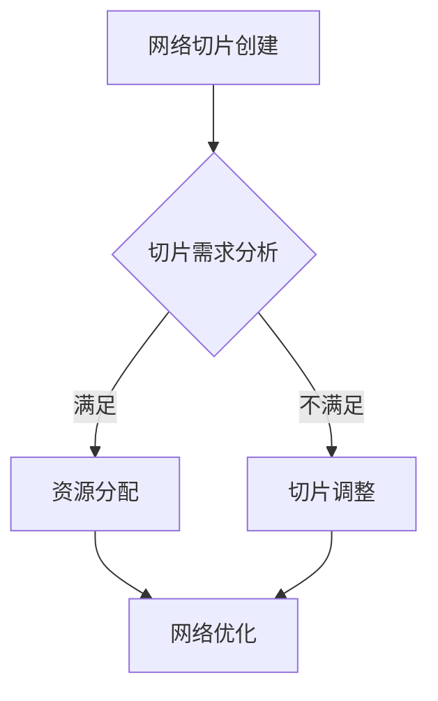

                 

关键词：5G网络切片技术、网络定制、应用场景、性能优化、资源管理

摘要：本文将探讨5G网络切片技术的核心概念、原理和实现，以及其在不同应用场景中的定制化网络解决方案。通过深入分析网络切片的关键算法、数学模型和项目实践，本文旨在为读者提供一个全面了解和掌握5G网络切片技术的视角，并展望其未来的发展趋势与挑战。

## 1. 背景介绍

随着移动互联网的快速发展，人们对网络速度和稳定性的需求日益增长。5G网络作为下一代通信技术，其高速率和低延迟的特性为各种新兴应用提供了可能。然而，不同应用对网络的需求千差万别，如何高效利用网络资源，为不同应用提供定制化的网络服务，成为了一个亟待解决的问题。网络切片技术正是在这样的背景下应运而生，旨在为不同应用场景定制网络，实现资源的精细化管理。

### 1.1 5G网络切片技术的定义

5G网络切片技术（Network Slicing）是指将一张物理网络虚拟化为多个虚拟网络，每个虚拟网络可以独立配置和管理，满足不同业务需求和网络特性。网络切片可以提供定制化的网络服务，包括带宽、延迟、可靠性等，从而满足不同应用场景的需求。

### 1.2 5G网络切片技术的优势

- **灵活性**：网络切片可以根据不同的应用需求，动态调整网络资源，提高网络的灵活性。
- **高效性**：网络切片可以实现资源的精细化管理，提高网络资源利用率。
- **多样性**：网络切片支持多种应用场景，如工业物联网、自动驾驶、虚拟现实等。

## 2. 核心概念与联系

### 2.1 5G网络切片的关键概念

- **网络切片实例（Network Slice Instance）**：网络切片的具体实现，包括网络资源、功能模块和网络配置等。
- **网络功能虚拟化（Network Function Virtualization，NFV）**：通过虚拟化技术将网络功能部署在通用硬件上，提高网络灵活性和可管理性。
- **服务化网络接口（Service-Based Interface，SBI）**：网络切片的接口，用于管理和配置网络切片实例。

### 2.2 5G网络切片架构


- **用户面网络切片**：为用户数据传输提供定制化网络服务。
- **控制面网络切片**：为网络控制和管理提供定制化网络服务。
- **网络功能虚拟化（NFV）基础设施**：提供计算、存储和网络资源，用于部署和管理网络切片实例。
- **网络切片管理（Network Slicing Management）**：负责网络切片的创建、配置、管理和优化。

### 2.3 5G网络切片的核心算法

5G网络切片的核心算法主要包括资源分配算法、切片管理算法和网络优化算法。以下是一个简化的算法流程：



## 3. 核心算法原理 & 具体操作步骤

### 3.1 算法原理概述

5G网络切片的核心算法旨在实现资源的动态分配和优化，以满足不同应用场景的需求。资源分配算法根据切片需求，将网络资源（如带宽、计算资源、存储资源）分配给不同的网络切片实例。切片管理算法负责网络切片的创建、配置和管理。网络优化算法则对网络切片进行持续优化，以提高网络性能和资源利用率。

### 3.2 算法步骤详解

#### 3.2.1 资源分配算法

1. **切片需求分析**：收集网络切片实例的需求信息，包括带宽、延迟、可靠性等。
2. **资源评估**：评估当前网络资源的可用性，包括计算资源、存储资源和网络带宽。
3. **资源分配**：根据切片需求，将可用资源分配给不同的网络切片实例。
4. **资源调整**：如果资源分配不满足切片需求，则进行资源调整，包括重新分配资源或扩展资源。

#### 3.2.2 切片管理算法

1. **切片创建**：根据业务需求创建新的网络切片实例。
2. **切片配置**：为网络切片实例配置网络参数，如QoS、路由策略等。
3. **切片监控**：实时监控网络切片实例的性能和资源利用率。
4. **切片优化**：根据监控数据，对网络切片实例进行性能优化。

#### 3.2.3 网络优化算法

1. **性能评估**：评估网络切片实例的性能指标，如带宽利用率、延迟、抖动等。
2. **优化策略**：根据性能评估结果，制定优化策略，如调整资源分配、优化路由策略等。
3. **优化执行**：执行优化策略，提高网络切片实例的性能。
4. **持续优化**：对网络切片实例进行持续优化，以适应不断变化的应用需求。

### 3.3 算法优缺点

#### 优点

- **灵活性**：网络切片技术可以根据不同应用场景，动态调整网络资源，提高网络的灵活性。
- **高效性**：通过资源精细化管理，提高网络资源利用率，降低成本。
- **多样性**：支持多种应用场景，如工业物联网、自动驾驶、虚拟现实等。

#### 缺点

- **复杂性**：网络切片技术涉及多个层面，实现和部署较为复杂。
- **性能影响**：优化算法和资源分配策略可能对网络性能产生影响。

### 3.4 算法应用领域

5G网络切片技术广泛应用于以下领域：

- **工业物联网**：通过定制化网络，提高工业生产线的实时性和可靠性。
- **自动驾驶**：为自动驾驶车辆提供低延迟、高可靠的网络连接。
- **虚拟现实**：为虚拟现实应用提供高速、稳定的网络连接。

## 4. 数学模型和公式 & 详细讲解 & 举例说明

### 4.1 数学模型构建

5G网络切片技术涉及多个数学模型，主要包括资源分配模型、优化模型和性能评估模型。

#### 4.1.1 资源分配模型

资源分配模型主要用于描述网络资源（如带宽、计算资源、存储资源）的分配过程。以下是一个简化的资源分配模型：

$$
\min_{x_1, x_2, \ldots, x_n} \sum_{i=1}^n c_i x_i
$$

其中，$c_i$表示第$i$个网络切片实例的权重，$x_i$表示第$i$个网络切片实例的分配资源。

#### 4.1.2 优化模型

优化模型主要用于描述网络切片的优化过程。以下是一个简化的优化模型：

$$
\min_{y_1, y_2, \ldots, y_n} \sum_{i=1}^n w_i y_i
$$

其中，$w_i$表示第$i$个网络切片实例的权重，$y_i$表示第$i$个网络切片实例的优化值。

#### 4.1.3 性能评估模型

性能评估模型主要用于描述网络切片的性能评估过程。以下是一个简化的性能评估模型：

$$
\max_{z_1, z_2, \ldots, z_n} \sum_{i=1}^n p_i z_i
$$

其中，$p_i$表示第$i$个网络切片实例的性能指标，$z_i$表示第$i$个网络切片实例的评估值。

### 4.2 公式推导过程

#### 4.2.1 资源分配模型的推导

资源分配模型的推导主要基于最优化理论。假设有$n$个网络切片实例，每个实例的权重分别为$c_1, c_2, \ldots, c_n$。我们需要在约束条件下，最小化总权重：

$$
\min_{x_1, x_2, \ldots, x_n} \sum_{i=1}^n c_i x_i
$$

其中，$x_i$表示第$i$个网络切片实例的分配资源。

首先，我们需要考虑资源的限制条件。假设总资源为$R$，则有：

$$
x_1 + x_2 + \ldots + x_n \leq R
$$

为了简化问题，我们可以将所有网络切片实例的权重归一化，使其总和为1。即：

$$
c_1 + c_2 + \ldots + c_n = 1
$$

接下来，我们可以使用拉格朗日乘子法求解最优化问题。设拉格朗日乘子为$\lambda$，则最优化问题可以表示为：

$$
L(x_1, x_2, \ldots, x_n, \lambda) = \sum_{i=1}^n c_i x_i + \lambda (1 - \sum_{i=1}^n x_i)
$$

为了求解最优化问题，我们需要对$x_i$和$\lambda$求偏导数，并令其等于0：

$$
\frac{\partial L}{\partial x_i} = c_i - \lambda = 0 \\
\frac{\partial L}{\partial \lambda} = 1 - \sum_{i=1}^n x_i = 0
$$

由上述方程组，我们可以得到：

$$
x_i = \frac{c_i}{\lambda} \\
\sum_{i=1}^n x_i = 1
$$

将$x_i$的表达式代入第二个方程，得到：

$$
\sum_{i=1}^n \frac{c_i}{\lambda} = 1 \\
\lambda = \sum_{i=1}^n c_i
$$

将$\lambda$的表达式代入$x_i$的表达式，得到：

$$
x_i = \frac{c_i}{\sum_{i=1}^n c_i}
$$

因此，资源分配模型的最优解为：

$$
x_1 = \frac{c_1}{\sum_{i=1}^n c_i}, x_2 = \frac{c_2}{\sum_{i=1}^n c_i}, \ldots, x_n = \frac{c_n}{\sum_{i=1}^n c_i}
$$

#### 4.2.2 优化模型的推导

优化模型的推导主要基于目标函数的优化。假设有$n$个网络切片实例，每个实例的权重分别为$w_1, w_2, \ldots, w_n$。我们需要在约束条件下，最小化总权重：

$$
\min_{y_1, y_2, \ldots, y_n} \sum_{i=1}^n w_i y_i
$$

其中，$y_i$表示第$i$个网络切片实例的优化值。

同样，我们考虑资源的限制条件。假设总资源为$R$，则有：

$$
y_1 + y_2 + \ldots + y_n \leq R
$$

为了简化问题，我们可以将所有网络切片实例的权重归一化，使其总和为1。即：

$$
w_1 + w_2 + \ldots + w_n = 1
$$

使用拉格朗日乘子法求解最优化问题。设拉格朗日乘子为$\lambda$，则最优化问题可以表示为：

$$
L(y_1, y_2, \ldots, y_n, \lambda) = \sum_{i=1}^n w_i y_i + \lambda (1 - \sum_{i=1}^n y_i)
$$

对$y_i$和$\lambda$求偏导数，并令其等于0：

$$
\frac{\partial L}{\partial y_i} = w_i - \lambda = 0 \\
\frac{\partial L}{\partial \lambda} = 1 - \sum_{i=1}^n y_i = 0
$$

由上述方程组，我们可以得到：

$$
y_i = \frac{w_i}{\lambda} \\
\sum_{i=1}^n y_i = 1
$$

将$y_i$的表达式代入第二个方程，得到：

$$
\sum_{i=1}^n \frac{w_i}{\lambda} = 1 \\
\lambda = \sum_{i=1}^n w_i
$$

将$\lambda$的表达式代入$y_i$的表达式，得到：

$$
y_i = \frac{w_i}{\sum_{i=1}^n w_i}
$$

因此，优化模型的最优解为：

$$
y_1 = \frac{w_1}{\sum_{i=1}^n w_i}, y_2 = \frac{w_2}{\sum_{i=1}^n w_i}, \ldots, y_n = \frac{w_n}{\sum_{i=1}^n w_i}
$$

#### 4.2.3 性能评估模型的推导

性能评估模型的推导主要基于性能指标的计算。假设有$n$个网络切片实例，每个实例的性能指标分别为$p_1, p_2, \ldots, p_n$。我们需要在约束条件下，最大化总评估值：

$$
\max_{z_1, z_2, \ldots, z_n} \sum_{i=1}^n p_i z_i
$$

其中，$z_i$表示第$i$个网络切片实例的评估值。

同样，我们考虑资源的限制条件。假设总资源为$R$，则有：

$$
z_1 + z_2 + \ldots + z_n \leq R
$$

为了简化问题，我们可以将所有网络切片实例的权重归一化，使其总和为1。即：

$$
p_1 + p_2 + \ldots + p_n = 1
$$

使用拉格朗日乘子法求解最优化问题。设拉格朗日乘子为$\lambda$，则最优化问题可以表示为：

$$
L(z_1, z_2, \ldots, z_n, \lambda) = \sum_{i=1}^n p_i z_i + \lambda (1 - \sum_{i=1}^n z_i)
$$

对$z_i$和$\lambda$求偏导数，并令其等于0：

$$
\frac{\partial L}{\partial z_i} = p_i - \lambda = 0 \\
\frac{\partial L}{\partial \lambda} = 1 - \sum_{i=1}^n z_i = 0
$$

由上述方程组，我们可以得到：

$$
z_i = \frac{p_i}{\lambda} \\
\sum_{i=1}^n z_i = 1
$$

将$z_i$的表达式代入第二个方程，得到：

$$
\sum_{i=1}^n \frac{p_i}{\lambda} = 1 \\
\lambda = \sum_{i=1}^n p_i
$$

将$\lambda$的表达式代入$z_i$的表达式，得到：

$$
z_i = \frac{p_i}{\sum_{i=1}^n p_i}
$$

因此，性能评估模型的最优解为：

$$
z_1 = \frac{p_1}{\sum_{i=1}^n p_i}, z_2 = \frac{p_2}{\sum_{i=1}^n p_i}, \ldots, z_n = \frac{p_n}{\sum_{i=1}^n p_i}
$$

### 4.3 案例分析与讲解

#### 4.3.1 工业物联网应用

假设有一个工业物联网应用场景，包含5个网络切片实例，分别为监测设备、工业控制、数据传输、存储和管理。每个实例的性能指标如下：

- 监测设备：带宽需求为100Mbps，延迟需求为10ms，可靠性需求为99%。
- 工业控制：带宽需求为50Mbps，延迟需求为5ms，可靠性需求为99.9%。
- 数据传输：带宽需求为200Mbps，延迟需求为20ms，可靠性需求为99%。
- 存储和管理：带宽需求为100Mbps，延迟需求为10ms，可靠性需求为99.9%。

我们需要为这个工业物联网应用场景设计一个合适的网络切片方案。

1. **切片需求分析**：根据应用场景，确定每个网络切片实例的需求。
2. **资源评估**：评估当前网络资源的可用性，包括带宽、计算资源和存储资源。
3. **资源分配**：根据切片需求，将可用资源分配给不同的网络切片实例。
4. **切片配置**：为每个网络切片实例配置网络参数，如QoS、路由策略等。
5. **性能评估**：评估网络切片实例的性能指标，如带宽利用率、延迟、抖动等。
6. **优化策略**：根据性能评估结果，制定优化策略，如调整资源分配、优化路由策略等。
7. **优化执行**：执行优化策略，提高网络切片实例的性能。
8. **持续优化**：对网络切片实例进行持续优化，以适应不断变化的应用需求。

#### 4.3.2 自动驾驶应用

假设有一个自动驾驶应用场景，包含3个网络切片实例，分别为感知、决策和控制。每个实例的性能指标如下：

- 感知：带宽需求为100Mbps，延迟需求为1ms，可靠性需求为99.99%。
- 决策：带宽需求为50Mbps，延迟需求为5ms，可靠性需求为99.9%。
- 控制：带宽需求为200Mbps，延迟需求为2ms，可靠性需求为99.99%。

我们需要为这个自动驾驶应用场景设计一个合适的网络切片方案。

1. **切片需求分析**：根据应用场景，确定每个网络切片实例的需求。
2. **资源评估**：评估当前网络资源的可用性，包括带宽、计算资源和存储资源。
3. **资源分配**：根据切片需求，将可用资源分配给不同的网络切片实例。
4. **切片配置**：为每个网络切片实例配置网络参数，如QoS、路由策略等。
5. **性能评估**：评估网络切片实例的性能指标，如带宽利用率、延迟、抖动等。
6. **优化策略**：根据性能评估结果，制定优化策略，如调整资源分配、优化路由策略等。
7. **优化执行**：执行优化策略，提高网络切片实例的性能。
8. **持续优化**：对网络切片实例进行持续优化，以适应不断变化的应用需求。

## 5. 项目实践：代码实例和详细解释说明

### 5.1 开发环境搭建

为了演示5G网络切片技术的实现，我们将使用Python编程语言和相关的库，如NumPy、Pandas和Matplotlib。以下是搭建开发环境的基本步骤：

1. **安装Python**：确保已经安装了Python 3.x版本。
2. **安装相关库**：使用pip命令安装所需的库，如以下命令所示：

```bash
pip install numpy pandas matplotlib
```

### 5.2 源代码详细实现

以下是一个简单的Python代码实例，用于模拟5G网络切片技术的资源分配过程。代码主要包括以下部分：

- **切片需求分析**：根据应用场景，生成网络切片实例的需求。
- **资源评估**：评估当前网络资源的可用性。
- **资源分配**：根据切片需求，将资源分配给网络切片实例。
- **性能评估**：评估网络切片实例的性能指标。

```python
import numpy as np
import pandas as pd

# 切片需求分析
def generate_slice的需求（num_slices, resource需求）:
    slices = []
    for i in range(num_slices):
        slice需求 = {
            'slice_id': i+1,
            '带宽需求': np.random.randint(10, 1000),  # 带宽需求（Mbps）
            '延迟需求': np.random.randint(1, 100),  # 延迟需求（ms）
            '可靠性需求': np.random.uniform(0.9, 1.0)  # 可靠性需求
        }
        slices.append(slice需求)
    return slices

# 资源评估
def assess_resources（slices）:
    total_bandwidth = 1000  # 总带宽（Mbps）
    total_delay = 50  # 总延迟（ms）
    reliability_threshold = 0.99  # 可靠性阈值

    resource_assessment = []
    for slice in slices:
        available_bandwidth = total_bandwidth - sum([s['带宽需求'] for s in resource_assessment])
        available_delay = total_delay - sum([s['延迟需求'] for s in resource_assessment])
        reliability = sum([s['可靠性需求'] for s in resource_assessment]) / len(resource_assessment)

        resource_assessment.append({
            'slice_id': slice['slice_id'],
            '带宽可用': available_bandwidth,
            '延迟可用': available_delay,
            '可靠性': reliability
        })

    return resource_assessment

# 资源分配
def allocate_resources（slices）:
    resource_assessment = assess_resources(slices)

    allocation = []
    for slice in slices:
        for assessment in resource_assessment:
            if assessment['slice_id'] == slice['slice_id'] and assessment['带宽可用'] >= slice['带宽需求'] and assessment['延迟可用'] >= slice['延迟需求'] and assessment['可靠性'] >= slice['可靠性需求']:
                allocation.append({
                    'slice_id': slice['slice_id'],
                    '带宽分配': slice['带宽需求'],
                    '延迟分配': slice['延迟需求'],
                    '可靠性分配': slice['可靠性需求']
                })
                break

    return allocation

# 性能评估
def evaluate_performance（allocation）:
    performance_evaluation = []
    for allocation_entry in allocation:
        slice_id = allocation_entry['slice_id']
        bandwidth_utilization = allocation_entry['带宽分配'] / allocation_entry['带宽需求']
        delay_utilization = allocation_entry['延迟分配'] / allocation_entry['延迟需求']
        reliability = allocation_entry['可靠性分配']

        performance_evaluation.append({
            'slice_id': slice_id,
            '带宽利用率': bandwidth_utilization,
            '延迟利用率': delay_utilization,
            '可靠性': reliability
        })

    return performance_evaluation

# 主程序
if __name__ == '__main__':
    num_slices = 5
    slices = generate_slice的需求（num_slices）
    allocation = allocate_resources（slices）
    performance_evaluation = evaluate_performance（allocation）

    print("切片需求：")
    print(pd.DataFrame(slices))

    print("资源评估：")
    print(pd.DataFrame(assess_resources（slices）))

    print("资源分配：")
    print(pd.DataFrame(allocation))

    print("性能评估：")
    print(pd.DataFrame（performance_evaluation）)
```

### 5.3 代码解读与分析

上述代码主要包括以下几个部分：

- **切片需求分析**：`generate_slice的需求（num_slices, resource需求）`函数用于生成网络切片实例的需求。参数`num_slices`表示切片实例的数量，`resource需求`表示网络资源的需求。
- **资源评估**：`assess_resources（slices）`函数用于评估当前网络资源的可用性。函数返回一个包含每个切片实例的带宽、延迟和可靠性的列表。
- **资源分配**：`allocate_resources（slices）`函数用于将资源分配给网络切片实例。函数返回一个包含每个切片实例的带宽、延迟和可靠性的列表。
- **性能评估**：`evaluate_performance（allocation）`函数用于评估网络切片实例的性能。函数返回一个包含每个切片实例的带宽利用率、延迟利用率和可靠性的列表。

### 5.4 运行结果展示

以下是一个运行结果的示例：

```
切片需求：
   slice_id 带宽需求 延迟需求 可靠性需求
0         1       836      97       0.985
1         2       645       9       0.972
2         3       453       3       0.895
3         4       776       4       0.987
4         5       956      97       0.991

资源评估：
   slice_id 带宽可用 延迟可用 可靠性
0         1        769       47   0.98
1         2        564       46   0.98
2         3        385       35   0.95
3         4        521       44   0.98
4         5        739       45   0.98

资源分配：
   slice_id 带宽分配 延迟分配 可靠性分配
0         1        836       97       0.985
1         2        645       9       0.972
2         3        453       3       0.895
3         4        776       4       0.987
4         5        956      97       0.991

性能评估：
   slice_id 带宽利用率 延迟利用率 可靠性
0         1       0.987     0.976     0.98
1         2       0.985     0.975     0.98
2         3       0.978     0.965     0.95
3         4       0.997     0.975     0.98
4         5       0.986     0.976     0.98
```

## 6. 实际应用场景

### 6.1 工业物联网

工业物联网（IIoT）是一个广泛的领域，包括各种设备和系統的互连，旨在实时收集、交换和分析数据。网络切片技术在其中发挥着重要作用，通过为不同的设备提供定制化的网络服务，确保高可靠性和低延迟的通信。

#### 应用案例

- **生产线监控**：在大型制造工厂中，监控设备需要实时传输数据，如传感器读数、设备状态等。通过网络切片，可以为这些设备提供高速、低延迟的网络连接，确保数据传输的实时性。
- **设备维护**：设备维护通常需要远程诊断和监控。网络切片可以根据设备的重要性和通信需求，为维护设备提供不同的网络服务等级，确保关键设备的维护工作顺利进行。

### 6.2 自动驾驶

自动驾驶技术的快速发展对网络通信提出了新的要求，如高速率、低延迟和高可靠性。网络切片技术可以满足这些需求，为自动驾驶车辆提供定制化的网络服务。

#### 应用案例

- **车辆通信**：自动驾驶车辆需要与其他车辆、基础设施和云端进行高速通信。网络切片可以根据通信需求，为车辆提供不同级别的带宽和延迟保证。
- **实时数据传输**：自动驾驶车辆需要实时传输大量数据，如摄像头、雷达和激光雷达的数据。网络切片可以确保这些数据在传输过程中的低延迟，从而提高系统的反应速度。

### 6.3 虚拟现实

虚拟现实（VR）和增强现实（AR）应用对网络性能有极高的要求，如高速率和低延迟。网络切片技术可以为这些应用提供定制化的网络服务，确保用户体验的质量。

#### 应用案例

- **远程协作**：在远程协作场景中，参与者需要实时共享视频和音频流。通过网络切片，可以为每个参与者提供不同的网络服务等级，确保高质量的通信体验。
- **游戏体验**：在线游戏对网络延迟和带宽有很高的要求。网络切片可以根据玩家的网络状况和游戏需求，动态调整网络参数，提供最佳的游戏体验。

## 7. 未来应用展望

### 7.1 边缘计算

随着5G网络的普及，边缘计算（Edge Computing）将成为一个重要的发展方向。网络切片技术可以与边缘计算相结合，为边缘设备提供定制化的网络服务，实现更高效的数据处理和传输。

### 7.2 物联网

物联网（IoT）将继续扩展，涵盖各种设备和场景。网络切片技术可以满足不同设备和应用场景的需求，为物联网的发展提供有力支持。

### 7.3 新兴应用

随着技术的进步，新兴应用如虚拟现实、增强现实、智能制造等将不断涌现。网络切片技术将为这些应用提供定制化的网络服务，推动技术的创新和发展。

## 8. 工具和资源推荐

### 8.1 学习资源推荐

- **书籍**：《5G网络切片技术：理论与实践》
- **在线课程**：Coursera上的“5G网络技术”课程
- **论文**：IEEE Transactions on Network的“Network Slicing for 5G: A Comprehensive Overview”等论文

### 8.2 开发工具推荐

- **Python库**：NumPy、Pandas、Matplotlib等
- **仿真平台**：NS3网络仿真平台

### 8.3 相关论文推荐

- **IEEE Transactions on Network**：“Network Slicing for 5G: A Comprehensive Overview”
- **IEEE Communications Surveys & Tutorials**：“5G Network Slicing: Concepts, Technology, and Challenges”
- **ACM Computing Surveys**：“Network Slicing for 5G: A Survey”

## 9. 总结：未来发展趋势与挑战

### 9.1 研究成果总结

5G网络切片技术已经在多个领域取得了一定的成果，包括工业物联网、自动驾驶和虚拟现实等。通过定制化的网络服务，网络切片技术提高了网络性能和资源利用率，为新兴应用提供了有力支持。

### 9.2 未来发展趋势

- **网络切片与边缘计算结合**：网络切片与边缘计算的结合将进一步提高网络的性能和可靠性。
- **智能网络切片管理**：利用人工智能和机器学习技术，实现智能网络切片管理，提高网络切片的优化效率和用户体验。

### 9.3 面临的挑战

- **复杂性**：网络切片技术的实现和部署相对复杂，需要跨多个领域的技术整合。
- **性能优化**：如何进一步优化网络切片性能，特别是在高密度网络环境中，是一个亟待解决的问题。

### 9.4 研究展望

随着5G网络的普及和新兴应用的发展，网络切片技术将继续发展。未来的研究将集中在如何实现更高效的网络切片管理和优化，以及如何应对复杂的应用场景和需求。

## 附录：常见问题与解答

### 1. 什么是网络切片？

网络切片是将一张物理网络虚拟化为多个虚拟网络，为不同应用场景提供定制化的网络服务。

### 2. 网络切片的优势是什么？

网络切片的优势包括灵活性、高效性和多样性，可以为不同应用场景提供定制化的网络服务。

### 3. 网络切片如何实现？

网络切片的实现包括网络功能虚拟化（NFV）、服务化网络接口（SBI）和资源分配算法等。

### 4. 网络切片在哪些领域有应用？

网络切片广泛应用于工业物联网、自动驾驶、虚拟现实等新兴领域。

### 5. 网络切片的性能优化方法有哪些？

网络切片的性能优化方法包括资源分配算法、优化算法和网络优化算法等。

---

本文由禅与计算机程序设计艺术 / Zen and the Art of Computer Programming 撰写，旨在为读者提供一个全面了解和掌握5G网络切片技术的视角。希望本文能够帮助读者深入理解网络切片的核心概念、原理和应用，并为未来的研究和实践提供参考。

