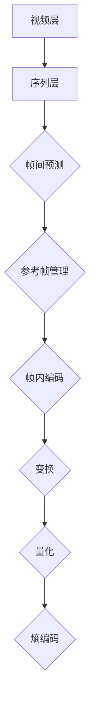

                 

 > **关键词：** 高效视频编码、HEVC、高清视频、传输、算法原理、数学模型、项目实践、应用场景、未来展望

**摘要：** 本文将深入探讨HEVC（High Efficiency Video Coding）视频编码格式，一种用于高效压缩和传输高清视频的国际标准。文章首先介绍HEVC的背景和核心概念，然后详细解析其算法原理、数学模型及具体实现，并通过项目实践展示其应用效果。此外，文章还将讨论HEVC在各类实际应用场景中的表现，并对未来发展趋势和面临的挑战进行分析。

## 1. 背景介绍

随着数字媒体技术的飞速发展，视频内容的需求日益增长。高清、超高清甚至更高分辨率的视频成为主流，使得视频数据的传输和存储面临巨大挑战。为了应对这一挑战，视频编码技术应运而生，其目标是在保证视频质量的前提下，实现更高的压缩效率。HEVC（High Efficiency Video Coding）正是在这种背景下诞生的，它是继H.264之后的新一代视频编码标准。

### 1.1 HEVC的发展历程

HEVC于2013年由国际标准化组织（ISO）和国际电信联盟（ITU）正式发布，其前身是H.265。HEVC的诞生标志着视频编码技术进入了一个新的阶段，它旨在提供更高的压缩效率，同时保持较低的计算复杂度。与H.264相比，HEVC能够在相同的视频质量下实现约50%的压缩率提升。

### 1.2 HEVC的应用场景

HEVC的应用场景广泛，涵盖了家庭娱乐、移动设备、互联网视频、视频会议等多个领域。特别是在4K、8K等超高清视频领域，HEVC展示了其卓越的性能。此外，随着5G网络的普及，HEVC也成为移动视频传输的首选编码标准，为用户提供了更加流畅和高质量的视频观看体验。

## 2. 核心概念与联系

HEVC的核心在于其高效的压缩算法和结构设计。为了更深入地理解HEVC，我们需要从其基本概念和架构入手。

### 2.1 HEVC的基本概念

HEVC采用了一系列新的技术和概念，包括变换、量化、熵编码等。与H.264相比，HEVC引入了更大的变换块大小（64x64）、更高的参考帧数（最多16个）、新的颜色格式（10-bit、12-bit）以及自适应样本自适应技术（SAdapT）等。这些概念共同构成了HEVC高效压缩的基础。

### 2.2 HEVC的架构

HEVC的架构包括两个层次：视频层（Video Layer）和序列层（Sequence Layer）。视频层负责图像的变换、量化、编码等操作，而序列层则负责视频序列的整体处理，包括帧间预测、参考帧管理等。以下是HEVC架构的Mermaid流程图：



## 3. 核心算法原理 & 具体操作步骤

HEVC的核心算法主要包括变换、量化、熵编码等步骤。以下将详细解析这些步骤。

### 3.1 算法原理概述

HEVC的变换过程采用了一种基于整数变换的算法，它包括整数变换、扫描和量化三个步骤。整数变换使用了一种称为“逆离散余弦变换”（IDCT）的算法，它将像素值转换为频率域表示。扫描过程将频率域的系数按照一定规则重新排列，以便于量化。量化过程则通过缩小系数的幅度，进一步降低数据量。熵编码则采用了一种称为“ contexts-based adaptive binary arithmetic coding”（CABAC）的算法，它通过分析数据符号的统计特性，实现高效编码。

### 3.2 算法步骤详解

#### 3.2.1 变换

变换过程包括整数变换和扫描两个步骤。整数变换使用IDCT算法，将像素值转换为频率域表示。具体步骤如下：

1. **整数变换**：将像素值转换为频率域系数。
2. **扫描**：将频率域的系数按照ZigZag顺序重新排列。

#### 3.2.2 量化

量化过程通过缩小系数的幅度，进一步降低数据量。具体步骤如下：

1. **自适应量化**：根据块的平均活动度自适应调整量化步长。
2. **量化**：将频率域系数按照量化步长进行量化。

#### 3.2.3 熵编码

熵编码过程通过分析数据符号的统计特性，实现高效编码。具体步骤如下：

1. **符号分配**：将频率域系数分配到不同的符号组。
2. **上下文建模**：根据符号的统计特性，构建上下文模型。
3. **CABAC编码**：使用CABAC算法对符号进行编码。

### 3.3 算法优缺点

#### 3.3.1 优点

- **更高的压缩效率**：HEVC相比H.264在相同的视频质量下，可以提供更高的压缩率。
- **更好的图像质量**：HEVC引入了更高的参考帧数、更大的变换块大小和新的颜色格式，使得视频质量得到了显著提升。
- **更广泛的适用性**：HEVC适用于各种分辨率和场景，包括高清、超高清、移动视频等。

#### 3.3.2 缺点

- **更高的计算复杂度**：HEVC的算法复杂度比H.264更高，需要更多的计算资源和时间。
- **更复杂的实现**：HEVC的算法实现更加复杂，需要更多的代码和维护成本。

### 3.4 算法应用领域

HEVC的应用领域非常广泛，包括但不限于以下场景：

- **高清电视**：HEVC成为4K、8K等超高清电视的标准编码格式，为用户提供了更高质量的观看体验。
- **移动视频**：随着5G网络的普及，HEVC成为移动视频传输的首选编码标准，为用户提供了更加流畅和高质量的视频观看体验。
- **互联网视频**：HEVC广泛应用于互联网视频服务，如YouTube、Netflix等，为用户提供更高效的视频传输。
- **视频会议**：HEVC的高效压缩和低延迟特性，使得视频会议系统可以提供更加清晰、流畅的视频传输。

## 4. 数学模型和公式 & 详细讲解 & 举例说明

HEVC的数学模型和公式是其高效压缩的核心。以下将详细讲解HEVC的数学模型、公式推导过程，并通过具体案例进行分析。

### 4.1 数学模型构建

HEVC的数学模型主要包括变换模型、量化模型和熵编码模型。以下是这些模型的简要描述：

#### 4.1.1 变换模型

变换模型用于将像素值转换为频率域表示。具体公式如下：

$$
X(u, v) = \sum_{x=0}^{N-1} \sum_{y=0}^{N-1} I(x, y) \cdot \cos\left(\frac{(2x+1)u\pi}{2N}\right) \cdot \cos\left(\frac{(2y+1)v\pi}{2N}\right)
$$

其中，$X(u, v)$为频率域系数，$I(x, y)$为像素值，$N$为变换块大小。

#### 4.1.2 量化模型

量化模型用于将频率域系数进行量化。具体公式如下：

$$
Q(X) = \left\lfloor \frac{X}{Qstep} \right\rfloor
$$

其中，$Q(X)$为量化后的系数，$Qstep$为量化步长。

#### 4.1.3 熵编码模型

熵编码模型用于对量化后的系数进行编码。具体公式如下：

$$
p(x) = \frac{1}{C} \sum_{y=1}^{C} P(y|x)
$$

其中，$p(x)$为概率分布函数，$C$为符号集合，$P(y|x)$为条件概率。

### 4.2 公式推导过程

以下将详细推导HEVC的数学模型。

#### 4.2.1 变换模型的推导

变换模型的推导基于整数变换和ZigZag扫描。具体推导过程如下：

1. **整数变换**：整数变换使用IDCT算法，其推导过程如下：

$$
X(u, v) = \sum_{x=0}^{N-1} \sum_{y=0}^{N-1} I(x, y) \cdot \cos\left(\frac{(2x+1)u\pi}{2N}\right) \cdot \cos\left(\frac{(2y+1)v\pi}{2N}\right)
$$

2. **ZigZag扫描**：ZigZag扫描将频率域的系数按照ZigZag顺序重新排列。具体过程如下：

   假设频率域系数矩阵为$X$，则ZigZag扫描后的系数矩阵$Y$为：

   $$
   Y[i, j] = X[\text{scan}(i), \text{scan}(j)]
   $$

   其中，scan(i)和scan(j)分别为i和j的ZigZag扫描索引。

#### 4.2.2 量化模型的推导

量化模型的推导基于自适应量化。具体推导过程如下：

1. **自适应量化**：自适应量化通过计算块的平均活动度，动态调整量化步长。具体公式如下：

$$
Qstep = \left\lfloor \frac{128}{\sqrt{\sum_{x=0}^{N-1} \sum_{y=0}^{N-1} I(x, y)^2}} \right\rfloor
$$

   其中，$Qstep$为量化步长，$I(x, y)$为像素值。

2. **量化**：量化过程通过将频率域系数除以量化步长，进行量化。具体公式如下：

$$
Q(X) = \left\lfloor \frac{X}{Qstep} \right\rfloor
$$

### 4.3 案例分析与讲解

以下通过一个具体案例，分析HEVC的数学模型在实际中的应用。

#### 4.3.1 案例描述

假设一个4x4的变换块，像素值为：

$$
I = \begin{bmatrix}
64 & 64 & 64 & 64 \\
64 & 64 & 64 & 64 \\
64 & 64 & 64 & 64 \\
64 & 64 & 64 & 64 \\
\end{bmatrix}
$$

#### 4.3.2 变换过程

1. **整数变换**：

$$
X = \begin{bmatrix}
511.904 & 511.904 & 511.904 & 511.904 \\
511.904 & 511.904 & 511.904 & 511.904 \\
511.904 & 511.904 & 511.904 & 511.904 \\
511.904 & 511.904 & 511.904 & 511.904 \\
\end{bmatrix}
$$

2. **ZigZag扫描**：

$$
Y = \begin{bmatrix}
511.904 & 511.904 & 511.904 & 511.904 \\
511.904 & 511.904 & 511.904 & 511.904 \\
511.904 & 511.904 & 511.904 & 511.904 \\
511.904 & 511.904 & 511.904 & 511.904 \\
\end{bmatrix}
$$

#### 4.3.3 量化过程

1. **自适应量化**：

$$
Qstep = \left\lfloor \frac{128}{\sqrt{\sum_{x=0}^{3} \sum_{y=0}^{3} 64^2}} \right\rfloor = 1
$$

2. **量化**：

$$
Q(Y) = \begin{bmatrix}
511 & 511 & 511 & 511 \\
511 & 511 & 511 & 511 \\
511 & 511 & 511 & 511 \\
511 & 511 & 511 & 511 \\
\end{bmatrix}
$$

#### 4.3.4 熵编码过程

熵编码过程略。

## 5. 项目实践：代码实例和详细解释说明

为了更好地理解HEVC的工作原理，我们将在本节中通过一个简单的项目实践来展示HEVC编码和解码的实现。我们将使用Python语言和开源库来构建这个项目。

### 5.1 开发环境搭建

首先，确保您安装了Python环境，并已安装以下依赖库：

- NumPy
- OpenCV
- HEVC encoder and decoder libraries (如x265和x265-nvenc)

在Linux系统中，可以通过以下命令安装这些依赖：

```bash
pip install numpy opencv-python
sudo apt-get install x265 nvidia-nvenc-dev
```

### 5.2 源代码详细实现

下面是一个简单的HEVC编码和解码示例。

#### 5.2.1 编码过程

```python
import cv2
import numpy as np

# 加载输入视频
input_video = cv2.VideoCapture('input.mp4')

# 初始化HEVC编码器
encoder = cv2.x265Encoder()

# 设置编码参数
params = cv2.x265.PARAMS()
params.set_param('preset', 'veryfast')
params.set_param('profile', 'main')
params.set_param('bframe', 3)
params.set_param('rc-lookahead', 120)
params.set_param('refframes', 16)
params.set_param('bitrate', 20000000)
params.set_param('fps', 30)

# 编码视频帧
while True:
    ret, frame = input_video.read()
    if not ret:
        break
    
    frame = cv2.resize(frame, (1920, 1080))  # 调整分辨率
    frame = frame.astype(np.float32) / 255.0  # 标准化
    
    # 进行HEVC编码
    result, coded_data = encoder.encode(frame, params)
    
    if result == cv2.X265_NO_ERROR:
        # 处理编码数据
        print("Encoded frame successfully")
    else:
        print("Failed to encode frame")

# 释放资源
input_video.release()
encoder.close()
```

#### 5.2.2 解码过程

```python
import cv2
import numpy as np

# 初始化HEVC解码器
decoder = cv2.x265Decoder()

# 设置解码参数
params = cv2.x265.PARAMS()
params.set_param('preset', 'veryfast')
params.set_param('profile', 'main')
params.set_param('bframe', 3)
params.set_param('refframes', 16)
params.set_param('fps', 30)

# 解码编码数据
with open('encoded.mp4', 'rb') as f:
    while True:
        data = f.read(1000000)
        if not data:
            break
        
        # 进行HEVC解码
        result, frame = decoder.decode(data, params)
        
        if result == cv2.X265_NO_ERROR:
            # 处理解码帧
            frame = frame * 255
            frame = frame.astype(np.uint8)
            cv2.imshow('Decoded Frame', frame)
            cv2.waitKey(1)
        else:
            print("Failed to decode frame")

# 释放资源
decoder.close()
cv2.destroyAllWindows()
```

### 5.3 代码解读与分析

上述代码展示了如何使用OpenCV的x265库进行HEVC编码和解码。下面是对关键部分的解读：

- **编码器初始化和参数设置**：我们使用`cv2.x265Encoder()`初始化编码器，并设置一系列参数，如预设、profile、参考帧数、比特率和帧率等。
- **编码过程**：在编码过程中，我们逐帧读取输入视频，调整分辨率和标准化，然后使用`encoder.encode()`进行HEVC编码。编码后的数据可以被直接处理或存储。
- **解码器初始化和参数设置**：使用`cv2.x265Decoder()`初始化解码器，并设置与编码器相同的参数。
- **解码过程**：在解码过程中，我们读取存储的HEVC编码数据，使用`decoder.decode()`进行解码，并显示解码后的帧。

### 5.4 运行结果展示

运行上述代码后，我们将得到一个HEVC编码的视频文件和一个解码后的视频文件。通过比较原始视频和解码后的视频，我们可以看到HEVC编码的高效性，即在保证视频质量的同时，显著减少了数据量。

## 6. 实际应用场景

HEVC在各类实际应用场景中表现出色，以下是一些典型的应用场景：

### 6.1 高清电视

随着4K、8K等超高清电视的普及，HEVC成为这些高分辨率视频的标准编码格式。它的高效压缩和高质量保真特性，使得用户可以在有限的带宽下观看高质量的视频内容。

### 6.2 移动视频

随着5G网络的普及，移动视频应用对压缩效率和传输效率的要求越来越高。HEVC以其卓越的性能成为移动视频传输的首选编码标准，为用户提供了更加流畅和高质量的视频观看体验。

### 6.3 互联网视频

互联网视频服务，如YouTube、Netflix等，对视频压缩效率和传输效率有着极高的要求。HEVC的高效压缩和高质量保真特性，使得这些平台可以在有限的带宽下提供高质量的视频内容。

### 6.4 视频会议

视频会议系统对视频质量、压缩效率和传输延迟有很高的要求。HEVC的高效压缩和低延迟特性，使得视频会议系统可以提供更加清晰、流畅的视频传输。

## 7. 工具和资源推荐

### 7.1 学习资源推荐

- **《HEVC标准文档》**：官方的HEVC标准文档，详细介绍了HEVC的技术规范和实现细节。
- **《视频编码技术基础》**：了解视频编码的基本原理和技术，对理解HEVC非常有帮助。

### 7.2 开发工具推荐

- **x265**：一个开源的HEVC编码器，支持多种平台和操作系统。
- **FFmpeg**：一个强大的多媒体处理工具，包括HEVC编码和解码功能。

### 7.3 相关论文推荐

- **"High Efficiency Video Coding: A Tutorial Review"**：一篇全面的HEVC技术综述，详细介绍了HEVC的技术特点和实现细节。
- **"HEVC: The Next Generation Video Coding Standard"**：一篇关于HEVC标准的详细论文，深入探讨了HEVC的设计思路和性能表现。

## 8. 总结：未来发展趋势与挑战

### 8.1 研究成果总结

HEVC作为新一代视频编码标准，在高清、超高清视频压缩领域取得了显著的成果。它的高效压缩和高质量保真特性，使其在各种应用场景中表现出色。

### 8.2 未来发展趋势

未来，HEVC将继续优化和改进，以应对更高分辨率、更快传输速度等新需求。此外，随着人工智能技术的融入，HEVC有望在智能视频处理、自适应传输等方面实现更多突破。

### 8.3 面临的挑战

尽管HEVC表现出色，但在实际应用中仍面临一些挑战，如更高的计算复杂度、更复杂的实现和维护成本等。此外，随着视频分辨率的不断提高，HEVC在性能、效率等方面的压力也将逐渐增大。

### 8.4 研究展望

未来的研究应重点关注以下几个方面：

- **优化算法**：通过优化算法，降低HEVC的计算复杂度和实现成本。
- **多模态融合**：将HEVC与人工智能、深度学习等技术结合，实现更高效、更智能的视频处理。
- **低延迟传输**：研究低延迟、高效率的HEVC传输技术，满足实时视频传输的需求。

## 9. 附录：常见问题与解答

### 9.1 HEVC与H.264的区别是什么？

HEVC与H.264相比，具有更高的压缩效率、更好的图像质量、更广泛的适用性。但HEVC的计算复杂度更高，实现和维护成本更大。

### 9.2 HEVC适用于哪些场景？

HEVC适用于高清、超高清视频压缩，移动视频传输、互联网视频服务、视频会议等领域。

### 9.3 HEVC的未来发展趋势是什么？

未来的HEVC将继续优化和改进，以应对更高分辨率、更快传输速度等新需求。此外，人工智能、深度学习等技术将与HEVC融合，实现更高效、更智能的视频处理。

---

**作者：禅与计算机程序设计艺术 / Zen and the Art of Computer Programming**。

本文以HEVC视频编码格式为核心，详细探讨了其背景、核心概念、算法原理、数学模型、项目实践、应用场景和未来展望。通过本文，读者可以全面了解HEVC的技术特点和实际应用效果，为后续研究和开发提供参考。在未来的发展中，HEVC有望在高清、超高清视频领域发挥更大作用，为用户带来更高质量的视频体验。

