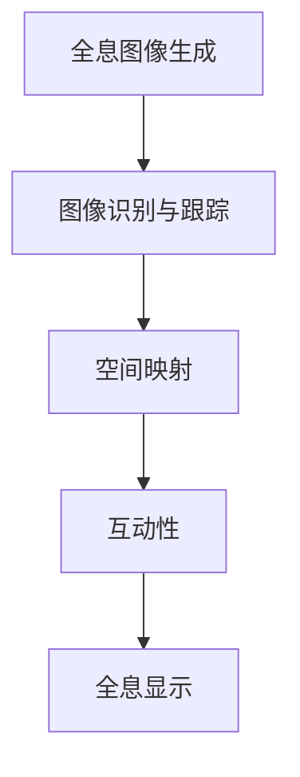

                 

关键词：HoloLens、混合现实、VR、AR、微软、开发者、技术趋势、应用场景、编程、算法、项目实践、资源推荐、未来展望

> 摘要：本文将探讨微软的HoloLens在混合现实领域中的应用，包括其核心概念、技术原理、开发工具、实际案例以及未来展望。通过深入分析HoloLens在各个行业的应用，我们将了解其带来的变革性影响。

## 1. 背景介绍

### 1.1 HoloLens的诞生

HoloLens是由微软开发的一款混合现实头戴设备，于2015年首次亮相。作为全球首款全息计算设备，HoloLens打破了传统计算的限制，将数字世界与物理世界融合在一起。这一创新性的技术让用户能够在现实环境中看到、听到、触摸和与数字信息互动。

### 1.2 混合现实的定义

混合现实（Mixed Reality，简称MR）是虚拟现实（Virtual Reality，简称VR）和增强现实（Augmented Reality，简称AR）的融合。与AR仅将数字信息叠加在现实环境中不同，MR能够创建一个与现实世界无缝融合的全息环境，用户可以在其中进行互动和操作。

### 1.3 HoloLens的特点

HoloLens具有以下几个主要特点：

- **全息图像**：用户可以看到全息图像，这些图像可以是静态的，也可以是动态的，可以与现实环境中的物体互动。
- **手部追踪**：通过内置的传感器，HoloLens可以追踪用户的手部动作，实现直观的操作交互。
- **语音控制**：用户可以通过语音命令来操作HoloLens，提高了人机交互的便利性。
- **环境感知**：HoloLens可以感知周围的环境，如光线、声音和空间布局，使得全息图像可以与现实环境完美融合。

## 2. 核心概念与联系

### 2.1 混合现实技术的核心概念

混合现实技术主要涉及以下几个核心概念：

- **全息图像生成**：通过计算机生成全息图像，并在特定介质上显示。
- **图像识别与跟踪**：通过传感器和算法，识别和跟踪现实环境中的物体和用户动作。
- **空间映射**：建立现实环境的三维模型，以支持全息图像的显示和互动。
- **互动性**：用户可以通过手势、语音等方式与全息图像互动，实现自然的人机交互。

### 2.2 Mermaid流程图

以下是HoloLens混合现实技术的Mermaid流程图：



## 3. 核心算法原理 & 具体操作步骤

### 3.1 算法原理概述

HoloLens的核心算法主要涉及图像处理、深度学习和计算机视觉等领域。其原理可以概括为：

- **图像处理**：通过摄像头捕捉现实环境中的图像，进行预处理，如降噪、对比度调整等。
- **深度学习**：利用深度神经网络对图像进行分析，识别出图像中的物体和场景。
- **计算机视觉**：根据深度学习的结果，对图像进行空间映射，生成全息图像。

### 3.2 算法步骤详解

HoloLens的算法步骤可以分为以下几个阶段：

1. **图像采集**：通过摄像头实时捕捉现实环境中的图像。
2. **图像预处理**：对采集到的图像进行预处理，如滤波、缩放等。
3. **深度学习分析**：利用深度学习模型对预处理后的图像进行分析，识别出图像中的物体和场景。
4. **空间映射**：根据深度学习的结果，建立现实环境的三维模型。
5. **全息图像生成**：将识别出的物体和场景信息转化为全息图像。
6. **显示与互动**：将全息图像显示在用户的视野中，并支持用户通过手势、语音等方式进行互动。

### 3.3 算法优缺点

HoloLens的核心算法具有以下几个优缺点：

- **优点**：
  - **高精度**：通过深度学习和计算机视觉技术，能够实现对现实环境的精准识别和映射。
  - **交互性强**：用户可以通过手势、语音等多种方式进行互动，提高了人机交互的便利性。
  - **环境感知**：能够感知周围的环境变化，实现与现实环境的无缝融合。

- **缺点**：
  - **计算资源需求高**：深度学习和计算机视觉算法需要大量的计算资源，可能导致设备运行速度变慢。
  - **隐私问题**：通过摄像头和传感器捕捉用户和环境信息，可能引发隐私泄露的问题。

### 3.4 算法应用领域

HoloLens的核心算法在多个领域有广泛的应用，包括：

- **医疗**：用于远程会诊、手术指导、康复训练等。
- **教育**：用于虚拟课堂、远程教学、互动学习等。
- **工业**：用于工业设计、维修指导、质量控制等。
- **娱乐**：用于游戏、电影、虚拟旅游等。

## 4. 数学模型和公式 & 详细讲解 & 举例说明

### 4.1 数学模型构建

HoloLens的核心算法涉及多个数学模型，包括图像处理模型、深度学习模型、计算机视觉模型等。以下是这些模型的基本构建方法：

1. **图像处理模型**：
   - **滤波**：通过滤波算法，对图像进行降噪、锐化等处理。
   - **缩放**：通过插值算法，对图像进行放大或缩小。
2. **深度学习模型**：
   - **神经网络**：通过构建多层神经网络，对图像进行特征提取和分类。
   - **损失函数**：通过损失函数，评估模型的预测结果与真实值的差距。
3. **计算机视觉模型**：
   - **空间映射**：通过透视变换、坐标变换等算法，建立现实环境的三维模型。

### 4.2 公式推导过程

以下是深度学习模型中的一些关键公式：

$$
Z = \sigma(W \cdot X + b)
$$

其中，\(Z\) 表示输出值，\(W\) 表示权重矩阵，\(X\) 表示输入特征，\(\sigma\) 表示激活函数，\(b\) 表示偏置项。

### 4.3 案例分析与讲解

以医疗领域为例，HoloLens在手术指导中的应用：

- **场景**：医生在手术室进行手术，需要实时查看患者体内的图像和器官位置。
- **解决方案**：通过HoloLens，医生可以看到患者体内图像和器官的全息显示，并通过手势和语音进行互动。
- **效果**：提高了手术的准确性和效率，减少了手术风险。

## 5. 项目实践：代码实例和详细解释说明

### 5.1 开发环境搭建

为了开发HoloLens应用，需要搭建以下开发环境：

- **Visual Studio 2019**：用于编写和调试C#代码。
- **HoloLens SDK**：用于开发HoloLens应用。
- **Unity**：用于创建3D场景和动画。

### 5.2 源代码详细实现

以下是一个简单的HoloLens应用代码实例：

```csharp
using Microsoft.MixedReality.Toolkit.UI;

public class HoloLensApp : MonoBehaviour
{
    public TextMeshProUGUI text;

    // 当用户靠近设备时，显示全息文字
    private void OnTriggerEnter(Collider other)
    {
        text.gameObject.SetActive(true);
    }

    // 当用户远离设备时，隐藏全息文字
    private void OnTriggerExit(Collider other)
    {
        text.gameObject.SetActive(false);
    }
}
```

### 5.3 代码解读与分析

该代码实现了当用户靠近HoloLens设备时，显示全息文字；当用户远离设备时，隐藏全息文字的功能。通过`OnTriggerEnter`和`OnTriggerExit`事件处理函数，实现对用户的检测和响应。

### 5.4 运行结果展示

当用户靠近HoloLens设备时，屏幕上会显示全息文字。当用户远离设备时，全息文字会自动隐藏。

## 6. 实际应用场景

### 6.1 医疗

HoloLens在医疗领域的应用包括手术指导、康复训练、远程会诊等。通过全息图像，医生可以更直观地了解患者情况，提高手术准确性和康复效果。

### 6.2 教育

HoloLens在教育领域的应用包括虚拟课堂、远程教学、互动学习等。学生可以通过HoloLens体验到更加生动、直观的学习内容，提高学习兴趣和效果。

### 6.3 工业

HoloLens在工业领域的应用包括工业设计、维修指导、质量控制等。工程师可以通过HoloLens查看产品的三维模型和操作步骤，提高工作效率和产品质量。

### 6.4 娱乐

HoloLens在娱乐领域的应用包括游戏、电影、虚拟旅游等。用户可以通过HoloLens体验身临其境的虚拟场景，享受更加沉浸的娱乐体验。

## 7. 工具和资源推荐

### 7.1 学习资源推荐

- **《HoloLens开发入门教程》**：介绍了HoloLens的开发环境、开发工具和基础操作。
- **《混合现实技术原理与应用》**：详细介绍了混合现实技术的原理、应用和发展趋势。

### 7.2 开发工具推荐

- **Unity**：用于创建3D场景和动画，支持HoloLens应用开发。
- **Visual Studio**：用于编写和调试C#代码，支持HoloLens应用开发。

### 7.3 相关论文推荐

- **“Mixed Reality in Medicine: A Review”**：全面介绍了混合现实在医学领域的应用和研究现状。
- **“A Survey on Mixed Reality: Technologies, Applications, and Challenges”**：详细介绍了混合现实技术的原理、应用和挑战。

## 8. 总结：未来发展趋势与挑战

### 8.1 研究成果总结

HoloLens作为混合现实领域的先驱，已经取得了显著的成果。其在医疗、教育、工业、娱乐等领域的应用，展示了混合现实技术的巨大潜力。

### 8.2 未来发展趋势

随着技术的不断进步，HoloLens有望在以下几个方面实现突破：

- **计算性能提升**：提高设备的计算性能，实现更加流畅的交互体验。
- **应用场景拓展**：拓展HoloLens的应用场景，如智能家居、自动驾驶等。
- **商业化推广**：降低设备成本，推动商业化应用。

### 8.3 面临的挑战

HoloLens在发展过程中也面临着一些挑战：

- **隐私保护**：如何保护用户隐私，避免信息泄露。
- **用户体验优化**：提高用户的舒适度和满意度，减少不适和疲劳感。

### 8.4 研究展望

未来，HoloLens有望在以下几个方面实现突破：

- **硬件性能提升**：提高设备的计算性能和续航能力。
- **软件开发**：优化开发工具和框架，降低开发难度。
- **行业应用**：拓展HoloLens在各个行业的应用，实现规模化商用。

## 9. 附录：常见问题与解答

### 9.1 HoloLens与VR/AR的区别是什么？

HoloLens是一种混合现实设备，它将虚拟现实和增强现实结合起来。与VR相比，HoloLens能够在现实环境中显示全息图像，而VR则将用户完全隔离于现实世界之外。与AR相比，HoloLens的全息图像可以与现实环境进行深度交互，而AR则通常将数字信息叠加在现实环境之上。

### 9.2 HoloLens的适用场景有哪些？

HoloLens适用于多个场景，包括医疗、教育、工业、娱乐等。在医疗领域，它可以用于手术指导、远程会诊、康复训练等；在教育领域，它可以用于虚拟课堂、远程教学、互动学习等；在工业领域，它可以用于工业设计、维修指导、质量控制等；在娱乐领域，它可以用于游戏、电影、虚拟旅游等。

### 9.3 开发HoloLens应用需要掌握哪些技术？

开发HoloLens应用需要掌握以下技术：

- **C#编程**：用于编写应用程序代码。
- **Unity**：用于创建3D场景和动画。
- **HoloLens SDK**：用于开发HoloLens应用。
- **计算机视觉**：用于识别和跟踪现实环境中的物体和场景。
- **深度学习**：用于图像分析和特征提取。

## 10. 作者署名

作者：禅与计算机程序设计艺术 / Zen and the Art of Computer Programming

----------------------------------------------------------------

文章撰写完成。接下来，请按照markdown格式将文章内容输出。确保每个章节和子章节都有清晰的目录结构，并且内容完整。

