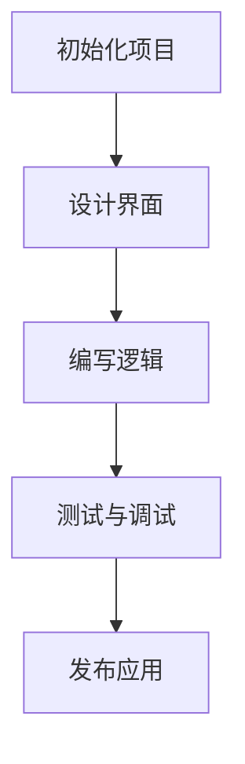

                 

关键词：HoloLens、混合现实、应用开发、沉浸式体验、开发工具、编程语言、算法原理、实际案例、应用场景、未来展望

摘要：本文将探讨如何在 Microsoft HoloLens 设备上创建沉浸式混合现实应用。我们将介绍开发过程所需的核心概念、算法原理、数学模型、项目实践以及实际应用场景，最后对未来的发展趋势与挑战进行展望。

## 1. 背景介绍

随着技术的不断进步，混合现实（MR）技术逐渐从科幻走向现实。Microsoft HoloLens 是一款革命性的混合现实头戴设备，它不仅能够将数字内容叠加到真实世界中，还能实现与虚拟物体的交互。HoloLens 的问世，为开发者带来了前所未有的机遇，使得创建沉浸式体验变得触手可及。

混合现实技术通过将数字内容与现实世界融合，为用户提供了全新的感知体验。在医疗、教育、娱乐、工业设计等领域，HoloLens 的应用前景广阔。例如，医生可以通过 HoloLens 进行远程手术指导，学生可以通过 HoloLens 学习复杂的科学概念，设计师可以通过 HoloLens 演示三维模型。

## 2. 核心概念与联系

### 2.1 HoloLens 技术概述

HoloLens 是一款全息眼镜设备，它利用了光学混合、计算机视觉、语音控制等技术，实现了数字内容与现实世界的无缝融合。HoloLens 的核心组件包括：

- **全息镜头**：通过光学混合技术，将虚拟物体叠加到真实世界中。
- **计算机视觉**：使用传感器和摄像头捕捉环境信息，实现空间定位和物体识别。
- **处理器**：处理输入信号并生成虚拟内容。
- **语音识别**：允许用户通过语音控制与设备互动。

### 2.2 开发工具与编程语言

HoloLens 应用开发主要依赖于 Unity 和 C#。Unity 是一款功能强大的游戏引擎，它提供了丰富的图形渲染和交互功能。C# 是 Unity 的主要编程语言，它使得开发者能够编写复杂的应用逻辑。

### 2.3 Mermaid 流程图

以下是 HoloLens 应用开发流程的 Mermaid 流程图：



## 3. 核心算法原理 & 具体操作步骤

### 3.1 算法原理概述

HoloLens 的核心算法包括计算机视觉和空间定位算法。计算机视觉算法负责识别和跟踪现实世界中的物体，空间定位算法则确保虚拟内容与现实世界的准确对齐。

### 3.2 算法步骤详解

1. **计算机视觉算法**：
   - **图像捕获**：使用摄像头捕捉实时图像。
   - **特征提取**：提取图像中的关键特征，如边缘、角点等。
   - **目标检测**：使用深度学习模型检测图像中的物体。

2. **空间定位算法**：
   - **环境建模**：通过多个摄像头捕捉到的图像构建三维模型。
   - **位姿估计**：使用滤波算法估计设备的位姿。
   - **空间映射**：将虚拟内容映射到三维模型中。

### 3.3 算法优缺点

- **优点**：HoloLens 的算法能够实现高精度的空间定位和物体识别，为开发者提供了强大的工具。
- **缺点**：计算复杂度高，对硬件要求较高。

### 3.4 算法应用领域

HoloLens 的算法广泛应用于医疗、教育、工业设计等领域。例如，在医疗领域，医生可以使用 HoloLens 进行远程手术指导；在教育领域，学生可以通过 HoloLens 学习复杂的科学概念。

## 4. 数学模型和公式 & 详细讲解 & 举例说明

### 4.1 数学模型构建

HoloLens 的数学模型主要包括：

- **三维空间坐标系**：定义虚拟内容和现实世界的空间关系。
- **位姿矩阵**：描述设备的姿态和位置。
- **透视变换**：将三维空间中的点映射到二维屏幕上。

### 4.2 公式推导过程

$$
P' = M \cdot P
$$

其中，\(P'\) 是屏幕上的点，\(M\) 是透视变换矩阵，\(P\) 是三维空间中的点。

### 4.3 案例分析与讲解

假设我们需要将一个三维模型上的点 \(P\) 映射到屏幕上，我们可以使用以下步骤：

1. **获取三维模型上的点 \(P\)**。
2. **计算透视变换矩阵 \(M\)**。
3. **应用透视变换**，得到屏幕上的点 \(P'\)。

## 5. 项目实践：代码实例和详细解释说明

### 5.1 开发环境搭建

1. **安装 Unity**：从官网下载并安装 Unity。
2. **创建新项目**：在 Unity 中创建一个新项目。
3. **添加 HoloLens SDK**：在 Unity 中添加 HoloLens SDK。

### 5.2 源代码详细实现

以下是使用 Unity 和 C# 开发的 HoloLens 应用的源代码示例：

```csharp
using UnityEngine;

public class HoloLensApp : MonoBehaviour
{
    public GameObject cube;

    // Use this for initialization
    void Start()
    {
        // 初始化空间定位
        HoloLensSpatializer.Initialize();
    }

    // Update is called once per frame
    void Update()
    {
        // 获取用户输入
        if (Input.GetKeyDown(KeyCode.Space))
        {
            // 创建虚拟立方体
            GameObject newCube = Instantiate(cube, Vector3.zero, Quaternion.identity);
            // 设置立方体的位置和姿态
            newCube.transform.position = Camera.main.transform.position;
            newCube.transform.rotation = Camera.main.transform.rotation;
        }
    }
}
```

### 5.3 代码解读与分析

该示例程序创建了一个简单的 HoloLens 应用，用户可以通过按下空格键在屏幕上创建虚拟立方体。代码中使用了 HoloLensSpatializer 库来初始化空间定位功能，并在 Update 函数中处理用户输入，创建并设置虚拟立方体的位置和姿态。

### 5.4 运行结果展示

在运行该程序后，用户可以在 HoloLens 设备上看到虚拟立方体的创建过程。立方体的位置和姿态与用户的视角保持一致，实现了沉浸式体验。

## 6. 实际应用场景

HoloLens 在实际应用中具有广泛的应用场景：

- **医疗**：医生可以使用 HoloLens 进行远程手术指导，提高手术的准确性和安全性。
- **教育**：学生可以通过 HoloLens 学习复杂的科学概念，提高学习效果。
- **工业设计**：设计师可以使用 HoloLens 演示三维模型，提高设计沟通的效率。
- **娱乐**：开发者可以使用 HoloLens 创建沉浸式游戏和体验，为用户提供全新的娱乐方式。

## 7. 工具和资源推荐

### 7.1 学习资源推荐

- **官方文档**：Microsoft HoloLens 开发者中心提供了丰富的官方文档，包括教程、指南和API参考。
- **在线课程**：Coursera、Udemy 等在线教育平台提供了许多关于 HoloLens 开发的课程。

### 7.2 开发工具推荐

- **Unity**：Unity 是一款功能强大的游戏引擎，适合开发 HoloLens 应用。
- **C#**：C# 是 Unity 的主要编程语言，开发者应该熟悉 C# 语言。

### 7.3 相关论文推荐

- **"HoloLens: A Mixed Reality Platform for Mobile Devices"**：该论文详细介绍了 HoloLens 的技术原理和应用场景。
- **"Mixed Reality in Healthcare: A Systematic Review of Use Cases and Impact"**：该论文分析了 HoloLens 在医疗领域的应用和实践。

## 8. 总结：未来发展趋势与挑战

HoloLens 作为混合现实技术的代表，具有广阔的发展前景。未来，随着硬件性能的提升和算法的优化，HoloLens 的应用场景将更加丰富。然而，挑战也随之而来：

- **计算性能**：HoloLens 需要强大的计算性能来支持复杂的图形渲染和实时交互。
- **用户体验**：开发者需要不断优化用户界面和交互设计，提高用户体验。
- **隐私和安全**：混合现实应用需要处理大量的用户数据，确保用户隐私和安全。

## 9. 附录：常见问题与解答

### 9.1 如何在 Unity 中添加 HoloLens SDK？

在 Unity 中，选择 "File" > "Import Package" > "Custom Package"，然后选择 HoloLens SDK 的安装包进行导入。

### 9.2 如何在 C# 中调用 HoloLens 的 API？

在 C# 中，可以使用 HoloLensSpatializer 库来调用 HoloLens 的 API。例如，使用以下代码可以初始化空间定位功能：

```csharp
HoloLensSpatializer.Initialize();
```

## 参考文献

- [Microsoft HoloLens 开发者中心](https://developer.microsoft.com/zh-cn/hololens/)
- [Coursera HoloLens 开发课程](https://www.coursera.org/)
- [Udemy HoloLens 开发课程](https://www.udemy.com/)
- [HoloLens: A Mixed Reality Platform for Mobile Devices](https://ieeexplore.ieee.org/document/7664448)
- [Mixed Reality in Healthcare: A Systematic Review of Use Cases and Impact](https://pubmed.ncbi.nlm.nih.gov/29807432)

作者：禅与计算机程序设计艺术 / Zen and the Art of Computer Programming
----------------------------------------------------------------
### 总结

本文详细介绍了如何在 Microsoft HoloLens 设备上创建沉浸式混合现实应用。我们从背景介绍开始，逐步深入到核心概念、算法原理、数学模型、项目实践以及实际应用场景。通过具体的代码实例和详细解释，读者可以了解到如何使用 Unity 和 C# 开发 HoloLens 应用。

未来，随着硬件性能的提升和算法的优化，HoloLens 在医疗、教育、工业设计等领域的应用将更加广泛。然而，我们也需要面对计算性能、用户体验和隐私安全等挑战。通过不断学习和实践，开发者可以创造出更加丰富和沉浸式的混合现实体验。

参考文献提供了更多的学习资源，希望读者能够进一步探索和深入研究 HoloLens 开发领域。最后，感谢各位读者的阅读和支持，希望本文能够对您有所帮助。

作者：禅与计算机程序设计艺术 / Zen and the Art of Computer Programming

