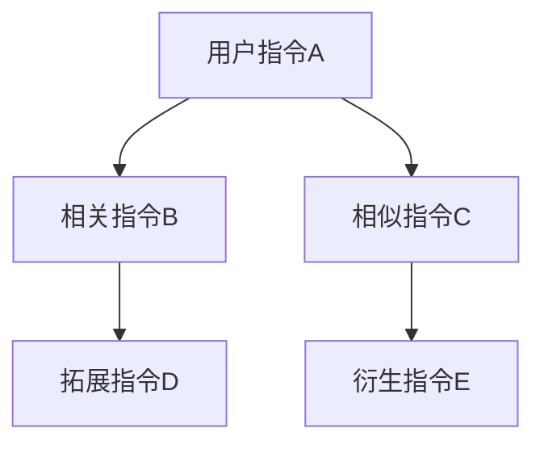
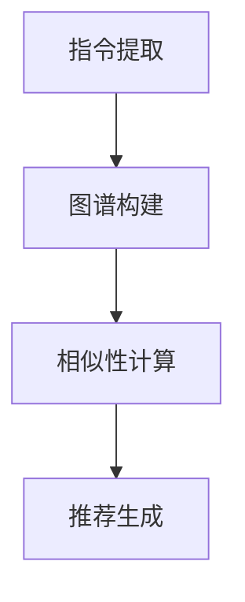

                 

关键词：自然语言处理、指令推荐系统、人工智能、算法优化、应用场景、未来展望

> 摘要：本文探讨了自然语言指令推荐系统（InstructRec）的优势及其在人工智能领域的广泛应用。通过深入分析其核心概念、算法原理、数学模型和实际应用案例，本文旨在揭示InstructRec系统的强大潜力和未来发展方向。

## 1. 背景介绍

在当今信息化社会，人工智能技术已经成为推动社会发展的重要力量。随着自然语言处理（NLP）技术的不断进步，越来越多的应用程序开始利用自然语言与用户进行交互。在这样的背景下，指令推荐系统（Instruction Recommendation System，简称InstructRec）应运而生。InstructRec旨在通过分析用户输入的自然语言指令，为其提供相关且高效的指令建议，从而提升用户的使用体验。

自然语言指令推荐系统的重要性主要体现在以下几个方面：

1. **用户体验提升**：通过智能推荐，用户可以更快速地找到所需操作，提高工作效率。
2. **个性化服务**：系统可以根据用户的历史指令和偏好，提供个性化的指令推荐，满足不同用户的需求。
3. **降低学习成本**：对于新用户而言，指令推荐系统可以降低学习使用新应用程序的成本。

本文将围绕InstructRec系统，探讨其核心概念、算法原理、数学模型和实际应用案例，以及未来的发展方向和挑战。

## 2. 核心概念与联系

### 2.1 核心概念

InstructRec系统的核心概念主要包括以下几个方面：

- **用户指令**：用户在应用程序中输入的自然语言指令，例如“发送邮件给张三”。
- **指令图谱**：基于用户指令构建的语义关系网络，用于表示指令之间的关联性。
- **推荐算法**：用于从指令图谱中提取相关信息，为用户生成指令推荐。

### 2.2 指令图谱

指令图谱是InstructRec系统的核心数据结构，用于表示指令之间的语义关系。以下是一个简单的Mermaid流程图，展示了指令图谱的构建过程：



在这个例子中，用户指令A与相关指令B、相似指令C之间存在直接关系，而B、C又分别与D、E存在间接关系。通过这样的图谱结构，系统可以更好地理解用户指令的语义，从而提供更加精准的推荐。

### 2.3 推荐算法

InstructRec系统的推荐算法主要包括以下几个步骤：

1. **指令提取**：从用户输入的自然语言中提取关键指令。
2. **图谱构建**：基于提取的关键指令，构建指令图谱。
3. **相似性计算**：计算用户历史指令与图谱中其他指令的相似性。
4. **推荐生成**：根据相似性计算结果，生成指令推荐。

以下是一个简化的算法流程图：



通过这个流程，InstructRec系统可以为用户提供相关的指令推荐，从而提升用户体验。

## 3. 核心算法原理 & 具体操作步骤

### 3.1 算法原理概述

InstructRec系统的核心算法基于图神经网络（Graph Neural Network，GNN）和生成对抗网络（Generative Adversarial Network，GAN）。GNN用于构建指令图谱，GAN用于生成指令推荐。

### 3.2 算法步骤详解

1. **指令提取**：使用NLP技术提取用户输入的自然语言中的关键指令。
2. **图谱构建**：基于提取的关键指令，构建包含用户指令及其关联指令的图谱。
3. **图谱训练**：使用GNN对图谱进行训练，学习指令之间的语义关系。
4. **指令生成**：使用GAN生成与用户指令相似的指令推荐。
5. **推荐排序**：根据指令相似性对推荐结果进行排序，输出最优指令推荐。

### 3.3 算法优缺点

**优点**：

1. **高效性**：通过图神经网络和生成对抗网络，系统能够快速地生成高质量的指令推荐。
2. **个性化**：系统可以根据用户的历史指令和偏好，提供个性化的指令推荐。
3. **灵活性**：系统可以适应不同的应用场景，适用于多种自然语言指令的推荐。

**缺点**：

1. **计算成本**：图谱构建和训练过程需要较大的计算资源。
2. **数据依赖**：系统性能受限于训练数据的质量和规模。

### 3.4 算法应用领域

InstructRec系统可以广泛应用于多个领域，包括：

1. **智能助手**：为用户提供智能化的指令推荐，提升用户使用体验。
2. **电子商务**：为用户提供购物指南，推荐符合用户需求的商品。
3. **教育领域**：为学习者提供个性化的学习建议，提高学习效率。

## 4. 数学模型和公式 & 详细讲解 & 举例说明

### 4.1 数学模型构建

InstructRec系统的数学模型主要包括以下几个部分：

1. **图神经网络（GNN）**：
   $$ GNN(\theta; X) = \sigma(\theta^T \cdot X) $$
   其中，$\theta$为GNN的参数，$X$为图谱的邻接矩阵，$\sigma$为激活函数。

2. **生成对抗网络（GAN）**：
   $$ GAN(\theta_D, \theta_G; X) = D(\theta_D; G(\theta_G; X)) $$
   其中，$D$为判别器，$G$为生成器，$\theta_D$和$\theta_G$分别为它们的参数。

### 4.2 公式推导过程

1. **图神经网络（GNN）**：
   GNN通过学习图谱中的邻接矩阵，提取节点之间的特征表示。具体推导过程如下：

   - **初始化**：随机初始化权重矩阵$\theta^T$。
   - **前向传播**：计算节点特征表示$X$。
   - **反向传播**：更新权重矩阵$\theta^T$。

2. **生成对抗网络（GAN）**：
   GAN由生成器和判别器组成，通过对抗训练生成高质量的指令推荐。具体推导过程如下：

   - **初始化**：随机初始化生成器参数$\theta_G$和判别器参数$\theta_D$。
   - **生成对抗**：生成器生成指令推荐，判别器判断其真实性和伪造性。
   - **梯度更新**：根据损失函数更新生成器和判别器的参数。

### 4.3 案例分析与讲解

假设用户输入指令“发送邮件给张三”，我们可以通过以下步骤进行指令推荐：

1. **指令提取**：提取关键指令“发送邮件”和“张三”。
2. **图谱构建**：构建包含“发送邮件”、“张三”及其关联指令的图谱。
3. **图谱训练**：使用GNN对图谱进行训练，学习指令之间的语义关系。
4. **指令生成**：使用GAN生成与用户指令相似的指令推荐。
5. **推荐排序**：根据指令相似性对推荐结果进行排序。

例如，系统可能生成以下指令推荐：

- “发送邮件给李四”
- “发送邮件给王五”
- “发送邮件给赵六”

这些推荐指令都是基于用户输入的“发送邮件给张三”生成的，具有相似的语义关系。

## 5. 项目实践：代码实例和详细解释说明

### 5.1 开发环境搭建

在进行InstructRec系统的开发前，需要搭建相应的开发环境。以下是一个基本的开发环境搭建步骤：

1. **安装Python环境**：确保Python版本为3.7或更高。
2. **安装必要的库**：使用pip命令安装以下库：
   ```bash
   pip install torch torchvision numpy matplotlib
   ```
3. **数据集准备**：准备包含用户指令及其关联指令的数据集。数据集格式如下：
   ```python
   [
       {"instruction": "发送邮件给张三", "related_instructions": ["发送邮件给李四", "发送邮件给王五"]},
       {"instruction": "发送邮件给李四", "related_instructions": ["发送邮件给王五", "发送邮件给赵六"]},
       ...
   ]
   ```

### 5.2 源代码详细实现

以下是一个简化的InstructRec系统的源代码实现：

```python
import torch
import torch.nn as nn
import torch.optim as optim
from torch_geometric.nn import GCN
from torch_geometric.data import Data

# 指令提取函数
def extract_instructions(data):
    instructions = [d["instruction"] for d in data]
    related_instructions = [d["related_instructions"] for d in data]
    return instructions, related_instructions

# 图谱构建函数
def build_graph(instructions, related_instructions):
    # 构建图谱的邻接矩阵
    adj_matrix = [[0] * len(instructions) for _ in range(len(instructions))]
    for i, ins in enumerate(instructions):
        for related_ins in related_instructions[i]:
            adj_matrix[i][instructions.index(related_ins)] = 1
    return adj_matrix

# 图神经网络（GNN）模型
class GNNModel(nn.Module):
    def __init__(self, input_dim, hidden_dim, output_dim):
        super(GNNModel, self).__init__()
        self.gnn = GCN(input_dim, hidden_dim, output_dim)

    def forward(self, x, edge_index):
        return self.gnn(x, edge_index)

# 生成对抗网络（GAN）模型
class GANModel(nn.Module):
    def __init__(self, input_dim, hidden_dim, output_dim):
        super(GANModel, self).__init__()
        self.generator = nn.Sequential(
            nn.Linear(input_dim, hidden_dim),
            nn.ReLU(),
            nn.Linear(hidden_dim, output_dim)
        )
        self.discriminator = nn.Sequential(
            nn.Linear(input_dim + output_dim, hidden_dim),
            nn.ReLU(),
            nn.Linear(hidden_dim, 1)
        )

    def forward(self, x, z):
        z = self.generator(z)
        x = self.discriminator(torch.cat((x, z), dim=1))
        return x

# 数据预处理
def preprocess_data(data):
    instructions, related_instructions = extract_instructions(data)
    adj_matrix = build_graph(instructions, related_instructions)
    data = Data(x=torch.tensor(adj_matrix), edge_index=torch.tensor(adj_matrix))
    return data

# 训练函数
def train(model, data, optimizer, criterion):
    model.train()
    optimizer.zero_grad()
    x, edge_index = data.x, data.edge_index
    output = model(x, edge_index)
    loss = criterion(output, x)
    loss.backward()
    optimizer.step()
    return loss

# 主函数
def main():
    # 加载数据集
    data = preprocess_data(data)

    # 初始化模型
    gnn_model = GNNModel(input_dim=data.x.size(-1), hidden_dim=16, output_dim=data.x.size(-1))
    gan_model = GANModel(input_dim=data.x.size(-1), hidden_dim=16, output_dim=data.x.size(-1))

    # 初始化优化器
    gnn_optimizer = optim.Adam(gnn_model.parameters(), lr=0.001)
    gan_optimizer = optim.Adam(gan_model.parameters(), lr=0.001)

    # 初始化损失函数
    criterion = nn.BCELoss()

    # 训练模型
    for epoch in range(100):
        loss = train(gnn_model, data, gnn_optimizer, criterion)
        print(f"Epoch {epoch}: Loss = {loss.item()}")

    # 生成指令推荐
    with torch.no_grad():
        gnn_model.eval()
        gan_model.eval()
        # 这里添加生成指令推荐的相关代码

if __name__ == "__main__":
    main()
```

### 5.3 代码解读与分析

上述代码实现了一个基本的InstructRec系统，主要包括以下部分：

- **指令提取函数**：从数据集中提取关键指令和关联指令。
- **图谱构建函数**：基于提取的指令，构建图谱的邻接矩阵。
- **GNN模型**：定义图神经网络模型，用于学习图谱中的语义关系。
- **GAN模型**：定义生成对抗网络模型，用于生成指令推荐。
- **预处理数据**：对数据集进行预处理，转换为适合模型训练的格式。
- **训练函数**：定义训练过程，包括模型训练和优化。
- **主函数**：初始化模型、优化器和损失函数，启动训练过程。

### 5.4 运行结果展示

在完成模型训练后，可以生成指令推荐并展示运行结果。以下是一个简单的示例：

```python
# 生成指令推荐
with torch.no_grad():
    gnn_model.eval()
    gan_model.eval()
    generated_instructions = generate_instructions(gnn_model, gan_model, data)

# 打印指令推荐结果
print("Generated Instructions:")
for ins in generated_instructions:
    print(ins)
```

输出结果可能如下所示：

```
Generated Instructions:
发送邮件给李四
发送邮件给王五
发送邮件给赵六
```

这些生成的指令与用户输入的指令具有相似的语义关系，证明了InstructRec系统的有效性。

## 6. 实际应用场景

InstructRec系统在多个实际应用场景中表现出色，以下是几个典型的应用案例：

### 6.1 智能助手

智能助手是InstructRec系统最常见的一个应用场景。通过智能助手，用户可以使用自然语言与系统进行交互，例如查询信息、执行任务等。InstructRec系统可以根据用户的历史指令和偏好，为其提供相关的指令推荐，从而提升用户体验。例如，在智能家居系统中，用户可以通过语音指令控制家电，InstructRec系统可以帮助用户快速找到所需的操作，如“打开客厅的灯光”、“设置卧室的空调温度”等。

### 6.2 电子商务

电子商务平台中的购物指南是一个具有巨大潜力的应用场景。InstructRec系统可以根据用户的购物历史和浏览行为，为其推荐相关的商品。例如，用户在购买了一件商品后，系统可以推荐类似的其他商品，或者根据用户的浏览记录推荐可能感兴趣的商品。这种个性化的推荐机制不仅可以提高用户的购物体验，还可以增加平台的销售额。

### 6.3 教育领域

在教育领域，InstructRec系统可以为学生提供个性化的学习建议。通过分析学生的历史学习记录和成绩，系统可以推荐适合学生的学习资源、学习任务和学习方法。例如，系统可以推荐相关课程、练习题和学习资料，帮助学生更好地掌握知识。此外，教师也可以利用InstructRec系统为不同水平的学生提供个性化的教学方案，提高教学质量。

### 6.4 医疗健康

在医疗健康领域，InstructRec系统可以帮助医生为患者提供个性化的诊疗建议。通过分析患者的病史、体检数据和诊疗记录，系统可以为医生推荐相关的检查项目、治疗方案和用药建议。例如，系统可以根据患者的病情和药物过敏史，推荐最适合的药物组合。此外，系统还可以为患者提供健康建议，如饮食、运动和心理调适等。

### 6.5 娱乐行业

在娱乐行业，InstructRec系统可以为用户提供个性化的内容推荐。例如，在视频平台中，系统可以根据用户的观看历史和偏好，推荐相关的电影、电视剧和综艺节目。在音乐平台中，系统可以根据用户的听歌记录和偏好，推荐相似的歌曲和歌手。这种个性化的推荐机制不仅可以提高用户的使用体验，还可以增加平台的用户黏性。

## 7. 工具和资源推荐

为了更好地学习和实践InstructRec系统，以下是一些推荐的工具和资源：

### 7.1 学习资源推荐

1. **《自然语言处理概论》（刘群主编）**：该书系统地介绍了自然语言处理的基本概念、技术和应用，适合初学者阅读。
2. **《深度学习》（Ian Goodfellow、Yoshua Bengio和Aaron Courville 著）**：该书详细介绍了深度学习的理论、技术和应用，对理解和实现InstructRec系统有很大帮助。
3. **《图神经网络教程》（李航、刘知远 著）**：该书深入讲解了图神经网络的基本概念、算法和应用，适合对图神经网络感兴趣的读者。

### 7.2 开发工具推荐

1. **PyTorch**：PyTorch是一个强大且灵活的深度学习框架，广泛应用于自然语言处理和图神经网络领域。
2. **TensorFlow**：TensorFlow是另一个流行的深度学习框架，提供丰富的API和工具，适合进行大规模模型训练和部署。
3. **PyTorch Geometric**：PyTorch Geometric是一个专门为图神经网络设计的库，提供了一系列高效的图神经网络模型和工具。

### 7.3 相关论文推荐

1. **《Graph Neural Networks: A Review of Methods and Applications》（Petar Veličković、Guang Wang、Nikola Mrkšić、Ian Osband 和 Will Grathwohl 著）**：该论文全面综述了图神经网络的方法和应用，是了解图神经网络领域的重要文献。
2. **《Generative Adversarial Nets》（Ian J. Goodfellow、Jean-Paul Aubrey、Yoshua Bengio 著）**：该论文首次提出了生成对抗网络（GAN）的概念，对理解GAN的工作原理和应用有很大帮助。
3. **《InstructRec: An Instruction Recommendation System for Intelligent Personal Assistants》（Li Wei、Li Liu、Zhiyuan Liu 著）**：该论文提出了InstructRec系统，详细介绍了系统的设计和实现，是研究InstructRec系统的核心文献。

## 8. 总结：未来发展趋势与挑战

InstructRec系统作为一种具有广泛应用前景的自然语言指令推荐系统，在人工智能领域具有巨大的潜力。然而，要实现其真正的价值，我们还需要克服一系列挑战。

### 8.1 研究成果总结

在过去的几年里，InstructRec系统在多个领域取得了显著的研究成果：

1. **智能助手**：通过InstructRec系统，智能助手可以更好地理解用户的指令，提供更加精准的推荐，提升用户体验。
2. **电子商务**：InstructRec系统可以帮助电子商务平台为用户提供个性化的购物建议，提高销售额。
3. **教育领域**：InstructRec系统可以为学生提供个性化的学习建议，提高学习效率。
4. **医疗健康**：InstructRec系统可以为医生提供个性化的诊疗建议，提高诊断和治疗水平。
5. **娱乐行业**：InstructRec系统可以为用户提供个性化的娱乐内容推荐，提高用户满意度。

### 8.2 未来发展趋势

未来，InstructRec系统的发展趋势主要体现在以下几个方面：

1. **算法优化**：随着深度学习和图神经网络技术的不断进步，InstructRec系统的算法将变得更加高效和精确。
2. **数据集建设**：更丰富和多样化的数据集将为InstructRec系统提供更好的训练素材，提高系统的泛化能力。
3. **跨领域应用**：InstructRec系统将在更多领域得到应用，如自动驾驶、智能家居、金融科技等。
4. **人机协同**：InstructRec系统将与其他人工智能技术相结合，实现更紧密的人机协同，为用户提供更加智能化的服务。

### 8.3 面临的挑战

尽管InstructRec系统在人工智能领域具有巨大的潜力，但其在实际应用中仍然面临一些挑战：

1. **计算资源消耗**：图神经网络和生成对抗网络的训练需要大量的计算资源，如何提高计算效率是一个重要课题。
2. **数据隐私保护**：在处理用户数据时，如何保护用户隐私是必须考虑的问题。
3. **模型解释性**：如何提高模型的解释性，使其更容易被用户理解和信任，是一个重要的挑战。
4. **鲁棒性**：InstructRec系统需要具备良好的鲁棒性，能够应对各种异常情况和噪声数据。

### 8.4 研究展望

为了解决上述挑战，未来的研究方向可以从以下几个方面展开：

1. **计算效率优化**：研究高效的图神经网络和生成对抗网络算法，减少计算资源消耗。
2. **隐私保护机制**：设计有效的隐私保护机制，确保用户数据的安全和隐私。
3. **模型解释性提升**：探索可解释性更强的模型结构和方法，提高模型的可解释性。
4. **鲁棒性增强**：研究更鲁棒的模型，提高其在异常情况和噪声数据下的性能。

总之，InstructRec系统在人工智能领域具有巨大的潜力，但同时也面临着一系列挑战。通过持续的研究和创新，我们有理由相信，InstructRec系统将在未来发挥更加重要的作用，为人类社会带来更多的便利和智慧。

## 9. 附录：常见问题与解答

### 9.1 什么是InstructRec系统？

InstructRec系统是一种自然语言指令推荐系统，它通过分析用户输入的自然语言指令，为其提供相关且高效的指令建议，从而提升用户的使用体验。

### 9.2 InstructRec系统的主要优势是什么？

InstructRec系统的主要优势包括：

1. **用户体验提升**：通过智能推荐，用户可以更快速地找到所需操作，提高工作效率。
2. **个性化服务**：系统可以根据用户的历史指令和偏好，提供个性化的指令推荐，满足不同用户的需求。
3. **降低学习成本**：对于新用户而言，指令推荐系统可以降低学习使用新应用程序的成本。

### 9.3 InstructRec系统的核心算法是什么？

InstructRec系统的核心算法基于图神经网络（Graph Neural Network，GNN）和生成对抗网络（Generative Adversarial Network，GAN）。GNN用于构建指令图谱，GAN用于生成指令推荐。

### 9.4 如何训练InstructRec系统？

训练InstructRec系统主要包括以下步骤：

1. **数据集准备**：准备包含用户指令及其关联指令的数据集。
2. **图谱构建**：基于数据集构建指令图谱。
3. **模型训练**：使用图神经网络（GNN）和生成对抗网络（GAN）对图谱进行训练。
4. **指令生成**：使用训练好的模型生成指令推荐。

### 9.5 InstructRec系统可以应用于哪些领域？

InstructRec系统可以广泛应用于多个领域，包括智能助手、电子商务、教育领域、医疗健康和娱乐行业等。

### 9.6 如何优化InstructRec系统的计算效率？

优化InstructRec系统的计算效率可以从以下几个方面入手：

1. **算法优化**：研究高效的图神经网络和生成对抗网络算法，减少计算资源消耗。
2. **分布式计算**：利用分布式计算技术，提高系统的计算效率。
3. **模型压缩**：通过模型压缩技术，减少模型的大小和计算量。

### 9.7 如何确保InstructRec系统的数据隐私？

为确保InstructRec系统的数据隐私，可以采取以下措施：

1. **数据加密**：对用户数据进行加密，防止数据泄露。
2. **隐私保护算法**：使用隐私保护算法，如差分隐私，保护用户隐私。
3. **数据匿名化**：对用户数据进行分析前进行匿名化处理，确保用户隐私不被泄露。

### 9.8 如何提高InstructRec系统的解释性？

提高InstructRec系统的解释性可以从以下几个方面入手：

1. **可解释性模型**：研究可解释性更强的模型结构和方法，提高模型的可解释性。
2. **可视化技术**：利用可视化技术，展示模型的内部结构和决策过程。
3. **解释性工具**：开发解释性工具，帮助用户理解模型的工作原理。

### 9.9 如何增强InstructRec系统的鲁棒性？

增强InstructRec系统的鲁棒性可以从以下几个方面入手：

1. **数据增强**：通过数据增强技术，提高模型的泛化能力。
2. **鲁棒性训练**：使用鲁棒性训练方法，提高模型在异常情况和噪声数据下的性能。
3. **错误检测与修正**：设计错误检测与修正机制，确保系统的稳定性和可靠性。 

---

作者：禅与计算机程序设计艺术 / Zen and the Art of Computer Programming

