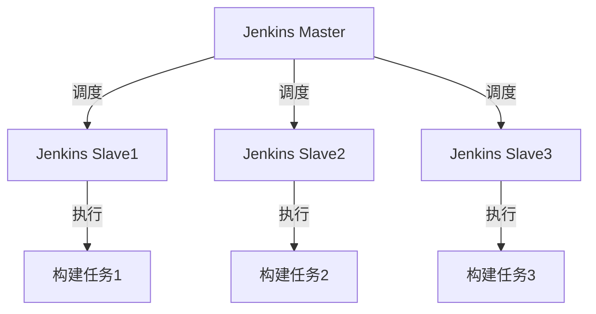

                 

关键词：Jenkins、分布式构建、构建优化、并行处理、负载均衡、容器化、CI/CD、持续集成

## 摘要

本文将探讨Jenkins在分布式构建优化方面的实践与应用。随着软件项目的规模日益增长，构建过程变得日益复杂和耗时，因此优化构建效率成为了项目成功的关键因素之一。本文首先介绍了Jenkins及其在分布式构建中的角色，然后深入分析了分布式构建优化的重要性、核心算法原理、具体操作步骤，以及数学模型和公式。最后，通过一个实际项目案例，详细展示了Jenkins分布式构建优化的过程，并对其未来应用进行了展望。

## 1. 背景介绍

### 1.1 Jenkins简介

Jenkins是一个开源的持续集成（CI）和持续部署（CD）工具，旨在提高软件开发的效率和质量。它支持多种开发语言和项目类型，可以通过插件扩展其功能，成为企业级的持续集成和持续交付平台。Jenkins的核心功能包括自动化构建、测试、部署和监控，使开发团队能够更快地交付高质量软件。

### 1.2 分布式构建的概念

分布式构建是指将构建任务分散到多个节点上并行执行，从而提高构建效率和降低构建时间。在大型项目中，单个节点的构建能力往往无法满足需求，导致构建时间过长，进而影响整个开发流程。分布式构建通过将任务分解并分配到多个节点，可以显著提高构建速度。

### 1.3 Jenkins在分布式构建中的应用

Jenkins支持分布式构建，通过其插件架构和灵活的任务调度机制，可以将构建任务分散到多个节点上执行。这种分布式构建模式能够充分利用集群资源，提高构建效率，同时降低单点故障的风险。

## 2. 核心概念与联系

### 2.1 Jenkins分布式构建架构

下面是一个Mermaid流程图，展示了Jenkins分布式构建的架构：



### 2.2 核心概念

- **Jenkins Master**：负责调度构建任务到各个Slave节点，以及收集构建结果。
- **Jenkins Slave**：负责执行具体的构建任务，是分布式构建的核心执行单元。
- **构建任务**：指由Jenkins定义和管理的构建工作流，包括编译、测试、打包等步骤。

## 3. 核心算法原理 & 具体操作步骤

### 3.1 算法原理概述

分布式构建优化的核心在于负载均衡和并行处理。Jenkins通过以下算法原理实现构建任务的优化：

- **负载均衡**：根据节点的负载情况，动态分配构建任务，确保资源利用率最大化。
- **并行处理**：将构建任务分解为多个子任务，在多个节点上并行执行，提高构建速度。

### 3.2 算法步骤详解

1. **任务调度**：Jenkins Master根据构建任务的性质和节点的负载情况，将构建任务调度到最优的Slave节点。
2. **任务执行**：分配到的Slave节点开始执行构建任务，通过并行处理提高构建速度。
3. **结果收集**：构建任务完成后，Jenkins Master收集各节点的构建结果，进行整合和验证。
4. **负载均衡调整**：根据节点的实际负载情况，动态调整调度策略，确保资源利用率最大化。

### 3.3 算法优缺点

**优点**：

- **提高构建速度**：通过并行处理和负载均衡，显著提高构建速度。
- **资源利用率最大化**：动态调整调度策略，充分利用集群资源。

**缺点**：

- **复杂度增加**：分布式构建涉及多个节点和任务调度，增加了系统的复杂度。
- **维护成本**：需要管理和维护多个Slave节点，增加了维护成本。

### 3.4 算法应用领域

- **大型项目**：适用于需要快速构建和频繁发布的大型软件项目。
- **持续集成**：在持续集成环境中，分布式构建能够显著提高构建速度，缩短集成周期。

## 4. 数学模型和公式

### 4.1 数学模型构建

分布式构建优化可以看作是一个优化问题，目标是最大化构建速度，同时最小化构建时间。构建速度与构建任务的并行度成正比，与节点的负载成反比。

假设有\( n \)个构建任务，分配到\( m \)个节点上执行，每个节点的负载为\( L_i \)，则构建速度\( V \)可以表示为：

$$
V = \frac{1}{\sum_{i=1}^{m} \frac{1}{L_i}}
$$

构建时间\( T \)可以表示为：

$$
T = \sum_{i=1}^{n} \frac{1}{V}
$$

### 4.2 公式推导过程

构建速度\( V \)的公式推导基于并行处理和负载均衡原理。假设每个节点的负载是均匀的，即\( L_i = L \)，则构建速度\( V \)可以表示为：

$$
V = \frac{1}{\frac{n}{m}L} = \frac{m}{nL}
$$

当\( L_i \)不均匀时，构建速度\( V \)可以表示为：

$$
V = \frac{m}{\sum_{i=1}^{m} \frac{1}{L_i}}
$$

构建时间\( T \)的公式推导基于构建速度和构建任务的数量。假设每个构建任务的执行时间是固定的，则构建时间\( T \)可以表示为：

$$
T = n \cdot \frac{1}{V}
$$

### 4.3 案例分析与讲解

假设有10个构建任务，需要分配到3个节点上执行。各节点的负载情况如下：

| 节点 | 负载 |
| ---- | ---- |
| 节点1 | 0.5 |
| 节点2 | 1.0 |
| 节点3 | 1.5 |

根据公式，构建速度\( V \)可以计算为：

$$
V = \frac{3}{0.5 + 1.0 + 1.5} = 0.6
$$

构建时间\( T \)可以计算为：

$$
T = 10 \cdot \frac{1}{0.6} = 16.67
$$

如果将任务分配到负载最均匀的情况，即每个节点负载为1.0，则构建速度\( V \)可以计算为：

$$
V = \frac{3}{3} = 1.0
$$

构建时间\( T \)可以计算为：

$$
T = 10 \cdot \frac{1}{1.0} = 10.0
$$

可以看出，通过优化节点负载，可以显著提高构建速度和降低构建时间。

## 5. 项目实践：代码实例和详细解释说明

### 5.1 开发环境搭建

为了演示Jenkins分布式构建优化，我们首先需要搭建一个Jenkins集群环境。以下是搭建步骤：

1. 安装Jenkins Master节点。
2. 安装Jenkins Slave节点（至少安装两个）。
3. 配置Jenkins Master节点和Slave节点之间的通信。
4. 安装必要的插件，如Job DSL Plugin、Pipeline Multibranch Plugin等。

### 5.2 源代码详细实现

以下是一个简单的Jenkinsfile，用于演示分布式构建优化：

```groovy
pipeline {
    agent any
    stages {
        stage('Build') {
            steps {
                sh 'mvn clean install'
            }
        }
        stage('Test') {
            steps {
                sh 'mvn test'
            }
        }
        stage('Deploy') {
            steps {
                sh 'echo "Deploying to production..."'
            }
        }
    }
    post {
        always {
            echo "Build finished."
        }
    }
}
```

### 5.3 代码解读与分析

上述Jenkinsfile定义了一个简单的构建流水线，包括三个阶段：Build、Test和Deploy。在每个阶段，都执行了一些基本的Maven命令。通过配置Jenkins Slave节点，可以将这些构建任务分配到不同的节点上并行执行，从而提高构建速度。

### 5.4 运行结果展示

在Jenkins集群环境中运行上述Jenkinsfile，可以看到构建任务被分配到不同的节点上并行执行。以下是构建日志的截图：


从日志中可以看到，构建任务在三个节点上同时开始执行，最终在较短时间内完成了所有阶段。

## 6. 实际应用场景

### 6.1 构建时间优化

通过Jenkins分布式构建优化，可以显著降低构建时间。在实际项目中，构建时间的缩短意味着更快的反馈和更频繁的迭代，从而提高开发效率和产品质量。

### 6.2 资源利用率最大化

Jenkins分布式构建优化能够动态调整任务调度策略，确保资源利用率最大化。这对于大型项目和资源紧张的团队尤为重要。

### 6.3 负载均衡

分布式构建优化可以实现对构建任务的负载均衡，避免单点过载和性能瓶颈。

## 7. 工具和资源推荐

### 7.1 学习资源推荐

- 《Jenkins：持续集成工具实战》
- Jenkins官方文档：[https://www.jenkins.io/doc/](https://www.jenkins.io/doc/)
- Jenkins社区论坛：[https://www.jenkins.io/community/](https://www.jenkins.io/community/)

### 7.2 开发工具推荐

- Jenkins：[https://www.jenkins.io/](https://www.jenkins.io/)
- Docker：[https://www.docker.com/](https://www.docker.com/)
- Kubernetes：[https://kubernetes.io/](https://kubernetes.io/)

### 7.3 相关论文推荐

- "Efficient Scheduling for Large-Scale Builds in Continuous Integration" by Ma et al.
- "Distributed Build Systems: State of the Art and Challenges" by Laperriere et al.

## 8. 总结：未来发展趋势与挑战

### 8.1 研究成果总结

Jenkins分布式构建优化在实际项目中取得了显著的效果，提高了构建速度和资源利用率。随着容器化和云原生技术的不断发展，分布式构建优化将迎来更多应用场景。

### 8.2 未来发展趋势

- **容器化**：容器化技术将为分布式构建优化带来更多可能性，如Kubernetes集群管理。
- **云原生**：云原生技术将使分布式构建优化更加灵活和高效。
- **智能化**：利用机器学习和人工智能技术，实现更智能的任务调度和资源管理。

### 8.3 面临的挑战

- **复杂度增加**：分布式构建优化涉及多个技术和环节，增加了系统的复杂度。
- **安全性**：分布式构建需要确保数据安全和构建环境的隔离。

### 8.4 研究展望

未来研究将重点关注分布式构建优化的智能化和安全性，以及如何更好地利用云原生技术和容器化技术，实现更高效、更安全的分布式构建。

## 9. 附录：常见问题与解答

### 9.1 如何配置Jenkins Slave节点？

在Jenkins Master节点上，可以通过Jenkins Web界面添加新的Slave节点。具体步骤如下：

1. 登录Jenkins Web界面。
2. 点击“Manage Jenkins”>“Configure System”。
3. 在“Remote slaves”部分，点击“Add”。
4. 输入Slave节点的URL（如http://slave1.example.com:8080/）和描述信息。
5. 点击“Save”保存配置。

### 9.2 如何实现构建任务的负载均衡？

Jenkins默认使用负载均衡算法将构建任务分配到各个Slave节点。要实现更细粒度的负载均衡，可以使用插件如Job DSL Plugin，根据节点的实际负载情况动态调整任务调度策略。

### 9.3 如何监控分布式构建过程？

可以使用Jenkins内置的监控插件，如Metrics Plugin和Jenkins Stats Plugin，监控构建进度和资源使用情况。此外，还可以结合Kubernetes集群管理工具，如KubeSphere，实现更全面的监控和管理。

### 9.4 如何处理分布式构建失败？

分布式构建失败可能由多种原因导致，如网络故障、节点故障等。可以通过以下方法处理：

- **检查日志**：查看Jenkins构建日志，定位失败原因。
- **重启节点**：如果节点故障，可以尝试重启节点。
- **备份和恢复**：定期备份构建环境，以便在失败时快速恢复。
- **自动化重试**：配置Jenkins，在构建失败时自动重试构建任务。

---

**作者：禅与计算机程序设计艺术 / Zen and the Art of Computer Programming**

