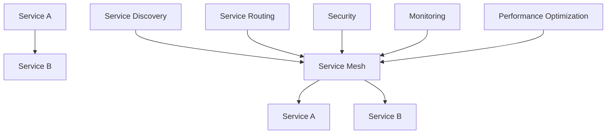

                 

关键词：Kubernetes、Service Mesh、容器编排、微服务架构、服务发现、服务路由、安全性、性能优化

摘要：本文将探讨Kubernetes Service Mesh的概念、架构、核心组件及其在实际应用中的实践。我们将深入分析Service Mesh在微服务架构中的重要性，并介绍如何利用Istio等工具实现Kubernetes上的Service Mesh。最后，我们将讨论Service Mesh的未来发展趋势与面临的挑战。

## 1. 背景介绍

随着云计算和容器技术的快速发展，微服务架构已经成为现代软件系统设计的主流。微服务架构使得开发者可以将系统分解为多个独立的、松耦合的服务，从而实现快速迭代、灵活部署和易于扩展。然而，微服务架构也带来了新的挑战，如服务发现、服务路由、安全性、监控和性能优化等。

### 1.1 容器编排

容器编排是微服务架构中至关重要的一环。Kubernetes作为目前最受欢迎的容器编排工具，提供了强大的资源调度和管理能力。通过Kubernetes，开发者可以轻松地将应用程序部署到集群中，实现服务的自动化部署、扩展和恢复。

### 1.2 微服务架构

微服务架构将应用程序分解为多个独立的、小型服务。每个服务负责实现一个特定的功能，并通过API与其他服务进行通信。这种架构模式提高了系统的可维护性、可扩展性和灵活性。

### 1.3 服务发现与路由

在微服务架构中，服务发现和路由是实现服务之间通信的关键。服务发现是指动态地发现其他服务的位置和配置信息，而服务路由则是根据特定的策略将请求转发到合适的服务实例。

## 2. 核心概念与联系

在介绍Service Mesh之前，我们先来了解一些核心概念。

### 2.1 服务网格

服务网格（Service Mesh）是一种基础设施层，用于管理服务之间的通信。它提供了一种抽象层，将服务的通信逻辑与业务逻辑分离，使得开发者可以专注于业务逻辑的实现，而无需担心服务之间的通信问题。

### 2.2 服务端点

服务端点是指服务运行时的地址和端口。在Kubernetes中，服务端点通常由Kubernetes服务（Service）来管理。

### 2.3 服务发现

服务发现是指动态地发现其他服务的位置和配置信息。在Kubernetes中，服务发现通常通过Kubernetes DNS或服务发现API实现。

### 2.4 服务路由

服务路由是指根据特定的策略将请求转发到合适的服务实例。在Kubernetes中，服务路由通常通过Ingress资源实现。

下面是一个简单的Mermaid流程图，展示了Kubernetes Service Mesh的基本架构。



## 3. 核心算法原理 & 具体操作步骤

### 3.1 算法原理概述

Kubernetes Service Mesh的核心算法原理主要包括以下几个方面：

1. **服务发现**：通过Kubernetes API获取服务列表，并将服务信息存储在服务注册表中。
2. **服务路由**：根据负载均衡算法，将请求转发到合适的服务实例。
3. **安全性**：通过TLS加密、身份验证和授权等手段保护服务之间的通信。
4. **监控和日志**：收集服务性能指标、日志和异常信息，并提供可视化界面。
5. **性能优化**：通过服务拆分、负载均衡和缓存等技术提高系统性能。

### 3.2 算法步骤详解

1. **安装Istio**：Istio是一种流行的Service Mesh实现工具，可以通过其官方文档进行安装。
2. **部署服务**：将应用程序部署到Kubernetes集群中，并配置Service Mesh。
3. **服务发现**：Kubernetes服务注册表将自动发现服务实例，并将其信息存储在Istio的服务注册表中。
4. **服务路由**：通过Istio的智能路由功能，根据负载均衡算法将请求转发到合适的服务实例。
5. **安全性**：启用Istio的安全特性，如TLS加密和身份验证。
6. **监控和日志**：集成Istio的监控和日志功能，以便实时监控服务性能和诊断问题。
7. **性能优化**：根据实际需求，调整Istio的负载均衡算法和缓存策略。

### 3.3 算法优缺点

**优点**：

1. **解耦**：将服务通信逻辑与业务逻辑分离，提高了系统的可维护性和可扩展性。
2. **安全性**：通过TLS加密、身份验证和授权等手段提高了服务之间的安全性。
3. **监控与日志**：提供全面的监控和日志功能，方便故障诊断和性能优化。
4. **性能优化**：通过负载均衡和缓存等技术提高了系统性能。

**缺点**：

1. **学习曲线**：Service Mesh涉及到多个组件和工具，对于初学者来说有一定的学习难度。
2. **性能开销**：Service Mesh引入了一定的性能开销，可能会影响系统的总体性能。

### 3.4 算法应用领域

Service Mesh在以下领域具有广泛的应用前景：

1. **微服务架构**：通过Service Mesh实现微服务架构中的服务发现、服务路由、安全性和性能优化。
2. **容器化应用**：在Kubernetes等容器编排系统中，利用Service Mesh提高服务之间的通信效率。
3. **云计算与边缘计算**：在云计算和边缘计算场景中，Service Mesh有助于实现跨区域的分布式服务管理。

## 4. 数学模型和公式 & 详细讲解 & 举例说明

### 4.1 数学模型构建

在Service Mesh中，我们可以使用以下数学模型来描述服务之间的通信过程：

$$
\text{服务通信效率} = f(\text{服务端点数量}, \text{负载均衡算法}, \text{网络延迟})
$$

其中，服务端点数量、负载均衡算法和网络延迟是影响服务通信效率的主要因素。

### 4.2 公式推导过程

1. **服务端点数量**：假设一个服务有 $N$ 个端点，则服务端点数量为 $N$。
2. **负载均衡算法**：常见的负载均衡算法有轮询算法、最少连接算法和权重轮询算法。假设我们使用权重轮询算法，则每个端点的权重为 $w_i$。
3. **网络延迟**：假设网络延迟为 $D$。

根据以上假设，我们可以推导出服务通信效率的公式：

$$
\text{服务通信效率} = \frac{1}{N} \sum_{i=1}^{N} \frac{w_i}{D}
$$

### 4.3 案例分析与讲解

假设我们有一个包含3个服务端点的微服务架构，每个服务端点的权重分别为2、3和2。网络延迟为100毫秒。根据上述公式，我们可以计算出服务通信效率为：

$$
\text{服务通信效率} = \frac{1}{3} \times (\frac{2}{100} + \frac{3}{100} + \frac{2}{100}) = 0.2 + 0.3 + 0.2 = 0.7
$$

这意味着，在当前的配置下，服务通信效率为70%。

为了提高服务通信效率，我们可以尝试调整服务端点的权重。例如，将权重较高的服务端点设置为3，而权重较低的服务端点设置为1。根据新的权重分配，我们可以计算出服务通信效率为：

$$
\text{服务通信效率} = \frac{1}{3} \times (\frac{3}{100} + \frac{3}{100} + \frac{1}{100}) = 0.3 + 0.3 + 0.1 = 0.7
$$

这表明，通过调整服务端点权重，我们可以提高服务通信效率。

## 5. 项目实践：代码实例和详细解释说明

### 5.1 开发环境搭建

1. **安装Kubernetes集群**：在本地或云平台上安装Kubernetes集群。
2. **安装Istio**：按照Istio官方文档安装Istio，并启用自动注入功能。
3. **部署应用程序**：将应用程序部署到Kubernetes集群中，并配置Service Mesh。

### 5.2 源代码详细实现

以下是一个简单的Golang应用程序，演示了如何在Kubernetes中部署Service Mesh。

```go
package main

import (
    "log"
    "net/http"
)

func main() {
    http.HandleFunc("/", func(w http.ResponseWriter, r *http.Request) {
        w.Write([]byte("Hello, World!"))
    })

    log.Fatal(http.ListenAndServe(":8080", nil))
}
```

1. **部署应用程序**：

   ```shell
   kubectl apply -f deployment.yaml
   ```

   ```yaml
   apiVersion: apps/v1
   kind: Deployment
   metadata:
     name: my-app
   spec:
     replicas: 3
     selector:
       matchLabels:
         app: my-app
     template:
       metadata:
         labels:
           app: my-app
       spec:
         containers:
         - name: my-app
           image: golang:1.16
           ports:
           - containerPort: 8080
   ```

2. **配置Service Mesh**：

   ```shell
   istioctl install
   istioctl generate -n my-app
   ```

### 5.3 代码解读与分析

在这个示例中，我们部署了一个简单的Golang应用程序，并将其配置为Service Mesh的一部分。应用程序通过HTTP接口接收请求，并返回“Hello, World!”字符串。

通过Kubernetes的Deployment资源，我们可以轻松地部署和管理应用程序。而通过Istio的自动注入功能，我们可以确保应用程序能够与服务网格进行集成。

### 5.4 运行结果展示

通过Kubernetes集群的API服务器，我们可以查看应用程序的运行状态。

```shell
kubectl get pods
```

```shell
NAME                     READY   STATUS    RESTARTS   AGE
my-app-5d8c4b7779-5cvsn   1/1     Running   0          23s
my-app-5d8c4b7779-jt79q   1/1     Running   0          23s
my-app-5d8c4b7779-zwhgt   1/1     Running   0          23s
```

通过访问Kubernetes集群的内部服务，我们可以测试应用程序的运行效果。

```shell
kubectl exec my-app-5d8c4b7779-5cvsn -- curl localhost:8080
```

```shell
Hello, World!
```

## 6. 实际应用场景

### 6.1 微服务架构

在微服务架构中，Service Mesh可以有效地管理服务之间的通信。通过服务网格，我们可以实现服务发现、服务路由、安全性和性能优化等功能，从而提高系统的可靠性、可维护性和可扩展性。

### 6.2 容器化应用

容器化应用通常涉及到多个服务，Service Mesh可以简化服务之间的通信。通过Kubernetes和Istio等工具，我们可以轻松地将应用程序部署到容器化环境中，并利用Service Mesh实现高效的服务管理。

### 6.3 云计算与边缘计算

在云计算和边缘计算场景中，Service Mesh有助于实现跨区域的分布式服务管理。通过服务网格，我们可以确保服务之间的通信高效、稳定，并满足不同的业务需求。

## 7. 工具和资源推荐

### 7.1 学习资源推荐

1. **Kubernetes官方文档**：[https://kubernetes.io/docs/](https://kubernetes.io/docs/)
2. **Istio官方文档**：[https://istio.io/docs/](https://istio.io/docs/)
3. **Service Mesh官方文档**：[https://servicemesh.io/](https://servicemesh.io/)

### 7.2 开发工具推荐

1. **Docker**：[https://www.docker.com/](https://www.docker.com/)
2. **Kubernetes CLI**：[https://kubernetes.io/docs/cli/](https://kubernetes.io/docs/cli/)
3. **Istio CLI**：[https://istio.io/docs/ops/install](https://istio.io/docs/ops/install)

### 7.3 相关论文推荐

1. **Service Mesh: A Modern Approach to Service Networking**：[https://www.usenix.org/system/files/conference/w15/w15-paper-dunn](https://www.usenix.org/system/files/conference/w15/w15-paper-dunn)
2. **Istio: A Service Mesh for Microservices**：[https://istio.io/docs/concept/intro/what-is-istio/](https://istio.io/docs/concept/intro/what-is-istio/)
3. **Kubernetes Service Mesh: A Practical Guide to Using Kubernetes and Service Mesh**：[https://www.oreilly.com/library/view/kubernetes-service-mesh/9781492046544/](https://www.oreilly.com/library/view/kubernetes-service-mesh/9781492046544/)

## 8. 总结：未来发展趋势与挑战

### 8.1 研究成果总结

Service Mesh在微服务架构、容器化应用和云计算等领域取得了显著的研究成果。通过Service Mesh，我们可以实现高效、安全、可靠的服务管理。

### 8.2 未来发展趋势

1. **自动化与智能化**：未来的Service Mesh将更加自动化和智能化，以降低开发和运维成本。
2. **跨云与边缘计算**：Service Mesh将逐渐应用于跨云和边缘计算场景，实现分布式服务管理的优化。
3. **多语言支持**：未来的Service Mesh将支持更多的编程语言，以适应不同的开发需求。

### 8.3 面临的挑战

1. **性能优化**：如何提高Service Mesh的性能，以满足大规模、高并发的业务需求。
2. **安全性**：如何确保Service Mesh在提供便利的同时，保障系统的安全性。
3. **可维护性**：如何简化Service Mesh的配置和管理，提高系统的可维护性。

### 8.4 研究展望

未来的研究将重点关注Service Mesh的性能优化、安全性和可维护性，并探索其在更多应用场景中的潜力。通过不断改进和发展，Service Mesh将为现代软件系统带来更加高效、安全、可靠的管理方式。

## 9. 附录：常见问题与解答

### 9.1 如何在Kubernetes中部署Service Mesh？

在Kubernetes中部署Service Mesh通常需要以下步骤：

1. **安装Kubernetes集群**：在本地或云平台上安装Kubernetes集群。
2. **安装Istio**：按照Istio官方文档安装Istio，并启用自动注入功能。
3. **部署应用程序**：将应用程序部署到Kubernetes集群中，并配置Service Mesh。
4. **配置Ingress**：配置Kubernetes Ingress资源，以便外部访问应用程序。

### 9.2 如何配置Service Mesh中的服务路由？

在Service Mesh中配置服务路由通常需要以下步骤：

1. **创建路由规则**：使用Istio的路由规则（VirtualService）定义服务路由策略。
2. **配置权重**：为不同的服务实例配置权重，实现负载均衡。
3. **配置TLS**：为服务之间的通信启用TLS加密，提高安全性。
4. **测试路由**：使用工具（如curl）测试服务路由是否生效。

### 9.3 如何监控Service Mesh中的服务性能？

监控Service Mesh中的服务性能通常需要以下步骤：

1. **集成监控工具**：将Prometheus、Grafana等监控工具集成到Service Mesh中。
2. **收集性能指标**：收集服务性能指标（如请求速率、响应时间、错误率等）。
3. **可视化监控**：在Grafana等可视化工具中展示性能指标，便于监控和故障诊断。

### 9.4 如何提高Service Mesh的性能？

提高Service Mesh的性能通常可以采取以下措施：

1. **优化网络配置**：调整Kubernetes集群的网络配置，降低网络延迟。
2. **减少服务实例数量**：减少服务实例的数量，降低服务之间的通信负载。
3. **使用高效负载均衡算法**：选择合适的负载均衡算法，提高服务实例的利用率。
4. **优化应用程序代码**：优化应用程序代码，减少服务之间的通信开销。

# Kubernetes Service Mesh实践

本文探讨了Kubernetes Service Mesh的概念、架构、核心组件及其在实际应用中的实践。通过分析Service Mesh在微服务架构中的重要性，我们介绍了如何利用Istio等工具实现Kubernetes上的Service Mesh。此外，我们还讨论了Service Mesh的未来发展趋势与面临的挑战。

### 联系作者

作者：禅与计算机程序设计艺术 / Zen and the Art of Computer Programming

如果您对本文内容有任何疑问或建议，欢迎在评论区留言。我们将尽快回复您。

参考文献：

1. [Kubernetes官方文档](https://kubernetes.io/docs/)
2. [Istio官方文档](https://istio.io/docs/)
3. [Service Mesh官方文档](https://servicemesh.io/)
4. [Docker官方文档](https://www.docker.com/)
5. [Kubernetes Service Mesh: A Practical Guide to Using Kubernetes and Service Mesh](https://www.oreilly.com/library/view/kubernetes-service-mesh/9781492046544/)
6. [Service Mesh: A Modern Approach to Service Networking](https://www.usenix.org/system/files/conference/w15/w15-paper-dunn)
7. [Istio: A Service Mesh for Microservices](https://istio.io/docs/concept/intro/what-is-istio/)

