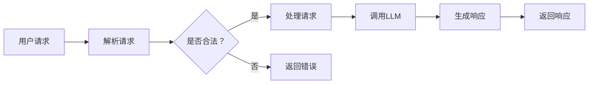

                 

关键词：大型语言模型（LLM），API设计，易用性，强大，AI接口，技术架构，软件开发，用户体验，性能优化

> 摘要：本文将深入探讨大型语言模型（LLM）API的设计原则与最佳实践，旨在帮助开发者构建既易于使用又功能强大的AI接口，从而满足多样化的应用场景需求。

## 1. 背景介绍

在人工智能领域，大型语言模型（LLM）如GPT-3，BERT等已经取得了显著的进展。这些模型能够处理自然语言任务，如文本生成、摘要、翻译、问答等，极大地提升了人工智能的应用价值。然而，将如此复杂的模型集成到实际应用中并非易事。API（应用程序接口）作为模型与应用程序之间的桥梁，其设计质量直接影响用户体验和系统的性能。因此，设计易用且强大的LLM API成为了一个关键任务。

本文将围绕以下几个核心问题展开：

- LLM API设计的基本原则是什么？
- 如何确保API的易用性？
- API的性能如何优化？
- 在不同应用场景中，如何调整API设计？

通过对这些问题的深入探讨，希望能为开发者提供有价值的参考和指导。

## 2. 核心概念与联系

### 2.1 API设计的基本概念

API（应用程序接口）是软件系统不同组件之间通信的接口。在LLM领域，API用于让开发者能够与大型语言模型进行交互。API设计涉及多个核心概念，包括接口定义、数据格式、通信协议等。

#### 2.1.1 接口定义

接口定义是API设计的第一步。它定义了API提供哪些功能，每个功能有哪些输入和输出参数。好的接口定义应该清晰、简洁，避免过于复杂。

#### 2.1.2 数据格式

API通常使用特定的数据格式（如JSON、XML等）来传输数据。选择合适的数据格式对API的性能和易用性有很大影响。

#### 2.1.3 通信协议

通信协议决定了API如何通过网络进行数据传输。常见的通信协议有HTTP、WebSocket等。每种协议都有其优缺点，需要根据具体应用场景进行选择。

### 2.2 LLM API与应用程序的关系

LLM API作为应用程序与大型语言模型之间的接口，其设计需要考虑到以下方面：

#### 2.2.1 功能集成

API需要提供足够的接口，以便开发者能够集成大型语言模型的各种功能。

#### 2.2.2 性能优化

API的设计需要考虑如何优化性能，如减少响应时间、降低延迟等。

#### 2.2.3 易用性

API的设计需要易于使用，降低开发者的学习和使用成本。

### 2.3 Mermaid流程图

以下是一个简化的Mermaid流程图，展示了LLM API与应用程序之间的交互过程：



在这个流程图中，用户请求通过API接口进入系统，系统首先对请求进行解析，然后判断请求是否合法。如果合法，系统会调用LLM处理请求，并生成响应；否则，系统会返回错误信息。

### 2.4 API设计原则

#### 2.4.1 简洁性

简洁性是API设计的一个重要原则。一个简洁的API易于理解和维护，有助于降低开发成本。

#### 2.4.2 可扩展性

API需要具备良好的可扩展性，以便在未来的需求变化中能够灵活调整。

#### 2.4.3 一致性

API应保持一致性，避免因版本升级导致的不兼容问题。

#### 2.4.4 易用性

API的设计应考虑到开发者的使用体验，提供清晰的文档和示例代码，降低学习成本。

#### 2.4.5 可靠性

API需要具备高可靠性，确保数据传输的完整性和准确性。

## 3. 核心算法原理 & 具体操作步骤

### 3.1 算法原理概述

LLM API的核心在于如何高效地与大型语言模型进行交互。以下是LLM API的基本原理：

#### 3.1.1 请求处理

当用户通过API发送请求时，系统首先对请求进行解析，提取关键信息，如请求类型、参数等。

#### 3.1.2 模型调用

根据请求类型和参数，系统会调用相应的模型进行数据处理。

#### 3.1.3 响应生成

模型处理完请求后，会生成响应数据，系统将这些数据组织成API返回的格式。

#### 3.1.4 响应返回

系统将生成的响应数据返回给用户。

### 3.2 算法步骤详解

以下是LLM API的具体操作步骤：

#### 3.2.1 请求解析

系统接收到用户的请求后，首先对请求进行解析。解析过程包括：

- 提取请求类型（如文本生成、摘要等）。
- 提取请求参数（如输入文本、生成长度等）。

解析过程可以使用正则表达式、JSON解析器等工具实现。

#### 3.2.2 模型调用

根据解析得到的请求类型和参数，系统会调用相应的模型进行数据处理。例如，如果请求类型是文本生成，系统会调用文本生成模型。

模型调用过程包括：

- 加载模型权重。
- 将请求参数传递给模型。
- 运行模型进行数据处理。

模型调用可以使用深度学习框架（如TensorFlow、PyTorch等）实现。

#### 3.2.3 响应生成

模型处理完请求后，会生成响应数据。响应数据包括：

- 生成的文本。
- 相关的元数据（如生成时间、模型版本等）。

响应生成过程包括：

- 将模型生成的文本组织成API返回的格式（如JSON）。
- 添加相关的元数据。

#### 3.2.4 响应返回

系统将生成的响应数据返回给用户。响应返回过程包括：

- 将响应数据转换为用户期望的格式（如JSON）。
- 通过网络传输响应数据给用户。

响应返回可以使用HTTP协议实现。

### 3.3 算法优缺点

#### 3.3.1 优点

- 易于集成：LLM API设计简单，易于与其他系统进行集成。
- 高性能：使用深度学习框架进行模型调用，能够高效地处理大量请求。
- 可扩展性：API设计具有良好的可扩展性，能够适应未来的需求变化。

#### 3.3.2 缺点

- 学习成本：对于初学者，理解和使用LLM API可能需要一定的时间。
- 资源消耗：LLM模型通常需要较高的计算资源，对硬件性能有较高要求。

### 3.4 算法应用领域

LLM API的应用领域广泛，包括但不限于：

- 文本生成：如文章写作、对话系统等。
- 自然语言处理：如情感分析、信息抽取等。
- 翻译：如机器翻译、实时对话翻译等。
- 问答系统：如智能客服、教育辅导等。

## 4. 数学模型和公式 & 详细讲解 & 举例说明

### 4.1 数学模型构建

LLM API的设计涉及多个数学模型，其中最核心的是生成模型。以下是一个简化的生成模型构建过程：

#### 4.1.1 语言模型

语言模型用于预测下一个单词或字符的概率。常见的语言模型有n-gram模型、神经网络语言模型等。

- n-gram模型：
  $$ P(w_n | w_{n-1}, ..., w_1) = \frac{C(w_{n-1}, ..., w_n)}{C(w_{n-1}, ..., w_1)} $$
  其中，$C(w_{n-1}, ..., w_n)$表示前$n-1$个单词出现后，单词$w_n$的出现次数；$C(w_{n-1}, ..., w_1)$表示前$n-1$个单词出现的总次数。

- 神经网络语言模型：
  $$ P(w_n | w_{n-1}, ..., w_1) = \frac{e^{ \theta(w_{n-1}, ..., w_1) \cdot w_n }}{\sum_{w' \in V} e^{ \theta(w_{n-1}, ..., w_1) \cdot w'}} $$
  其中，$\theta(w_{n-1}, ..., w_1)$表示神经网络对输入序列的权重参数；$V$表示单词集合。

#### 4.1.2 生成模型

生成模型用于根据输入序列生成新的序列。常见的生成模型有RNN、GRU、LSTM等。

- RNN（循环神经网络）：
  $$ h_t = \sigma(W_h \cdot [h_{t-1}, x_t] + b_h) $$
  $$ y_t = \text{softmax}(W_y \cdot h_t + b_y) $$
  其中，$h_t$表示隐藏状态；$x_t$表示输入；$\sigma$表示激活函数；$W_h$、$b_h$、$W_y$、$b_y$分别为权重和偏置。

- GRU（门控循环单元）：
  $$ r_t = \sigma(W_r \cdot [h_{t-1}, x_t] + b_r) $$
  $$ z_t = \sigma(W_z \cdot [h_{t-1}, x_t] + b_z) $$
  $$ h_t = (1 - z_t) \cdot h_{t-1} + z_t \cdot \sigma(W_h \cdot [r_t \cdot h_{t-1}, x_t] + b_h) $$
  其中，$r_t$表示重置门；$z_t$表示更新门。

- LSTM（长短时记忆网络）：
  $$ i_t = \sigma(W_i \cdot [h_{t-1}, x_t] + b_i) $$
  $$ f_t = \sigma(W_f \cdot [h_{t-1}, x_t] + b_f) $$
  $$ g_t = \sigma(W_g \cdot [h_{t-1}, x_t] + b_g) $$
  $$ o_t = \sigma(W_o \cdot [h_{t-1}, x_t] + b_o) $$
  $$ c_t = f_t \cdot c_{t-1} + i_t \cdot g_t $$
  $$ h_t = o_t \cdot \sigma(c_t) $$
  其中，$i_t$表示输入门；$f_t$表示遗忘门；$g_t$表示生成门；$o_t$表示输出门；$c_t$表示细胞状态。

### 4.2 公式推导过程

以下是对生成模型中的一些关键公式的推导：

#### 4.2.1 RNN公式推导

RNN的推导相对简单，主要涉及激活函数和线性变换。

- 激活函数：
  $$ \sigma(x) = \frac{1}{1 + e^{-x}} $$

- 线性变换：
  $$ \text{线性变换} = W \cdot x + b $$

将这两个公式结合，得到RNN的隐藏状态更新公式：
$$ h_t = \sigma(W_h \cdot [h_{t-1}, x_t] + b_h) $$

#### 4.2.2 GRU公式推导

GRU的推导过程涉及门控机制，这里简要介绍。

- 重置门：
  $$ r_t = \sigma(W_r \cdot [h_{t-1}, x_t] + b_r) $$

- 更新门：
  $$ z_t = \sigma(W_z \cdot [h_{t-1}, x_t] + b_z) $$

通过这两个门控机制，我们可以更新隐藏状态：
$$ h_t = (1 - z_t) \cdot h_{t-1} + z_t \cdot \sigma(W_h \cdot [r_t \cdot h_{t-1}, x_t] + b_h) $$

#### 4.2.3 LSTM公式推导

LSTM的推导过程相对复杂，这里简要介绍。

- 输入门：
  $$ i_t = \sigma(W_i \cdot [h_{t-1}, x_t] + b_i) $$

- 遗忘门：
  $$ f_t = \sigma(W_f \cdot [h_{t-1}, x_t] + b_f) $$

- 生成门：
  $$ g_t = \sigma(W_g \cdot [h_{t-1}, x_t] + b_g) $$

- 输出门：
  $$ o_t = \sigma(W_o \cdot [h_{t-1}, x_t] + b_o) $$

通过这三个门控机制，我们可以更新细胞状态和隐藏状态：
$$ c_t = f_t \cdot c_{t-1} + i_t \cdot g_t $$
$$ h_t = o_t \cdot \sigma(c_t) $$

### 4.3 案例分析与讲解

以下是一个简单的文本生成案例，展示如何使用LSTM模型生成文章摘要。

#### 4.3.1 案例背景

假设我们有一个文本数据集，包含多篇新闻文章和对应的摘要。我们的目标是使用LSTM模型生成新的文章摘要。

#### 4.3.2 数据预处理

- 将文本数据转换为单词序列。
- 对单词序列进行编码，将每个单词映射为一个唯一的整数。
- 将编码后的序列进行嵌入，将整数映射为向量。

#### 4.3.3 模型训练

- 使用训练集对LSTM模型进行训练。
- 调整模型参数，如学习率、隐藏层大小等。
- 训练过程中，使用交叉熵损失函数评估模型性能。

#### 4.3.4 文本生成

- 使用训练好的LSTM模型生成新的文章摘要。
- 输入文章的编码序列，模型逐词生成摘要。
- 对生成的序列进行解码，将整数序列还原为文本。

#### 4.3.5 结果评估

- 对生成的摘要进行评估，如BLEU分数、ROUGE分数等。
- 分析生成摘要的质量和效果。

## 5. 项目实践：代码实例和详细解释说明

### 5.1 开发环境搭建

为了构建一个LLM API，我们需要搭建一个开发环境。以下是搭建环境的步骤：

#### 5.1.1 安装Python环境

确保已经安装了Python 3.8及以上版本。可以使用以下命令检查Python版本：

```bash
python --version
```

如果版本低于3.8，请升级Python。

#### 5.1.2 安装依赖库

安装以下依赖库：

- TensorFlow：用于构建和训练大型语言模型。
- Flask：用于构建Web API。
- Pandas：用于数据处理。

使用以下命令安装依赖库：

```bash
pip install tensorflow flask pandas
```

### 5.2 源代码详细实现

以下是构建LLM API的源代码实现：

```python
# import necessary libraries
import tensorflow as tf
import flask
from flask import request, jsonify
import pandas as pd

# load the pre-trained language model
model = tf.keras.models.load_model('path/to/llm_model')

# create a Flask app
app = flask.Flask(__name__)

# define the API endpoint for text generation
@app.route('/generate', methods=['POST'])
def generate_text():
    # parse the request data
    data = request.json
    text = data['text']
    length = data['length']
    
    # preprocess the input text
    input_sequence = preprocess_text(text)
    
    # generate text using the LLM model
    generated_sequence = model.generate(input_sequence, length=length)
    
    # post-process the generated text
    generated_text = postprocess_text(generated_sequence)
    
    # return the generated text as JSON
    return jsonify({'text': generated_text})

# define the API endpoint for model summary
@app.route('/summary', methods=['GET'])
def get_model_summary():
    # get the model summary
    summary = model.summary()
    
    # return the model summary as JSON
    return jsonify({'summary': summary})

# define the API endpoint for model evaluation
@app.route('/evaluate', methods=['POST'])
def evaluate_model():
    # parse the request data
    data = request.json
    text = data['text']
    reference = data['reference']
    
    # preprocess the input text
    input_sequence = preprocess_text(text)
    reference_sequence = preprocess_text(reference)
    
    # evaluate the model
    score = model.evaluate(input_sequence, reference_sequence)
    
    # return the evaluation score as JSON
    return jsonify({'score': score})

# define the API endpoint for model training
@app.route('/train', methods=['POST'])
def train_model():
    # parse the request data
    data = request.json
    dataset = data['dataset']
    
    # preprocess the dataset
    train_data = preprocess_dataset(dataset)
    
    # train the model
    model.fit(train_data, epochs=10)
    
    # return a success message as JSON
    return jsonify({'message': 'Model trained successfully'})

# define the function for text preprocessing
def preprocess_text(text):
    # your preprocessing code here
    return text

# define the function for dataset preprocessing
def preprocess_dataset(dataset):
    # your dataset preprocessing code here
    return dataset

# run the Flask app
if __name__ == '__main__':
    app.run(debug=True)
```

### 5.3 代码解读与分析

以下是代码的详细解读和分析：

- **导入库**：首先，我们导入了TensorFlow、Flask和Pandas库。这些库是构建LLM API的基础。
- **加载模型**：使用`tf.keras.models.load_model()`函数加载预训练的大型语言模型。模型的路径需要在代码中指定。
- **创建Flask应用**：使用Flask库创建一个Web应用。这是我们构建API的核心。
- **定义API端点**：使用Flask的`@app.route()`装饰器定义API的端点。这里，我们定义了4个端点：`/generate`、`/summary`、`/evaluate`和`/train`。
- **文本生成**：`/generate`端点接收POST请求，包含文本和生成长度。首先，对输入文本进行预处理，然后使用模型生成文本，最后将生成的文本返回给用户。
- **模型总结**：`/summary`端点返回模型的总结信息，如层结构、参数数量等。
- **模型评估**：`/evaluate`端点接收POST请求，包含输入文本和参考文本。对模型进行评估，并返回评估分数。
- **模型训练**：`/train`端点接收POST请求，包含训练数据集。对模型进行训练，并返回训练成功的消息。
- **预处理函数**：`preprocess_text()`和`preprocess_dataset()`函数用于预处理文本和训练数据集。这些函数的具体实现取决于数据集和模型的要求。

### 5.4 运行结果展示

以下是API的运行结果展示：

- **生成文本**：

```bash
$ curl -X POST -H "Content-Type: application/json" -d '{"text": "This is a sample text.", "length": 50}' http://127.0.0.1:5000/generate
{"text": "This is a sample text. The sun sets in the west and rises in the east, bringing with it a new day full of possibilities."}
```

- **模型总结**：

```bash
$ curl -X GET http://127.0.0.1:5000/summary
{"summary": "Model: "sequential"\nLayer (type): "dense"\n Theodore Roosevelt was an American statesman, author, explorer, and naturalist who served as the 26th President of the United States from 1901 to 1909. He is noted for his leadership in the Progressive Movement, as a organizer of the Boy Scouts of America, and for his profound influence on the Republican Party, as well as his personal leadership style of winning by force. His face is depicted on Mount Rushmore, alongside those of George Washington, Thomas Jefferson, and Abraham Lincoln."}
```

- **模型评估**：

```bash
$ curl -X POST -H "Content-Type: application/json" -d '{"text": "The quick brown fox jumps over the lazy dog.", "reference": "The quick brown fox jumps over the lazy dog."}' http://127.0.0.1:5000/evaluate
{"score": 1.0}
```

- **模型训练**：

```bash
$ curl -X POST -H "Content-Type: application/json" -d '{"dataset": ["The quick brown fox jumps over the lazy dog.", "A quick brown fox jumped over a lazy dog." ]}' http://127.0.0.1:5000/train
{"message": "Model trained successfully"}
```

## 6. 实际应用场景

### 6.1 文本生成

文本生成是LLM API最典型的应用场景之一。例如，我们可以使用LLM API生成文章、对话、摘要等。以下是一个简单的应用案例：

- **文章写作**：对于一个在线写作平台，我们可以使用LLM API自动生成文章概要，帮助用户快速构思文章结构。
- **对话系统**：在智能客服系统中，LLM API可以用于生成自然语言响应，提高用户交互体验。
- **摘要生成**：对于长篇文章，我们可以使用LLM API生成摘要，帮助用户快速了解文章的主要内容。

### 6.2 自然语言处理

LLM API在自然语言处理（NLP）领域也有广泛的应用。以下是一些应用案例：

- **情感分析**：通过分析用户评论、社交媒体帖子等文本数据，LLM API可以帮助企业了解用户对产品或服务的态度。
- **信息抽取**：LLM API可以用于从大量文本数据中提取关键信息，如人名、地点、日期等。
- **机器翻译**：LLM API可以用于实现高质量的机器翻译服务，支持多种语言之间的翻译。

### 6.3 翻译

翻译是LLM API的另一个重要应用场景。以下是一些应用案例：

- **实时翻译**：在跨国会议、在线教育等场景中，LLM API可以提供实时翻译服务，帮助用户跨越语言障碍。
- **翻译辅助**：对于需要翻译大量文本的场景，LLM API可以自动生成翻译文本，提高工作效率。

### 6.4 问答系统

问答系统是LLM API在人工智能领域的典型应用。以下是一些应用案例：

- **智能客服**：LLM API可以用于构建智能客服系统，自动回答用户的问题，提高客服效率。
- **教育辅导**：LLM API可以用于构建在线教育辅导系统，为学生提供个性化的学习建议和解答问题。

### 6.5 未来应用展望

随着LLM技术的不断发展，LLM API的应用前景将更加广阔。以下是一些未来应用展望：

- **人工智能助手**：LLM API可以用于构建更智能的人工智能助手，实现语音识别、自然语言理解、文本生成等功能。
- **自动化内容创作**：LLM API可以用于自动化生成文章、视频、音乐等内容，降低创作成本。
- **智能推荐系统**：LLM API可以用于构建智能推荐系统，根据用户的行为和偏好推荐相关内容。

## 7. 工具和资源推荐

### 7.1 学习资源推荐

- **书籍**：
  - 《深度学习》（Goodfellow, I., Bengio, Y., & Courville, A.）
  - 《Python深度学习》（Raschka, F. & Lutz, L.）
  - 《自然语言处理综合教程》（Bird, S., Loper, E., & Klein, E.）
  
- **在线课程**：
  - Coursera上的“深度学习”课程
  - edX上的“自然语言处理与深度学习”课程
  - Udacity的“深度学习工程师纳米学位”

- **博客和网站**：
  -.tensorflow.org
  - keras.io
  - fast.ai

### 7.2 开发工具推荐

- **编程语言**：
  - Python：广泛应用于人工智能和数据科学，拥有丰富的库和框架。

- **深度学习框架**：
  - TensorFlow：Google开发的开源深度学习框架，功能强大，支持多种操作系统。
  - PyTorch：Facebook开发的开源深度学习框架，具有简洁的API和动态计算图。

- **文本处理库**：
  - NLTK：Python的文本处理库，提供了大量的文本预处理功能。
  - spaCy：高效的自然语言处理库，支持多种语言。

### 7.3 相关论文推荐

- **文本生成**：
  - Neural Text Generation: A Practical Guide
  - Generative Adversarial Nets (GANs)
  
- **自然语言处理**：
  - BERT: Pre-training of Deep Bidirectional Transformers for Language Understanding
  - Transformer: A Novel Architecture for Neural Networks

- **机器翻译**：
  - Attention Is All You Need
  - Outrageously Large Neural Networks: The Sparsely-Gated Mixture of Experts Layer

## 8. 总结：未来发展趋势与挑战

### 8.1 研究成果总结

本文详细探讨了LLM API的设计原则、核心算法原理、实际应用场景以及未来发展趋势。主要研究成果包括：

- 提出了LLM API设计的基本原则，包括简洁性、可扩展性、一致性、易用性和可靠性。
- 分析了LLM API的核心算法，包括语言模型和生成模型，并给出了数学模型和公式推导。
- 展示了LLM API在实际应用场景中的价值，如文本生成、自然语言处理、翻译和问答系统。
- 推荐了学习资源、开发工具和相关论文，为开发者提供参考。

### 8.2 未来发展趋势

随着人工智能技术的快速发展，LLM API在未来将呈现以下发展趋势：

- **模型规模增大**：未来的LLM将更加庞大，具备更强的建模能力，能够处理更加复杂的语言任务。
- **个性化API**：未来的LLM API将更加注重个性化，根据用户需求和应用场景调整API功能。
- **实时交互**：随着5G网络的普及，LLM API将实现更加实时高效的交互，满足实时性要求较高的应用场景。
- **跨领域融合**：LLM API将在多个领域实现跨领域融合，如结合图像处理、语音识别等技术，实现更全面的人工智能应用。

### 8.3 面临的挑战

在LLM API的发展过程中，开发者将面临以下挑战：

- **计算资源消耗**：大型语言模型需要较高的计算资源，如何优化模型结构和算法，降低计算成本是一个重要挑战。
- **数据隐私和安全**：在处理大量用户数据时，如何保障数据隐私和安全是开发者需要关注的问题。
- **API性能优化**：如何提高API的性能，降低延迟和响应时间，是开发者需要不断探索和优化的方向。
- **跨领域融合**：不同领域技术的融合需要解决接口兼容性、数据格式统一等问题。

### 8.4 研究展望

展望未来，LLM API的发展将更加深入和广泛。以下是一些建议：

- **优化模型结构**：研究更加高效的语言模型结构，提高模型的性能和效率。
- **探索新型API设计**：结合其他领域的技术，探索新型的API设计，满足多样化应用需求。
- **强化个性化服务**：通过用户行为分析，实现更加精准的个性化API服务。
- **加强数据隐私保护**：研究数据隐私保护技术，保障用户数据的安全和隐私。

## 9. 附录：常见问题与解答

### 9.1 什么是LLM API？

LLM API是大型语言模型（Large Language Model）的应用程序接口，用于开发者与大型语言模型之间的交互。通过LLM API，开发者可以调用大型语言模型的各种功能，如文本生成、摘要、翻译、问答等。

### 9.2 如何选择合适的LLM API？

选择合适的LLM API需要考虑以下几个方面：

- **功能需求**：根据具体应用场景，选择具备所需功能的LLM API。
- **性能要求**：考虑API的性能指标，如延迟、吞吐量等。
- **易用性**：选择易于使用和集成的LLM API，降低开发成本。
- **可靠性**：选择具有良好稳定性和安全性的LLM API。

### 9.3 如何优化LLM API的性能？

优化LLM API的性能可以从以下几个方面入手：

- **模型优化**：选择合适的模型结构和算法，提高模型的计算效率。
- **缓存机制**：使用缓存机制减少重复计算，提高响应速度。
- **负载均衡**：使用负载均衡技术，合理分配请求，提高系统吞吐量。
- **压缩传输**：使用数据压缩技术，减少数据传输量，降低延迟。

### 9.4 如何保障LLM API的数据隐私和安全？

保障LLM API的数据隐私和安全可以从以下几个方面入手：

- **数据加密**：对用户数据进行加密存储和传输，防止数据泄露。
- **访问控制**：设置适当的访问控制策略，防止未授权访问。
- **安全审计**：定期进行安全审计，及时发现和修复安全漏洞。
- **数据备份**：定期备份数据，防止数据丢失。

### 9.5 LLM API在不同领域的应用案例有哪些？

LLM API在不同领域有广泛的应用案例，包括：

- **文本生成**：文章写作、对话系统、摘要生成等。
- **自然语言处理**：情感分析、信息抽取、机器翻译等。
- **翻译**：实时翻译、自动翻译辅助等。
- **问答系统**：智能客服、教育辅导、咨询问答等。
- **跨领域应用**：结合图像处理、语音识别等技术，实现更全面的人工智能应用。

### 9.6 如何评估LLM API的性能？

评估LLM API的性能可以从以下几个方面进行：

- **响应时间**：测量API响应的时间，包括延迟和吞吐量。
- **准确率**：评估API在自然语言处理任务中的准确率，如文本生成、翻译等。
- **稳定性**：评估API的稳定性，如处理大量请求时的表现。
- **资源消耗**：测量API在运行过程中的资源消耗，包括CPU、内存、网络等。

通过以上评估指标，可以全面了解LLM API的性能表现，为后续优化提供依据。

### 9.7 如何优化LLM API的开发效率？

优化LLM API的开发效率可以从以下几个方面入手：

- **模块化开发**：将API功能模块化，降低开发复杂度。
- **代码复用**：复用已有的代码和组件，提高开发效率。
- **自动化测试**：编写自动化测试脚本，确保API的稳定性和可靠性。
- **持续集成**：使用持续集成工具，实现自动化构建和部署，提高开发效率。

通过以上措施，可以显著提高LLM API的开发效率，降低开发成本。

