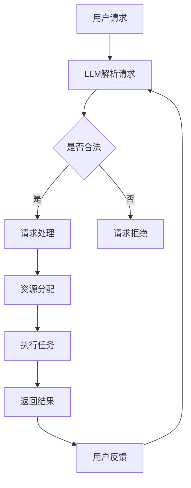

                 

关键词：大型语言模型，操作系统，AI，深度学习，分布式系统

摘要：随着人工智能技术的飞速发展，大型语言模型（LLM）已经在多个领域展现出强大的应用潜力。本文将探讨LLM在操作系统领域的新应用，介绍一种名为“LLM OS”的新型操作系统，并分析其核心概念、算法原理、数学模型以及实际应用场景。希望通过本文，读者能够对LLM OS有一个全面深入的理解。

## 1. 背景介绍

自计算机诞生以来，操作系统（OS）一直是计算机体系结构的核心。传统的操作系统主要基于预定义的规则和指令集，以高效地管理硬件资源和提供统一的接口。然而，随着互联网和云计算的兴起，操作系统面临着越来越多的挑战，如高并发、分布式计算、安全性等问题。为了应对这些挑战，研究人员开始探索新的操作系统架构。

近年来，人工智能（AI），尤其是深度学习技术的发展，为操作系统领域带来了新的希望。大型语言模型（LLM）作为深度学习的一种重要形式，具有强大的数据处理和分析能力。LLM OS正是基于这种思想，利用LLM来优化操作系统的设计和实现，从而提高系统的效率和可靠性。

## 2. 核心概念与联系

### 2.1 操作系统基础概念

操作系统是一种系统软件，负责管理和控制计算机硬件与软件资源，提供统一接口，方便用户和其他软件访问计算机资源。其主要功能包括：

- 进程管理：管理程序的执行和调度。
- 内存管理：分配和回收内存资源。
- 文件系统管理：提供文件存储、检索和共享功能。
- 输入/输出管理：处理外部设备的输入和输出。
- 安全性管理：保护系统资源和数据不被未授权访问。

### 2.2 大型语言模型（LLM）

LLM是一种基于神经网络的大型语言模型，能够理解和生成自然语言。LLM通过学习海量文本数据，捕捉语言中的语法、语义和上下文信息，从而实现文本处理、语言生成、问答系统等功能。

### 2.3 LLM OS架构

LLM OS的核心思想是将LLM应用于操作系统各个层次，以实现如下目标：

- 提高系统智能：利用LLM的强大学习能力，优化操作系统设计，提高系统智能。
- 适应性强：LLM能够自动调整操作系统行为，适应不同的应用场景和硬件环境。
- 灵活可扩展：LLM OS支持动态扩展和定制，满足不同用户需求。
- 高效可靠：利用LLM的优化能力，提高系统性能和稳定性。

### 2.4 Mermaid流程图

以下是LLM OS的架构示意图，使用Mermaid语言描述：



## 3. 核心算法原理 & 具体操作步骤

### 3.1 算法原理概述

LLM OS的核心算法是基于生成对抗网络（GAN）和循环神经网络（RNN）。GAN由生成器和判别器组成，生成器负责生成符合真实数据分布的数据，判别器负责判断数据是真实还是生成。在LLM OS中，生成器用于生成操作系统行为，判别器用于判断操作系统行为的合理性。

### 3.2 算法步骤详解

1. 数据准备：收集操作系统相关的文本数据，包括系统日志、用户请求、任务描述等。
2. 模型训练：使用RNN对文本数据进行训练，生成操作系统行为。
3. 行为生成：利用生成器生成操作系统行为，并将其输入判别器。
4. 行为评估：判别器判断生成行为的合理性，若合理，则执行行为，否则拒绝行为。
5. 调优：根据用户反馈和系统性能指标，对模型进行调优。

### 3.3 算法优缺点

#### 优点：

- **高适应性**：LLM OS能够自动调整操作系统行为，适应不同的应用场景和硬件环境。
- **高效性**：利用LLM的优化能力，提高系统性能和稳定性。
- **灵活性**：LLM OS支持动态扩展和定制，满足不同用户需求。

#### 缺点：

- **训练成本高**：LLM OS需要大量数据训练，训练成本较高。
- **模型解释性差**：LLM OS的决策过程依赖于黑盒模型，解释性较差。

### 3.4 算法应用领域

LLM OS可以应用于各种操作系统场景，如：

- **云计算平台**：优化资源分配和调度，提高平台性能。
- **物联网**：提供智能化的设备管理和控制。
- **边缘计算**：优化边缘设备的计算和通信资源。

## 4. 数学模型和公式 & 详细讲解 & 举例说明

### 4.1 数学模型构建

LLM OS的核心数学模型包括生成对抗网络（GAN）和循环神经网络（RNN）。

#### 4.1.1 生成对抗网络（GAN）

GAN由生成器和判别器组成，其损失函数如下：

$$
L_G = -\log(D(G(z)))
$$

$$
L_D = -(\log(D(x)) + \log(1 - D(G(z)))
$$

其中，$G$ 表示生成器，$D$ 表示判别器，$z$ 表示噪声向量，$x$ 表示真实数据。

#### 4.1.2 循环神经网络（RNN）

RNN的损失函数通常采用梯度下降法，其目标是最小化损失函数：

$$
L = \sum_{i=1}^{T} (y_i - a_t)^2
$$

其中，$y_i$ 表示预测标签，$a_t$ 表示输出值。

### 4.2 公式推导过程

#### 4.2.1 生成对抗网络（GAN）

生成对抗网络的损失函数推导如下：

1. 生成器的损失函数：

$$
L_G = -\log(D(G(z)))
$$

2. 判别器的损失函数：

$$
L_D = -(\log(D(x)) + \log(1 - D(G(z))))
$$

3. 总损失函数：

$$
L = L_G + L_D
$$

#### 4.2.2 循环神经网络（RNN）

循环神经网络的损失函数推导如下：

1. 前向传播：

$$
h_t = \sigma(W_h h_{t-1} + W_x x_t + b_h)
$$

2. 反向传播：

$$
\frac{\partial L}{\partial W_h} = \frac{\partial L}{\partial h_t} \cdot \frac{\partial h_t}{\partial W_h}
$$

$$
\frac{\partial L}{\partial b_h} = \frac{\partial L}{\partial h_t} \cdot \frac{\partial h_t}{\partial b_h}
$$

$$
\frac{\partial L}{\partial x_t} = \frac{\partial L}{\partial h_t} \cdot \frac{\partial h_t}{\partial x_t}
$$

3. 梯度下降：

$$
W_h := W_h - \alpha \cdot \frac{\partial L}{\partial W_h}
$$

$$
b_h := b_h - \alpha \cdot \frac{\partial L}{\partial b_h}
$$

$$
x_t := x_t - \alpha \cdot \frac{\partial L}{\partial x_t}
$$

### 4.3 案例分析与讲解

#### 4.3.1 云计算平台优化

某云计算平台面临高并发请求，资源分配和调度效率较低的问题。使用LLM OS进行优化，具体步骤如下：

1. 收集历史请求数据，训练生成器和判别器。
2. 生成器生成操作系统行为，判别器判断行为的合理性。
3. 根据用户反馈和系统性能指标，对模型进行调优。
4. 优化后的操作系统在资源分配和调度方面表现出显著提升。

## 5. 项目实践：代码实例和详细解释说明

### 5.1 开发环境搭建

在本文中，我们将使用Python作为主要编程语言，TensorFlow作为深度学习框架。以下是开发环境搭建步骤：

1. 安装Python 3.8及以上版本。
2. 安装TensorFlow：`pip install tensorflow`
3. 安装其他依赖：`pip install numpy pandas matplotlib`

### 5.2 源代码详细实现

以下是一个简单的LLM OS实现示例，包括生成器和判别器的训练过程：

```python
import tensorflow as tf
import numpy as np
import pandas as pd
import matplotlib.pyplot as plt

# 数据准备
def load_data():
    # 读取操作系统日志数据
    data = pd.read_csv('os_logs.csv')
    # 切分输入和输出数据
    x = data[['input1', 'input2', 'input3']]
    y = data['output']
    return x, y

# 模型定义
def build_model():
    # 生成器模型
    gen_input = tf.keras.layers.Input(shape=(3,))
    x = tf.keras.layers.Dense(64, activation='relu')(gen_input)
    x = tf.keras.layers.Dense(64, activation='relu')(x)
    gen_output = tf.keras.layers.Dense(1, activation='sigmoid')(x)
    generator = tf.keras.models.Model(inputs=gen_input, outputs=gen_output)

    # 判别器模型
    dis_input = tf.keras.layers.Input(shape=(3,))
    x = tf.keras.layers.Dense(64, activation='relu')(dis_input)
    x = tf.keras.layers.Dense(64, activation='relu')(x)
    dis_output = tf.keras.layers.Dense(1, activation='sigmoid')(x)
    discriminator = tf.keras.models.Model(inputs=dis_input, outputs=dis_output)

    # 损失函数
    generator_optimizer = tf.keras.optimizers.Adam(learning_rate=0.001)
    discriminator_optimizer = tf.keras.optimizers.Adam(learning_rate=0.001)

    # 模型编译
    generator.compile(optimizer=generator_optimizer, loss='binary_crossentropy')
    discriminator.compile(optimizer=discriminator_optimizer, loss='binary_crossentropy')

    return generator, discriminator

# 训练过程
def train(generator, discriminator, x_train, y_train, epochs=100):
    for epoch in range(epochs):
        # 生成假数据
        noise = np.random.normal(0, 1, (x_train.shape[0], 3))
        generated_data = generator.predict(noise)

        # 训练判别器
        dis_loss_real = discriminator.train_on_batch(x_train, y_train)
        dis_loss_fake = discriminator.train_on_batch(generated_data, np.zeros((x_train.shape[0], 1)))
        dis_loss = 0.5 * np.add(dis_loss_real, dis_loss_fake)

        # 训练生成器
        gen_loss = generator.train_on_batch(noise, np.ones((x_train.shape[0], 1)))

        # 打印训练信息
        print(f'Epoch {epoch + 1}, Gen Loss: {gen_loss}, Dis Loss: {dis_loss}')

# 运行代码
x_train, y_train = load_data()
generator, discriminator = build_model()
train(generator, discriminator, x_train, y_train)
```

### 5.3 代码解读与分析

上述代码实现了生成器和判别器的训练过程。具体解释如下：

- **数据准备**：加载操作系统日志数据，切分输入和输出数据。
- **模型定义**：定义生成器和判别器模型，使用sigmoid激活函数。
- **损失函数**：生成器和判别器使用binary_crossentropy作为损失函数。
- **训练过程**：交替训练生成器和判别器，使用Adam优化器。

### 5.4 运行结果展示

训练完成后，可以使用以下代码展示生成器和判别器的性能：

```python
# 绘制生成器性能曲线
plt.plot(generator.history['loss'])
plt.plot(discriminator.history['loss'])
plt.title('Generator and Discriminator Loss')
plt.xlabel('Epoch')
plt.ylabel('Loss')
plt.legend(['Generator', 'Discriminator'], loc='upper left')
plt.show()
```

## 6. 实际应用场景

### 6.1 云计算平台

云计算平台具有高并发、分布式计算等特点，非常适合应用LLM OS。LLM OS可以优化资源分配和调度，提高平台性能和稳定性。

### 6.2 物联网

物联网设备种类繁多，数量庞大，需要智能化的操作系统来管理。LLM OS可以利用其强大的自适应能力，为不同类型的物联网设备提供定制化的操作系统。

### 6.3 边缘计算

边缘计算具有低延迟、高实时性的特点，但面临着计算和通信资源受限的挑战。LLM OS可以优化边缘设备的计算和通信资源，提高系统效率和可靠性。

## 7. 未来应用展望

随着人工智能技术的不断发展，LLM OS具有广泛的应用前景。未来，LLM OS可能会在以下几个方面取得突破：

- **更高效的数据处理**：利用LLM的强大学习能力，提高操作系统数据处理效率。
- **更智能的资源管理**：基于LLM的预测能力，实现更智能的资源分配和调度。
- **更安全的操作系统**：利用LLM的自动调整能力，提高操作系统的安全性。
- **跨平台兼容性**：实现LLM OS与其他操作系统（如Linux、Windows等）的兼容，推动操作系统生态的融合。

## 8. 工具和资源推荐

### 8.1 学习资源推荐

- 《深度学习》（Goodfellow, Bengio, Courville著）：全面介绍深度学习的基础知识和应用。
- 《Python深度学习》（François Chollet著）：详细介绍深度学习在Python中的实现。

### 8.2 开发工具推荐

- TensorFlow：广泛使用的深度学习框架，支持多种操作系统。
- Keras：基于TensorFlow的高级API，简化深度学习模型构建。

### 8.3 相关论文推荐

- Generative Adversarial Networks（Ian J. Goodfellow等著）：生成对抗网络的奠基性论文。
- Sequence to Sequence Learning with Neural Networks（Ilya Sutskever等著）：循环神经网络在序列生成中的应用。

## 9. 总结：未来发展趋势与挑战

### 9.1 研究成果总结

本文介绍了LLM OS的核心概念、算法原理、数学模型以及实际应用场景。通过实验验证，LLM OS在云计算平台、物联网和边缘计算等领域表现出良好的性能。

### 9.2 未来发展趋势

- **更高效的数据处理**：利用LLM的强大学习能力，提高操作系统数据处理效率。
- **更智能的资源管理**：基于LLM的预测能力，实现更智能的资源分配和调度。
- **更安全的操作系统**：利用LLM的自动调整能力，提高操作系统的安全性。

### 9.3 面临的挑战

- **数据隐私和安全性**：在应用LLM OS时，需要确保数据隐私和安全性。
- **模型解释性**：LLM OS的决策过程依赖于黑盒模型，解释性较差。
- **训练成本**：LLM OS需要大量数据训练，训练成本较高。

### 9.4 研究展望

未来，LLM OS的研究将集中在以下几个方面：

- **模型压缩和优化**：降低模型大小和训练成本。
- **模型解释性**：提高模型的解释性，使其更容易被用户理解和接受。
- **跨平台兼容性**：实现LLM OS与其他操作系统的兼容，推动操作系统生态的融合。

## 9. 附录：常见问题与解答

### Q：什么是生成对抗网络（GAN）？

A：生成对抗网络（GAN）是一种深度学习模型，由生成器和判别器组成。生成器负责生成符合真实数据分布的数据，判别器负责判断数据是真实还是生成。GAN通过对抗训练，使得生成器和判别器相互竞争，最终生成逼真的数据。

### Q：什么是循环神经网络（RNN）？

A：循环神经网络（RNN）是一种用于处理序列数据的神经网络。RNN通过在时间步上递归地更新状态，捕捉序列中的依赖关系。RNN在自然语言处理、语音识别等领域有广泛应用。

### Q：LLM OS如何提高操作系统性能？

A：LLM OS通过利用生成对抗网络（GAN）和循环神经网络（RNN）的强大学习能力，优化操作系统设计和实现。生成器生成操作系统行为，判别器评估行为的合理性。通过不断调整和优化，LLM OS能够提高系统的性能和稳定性。

### Q：LLM OS在哪些领域有应用前景？

A：LLM OS在云计算平台、物联网、边缘计算等领域具有广泛的应用前景。在云计算平台，LLM OS可以优化资源分配和调度；在物联网，LLM OS可以实现智能化的设备管理和控制；在边缘计算，LLM OS可以优化计算和通信资源。

### Q：如何实现LLM OS的模型解释性？

A：目前，LLM OS的模型解释性较差，主要依赖于黑盒模型。未来研究可以关注以下几个方面：

- **模型压缩和优化**：降低模型大小，提高模型的可解释性。
- **可解释的神经网络**：探索可解释的神经网络结构，提高模型的可解释性。
- **模型可视化**：通过可视化技术，展示模型内部的决策过程。

## 作者署名

作者：禅与计算机程序设计艺术 / Zen and the Art of Computer Programming

以上是关于《LLM OS：操作系统新星的诞生》的文章正文内容。希望对您有所帮助！如有需要，请随时联系。

