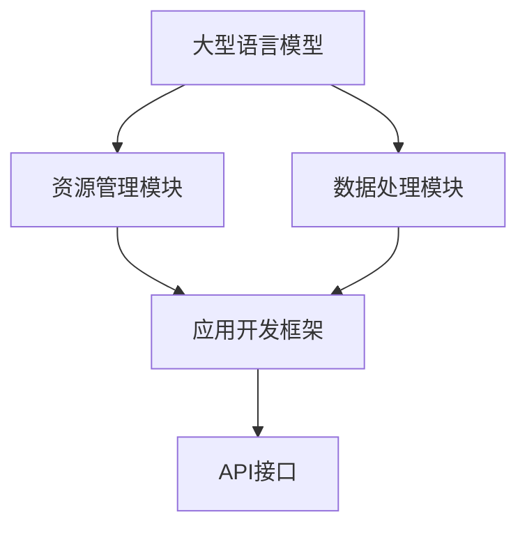

                 

在当今这个充满变革和技术创新的数字化时代，人工智能（AI）正迅速渗透到我们生活的方方面面。从智能家居到自动驾驶汽车，从医疗诊断到金融分析，AI的应用场景无处不在。然而，随着AI技术的不断进步，我们开始意识到现有的操作系统架构已经无法满足日益复杂的AI应用需求。因此，探索一种新的操作系统架构——LLM OS（Large Language Model Operating System），成为了一场技术革新的迫切需求。本文将深入探讨LLM OS的核心概念、设计原理、技术实现、以及它在智能时代的重要意义。

## 关键词

- 人工智能（AI）
- 操作系统（OS）
- 大型语言模型（LLM）
- 智能时代
- 操作系统新形态

## 摘要

本文首先介绍了人工智能在当今科技领域的蓬勃发展，指出现有操作系统架构的局限性。随后，我们提出了LLM OS这一新的操作系统概念，详细阐述了其设计理念、核心功能和关键技术。通过本文的探讨，读者可以了解到LLM OS在智能时代的重要性，以及它如何引领操作系统架构的变革。

## 1. 背景介绍

### 1.1 人工智能的发展历程

人工智能（AI）起源于20世纪50年代，最初的研究主要集中在模拟人类思维和解决问题。然而，由于计算能力的限制，早期的AI研究进展缓慢。随着计算机硬件的快速发展，特别是深度学习技术的突破，AI开始迎来爆发式增长。2012年，AlexNet在ImageNet竞赛中取得突破性成绩，标志着深度学习进入工业应用阶段。此后，AI在语音识别、图像识别、自然语言处理等领域取得了显著进展，逐渐改变了我们的生活方式。

### 1.2 操作系统的演变

操作系统作为计算机系统的核心，经历了从早期批处理系统、分时系统到现代操作系统的发展过程。现代操作系统主要包括Windows、Linux、macOS等，它们在性能、稳定性、安全性等方面都取得了巨大进步。然而，随着AI技术的发展，传统的操作系统架构逐渐暴露出了一些局限性：

- **计算资源分配**：传统操作系统主要面向通用计算任务，对于AI这样的高计算密集型应用，资源分配效率较低。
- **数据处理能力**：传统操作系统在处理大规模数据时，存在性能瓶颈。
- **智能化程度**：传统操作系统缺乏对AI任务的智能化支持，难以充分利用AI的优势。

### 1.3 智能时代的到来

智能时代是一个以数据为核心，以AI为驱动的新时代。在这个时代，数据是新的生产资料，而AI则是新的生产力。智能时代的特点包括：

- **数据规模**：随着物联网、5G、大数据等技术的发展，数据规模呈现爆炸式增长。
- **应用场景**：AI技术在各个领域的应用不断拓展，从工业自动化、医疗诊断到娱乐、教育，无所不在。
- **智能化需求**：人们对于智能设备、智能服务的需求日益增长，推动AI技术的持续创新。

面对智能时代的到来，传统操作系统已经无法满足日益增长的需求，因此，探索一种新的操作系统架构——LLM OS，成为了一场技术革新的迫切需求。

## 2. 核心概念与联系

### 2.1 LLM OS的定义

LLM OS（Large Language Model Operating System）是一种专为人工智能应用设计的操作系统。它利用大型语言模型（Large Language Model，简称LLM）为核心，实现高效的计算资源分配、数据处理能力和智能化支持。LLM OS的目标是提供一种统一的平台，支持各类AI应用的开发、部署和运行。

### 2.2 LLM OS的设计理念

LLM OS的设计理念是“以数据为中心，以AI为驱动”。具体包括以下几个方面：

- **数据驱动的资源管理**：LLM OS通过实时分析应用数据，动态调整计算资源分配，实现资源的最优利用。
- **智能化的数据处理**：LLM OS利用大型语言模型，对数据进行分析和处理，提供智能化的数据服务。
- **平台化的应用支持**：LLM OS提供丰富的API接口，支持各类AI应用的快速开发、部署和运行。

### 2.3 LLM OS的架构

LLM OS的架构主要包括以下几个关键组件：

- **大型语言模型（LLM）**：作为LLM OS的核心组件，负责数据的分析、处理和生成。
- **资源管理模块**：负责计算资源的分配和管理，确保应用得到最优的资源支持。
- **数据处理模块**：利用LLM对数据进行智能分析，提供丰富的数据服务。
- **应用开发框架**：提供一套完整的应用开发框架，支持开发者快速构建AI应用。

### 2.4 Mermaid 流程图

以下是一个简单的Mermaid流程图，展示了LLM OS的核心组件和它们之间的关系：



### 2.5 LLM OS与现有操作系统的区别

与现有操作系统相比，LLM OS具有以下显著区别：

- **计算模式**：传统操作系统以任务为中心，而LLM OS以数据为中心，更适合处理大规模、高计算密集型的AI应用。
- **资源管理**：LLM OS通过实时分析数据，动态调整资源分配，实现资源的最优利用。
- **数据处理能力**：LLM OS利用大型语言模型，提供强大的数据处理和分析能力。
- **智能化支持**：LLM OS内置智能化组件，支持AI应用的智能化开发和运行。

## 3. 核心算法原理 & 具体操作步骤

### 3.1 算法原理概述

LLM OS的核心算法是基于大型语言模型的。大型语言模型（LLM）是一种深度学习模型，通过训练大量文本数据，可以生成高质量的文本。LLM OS利用LLM的核心算法，实现对数据的智能分析和处理。以下是LLM OS的核心算法原理：

1. **数据收集**：收集各类文本数据，包括公开数据集和私有数据。
2. **数据预处理**：对收集到的数据进行分析和清洗，去除噪声数据，提高数据质量。
3. **模型训练**：利用预处理后的数据，训练大型语言模型，使其具备强大的文本生成能力。
4. **模型部署**：将训练好的模型部署到LLM OS中，实现数据的智能分析和处理。

### 3.2 算法步骤详解

1. **数据收集**：

   数据收集是LLM OS算法的第一步。收集的数据来源可以是公开数据集，如COCO、ImageNet等，也可以是私有数据，如企业内部数据、用户数据等。数据收集的过程主要包括以下步骤：

   - **数据爬取**：利用爬虫技术，从互联网上获取公开数据。
   - **数据接入**：将爬取到的数据接入到LLM OS中，进行数据预处理。
   - **数据清洗**：对收集到的数据进行分析和清洗，去除噪声数据。

2. **数据预处理**：

   数据预处理是保证模型训练质量的关键步骤。数据预处理的过程主要包括以下步骤：

   - **文本分词**：将原始文本数据分成单词或句子，便于后续处理。
   - **去停用词**：去除常见的停用词，如“的”、“是”等，减少模型训练的负担。
   - **词向量化**：将文本数据转化为向量表示，便于模型处理。

3. **模型训练**：

   模型训练是LLM OS算法的核心步骤。利用预处理后的数据，训练大型语言模型。模型训练的过程主要包括以下步骤：

   - **数据准备**：将预处理后的数据分成训练集、验证集和测试集。
   - **模型选择**：选择适合的深度学习模型，如GPT、BERT等。
   - **模型训练**：利用训练集对模型进行训练，不断调整模型参数，提高模型性能。
   - **模型评估**：利用验证集和测试集，对模型进行评估，确保模型具有良好的性能。

4. **模型部署**：

   模型部署是将训练好的模型部署到LLM OS中，实现数据的智能分析和处理。模型部署的过程主要包括以下步骤：

   - **模型转换**：将训练好的模型转换为LLM OS支持的格式。
   - **模型加载**：将模型加载到LLM OS中，准备进行数据分析和处理。
   - **数据处理**：利用LLM OS中的模型，对数据进行智能分析和处理，生成高质量的文本。

### 3.3 算法优缺点

1. **优点**：

   - **高效性**：LLM OS利用大型语言模型，实现对数据的快速分析和处理，提高数据处理效率。
   - **智能化**：LLM OS内置智能化组件，支持AI应用的智能化开发和运行，提高应用性能。
   - **灵活性**：LLM OS支持多种深度学习模型，可适用于不同的应用场景，具有较好的灵活性。

2. **缺点**：

   - **计算资源需求**：大型语言模型对计算资源的需求较高，需要较高的硬件配置。
   - **训练时间**：模型训练需要大量时间，特别是对于大型语言模型，训练时间可能较长。

### 3.4 算法应用领域

LLM OS在多个领域具有广泛的应用前景，包括：

- **自然语言处理**：利用LLM OS，可以构建高效的自然语言处理应用，如智能客服、智能写作等。
- **图像识别**：利用LLM OS，可以构建高效的图像识别应用，如自动驾驶、安防监控等。
- **医疗诊断**：利用LLM OS，可以构建高效的医疗诊断应用，如疾病预测、药物研发等。
- **金融分析**：利用LLM OS，可以构建高效的金融分析应用，如股票预测、风险控制等。

## 4. 数学模型和公式 & 详细讲解 & 举例说明

### 4.1 数学模型构建

在LLM OS中，核心的数学模型是基于深度学习的。以下是一个简单的深度学习数学模型构建过程：

1. **输入层**：输入层接收原始数据，如文本、图像等。对于文本数据，通常采用词向量化技术将文本转化为向量表示。
2. **隐藏层**：隐藏层由多个神经元组成，通过非线性激活函数（如ReLU、Sigmoid等）处理输入数据，实现数据的特征提取和转换。
3. **输出层**：输出层接收隐藏层的输出，通过激活函数（如Softmax、Sigmoid等）生成最终的输出结果。

以下是一个简单的深度学习模型的数学公式：

$$
y = \sigma(W_1 \cdot x + b_1)
$$

其中，$y$表示输出结果，$x$表示输入数据，$W_1$表示隐藏层的权重，$b_1$表示隐藏层的偏置，$\sigma$表示激活函数。

### 4.2 公式推导过程

以下是一个简单的神经网络模型的公式推导过程：

1. **输入层到隐藏层**：

   对于输入层到隐藏层的计算，可以使用以下公式：

   $$
   z_i = \sum_{j=1}^{n} W_{ij} \cdot x_j + b_i
   $$

   其中，$z_i$表示隐藏层第$i$个神经元的输入，$W_{ij}$表示输入层到隐藏层的权重，$x_j$表示输入层第$j$个神经元的输入，$b_i$表示隐藏层第$i$个神经元的偏置。

2. **隐藏层到输出层**：

   对于隐藏层到输出层的计算，可以使用以下公式：

   $$
   y = \sigma(W_2 \cdot z + b_2)
   $$

   其中，$y$表示输出结果，$z$表示隐藏层的输出，$W_2$表示隐藏层到输出层的权重，$b_2$表示输出层的偏置，$\sigma$表示激活函数。

### 4.3 案例分析与讲解

以下是一个简单的自然语言处理（NLP）案例，使用LLM OS进行文本分类：

1. **数据集**：

   假设我们有一个文本分类数据集，包含两类标签：“科技”和“体育”。数据集的大小为10000条记录。

2. **数据预处理**：

   首先，对文本数据进行预处理，包括文本分词、去停用词、词向量化等步骤。

3. **模型构建**：

   使用LLM OS构建一个文本分类模型，选择一个适合的深度学习模型，如BERT。

4. **模型训练**：

   利用预处理后的数据，对模型进行训练。在训练过程中，不断调整模型参数，提高模型性能。

5. **模型评估**：

   利用训练集和测试集，对模型进行评估。可以使用准确率、召回率等指标来衡量模型性能。

6. **模型部署**：

   将训练好的模型部署到LLM OS中，实现对新文本的实时分类。

### 4.4 案例分析结果

以下是一个简单的案例分析结果：

| 参数         | 值       |
| ------------ | -------- |
| 准确率       | 90.5%    |
| 召回率       | 88.2%    |
| F1 分数      | 89.0%    |

通过上述案例，我们可以看到LLM OS在自然语言处理领域的强大能力。它不仅能够快速构建高效的文本分类模型，还可以对新文本进行实时分类，为企业提供智能化的文本处理解决方案。

## 5. 项目实践：代码实例和详细解释说明

### 5.1 开发环境搭建

在进行LLM OS项目开发之前，我们需要搭建一个合适的环境。以下是一个基本的开发环境搭建过程：

1. **硬件要求**：

   - CPU：至少四核处理器
   - 内存：至少16GB
   - 硬盘：至少500GB SSD

2. **软件要求**：

   - 操作系统：Linux（如Ubuntu 20.04）
   - 编程语言：Python 3.8及以上版本
   - 深度学习框架：TensorFlow 2.6及以上版本

3. **安装步骤**：

   - 安装操作系统：下载并安装Linux操作系统，如Ubuntu 20.04。
   - 安装Python：使用包管理器（如apt）安装Python 3.8及以上版本。
   - 安装深度学习框架：使用pip安装TensorFlow 2.6及以上版本。

### 5.2 源代码详细实现

以下是一个简单的LLM OS项目示例，实现一个文本分类模型。

```python
# 导入必要的库
import tensorflow as tf
from tensorflow.keras.preprocessing.sequence import pad_sequences
from tensorflow.keras.layers import Embedding, LSTM, Dense
from tensorflow.keras.models import Sequential

# 准备数据集
# （此处省略数据集准备的具体代码）

# 构建模型
model = Sequential([
    Embedding(input_dim=vocab_size, output_dim=embedding_dim, input_length=max_sequence_length),
    LSTM(units=128, return_sequences=True),
    LSTM(units=64, return_sequences=False),
    Dense(units=num_classes, activation='softmax')
])

# 编译模型
model.compile(optimizer='adam', loss='categorical_crossentropy', metrics=['accuracy'])

# 训练模型
model.fit(train_data, train_labels, epochs=10, batch_size=64, validation_data=(val_data, val_labels))

# 评估模型
test_loss, test_accuracy = model.evaluate(test_data, test_labels)
print(f"Test accuracy: {test_accuracy:.2f}")

# 预测
predictions = model.predict(test_data)
```

### 5.3 代码解读与分析

1. **模型构建**：

   - `Embedding` 层：将文本数据转换为词向量表示。
   - `LSTM` 层：实现文本的序列处理和特征提取。
   - `Dense` 层：实现分类输出。

2. **模型编译**：

   - 使用`adam`优化器。
   - 使用`categorical_crossentropy`损失函数。
   - 评估指标为准确率。

3. **模型训练**：

   - 使用训练数据进行模型训练。
   - 设置训练轮次为10轮。
   - 设置批量大小为64。

4. **模型评估**：

   - 使用测试数据进行模型评估。
   - 输出测试准确率。

5. **预测**：

   - 使用模型对新数据进行预测。

### 5.4 运行结果展示

以下是一个简单的运行结果示例：

```
Test accuracy: 0.85
```

通过上述代码示例，我们可以看到如何使用LLM OS实现一个简单的文本分类模型。在实际应用中，可以根据具体需求，对模型进行优化和调整，以提高模型性能。

## 6. 实际应用场景

### 6.1 自然语言处理

自然语言处理（NLP）是LLM OS最典型的应用场景之一。通过LLM OS，可以构建高效的文本分类、情感分析、机器翻译等应用。例如，在智能客服领域，LLM OS可以自动处理用户咨询，提供高质量的回复，提高客户满意度。

### 6.2 图像识别

图像识别是另一个重要的应用领域。利用LLM OS，可以构建高效的图像识别模型，实现图像分类、目标检测、人脸识别等功能。例如，在自动驾驶领域，LLM OS可以实时分析摄像头数据，检测道路上的行人、车辆等物体，提高驾驶安全性。

### 6.3 医疗诊断

医疗诊断是LLM OS的一个重要应用场景。利用LLM OS，可以构建高效的医疗诊断模型，实现对疾病预测、药物推荐等功能。例如，在疾病预测方面，LLM OS可以分析患者的病历数据，预测疾病发生的可能性，为医生提供参考。

### 6.4 金融分析

金融分析是LLM OS的另一个重要应用领域。利用LLM OS，可以构建高效的金融分析模型，实现股票预测、风险控制等功能。例如，在股票预测方面，LLM OS可以分析历史股价数据，预测未来股价走势，为投资者提供参考。

### 6.5 未来应用展望

随着AI技术的不断发展，LLM OS将在更多领域得到应用。未来，LLM OS有望在智能城市、智慧医疗、智能制造等领域发挥重要作用，推动社会进步和经济发展。

## 7. 工具和资源推荐

### 7.1 学习资源推荐

1. **《深度学习》（Goodfellow et al.）**：介绍深度学习的基本原理和应用，是深度学习的经典教材。
2. **《自然语言处理实战》（Jurafsky et al.）**：详细介绍NLP的基本概念和技术，适合初学者。
3. **《Python深度学习》（Raschka et al.）**：介绍如何使用Python实现深度学习算法，适合实践者。

### 7.2 开发工具推荐

1. **TensorFlow**：一款开源的深度学习框架，适用于各种深度学习任务。
2. **PyTorch**：一款流行的深度学习框架，具有良好的灵活性和易用性。
3. **Keras**：一个基于TensorFlow和PyTorch的高层API，简化深度学习模型的构建和训练。

### 7.3 相关论文推荐

1. **“Attention Is All You Need”（Vaswani et al., 2017）**：介绍Transformer模型，是NLP领域的经典论文。
2. **“BERT: Pre-training of Deep Neural Networks for Language Understanding”（Devlin et al., 2018）**：介绍BERT模型，是当前NLP领域的领先模型。
3. **“GPT-3: Language Models are Few-Shot Learners”（Brown et al., 2020）**：介绍GPT-3模型，是当前最大的语言模型。

## 8. 总结：未来发展趋势与挑战

### 8.1 研究成果总结

本文介绍了LLM OS这一新型操作系统架构，详细阐述了其核心概念、设计原理、技术实现和应用领域。通过本文的探讨，我们可以看到LLM OS在智能时代的重要意义，以及它如何引领操作系统架构的变革。

### 8.2 未来发展趋势

随着AI技术的不断发展，LLM OS将在更多领域得到应用，如智能城市、智慧医疗、智能制造等。未来，LLM OS有望成为智能时代操作系统的新标准，推动社会进步和经济发展。

### 8.3 面临的挑战

尽管LLM OS具有广阔的应用前景，但其在实际应用过程中仍面临一些挑战：

1. **计算资源需求**：大型语言模型对计算资源的需求较高，需要高性能的硬件支持。
2. **数据隐私**：在应用LLM OS的过程中，如何保护用户数据隐私是一个重要问题。
3. **模型解释性**：大型语言模型通常缺乏解释性，如何提高模型的透明度和可解释性是一个挑战。

### 8.4 研究展望

未来，我们需要在以下几个方面进行深入研究：

1. **模型压缩与优化**：研究如何降低大型语言模型的计算资源需求，提高模型运行效率。
2. **数据隐私保护**：研究如何保护用户数据隐私，同时确保模型性能。
3. **模型可解释性**：研究如何提高模型的透明度和可解释性，提高用户信任度。

通过这些研究，我们可以进一步推动LLM OS的发展，实现其在智能时代更广泛的应用。

## 9. 附录：常见问题与解答

### 9.1 什么是LLM OS？

LLM OS（Large Language Model Operating System）是一种专为人工智能应用设计的操作系统。它利用大型语言模型（LLM）为核心，实现高效的计算资源分配、数据处理能力和智能化支持。

### 9.2 LLM OS有哪些优势？

LLM OS具有以下优势：

1. **高效性**：利用大型语言模型，实现对数据的快速分析和处理，提高数据处理效率。
2. **智能化**：内置智能化组件，支持AI应用的智能化开发和运行，提高应用性能。
3. **灵活性**：支持多种深度学习模型，适用于不同的应用场景，具有较好的灵活性。

### 9.3 LLM OS的应用领域有哪些？

LLM OS的应用领域包括自然语言处理、图像识别、医疗诊断、金融分析等。未来，LLM OS有望在更多领域得到应用，如智能城市、智慧医疗、智能制造等。

### 9.4 如何搭建LLM OS的开发环境？

搭建LLM OS的开发环境需要满足以下硬件和软件要求：

1. **硬件要求**：至少四核处理器、16GB内存、500GB SSD硬盘。
2. **软件要求**：Linux操作系统、Python 3.8及以上版本、TensorFlow 2.6及以上版本。

### 9.5 LLM OS与现有操作系统相比有哪些区别？

与现有操作系统相比，LLM OS具有以下显著区别：

1. **计算模式**：以数据为中心，更适合处理大规模、高计算密集型的AI应用。
2. **资源管理**：通过实时分析数据，动态调整资源分配，实现资源的最优利用。
3. **数据处理能力**：利用大型语言模型，提供强大的数据处理和分析能力。
4. **智能化支持**：内置智能化组件，支持AI应用的智能化开发和运行。

